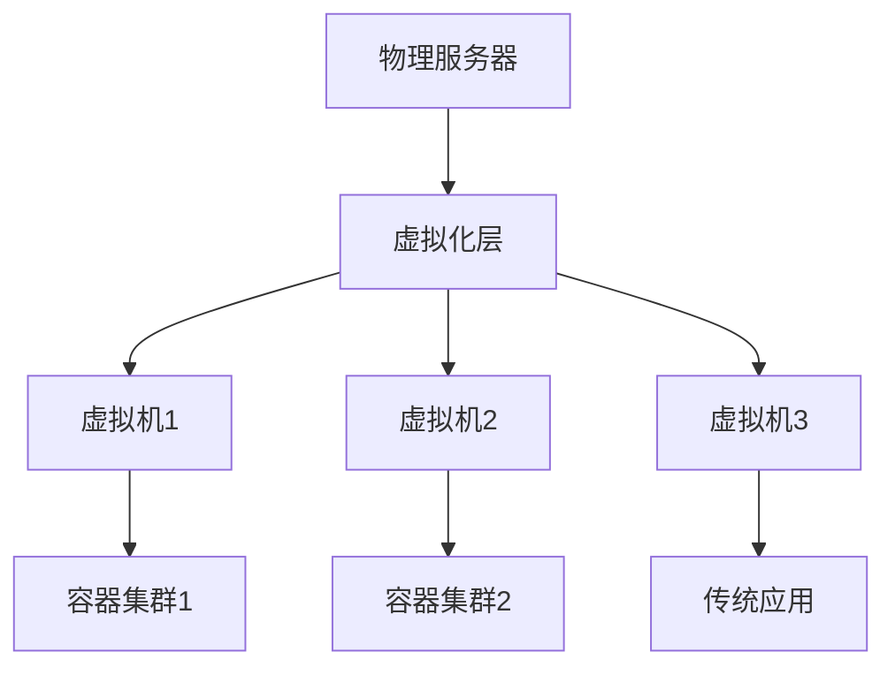
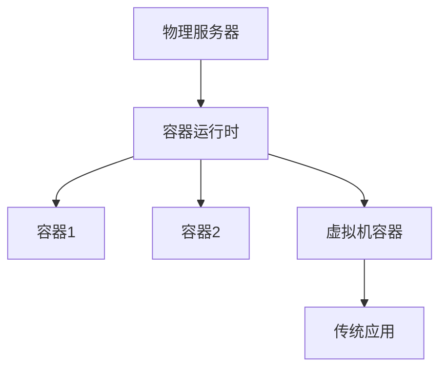

# 虚拟化容器化技术实施指南

## 主题

**虚拟化与容器化技术的完整实施路径、最佳实践与操作指南**:

## 目录

- [虚拟化容器化技术实施指南](#虚拟化容器化技术实施指南)
  - [主题](#主题)
  - [1. 实施概述](#1-实施概述)
    - [1.1 实施目标](#11-实施目标)
    - [1.2 实施原则](#12-实施原则)
    - [1.3 实施阶段](#13-实施阶段)
  - [2. 技术选型指南](#2-技术选型指南)
    - [2.1 虚拟化技术选型](#21-虚拟化技术选型)
      - [2.1.1 选型标准](#211-选型标准)
      - [2.1.2 主流方案对比](#212-主流方案对比)
    - [2.2 容器化技术选型](#22-容器化技术选型)
      - [2.2.1 容器运行时选择](#221-容器运行时选择)
      - [2.2.2 容器编排选择](#222-容器编排选择)
    - [2.3 混合架构设计](#23-混合架构设计)
      - [2.3.1 架构模式](#231-架构模式)
      - [2.3.2 选择策略](#232-选择策略)
  - [3. 环境准备](#3-环境准备)
    - [3.1 硬件要求](#31-硬件要求)
      - [3.1.1 服务器配置](#311-服务器配置)
      - [3.1.2 网络设备](#312-网络设备)
    - [3.2 软件环境](#32-软件环境)
      - [3.2.1 操作系统选择](#321-操作系统选择)
      - [3.2.2 管理工具](#322-管理工具)
    - [3.3 网络规划](#33-网络规划)
      - [3.3.1 网络架构](#331-网络架构)
      - [3.3.2 IP地址规划](#332-ip地址规划)
  - [4. 虚拟化实施](#4-虚拟化实施)
    - [4.1 ESXi部署](#41-esxi部署)
      - [4.1.1 安装准备](#411-安装准备)
      - [4.1.2 ESXi安装](#412-esxi安装)
      - [4.1.3 存储配置](#413-存储配置)
    - [4.2 vCenter配置](#42-vcenter配置)
      - [4.2.1 vCenter部署](#421-vcenter部署)
      - [4.2.2 集群配置](#422-集群配置)
    - [4.3 虚拟机管理](#43-虚拟机管理)
      - [4.3.1 虚拟机创建](#431-虚拟机创建)
      - [4.3.2 虚拟机优化](#432-虚拟机优化)
  - [5. 容器化实施](#5-容器化实施)
    - [5.1 Docker部署](#51-docker部署)
      - [5.1.1 Docker安装](#511-docker安装)
      - [5.1.2 Docker配置](#512-docker配置)
    - [5.2 Kubernetes集群](#52-kubernetes集群)
      - [5.2.1 集群规划](#521-集群规划)
      - [5.2.2 集群部署](#522-集群部署)
      - [5.2.3 集群配置](#523-集群配置)
    - [5.3 应用容器化](#53-应用容器化)
      - [5.3.1 应用分析](#531-应用分析)
      - [5.3.2 Dockerfile编写](#532-dockerfile编写)
      - [5.3.3 容器编排](#533-容器编排)
  - [6. 安全配置](#6-安全配置)
    - [6.1 虚拟化安全](#61-虚拟化安全)
      - [6.1.1 ESXi安全加固](#611-esxi安全加固)
      - [6.1.2 虚拟机安全](#612-虚拟机安全)
    - [6.2 容器安全](#62-容器安全)
      - [6.2.1 镜像安全](#621-镜像安全)
      - [6.2.2 运行时安全](#622-运行时安全)
    - [6.3 网络安全](#63-网络安全)
      - [6.3.1 防火墙配置](#631-防火墙配置)
      - [6.3.2 VPN配置](#632-vpn配置)
  - [7. 监控与运维](#7-监控与运维)
    - [7.1 性能监控](#71-性能监控)
      - [7.1.1 虚拟化监控](#711-虚拟化监控)
      - [7.1.2 容器监控](#712-容器监控)
    - [7.2 日志管理](#72-日志管理)
      - [7.2.1 集中日志收集](#721-集中日志收集)
    - [7.3 自动化运维](#73-自动化运维)
      - [7.3.1 自动扩缩容](#731-自动扩缩容)
      - [7.3.2 自动备份](#732-自动备份)
  - [8. 故障排除](#8-故障排除)
    - [8.1 常见问题](#81-常见问题)
      - [8.1.1 虚拟化问题](#811-虚拟化问题)
      - [8.1.2 容器问题](#812-容器问题)
    - [8.2 诊断工具](#82-诊断工具)
      - [8.2.1 系统诊断](#821-系统诊断)
      - [8.2.2 容器诊断](#822-容器诊断)
    - [8.3 恢复策略](#83-恢复策略)
      - [8.3.1 数据恢复](#831-数据恢复)
      - [8.3.2 服务恢复](#832-服务恢复)
  - [9. 最佳实践](#9-最佳实践)
    - [9.1 设计原则](#91-设计原则)
    - [9.2 实施建议](#92-实施建议)
    - [9.3 运维建议](#93-运维建议)
  - [10. 总结](#10-总结)
  - [参考文献](#参考文献)

- [虚拟化容器化技术实施指南](#虚拟化容器化技术实施指南)
  - [主题](#主题)
  - [1. 实施概述](#1-实施概述)
    - [1.1 实施目标](#11-实施目标)
    - [1.2 实施原则](#12-实施原则)
    - [1.3 实施阶段](#13-实施阶段)
  - [2. 技术选型指南](#2-技术选型指南)
    - [2.1 虚拟化技术选型](#21-虚拟化技术选型)
      - [2.1.1 选型标准](#211-选型标准)
      - [2.1.2 主流方案对比](#212-主流方案对比)
    - [2.2 容器化技术选型](#22-容器化技术选型)
      - [2.2.1 容器运行时选择](#221-容器运行时选择)
      - [2.2.2 容器编排选择](#222-容器编排选择)
    - [2.3 混合架构设计](#23-混合架构设计)
      - [2.3.1 架构模式](#231-架构模式)
      - [2.3.2 选择策略](#232-选择策略)
  - [3. 环境准备](#3-环境准备)
    - [3.1 硬件要求](#31-硬件要求)
      - [3.1.1 服务器配置](#311-服务器配置)
      - [3.1.2 网络设备](#312-网络设备)
    - [3.2 软件环境](#32-软件环境)
      - [3.2.1 操作系统选择](#321-操作系统选择)
      - [3.2.2 管理工具](#322-管理工具)
    - [3.3 网络规划](#33-网络规划)
      - [3.3.1 网络架构](#331-网络架构)
      - [3.3.2 IP地址规划](#332-ip地址规划)
  - [4. 虚拟化实施](#4-虚拟化实施)
    - [4.1 ESXi部署](#41-esxi部署)
      - [4.1.1 安装准备](#411-安装准备)
      - [4.1.2 ESXi安装](#412-esxi安装)
      - [4.1.3 存储配置](#413-存储配置)
    - [4.2 vCenter配置](#42-vcenter配置)
      - [4.2.1 vCenter部署](#421-vcenter部署)
      - [4.2.2 集群配置](#422-集群配置)
    - [4.3 虚拟机管理](#43-虚拟机管理)
      - [4.3.1 虚拟机创建](#431-虚拟机创建)
      - [4.3.2 虚拟机优化](#432-虚拟机优化)
  - [5. 容器化实施](#5-容器化实施)
    - [5.1 Docker部署](#51-docker部署)
      - [5.1.1 Docker安装](#511-docker安装)
      - [5.1.2 Docker配置](#512-docker配置)
    - [5.2 Kubernetes集群](#52-kubernetes集群)
      - [5.2.1 集群规划](#521-集群规划)
      - [5.2.2 集群部署](#522-集群部署)
      - [5.2.3 集群配置](#523-集群配置)
    - [5.3 应用容器化](#53-应用容器化)
      - [5.3.1 应用分析](#531-应用分析)
      - [5.3.2 Dockerfile编写](#532-dockerfile编写)
      - [5.3.3 容器编排](#533-容器编排)
  - [6. 安全配置](#6-安全配置)
    - [6.1 虚拟化安全](#61-虚拟化安全)
      - [6.1.1 ESXi安全加固](#611-esxi安全加固)
      - [6.1.2 虚拟机安全](#612-虚拟机安全)
    - [6.2 容器安全](#62-容器安全)
      - [6.2.1 镜像安全](#621-镜像安全)
      - [6.2.2 运行时安全](#622-运行时安全)
    - [6.3 网络安全](#63-网络安全)
      - [6.3.1 防火墙配置](#631-防火墙配置)
      - [6.3.2 VPN配置](#632-vpn配置)
  - [7. 监控与运维](#7-监控与运维)
    - [7.1 性能监控](#71-性能监控)
      - [7.1.1 虚拟化监控](#711-虚拟化监控)
      - [7.1.2 容器监控](#712-容器监控)
    - [7.2 日志管理](#72-日志管理)
      - [7.2.1 集中日志收集](#721-集中日志收集)
    - [7.3 自动化运维](#73-自动化运维)
      - [7.3.1 自动扩缩容](#731-自动扩缩容)
      - [7.3.2 自动备份](#732-自动备份)
  - [8. 故障排除](#8-故障排除)
    - [8.1 常见问题](#81-常见问题)
      - [8.1.1 虚拟化问题](#811-虚拟化问题)
      - [8.1.2 容器问题](#812-容器问题)
    - [8.2 诊断工具](#82-诊断工具)
      - [8.2.1 系统诊断](#821-系统诊断)
      - [8.2.2 容器诊断](#822-容器诊断)
    - [8.3 恢复策略](#83-恢复策略)
      - [8.3.1 数据恢复](#831-数据恢复)
      - [8.3.2 服务恢复](#832-服务恢复)
  - [9. 最佳实践](#9-最佳实践)
    - [9.1 设计原则](#91-设计原则)
    - [9.2 实施建议](#92-实施建议)
    - [9.3 运维建议](#93-运维建议)
  - [10. 总结](#10-总结)
  - [参考文献](#参考文献)

- [1. 实施概述](#1-实施概述)
- [2. 技术选型指南](#2-技术选型指南)
  - [2.1 虚拟化技术选型](#21-虚拟化技术选型)
  - [2.2 容器化技术选型](#22-容器化技术选型)
  - [2.3 混合架构设计](#23-混合架构设计)
- [3. 环境准备](#3-环境准备)
  - [3.1 硬件要求](#31-硬件要求)
  - [3.2 软件环境](#32-软件环境)
  - [3.3 网络规划](#33-网络规划)
- [4. 虚拟化实施](#4-虚拟化实施)
  - [4.1 ESXi部署](#41-esxi部署)
  - [4.2 vCenter配置](#42-vcenter配置)
  - [4.3 虚拟机管理](#43-虚拟机管理)
- [5. 容器化实施](#5-容器化实施)
  - [5.1 Docker部署](#51-docker部署)
  - [5.2 Kubernetes集群](#52-kubernetes集群)
  - [5.3 应用容器化](#53-应用容器化)
- [6. 安全配置](#6-安全配置)
  - [6.1 虚拟化安全](#61-虚拟化安全)
  - [6.2 容器安全](#62-容器安全)
  - [6.3 网络安全](#63-网络安全)
- [7. 监控与运维](#7-监控与运维)
  - [7.1 性能监控](#71-性能监控)
  - [7.2 日志管理](#72-日志管理)
  - [7.3 自动化运维](#73-自动化运维)
- [8. 故障排除](#8-故障排除)
  - [8.1 常见问题](#81-常见问题)
  - [8.2 诊断工具](#82-诊断工具)
  - [8.3 恢复策略](#83-恢复策略)
- [9. 最佳实践](#9-最佳实践)
- [10. 总结](#10-总结)
- [参考文献](#参考文献)

## 1. 实施概述

### 1.1 实施目标

本指南旨在为组织提供虚拟化和容器化技术的完整实施路径，包括：

- **技术选型**：根据业务需求选择合适的技术方案
- **环境搭建**：构建稳定可靠的基础设施
- **应用迁移**：将现有应用迁移到虚拟化或容器化环境
- **运维管理**：建立完善的监控和运维体系

### 1.2 实施原则

1. **渐进式实施**：分阶段、分模块逐步推进
2. **风险控制**：充分测试，确保业务连续性
3. **标准化**：建立统一的技术标准和操作规范
4. **可扩展性**：设计支持未来扩展的架构

### 1.3 实施阶段

**第一阶段：规划与准备（1-2个月）**:

- 需求分析和技术选型
- 环境规划和资源准备
- 团队培训和技能建设

**第二阶段：基础环境搭建（2-3个月）**:

- 虚拟化平台部署
- 容器化平台建设
- 网络和安全配置

**第三阶段：应用迁移（3-6个月）**:

- 应用评估和改造
- 数据迁移和测试
- 性能优化和调优

**第四阶段：运维优化（持续）**:

- 监控体系建设
- 自动化运维
- 持续改进

## 2. 技术选型指南

### 2.1 虚拟化技术选型

#### 2.1.1 选型标准

**性能要求**：

- CPU密集型应用：选择硬件辅助虚拟化
- 内存密集型应用：考虑内存过度分配技术
- I/O密集型应用：关注存储和网络性能

**安全要求**：

- 高安全等级：选择Type-1 Hypervisor
- 一般安全要求：Type-2 Hypervisor也可考虑

**成本考虑**：

- 商业解决方案：VMware vSphere、Microsoft Hyper-V
- 开源解决方案：KVM/QEMU、Xen、VirtualBox

#### 2.1.2 主流方案对比

| 方案 | 类型 | 性能 | 安全性 | 易用性 | 成本 | 适用场景 |
|------|------|------|--------|--------|------|----------|
| VMware vSphere | Type-1 | 优秀 | 高 | 优秀 | 高 | 企业级生产环境 |
| Microsoft Hyper-V | Type-1 | 良好 | 高 | 良好 | 中等 | Windows环境 |
| KVM/QEMU | Type-1 | 良好 | 高 | 中等 | 低 | Linux环境 |
| VirtualBox | Type-2 | 一般 | 中等 | 优秀 | 低 | 开发测试环境 |

### 2.2 容器化技术选型

#### 2.2.1 容器运行时选择

**Docker**：

- 优势：生态成熟、工具丰富、社区活跃
- 劣势：安全性相对较弱、资源消耗较大
- 适用：开发测试、中小型应用

**containerd**：

- 优势：轻量级、高性能、Kubernetes原生支持
- 劣势：功能相对简单、工具链较少
- 适用：生产环境、大规模部署

**Podman**：

- 优势：无守护进程、更好的安全性
- 劣势：生态相对较小、兼容性问题
- 适用：安全要求高的环境

#### 2.2.2 容器编排选择

**Kubernetes**：

- 优势：功能强大、生态丰富、标准化程度高
- 劣势：复杂度高、学习成本大
- 适用：大规模、复杂应用

**Docker Swarm**：

- 优势：简单易用、与Docker集成好
- 劣势：功能相对简单、生态较小
- 适用：中小规模、简单应用

**OpenShift**：

- 优势：企业级功能、安全特性丰富
- 劣势：成本高、学习曲线陡峭
- 适用：企业级生产环境

### 2.3 混合架构设计

#### 2.3.1 架构模式

**虚拟化+容器化**：



**容器化+虚拟化**：



#### 2.3.2 选择策略

**使用虚拟化的场景**：

- 需要完整的操作系统环境
- 安全隔离要求高
- 遗留应用迁移
- 多租户环境

**使用容器化的场景**：

- 微服务架构
- 云原生应用
- 快速部署和扩展
- 开发测试环境

## 3. 环境准备

### 3.1 硬件要求

#### 3.1.1 服务器配置

**CPU要求**：

- 支持硬件虚拟化（Intel VT-x/AMD-V）
- 推荐：Intel Xeon Gold 6248R或AMD EPYC 7543
- 核心数：根据虚拟机数量确定，建议每VM 2-4核心

**内存要求**：

- 推荐：256GB DDR4-2933 ECC
- 内存分配：为Hypervisor预留20-30%
- 虚拟机内存：根据应用需求分配

**存储要求**：

- 推荐：NVMe SSD RAID 1
- 容量：根据数据量确定，建议预留30%空间
- 性能：IOPS > 100,000，延迟 < 1ms

**网络要求**：

- 推荐：10GbE网卡
- 冗余：双网卡绑定
- 带宽：根据应用需求确定

#### 3.1.2 网络设备

**交换机**：

- 支持VLAN和VXLAN
- 端口密度满足需求
- 支持链路聚合

**防火墙**：

- 支持虚拟化环境
- 高性能处理能力
- 集中管理功能

### 3.2 软件环境

#### 3.2.1 操作系统选择

**ESXi主机**：

- 版本：ESXi 8.0 U1或更高
- 补丁：安装最新安全补丁
- 配置：启用硬件辅助虚拟化

**Linux主机**：

- 推荐：Ubuntu 22.04 LTS或RHEL 9
- 内核：5.15或更高版本
- 配置：启用KVM和容器支持

#### 3.2.2 管理工具

**虚拟化管理**：

- vCenter Server：VMware环境管理
- oVirt：开源虚拟化管理
- Proxmox VE：一体化虚拟化平台

**容器管理**：

- Kubernetes Dashboard：Web界面管理
- Rancher：企业级容器管理平台
- Portainer：Docker容器管理

### 3.3 网络规划

#### 3.3.1 网络架构

**管理网络**：

- 用途：管理流量、监控数据
- 带宽：1GbE
- 安全：独立VLAN，访问控制

**存储网络**：

- 用途：存储访问、数据同步
- 带宽：10GbE或更高
- 协议：iSCSI、NFS、FC

**业务网络**：

- 用途：应用流量、用户访问
- 带宽：根据业务需求
- 负载均衡：支持高可用

#### 3.3.2 IP地址规划

**管理网段**：

- 网段：192.168.100.0/24
- 网关：192.168.100.1
- 用途：ESXi管理、vCenter

**存储网段**：

- 网段：192.168.200.0/24
- 网关：192.168.200.1
- 用途：存储访问、备份

**业务网段**：

- 网段：10.0.0.0/16
- 网关：10.0.0.1
- 用途：虚拟机、容器

## 4. 虚拟化实施

### 4.1 ESXi部署

#### 4.1.1 安装准备

**硬件检查**：

```bash
# 检查CPU虚拟化支持
grep -E "(vmx|svm)" /proc/cpuinfo

# 检查内存大小
free -h

# 检查存储空间
df -h
```

**网络配置**：

```bash
# 配置管理网络
esxcli network ip interface ipv4 set -i vmk0 -I 192.168.100.10 -N 255.255.255.0 -t static
esxcli network ip route ipv4 add -g 192.168.100.1 -n default

# 配置DNS
esxcli system hostname set --host=esxi-01
esxcli system hostname set --fqdn=esxi-01.company.com
esxcli system hostname set --ip=192.168.100.10
```

#### 4.1.2 ESXi安装

**安装步骤**：

1. 下载ESXi 8.0安装镜像
2. 制作启动U盘或PXE启动
3. 选择安装位置（推荐USB或SD卡）
4. 配置root密码
5. 完成安装并重启

**初始配置**：

```bash
# 启用SSH
vim-cmd hostsvc/enable_ssh
vim-cmd hostsvc/start_ssh

# 配置时间同步
esxcli system time set -H ntp.company.com
esxcli system ntp set -e true

# 配置防火墙
esxcli network firewall set --enabled true
esxcli network firewall ruleset set --enabled true --ruleset-id sshServer
```

#### 4.1.3 存储配置

**本地存储**：

```bash
# 查看存储设备
esxcli storage core device list

# 创建数据存储
esxcli storage vmfs extent add -d mpx.vmhba32:C0:T0:L0 -v datastore1

# 配置存储多路径
esxcli storage nmp satp add --satp VMW_SATP_ALUA --device mpx.vmhba32:C0:T0:L0
```

**网络存储**：

```bash
# 配置iSCSI
esxcli iscsi adapter set -A vmhba33 -D true
esxcli iscsi adapter target portal add -A vmhba33 -a 192.168.200.10 -p 3260
esxcli iscsi adapter target auth chap set -A vmhba33 -T iqn.2023-01.com.company:target1 -u username -s password
```

### 4.2 vCenter配置

#### 4.2.1 vCenter部署

**部署方式选择**：

- vCenter Server Appliance (VCSA)：推荐方式
- Windows版vCenter：传统方式

**VCSA部署**：

1. 下载VCSA安装程序
2. 运行安装向导
3. 配置部署参数
4. 设置SSO域
5. 完成部署

#### 4.2.2 集群配置

**创建数据中心**：

```bash
# 通过PowerCLI创建数据中心
New-Datacenter -Name "Production" -Location (Get-Folder -Name "Datacenters")
```

**创建集群**：

```bash
# 创建集群并启用HA/DRS
New-Cluster -Name "Cluster-01" -Location (Get-Datacenter -Name "Production") -HAEnabled -DRSEnabled -DRSAutomationLevel FullyAutomated
```

**添加主机**：

```bash
# 添加ESXi主机到集群
Add-VMHost -Name "192.168.100.10" -Location (Get-Cluster -Name "Cluster-01") -User "root" -Password "password" -Force
```

### 4.3 虚拟机管理

#### 4.3.1 虚拟机创建

**通过vSphere Client**：

1. 右键集群 → 新建虚拟机
2. 选择创建类型
3. 配置虚拟机参数
4. 选择存储位置
5. 完成创建

**通过PowerCLI**：

```powershell
# 创建虚拟机
New-VM -Name "Web-Server-01" -VMHost "192.168.100.10" -Datastore "datastore1" -MemoryGB 4 -NumCpu 2 -DiskGB 50 -NetworkName "VM Network" -CD -GuestId "rhel8_64Guest"

# 配置虚拟机
Set-VM -VM "Web-Server-01" -MemoryGB 8 -NumCpu 4
Set-VM -VM "Web-Server-01" -Notes "Web服务器虚拟机"
```

#### 4.3.2 虚拟机优化

**CPU优化**：

```bash
# 配置CPU亲和性
esxcli vm process list
esxcli vm process kill -t world -w <world-id>

# 配置CPU资源限制
vim-cmd vmsvc/get.resource <vmid>
vim-cmd vmsvc/set.resource <vmid> --cpu-limit 4000
```

**内存优化**：

```bash
# 配置内存气球
vim-cmd vmsvc/get.resource <vmid>
vim-cmd vmsvc/set.resource <vmid> --mem-limit 8192

# 启用内存压缩
vim-cmd vmsvc/set.resource <vmid> --mem-compression true
```

## 5. 容器化实施

### 5.1 Docker部署

#### 5.1.1 Docker安装

**Ubuntu安装**：

```bash
# 更新包索引
sudo apt update

# 安装依赖包
sudo apt install apt-transport-https ca-certificates curl gnupg lsb-release

# 添加Docker官方GPG密钥
curl -fsSL https://download.docker.com/linux/ubuntu/gpg | sudo gpg --dearmor -o /usr/share/keyrings/docker-archive-keyring.gpg

# 添加Docker仓库
echo "deb [arch=amd64 signed-by=/usr/share/keyrings/docker-archive-keyring.gpg] https://download.docker.com/linux/ubuntu $(lsb_release -cs) stable" | sudo tee /etc/apt/sources.list.d/docker.list > /dev/null

# 安装Docker
sudo apt update
sudo apt install docker-ce docker-ce-cli containerd.io docker-compose-plugin

# 启动Docker服务
sudo systemctl start docker
sudo systemctl enable docker

# 添加用户到docker组
sudo usermod -aG docker $USER
```

**RHEL/CentOS安装**：

```bash
# 安装依赖包
sudo yum install -y yum-utils

# 添加Docker仓库
sudo yum-config-manager --add-repo https://download.docker.com/linux/centos/docker-ce.repo

# 安装Docker
sudo yum install -y docker-ce docker-ce-cli containerd.io docker-compose-plugin

# 启动Docker服务
sudo systemctl start docker
sudo systemctl enable docker
```

#### 5.1.2 Docker配置

**守护进程配置**：

```json
{
  "storage-driver": "overlay2",
  "storage-opts": [
    "overlay2.override_kernel_check=true"
  ],
  "log-driver": "json-file",
  "log-opts": {
    "max-size": "100m",
    "max-file": "3"
  },
  "default-ulimits": {
    "nofile": {
      "Hard": 65536,
      "Name": "nofile",
      "Soft": 65536
    }
  },
  "live-restore": true,
  "userland-proxy": false,
  "experimental": false,
  "registry-mirrors": [
    "https://registry.docker-cn.com",
    "https://docker.mirrors.ustc.edu.cn"
  ]
}
```

**网络配置**：

```bash
# 创建自定义网络
docker network create --driver bridge --subnet=172.20.0.0/16 --ip-range=172.20.240.0/20 --gateway=172.20.0.1 mynetwork

# 查看网络配置
docker network ls
docker network inspect mynetwork
```

### 5.2 Kubernetes集群

#### 5.2.1 集群规划

**节点规划**：

- Master节点：3个（高可用）
- Worker节点：根据负载确定
- 存储节点：可选，用于持久化存储

**网络规划**：

- Pod网络：10.244.0.0/16
- Service网络：10.96.0.0/12
- 节点网络：192.168.100.0/24

#### 5.2.2 集群部署

**使用kubeadm部署**：

```bash
# 在所有节点上安装kubeadm
curl -s https://packages.cloud.google.com/apt/doc/apt-key.gpg | sudo apt-key add -
echo "deb https://apt.kubernetes.io/ kubernetes-xenial main" | sudo tee /etc/apt/sources.list.d/kubernetes.list
sudo apt update
sudo apt install -y kubelet kubeadm kubectl

# 初始化Master节点
sudo kubeadm init --pod-network-cidr=10.244.0.0/16 --apiserver-advertise-address=192.168.100.10

# 配置kubectl
mkdir -p $HOME/.kube
sudo cp -i /etc/kubernetes/admin.conf $HOME/.kube/config
sudo chown $(id -u):$(id -g) $HOME/.kube/config

# 安装网络插件（Flannel）
kubectl apply -f https://raw.githubusercontent.com/coreos/flannel/master/Documentation/kube-flannel.yml

# 加入Worker节点
sudo kubeadm join 192.168.100.10:6443 --token <token> --discovery-token-ca-cert-hash <hash>
```

**验证集群状态**：

```bash
# 查看节点状态
kubectl get nodes

# 查看Pod状态
kubectl get pods --all-namespaces

# 查看集群信息
kubectl cluster-info
```

#### 5.2.3 集群配置

**RBAC配置**：

```yaml
# 创建ServiceAccount
apiVersion: v1
kind: ServiceAccount
metadata:
  name: admin-user
  namespace: kube-system
---
# 创建ClusterRoleBinding
apiVersion: rbac.authorization.k8s.io/v1
kind: ClusterRoleBinding
metadata:
  name: admin-user
roleRef:
  apiGroup: rbac.authorization.k8s.io
  kind: ClusterRole
  name: cluster-admin
subjects:
- kind: ServiceAccount
  name: admin-user
  namespace: kube-system
```

**资源限制配置**：

```yaml
# 创建LimitRange
apiVersion: v1
kind: LimitRange
metadata:
  name: limit-range
spec:
  limits:
  - default:
      memory: "512Mi"
      cpu: "500m"
    defaultRequest:
      memory: "256Mi"
      cpu: "250m"
    type: Container
```

### 5.3 应用容器化

#### 5.3.1 应用分析

**应用类型识别**：

- 无状态应用：适合容器化
- 有状态应用：需要持久化存储
- 传统应用：可能需要改造

**依赖分析**：

- 系统依赖：操作系统、库文件
- 网络依赖：端口、协议
- 存储依赖：文件系统、数据库

#### 5.3.2 Dockerfile编写

**基础镜像选择**：

```dockerfile
# 使用官方基础镜像
FROM node:18-alpine

# 设置工作目录
WORKDIR /app

# 复制依赖文件
COPY package*.json ./

# 安装依赖
RUN npm ci --only=production

# 复制应用代码
COPY . .

# 暴露端口
EXPOSE 3000

# 设置启动命令
CMD ["npm", "start"]
```

**多阶段构建**：

```dockerfile
# 构建阶段
FROM node:18-alpine AS builder
WORKDIR /app
COPY package*.json ./
RUN npm ci
COPY . .
RUN npm run build

# 运行阶段
FROM node:18-alpine AS runtime
WORKDIR /app
COPY package*.json ./
RUN npm ci --only=production
COPY --from=builder /app/dist ./dist
EXPOSE 3000
CMD ["npm", "start"]
```

#### 5.3.3 容器编排

**Deployment配置**：

```yaml
apiVersion: apps/v1
kind: Deployment
metadata:
  name: web-app
spec:
  replicas: 3
  selector:
    matchLabels:
      app: web-app
  template:
    metadata:
      labels:
        app: web-app
    spec:
      containers:
      - name: web-app
        image: web-app:latest
        ports:
        - containerPort: 3000
        resources:
          requests:
            memory: "256Mi"
            cpu: "250m"
          limits:
            memory: "512Mi"
            cpu: "500m"
        env:
        - name: NODE_ENV
          value: "production"
        livenessProbe:
          httpGet:
            path: /health
            port: 3000
          initialDelaySeconds: 30
          periodSeconds: 10
        readinessProbe:
          httpGet:
            path: /ready
            port: 3000
          initialDelaySeconds: 5
          periodSeconds: 5
```

**Service配置**：

```yaml
apiVersion: v1
kind: Service
metadata:
  name: web-app-service
spec:
  selector:
    app: web-app
  ports:
  - protocol: TCP
    port: 80
    targetPort: 3000
  type: LoadBalancer
```

## 6. 安全配置

### 6.1 虚拟化安全

#### 6.1.1 ESXi安全加固

**系统加固**：

```bash
# 禁用不必要的服务
esxcli system service set --enabled false --service=SSH
esxcli system service set --enabled false --service=ntpd

# 配置防火墙规则
esxcli network firewall ruleset set --enabled true --ruleset-id sshServer
esxcli network firewall ruleset set --enabled false --ruleset-id vncServer

# 配置日志
esxcli system syslog config set --loghost=192.168.100.100
esxcli system syslog reload
```

**访问控制**：

```bash
# 创建本地用户
esxcli system account add -i admin -p "StrongPassword123!" -c "Administrator"

# 配置LDAP认证
esxcli system domain join -d company.com -u administrator -p "DomainPassword"
```

#### 6.1.2 虚拟机安全

**虚拟机隔离**：

```bash
# 配置虚拟机安全策略
vim-cmd vmsvc/get.resource <vmid>
vim-cmd vmsvc/set.resource <vmid> --isolation.tools.copy.disable true
vim-cmd vmsvc/set.resource <vmid> --isolation.tools.paste.disable true
vim-cmd vmsvc/set.resource <vmid> --isolation.tools.dnd.disable true
```

**加密配置**：

```bash
# 启用虚拟机加密
vim-cmd vmsvc/get.resource <vmid>
vim-cmd vmsvc/set.resource <vmid> --encryption.encrypted true
```

### 6.2 容器安全

#### 6.2.1 镜像安全

**镜像扫描**：

```bash
# 使用Trivy扫描镜像
trivy image web-app:latest

# 使用Clair扫描镜像
clair-scanner --ip 192.168.100.10 web-app:latest
```

**镜像签名**：

```bash
# 使用Docker Content Trust
export DOCKER_CONTENT_TRUST=1
docker push web-app:latest
```

#### 6.2.2 运行时安全

**安全上下文**：

```yaml
apiVersion: v1
kind: Pod
metadata:
  name: secure-pod
spec:
  securityContext:
    runAsNonRoot: true
    runAsUser: 1000
    fsGroup: 2000
  containers:
  - name: app
    image: web-app:latest
    securityContext:
      allowPrivilegeEscalation: false
      readOnlyRootFilesystem: true
      capabilities:
        drop:
        - ALL
```

**网络策略**：

```yaml
apiVersion: networking.k8s.io/v1
kind: NetworkPolicy
metadata:
  name: web-app-netpol
spec:
  podSelector:
    matchLabels:
      app: web-app
  policyTypes:
  - Ingress
  - Egress
  ingress:
  - from:
    - podSelector:
        matchLabels:
          app: frontend
    ports:
    - protocol: TCP
      port: 3000
  egress:
  - to:
    - podSelector:
        matchLabels:
          app: database
    ports:
    - protocol: TCP
      port: 5432
```

### 6.3 网络安全

#### 6.3.1 防火墙配置

**iptables规则**：

```bash
# 允许SSH访问
iptables -A INPUT -p tcp --dport 22 -j ACCEPT

# 允许HTTP/HTTPS访问
iptables -A INPUT -p tcp --dport 80 -j ACCEPT
iptables -A INPUT -p tcp --dport 443 -j ACCEPT

# 拒绝其他访问
iptables -A INPUT -j DROP
```

**Docker网络安全**：

```bash
# 创建隔离网络
docker network create --driver bridge --internal secure-network

# 配置网络访问控制
docker network connect --ip 172.20.0.10 secure-network container1
```

#### 6.3.2 VPN配置

**OpenVPN配置**：

```bash
# 安装OpenVPN
apt install openvpn

# 生成证书
easyrsa init-pki
easyrsa build-ca
easyrsa gen-req server nopass
easyrsa sign-req server server

# 配置服务器
cat > /etc/openvpn/server.conf << EOF
port 1194
proto udp
dev tun
ca ca.crt
cert server.crt
key server.key
dh dh.pem
server 10.8.0.0 255.255.255.0
push "redirect-gateway def1 bypass-dhcp"
push "dhcp-option DNS 8.8.8.8"
keepalive 10 120
cipher AES-256-GCM
user nobody
group nogroup
persist-key
persist-tun
status openvpn-status.log
verb 3
EOF
```

## 7. 监控与运维

### 7.1 性能监控

#### 7.1.1 虚拟化监控

**vSphere监控**：

```bash
# 配置性能监控
vim-cmd hostsvc/advopt/update Config.HostAgent.log.level info
vim-cmd hostsvc/advopt/update Config.HostAgent.log.rotateSize 1048576
vim-cmd hostsvc/advopt/update Config.HostAgent.log.keepOld 10
```

**Prometheus监控**：

```yaml
# prometheus.yml
global:
  scrape_interval: 15s

scrape_configs:
  - job_name: 'esxi'
    static_configs:
      - targets: ['192.168.100.10:9100']
    metrics_path: /metrics
    scheme: https
    tls_config:
      insecure_skip_verify: true
```

#### 7.1.2 容器监控

**cAdvisor配置**：

```yaml
apiVersion: v1
kind: Pod
metadata:
  name: cadvisor
spec:
  containers:
  - name: cadvisor
    image: gcr.io/cadvisor/cadvisor:latest
    ports:
    - containerPort: 8080
    volumeMounts:
    - name: rootfs
      mountPath: /rootfs
      readOnly: true
    - name: var-run
      mountPath: /var/run
      readOnly: true
    - name: sys
      mountPath: /sys
      readOnly: true
    - name: docker
      mountPath: /var/lib/docker
      readOnly: true
  volumes:
  - name: rootfs
    hostPath:
      path: /
  - name: var-run
    hostPath:
      path: /var/run
  - name: sys
    hostPath:
      path: /sys
  - name: docker
    hostPath:
      path: /var/lib/docker
```

### 7.2 日志管理

#### 7.2.1 集中日志收集

**ELK Stack部署**：

```yaml
# elasticsearch.yml
apiVersion: v1
kind: ConfigMap
metadata:
  name: elasticsearch-config
data:
  elasticsearch.yml: |
    cluster.name: "docker-cluster"
    network.host: 0.0.0.0
    discovery.type: single-node
    xpack.security.enabled: false
---
apiVersion: apps/v1
kind: Deployment
metadata:
  name: elasticsearch
spec:
  replicas: 1
  selector:
    matchLabels:
      app: elasticsearch
  template:
    metadata:
      labels:
        app: elasticsearch
    spec:
      containers:
      - name: elasticsearch
        image: docker.elastic.co/elasticsearch/elasticsearch:8.5.0
        ports:
        - containerPort: 9200
        env:
        - name: "discovery.type"
          value: "single-node"
        - name: "ES_JAVA_OPTS"
          value: "-Xms512m -Xmx512m"
        volumeMounts:
        - name: elasticsearch-config
          mountPath: /usr/share/elasticsearch/config/elasticsearch.yml
          subPath: elasticsearch.yml
      volumes:
      - name: elasticsearch-config
        configMap:
          name: elasticsearch-config
```

**Fluentd配置**：

```yaml
apiVersion: v1
kind: ConfigMap
metadata:
  name: fluentd-config
data:
  fluent.conf: |
    <source>
      @type tail
      path /var/log/containers/*.log
      pos_file /var/log/fluentd-containers.log.pos
      tag kubernetes.*
      format json
      time_key time
      time_format %Y-%m-%dT%H:%M:%S.%NZ
    </source>
    <match kubernetes.**>
      @type elasticsearch
      host elasticsearch.default.svc.cluster.local
      port 9200
      index_name fluentd
      type_name fluentd
    </match>
```

### 7.3 自动化运维

#### 7.3.1 自动扩缩容

**HPA配置**：

```yaml
apiVersion: autoscaling/v2
kind: HorizontalPodAutoscaler
metadata:
  name: web-app-hpa
spec:
  scaleTargetRef:
    apiVersion: apps/v1
    kind: Deployment
    name: web-app
  minReplicas: 2
  maxReplicas: 10
  metrics:
  - type: Resource
    resource:
      name: cpu
      target:
        type: Utilization
        averageUtilization: 70
  - type: Resource
    resource:
      name: memory
      target:
        type: Utilization
        averageUtilization: 80
```

**VPA配置**：

```yaml
apiVersion: autoscaling.k8s.io/v1
kind: VerticalPodAutoscaler
metadata:
  name: web-app-vpa
spec:
  targetRef:
    apiVersion: apps/v1
    kind: Deployment
    name: web-app
  updatePolicy:
    updateMode: "Auto"
  resourcePolicy:
    containerPolicies:
    - containerName: web-app
      minAllowed:
        cpu: 100m
        memory: 128Mi
      maxAllowed:
        cpu: 1000m
        memory: 1Gi
```

#### 7.3.2 自动备份

**Velero备份**：

```bash
# 安装Velero
velero install --provider aws --plugins velero/velero-plugin-for-aws:v1.4.0 --bucket velero-backup --secret-file ./credentials-velero --use-volume-snapshots=false --backup-location-config region=us-west-2

# 创建备份计划
velero create schedule daily-backup --schedule="0 2 * * *" --include-namespaces=default
```

**数据库备份**：

```yaml
apiVersion: batch/v1
kind: CronJob
metadata:
  name: db-backup
spec:
  schedule: "0 2 * * *"
  jobTemplate:
    spec:
      template:
        spec:
          containers:
          - name: db-backup
            image: postgres:13
            command:
            - /bin/bash
            - -c
            - |
              pg_dump -h postgres-service -U postgres mydb > /backup/mydb-$(date +%Y%m%d).sql
              aws s3 cp /backup/mydb-$(date +%Y%m%d).sql s3://backup-bucket/
            env:
            - name: PGPASSWORD
              valueFrom:
                secretKeyRef:
                  name: postgres-secret
                  key: password
            volumeMounts:
            - name: backup-volume
              mountPath: /backup
          volumes:
          - name: backup-volume
            emptyDir: {}
          restartPolicy: OnFailure
```

## 8. 故障排除

### 8.1 常见问题

#### 8.1.1 虚拟化问题

**虚拟机无法启动**：

```bash
# 检查虚拟机状态
vim-cmd vmsvc/getallvms
vim-cmd vmsvc/get.tasklist <vmid>

# 检查虚拟机配置
vim-cmd vmsvc/get.config <vmid>

# 检查存储连接
esxcli storage vmfs extent list
esxcli storage core device list
```

**性能问题**：

```bash
# 检查资源使用情况
esxcli system process list
esxcli system memory get

# 检查网络性能
esxcli network nic list
esxcli network nic stats get -n vmnic0
```

#### 8.1.2 容器问题

**Pod无法启动**：

```bash
# 查看Pod状态
kubectl get pods
kubectl describe pod <pod-name>

# 查看Pod日志
kubectl logs <pod-name>
kubectl logs <pod-name> --previous

# 查看事件
kubectl get events --sort-by=.metadata.creationTimestamp
```

**网络连接问题**：

```bash
# 检查Service状态
kubectl get services
kubectl describe service <service-name>

# 检查网络策略
kubectl get networkpolicies
kubectl describe networkpolicy <policy-name>

# 测试网络连接
kubectl run test-pod --image=busybox --rm -it -- nslookup <service-name>
```

### 8.2 诊断工具

#### 8.2.1 系统诊断

**系统信息收集**：

```bash
# 收集系统信息
uname -a
cat /etc/os-release
free -h
df -h
lscpu
lspci
lsusb

# 收集网络信息
ip addr show
ip route show
ss -tuln
netstat -tuln
```

**性能分析工具**：

```bash
# 使用top查看进程
top -p $(pgrep -f "java|nginx|node")

# 使用htop查看系统状态
htop

# 使用iotop查看I/O
iotop -o

# 使用nethogs查看网络
nethogs
```

#### 8.2.2 容器诊断

**容器状态检查**：

```bash
# 查看容器状态
docker ps -a
docker stats
docker system df

# 查看容器详细信息
docker inspect <container-id>
docker logs <container-id>
docker exec -it <container-id> /bin/bash
```

**Kubernetes诊断**：

```bash
# 查看集群状态
kubectl cluster-info
kubectl get nodes
kubectl get pods --all-namespaces

# 查看资源使用情况
kubectl top nodes
kubectl top pods
kubectl top pods --containers
```

### 8.3 恢复策略

#### 8.3.1 数据恢复

**虚拟机恢复**：

```bash
# 从快照恢复
vim-cmd vmsvc/snapshot.create <vmid> "Recovery Snapshot"
vim-cmd vmsvc/snapshot.revert <vmid> <snapshot-id>

# 从备份恢复
vim-cmd vmsvc/register /vmfs/volumes/datastore1/backup/vm.vmx
```

**容器数据恢复**：

```bash
# 从备份恢复
velero restore create --from-backup daily-backup-20230101

# 从镜像恢复
kubectl apply -f backup-deployment.yaml
```

#### 8.3.2 服务恢复

**服务重启**：

```bash
# 重启Docker服务
sudo systemctl restart docker

# 重启Kubernetes服务
sudo systemctl restart kubelet

# 重启ESXi服务
/etc/init.d/hostd restart
```

**集群恢复**：

```bash
# 恢复Kubernetes集群
kubeadm reset
kubeadm init --pod-network-cidr=10.244.0.0/16
kubectl apply -f kube-flannel.yml
```

## 9. 最佳实践

### 9.1 设计原则

1. **高可用性**：设计冗余和故障转移机制
2. **可扩展性**：支持水平和垂直扩展
3. **安全性**：实施多层安全防护
4. **可维护性**：简化运维和管理

### 9.2 实施建议

1. **分阶段实施**：逐步推进，降低风险
2. **充分测试**：在生产环境前进行充分测试
3. **文档记录**：详细记录配置和操作步骤
4. **团队培训**：确保团队具备必要的技能

### 9.3 运维建议

1. **监控告警**：建立完善的监控和告警机制
2. **定期备份**：制定备份策略并定期执行
3. **安全更新**：及时应用安全补丁和更新
4. **性能优化**：持续监控和优化性能

## 10. 总结

本实施指南提供了虚拟化和容器化技术的完整实施路径，包括：

- **技术选型**：根据需求选择合适的技术方案
- **环境搭建**：构建稳定可靠的基础设施
- **应用部署**：将应用迁移到虚拟化或容器化环境
- **安全配置**：实施全面的安全防护措施
- **监控运维**：建立完善的监控和运维体系
- **故障处理**：提供故障诊断和恢复方法

通过遵循本指南，组织可以成功实施虚拟化和容器化技术，提升IT基础设施的效率和可靠性。

## 参考文献

1. VMware Inc. (2025). vSphere Installation and Setup Guide.
2. Docker Inc. (2025). Docker Best Practices Guide.
3. Kubernetes Community. (2025). Kubernetes Production Best Practices.
4. Red Hat Inc. (2025). OpenShift Administration Guide.
5. Microsoft Corp. (2025). Hyper-V Deployment Guide.
6. CNCF. (2025). Cloud Native Security Best Practices.
7. NIST. (2025). Virtualization Security Guidelines.
8. CIS. (2025). Docker Security Benchmark.
9. OWASP. (2025). Container Security Cheat Sheet.
10. SANS. (2025). Virtualization Security Best Practices.

---

*本指南基于2025年最新技术发展情况，为虚拟化和容器化技术的实施提供全面的指导。*
