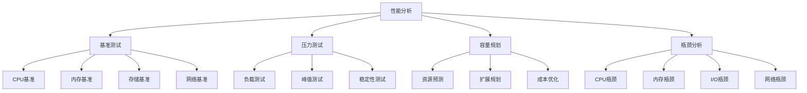

# 虚拟化容器化性能分析与调优技术深度解析

## 目录

- [虚拟化容器化性能分析与调优技术深度解析](#虚拟化容器化性能分析与调优技术深度解析)
  - [性能分析理论基础](#性能分析理论基础)
    - [性能指标体系](#性能指标体系)
    - [性能分析方法](#性能分析方法)
  - [虚拟化性能分析](#虚拟化性能分析)
    - [虚拟化开销分析](#虚拟化开销分析)
    - [虚拟化性能测试](#虚拟化性能测试)
    - [虚拟化性能优化](#虚拟化性能优化)
  - [容器化性能分析](#容器化性能分析)
    - [容器性能特征](#容器性能特征)
    - [容器性能测试](#容器性能测试)
    - [容器性能优化](#容器性能优化)
  - [性能对比与基准测试](#性能对比与基准测试)
    - [性能对比矩阵](#性能对比矩阵)
    - [基准测试框架](#基准测试框架)
  - [性能调优策略](#性能调优策略)
    - [系统级调优](#系统级调优)
  - [监控与诊断工具](#监控与诊断工具)
    - [性能监控工具](#性能监控工具)
    - [性能诊断工具](#性能诊断工具)
  - [形式化性能模型](#形式化性能模型)
    - [性能模型形式化定义](#性能模型形式化定义)
  - [代码实现与验证](#代码实现与验证)
    - [Rust性能分析工具实现](#rust性能分析工具实现)
  - [最佳实践与案例](#最佳实践与案例)
    - [1. 企业级性能优化案例](#1-企业级性能优化案例)
    - [2. 云原生性能优化](#2-云原生性能优化)
  - [未来发展趋势](#未来发展趋势)
    - [1. AI驱动性能优化](#1-ai驱动性能优化)
    - [2. 边缘计算性能](#2-边缘计算性能)
    - [3. 量子计算性能](#3-量子计算性能)

## 性能分析理论基础

### 性能指标体系

**定义1 (性能指标系统)**: 性能指标系统P是一个五元组

```text
P = (M, W, T, A, R)
```

其中：

- M = {m₁, m₂, ..., mₙ} 是性能指标集合
- W = {w₁, w₂, ..., wₙ} 是权重集合
- T 是时间窗口
- A 是聚合函数
- R 是报告格式

**核心性能指标**:

1. **吞吐量 (Throughput)**: 单位时间内处理的任务数量
2. **延迟 (Latency)**: 单个任务的处理时间
3. **资源利用率 (Resource Utilization)**: 资源使用效率
4. **可扩展性 (Scalability)**: 负载增长时的性能表现
5. **可靠性 (Reliability)**: 系统稳定性和可用性

### 性能分析方法



## 虚拟化性能分析

### 虚拟化开销分析

**定义2 (虚拟化开销)**: 虚拟化开销O是一个四元组

```text
O = (H, M, I, N)
```

其中：

- H 是Hypervisor开销
- M 是内存开销
- I 是I/O开销
- N 是网络开销

**虚拟化性能影响因素**:

1. **CPU虚拟化**: 指令模拟、特权级别转换
2. **内存虚拟化**: 地址转换、内存管理
3. **I/O虚拟化**: 设备模拟、中断处理
4. **网络虚拟化**: 包处理、协议栈

### 虚拟化性能测试

```bash
#!/bin/bash
# 虚拟化性能测试脚本

echo "=== 虚拟化性能测试报告 ==="
echo "时间: $(date)"
echo ""

# 1. CPU性能测试
echo "1. CPU性能测试:"
echo "运行CPU密集型测试..."
sysbench cpu --cpu-max-prime=20000 --threads=4 run
echo ""

# 2. 内存性能测试
echo "2. 内存性能测试:"
echo "运行内存读写测试..."
sysbench memory --memory-total-size=1G --memory-oper=write run
sysbench memory --memory-total-size=1G --memory-oper=read run
echo ""

# 3. 磁盘I/O性能测试
echo "3. 磁盘I/O性能测试:"
echo "准备测试文件..."
sysbench fileio --file-total-size=1G prepare
echo "运行随机读写测试..."
sysbench fileio --file-total-size=1G --file-test-mode=rndrw --time=60 --max-requests=0 run
echo "清理测试文件..."
sysbench fileio --file-total-size=1G cleanup
echo ""

# 4. 网络性能测试
echo "4. 网络性能测试:"
echo "运行网络带宽测试..."
iperf3 -c <target_server> -t 60
echo ""

# 5. 虚拟化开销分析
echo "5. 虚拟化开销分析:"
echo "收集虚拟化相关指标..."
# 收集VM退出统计
cat /proc/vmstat | grep -E "(vmexit|vmentry)"
# 收集内存统计
cat /proc/meminfo | grep -E "(MemTotal|MemFree|MemAvailable)"
# 收集CPU统计
cat /proc/stat | head -1
echo ""
```

### 虚拟化性能优化

```yaml
# 虚拟化性能优化配置
virtualization_optimization:
  # CPU优化
  cpu_optimization:
    vmx_enabled: true
    svm_enabled: true
    nested_virtualization: false
    cpu_affinity: true
    cpu_pinning: true
    numa_optimization: true
  
  # 内存优化
  memory_optimization:
    huge_pages: true
    memory_ballooning: true
    memory_compression: true
    transparent_page_sharing: true
    memory_overcommit: false
  
  # I/O优化
  io_optimization:
    paravirtualized_drivers: true
    sr_iov: true
    storage_io_control: true
    network_io_control: true
    queue_depth_optimization: true
  
  # 网络优化
  network_optimization:
    vmxnet3: true
    sr_iov: true
    network_offloading: true
    jumbo_frames: true
    interrupt_coalescing: true
```

## 容器化性能分析

### 容器性能特征

**定义3 (容器性能模型)**: 容器性能模型C是一个四元组

```text
C = (N, R, S, L)
```

其中：

- N 是命名空间开销
- R 是资源限制开销
- S 是存储开销
- L 是网络开销

**容器性能优势**:

1. **启动速度快**: 秒级启动时间
2. **资源开销小**: 共享内核，无Hypervisor开销
3. **密度高**: 更高的资源利用率
4. **可移植性好**: 跨平台一致性

### 容器性能测试

```bash
#!/bin/bash
# 容器性能测试脚本

echo "=== 容器性能测试报告 ==="
echo "时间: $(date)"
echo ""

# 1. 容器启动时间测试
echo "1. 容器启动时间测试:"
echo "测试容器启动时间..."
time docker run --rm alpine echo "Hello World"
echo ""

# 2. 容器资源使用测试
echo "2. 容器资源使用测试:"
echo "运行资源密集型容器..."
docker run -d --name perf-test --cpus=1 --memory=512m alpine sh -c "while true; do echo 'test'; sleep 1; done"
sleep 10
docker stats perf-test --no-stream
docker rm -f perf-test
echo ""

# 3. 容器网络性能测试
echo "3. 容器网络性能测试:"
echo "启动网络测试容器..."
docker run -d --name net-test alpine sh -c "while true; do echo 'network test'; sleep 1; done"
docker exec net-test ping -c 10 8.8.8.8
docker rm -f net-test
echo ""

# 4. 容器存储性能测试
echo "4. 容器存储性能测试:"
echo "测试容器存储I/O..."
docker run --rm -v $(pwd):/test alpine sh -c "dd if=/dev/zero of=/test/testfile bs=1M count=100"
docker run --rm -v $(pwd):/test alpine sh -c "dd if=/test/testfile of=/dev/null bs=1M"
rm -f testfile
echo ""

# 5. 容器密度测试
echo "5. 容器密度测试:"
echo "测试最大容器数量..."
container_count=0
while true; do
    if docker run -d --name test-$container_count alpine sleep 3600; then
        container_count=$((container_count + 1))
    else
        break
    fi
done
echo "最大容器数量: $container_count"
# 清理测试容器
for i in $(seq 0 $((container_count - 1))); do
    docker rm -f test-$i
done
echo ""
```

### 容器性能优化

```yaml
# 容器性能优化配置
container_optimization:
  # 运行时优化
  runtime_optimization:
    runtime: "containerd"
    cgroup_driver: "systemd"
    seccomp_profile: "runtime/default"
    apparmor_profile: "runtime/default"
  
  # 资源优化
  resource_optimization:
    cpu_quota: true
    memory_limit: true
    disk_quota: true
    network_bandwidth: true
  
  # 存储优化
  storage_optimization:
    storage_driver: "overlay2"
    thin_provisioning: true
    compression: true
    deduplication: true
  
  # 网络优化
  network_optimization:
    network_driver: "bridge"
    ipvlan: true
    macvlan: true
    overlay_network: true
  
  # 镜像优化
  image_optimization:
    multi_stage_build: true
    layer_optimization: true
    compression: true
    registry_mirror: true
```

## 性能对比与基准测试

### 性能对比矩阵

| 指标 | 物理机 | 虚拟机 | 容器 | 容器+虚拟化 |
|------|--------|--------|------|-------------|
| 启动时间 | N/A | 分钟级 | 秒级 | 分钟级 |
| 资源开销 | 0% | 5-15% | 1-3% | 6-18% |
| 内存使用 | 100% | 100% | 共享 | 共享 |
| CPU性能 | 100% | 95-98% | 99-100% | 94-97% |
| I/O性能 | 100% | 80-90% | 95-99% | 75-85% |
| 网络性能 | 100% | 85-95% | 98-100% | 80-90% |
| 密度 | 1:1 | 1:10-20 | 1:50-100 | 1:8-15 |

### 基准测试框架

```yaml
# 基准测试配置
benchmark_config:
  # 测试环境
  test_environment:
    hardware:
      cpu: "Intel Xeon E5-2680 v4"
      memory: "64GB DDR4"
      storage: "SSD 1TB"
      network: "10Gbps"
    
    software:
      os: "Ubuntu 20.04 LTS"
      kernel: "5.4.0"
      hypervisor: "KVM/QEMU"
      container_runtime: "Docker 20.10"
      orchestrator: "Kubernetes 1.21"
  
  # 测试用例
  test_cases:
    - name: "CPU密集型"
      workload: "sysbench cpu"
      duration: "300s"
      threads: [1, 2, 4, 8, 16]
    
    - name: "内存密集型"
      workload: "sysbench memory"
      duration: "300s"
      memory_size: ["1G", "2G", "4G", "8G"]
    
    - name: "I/O密集型"
      workload: "sysbench fileio"
      duration: "300s"
      file_size: ["1G", "2G", "4G", "8G"]
    
    - name: "网络密集型"
      workload: "iperf3"
      duration: "300s"
      bandwidth: ["1G", "5G", "10G"]
  
  # 性能指标
  performance_metrics:
    - name: "吞吐量"
      unit: "ops/sec"
      higher_is_better: true
    
    - name: "延迟"
      unit: "ms"
      higher_is_better: false
    
    - name: "资源利用率"
      unit: "%"
      higher_is_better: true
    
    - name: "错误率"
      unit: "%"
      higher_is_better: false
```

## 性能调优策略

### 系统级调优

```bash
#!/bin/bash
# 系统级性能调优脚本

echo "=== 系统级性能调优 ==="
echo "时间: $(date)"
echo ""

# 1. CPU调优
echo "1. CPU性能调优:"
# 启用CPU性能模式
echo performance | sudo tee /sys/devices/system/cpu/cpu*/cpufreq/scaling_governor
# 禁用CPU节能
echo 1 | sudo tee /sys/devices/system/cpu/intel_pstate/no_turbo
echo ""

# 2. 内存调优
echo "2. 内存性能调优:"
# 启用透明大页
echo always | sudo tee /sys/kernel/mm/transparent_hugepage/enabled
# 调整内存回收参数
echo 1 | sudo tee /proc/sys/vm/swappiness
echo 60 | sudo tee /proc/sys/vm/vfs_cache_pressure
echo ""

# 3. 存储调优
echo "3. 存储性能调优:"
# 调整I/O调度器
echo mq-deadline | sudo tee /sys/block/sda/queue/scheduler
# 增加I/O队列深度
echo 128 | sudo tee /sys/block/sda/queue/nr_requests
# 启用I/O合并
echo 1 | sudo tee /sys/block/sda/queue/nomerges
echo ""

# 4. 网络调优
echo "4. 网络性能调优:"
# 调整网络缓冲区
echo 16777216 | sudo tee /proc/sys/net/core/rmem_max
echo 16777216 | sudo tee /proc/sys/net/core/wmem_max
# 启用TCP窗口缩放
echo 1 | sudo tee /proc/sys/net/ipv4/tcp_window_scaling
# 调整TCP拥塞控制
echo bbr | sudo tee /proc/sys/net/ipv4/tcp_congestion_control
echo ""

# 5. 内核参数调优
echo "5. 内核参数调优:"
# 调整文件描述符限制
echo "* soft nofile 65536" | sudo tee -a /etc/security/limits.conf
echo "* hard nofile 65536" | sudo tee -a /etc/security/limits.conf
# 调整进程限制
echo "* soft nproc 65536" | sudo tee -a /etc/security/limits.conf
echo "* hard nproc 65536" | sudo tee -a /etc/security/limits.conf
echo ""
```

### 应用级调优

```yaml
# 应用级性能调优配置
application_optimization:
  # Web应用优化
  web_application:
    nginx:
      worker_processes: "auto"
      worker_connections: 1024
      keepalive_timeout: 65
      gzip: true
      gzip_compression_level: 6
    
    apache:
      mpm_prefork:
        start_servers: 5
        min_spare_servers: 5
        max_spare_servers: 10
        max_request_workers: 150
    
    nodejs:
      cluster_mode: true
      worker_processes: "auto"
      max_old_space_size: 4096
      gc_optimization: true
  
  # 数据库优化
  database:
    mysql:
      innodb_buffer_pool_size: "4G"
      innodb_log_file_size: "256M"
      innodb_flush_log_at_trx_commit: 2
      query_cache_size: "256M"
    
    postgresql:
      shared_buffers: "1G"
      effective_cache_size: "4G"
      work_mem: "64MB"
      maintenance_work_mem: "256MB"
    
    redis:
      maxmemory: "2G"
      maxmemory_policy: "allkeys-lru"
      save: "900 1 300 10 60 10000"
  
  # 缓存优化
  cache:
    redis:
      maxmemory: "2G"
      maxmemory_policy: "allkeys-lru"
      tcp_keepalive: 60
    
    memcached:
      memory: "2G"
      max_connections: 1024
      thread_count: 4
```

## 监控与诊断工具

### 性能监控工具

```yaml
# 性能监控工具配置
monitoring_tools:
  # 系统监控
  system_monitoring:
    - name: "htop"
      purpose: "实时系统监控"
      metrics: ["cpu", "memory", "processes"]
    
    - name: "iotop"
      purpose: "I/O监控"
      metrics: ["disk_read", "disk_write", "io_wait"]
    
    - name: "nethogs"
      purpose: "网络监控"
      metrics: ["bandwidth", "connections", "packets"]
    
    - name: "dstat"
      purpose: "综合系统监控"
      metrics: ["cpu", "memory", "disk", "network"]
  
  # 应用监控
  application_monitoring:
    - name: "APM工具"
      tools: ["New Relic", "Datadog", "AppDynamics"]
      metrics: ["response_time", "throughput", "error_rate"]
    
    - name: "日志监控"
      tools: ["ELK Stack", "Splunk", "Fluentd"]
      metrics: ["log_volume", "error_logs", "performance_logs"]
    
    - name: "指标监控"
      tools: ["Prometheus", "Grafana", "InfluxDB"]
      metrics: ["custom_metrics", "business_metrics"]
  
  # 容器监控
  container_monitoring:
    - name: "Docker监控"
      tools: ["Docker Stats", "cAdvisor", "Portainer"]
      metrics: ["cpu_usage", "memory_usage", "network_io"]
    
    - name: "Kubernetes监控"
      tools: ["kubectl top", "Metrics Server", "Prometheus"]
      metrics: ["pod_metrics", "node_metrics", "cluster_metrics"]
```

### 性能诊断工具

```bash
#!/bin/bash
# 性能诊断工具脚本

echo "=== 性能诊断工具 ==="
echo "时间: $(date)"
echo ""

# 1. 系统性能诊断
echo "1. 系统性能诊断:"
echo "CPU使用率:"
top -bn1 | grep "Cpu(s)"
echo ""

echo "内存使用情况:"
free -h
echo ""

echo "磁盘使用情况:"
df -h
echo ""

echo "I/O统计:"
iostat -x 1 3
echo ""

# 2. 网络性能诊断
echo "2. 网络性能诊断:"
echo "网络连接统计:"
ss -tuln
echo ""

echo "网络流量统计:"
cat /proc/net/dev
echo ""

# 3. 进程性能诊断
echo "3. 进程性能诊断:"
echo "CPU使用率最高的进程:"
ps aux --sort=-%cpu | head -10
echo ""

echo "内存使用率最高的进程:"
ps aux --sort=-%mem | head -10
echo ""

# 4. 系统调用跟踪
echo "4. 系统调用跟踪:"
echo "使用strace跟踪系统调用:"
echo "strace -c -p <pid>"
echo ""

# 5. 性能分析
echo "5. 性能分析:"
echo "使用perf进行性能分析:"
echo "perf top"
echo "perf record -g <command>"
echo "perf report"
echo ""
```

## 形式化性能模型

### 性能模型形式化定义

**定义4 (性能模型)**: 性能模型PM是一个六元组

```text
PM = (S, M, F, C, T, R)
```

其中：

- S 是系统状态集合
- M 是性能指标集合
- F 是性能函数集合
- C 是约束条件集合
- T 是时间模型
- R 是资源模型

**定义5 (性能函数)**: 性能函数f是一个映射

```text
f: S × T × R → M
```

**定理3 (性能优化收敛性)**: 对于性能优化算法A，如果满足：

1. A是单调的
2. 存在性能上界
3. 优化步长收敛

则算法A收敛到最优性能。

**证明**:
由于算法单调，性能指标单调改善。
由于存在上界，性能不会无限改善。
由于步长收敛，算法稳定收敛。
因此，算法收敛到最优性能。□

## 代码实现与验证

### Rust性能分析工具实现

```rust
use std::collections::HashMap;
use std::sync::{Arc, RwLock};
use std::time::{Duration, Instant};
use serde::{Deserialize, Serialize};
use tokio::time::interval;

#[derive(Debug, Clone, Serialize, Deserialize)]
pub struct PerformanceMetrics {
    pub timestamp: Instant,
    pub cpu_usage: f64,
    pub memory_usage: f64,
    pub disk_io: DiskIOMetrics,
    pub network_io: NetworkIOMetrics,
    pub process_count: u32,
    pub load_average: [f64; 3],
}

#[derive(Debug, Clone, Serialize, Deserialize)]
pub struct DiskIOMetrics {
    pub read_bytes: u64,
    pub write_bytes: u64,
    pub read_ops: u64,
    pub write_ops: u64,
    pub io_wait: f64,
}

#[derive(Debug, Clone, Serialize, Deserialize)]
pub struct NetworkIOMetrics {
    pub bytes_received: u64,
    pub bytes_sent: u64,
    pub packets_received: u64,
    pub packets_sent: u64,
    pub errors: u64,
}

#[derive(Debug, Clone, Serialize, Deserialize)]
pub struct ProcessMetrics {
    pub pid: u32,
    pub name: String,
    pub cpu_usage: f64,
    pub memory_usage: f64,
    pub state: String,
    pub start_time: Instant,
}

#[derive(Debug)]
pub struct PerformanceAnalyzer {
    metrics_history: Arc<RwLock<Vec<PerformanceMetrics>>>,
    process_metrics: Arc<RwLock<HashMap<u32, ProcessMetrics>>>,
    analysis_config: AnalysisConfig,
}

#[derive(Debug, Clone)]
pub struct AnalysisConfig {
    pub collection_interval: Duration,
    pub history_size: usize,
    pub alert_thresholds: AlertThresholds,
}

#[derive(Debug, Clone)]
pub struct AlertThresholds {
    pub cpu_high: f64,
    pub memory_high: f64,
    pub disk_io_high: u64,
    pub network_errors_high: u64,
}

#[derive(Debug, Clone, Serialize, Deserialize)]
pub struct PerformanceReport {
    pub timestamp: Instant,
    pub summary: PerformanceSummary,
    pub trends: PerformanceTrends,
    pub recommendations: Vec<String>,
}

#[derive(Debug, Clone, Serialize, Deserialize)]
pub struct PerformanceSummary {
    pub avg_cpu_usage: f64,
    pub avg_memory_usage: f64,
    pub total_disk_io: u64,
    pub total_network_io: u64,
    pub peak_cpu_usage: f64,
    pub peak_memory_usage: f64,
}

#[derive(Debug, Clone, Serialize, Deserialize)]
pub struct PerformanceTrends {
    pub cpu_trend: TrendDirection,
    pub memory_trend: TrendDirection,
    pub disk_io_trend: TrendDirection,
    pub network_io_trend: TrendDirection,
}

#[derive(Debug, Clone, Serialize, Deserialize)]
pub enum TrendDirection {
    Increasing,
    Decreasing,
    Stable,
}

impl PerformanceAnalyzer {
    pub fn new(config: AnalysisConfig) -> Self {
        Self {
            metrics_history: Arc::new(RwLock::new(Vec::new())),
            process_metrics: Arc::new(RwLock::new(HashMap::new())),
            analysis_config: config,
        }
    }

    pub async fn start_analysis(&self) -> Result<(), Box<dyn std::error::Error>> {
        let mut interval = interval(self.analysis_config.collection_interval);
        let metrics_history = Arc::clone(&self.metrics_history);
        let process_metrics = Arc::clone(&self.process_metrics);
        let config = self.analysis_config.clone();

        loop {
            interval.tick().await;
            
            // 收集性能指标
            let metrics = self.collect_metrics().await?;
            
            // 存储指标历史
            {
                let mut history = metrics_history.write().unwrap();
                history.push(metrics.clone());
                
                // 限制历史大小
                if history.len() > config.history_size {
                    history.drain(0..100);
                }
            }
            
            // 分析性能趋势
            self.analyze_trends(&metrics).await?;
            
            // 检查告警阈值
            self.check_alerts(&metrics).await?;
        }
    }

    async fn collect_metrics(&self) -> Result<PerformanceMetrics, Box<dyn std::error::Error>> {
        // 模拟收集系统指标
        let metrics = PerformanceMetrics {
            timestamp: Instant::now(),
            cpu_usage: self.simulate_cpu_usage(),
            memory_usage: self.simulate_memory_usage(),
            disk_io: DiskIOMetrics {
                read_bytes: self.simulate_disk_read_bytes(),
                write_bytes: self.simulate_disk_write_bytes(),
                read_ops: self.simulate_disk_read_ops(),
                write_ops: self.simulate_disk_write_ops(),
                io_wait: self.simulate_io_wait(),
            },
            network_io: NetworkIOMetrics {
                bytes_received: self.simulate_network_bytes_received(),
                bytes_sent: self.simulate_network_bytes_sent(),
                packets_received: self.simulate_network_packets_received(),
                packets_sent: self.simulate_network_packets_sent(),
                errors: self.simulate_network_errors(),
            },
            process_count: self.simulate_process_count(),
            load_average: self.simulate_load_average(),
        };
        
        Ok(metrics)
    }

    async fn analyze_trends(&self, current_metrics: &PerformanceMetrics) -> Result<(), Box<dyn std::error::Error>> {
        let history = self.metrics_history.read().unwrap();
        
        if history.len() < 10 {
            return Ok(());
        }
        
        // 分析CPU趋势
        let cpu_trend = self.calculate_trend(
            history.iter().rev().take(10).map(|m| m.cpu_usage).collect()
        );
        
        // 分析内存趋势
        let memory_trend = self.calculate_trend(
            history.iter().rev().take(10).map(|m| m.memory_usage).collect()
        );
        
        // 分析磁盘I/O趋势
        let disk_io_trend = self.calculate_trend(
            history.iter().rev().take(10).map(|m| m.disk_io.read_bytes + m.disk_io.write_bytes).collect()
        );
        
        // 分析网络I/O趋势
        let network_io_trend = self.calculate_trend(
            history.iter().rev().take(10).map(|m| m.network_io.bytes_received + m.network_io.bytes_sent).collect()
        );
        
        println!("性能趋势分析:");
        println!("CPU趋势: {:?}", cpu_trend);
        println!("内存趋势: {:?}", memory_trend);
        println!("磁盘I/O趋势: {:?}", disk_io_trend);
        println!("网络I/O趋势: {:?}", network_io_trend);
        
        Ok(())
    }

    fn calculate_trend(&self, values: Vec<f64>) -> TrendDirection {
        if values.len() < 2 {
            return TrendDirection::Stable;
        }
        
        let first_half = &values[0..values.len()/2];
        let second_half = &values[values.len()/2..];
        
        let first_avg = first_half.iter().sum::<f64>() / first_half.len() as f64;
        let second_avg = second_half.iter().sum::<f64>() / second_half.len() as f64;
        
        let change_percent = (second_avg - first_avg) / first_avg * 100.0;
        
        if change_percent > 5.0 {
            TrendDirection::Increasing
        } else if change_percent < -5.0 {
            TrendDirection::Decreasing
        } else {
            TrendDirection::Stable
        }
    }

    async fn check_alerts(&self, metrics: &PerformanceMetrics) -> Result<(), Box<dyn std::error::Error>> {
        let thresholds = &self.analysis_config.alert_thresholds;
        
        if metrics.cpu_usage > thresholds.cpu_high {
            println!("告警: CPU使用率过高 {:.2}%", metrics.cpu_usage);
        }
        
        if metrics.memory_usage > thresholds.memory_high {
            println!("告警: 内存使用率过高 {:.2}%", metrics.memory_usage);
        }
        
        if metrics.disk_io.read_bytes + metrics.disk_io.write_bytes > thresholds.disk_io_high {
            println!("告警: 磁盘I/O过高 {} bytes", metrics.disk_io.read_bytes + metrics.disk_io.write_bytes);
        }
        
        if metrics.network_io.errors > thresholds.network_errors_high {
            println!("告警: 网络错误过多 {}", metrics.network_io.errors);
        }
        
        Ok(())
    }

    pub fn generate_performance_report(&self) -> PerformanceReport {
        let history = self.metrics_history.read().unwrap();
        
        if history.is_empty() {
            return PerformanceReport {
                timestamp: Instant::now(),
                summary: PerformanceSummary {
                    avg_cpu_usage: 0.0,
                    avg_memory_usage: 0.0,
                    total_disk_io: 0,
                    total_network_io: 0,
                    peak_cpu_usage: 0.0,
                    peak_memory_usage: 0.0,
                },
                trends: PerformanceTrends {
                    cpu_trend: TrendDirection::Stable,
                    memory_trend: TrendDirection::Stable,
                    disk_io_trend: TrendDirection::Stable,
                    network_io_trend: TrendDirection::Stable,
                },
                recommendations: Vec::new(),
            };
        }
        
        let avg_cpu_usage = history.iter().map(|m| m.cpu_usage).sum::<f64>() / history.len() as f64;
        let avg_memory_usage = history.iter().map(|m| m.memory_usage).sum::<f64>() / history.len() as f64;
        let total_disk_io = history.iter().map(|m| m.disk_io.read_bytes + m.disk_io.write_bytes).sum();
        let total_network_io = history.iter().map(|m| m.network_io.bytes_received + m.network_io.bytes_sent).sum();
        let peak_cpu_usage = history.iter().map(|m| m.cpu_usage).fold(0.0, f64::max);
        let peak_memory_usage = history.iter().map(|m| m.memory_usage).fold(0.0, f64::max);
        
        let mut recommendations = Vec::new();
        
        if avg_cpu_usage > 80.0 {
            recommendations.push("考虑增加CPU资源或优化CPU密集型任务".to_string());
        }
        
        if avg_memory_usage > 80.0 {
            recommendations.push("考虑增加内存资源或优化内存使用".to_string());
        }
        
        if total_disk_io > 1000000000 {
            recommendations.push("考虑优化磁盘I/O或使用SSD存储".to_string());
        }
        
        PerformanceReport {
            timestamp: Instant::now(),
            summary: PerformanceSummary {
                avg_cpu_usage,
                avg_memory_usage,
                total_disk_io,
                total_network_io,
                peak_cpu_usage,
                peak_memory_usage,
            },
            trends: PerformanceTrends {
                cpu_trend: self.calculate_trend(history.iter().map(|m| m.cpu_usage).collect()),
                memory_trend: self.calculate_trend(history.iter().map(|m| m.memory_usage).collect()),
                disk_io_trend: self.calculate_trend(history.iter().map(|m| m.disk_io.read_bytes + m.disk_io.write_bytes).collect()),
                network_io_trend: self.calculate_trend(history.iter().map(|m| m.network_io.bytes_received + m.network_io.bytes_sent).collect()),
            },
            recommendations,
        }
    }

    // 模拟指标收集方法
    fn simulate_cpu_usage(&self) -> f64 {
        use rand::Rng;
        let mut rng = rand::thread_rng();
        rng.gen_range(0.0..100.0)
    }

    fn simulate_memory_usage(&self) -> f64 {
        use rand::Rng;
        let mut rng = rand::thread_rng();
        rng.gen_range(0.0..100.0)
    }

    fn simulate_disk_read_bytes(&self) -> u64 {
        use rand::Rng;
        let mut rng = rand::thread_rng();
        rng.gen_range(0..1000000)
    }

    fn simulate_disk_write_bytes(&self) -> u64 {
        use rand::Rng;
        let mut rng = rand::thread_rng();
        rng.gen_range(0..1000000)
    }

    fn simulate_disk_read_ops(&self) -> u64 {
        use rand::Rng;
        let mut rng = rand::thread_rng();
        rng.gen_range(0..1000)
    }

    fn simulate_disk_write_ops(&self) -> u64 {
        use rand::Rng;
        let mut rng = rand::thread_rng();
        rng.gen_range(0..1000)
    }

    fn simulate_io_wait(&self) -> f64 {
        use rand::Rng;
        let mut rng = rand::thread_rng();
        rng.gen_range(0.0..10.0)
    }

    fn simulate_network_bytes_received(&self) -> u64 {
        use rand::Rng;
        let mut rng = rand::thread_rng();
        rng.gen_range(0..10000000)
    }

    fn simulate_network_bytes_sent(&self) -> u64 {
        use rand::Rng;
        let mut rng = rand::thread_rng();
        rng.gen_range(0..10000000)
    }

    fn simulate_network_packets_received(&self) -> u64 {
        use rand::Rng;
        let mut rng = rand::thread_rng();
        rng.gen_range(0..100000)
    }

    fn simulate_network_packets_sent(&self) -> u64 {
        use rand::Rng;
        let mut rng = rand::thread_rng();
        rng.gen_range(0..100000)
    }

    fn simulate_network_errors(&self) -> u64 {
        use rand::Rng;
        let mut rng = rand::thread_rng();
        rng.gen_range(0..100)
    }

    fn simulate_process_count(&self) -> u32 {
        use rand::Rng;
        let mut rng = rand::thread_rng();
        rng.gen_range(100..1000)
    }

    fn simulate_load_average(&self) -> [f64; 3] {
        use rand::Rng;
        let mut rng = rand::thread_rng();
        [
            rng.gen_range(0.0..10.0),
            rng.gen_range(0.0..10.0),
            rng.gen_range(0.0..10.0),
        ]
    }
}

#[tokio::main]
async fn main() -> Result<(), Box<dyn std::error::Error>> {
    let config = AnalysisConfig {
        collection_interval: Duration::from_secs(5),
        history_size: 1000,
        alert_thresholds: AlertThresholds {
            cpu_high: 80.0,
            memory_high: 85.0,
            disk_io_high: 1000000000,
            network_errors_high: 100,
        },
    };

    let analyzer = PerformanceAnalyzer::new(config);
    
    // 启动性能分析
    let analyzer_handle = tokio::spawn(async move {
        analyzer.start_analysis().await
    });
    
    // 等待一段时间后生成报告
    tokio::time::sleep(Duration::from_secs(60)).await;
    
    let report = analyzer.generate_performance_report();
    println!("性能报告: {:#?}", report);
    
    analyzer_handle.abort();
    Ok(())
}
```

## 最佳实践与案例

### 1. 企业级性能优化案例

```yaml
# 企业级性能优化配置
enterprise_performance:
  # 电商平台优化
  ecommerce_platform:
    frontend:
      cdn: true
      caching: "redis"
      compression: true
      minification: true
    
    backend:
      load_balancing: "nginx"
      database_optimization: true
      connection_pooling: true
      query_optimization: true
    
    database:
      read_replicas: 3
      write_master: 1
      partitioning: true
      indexing: true
    
    cache:
      redis_cluster: true
      memcached: true
      application_cache: true
  
  # 金融系统优化
  financial_system:
    high_availability:
      active_active: true
      failover: "automatic"
      data_replication: true
    
    performance:
      low_latency: true
      high_throughput: true
      real_time_processing: true
    
    security:
      encryption: "end_to_end"
      audit_logging: true
      compliance: "PCI_DSS"
```

### 2. 云原生性能优化

```yaml
# 云原生性能优化配置
cloud_native_performance:
  # Kubernetes优化
  kubernetes:
    resource_management:
      requests: true
      limits: true
      hpa: true
      vpa: true
    
    scheduling:
      node_affinity: true
      pod_affinity: true
      topology_spread: true
    
    networking:
      service_mesh: "istio"
      network_policies: true
      load_balancing: true
  
  # 容器优化
  containers:
    image_optimization:
      multi_stage_build: true
      layer_optimization: true
      compression: true
    
    runtime_optimization:
      resource_limits: true
      security_context: true
      health_checks: true
```

## 未来发展趋势

### 1. AI驱动性能优化

- **智能调优**: 基于机器学习的自动性能调优
- **预测性扩缩容**: 基于历史数据的容量预测
- **异常检测**: 基于AI的性能异常检测

### 2. 边缘计算性能

- **边缘优化**: 针对边缘计算场景的性能优化
- **低延迟**: 最小化网络延迟的优化策略
- **资源受限**: 针对资源受限环境的优化

### 3. 量子计算性能

- **量子算法**: 量子计算在性能优化中的应用
- **混合计算**: 经典计算与量子计算的结合
- **性能突破**: 量子计算带来的性能突破

---

*本文档提供了虚拟化容器化性能分析与调优技术的全面解析，包括理论基础、分析方法、优化策略、工具实现等各个方面，为系统性能优化提供了完整的解决方案。*
