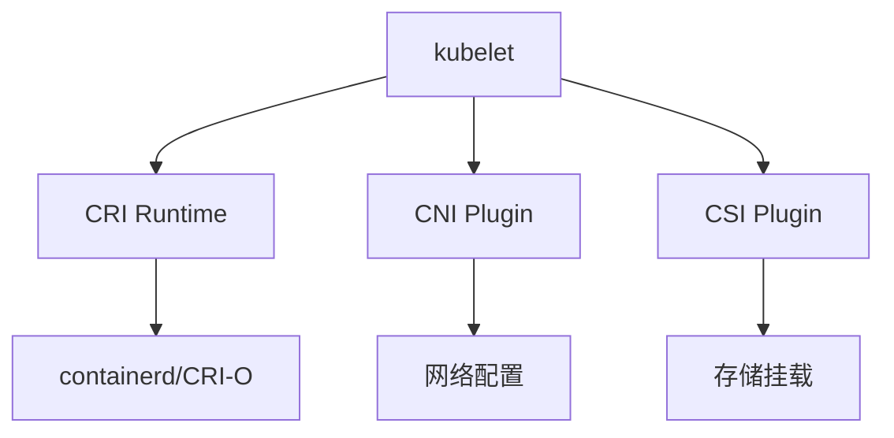
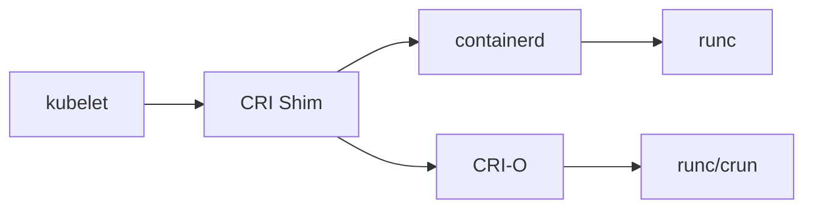
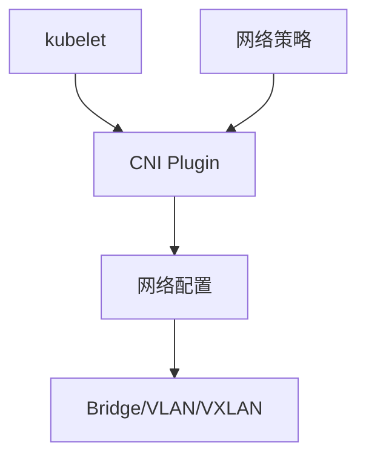
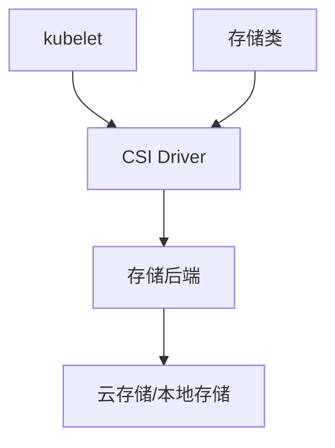

# Kubernetes架构原理

## 目录

- [Kubernetes架构原理](#kubernetes架构原理)
  - [1. 整体架构与组件职责](#1-整体架构与组件职责)
    - [1.1 控制面组件](#11-控制面组件)
      - [kube-apiserver](#kube-apiserver)
      - [etcd](#etcd)
      - [kube-scheduler](#kube-scheduler)
      - [kube-controller-manager](#kube-controller-manager)
      - [cloud-controller-manager](#cloud-controller-manager)
    - [1.2 数据面组件](#12-数据面组件)
      - [kubelet](#kubelet)
      - [kube-proxy](#kube-proxy)
    - [1.3 容器运行时](#13-容器运行时)
      - [containerd](#containerd)
      - [CRI-O](#cri-o)
  - [2. 控制面与数据面](#2-控制面与数据面)
    - [2.1 控制回路机制](#21-控制回路机制)
      - [声明式模型](#声明式模型)
- [声明式配置示例](#声明式配置示例)
      - [控制回路流程](#控制回路流程)
    - [2.2 控制面架构](#22-控制面架构)
      - [高可用控制面](#高可用控制面)
- [多主节点配置示例](#多主节点配置示例)
      - [负载均衡配置](#负载均衡配置)
- [HAProxy配置示例](#haproxy配置示例)
    - [2.3 数据面架构](#23-数据面架构)
      - [节点组件交互](#节点组件交互)
      - [节点注册流程](#节点注册流程)
- [节点加入集群流程](#节点加入集群流程)
- [1. 生成证书](#1-生成证书)
- [2. 生成kubelet配置](#2-生成kubelet配置)
- [3. 启动kubelet](#3-启动kubelet)
- [4. 加入集群](#4-加入集群)
  - [3. 节点、容器运行时与 CRI](#3-节点容器运行时与-cri)
    - [3.1 CRI接口规范](#31-cri接口规范)
      - [CRI架构](#cri架构)
      - [CRI服务定义](#cri服务定义)
    - [3.2 容器运行时对比](#32-容器运行时对比)
      - [containerd vs CRI-O](#containerd-vs-cri-o)
      - [运行时配置示例](#运行时配置示例)
- [containerd配置](#containerd配置)
- [CRI-O配置](#cri-o配置)
    - [3.3 节点管理](#33-节点管理)
      - [节点状态监控](#节点状态监控)
- [查看节点状态](#查看节点状态)
- [查看节点详细信息](#查看节点详细信息)
- [查看节点资源使用](#查看节点资源使用)
- [查看节点事件](#查看节点事件)
      - [节点维护操作](#节点维护操作)
- [标记节点为不可调度](#标记节点为不可调度)
- [驱逐节点上的Pod](#驱逐节点上的pod)
- [恢复节点调度](#恢复节点调度)
- [删除节点](#删除节点)
    - [3.4 容器运行时安全](#34-容器运行时安全)
      - [运行时安全配置](#运行时安全配置)
- [Pod安全上下文](#pod安全上下文)
      - [运行时安全策略](#运行时安全策略)
- [Pod安全标准](#pod安全标准)
  - [4. CNI/CSI 扩展模型](#4-cnicsi-扩展模型)
    - [4.1 CNI网络插件](#41-cni网络插件)
      - [CNI架构](#cni架构)
      - [主流CNI插件对比](#主流cni插件对比)
      - [CNI配置示例](#cni配置示例)
    - [4.2 CSI存储插件](#42-csi存储插件)
      - [CSI架构](#csi架构)
      - [CSI接口规范](#csi接口规范)
      - [存储类配置示例](#存储类配置示例)
    - [4.3 插件生态管理](#43-插件生态管理)
      - [插件安装与配置](#插件安装与配置)
- [安装CNI插件](#安装cni插件)
- [安装CSI驱动](#安装csi驱动)
- [验证插件状态](#验证插件状态)
      - [插件监控与故障排查](#插件监控与故障排查)
- [查看CNI插件日志](#查看cni插件日志)
- [查看CSI驱动日志](#查看csi驱动日志)
- [检查网络连通性](#检查网络连通性)
- [检查存储挂载](#检查存储挂载)
    - [4.4 扩展开发指南](#44-扩展开发指南)
      - [自定义CNI插件](#自定义cni插件)
      - [自定义CSI驱动](#自定义csi驱动)
  - [5. 对象模型与一致性](#5-对象模型与一致性)
  - [6. 高可用与扩展性](#6-高可用与扩展性)
  - [7. 实践要点与 FAQ](#7-实践要点与-faq)
  - [8. 升级与回滚流程（SOP）](#8-升级与回滚流程sop)

- [Kubernetes架构原理](#kubernetes架构原理)
  - [1. 整体架构与组件职责](#1-整体架构与组件职责)
    - [1.1 控制面组件](#11-控制面组件)
      - [kube-apiserver](#kube-apiserver)
- [kube-apiserver配置示例](#kube-apiserver配置示例)
      - [etcd](#etcd)
- [etcd配置示例](#etcd配置示例)
      - [kube-scheduler](#kube-scheduler)
- [调度器配置示例](#调度器配置示例)
      - [kube-controller-manager](#kube-controller-manager)
- [控制器管理器配置](#控制器管理器配置)
      - [cloud-controller-manager](#cloud-controller-manager)
- [云控制器配置](#云控制器配置)
    - [1.2 数据面组件](#12-数据面组件)
      - [kubelet](#kubelet)
- [kubelet配置示例](#kubelet配置示例)
      - [kube-proxy](#kube-proxy)
- [kube-proxy配置](#kube-proxy配置)
    - [1.3 容器运行时](#13-容器运行时)
      - [containerd](#containerd)
- [containerd配置示例](#containerd配置示例)
      - [CRI-O](#cri-o)
- [CRI-O配置示例](#cri-o配置示例)
  - [2. 控制面与数据面](#2-控制面与数据面)
    - [2.1 控制回路机制](#21-控制回路机制)
      - [声明式模型](#声明式模型)
- [声明式配置示例](#声明式配置示例)
      - [控制回路流程](#控制回路流程)
    - [2.2 控制面架构](#22-控制面架构)
      - [高可用控制面](#高可用控制面)
- [多主节点配置示例](#多主节点配置示例)
      - [负载均衡配置](#负载均衡配置)
- [HAProxy配置示例](#haproxy配置示例)
    - [2.3 数据面架构](#23-数据面架构)
      - [节点组件交互](#节点组件交互)
      - [节点注册流程](#节点注册流程)
- [节点加入集群流程](#节点加入集群流程)
- [1. 生成证书](#1-生成证书)
- [2. 生成kubelet配置](#2-生成kubelet配置)
- [3. 启动kubelet](#3-启动kubelet)
- [4. 加入集群](#4-加入集群)
  - [3. 节点、容器运行时与 CRI](#3-节点容器运行时与-cri)
    - [3.1 CRI接口规范](#31-cri接口规范)
      - [CRI架构](#cri架构)
      - [CRI服务定义](#cri服务定义)
    - [3.2 容器运行时对比](#32-容器运行时对比)
      - [containerd vs CRI-O](#containerd-vs-cri-o)
      - [运行时配置示例](#运行时配置示例)
- [containerd配置](#containerd配置)
- [CRI-O配置](#cri-o配置)
    - [3.3 节点管理](#33-节点管理)
      - [节点状态监控](#节点状态监控)
- [查看节点状态](#查看节点状态)
- [查看节点详细信息](#查看节点详细信息)
- [查看节点资源使用](#查看节点资源使用)
- [查看节点事件](#查看节点事件)
      - [节点维护操作](#节点维护操作)
- [标记节点为不可调度](#标记节点为不可调度)
- [驱逐节点上的Pod](#驱逐节点上的pod)
- [恢复节点调度](#恢复节点调度)
- [删除节点](#删除节点)
    - [3.4 容器运行时安全](#34-容器运行时安全)
      - [运行时安全配置](#运行时安全配置)
- [Pod安全上下文](#pod安全上下文)
      - [运行时安全策略](#运行时安全策略)
- [Pod安全标准](#pod安全标准)
  - [4. CNI/CSI 扩展模型](#4-cnicsi-扩展模型)
    - [4.1 CNI网络插件](#41-cni网络插件)
      - [CNI架构](#cni架构)
      - [主流CNI插件对比](#主流cni插件对比)
      - [CNI配置示例](#cni配置示例)
    - [4.2 CSI存储插件](#42-csi存储插件)
      - [CSI架构](#csi架构)
      - [CSI接口规范](#csi接口规范)
      - [存储类配置示例](#存储类配置示例)
    - [4.3 插件生态管理](#43-插件生态管理)
      - [插件安装与配置](#插件安装与配置)
- [安装CNI插件](#安装cni插件)
- [安装CSI驱动](#安装csi驱动)
- [验证插件状态](#验证插件状态)
      - [插件监控与故障排查](#插件监控与故障排查)
- [查看CNI插件日志](#查看cni插件日志)
- [查看CSI驱动日志](#查看csi驱动日志)
- [检查网络连通性](#检查网络连通性)
- [检查存储挂载](#检查存储挂载)
    - [4.4 扩展开发指南](#44-扩展开发指南)
      - [自定义CNI插件](#自定义cni插件)
      - [自定义CSI驱动](#自定义csi驱动)
  - [5. 对象模型与一致性](#5-对象模型与一致性)
  - [6. 高可用与扩展性](#6-高可用与扩展性)
  - [7. 实践要点与 FAQ](#7-实践要点与-faq)
  - [8. 升级与回滚流程（SOP）](#8-升级与回滚流程sop)

- [Kubernetes架构原理](#kubernetes架构原理)
  - [目录](#目录)
  - [1. 整体架构与组件职责](#1-整体架构与组件职责)
  - [2. 控制面与数据面](#2-控制面与数据面)
  - [3. 节点、容器运行时与 CRI](#3-节点容器运行时与-cri)
  - [4. CNI/CSI 扩展模型](#4-cnicsi-扩展模型)
  - [5. 对象模型与一致性](#5-对象模型与一致性)
  - [6. 高可用与扩展性](#6-高可用与扩展性)
  - [7. 实践要点与 FAQ](#7-实践要点与-faq)
  - [8. 升级与回滚流程（SOP）](#8-升级与回滚流程sop)

## 1. 整体架构与组件职责

### 1.1 控制面组件

#### kube-apiserver

- **职责**: Kubernetes API的统一入口，负责认证、授权、准入控制和API版本管理
- **特性**: 无状态设计，支持水平扩展，提供RESTful API和gRPC接口
- **配置要点**:

  ```yaml
  # kube-apiserver配置示例
  apiVersion: kubeadm.k8s.io/v1beta3
  kind: ClusterConfiguration
  apiServer:
    extraArgs:
      enable-admission-plugins: "NodeRestriction,MutatingAdmissionWebhook,ValidatingAdmissionWebhook"
      audit-log-path: "/var/log/audit.log"
      audit-policy-file: "/etc/kubernetes/audit-policy.yaml"
  ```

#### etcd

- **职责**: 存储Kubernetes集群的所有状态数据，包括配置、元数据和状态信息
- **特性**: 分布式键值存储，支持事务和一致性保证
- **配置要点**:

  ```bash
  # etcd配置示例
  ETCD_NAME=etcd-server-1
  ETCD_DATA_DIR=/var/lib/etcd
  ETCD_LISTEN_CLIENT_URLS=https://0.0.0.0:2379
  ETCD_ADVERTISE_CLIENT_URLS=https://10.0.0.1:2379
  ETCD_CERT_FILE=/etc/kubernetes/pki/etcd/server.crt
  ETCD_KEY_FILE=/etc/kubernetes/pki/etcd/server.key
  ETCD_CLIENT_CERT_AUTH=true
  ETCD_TRUSTED_CA_FILE=/etc/kubernetes/pki/etcd/ca.crt
  ```

#### kube-scheduler

- **职责**: 负责Pod的调度决策，将Pod分配到合适的节点
- **特性**: 可插拔的调度算法，支持自定义调度器
- **配置要点**:

  ```yaml
  # 调度器配置示例
  apiVersion: kubescheduler.config.k8s.io/v1beta3
  kind: KubeSchedulerConfiguration
  profiles:
  - schedulerName: default-scheduler
    plugins:
      score:
        enabled:
        - name: NodeResourcesFit
        - name: NodeAffinity
  ```

#### kube-controller-manager

- **职责**: 运行各种控制器，维护集群的期望状态
- **主要控制器**:
  - Deployment Controller
  - ReplicaSet Controller
  - Node Controller
  - Service Controller
  - Endpoint Controller
- **配置要点**:

  ```yaml
  # 控制器管理器配置
  apiVersion: kubeadm.k8s.io/v1beta3
  kind: ClusterConfiguration
  controllerManager:
    extraArgs:
      bind-address: 0.0.0.0
      cluster-signing-cert-file: /etc/kubernetes/pki/ca.crt
      cluster-signing-key-file: /etc/kubernetes/pki/ca.key
  ```

#### cloud-controller-manager

- **职责**: 与云提供商API交互，管理云资源
- **功能**: 节点管理、路由管理、服务负载均衡器管理
- **配置要点**:

  ```yaml
  # 云控制器配置
  apiVersion: v1
  kind: ConfigMap
  metadata:
    name: cloud-config
    namespace: kube-system
  data:
    cloud.conf: |
      [Global]
      region = us-west-1
      vpc-id = vpc-12345678
  ```

### 1.2 数据面组件

#### kubelet

- **职责**: 节点代理，管理Pod生命周期和容器运行时
- **特性**: 与容器运行时接口(CRI)交互，监控节点资源
- **配置要点**:

  ```yaml
  # kubelet配置示例
  apiVersion: kubelet.config.k8s.io/v1beta1
  kind: KubeletConfiguration
  clusterDNS:
  - 10.96.0.10
  clusterDomain: cluster.local
  containerRuntimeEndpoint: unix:///var/run/containerd/containerd.sock
  ```

#### kube-proxy

- **职责**: 网络代理，实现Service的负载均衡和流量转发
- **模式**: iptables、ipvs、userspace
- **配置要点**:

  ```yaml
  # kube-proxy配置
  apiVersion: kubeproxy.config.k8s.io/v1alpha1
  kind: KubeProxyConfiguration
  mode: "ipvs"
  ipvs:
    scheduler: "rr"
  ```

### 1.3 容器运行时

#### containerd

- **特性**: 轻量级容器运行时，支持OCI标准
- **配置要点**:

  ```toml
  # containerd配置示例
  version = 2
  [plugins."io.containerd.grpc.v1.cri"]
    [plugins."io.containerd.grpc.v1.cri".containerd]
      [plugins."io.containerd.grpc.v1.cri".containerd.runtimes]
        [plugins."io.containerd.grpc.v1.cri".containerd.runtimes.runc]
          runtime_type = "io.containerd.runc.v2"
  ```

#### CRI-O

- **特性**: 专为Kubernetes设计的容器运行时
- **配置要点**:

  ```toml
  # CRI-O配置示例
  [crio]
  runtime = "crun"
  [crio.runtime]
  default_runtime = "crun"
  [crio.runtime.runtimes.crun]
  runtime_path = "/usr/bin/crun"
  ```

## 2. 控制面与数据面

### 2.1 控制回路机制

#### 声明式模型

Kubernetes采用声明式API模型，用户声明期望状态，系统自动维护实际状态。

```yaml
# 声明式配置示例
apiVersion: apps/v1
kind: Deployment
metadata:
  name: web-deployment
spec:
  replicas: 3  # 期望状态：3个副本
  selector:
    matchLabels:
      app: web
  template:
    metadata:
      labels:
        app: web
    spec:
      containers:
      - name: web
        image: nginx:1.20
```

#### 控制回路流程

1. **观察**: 控制器观察当前状态
2. **比较**: 比较期望状态与实际状态
3. **行动**: 执行必要的操作使实际状态符合期望状态

```go
// 控制回路伪代码示例
func (c *Controller) reconcile() {
    // 1. 观察当前状态
    currentState := c.getCurrentState()
    
    // 2. 获取期望状态
    desiredState := c.getDesiredState()
    
    // 3. 比较状态
    if !reflect.DeepEqual(currentState, desiredState) {
        // 4. 执行操作
        c.takeAction(currentState, desiredState)
    }
}
```

### 2.2 控制面架构

#### 高可用控制面

```yaml
# 多主节点配置示例
apiVersion: kubeadm.k8s.io/v1beta3
kind: ClusterConfiguration
controlPlaneEndpoint: "k8s-api.example.com:6443"
etcd:
  external:
    endpoints:
    - "https://etcd1.example.com:2379"
    - "https://etcd2.example.com:2379"
    - "https://etcd3.example.com:2379"
    caFile: "/etc/kubernetes/pki/etcd/ca.crt"
    certFile: "/etc/kubernetes/pki/etcd/server.crt"
    keyFile: "/etc/kubernetes/pki/etcd/server.key"
```

#### 负载均衡配置

```yaml
# HAProxy配置示例
global
    daemon
    maxconn 4096

defaults
    mode tcp
    timeout connect 5000ms
    timeout client 50000ms
    timeout server 50000ms

frontend k8s-api
    bind *:6443
    default_backend k8s-api-backend

backend k8s-api-backend
    balance roundrobin
    server k8s-master-1 10.0.1.10:6443 check
    server k8s-master-2 10.0.1.11:6443 check
    server k8s-master-3 10.0.1.12:6443 check
```

### 2.3 数据面架构

#### 节点组件交互



#### 节点注册流程

```bash
# 节点加入集群流程
# 1. 生成证书
kubeadm init phase certs node

# 2. 生成kubelet配置
kubeadm init phase kubelet-start

# 3. 启动kubelet
systemctl enable kubelet
systemctl start kubelet

# 4. 加入集群
kubeadm join k8s-api.example.com:6443 --token <token> --discovery-token-ca-cert-hash <hash>
```

## 3. 节点、容器运行时与 CRI

### 3.1 CRI接口规范

#### CRI架构



#### CRI服务定义

```protobuf
// CRI主要服务接口
service RuntimeService {
    rpc RunPodSandbox(RunPodSandboxRequest) returns (RunPodSandboxResponse);
    rpc StopPodSandbox(StopPodSandboxRequest) returns (StopPodSandboxResponse);
    rpc RemovePodSandbox(RemovePodSandboxRequest) returns (RemovePodSandboxResponse);
    rpc CreateContainer(CreateContainerRequest) returns (CreateContainerResponse);
    rpc StartContainer(StartContainerRequest) returns (StartContainerResponse);
    rpc StopContainer(StopContainerRequest) returns (StopContainerResponse);
    rpc RemoveContainer(RemoveContainerRequest) returns (RemoveContainerResponse);
}

service ImageService {
    rpc ListImages(ListImagesRequest) returns (ListImagesResponse);
    rpc PullImage(PullImageRequest) returns (PullImageResponse);
    rpc RemoveImage(RemoveImageRequest) returns (RemoveImageResponse);
}
```

### 3.2 容器运行时对比

#### containerd vs CRI-O

| 特性 | containerd | CRI-O |
|------|------------|-------|
| 设计目标 | 通用容器运行时 | 专为Kubernetes设计 |
| 镜像管理 | 内置 | 依赖skopeo |
| 存储驱动 | 支持多种 | 主要支持overlay |
| 性能 | 优秀 | 优秀 |
| 生态 | 丰富 | 专注K8s |

#### 运行时配置示例

```yaml
# containerd配置
apiVersion: kubelet.config.k8s.io/v1beta1
kind: KubeletConfiguration
containerRuntimeEndpoint: unix:///var/run/containerd/containerd.sock
imageServiceEndpoint: unix:///var/run/containerd/containerd.sock

# CRI-O配置
apiVersion: kubelet.config.k8s.io/v1beta1
kind: KubeletConfiguration
containerRuntimeEndpoint: unix:///var/run/crio/crio.sock
imageServiceEndpoint: unix:///var/run/crio/crio.sock
```

### 3.3 节点管理

#### 节点状态监控

```bash
# 查看节点状态
kubectl get nodes -o wide

# 查看节点详细信息
kubectl describe node <node-name>

# 查看节点资源使用
kubectl top nodes

# 查看节点事件
kubectl get events --field-selector involvedObject.kind=Node
```

#### 节点维护操作

```bash
# 标记节点为不可调度
kubectl cordon <node-name>

# 驱逐节点上的Pod
kubectl drain <node-name> --ignore-daemonsets --delete-emptydir-data

# 恢复节点调度
kubectl uncordon <node-name>

# 删除节点
kubectl delete node <node-name>
```

### 3.4 容器运行时安全

#### 运行时安全配置

```yaml
# Pod安全上下文
apiVersion: v1
kind: Pod
metadata:
  name: secure-pod
spec:
  securityContext:
    runAsNonRoot: true
    runAsUser: 1000
    fsGroup: 2000
  containers:
  - name: app
    image: nginx:latest
    securityContext:
      allowPrivilegeEscalation: false
      readOnlyRootFilesystem: true
      capabilities:
        drop:
        - ALL
```

#### 运行时安全策略

```yaml
# Pod安全标准
apiVersion: v1
kind: Namespace
metadata:
  name: secure-namespace
  labels:
    pod-security.kubernetes.io/enforce: restricted
    pod-security.kubernetes.io/audit: restricted
    pod-security.kubernetes.io/warn: restricted
```

## 4. CNI/CSI 扩展模型

### 4.1 CNI网络插件

#### CNI架构



#### 主流CNI插件对比

| CNI插件 | 特性 | 适用场景 |
|---------|------|----------|
| Flannel | 简单易用，VXLAN后端 | 小规模集群 |
| Calico | 网络策略，BGP路由 | 企业级部署 |
| Cilium | eBPF，服务网格 | 高性能场景 |
| Weave | 加密通信 | 安全要求高 |

#### CNI配置示例

```json
{
  "cniVersion": "0.3.1",
  "name": "bridge",
  "type": "bridge",
  "bridge": "cnio0",
  "isGateway": true,
  "ipMasq": true,
  "ipam": {
    "type": "host-local",
    "ranges": [
      [{"subnet": "10.244.0.0/16"}]
    ],
    "routes": [{"dst": "0.0.0.0/0"}]
  }
}
```

### 4.2 CSI存储插件

#### CSI架构



#### CSI接口规范

```protobuf
service Identity {
    rpc GetPluginInfo(GetPluginInfoRequest) returns (GetPluginInfoResponse);
    rpc GetPluginCapabilities(GetPluginCapabilitiesRequest) returns (GetPluginCapabilitiesResponse);
    rpc Probe(ProbeRequest) returns (ProbeResponse);
}

service Controller {
    rpc CreateVolume(CreateVolumeRequest) returns (CreateVolumeResponse);
    rpc DeleteVolume(DeleteVolumeRequest) returns (DeleteVolumeResponse);
    rpc ControllerPublishVolume(ControllerPublishVolumeRequest) returns (ControllerPublishVolumeResponse);
    rpc ControllerUnpublishVolume(ControllerUnpublishVolumeRequest) returns (ControllerUnpublishVolumeResponse);
}

service Node {
    rpc NodeStageVolume(NodeStageVolumeRequest) returns (NodeStageVolumeResponse);
    rpc NodeUnstageVolume(NodeUnstageVolumeRequest) returns (NodeUnstageVolumeResponse);
    rpc NodePublishVolume(NodePublishVolumeRequest) returns (NodePublishVolumeResponse);
    rpc NodeUnpublishVolume(NodeUnpublishVolumeRequest) returns (NodeUnpublishVolumeResponse);
}
```

#### 存储类配置示例

```yaml
apiVersion: storage.k8s.io/v1
kind: StorageClass
metadata:
  name: fast-ssd
provisioner: kubernetes.io/aws-ebs
parameters:
  type: gp3
  iops: "3000"
  throughput: "125"
  fsType: ext4
volumeBindingMode: WaitForFirstConsumer
allowVolumeExpansion: true
reclaimPolicy: Delete
```

### 4.3 插件生态管理

#### 插件安装与配置

```bash
# 安装CNI插件
kubectl apply -f https://raw.githubusercontent.com/projectcalico/calico/v3.24.1/manifests/calico.yaml

# 安装CSI驱动
kubectl apply -f https://raw.githubusercontent.com/kubernetes-sigs/aws-ebs-csi-driver/master/deploy/kubernetes/overlays/stable/ecr/kubernetes/manifests/

# 验证插件状态
kubectl get pods -n kube-system | grep -E "(calico|ebs-csi)"
```

#### 插件监控与故障排查

```bash
# 查看CNI插件日志
kubectl logs -n kube-system -l k8s-app=calico-node

# 查看CSI驱动日志
kubectl logs -n kube-system -l app=ebs-csi-controller

# 检查网络连通性
kubectl run test-pod --image=busybox --rm -it -- nslookup kubernetes.default

# 检查存储挂载
kubectl describe pv <pv-name>
kubectl describe pvc <pvc-name>
```

### 4.4 扩展开发指南

#### 自定义CNI插件

```go
// CNI插件接口实现示例
package main

import (
    "github.com/containernetworking/cni/pkg/skel"
    "github.com/containernetworking/cni/pkg/version"
)

func cmdAdd(args *skel.CmdArgs) error {
    // 实现网络配置逻辑
    return nil
}

func cmdDel(args *skel.CmdArgs) error {
    // 实现网络清理逻辑
    return nil
}

func main() {
    skel.PluginMain(cmdAdd, cmdCheck, cmdDel, version.All, "")
}
```

#### 自定义CSI驱动

```go
// CSI驱动实现示例
package main

import (
    "github.com/container-storage-interface/spec/lib/go/csi"
    "google.golang.org/grpc"
)

type driver struct {
    name    string
    version string
    nodeID  string
}

func (d *driver) CreateVolume(ctx context.Context, req *csi.CreateVolumeRequest) (*csi.CreateVolumeResponse, error) {
    // 实现卷创建逻辑
    return &csi.CreateVolumeResponse{
        Volume: &csi.Volume{
            VolumeId:      "volume-id",
            CapacityBytes: req.CapacityRange.RequiredBytes,
        },
    }, nil
}
```

## 5. 对象模型与一致性

- API 资源、控制器、Informer、Finalizer

## 6. 高可用与扩展性

- 控制面多副本、水平扩缩；多集群与联邦

## 7. 实践要点与 FAQ

- 版本与组件兼容矩阵；证书与身份；集群升级策略

（待补充：架构图与常见拓扑）

## 8. 升级与回滚流程（SOP）

步骤要点：

1) 盘点与评估：版本矩阵/插件兼容性/备份（etcd/CRDs/配置）。
2) 控制面滚动：apiserver→controller-manager→scheduler；多副本逐个升级与验证。
3) 节点升级：逐节点 cordon & drain，升级 kubelet/CRI/CNI/CSI，业务验证后 uncordon。
4) 验证：API 健康、控制器队列、关键业务 SLO；观察 24-48h。
5) 回滚：保留前版本镜像与配置；必要时恢复 etcd 备份并按相反顺序回滚。

进阶（多 AZ/多集群）：

- 多 AZ：分区滚动，优先低风险 AZ；跨 AZ 流量权重控制，验证后逐步提升。
- 多集群蓝绿：并行运行旧/新集群，数据面解耦（DB/缓存共享或复制），通过网关权重/路由切换；保留回切路径。
- 金丝雀：基于服务网格/网关对小比例流量放量观察，指标达标后扩大；失败则自动回退。
