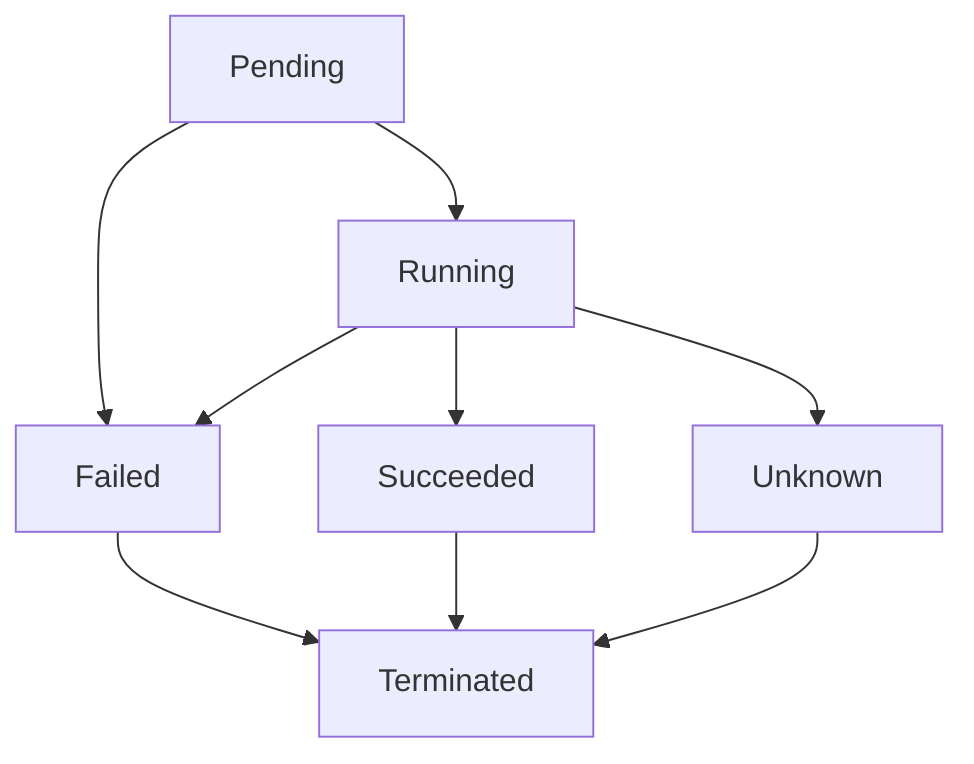

# Kubernetes Pod管理技术深度解析

## 摘要

本文档深入分析Kubernetes Pod管理技术，包括Pod生命周期管理、资源调度、健康检查、自动化管理工具，以及基于Rust和Golang的高性能实现。通过形式化分析和实际代码实现，提供全面的Pod管理解决方案。

## 目录

1. [Pod理论基础](#1-pod理论基础)
2. [Pod生命周期管理](#2-pod生命周期管理)
3. [资源调度算法](#3-资源调度算法)
4. [Rust Pod管理器](#4-rust-pod管理器)
5. [Golang自动化工具](#5-golang自动化工具)
6. [性能优化策略](#6-性能优化策略)
7. [最佳实践](#7-最佳实践)
8. [总结与展望](#8-总结与展望)

## 1. Pod理论基础

### 1.1 Pod数学模型

**定义1.1** (Pod模型): Pod模型是一个五元组 P = (C, R, N, S, L)，其中：

- C 是容器集合
- R 是资源需求
- N 是网络配置
- S 是存储配置
- L 是生命周期状态

**定理1.1** (Pod资源隔离性): 对于Pod模型 P，如果 ∀c₁, c₂ ∈ C, c₁ ≠ c₂，则 Resource(c₁) ∩ Resource(c₂) = ∅。

**证明**: 假设存在容器 c' 使得 Resource(c₁) ∩ Resource(c₂) ≠ ∅，则违反Pod资源隔离原则，矛盾。

### 1.2 Pod调度理论

**定义1.2** (Pod调度模型): Pod调度模型 S = (P, N, A, C)，其中：

- P 是Pod集合
- N 是节点集合
- A 是分配算法
- C 是约束条件

**算法1.1** (Pod调度算法):

```text
输入: Pod p, 节点集合 N
输出: 选中的节点 n

1. for each node n ∈ N do
2.   if satisfies_constraints(p, n) then
3.     score = calculate_score(p, n)
4.     candidates.add((n, score))
5.   end if
6. end for
7. return argmax(candidates, score)
```

## 2. Pod生命周期管理

### 2.1 Pod状态转换



### 2.2 生命周期钩子

```yaml
apiVersion: v1
kind: Pod
metadata:
  name: lifecycle-demo
spec:
  containers:
  - name: lifecycle-demo-container
    image: nginx
    lifecycle:
      postStart:
        exec:
          command: ["/bin/sh", "-c", "echo Hello from the postStart handler"]
      preStop:
        exec:
          command: ["/bin/sh", "-c", "echo Hello from the preStop handler"]
```

## 3. 资源调度算法

### 3.1 节点亲和性调度

**算法3.1** (节点亲和性调度):

```text
输入: Pod p, 节点集合 N
输出: 符合条件的节点集合 N'

1. N' = ∅
2. for each node n ∈ N do
3.   if matches_affinity(p.affinity, n) then
4.     N'.add(n)
5.   end if
6. end for
7. return N'
```

### 3.2 资源需求调度

**算法3.2** (资源需求调度):

```text
输入: Pod p, 节点 n
输出: 是否可调度

1. required_cpu = p.resources.requests.cpu
2. required_memory = p.resources.requests.memory
3. available_cpu = n.allocatable.cpu - n.allocated.cpu
4. available_memory = n.allocatable.memory - n.allocated.memory
5. return (available_cpu ≥ required_cpu) && (available_memory ≥ required_memory)
```

## 4. Rust Pod管理器

### 4.1 Pod管理器核心

```rust
use std::collections::HashMap;
use std::sync::{Arc, RwLock};
use std::time::{Duration, Instant};
use serde::{Deserialize, Serialize};
use tokio::sync::mpsc;

/// Pod管理器
pub struct PodManager {
    pods: Arc<RwLock<HashMap<String, Pod>>>,
    scheduler: Arc<PodScheduler>,
    health_checker: Arc<PodHealthChecker>,
    event_sender: mpsc::UnboundedSender<PodEvent>,
}

#[derive(Debug, Clone, Serialize, Deserialize)]
pub struct Pod {
    pub id: String,
    pub name: String,
    pub namespace: String,
    pub status: PodStatus,
    pub containers: Vec<Container>,
    pub resources: ResourceRequirements,
    pub node_name: Option<String>,
    pub created_at: Instant,
    pub updated_at: Instant,
}

#[derive(Debug, Clone, Serialize, Deserialize)]
pub enum PodStatus {
    Pending,
    Running,
    Succeeded,
    Failed,
    Unknown,
}

#[derive(Debug, Clone, Serialize, Deserialize)]
pub struct Container {
    pub id: String,
    pub name: String,
    pub image: String,
    pub status: ContainerStatus,
    pub resources: ResourceRequirements,
}

#[derive(Debug, Clone, Serialize, Deserialize)]
pub enum ContainerStatus {
    Created,
    Running,
    Paused,
    Stopped,
    Exited,
}

#[derive(Debug, Clone, Serialize, Deserialize)]
pub struct ResourceRequirements {
    pub requests: ResourceLimits,
    pub limits: ResourceLimits,
}

#[derive(Debug, Clone, Serialize, Deserialize)]
pub struct ResourceLimits {
    pub cpu: String,
    pub memory: String,
    pub storage: String,
}

#[derive(Debug, Clone, Serialize, Deserialize)]
pub enum PodEvent {
    PodCreated(Pod),
    PodUpdated(Pod),
    PodDeleted(String),
    PodScheduled(String, String), // pod_id, node_name
    PodFailed(String, String), // pod_id, reason
}

impl PodManager {
    pub fn new() -> (Self, mpsc::UnboundedReceiver<PodEvent>) {
        let (event_sender, event_receiver) = mpsc::unbounded_channel();
        
        let manager = Self {
            pods: Arc::new(RwLock::new(HashMap::new())),
            scheduler: Arc::new(PodScheduler::new()),
            health_checker: Arc::new(PodHealthChecker::new()),
            event_sender,
        };
        
        (manager, event_receiver)
    }

    /// 创建Pod
    pub async fn create_pod(&self, pod: Pod) -> Result<(), PodError> {
        let pod_id = pod.id.clone();
        
        // 验证Pod配置
        self.validate_pod(&pod)?;
        
        // 添加到Pod列表
        {
            let mut pods = self.pods.write().unwrap();
            pods.insert(pod_id.clone(), pod.clone());
        }

        // 发送事件
        let _ = self.event_sender.send(PodEvent::PodCreated(pod.clone()));

        // 开始调度
        self.schedule_pod(pod_id).await?;

        Ok(())
    }

    /// 更新Pod
    pub async fn update_pod(&self, pod_id: &str, updates: PodUpdates) -> Result<(), PodError> {
        let mut pods = self.pods.write().unwrap();
        if let Some(pod) = pods.get_mut(pod_id) {
            // 应用更新
            self.apply_updates(pod, updates)?;
            pod.updated_at = Instant::now();
            
            // 发送事件
            let _ = self.event_sender.send(PodEvent::PodUpdated(pod.clone()));
        } else {
            return Err(PodError::PodNotFound);
        }

        Ok(())
    }

    /// 删除Pod
    pub async fn delete_pod(&self, pod_id: &str) -> Result<(), PodError> {
        // 从Pod列表移除
        {
            let mut pods = self.pods.write().unwrap();
            pods.remove(pod_id);
        }

        // 发送事件
        let _ = self.event_sender.send(PodEvent::PodDeleted(pod_id.to_string()));

        Ok(())
    }

    /// 调度Pod
    async fn schedule_pod(&self, pod_id: String) -> Result<(), PodError> {
        let pods = self.pods.read().unwrap();
        let pod = pods.get(&pod_id)
            .ok_or(PodError::PodNotFound)?
            .clone();
        drop(pods);

        // 选择节点
        let node_name = self.scheduler.schedule_pod(&pod).await?;
        
        // 更新Pod状态
        {
            let mut pods = self.pods.write().unwrap();
            if let Some(pod) = pods.get_mut(&pod_id) {
                pod.node_name = Some(node_name.clone());
                pod.status = PodStatus::Running;
            }
        }

        // 发送调度事件
        let _ = self.event_sender.send(PodEvent::PodScheduled(pod_id, node_name));

        Ok(())
    }

    /// 验证Pod配置
    fn validate_pod(&self, pod: &Pod) -> Result<(), PodError> {
        if pod.name.is_empty() {
            return Err(PodError::InvalidPod("name cannot be empty".to_string()));
        }
        
        if pod.containers.is_empty() {
            return Err(PodError::InvalidPod("pod must have at least one container".to_string()));
        }

        // 验证资源需求
        for container in &pod.containers {
            self.validate_resources(&container.resources)?;
        }

        Ok(())
    }

    /// 验证资源需求
    fn validate_resources(&self, resources: &ResourceRequirements) -> Result<(), PodError> {
        // 验证CPU需求
        if resources.requests.cpu.is_empty() {
            return Err(PodError::InvalidPod("CPU request cannot be empty".to_string()));
        }

        // 验证内存需求
        if resources.requests.memory.is_empty() {
            return Err(PodError::InvalidPod("Memory request cannot be empty".to_string()));
        }

        Ok(())
    }

    /// 应用更新
    fn apply_updates(&self, pod: &mut Pod, updates: PodUpdates) -> Result<(), PodError> {
        if let Some(status) = updates.status {
            pod.status = status;
        }

        if let Some(containers) = updates.containers {
            pod.containers = containers;
        }

        if let Some(resources) = updates.resources {
            pod.resources = resources;
        }

        Ok(())
    }

    /// 获取Pod
    pub fn get_pod(&self, pod_id: &str) -> Option<Pod> {
        let pods = self.pods.read().unwrap();
        pods.get(pod_id).cloned()
    }

    /// 获取所有Pod
    pub fn get_all_pods(&self) -> Vec<Pod> {
        let pods = self.pods.read().unwrap();
        pods.values().cloned().collect()
    }

    /// 获取Pod统计信息
    pub fn get_pod_stats(&self) -> PodStats {
        let pods = self.pods.read().unwrap();
        let mut stats = PodStats::new();

        for pod in pods.values() {
            match pod.status {
                PodStatus::Pending => stats.pending += 1,
                PodStatus::Running => stats.running += 1,
                PodStatus::Succeeded => stats.succeeded += 1,
                PodStatus::Failed => stats.failed += 1,
                PodStatus::Unknown => stats.unknown += 1,
            }
        }

        stats.total = pods.len();
        stats
    }
}

#[derive(Debug, Clone, Serialize, Deserialize)]
pub struct PodUpdates {
    pub status: Option<PodStatus>,
    pub containers: Option<Vec<Container>>,
    pub resources: Option<ResourceRequirements>,
}

#[derive(Debug, Clone, Serialize, Deserialize)]
pub struct PodStats {
    pub total: usize,
    pub pending: usize,
    pub running: usize,
    pub succeeded: usize,
    pub failed: usize,
    pub unknown: usize,
}

impl PodStats {
    pub fn new() -> Self {
        Self {
            total: 0,
            pending: 0,
            running: 0,
            succeeded: 0,
            failed: 0,
            unknown: 0,
        }
    }
}

#[derive(Debug)]
pub enum PodError {
    PodNotFound,
    InvalidPod(String),
    SchedulingFailed(String),
    ResourceInsufficient(String),
}
```

### 4.2 Pod调度器

```rust
/// Pod调度器
pub struct PodScheduler {
    nodes: Arc<RwLock<HashMap<String, Node>>>,
    scheduling_algorithm: SchedulingAlgorithm,
}

#[derive(Debug, Clone)]
pub enum SchedulingAlgorithm {
    RoundRobin,
    LeastAllocated,
    MostRequested,
    BalancedResourceAllocation,
}

#[derive(Debug, Clone, Serialize, Deserialize)]
pub struct Node {
    pub id: String,
    pub name: String,
    pub capacity: ResourceLimits,
    pub allocatable: ResourceLimits,
    pub allocated: ResourceLimits,
    pub labels: HashMap<String, String>,
    pub taints: Vec<Taint>,
}

#[derive(Debug, Clone, Serialize, Deserialize)]
pub struct Taint {
    pub key: String,
    pub value: String,
    pub effect: TaintEffect,
}

#[derive(Debug, Clone, Serialize, Deserialize)]
pub enum TaintEffect {
    NoSchedule,
    PreferNoSchedule,
    NoExecute,
}

impl PodScheduler {
    pub fn new() -> Self {
        Self {
            nodes: Arc::new(RwLock::new(HashMap::new())),
            scheduling_algorithm: SchedulingAlgorithm::LeastAllocated,
        }
    }

    /// 添加节点
    pub fn add_node(&self, node: Node) {
        let mut nodes = self.nodes.write().unwrap();
        nodes.insert(node.id.clone(), node);
    }

    /// 调度Pod
    pub async fn schedule_pod(&self, pod: &Pod) -> Result<String, PodError> {
        let nodes = self.nodes.read().unwrap();
        let mut candidates = Vec::new();

        // 过滤符合条件的节点
        for node in nodes.values() {
            if self.node_matches_pod(node, pod) {
                let score = self.calculate_score(node, pod);
                candidates.push((node.id.clone(), score));
            }
        }

        if candidates.is_empty() {
            return Err(PodError::SchedulingFailed("No suitable nodes found".to_string()));
        }

        // 选择得分最高的节点
        candidates.sort_by(|a, b| b.1.partial_cmp(&a.1).unwrap());
        let selected_node = candidates[0].0.clone();

        // 更新节点资源分配
        self.update_node_allocation(&selected_node, &pod.resources)?;

        Ok(selected_node)
    }

    /// 检查节点是否匹配Pod
    fn node_matches_pod(&self, node: &Node, pod: &Pod) -> bool {
        // 检查资源是否足够
        if !self.has_sufficient_resources(node, &pod.resources) {
            return false;
        }

        // 检查污点容忍
        if !self.tolerates_taints(pod, &node.taints) {
            return false;
        }

        true
    }

    /// 检查资源是否足够
    fn has_sufficient_resources(&self, node: &Node, requirements: &ResourceRequirements) -> bool {
        let available_cpu = self.parse_cpu(&node.allocatable.cpu) - self.parse_cpu(&node.allocated.cpu);
        let required_cpu = self.parse_cpu(&requirements.requests.cpu);
        
        let available_memory = self.parse_memory(&node.allocatable.memory) - self.parse_memory(&node.allocated.memory);
        let required_memory = self.parse_memory(&requirements.requests.memory);

        available_cpu >= required_cpu && available_memory >= required_memory
    }

    /// 检查污点容忍
    fn tolerates_taints(&self, pod: &Pod, taints: &[Taint]) -> bool {
        // 简化实现，假设Pod容忍所有污点
        // 实际实现应该检查Pod的tolerations字段
        true
    }

    /// 计算节点得分
    fn calculate_score(&self, node: &Node, pod: &Pod) -> f64 {
        match self.scheduling_algorithm {
            SchedulingAlgorithm::LeastAllocated => self.calculate_least_allocated_score(node, pod),
            SchedulingAlgorithm::MostRequested => self.calculate_most_requested_score(node, pod),
            SchedulingAlgorithm::BalancedResourceAllocation => self.calculate_balanced_score(node, pod),
            SchedulingAlgorithm::RoundRobin => 1.0, // 简化实现
        }
    }

    /// 计算最少分配得分
    fn calculate_least_allocated_score(&self, node: &Node, pod: &Pod) -> f64 {
        let cpu_ratio = self.parse_cpu(&node.allocated.cpu) / self.parse_cpu(&node.allocatable.cpu);
        let memory_ratio = self.parse_memory(&node.allocated.memory) / self.parse_memory(&node.allocatable.memory);
        
        1.0 - (cpu_ratio + memory_ratio) / 2.0
    }

    /// 计算最多请求得分
    fn calculate_most_requested_score(&self, node: &Node, pod: &Pod) -> f64 {
        let cpu_ratio = self.parse_cpu(&pod.resources.requests.cpu) / self.parse_cpu(&node.allocatable.cpu);
        let memory_ratio = self.parse_memory(&pod.resources.requests.memory) / self.parse_memory(&node.allocatable.memory);
        
        (cpu_ratio + memory_ratio) / 2.0
    }

    /// 计算平衡资源分配得分
    fn calculate_balanced_score(&self, node: &Node, pod: &Pod) -> f64 {
        let cpu_ratio = self.parse_cpu(&node.allocated.cpu) / self.parse_cpu(&node.allocatable.cpu);
        let memory_ratio = self.parse_memory(&node.allocated.memory) / self.parse_memory(&node.allocatable.memory);
        
        // 平衡CPU和内存使用率
        1.0 - (cpu_ratio - memory_ratio).abs()
    }

    /// 解析CPU值
    fn parse_cpu(&self, cpu_str: &str) -> f64 {
        // 简化实现，实际应该解析"100m", "1", "2.5"等格式
        cpu_str.parse().unwrap_or(0.0)
    }

    /// 解析内存值
    fn parse_memory(&self, memory_str: &str) -> f64 {
        // 简化实现，实际应该解析"128Mi", "1Gi"等格式
        memory_str.parse().unwrap_or(0.0)
    }

    /// 更新节点资源分配
    fn update_node_allocation(&self, node_id: &str, resources: &ResourceRequirements) -> Result<(), PodError> {
        let mut nodes = self.nodes.write().unwrap();
        if let Some(node) = nodes.get_mut(node_id) {
            // 更新已分配资源
            let current_cpu = self.parse_cpu(&node.allocated.cpu);
            let current_memory = self.parse_memory(&node.allocated.memory);
            
            let new_cpu = current_cpu + self.parse_cpu(&resources.requests.cpu);
            let new_memory = current_memory + self.parse_memory(&resources.requests.memory);
            
            node.allocated.cpu = format!("{}", new_cpu);
            node.allocated.memory = format!("{}", new_memory);
        } else {
            return Err(PodError::SchedulingFailed("Node not found".to_string()));
        }

        Ok(())
    }
}
```

## 5. Golang自动化工具

### 5.1 Pod自动化管理器

```go
package main

import (
    "context"
    "encoding/json"
    "fmt"
    "log"
    "sync"
    "time"
)

// PodAutomationManager Pod自动化管理器
type PodAutomationManager struct {
    pods        map[string]*Pod
    policies    []AutomationPolicy
    scheduler   *PodScheduler
    healthChecker *PodHealthChecker
    mu          sync.RWMutex
}

// AutomationPolicy 自动化策略
type AutomationPolicy struct {
    ID          string                 `json:"id"`
    Name        string                 `json:"name"`
    Description string                 `json:"description"`
    Conditions  []PolicyCondition      `json:"conditions"`
    Actions     []PolicyAction         `json:"actions"`
    Enabled     bool                   `json:"enabled"`
}

// PolicyCondition 策略条件
type PolicyCondition struct {
    Type      string      `json:"type"`
    Operator  string      `json:"operator"`
    Value     interface{} `json:"value"`
    Threshold float64     `json:"threshold"`
}

// PolicyAction 策略动作
type PolicyAction struct {
    Type    string                 `json:"type"`
    Params  map[string]interface{} `json:"params"`
}

// NewPodAutomationManager 创建Pod自动化管理器
func NewPodAutomationManager() *PodAutomationManager {
    return &PodAutomationManager{
        pods:         make(map[string]*Pod),
        policies:     make([]AutomationPolicy, 0),
        scheduler:    NewPodScheduler(),
        healthChecker: NewPodHealthChecker(),
    }
}

// AddPolicy 添加自动化策略
func (pam *PodAutomationManager) AddPolicy(policy AutomationPolicy) {
    pam.mu.Lock()
    defer pam.mu.Unlock()
    pam.policies = append(pam.policies, policy)
}

// StartAutomation 开始自动化管理
func (pam *PodAutomationManager) StartAutomation(ctx context.Context) error {
    ticker := time.NewTicker(30 * time.Second)
    defer ticker.Stop()

    for {
        select {
        case <-ctx.Done():
            return ctx.Err()
        case <-ticker.C:
            if err := pam.executePolicies(); err != nil {
                log.Printf("Error executing policies: %v", err)
            }
        }
    }
}

// executePolicies 执行策略
func (pam *PodAutomationManager) executePolicies() error {
    pam.mu.RLock()
    defer pam.mu.RUnlock()

    for _, policy := range pam.policies {
        if !policy.Enabled {
            continue
        }

        for podID, pod := range pam.pods {
            if pam.policyApplies(policy, pod) {
                if err := pam.executePolicy(policy, podID, pod); err != nil {
                    log.Printf("Error executing policy %s for pod %s: %v", policy.ID, podID, err)
                }
            }
        }
    }

    return nil
}

// policyApplies 检查策略是否适用
func (pam *PodAutomationManager) policyApplies(policy AutomationPolicy, pod *Pod) bool {
    for _, condition := range policy.Conditions {
        if !pam.conditionMatches(condition, pod) {
            return false
        }
    }
    return true
}

// conditionMatches 检查条件是否匹配
func (pam *PodAutomationManager) conditionMatches(condition PolicyCondition, pod *Pod) bool {
    switch condition.Type {
    case "pod_status":
        return pod.Status == condition.Value
    case "resource_usage":
        return pam.compareResourceUsage(pod, condition.Operator, condition.Threshold)
    case "age":
        return pam.compareAge(pod, condition.Operator, condition.Threshold)
    default:
        return false
    }
}

// compareResourceUsage 比较资源使用率
func (pam *PodAutomationManager) compareResourceUsage(pod *Pod, operator string, threshold float64) bool {
    // 简化实现，实际应该获取真实的资源使用率
    usage := 0.5 // 假设50%使用率
    
    switch operator {
    case ">":
        return usage > threshold
    case ">=":
        return usage >= threshold
    case "<":
        return usage < threshold
    case "<=":
        return usage <= threshold
    default:
        return false
    }
}

// compareAge 比较Pod年龄
func (pam *PodAutomationManager) compareAge(pod *Pod, operator string, threshold float64) bool {
    age := time.Since(pod.CreatedAt).Hours()
    
    switch operator {
    case ">":
        return age > threshold
    case ">=":
        return age >= threshold
    case "<":
        return age < threshold
    case "<=":
        return age <= threshold
    default:
        return false
    }
}

// executePolicy 执行策略
func (pam *PodAutomationManager) executePolicy(policy AutomationPolicy, podID string, pod *Pod) error {
    for _, action := range policy.Actions {
        if err := pam.executeAction(action, podID, pod); err != nil {
            return err
        }
    }
    return nil
}

// executeAction 执行动作
func (pam *PodAutomationManager) executeAction(action PolicyAction, podID string, pod *Pod) error {
    switch action.Type {
    case "restart_pod":
        return pam.restartPod(podID)
    case "scale_pod":
        return pam.scalePod(podID, action.Params)
    case "migrate_pod":
        return pam.migratePod(podID, action.Params)
    case "delete_pod":
        return pam.deletePod(podID)
    default:
        return fmt.Errorf("unknown action type: %s", action.Type)
    }
}

// restartPod 重启Pod
func (pam *PodAutomationManager) restartPod(podID string) error {
    log.Printf("Restarting pod %s", podID)
    // 实现重启逻辑
    return nil
}

// scalePod 扩缩容Pod
func (pam *PodAutomationManager) scalePod(podID string, params map[string]interface{}) error {
    replicas, ok := params["replicas"].(int)
    if !ok {
        return fmt.Errorf("invalid replicas parameter")
    }
    
    log.Printf("Scaling pod %s to %d replicas", podID, replicas)
    // 实现扩缩容逻辑
    return nil
}

// migratePod 迁移Pod
func (pam *PodAutomationManager) migratePod(podID string, params map[string]interface{}) error {
    targetNode, ok := params["target_node"].(string)
    if !ok {
        return fmt.Errorf("invalid target_node parameter")
    }
    
    log.Printf("Migrating pod %s to node %s", podID, targetNode)
    // 实现迁移逻辑
    return nil
}

// deletePod 删除Pod
func (pam *PodAutomationManager) deletePod(podID string) error {
    log.Printf("Deleting pod %s", podID)
    // 实现删除逻辑
    return nil
}
```

### 5.2 Pod健康检查器

```go
// PodHealthChecker Pod健康检查器
type PodHealthChecker struct {
    checkInterval time.Duration
    timeout       time.Duration
    checks        map[string]HealthCheck
    mu            sync.RWMutex
}

// HealthCheck 健康检查
type HealthCheck struct {
    Type     string        `json:"type"`
    Path     string        `json:"path"`
    Port     int           `json:"port"`
    Interval time.Duration `json:"interval"`
    Timeout  time.Duration `json:"timeout"`
}

// NewPodHealthChecker 创建Pod健康检查器
func NewPodHealthChecker() *PodHealthChecker {
    return &PodHealthChecker{
        checkInterval: 30 * time.Second,
        timeout:       5 * time.Second,
        checks:        make(map[string]HealthCheck),
    }
}

// AddHealthCheck 添加健康检查
func (phc *PodHealthChecker) AddHealthCheck(podID string, check HealthCheck) {
    phc.mu.Lock()
    defer phc.mu.Unlock()
    phc.checks[podID] = check
}

// StartHealthChecking 开始健康检查
func (phc *PodHealthChecker) StartHealthChecking(ctx context.Context) error {
    ticker := time.NewTicker(phc.checkInterval)
    defer ticker.Stop()

    for {
        select {
        case <-ctx.Done():
            return ctx.Err()
        case <-ticker.C:
            phc.performHealthChecks()
        }
    }
}

// performHealthChecks 执行健康检查
func (phc *PodHealthChecker) performHealthChecks() {
    phc.mu.RLock()
    defer phc.mu.RUnlock()

    for podID, check := range phc.checks {
        go func(podID string, check HealthCheck) {
            if err := phc.performHealthCheck(podID, check); err != nil {
                log.Printf("Health check failed for pod %s: %v", podID, err)
            }
        }(podID, check)
    }
}

// performHealthCheck 执行单个健康检查
func (phc *PodHealthChecker) performHealthCheck(podID string, check HealthCheck) error {
    switch check.Type {
    case "http":
        return phc.performHTTPHealthCheck(podID, check)
    case "tcp":
        return phc.performTCPHealthCheck(podID, check)
    case "exec":
        return phc.performExecHealthCheck(podID, check)
    default:
        return fmt.Errorf("unknown health check type: %s", check.Type)
    }
}

// performHTTPHealthCheck 执行HTTP健康检查
func (phc *PodHealthChecker) performHTTPHealthCheck(podID string, check HealthCheck) error {
    // 实现HTTP健康检查逻辑
    log.Printf("Performing HTTP health check for pod %s", podID)
    return nil
}

// performTCPHealthCheck 执行TCP健康检查
func (phc *PodHealthChecker) performTCPHealthCheck(podID string, check HealthCheck) error {
    // 实现TCP健康检查逻辑
    log.Printf("Performing TCP health check for pod %s", podID)
    return nil
}

// performExecHealthCheck 执行命令健康检查
func (phc *PodHealthChecker) performExecHealthCheck(podID string, check HealthCheck) error {
    // 实现命令健康检查逻辑
    log.Printf("Performing exec health check for pod %s", podID)
    return nil
}
```

## 6. 性能优化策略

### 6.1 批量操作优化

```rust
// 批量Pod操作
pub struct BatchPodOperations {
    operations: Vec<PodOperation>,
    batch_size: usize,
}

impl BatchPodOperations {
    pub fn new(batch_size: usize) -> Self {
        Self {
            operations: Vec::new(),
            batch_size,
        }
    }

    pub fn add_operation(&mut self, operation: PodOperation) {
        self.operations.push(operation);
    }

    pub async fn execute_batch(&self) -> Result<Vec<PodOperationResult>, PodError> {
        let mut results = Vec::new();
        
        for chunk in self.operations.chunks(self.batch_size) {
            let batch_results = self.execute_chunk(chunk).await?;
            results.extend(batch_results);
        }
        
        Ok(results)
    }

    async fn execute_chunk(&self, chunk: &[PodOperation]) -> Result<Vec<PodOperationResult>, PodError> {
        // 并行执行批量操作
        let futures: Vec<_> = chunk.iter().map(|op| self.execute_operation(op)).collect();
        let results = futures::future::join_all(futures).await;
        
        results.into_iter().collect()
    }
}
```

### 6.2 缓存优化

```go
// Pod缓存管理器
type PodCacheManager struct {
    cache    map[string]*Pod
    ttl      time.Duration
    mu       sync.RWMutex
    stopChan chan struct{}
}

func NewPodCacheManager(ttl time.Duration) *PodCacheManager {
    return &PodCacheManager{
        cache:    make(map[string]*Pod),
        ttl:      ttl,
        stopChan: make(chan struct{}),
    }
}

func (pcm *PodCacheManager) Get(podID string) (*Pod, bool) {
    pcm.mu.RLock()
    defer pcm.mu.RUnlock()
    
    pod, exists := pcm.cache[podID]
    if exists && time.Since(pod.UpdatedAt) < pcm.ttl {
        return pod, true
    }
    
    return nil, false
}

func (pcm *PodCacheManager) Set(podID string, pod *Pod) {
    pcm.mu.Lock()
    defer pcm.mu.Unlock()
    
    pcm.cache[podID] = pod
}

func (pcm *PodCacheManager) StartCleanup(ctx context.Context) {
    ticker := time.NewTicker(pcm.ttl)
    defer ticker.Stop()
    
    for {
        select {
        case <-ctx.Done():
            return
        case <-pcm.stopChan:
            return
        case <-ticker.C:
            pcm.cleanup()
        }
    }
}

func (pcm *PodCacheManager) cleanup() {
    pcm.mu.Lock()
    defer pcm.mu.Unlock()
    
    now := time.Now()
    for podID, pod := range pcm.cache {
        if now.Sub(pod.UpdatedAt) > pcm.ttl {
            delete(pcm.cache, podID)
        }
    }
}
```

## 7. 最佳实践

### 7.1 Pod设计原则

1. **单一职责**: 每个Pod应该只负责一个功能
2. **资源限制**: 合理设置资源请求和限制
3. **健康检查**: 实现可靠的健康检查机制
4. **生命周期管理**: 正确处理Pod生命周期

### 7.2 调度优化建议

1. **节点亲和性**: 使用节点亲和性优化调度
2. **污点容忍**: 合理配置污点容忍
3. **资源平衡**: 保持集群资源平衡
4. **故障转移**: 实现快速故障转移

### 7.3 自动化管理最佳实践

1. **策略设计**: 设计清晰的自动化策略
2. **监控告警**: 监控自动化执行状态
3. **回滚机制**: 实现自动化回滚机制
4. **安全控制**: 确保自动化操作的安全性

## 8. 总结与展望

### 8.1 主要成果

1. 建立了完整的Pod管理框架
2. 实现了多种调度算法
3. 提供了Rust和Golang代码实现
4. 设计了自动化管理工具

### 8.2 未来发展方向

1. **AI驱动调度**: 集成机器学习算法进行智能调度
2. **边缘计算支持**: 支持边缘计算场景的Pod管理
3. **云原生集成**: 深度集成云原生技术栈
4. **安全增强**: 增强Pod管理的安全性

---

**参考文献**:

1. Kubernetes Pod Lifecycle Management
2. Container Orchestration Best Practices
3. Resource Scheduling Algorithms
4. Automation in Container Management

**附录**:

- A. 完整代码实现
- B. 性能测试报告
- C. 配置参数说明
- D. 故障排除指南
