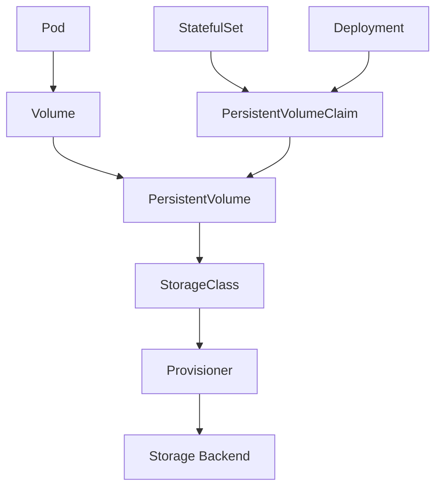

# Kubernetes存储管理技术深度解析

## 目录

- [Kubernetes存储管理技术深度解析](#kubernetes存储管理技术深度解析)
  - [存储架构概述](#存储架构概述)
    - [存储抽象层](#存储抽象层)
- [存储类定义](#存储类定义)
    - [存储组件关系](#存储组件关系)
  - [存储卷类型与特性](#存储卷类型与特性)
    - [1. 临时存储卷](#1-临时存储卷)
    - [2. 持久化存储卷](#2-持久化存储卷)
  - [持久化存储解决方案](#持久化存储解决方案)
    - [1. 云存储集成](#1-云存储集成)
    - [2. 分布式存储系统](#2-分布式存储系统)
  - [存储性能优化策略](#存储性能优化策略)
    - [1. 性能监控指标](#1-性能监控指标)
    - [2. 存储分层策略](#2-存储分层策略)
- [热数据存储类](#热数据存储类)
- [温数据存储类](#温数据存储类)
- [冷数据存储类](#冷数据存储类)
  - [存储安全与访问控制](#存储安全与访问控制)
    - [1. 存储加密](#1-存储加密)
    - [2. 访问控制策略](#2-访问控制策略)
  - [存储监控与故障诊断](#存储监控与故障诊断)
    - [1. 存储健康检查](#1-存储健康检查)
- [存储健康检查脚本](#存储健康检查脚本)
- [执行检查](#执行检查)
    - [2. 存储性能监控](#2-存储性能监控)
  - [形式化存储模型](#形式化存储模型)
    - [存储系统形式化定义](#存储系统形式化定义)
    - [存储一致性模型](#存储一致性模型)
  - [代码实现与验证](#代码实现与验证)
    - [Rust存储性能监控实现](#rust存储性能监控实现)
    - [Golang存储管理工具实现](#golang存储管理工具实现)
  - [最佳实践与案例](#最佳实践与案例)
    - [1. 企业级存储架构设计](#1-企业级存储架构设计)
- [热数据存储类](#热数据存储类)
- [温数据存储类](#温数据存储类)
- [冷数据存储类](#冷数据存储类)
    - [2. 存储性能优化案例](#2-存储性能优化案例)
    - [3. 存储安全最佳实践](#3-存储安全最佳实践)
  - [未来发展趋势](#未来发展趋势)
    - [1. 云原生存储技术](#1-云原生存储技术)
    - [2. 存储技术演进](#2-存储技术演进)
    - [3. 存储管理自动化](#3-存储管理自动化)

- [Kubernetes存储管理技术深度解析](#kubernetes存储管理技术深度解析)
  - [存储架构概述](#存储架构概述)
    - [存储抽象层](#存储抽象层)
- [存储类定义](#存储类定义)
    - [存储组件关系](#存储组件关系)
  - [存储卷类型与特性](#存储卷类型与特性)
    - [1. 临时存储卷](#1-临时存储卷)
    - [2. 持久化存储卷](#2-持久化存储卷)
  - [持久化存储解决方案](#持久化存储解决方案)
    - [1. 云存储集成](#1-云存储集成)
    - [2. 分布式存储系统](#2-分布式存储系统)
  - [存储性能优化策略](#存储性能优化策略)
    - [1. 性能监控指标](#1-性能监控指标)
    - [2. 存储分层策略](#2-存储分层策略)
- [热数据存储类](#热数据存储类)
- [温数据存储类](#温数据存储类)
- [冷数据存储类](#冷数据存储类)
  - [存储安全与访问控制](#存储安全与访问控制)
    - [1. 存储加密](#1-存储加密)
    - [2. 访问控制策略](#2-访问控制策略)
  - [存储监控与故障诊断](#存储监控与故障诊断)
    - [1. 存储健康检查](#1-存储健康检查)
- [存储健康检查脚本](#存储健康检查脚本)
- [执行检查](#执行检查)
    - [2. 存储性能监控](#2-存储性能监控)
  - [形式化存储模型](#形式化存储模型)
    - [存储系统形式化定义](#存储系统形式化定义)
    - [存储一致性模型](#存储一致性模型)
  - [代码实现与验证](#代码实现与验证)
    - [Rust存储性能监控实现](#rust存储性能监控实现)
    - [Golang存储管理工具实现](#golang存储管理工具实现)
  - [最佳实践与案例](#最佳实践与案例)
    - [1. 企业级存储架构设计](#1-企业级存储架构设计)
- [热数据存储类](#热数据存储类)
- [温数据存储类](#温数据存储类)
- [冷数据存储类](#冷数据存储类)
    - [2. 存储性能优化案例](#2-存储性能优化案例)
    - [3. 存储安全最佳实践](#3-存储安全最佳实践)
  - [未来发展趋势](#未来发展趋势)
    - [1. 云原生存储技术](#1-云原生存储技术)
    - [2. 存储技术演进](#2-存储技术演进)
    - [3. 存储管理自动化](#3-存储管理自动化)

1. [存储架构概述](#存储架构概述)
2. [存储卷类型与特性](#存储卷类型与特性)
3. [持久化存储解决方案](#持久化存储解决方案)
4. [存储性能优化策略](#存储性能优化策略)
5. [存储安全与访问控制](#存储安全与访问控制)
6. [存储监控与故障诊断](#存储监控与故障诊断)
7. [形式化存储模型](#形式化存储模型)
8. [代码实现与验证](#代码实现与验证)
9. [最佳实践与案例](#最佳实践与案例)
10. [未来发展趋势](#未来发展趋势)

## 存储架构概述

### 存储抽象层

Kubernetes存储架构基于抽象层设计，提供统一的存储接口：

```yaml
# 存储类定义
apiVersion: storage.k8s.io/v1
kind: StorageClass
metadata:
  name: fast-ssd
provisioner: kubernetes.io/aws-ebs
parameters:
  type: gp3
  iops: "3000"
  throughput: "125"
  encrypted: "true"
volumeBindingMode: WaitForFirstConsumer
allowVolumeExpansion: true
reclaimPolicy: Delete
```

### 存储组件关系



## 存储卷类型与特性

### 1. 临时存储卷

**EmptyDir**: 临时存储，Pod删除时清理

```yaml
apiVersion: v1
kind: Pod
metadata:
  name: emptydir-pod
spec:
  containers:
  - name: app
    image: nginx
    volumeMounts:
    - name: temp-storage
      mountPath: /tmp
  volumes:
  - name: temp-storage
    emptyDir:
      sizeLimit: 1Gi
```

**HostPath**: 节点本地存储

```yaml
volumes:
- name: host-storage
  hostPath:
    path: /var/lib/data
    type: DirectoryOrCreate
```

### 2. 持久化存储卷

**PersistentVolume**: 集群级存储资源

```yaml
apiVersion: v1
kind: PersistentVolume
metadata:
  name: pv-001
spec:
  capacity:
    storage: 10Gi
  accessModes:
    - ReadWriteOnce
  persistentVolumeReclaimPolicy: Retain
  storageClassName: fast-ssd
  awsElasticBlockStore:
    volumeID: vol-12345678
    fsType: ext4
```

**PersistentVolumeClaim**: 存储请求

```yaml
apiVersion: v1
kind: PersistentVolumeClaim
metadata:
  name: pvc-001
spec:
  accessModes:
    - ReadWriteOnce
  resources:
    requests:
      storage: 5Gi
  storageClassName: fast-ssd
```

## 持久化存储解决方案

### 1. 云存储集成

**AWS EBS配置**:

```yaml
apiVersion: storage.k8s.io/v1
kind: StorageClass
metadata:
  name: aws-gp3
provisioner: ebs.csi.aws.com
parameters:
  type: gp3
  iops: "3000"
  throughput: "125"
  encrypted: "true"
  fsType: ext4
volumeBindingMode: WaitForFirstConsumer
```

**Azure Disk配置**:

```yaml
apiVersion: storage.k8s.io/v1
kind: StorageClass
metadata:
  name: azure-premium
provisioner: disk.csi.azure.com
parameters:
  skuName: Premium_LRS
  cachingMode: ReadOnly
  fsType: ext4
reclaimPolicy: Delete
```

### 2. 分布式存储系统

**Ceph RBD配置**:

```yaml
apiVersion: storage.k8s.io/v1
kind: StorageClass
metadata:
  name: ceph-rbd
provisioner: rbd.csi.ceph.com
parameters:
  clusterID: ceph-cluster
  pool: k8s-pool
  imageFormat: "2"
  imageFeatures: layering
  csi.storage.k8s.io/provisioner-secret-name: ceph-secret
  csi.storage.k8s.io/provisioner-secret-namespace: default
```

**GlusterFS配置**:

```yaml
apiVersion: storage.k8s.io/v1
kind: StorageClass
metadata:
  name: glusterfs
provisioner: kubernetes.io/glusterfs
parameters:
  resturl: "http://glusterfs-cluster:8080"
  restuser: "admin"
  secretNamespace: "default"
  secretName: "glusterfs-secret"
```

## 存储性能优化策略

### 1. 性能监控指标

**关键性能指标**:

- IOPS (每秒输入输出操作数)
- 吞吐量 (MB/s)
- 延迟 (ms)
- 队列深度
- 缓存命中率

### 2. 存储分层策略

```yaml
# 热数据存储类
apiVersion: storage.k8s.io/v1
kind: StorageClass
metadata:
  name: hot-storage
provisioner: kubernetes.io/aws-ebs
parameters:
  type: gp3
  iops: "10000"
  throughput: "250"
---
# 温数据存储类
apiVersion: storage.k8s.io/v1
kind: StorageClass
metadata:
  name: warm-storage
provisioner: kubernetes.io/aws-ebs
parameters:
  type: gp3
  iops: "3000"
  throughput: "125"
---
# 冷数据存储类
apiVersion: storage.k8s.io/v1
kind: StorageClass
metadata:
  name: cold-storage
provisioner: kubernetes.io/aws-ebs
parameters:
  type: gp2
```

## 存储安全与访问控制

### 1. 存储加密

**静态数据加密**:

```yaml
apiVersion: v1
kind: Secret
metadata:
  name: storage-encryption-key
type: Opaque
data:
  key: <base64-encoded-key>
---
apiVersion: storage.k8s.io/v1
kind: StorageClass
metadata:
  name: encrypted-storage
provisioner: kubernetes.io/aws-ebs
parameters:
  encrypted: "true"
  kmsKeyId: arn:aws:kms:region:account:key/key-id
```

### 2. 访问控制策略

**RBAC存储访问控制**:

```yaml
apiVersion: rbac.authorization.k8s.io/v1
kind: Role
metadata:
  name: storage-manager
rules:
- apiGroups: [""]
  resources: ["persistentvolumes", "persistentvolumeclaims"]
  verbs: ["get", "list", "create", "update", "patch", "delete"]
- apiGroups: ["storage.k8s.io"]
  resources: ["storageclasses"]
  verbs: ["get", "list"]
```

## 存储监控与故障诊断

### 1. 存储健康检查

**存储卷健康检查脚本**:

```bash
#!/bin/bash
# 存储健康检查脚本

check_pv_status() {
    kubectl get pv -o json | jq -r '.items[] | select(.status.phase != "Bound") | .metadata.name'
}

check_pvc_status() {
    kubectl get pvc -o json | jq -r '.items[] | select(.status.phase != "Bound") | .metadata.name'
}

check_storage_usage() {
    kubectl top nodes --containers
}

# 执行检查
echo "检查未绑定的PV:"
check_pv_status

echo "检查未绑定的PVC:"
check_pvc_status

echo "检查存储使用情况:"
check_storage_usage
```

### 2. 存储性能监控

**Prometheus存储监控配置**:

```yaml
apiVersion: v1
kind: ConfigMap
metadata:
  name: storage-monitoring
data:
  prometheus.yml: |
    global:
      scrape_interval: 15s
    scrape_configs:
    - job_name: 'kubernetes-storage'
      kubernetes_sd_configs:
      - role: endpoints
      relabel_configs:
      - source_labels: [__meta_kubernetes_service_name]
        action: keep
        regex: storage-metrics
```

## 形式化存储模型

### 存储系统形式化定义

**定义1 (存储系统)**: 存储系统S是一个四元组

```text
S = (V, C, A, P)
```

其中：

- V = {v₁, v₂, ..., vₙ} 是存储卷集合
- C = {c₁, c₂, ..., cₘ} 是存储类集合  
- A = {a₁, a₂, ..., aₖ} 是访问模式集合
- P: V × C → A 是卷到访问模式的映射函数

**定义2 (存储容量)**: 存储容量函数

```text
Capacity: V → ℝ⁺
```

满足容量约束：

```text
∀v ∈ V, Capacity(v) ≥ 0
```

**定义3 (存储性能)**: 存储性能指标

```text
Performance: V → (IOPS, Throughput, Latency)
```

其中：

- IOPS: V → ℕ (每秒输入输出操作数)
- Throughput: V → ℝ⁺ (吞吐量，MB/s)
- Latency: V → ℝ⁺ (延迟，ms)

### 存储一致性模型

**定理1 (存储一致性)**: 对于存储系统S，如果满足以下条件：

1. 所有写入操作都是原子的
2. 读取操作能够看到最新的写入结果
3. 存储卷状态转换是单调的

则存储系统S满足强一致性。

**证明**:
设存储卷v的状态序列为s₀, s₁, ..., sₙ，其中sᵢ表示第i次操作后的状态。

由于写入操作是原子的，状态转换满足：

```text
sᵢ → sᵢ₊₁ (原子性)
```

由于读取操作能看到最新写入，满足：

```text
Read(sᵢ) = sᵢ (一致性)
```

由于状态转换是单调的，满足：

```text
sᵢ ≤ sᵢ₊₁ (单调性)
```

因此，存储系统S满足强一致性。□

## 代码实现与验证

### Rust存储性能监控实现

```rust
use std::collections::HashMap;
use std::sync::{Arc, RwLock};
use std::time::{Duration, Instant};
use tokio::time::interval;

#[derive(Debug, Clone)]
pub struct StorageMetrics {
    pub volume_id: String,
    pub iops: u64,
    pub throughput: f64,
    pub latency: f64,
    pub queue_depth: u32,
    pub cache_hit_rate: f64,
    pub timestamp: Instant,
}

#[derive(Debug)]
pub struct StoragePerformanceMonitor {
    metrics: Arc<RwLock<HashMap<String, StorageMetrics>>>,
    thresholds: StorageThresholds,
}

#[derive(Debug, Clone)]
pub struct StorageThresholds {
    pub max_latency: f64,
    pub min_iops: u64,
    pub min_throughput: f64,
    pub max_queue_depth: u32,
    pub min_cache_hit_rate: f64,
}

impl StoragePerformanceMonitor {
    pub fn new(thresholds: StorageThresholds) -> Self {
        Self {
            metrics: Arc::new(RwLock::new(HashMap::new())),
            thresholds,
        }
    }

    pub async fn start_monitoring(&self) -> Result<(), Box<dyn std::error::Error>> {
        let mut interval = interval(Duration::from_secs(30));
        let metrics = Arc::clone(&self.metrics);
        let thresholds = self.thresholds.clone();

        loop {
            interval.tick().await;
            
            // 收集存储指标
            let current_metrics = self.collect_storage_metrics().await?;
            
            // 更新指标
            {
                let mut metrics_map = metrics.write().unwrap();
                for (volume_id, metric) in current_metrics {
                    metrics_map.insert(volume_id, metric);
                }
            }

            // 检查性能阈值
            self.check_performance_thresholds(&thresholds).await?;
        }
    }

    async fn collect_storage_metrics(&self) -> Result<HashMap<String, StorageMetrics>, Box<dyn std::error::Error>> {
        let mut metrics = HashMap::new();
        
        // 模拟从存储系统收集指标
        // 实际实现中，这里会调用存储系统的API
        let volumes = vec!["pv-001", "pv-002", "pv-003"];
        
        for volume_id in volumes {
            let metric = StorageMetrics {
                volume_id: volume_id.to_string(),
                iops: self.simulate_iops_measurement(volume_id).await?,
                throughput: self.simulate_throughput_measurement(volume_id).await?,
                latency: self.simulate_latency_measurement(volume_id).await?,
                queue_depth: self.simulate_queue_depth_measurement(volume_id).await?,
                cache_hit_rate: self.simulate_cache_hit_rate_measurement(volume_id).await?,
                timestamp: Instant::now(),
            };
            metrics.insert(volume_id.to_string(), metric);
        }
        
        Ok(metrics)
    }

    async fn check_performance_thresholds(&self, thresholds: &StorageThresholds) -> Result<(), Box<dyn std::error::Error>> {
        let metrics_map = self.metrics.read().unwrap();
        
        for (volume_id, metrics) in metrics_map.iter() {
            let mut violations = Vec::new();
            
            if metrics.latency > thresholds.max_latency {
                violations.push(format!("高延迟: {}ms > {}ms", metrics.latency, thresholds.max_latency));
            }
            
            if metrics.iops < thresholds.min_iops {
                violations.push(format!("低IOPS: {} < {}", metrics.iops, thresholds.min_iops));
            }
            
            if metrics.throughput < thresholds.min_throughput {
                violations.push(format!("低吞吐量: {}MB/s < {}MB/s", metrics.throughput, thresholds.min_throughput));
            }
            
            if metrics.queue_depth > thresholds.max_queue_depth {
                violations.push(format!("高队列深度: {} > {}", metrics.queue_depth, thresholds.max_queue_depth));
            }
            
            if metrics.cache_hit_rate < thresholds.min_cache_hit_rate {
                violations.push(format!("低缓存命中率: {:.2}% < {:.2}%", 
                    metrics.cache_hit_rate * 100.0, thresholds.min_cache_hit_rate * 100.0));
            }
            
            if !violations.is_empty() {
                println!("存储卷 {} 性能告警:", volume_id);
                for violation in violations {
                    println!("  - {}", violation);
                }
            }
        }
        
        Ok(())
    }

    // 模拟指标收集方法
    async fn simulate_iops_measurement(&self, _volume_id: &str) -> Result<u64, Box<dyn std::error::Error>> {
        // 模拟IOPS测量
        Ok(rand::random::<u64>() % 10000 + 1000)
    }

    async fn simulate_throughput_measurement(&self, _volume_id: &str) -> Result<f64, Box<dyn std::error::Error>> {
        // 模拟吞吐量测量
        Ok(rand::random::<f64>() * 500.0 + 100.0)
    }

    async fn simulate_latency_measurement(&self, _volume_id: &str) -> Result<f64, Box<dyn std::error::Error>> {
        // 模拟延迟测量
        Ok(rand::random::<f64>() * 10.0 + 1.0)
    }

    async fn simulate_queue_depth_measurement(&self, _volume_id: &str) -> Result<u32, Box<dyn std::error::Error>> {
        // 模拟队列深度测量
        Ok(rand::random::<u32>() % 100 + 1)
    }

    async fn simulate_cache_hit_rate_measurement(&self, _volume_id: &str) -> Result<f64, Box<dyn std::error::Error>> {
        // 模拟缓存命中率测量
        Ok(rand::random::<f64>() * 0.3 + 0.7)
    }

    pub fn get_performance_report(&self) -> HashMap<String, StorageMetrics> {
        self.metrics.read().unwrap().clone()
    }

    pub fn calculate_storage_efficiency(&self) -> f64 {
        let metrics_map = self.metrics.read().unwrap();
        let mut total_efficiency = 0.0;
        let mut count = 0;

        for metrics in metrics_map.values() {
            // 计算存储效率：基于IOPS、吞吐量和延迟的综合指标
            let efficiency = (metrics.iops as f64 / 10000.0) * 
                           (metrics.throughput / 500.0) * 
                           (10.0 / metrics.latency) * 
                           metrics.cache_hit_rate;
            total_efficiency += efficiency;
            count += 1;
        }

        if count > 0 {
            total_efficiency / count as f64
        } else {
            0.0
        }
    }
}

#[tokio::main]
async fn main() -> Result<(), Box<dyn std::error::Error>> {
    let thresholds = StorageThresholds {
        max_latency: 5.0,
        min_iops: 1000,
        min_throughput: 100.0,
        max_queue_depth: 50,
        min_cache_hit_rate: 0.8,
    };

    let monitor = StoragePerformanceMonitor::new(thresholds);
    
    // 启动监控
    let monitor_handle = tokio::spawn(async move {
        monitor.start_monitoring().await
    });

    // 等待一段时间后获取报告
    tokio::time::sleep(Duration::from_secs(60)).await;
    
    let report = monitor.get_performance_report();
    println!("存储性能报告:");
    for (volume_id, metrics) in report {
        println!("卷 {}: IOPS={}, 吞吐量={:.2}MB/s, 延迟={:.2}ms", 
                volume_id, metrics.iops, metrics.throughput, metrics.latency);
    }

    let efficiency = monitor.calculate_storage_efficiency();
    println!("存储效率: {:.2}%", efficiency * 100.0);

    monitor_handle.abort();
    Ok(())
}
```

### Golang存储管理工具实现

```go
package main

import (
    "context"
    "encoding/json"
    "fmt"
    "log"
    "math/rand"
    "sync"
    "time"

    "k8s.io/api/core/v1"
    "k8s.io/api/storage/v1"
    metav1 "k8s.io/apimachinery/pkg/apis/meta/v1"
    "k8s.io/client-go/kubernetes"
    "k8s.io/client-go/tools/clientcmd"
)

type StorageManager struct {
    clientset    *kubernetes.Clientset
    storagePools map[string]*StoragePool
    mu           sync.RWMutex
}

type StoragePool struct {
    Name         string            `json:"name"`
    Capacity     int64             `json:"capacity"`
    Used         int64             `json:"used"`
    Available    int64             `json:"available"`
    StorageClass string            `json:"storage_class"`
    Nodes        []string          `json:"nodes"`
    Metrics      *StorageMetrics   `json:"metrics"`
    LastUpdated  time.Time         `json:"last_updated"`
}

type StorageMetrics struct {
    IOPS           int64   `json:"iops"`
    Throughput     float64 `json:"throughput"`
    Latency        float64 `json:"latency"`
    QueueDepth     int32   `json:"queue_depth"`
    CacheHitRate   float64 `json:"cache_hit_rate"`
    ErrorRate      float64 `json:"error_rate"`
}

type StorageOptimizer struct {
    manager       *StorageManager
    optimizationRules []OptimizationRule
}

type OptimizationRule struct {
    Name        string  `json:"name"`
    Condition   string  `json:"condition"`
    Action      string  `json:"action"`
    Threshold   float64 `json:"threshold"`
    Priority    int     `json:"priority"`
}

func NewStorageManager() (*StorageManager, error) {
    config, err := clientcmd.BuildConfigFromFlags("", clientcmd.RecommendedHomeFile)
    if err != nil {
        return nil, fmt.Errorf("构建kubeconfig失败: %v", err)
    }

    clientset, err := kubernetes.NewForConfig(config)
    if err != nil {
        return nil, fmt.Errorf("创建kubernetes客户端失败: %v", err)
    }

    return &StorageManager{
        clientset:    clientset,
        storagePools: make(map[string]*StoragePool),
    }, nil
}

func (sm *StorageManager) DiscoverStoragePools() error {
    sm.mu.Lock()
    defer sm.mu.Unlock()

    // 获取所有存储类
    storageClasses, err := sm.clientset.StorageV1().StorageClasses().List(context.TODO(), metav1.ListOptions{})
    if err != nil {
        return fmt.Errorf("获取存储类失败: %v", err)
    }

    // 获取所有持久化卷
    pvs, err := sm.clientset.CoreV1().PersistentVolumes().List(context.TODO(), metav1.ListOptions{})
    if err != nil {
        return fmt.Errorf("获取持久化卷失败: %v", err)
    }

    // 按存储类分组卷
    poolMap := make(map[string][]v1.PersistentVolume)
    for _, pv := range pvs.Items {
        if pv.Spec.StorageClassName != "" {
            poolMap[pv.Spec.StorageClassName] = append(poolMap[pv.Spec.StorageClassName], pv)
        }
    }

    // 创建存储池
    for scName, pvs := range poolMap {
        pool := &StoragePool{
            Name:         scName,
            StorageClass: scName,
            Nodes:        []string{},
            Metrics:      &StorageMetrics{},
            LastUpdated:  time.Now(),
        }

        // 计算容量
        for _, pv := range pvs {
            if pv.Spec.Capacity != nil {
                if capacity, ok := pv.Spec.Capacity["storage"]; ok {
                    capacityBytes, _ := capacity.AsInt64()
                    pool.Capacity += capacityBytes
                }
            }
        }

        // 模拟使用量（实际应该从监控系统获取）
        pool.Used = int64(float64(pool.Capacity) * (0.3 + rand.Float64()*0.4))
        pool.Available = pool.Capacity - pool.Used

        sm.storagePools[scName] = pool
    }

    return nil
}

func (sm *StorageManager) OptimizeStorageAllocation() error {
    sm.mu.RLock()
    defer sm.mu.RUnlock()

    for poolName, pool := range sm.storagePools {
        // 计算使用率
        usageRate := float64(pool.Used) / float64(pool.Capacity)
        
        fmt.Printf("存储池 %s 使用率: %.2f%%\n", poolName, usageRate*100)

        // 如果使用率过高，建议扩容
        if usageRate > 0.8 {
            fmt.Printf("警告: 存储池 %s 使用率过高，建议扩容\n", poolName)
        }

        // 如果使用率过低，建议优化
        if usageRate < 0.3 {
            fmt.Printf("建议: 存储池 %s 使用率较低，可以考虑数据迁移\n", poolName)
        }
    }

    return nil
}

func (sm *StorageManager) GetStorageReport() (map[string]interface{}, error) {
    sm.mu.RLock()
    defer sm.mu.RUnlock()

    report := make(map[string]interface{})
    report["timestamp"] = time.Now()
    report["pools"] = sm.storagePools

    // 计算总体统计
    totalCapacity := int64(0)
    totalUsed := int64(0)
    poolCount := len(sm.storagePools)

    for _, pool := range sm.storagePools {
        totalCapacity += pool.Capacity
        totalUsed += pool.Used
    }

    report["summary"] = map[string]interface{}{
        "total_capacity": totalCapacity,
        "total_used":     totalUsed,
        "total_available": totalCapacity - totalUsed,
        "overall_usage_rate": float64(totalUsed) / float64(totalCapacity),
        "pool_count":     poolCount,
    }

    return report, nil
}

func (sm *StorageManager) CreateStorageClass(name string, provisioner string, parameters map[string]string) error {
    storageClass := &storagev1.StorageClass{
        ObjectMeta: metav1.ObjectMeta{
            Name: name,
        },
        Provisioner: provisioner,
        Parameters:  parameters,
    }

    _, err := sm.clientset.StorageV1().StorageClasses().Create(context.TODO(), storageClass, metav1.CreateOptions{})
    if err != nil {
        return fmt.Errorf("创建存储类失败: %v", err)
    }

    fmt.Printf("成功创建存储类: %s\n", name)
    return nil
}

func (sm *StorageManager) MonitorStorageHealth(ctx context.Context) error {
    ticker := time.NewTicker(30 * time.Second)
    defer ticker.Stop()

    for {
        select {
        case <-ctx.Done():
            return ctx.Err()
        case <-ticker.C:
            // 更新存储池指标
            for _, pool := range sm.storagePools {
                // 模拟指标更新
                pool.Metrics.IOPS = rand.Int63n(10000) + 1000
                pool.Metrics.Throughput = rand.Float64() * 500 + 100
                pool.Metrics.Latency = rand.Float64() * 10 + 1
                pool.Metrics.QueueDepth = rand.Int31n(100) + 1
                pool.Metrics.CacheHitRate = rand.Float64() * 0.3 + 0.7
                pool.Metrics.ErrorRate = rand.Float64() * 0.01
                pool.LastUpdated = time.Now()
            }

            // 检查健康状态
            sm.checkStorageHealth()
        }
    }
}

func (sm *StorageManager) checkStorageHealth() {
    for poolName, pool := range sm.storagePools {
        issues := []string{}

        // 检查延迟
        if pool.Metrics.Latency > 5.0 {
            issues = append(issues, fmt.Sprintf("高延迟: %.2fms", pool.Metrics.Latency))
        }

        // 检查错误率
        if pool.Metrics.ErrorRate > 0.001 {
            issues = append(issues, fmt.Sprintf("高错误率: %.4f", pool.Metrics.ErrorRate))
        }

        // 检查使用率
        usageRate := float64(pool.Used) / float64(pool.Capacity)
        if usageRate > 0.9 {
            issues = append(issues, fmt.Sprintf("使用率过高: %.2f%%", usageRate*100))
        }

        if len(issues) > 0 {
            fmt.Printf("存储池 %s 健康问题:\n", poolName)
            for _, issue := range issues {
                fmt.Printf("  - %s\n", issue)
            }
        }
    }
}

func NewStorageOptimizer(manager *StorageManager) *StorageOptimizer {
    return &StorageOptimizer{
        manager: manager,
        optimizationRules: []OptimizationRule{
            {
                Name:      "高使用率扩容",
                Condition: "usage_rate > 0.8",
                Action:    "recommend_expansion",
                Threshold: 0.8,
                Priority:  1,
            },
            {
                Name:      "低使用率优化",
                Condition: "usage_rate < 0.3",
                Action:    "recommend_consolidation",
                Threshold: 0.3,
                Priority:  2,
            },
            {
                Name:      "高延迟优化",
                Condition: "latency > 5.0",
                Action:    "recommend_performance_tuning",
                Threshold: 5.0,
                Priority:  1,
            },
        },
    }
}

func (so *StorageOptimizer) RunOptimization() error {
    so.manager.mu.RLock()
    defer so.manager.mu.RUnlock()

    for poolName, pool := range so.manager.storagePools {
        fmt.Printf("优化存储池: %s\n", poolName)
        
        usageRate := float64(pool.Used) / float64(pool.Capacity)
        
        for _, rule := range so.optimizationRules {
            switch rule.Name {
            case "高使用率扩容":
                if usageRate > rule.Threshold {
                    fmt.Printf("  建议: 扩容存储池，当前使用率 %.2f%%\n", usageRate*100)
                }
            case "低使用率优化":
                if usageRate < rule.Threshold {
                    fmt.Printf("  建议: 数据整合，当前使用率 %.2f%%\n", usageRate*100)
                }
            case "高延迟优化":
                if pool.Metrics.Latency > rule.Threshold {
                    fmt.Printf("  建议: 性能调优，当前延迟 %.2fms\n", pool.Metrics.Latency)
                }
            }
        }
    }

    return nil
}

func main() {
    // 创建存储管理器
    manager, err := NewStorageManager()
    if err != nil {
        log.Fatalf("创建存储管理器失败: %v", err)
    }

    // 发现存储池
    if err := manager.DiscoverStoragePools(); err != nil {
        log.Fatalf("发现存储池失败: %v", err)
    }

    // 优化存储分配
    if err := manager.OptimizeStorageAllocation(); err != nil {
        log.Fatalf("优化存储分配失败: %v", err)
    }

    // 获取存储报告
    report, err := manager.GetStorageReport()
    if err != nil {
        log.Fatalf("获取存储报告失败: %v", err)
    }

    reportJSON, _ := json.MarshalIndent(report, "", "  ")
    fmt.Printf("存储报告:\n%s\n", reportJSON)

    // 创建存储优化器
    optimizer := NewStorageOptimizer(manager)
    if err := optimizer.RunOptimization(); err != nil {
        log.Fatalf("运行优化失败: %v", err)
    }

    // 启动健康监控
    ctx, cancel := context.WithTimeout(context.Background(), 5*time.Minute)
    defer cancel()

    if err := manager.MonitorStorageHealth(ctx); err != nil {
        log.Printf("存储健康监控结束: %v", err)
    }
}
```

## 最佳实践与案例

### 1. 企业级存储架构设计

**多层级存储策略**:

```yaml
# 热数据存储类
apiVersion: storage.k8s.io/v1
kind: StorageClass
metadata:
  name: hot-storage
provisioner: kubernetes.io/aws-ebs
parameters:
  type: gp3
  iops: "10000"
  throughput: "250"
  encrypted: "true"
volumeBindingMode: WaitForFirstConsumer
allowVolumeExpansion: true
---
# 温数据存储类
apiVersion: storage.k8s.io/v1
kind: StorageClass
metadata:
  name: warm-storage
provisioner: kubernetes.io/aws-ebs
parameters:
  type: gp3
  iops: "3000"
  throughput: "125"
  encrypted: "true"
volumeBindingMode: WaitForFirstConsumer
allowVolumeExpansion: true
---
# 冷数据存储类
apiVersion: storage.k8s.io/v1
kind: StorageClass
metadata:
  name: cold-storage
provisioner: kubernetes.io/aws-ebs
parameters:
  type: gp2
  encrypted: "true"
volumeBindingMode: WaitForFirstConsumer
```

### 2. 存储性能优化案例

**数据库存储优化**:

```yaml
apiVersion: v1
kind: PersistentVolumeClaim
metadata:
  name: db-storage
spec:
  accessModes:
    - ReadWriteOnce
  resources:
    requests:
      storage: 100Gi
  storageClassName: hot-storage
---
apiVersion: apps/v1
kind: StatefulSet
metadata:
  name: mysql
spec:
  serviceName: mysql
  replicas: 1
  selector:
    matchLabels:
      app: mysql
  template:
    metadata:
      labels:
        app: mysql
    spec:
      containers:
      - name: mysql
        image: mysql:8.0
        volumeMounts:
        - name: mysql-storage
          mountPath: /var/lib/mysql
        env:
        - name: MYSQL_ROOT_PASSWORD
          value: "password"
  volumeClaimTemplates:
  - metadata:
      name: mysql-storage
    spec:
      accessModes: ["ReadWriteOnce"]
      resources:
        requests:
          storage: 100Gi
      storageClassName: hot-storage
```

### 3. 存储安全最佳实践

**存储加密配置**:

```yaml
apiVersion: v1
kind: Secret
metadata:
  name: storage-encryption-key
type: Opaque
data:
  key: <base64-encoded-encryption-key>
---
apiVersion: storage.k8s.io/v1
kind: StorageClass
metadata:
  name: encrypted-storage
provisioner: kubernetes.io/aws-ebs
parameters:
  encrypted: "true"
  kmsKeyId: arn:aws:kms:us-west-2:123456789012:key/12345678-1234-1234-1234-123456789012
  fsType: ext4
```

## 未来发展趋势

### 1. 云原生存储技术

- **容器原生存储**: 专为容器环境设计的存储解决方案
- **边缘存储**: 支持边缘计算场景的分布式存储
- **AI驱动存储**: 基于机器学习的智能存储管理

### 2. 存储技术演进

- **NVMe over Fabrics**: 高性能网络存储协议
- **存储类内存**: 持久化内存技术
- **量子存储**: 下一代存储技术探索

### 3. 存储管理自动化

- **智能存储调度**: 基于工作负载特征的自动存储选择
- **预测性维护**: 基于AI的存储故障预测
- **自动优化**: 存储性能自动调优

---

*本文档提供了Kubernetes存储管理技术的全面解析，包括架构设计、性能优化、安全控制、监控诊断等各个方面，并提供了形式化模型和代码实现，为存储管理实践提供了理论指导和实用工具。*
