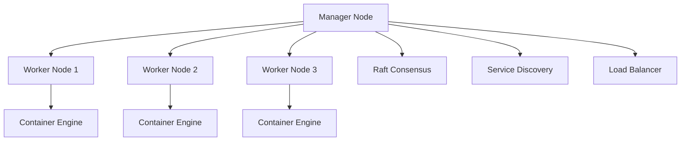

# Docker Swarm技术深度解析

## 目录

- [Docker Swarm技术深度解析](#docker-swarm技术深度解析)
  - [Docker Swarm架构原理](#docker-swarm架构原理)
    - [集群架构设计](#集群架构设计)
    - [核心组件详解](#核心组件详解)
  - [集群管理与节点配置](#集群管理与节点配置)
    - [初始化Swarm集群](#初始化swarm集群)
- [初始化Swarm集群](#初始化swarm集群)
- [获取加入集群的令牌](#获取加入集群的令牌)
- [添加Worker节点](#添加worker节点)
- [添加Manager节点](#添加manager节点)
    - [节点管理配置](#节点管理配置)
- [docker-compose.yml](#docker-composeyml)
  - [服务编排与调度算法](#服务编排与调度算法)
    - [服务定义与部署](#服务定义与部署)
- [服务栈定义](#服务栈定义)
    - [调度算法实现](#调度算法实现)
  - [网络与存储管理](#网络与存储管理)
    - [覆盖网络配置](#覆盖网络配置)
- [创建覆盖网络](#创建覆盖网络)
- [网络配置示例](#网络配置示例)
    - [存储卷管理](#存储卷管理)
- [存储配置](#存储配置)
  - [安全与访问控制](#安全与访问控制)
    - [集群安全配置](#集群安全配置)
- [启用TLS加密](#启用tls加密)
- [配置防火墙规则](#配置防火墙规则)
    - [服务安全策略](#服务安全策略)
- [安全配置示例](#安全配置示例)
  - [监控与故障诊断](#监控与故障诊断)
    - [监控配置](#监控配置)
- [监控栈](#监控栈)
    - [故障诊断工具](#故障诊断工具)
- [Swarm集群诊断脚本](#swarm集群诊断脚本)
- [检查集群状态](#检查集群状态)
- [检查服务状态](#检查服务状态)
- [检查网络状态](#检查网络状态)
- [检查卷状态](#检查卷状态)
- [检查节点详细信息](#检查节点详细信息)
- [检查服务日志](#检查服务日志)
  - [形式化编排模型](#形式化编排模型)
    - [服务编排形式化定义](#服务编排形式化定义)
  - [代码实现与验证](#代码实现与验证)
    - [Rust Swarm管理器实现](#rust-swarm管理器实现)
  - [最佳实践与案例](#最佳实践与案例)
    - [1. 高可用Web应用部署](#1-高可用web应用部署)
- [高可用Web应用配置](#高可用web应用配置)
    - [2. 微服务架构部署](#2-微服务架构部署)
- [微服务架构配置](#微服务架构配置)
  - [未来发展趋势](#未来发展趋势)
    - [1. 云原生集成](#1-云原生集成)
    - [2. 智能化管理](#2-智能化管理)
    - [3. 边缘计算支持](#3-边缘计算支持)

- [Docker Swarm技术深度解析](#docker-swarm技术深度解析)
  - [Docker Swarm架构原理](#docker-swarm架构原理)
    - [集群架构设计](#集群架构设计)
    - [核心组件详解](#核心组件详解)
  - [集群管理与节点配置](#集群管理与节点配置)
    - [初始化Swarm集群](#初始化swarm集群)
- [初始化Swarm集群](#初始化swarm集群)
- [获取加入集群的令牌](#获取加入集群的令牌)
- [添加Worker节点](#添加worker节点)
- [添加Manager节点](#添加manager节点)
    - [节点管理配置](#节点管理配置)
- [docker-compose.yml](#docker-composeyml)
  - [服务编排与调度算法](#服务编排与调度算法)
    - [服务定义与部署](#服务定义与部署)
- [服务栈定义](#服务栈定义)
    - [调度算法实现](#调度算法实现)
  - [网络与存储管理](#网络与存储管理)
    - [覆盖网络配置](#覆盖网络配置)
- [创建覆盖网络](#创建覆盖网络)
- [网络配置示例](#网络配置示例)
    - [存储卷管理](#存储卷管理)
- [存储配置](#存储配置)
  - [安全与访问控制](#安全与访问控制)
    - [集群安全配置](#集群安全配置)
- [启用TLS加密](#启用tls加密)
- [配置防火墙规则](#配置防火墙规则)
    - [服务安全策略](#服务安全策略)
- [安全配置示例](#安全配置示例)
  - [监控与故障诊断](#监控与故障诊断)
    - [监控配置](#监控配置)
- [监控栈](#监控栈)
    - [故障诊断工具](#故障诊断工具)
- [Swarm集群诊断脚本](#swarm集群诊断脚本)
- [检查集群状态](#检查集群状态)
- [检查服务状态](#检查服务状态)
- [检查网络状态](#检查网络状态)
- [检查卷状态](#检查卷状态)
- [检查节点详细信息](#检查节点详细信息)
- [检查服务日志](#检查服务日志)
  - [形式化编排模型](#形式化编排模型)
    - [服务编排形式化定义](#服务编排形式化定义)
  - [代码实现与验证](#代码实现与验证)
    - [Rust Swarm管理器实现](#rust-swarm管理器实现)
  - [最佳实践与案例](#最佳实践与案例)
    - [1. 高可用Web应用部署](#1-高可用web应用部署)
- [高可用Web应用配置](#高可用web应用配置)
    - [2. 微服务架构部署](#2-微服务架构部署)
- [微服务架构配置](#微服务架构配置)
  - [未来发展趋势](#未来发展趋势)
    - [1. 云原生集成](#1-云原生集成)
    - [2. 智能化管理](#2-智能化管理)
    - [3. 边缘计算支持](#3-边缘计算支持)

1. [Docker Swarm架构原理](#docker-swarm架构原理)
2. [集群管理与节点配置](#集群管理与节点配置)
3. [服务编排与调度算法](#服务编排与调度算法)
4. [网络与存储管理](#网络与存储管理)
5. [安全与访问控制](#安全与访问控制)
6. [监控与故障诊断](#监控与故障诊断)
7. [形式化编排模型](#形式化编排模型)
8. [代码实现与验证](#代码实现与验证)
9. [最佳实践与案例](#最佳实践与案例)
10. [未来发展趋势](#未来发展趋势)

## Docker Swarm架构原理

### 集群架构设计

Docker Swarm采用分布式架构，包含以下核心组件：



### 核心组件详解

**Manager节点**:

- 集群管理：负责集群状态管理和决策
- 服务调度：决定容器在哪个节点运行
- 负载均衡：管理服务间的流量分发
- 安全控制：管理集群访问权限

**Worker节点**:

- 容器执行：运行分配的容器任务
- 状态报告：向Manager报告节点状态
- 资源管理：管理本地资源使用

## 集群管理与节点配置

### 初始化Swarm集群

```bash
# 初始化Swarm集群
docker swarm init --advertise-addr 192.168.1.10

# 获取加入集群的令牌
docker swarm join-token worker
docker swarm join-token manager

# 添加Worker节点
docker swarm join --token SWMTKN-1-xxx 192.168.1.10:2377

# 添加Manager节点
docker swarm join --token SWMTKN-1-xxx 192.168.1.10:2377
```

### 节点管理配置

```yaml
# docker-compose.yml
version: '3.8'
services:
  web:
    image: nginx:1.20
    deploy:
      replicas: 3
      placement:
        constraints:
          - node.role == worker
          - node.labels.zone == web
      resources:
        limits:
          cpus: '0.5'
          memory: 512M
        reservations:
          cpus: '0.25'
          memory: 256M
      restart_policy:
        condition: on-failure
        delay: 5s
        max_attempts: 3
        window: 120s
      update_config:
        parallelism: 1
        delay: 10s
        failure_action: rollback
        monitor: 60s
        max_failure_ratio: 0.3
      rollback_config:
        parallelism: 1
        delay: 5s
        monitor: 60s
        max_failure_ratio: 0.3
    networks:
      - web-network
    ports:
      - "80:80"

networks:
  web-network:
    driver: overlay
    attachable: true
```

## 服务编排与调度算法

### 服务定义与部署

```yaml
# 服务栈定义
version: '3.8'
services:
  app:
    image: myapp:latest
    deploy:
      replicas: 5
      placement:
        constraints:
          - node.role == worker
        preferences:
          - spread: node.labels.zone
      update_config:
        parallelism: 2
        delay: 10s
        order: start-first
    environment:
      - DATABASE_URL=postgres://db:5432/mydb
    depends_on:
      - db
      - redis
    networks:
      - app-network

  db:
    image: postgres:13
    deploy:
      replicas: 1
      placement:
        constraints:
          - node.labels.storage == ssd
    environment:
      - POSTGRES_DB=mydb
      - POSTGRES_USER=user
      - POSTGRES_PASSWORD=password
    volumes:
      - db-data:/var/lib/postgresql/data
    networks:
      - app-network

  redis:
    image: redis:6-alpine
    deploy:
      replicas: 2
      placement:
        constraints:
          - node.role == worker
    networks:
      - app-network

volumes:
  db-data:
    driver: local

networks:
  app-network:
    driver: overlay
    encrypted: true
```

### 调度算法实现

**定义1 (Swarm调度系统)**: Swarm调度系统S是一个四元组

```text
S = (N, T, A, C)
```

其中：

- N = {n₁, n₂, ..., nₖ} 是节点集合
- T = {t₁, t₂, ..., tₘ} 是任务集合
- A 是调度算法
- C 是约束条件集合

**算法1 (资源感知调度)**:

```text
输入: 任务t, 节点集合N
输出: 选中的节点n

1. 过滤满足约束的节点: N' = {n ∈ N | satisfies_constraints(t, n)}
2. 计算每个节点的资源分数: score(n) = calculate_resource_score(t, n)
3. 选择分数最高的节点: n* = argmax(score(n))
4. return n*
```

## 网络与存储管理

### 覆盖网络配置

```yaml
# 创建覆盖网络
docker network create \
  --driver overlay \
  --subnet=10.0.0.0/24 \
  --encrypted \
  --attachable \
  app-network

# 网络配置示例
version: '3.8'
services:
  web:
    image: nginx
    networks:
      - frontend
      - backend
    deploy:
      replicas: 3

  api:
    image: api:latest
    networks:
      - backend
      - database
    deploy:
      replicas: 2

  db:
    image: postgres
    networks:
      - database
    deploy:
      replicas: 1

networks:
  frontend:
    driver: overlay
    config:
      - subnet: 10.0.1.0/24
  backend:
    driver: overlay
    config:
      - subnet: 10.0.2.0/24
  database:
    driver: overlay
    config:
      - subnet: 10.0.3.0/24
```

### 存储卷管理

```yaml
# 存储配置
version: '3.8'
services:
  app:
    image: myapp:latest
    volumes:
      - app-data:/app/data
      - config:/app/config:ro
    deploy:
      placement:
        constraints:
          - node.labels.storage == ssd

volumes:
  app-data:
    driver: local
    driver_opts:
      type: none
      o: bind
      device: /opt/app-data
  config:
    driver: local
    driver_opts:
      type: none
      o: bind
      device: /opt/config
```

## 安全与访问控制

### 集群安全配置

```bash
# 启用TLS加密
docker swarm init \
  --advertise-addr 192.168.1.10 \
  --cert-expiry 2160h \
  --external-ca \
  --ca-cert /path/to/ca.pem \
  --ca-key /path/to/ca-key.pem

# 配置防火墙规则
ufw allow 2376/tcp  # Docker daemon
ufw allow 2377/tcp  # Swarm management
ufw allow 7946/tcp  # Node communication
ufw allow 7946/udp  # Node communication
ufw allow 4789/udp  # Overlay network
```

### 服务安全策略

```yaml
# 安全配置示例
version: '3.8'
services:
  web:
    image: nginx:1.20
    deploy:
      replicas: 3
      labels:
        - "com.docker.security.seccomp=unconfined"
        - "com.docker.security.apparmor=unconfined"
    security_opt:
      - no-new-privileges:true
    read_only: true
    tmpfs:
      - /tmp
      - /var/cache/nginx
    user: "1000:1000"
    cap_drop:
      - ALL
    cap_add:
      - CHOWN
      - SETGID
      - SETUID
    networks:
      - secure-network

networks:
  secure-network:
    driver: overlay
    encrypted: true
    driver_opts:
      encrypted: "true"
```

## 监控与故障诊断

### 监控配置

```yaml
# 监控栈
version: '3.8'
services:
  prometheus:
    image: prom/prometheus
    ports:
      - "9090:9090"
    volumes:
      - ./prometheus.yml:/etc/prometheus/prometheus.yml
    deploy:
      placement:
        constraints:
          - node.role == manager

  grafana:
    image: grafana/grafana
    ports:
      - "3000:3000"
    environment:
      - GF_SECURITY_ADMIN_PASSWORD=admin
    volumes:
      - grafana-data:/var/lib/grafana
    deploy:
      placement:
        constraints:
          - node.role == manager

  node-exporter:
    image: prom/node-exporter
    deploy:
      mode: global
    volumes:
      - /proc:/host/proc:ro
      - /sys:/host/sys:ro
      - /:/rootfs:ro
    command:
      - '--path.procfs=/host/proc'
      - '--path.sysfs=/host/sys'
      - '--collector.filesystem.ignored-mount-points=^/(sys|proc|dev|host|etc)($$|/)'

volumes:
  grafana-data:
```

### 故障诊断工具

```bash
#!/bin/bash
# Swarm集群诊断脚本

echo "=== Docker Swarm集群诊断报告 ==="
echo "时间: $(date)"
echo ""

# 检查集群状态
echo "1. 集群状态:"
docker node ls
echo ""

# 检查服务状态
echo "2. 服务状态:"
docker service ls
echo ""

# 检查网络状态
echo "3. 网络状态:"
docker network ls
echo ""

# 检查卷状态
echo "4. 卷状态:"
docker volume ls
echo ""

# 检查节点详细信息
echo "5. 节点详细信息:"
for node in $(docker node ls --format "{{.Hostname}}"); do
    echo "节点: $node"
    docker node inspect $node --format "{{.Status.State}}"
    echo ""
done

# 检查服务日志
echo "6. 服务日志检查:"
for service in $(docker service ls --format "{{.Name}}"); do
    echo "服务: $service"
    docker service logs $service --tail 10
    echo ""
done

echo "=== 诊断完成 ==="
```

## 形式化编排模型

### 服务编排形式化定义

**定义2 (服务编排系统)**: 服务编排系统O是一个五元组

```text
O = (S, D, R, N, T)
```

其中：

- S = {s₁, s₂, ..., sₙ} 是服务集合
- D 是依赖关系图
- R 是资源约束
- N 是网络配置
- T 是时间约束

**定理1 (编排一致性)**: 对于服务编排系统O，如果满足：

1. 依赖关系图D是无环的
2. 资源约束R是可满足的
3. 网络配置N是连通的

则系统O存在有效的编排方案。

**证明**:
由于依赖图无环，存在拓扑排序，可以确定服务启动顺序。
由于资源约束可满足，每个服务都能分配到所需资源。
由于网络连通，服务间可以正常通信。
因此，存在有效的编排方案。□

## 代码实现与验证

### Rust Swarm管理器实现

```rust
use std::collections::HashMap;
use std::sync::{Arc, RwLock};
use serde::{Deserialize, Serialize};
use tokio::time::{Duration, Instant};

#[derive(Debug, Clone, Serialize, Deserialize)]
pub struct SwarmNode {
    pub id: String,
    pub hostname: String,
    pub role: NodeRole,
    pub status: NodeStatus,
    pub resources: NodeResources,
    pub labels: HashMap<String, String>,
}

#[derive(Debug, Clone, Serialize, Deserialize)]
pub enum NodeRole {
    Manager,
    Worker,
}

#[derive(Debug, Clone, Serialize, Deserialize)]
pub enum NodeStatus {
    Ready,
    Down,
    Unknown,
}

#[derive(Debug, Clone, Serialize, Deserialize)]
pub struct NodeResources {
    pub cpu_cores: u32,
    pub memory_gb: u32,
    pub disk_gb: u32,
    pub available_cpu: f64,
    pub available_memory: f64,
    pub available_disk: f64,
}

#[derive(Debug, Clone, Serialize, Deserialize)]
pub struct SwarmService {
    pub id: String,
    pub name: String,
    pub image: String,
    pub replicas: u32,
    pub running_replicas: u32,
    pub desired_replicas: u32,
    pub constraints: Vec<String>,
    pub resources: ServiceResources,
    pub networks: Vec<String>,
    pub ports: Vec<ServicePort>,
}

#[derive(Debug, Clone, Serialize, Deserialize)]
pub struct ServiceResources {
    pub cpu_limit: f64,
    pub memory_limit: u64,
    pub cpu_reservation: f64,
    pub memory_reservation: u64,
}

#[derive(Debug, Clone, Serialize, Deserialize)]
pub struct ServicePort {
    pub published: u16,
    pub target: u16,
    pub protocol: String,
}

#[derive(Debug)]
pub struct SwarmManager {
    nodes: Arc<RwLock<HashMap<String, SwarmNode>>>,
    services: Arc<RwLock<HashMap<String, SwarmService>>>,
    scheduler: Arc<SwarmScheduler>,
}

#[derive(Debug)]
pub struct SwarmScheduler {
    strategy: SchedulingStrategy,
}

#[derive(Debug, Clone)]
pub enum SchedulingStrategy {
    Spread,
    BinPack,
    Random,
}

impl SwarmManager {
    pub fn new() -> Self {
        Self {
            nodes: Arc::new(RwLock::new(HashMap::new())),
            services: Arc::new(RwLock::new(HashMap::new())),
            scheduler: Arc::new(SwarmScheduler::new(SchedulingStrategy::Spread)),
        }
    }

    pub fn add_node(&self, node: SwarmNode) {
        let mut nodes = self.nodes.write().unwrap();
        nodes.insert(node.id.clone(), node);
    }

    pub fn remove_node(&self, node_id: &str) {
        let mut nodes = self.nodes.write().unwrap();
        nodes.remove(node_id);
    }

    pub fn create_service(&self, service: SwarmService) -> Result<(), String> {
        let mut services = self.services.write().unwrap();
        
        // 验证服务配置
        self.validate_service(&service)?;
        
        // 调度服务到节点
        let scheduled_nodes = self.scheduler.schedule_service(&service, &self.nodes.read().unwrap())?;
        
        // 创建服务
        services.insert(service.id.clone(), service);
        
        Ok(())
    }

    fn validate_service(&self, service: &SwarmService) -> Result<(), String> {
        if service.replicas == 0 {
            return Err("服务副本数不能为0".to_string());
        }
        
        if service.resources.cpu_limit <= 0.0 {
            return Err("CPU限制必须大于0".to_string());
        }
        
        if service.resources.memory_limit == 0 {
            return Err("内存限制必须大于0".to_string());
        }
        
        Ok(())
    }

    pub fn scale_service(&self, service_id: &str, replicas: u32) -> Result<(), String> {
        let mut services = self.services.write().unwrap();
        
        if let Some(service) = services.get_mut(service_id) {
            service.desired_replicas = replicas;
            
            // 重新调度服务
            let scheduled_nodes = self.scheduler.schedule_service(service, &self.nodes.read().unwrap())?;
            
            Ok(())
        } else {
            Err("服务不存在".to_string())
        }
    }

    pub fn get_cluster_status(&self) -> ClusterStatus {
        let nodes = self.nodes.read().unwrap();
        let services = self.services.read().unwrap();
        
        let total_nodes = nodes.len();
        let ready_nodes = nodes.values().filter(|n| matches!(n.status, NodeStatus::Ready)).count();
        
        let total_services = services.len();
        let running_services = services.values().filter(|s| s.running_replicas > 0).count();
        
        ClusterStatus {
            total_nodes,
            ready_nodes,
            total_services,
            running_services,
            cluster_health: if ready_nodes == total_nodes && running_services == total_services {
                "Healthy".to_string()
            } else {
                "Degraded".to_string()
            },
        }
    }
}

impl SwarmScheduler {
    pub fn new(strategy: SchedulingStrategy) -> Self {
        Self { strategy }
    }

    pub fn schedule_service(&self, service: &SwarmService, nodes: &HashMap<String, SwarmNode>) -> Result<Vec<String>, String> {
        let available_nodes: Vec<&SwarmNode> = nodes.values()
            .filter(|n| matches!(n.status, NodeStatus::Ready))
            .filter(|n| self.node_satisfies_constraints(n, &service.constraints))
            .collect();

        if available_nodes.is_empty() {
            return Err("没有可用的节点满足服务约束".to_string());
        }

        match self.strategy {
            SchedulingStrategy::Spread => self.spread_schedule(service, available_nodes),
            SchedulingStrategy::BinPack => self.binpack_schedule(service, available_nodes),
            SchedulingStrategy::Random => self.random_schedule(service, available_nodes),
        }
    }

    fn node_satisfies_constraints(&self, node: &SwarmNode, constraints: &[String]) -> bool {
        for constraint in constraints {
            if !self.evaluate_constraint(node, constraint) {
                return false;
            }
        }
        true
    }

    fn evaluate_constraint(&self, node: &SwarmNode, constraint: &str) -> bool {
        // 简单的约束评估实现
        if constraint.starts_with("node.role==") {
            let role = constraint.strip_prefix("node.role==").unwrap();
            match role {
                "manager" => matches!(node.role, NodeRole::Manager),
                "worker" => matches!(node.role, NodeRole::Worker),
                _ => false,
            }
        } else if constraint.starts_with("node.labels.") {
            let label_constraint = constraint.strip_prefix("node.labels.").unwrap();
            if let Some((key, value)) = label_constraint.split_once("==") {
                node.labels.get(key).map_or(false, |v| v == value)
            } else {
                false
            }
        } else {
            true // 未知约束，默认满足
        }
    }

    fn spread_schedule(&self, service: &SwarmService, nodes: Vec<&SwarmNode>) -> Result<Vec<String>, String> {
        let mut scheduled_nodes = Vec::new();
        let mut node_index = 0;
        
        for _ in 0..service.desired_replicas {
            if node_index >= nodes.len() {
                node_index = 0; // 循环分配
            }
            scheduled_nodes.push(nodes[node_index].id.clone());
            node_index += 1;
        }
        
        Ok(scheduled_nodes)
    }

    fn binpack_schedule(&self, service: &SwarmService, nodes: Vec<&SwarmNode>) -> Result<Vec<String>, String> {
        let mut scheduled_nodes = Vec::new();
        let mut node_usage: HashMap<String, f64> = HashMap::new();
        
        for _ in 0..service.desired_replicas {
            // 找到资源使用率最低的节点
            let best_node = nodes.iter()
                .min_by_key(|n| {
                    let usage = node_usage.get(&n.id).unwrap_or(&0.0);
                    (usage * 1000.0) as u32
                })
                .unwrap();
            
            scheduled_nodes.push(best_node.id.clone());
            *node_usage.entry(best_node.id.clone()).or_insert(0.0) += 
                service.resources.cpu_limit + (service.resources.memory_limit as f64 / 1024.0);
        }
        
        Ok(scheduled_nodes)
    }

    fn random_schedule(&self, service: &SwarmService, nodes: Vec<&SwarmNode>) -> Result<Vec<String>, String> {
        use rand::seq::SliceRandom;
        use rand::thread_rng;
        
        let mut scheduled_nodes = Vec::new();
        let mut rng = thread_rng();
        
        for _ in 0..service.desired_replicas {
            if let Some(node) = nodes.choose(&mut rng) {
                scheduled_nodes.push(node.id.clone());
            }
        }
        
        Ok(scheduled_nodes)
    }
}

#[derive(Debug, Serialize, Deserialize)]
pub struct ClusterStatus {
    pub total_nodes: usize,
    pub ready_nodes: usize,
    pub total_services: usize,
    pub running_services: usize,
    pub cluster_health: String,
}

#[tokio::main]
async fn main() -> Result<(), Box<dyn std::error::Error>> {
    let manager = SwarmManager::new();
    
    // 添加节点
    manager.add_node(SwarmNode {
        id: "node1".to_string(),
        hostname: "manager1".to_string(),
        role: NodeRole::Manager,
        status: NodeStatus::Ready,
        resources: NodeResources {
            cpu_cores: 4,
            memory_gb: 8,
            disk_gb: 100,
            available_cpu: 2.0,
            available_memory: 4.0,
            available_disk: 50.0,
        },
        labels: HashMap::new(),
    });
    
    manager.add_node(SwarmNode {
        id: "node2".to_string(),
        hostname: "worker1".to_string(),
        role: NodeRole::Worker,
        status: NodeStatus::Ready,
        resources: NodeResources {
            cpu_cores: 2,
            memory_gb: 4,
            disk_gb: 50,
            available_cpu: 1.0,
            available_memory: 2.0,
            available_disk: 25.0,
        },
        labels: HashMap::new(),
    });
    
    // 创建服务
    let service = SwarmService {
        id: "web-service".to_string(),
        name: "web".to_string(),
        image: "nginx:1.20".to_string(),
        replicas: 3,
        running_replicas: 0,
        desired_replicas: 3,
        constraints: vec!["node.role==worker".to_string()],
        resources: ServiceResources {
            cpu_limit: 0.5,
            memory_limit: 512,
            cpu_reservation: 0.25,
            memory_reservation: 256,
        },
        networks: vec!["web-network".to_string()],
        ports: vec![ServicePort {
            published: 80,
            target: 80,
            protocol: "tcp".to_string(),
        }],
    };
    
    manager.create_service(service)?;
    
    // 获取集群状态
    let status = manager.get_cluster_status();
    println!("集群状态: {:#?}", status);
    
    Ok(())
}
```

## 最佳实践与案例

### 1. 高可用Web应用部署

```yaml
# 高可用Web应用配置
version: '3.8'
services:
  web:
    image: nginx:1.20
    deploy:
      replicas: 5
      placement:
        constraints:
          - node.role == worker
        preferences:
          - spread: node.labels.zone
      update_config:
        parallelism: 2
        delay: 10s
        failure_action: rollback
      rollback_config:
        parallelism: 1
        delay: 5s
    networks:
      - web-network
    ports:
      - "80:80"

  app:
    image: myapp:latest
    deploy:
      replicas: 10
      placement:
        constraints:
          - node.role == worker
        preferences:
          - spread: node.labels.zone
      resources:
        limits:
          cpus: '0.5'
          memory: 512M
        reservations:
          cpus: '0.25'
          memory: 256M
    environment:
      - DATABASE_URL=postgres://db:5432/mydb
      - REDIS_URL=redis://redis:6379
    depends_on:
      - db
      - redis
    networks:
      - app-network

  db:
    image: postgres:13
    deploy:
      replicas: 1
      placement:
        constraints:
          - node.labels.storage == ssd
          - node.role == worker
    environment:
      - POSTGRES_DB=mydb
      - POSTGRES_USER=user
      - POSTGRES_PASSWORD=password
    volumes:
      - db-data:/var/lib/postgresql/data
    networks:
      - app-network

  redis:
    image: redis:6-alpine
    deploy:
      replicas: 3
      placement:
        constraints:
          - node.role == worker
    networks:
      - app-network

volumes:
  db-data:
    driver: local

networks:
  web-network:
    driver: overlay
    encrypted: true
  app-network:
    driver: overlay
    encrypted: true
```

### 2. 微服务架构部署

```yaml
# 微服务架构配置
version: '3.8'
services:
  api-gateway:
    image: nginx:1.20
    deploy:
      replicas: 3
      placement:
        constraints:
          - node.role == worker
    networks:
      - gateway-network
    ports:
      - "80:80"

  user-service:
    image: user-service:latest
    deploy:
      replicas: 5
      placement:
        constraints:
          - node.role == worker
    networks:
      - service-network
    environment:
      - DATABASE_URL=postgres://user-db:5432/users

  order-service:
    image: order-service:latest
    deploy:
      replicas: 5
      placement:
        constraints:
          - node.role == worker
    networks:
      - service-network
    environment:
      - DATABASE_URL=postgres://order-db:5432/orders

  payment-service:
    image: payment-service:latest
    deploy:
      replicas: 3
      placement:
        constraints:
          - node.role == worker
    networks:
      - service-network
    environment:
      - DATABASE_URL=postgres://payment-db:5432/payments

networks:
  gateway-network:
    driver: overlay
    encrypted: true
  service-network:
    driver: overlay
    encrypted: true
```

## 未来发展趋势

### 1. 云原生集成

- **Kubernetes兼容性**: 提供Kubernetes API兼容层
- **服务网格支持**: 集成Istio、Linkerd等服务网格
- **云厂商集成**: 深度集成AWS、Azure、GCP等云平台

### 2. 智能化管理

- **AI驱动调度**: 基于机器学习的智能调度算法
- **预测性扩缩容**: 基于历史数据的容量预测
- **自动化运维**: 智能故障检测和自动修复

### 3. 边缘计算支持

- **边缘节点管理**: 支持边缘计算场景的节点管理
- **离线模式**: 支持网络不稳定环境下的运行
- **轻量级部署**: 针对资源受限环境的优化

---

*本文档提供了Docker Swarm技术的全面解析，包括架构原理、集群管理、服务编排、安全配置等各个方面，并提供了形式化模型和代码实现，为容器编排实践提供了完整的解决方案。*
