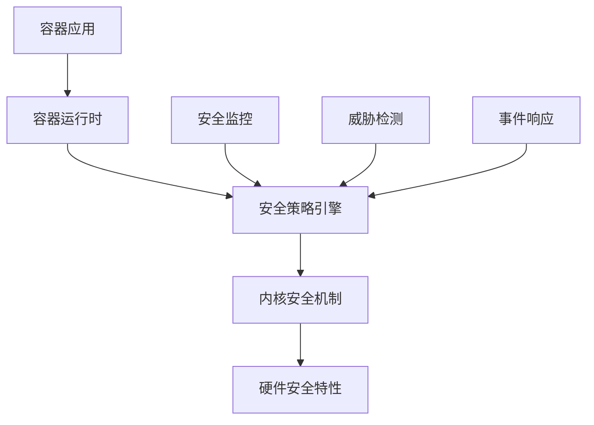
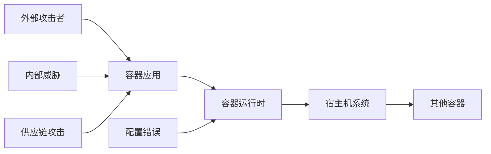
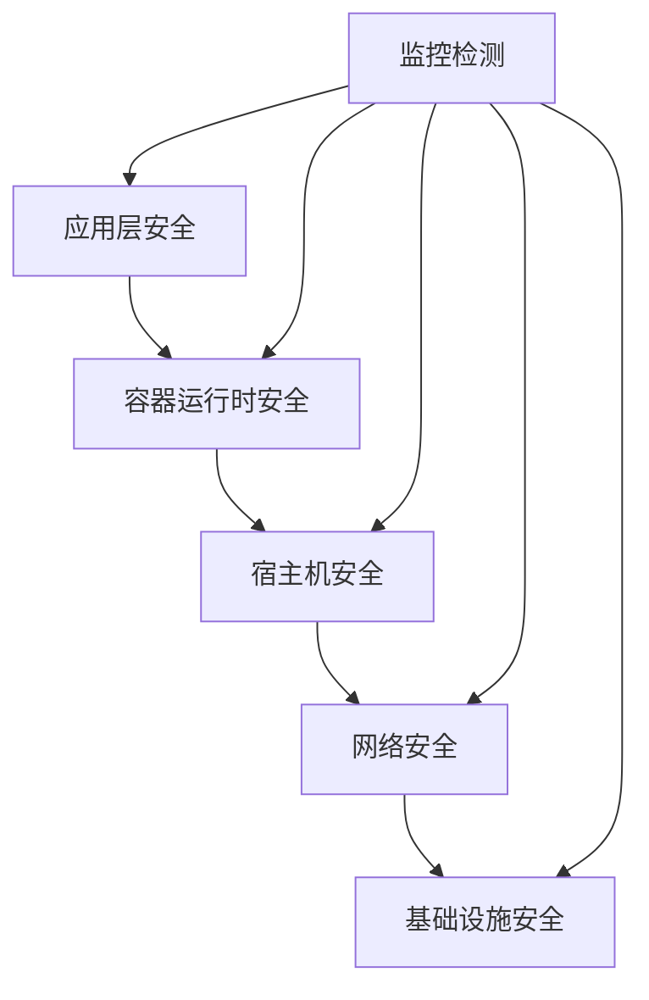
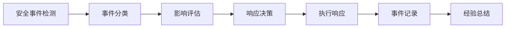

# 容器运行时安全技术详解

## 概述

容器运行时安全是容器安全体系的核心组成部分，涉及容器运行过程中的安全防护、监控和响应机制。本文档深入解析容器运行时安全的技术原理、实现机制和最佳实践。

## 目录

- [容器运行时安全基础](#容器运行时安全基础)
- [运行时安全威胁分析](#运行时安全威胁分析)
- [安全防护技术](#安全防护技术)
- [监控与检测](#监控与检测)
- [安全策略与配置](#安全策略与配置)
- [最佳实践](#最佳实践)
- [故障诊断](#故障诊断)
- [FAQ](#faq)

## 容器运行时安全基础

### 运行时安全定义

容器运行时安全（Container Runtime Security）是指在容器运行过程中，通过技术手段和管理措施，保护容器及其运行环境免受安全威胁的过程。

### 核心组件

#### 1. 容器运行时引擎

```bash
# 主流容器运行时引擎
- runc: OCI标准运行时
- crun: 高性能运行时
- gVisor: 用户空间内核
- Kata Containers: 轻量级虚拟机
- containerd: 容器生命周期管理
```

#### 2. 安全机制

- **命名空间隔离**：进程、网络、文件系统隔离
- **控制组限制**：资源使用限制
- **能力控制**：Linux capabilities管理
- **系统调用过滤**：seccomp策略
- **强制访问控制**：SELinux/AppArmor

### 安全模型



## 运行时安全威胁分析

### 威胁类型

#### 1. 容器逃逸

**威胁描述**：攻击者从容器内部突破隔离机制，获得宿主机访问权限。

**攻击路径**：

- 内核漏洞利用
- 特权容器滥用
- 共享资源攻击
- 配置错误利用

**检测指标**：

```yaml
# 容器逃逸检测规则
detection_rules:
  - name: "privilege_escalation"
    condition: "container_capabilities_changed"
    severity: "high"
    
  - name: "host_access_attempt"
    condition: "access_host_resources"
    severity: "critical"
    
  - name: "kernel_exploit"
    condition: "suspicious_syscalls"
    severity: "critical"
```

#### 2. 恶意代码执行

**威胁描述**：在容器内执行恶意代码，进行数据窃取、系统破坏等活动。

**攻击向量**：

- 恶意镜像
- 供应链攻击
- 运行时注入
- 配置篡改

#### 3. 资源滥用

**威胁描述**：恶意消耗系统资源，影响其他容器和宿主机性能。

**攻击类型**：

- CPU资源耗尽
- 内存泄漏攻击
- 磁盘空间耗尽
- 网络带宽滥用

### 威胁建模



## 安全防护技术

### 1. 运行时隔离

#### 命名空间隔离

```bash
# 创建隔离的命名空间
unshare --pid --net --mount --uts --ipc --user --fork bash

# 验证命名空间隔离
ls -la /proc/self/ns/
```

#### 控制组限制

```bash
# 创建控制组
mkdir /sys/fs/cgroup/memory/container1
echo 100M > /sys/fs/cgroup/memory/container1/memory.limit_in_bytes
echo $$ > /sys/fs/cgroup/memory/container1/cgroup.procs
```

### 2. 能力控制

#### Linux Capabilities

```bash
# 查看容器能力
docker run --cap-drop=ALL --cap-add=NET_BIND_SERVICE nginx

# 自定义能力配置
docker run --cap-drop=CHOWN --cap-drop=SETUID nginx
```

#### 能力配置文件

```json
{
  "capabilities": {
    "bounding": [
      "CAP_NET_BIND_SERVICE",
      "CAP_SETUID",
      "CAP_SETGID"
    ],
    "effective": [
      "CAP_NET_BIND_SERVICE"
    ],
    "inheritable": [],
    "permitted": [
      "CAP_NET_BIND_SERVICE",
      "CAP_SETUID",
      "CAP_SETGID"
    ]
  }
}
```

### 3. 系统调用过滤

#### Seccomp策略

```json
{
  "defaultAction": "SCMP_ACT_ERRNO",
  "architectures": [
    "SCMP_ARCH_X86_64",
    "SCMP_ARCH_X86",
    "SCMP_ARCH_X32"
  ],
  "syscalls": [
    {
      "names": [
        "accept",
        "accept4",
        "access",
        "alarm"
      ],
      "action": "SCMP_ACT_ALLOW"
    }
  ]
}
```

#### 应用Seccomp策略

```bash
# 使用自定义seccomp策略
docker run --security-opt seccomp=seccomp-profile.json nginx

# 禁用seccomp
docker run --security-opt seccomp=unconfined nginx
```

### 4. 强制访问控制

#### SELinux配置

```bash
# 查看SELinux状态
sestatus

# 设置SELinux上下文
chcon -t container_file_t /var/lib/containers/

# 创建SELinux策略
cat > container.te << EOF
policy_module(container, 1.0.0)

require {
    type container_t;
    type container_file_t;
    class file { read write execute };
}

allow container_t container_file_t:file { read write execute };
EOF
```

#### AppArmor配置

```bash
# 创建AppArmor配置文件
cat > /etc/apparmor.d/container << EOF
#include <tunables/global>

profile container flags=(attach_disconnected,mediate_deleted) {
  #include <abstractions/base>
  
  # 允许访问容器目录
  /var/lib/containers/** rw,
  /tmp/** rw,
  
  # 拒绝访问敏感文件
  deny /etc/shadow r,
  deny /etc/passwd w,
}
EOF

# 加载AppArmor策略
apparmor_parser -r /etc/apparmor.d/container
```

### 5. 沙箱技术

#### gVisor配置

```bash
# 使用gVisor运行时
docker run --runtime=runsc nginx

# 配置gVisor参数
cat > /etc/docker/daemon.json << EOF
{
  "runtimes": {
    "runsc": {
      "path": "/usr/local/bin/runsc",
      "runtimeArgs": [
        "--debug",
        "--strace"
      ]
    }
  }
}
EOF
```

#### Kata Containers配置

```bash
# 安装Kata Containers
curl -fsSL https://get.docker.com -o get-docker.sh
sh get-docker.sh

# 配置Kata运行时
cat > /etc/docker/daemon.json << EOF
{
  "runtimes": {
    "kata-runtime": {
      "path": "/usr/bin/kata-runtime"
    }
  }
}
EOF
```

## 监控与检测

### 1. 运行时监控

#### 系统调用监控

```bash
# 使用strace监控系统调用
strace -f -e trace=network,file docker run nginx

# 使用auditd监控
auditctl -w /var/lib/docker -p rwxa -k docker_containers
```

#### 资源使用监控

```bash
# 监控容器资源使用
docker stats --format "table {{.Container}}\t{{.CPUPerc}}\t{{.MemUsage}}\t{{.NetIO}}\t{{.BlockIO}}"

# 使用cAdvisor监控
docker run -d \
  --volume=/:/rootfs:ro \
  --volume=/var/run:/var/run:ro \
  --volume=/sys:/sys:ro \
  --volume=/var/lib/docker/:/var/lib/docker:ro \
  --publish=8080:8080 \
  --detach=true \
  --name=cadvisor \
  gcr.io/cadvisor/cadvisor:latest
```

### 2. 行为分析

#### 异常行为检测

```yaml
# 异常行为检测规则
detection_rules:
  - name: "unusual_process_spawn"
    condition: "process_count > threshold"
    threshold: 100
    time_window: "5m"
    
  - name: "network_anomaly"
    condition: "network_connections > normal_range"
    normal_range: [10, 50]
    
  - name: "file_access_pattern"
    condition: "access_sensitive_files"
    sensitive_files: ["/etc/passwd", "/etc/shadow"]
```

#### 机器学习检测

```python
# 异常检测模型示例
import numpy as np
from sklearn.ensemble import IsolationForest

class ContainerAnomalyDetector:
    def __init__(self):
        self.model = IsolationForest(contamination=0.1)
        
    def train(self, normal_data):
        """训练异常检测模型"""
        self.model.fit(normal_data)
        
    def detect(self, data):
        """检测异常行为"""
        predictions = self.model.predict(data)
        return predictions == -1
```

### 3. 实时告警

#### 告警规则配置

```yaml
# Prometheus告警规则
groups:
- name: container_security
  rules:
  - alert: ContainerPrivilegeEscalation
    expr: container_capabilities_changed > 0
    for: 0m
    labels:
      severity: critical
    annotations:
      summary: "Container privilege escalation detected"
      
  - alert: ContainerResourceAbuse
    expr: container_cpu_usage > 0.9
    for: 5m
    labels:
      severity: warning
    annotations:
      summary: "Container resource abuse detected"
```

## 安全策略与配置

### 1. 安全基线配置

#### Docker安全配置

```bash
# 安全启动Docker
dockerd \
  --tlsverify \
  --tlscacert=ca.pem \
  --tlscert=server-cert.pem \
  --tlskey=server-key.pem \
  --host=0.0.0.0:2376 \
  --userland-proxy=false \
  --no-new-privileges \
  --seccomp-profile=/etc/docker/seccomp-profile.json \
  --apparmor-profile=docker-default
```

#### containerd安全配置

```toml
# /etc/containerd/config.toml
version = 2
root = "/var/lib/containerd"
state = "/run/containerd"

[grpc]
  address = "/run/containerd/containerd.sock"
  uid = 0
  gid = 0
  max_recv_message_size = 16777216
  max_send_message_size = 16777216

[plugins."io.containerd.grpc.v1.cri"]
  sandbox_image = "k8s.gcr.io/pause:3.6"
  
  [plugins."io.containerd.grpc.v1.cri".containerd]
    snapshotter = "overlayfs"
    
    [plugins."io.containerd.grpc.v1.cri".containerd.runtimes]
      [plugins."io.containerd.grpc.v1.cri".containerd.runtimes.runc]
        runtime_type = "io.containerd.runc.v2"
        
        [plugins."io.containerd.grpc.v1.cri".containerd.runtimes.runc.options]
          SystemdCgroup = true
```

### 2. 安全策略模板

#### Pod安全策略

```yaml
apiVersion: policy/v1beta1
kind: PodSecurityPolicy
metadata:
  name: restricted-psp
spec:
  privileged: false
  allowPrivilegeEscalation: false
  requiredDropCapabilities:
    - ALL
  volumes:
    - 'configMap'
    - 'emptyDir'
    - 'projected'
    - 'secret'
    - 'downwardAPI'
    - 'persistentVolumeClaim'
  runAsUser:
    rule: 'MustRunAsNonRoot'
  seLinux:
    rule: 'RunAsAny'
  fsGroup:
    rule: 'RunAsAny'
```

#### 网络策略

```yaml
apiVersion: networking.k8s.io/v1
kind: NetworkPolicy
metadata:
  name: deny-all-ingress
spec:
  podSelector: {}
  policyTypes:
  - Ingress
  - Egress
  ingress: []
  egress: []
```

### 3. 安全加固脚本

#### 系统加固脚本

```bash
#!/bin/bash
# 容器运行时安全加固脚本

# 1. 禁用不必要的服务
systemctl disable --now docker.socket
systemctl disable --now containerd.socket

# 2. 配置防火墙
ufw default deny incoming
ufw default allow outgoing
ufw allow 2376/tcp  # Docker TLS
ufw enable

# 3. 配置审计
auditctl -w /var/lib/docker -p rwxa -k docker_containers
auditctl -w /etc/docker -p rwxa -k docker_config

# 4. 设置文件权限
chmod 600 /etc/docker/daemon.json
chmod 600 /etc/containerd/config.toml

# 5. 启用SELinux
setenforce 1
sed -i 's/SELINUX=permissive/SELINUX=enforcing/' /etc/selinux/config
```

## 最佳实践

### 1. 运行时安全设计原则

#### 最小权限原则

```yaml
# 最小权限配置示例
security_context:
  runAsNonRoot: true
  runAsUser: 1000
  runAsGroup: 1000
  fsGroup: 1000
  capabilities:
    drop:
      - ALL
    add:
      - NET_BIND_SERVICE
```

#### 深度防御



### 2. 安全配置检查清单

#### 容器配置检查

```bash
# 容器安全配置检查脚本
check_container_security() {
    local container_id=$1
    
    echo "检查容器安全配置..."
    
    # 检查特权模式
    if docker inspect $container_id | grep -q '"Privileged": true'; then
        echo "警告: 容器运行在特权模式"
    fi
    
    # 检查用户
    user=$(docker inspect $container_id | jq -r '.[0].Config.User')
    if [ "$user" = "root" ] || [ "$user" = "" ]; then
        echo "警告: 容器以root用户运行"
    fi
    
    # 检查能力
    capabilities=$(docker inspect $container_id | jq -r '.[0].HostConfig.CapAdd')
    if [ "$capabilities" != "null" ]; then
        echo "警告: 容器添加了额外能力"
    fi
}
```

### 3. 安全运维流程

#### 安全事件响应流程



#### 响应决策矩阵

| 威胁类型 | 影响程度 | 响应时间 | 响应措施 |
|---------|---------|---------|---------|
| 容器逃逸 | 高 | 立即 | 隔离容器、停止服务 |
| 恶意代码 | 中 | 15分钟 | 终止进程、更新镜像 |
| 资源滥用 | 低 | 1小时 | 限制资源、优化配置 |

## 故障诊断

### 1. 常见问题

#### 容器启动失败

```bash
# 检查容器日志
docker logs container_name

# 检查运行时配置
docker inspect container_name

# 检查安全策略
auditctl -l | grep docker
```

#### 权限问题

```bash
# 检查SELinux状态
sestatus
ls -Z /var/lib/docker/

# 检查AppArmor状态
aa-status
aa-status --enforced
```

### 2. 诊断工具

#### 安全诊断工具

```bash
# 使用docker-bench-security
docker run --rm --net host --pid host --userns host --cap-add audit_control \
  -e DOCKER_CONTENT_TRUST=$DOCKER_CONTENT_TRUST \
  -v /etc:/etc:ro \
  -v /usr/bin/containerd:/usr/bin/containerd:ro \
  -v /usr/bin/runc:/usr/bin/runc:ro \
  -v /usr/lib/systemd:/usr/lib/systemd:ro \
  -v /var/lib:/var/lib:ro \
  -v /var/run/docker.sock:/var/run/docker.sock:ro \
  --label docker_bench_security \
  docker/docker-bench-security
```

#### 运行时分析工具

```bash
# 使用falco进行运行时安全监控
docker run -d \
  --name falco \
  --privileged \
  -v /var/run/docker.sock:/host/var/run/docker.sock \
  -v /dev:/host/dev \
  -v /proc:/host/proc:ro \
  -v /boot:/host/boot:ro \
  -v /lib/modules:/host/lib/modules:ro \
  -v /usr:/host/usr:ro \
  falcosecurity/falco:latest
```

## FAQ

### Q1: 如何选择合适的容器运行时？

**A**: 选择容器运行时需要考虑以下因素：

- **安全性要求**：高安全环境选择gVisor或Kata Containers
- **性能要求**：高性能场景选择runc或crun
- **兼容性要求**：标准兼容选择containerd
- **资源限制**：资源受限环境选择轻量级运行时

### Q2: 如何平衡安全性和性能？

**A**: 平衡安全性和性能的策略：

- **分层防护**：在关键节点部署安全机制
- **性能监控**：持续监控安全机制的性能影响
- **策略优化**：根据实际需求调整安全策略
- **硬件加速**：利用硬件安全特性提升性能

### Q3: 容器运行时安全的最佳实践是什么？

**A**: 容器运行时安全最佳实践：

- **最小权限原则**：只授予必要的权限
- **深度防御**：多层安全防护机制
- **持续监控**：实时监控和异常检测
- **定期审计**：定期进行安全审计和评估
- **及时更新**：保持运行时和策略的及时更新

### Q4: 如何处理容器逃逸事件？

**A**: 容器逃逸事件处理流程：

1. **立即隔离**：隔离受影响的容器和宿主机
2. **影响评估**：评估安全事件的影响范围
3. **证据收集**：收集相关日志和证据
4. **修复措施**：修复安全漏洞和配置问题
5. **恢复服务**：在确认安全后恢复服务
6. **经验总结**：总结事件经验，改进安全措施

---

## 总结

容器运行时安全是容器安全体系的核心，需要从多个维度进行防护：

1. **技术防护**：利用命名空间、控制组、能力控制等技术手段
2. **策略管理**：制定完善的安全策略和配置标准
3. **监控检测**：建立实时监控和异常检测机制
4. **响应处理**：建立安全事件响应和处理流程

通过系统性的安全防护措施，可以有效保护容器运行环境的安全，确保容器化应用的安全运行。
