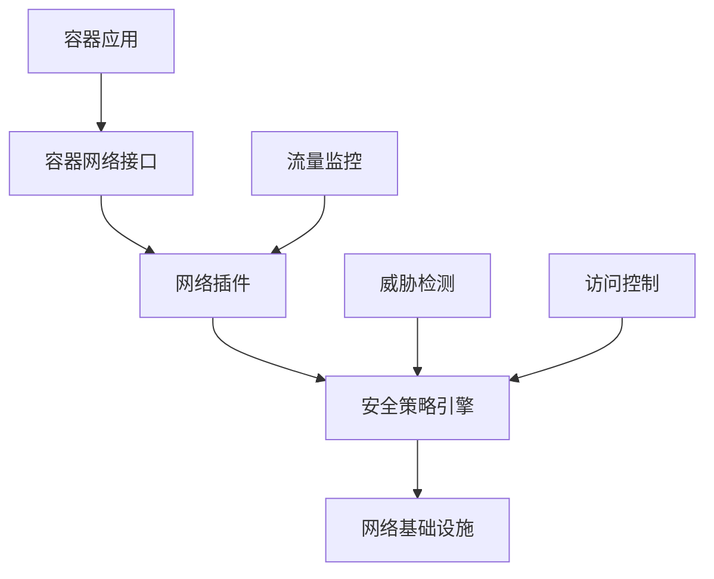
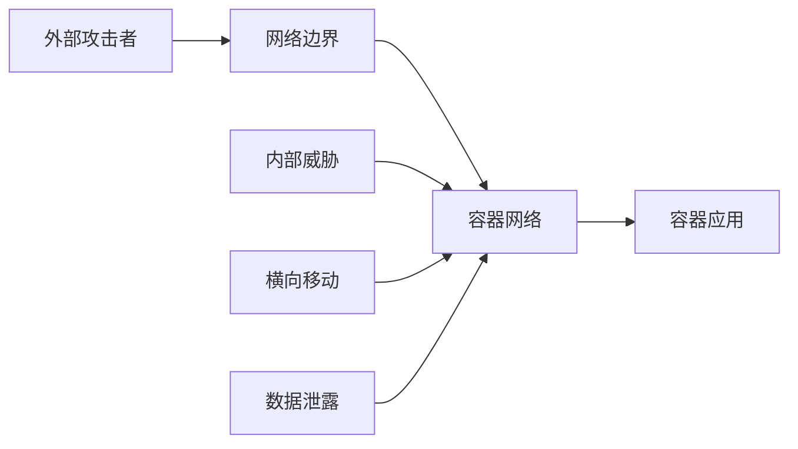
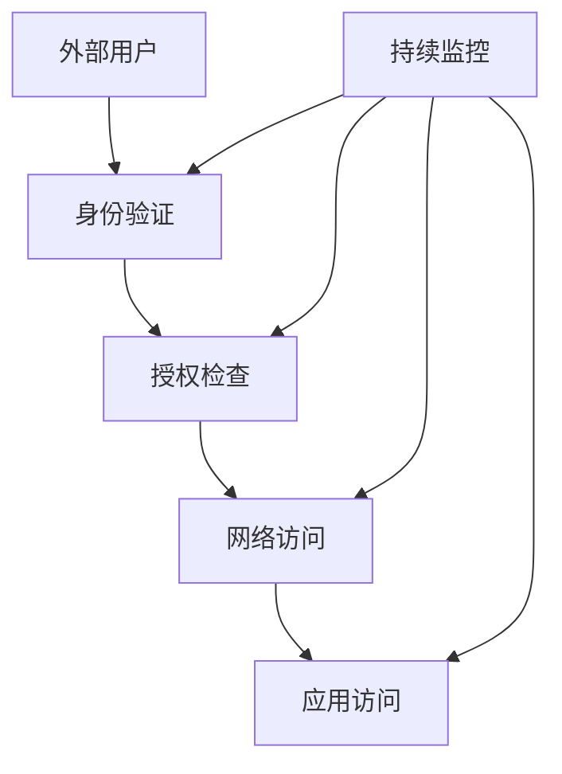

# 容器网络安全技术详解

## 概述

容器网络安全是容器安全体系的重要组成部分，涉及容器网络通信的安全防护、访问控制、流量监控和威胁检测。本文档深入解析容器网络安全的技术原理、实现机制和最佳实践。

## 目录

- [容器网络安全基础](#容器网络安全基础)
- [网络安全威胁分析](#网络安全威胁分析)
- [网络隔离技术](#网络隔离技术)
- [访问控制机制](#访问控制机制)
- [流量监控与分析](#流量监控与分析)
- [安全策略配置](#安全策略配置)
- [最佳实践](#最佳实践)
- [故障诊断](#故障诊断)
- [FAQ](#faq)

## 容器网络安全基础

### 网络安全定义

容器网络安全（Container Network Security）是指在容器化环境中，通过技术手段和管理措施，保护容器网络通信安全，防止网络攻击和数据泄露的过程。

### 核心组件

#### 1. 网络插件

```bash
# 主流容器网络插件
- Flannel: 简单覆盖网络
- Calico: 基于BGP的网络
- Weave: 加密覆盖网络
- Cilium: 基于eBPF的网络
- Antrea: 基于OVS的网络
```

#### 2. 安全机制

- **网络隔离**：命名空间、VLAN、覆盖网络
- **访问控制**：网络策略、防火墙规则
- **流量加密**：TLS/SSL、IPSec、WireGuard
- **流量监控**：包捕获、流量分析、异常检测

### 安全架构



## 网络安全威胁分析

### 威胁类型

#### 1. 网络攻击

**威胁描述**：通过网络对容器进行攻击，包括DDoS、中间人攻击、网络嗅探等。

**攻击类型**：

- **DDoS攻击**：大量请求导致服务不可用
- **中间人攻击**：拦截和篡改网络通信
- **网络嗅探**：窃听网络通信内容
- **端口扫描**：探测容器开放端口

**检测指标**：

```yaml
# 网络攻击检测规则
detection_rules:
  - name: "ddos_attack"
    condition: "connection_rate > threshold"
    threshold: 1000
    time_window: "1m"
    
  - name: "port_scan"
    condition: "unique_ports_scanned > 10"
    time_window: "5m"
    
  - name: "suspicious_traffic"
    condition: "traffic_pattern_anomaly"
    severity: "high"
```

#### 2. 数据泄露

**威胁描述**：通过网络传输敏感数据，导致数据泄露。

**泄露途径**：

- 明文传输
- 未授权访问
- 数据拦截
- 配置错误

#### 3. 服务发现攻击

**威胁描述**：利用服务发现机制进行攻击，包括DNS劫持、服务冒充等。

**攻击方式**：

- DNS劫持
- 服务冒充
- 负载均衡攻击
- 服务网格攻击

### 威胁建模



## 网络隔离技术

### 1. 网络命名空间

#### 创建网络命名空间

```bash
# 创建网络命名空间
ip netns add container1
ip netns add container2

# 创建虚拟网络接口
ip link add veth1 type veth peer name veth2
ip link add veth3 type veth peer name veth4

# 配置网络接口
ip link set veth1 netns container1
ip link set veth3 netns container2

# 配置IP地址
ip netns exec container1 ip addr add 192.168.1.10/24 dev veth1
ip netns exec container2 ip addr add 192.168.1.20/24 dev veth2

# 启动网络接口
ip netns exec container1 ip link set veth1 up
ip netns exec container2 ip link set veth2 up
```

#### 网络隔离验证

```bash
# 测试网络连通性
ip netns exec container1 ping 192.168.1.20
ip netns exec container2 ping 192.168.1.10

# 查看网络接口
ip netns exec container1 ip addr show
ip netns exec container2 ip addr show
```

### 2. 覆盖网络

#### Flannel配置

```yaml
# flannel配置
apiVersion: v1
kind: ConfigMap
metadata:
  name: kube-flannel-cfg
  namespace: kube-system
data:
  cni-conf.json: |
    {
      "name": "cbr0",
      "cniVersion": "0.3.1",
      "plugins": [
        {
          "type": "flannel",
          "delegate": {
            "hairpinMode": true,
            "isDefaultGateway": true
          }
        },
        {
          "type": "portmap",
          "capabilities": {
            "portMappings": true
          }
        }
      ]
    }
  net-conf.json: |
    {
      "Network": "10.244.0.0/16",
      "Backend": {
        "Type": "vxlan"
      }
    }
```

#### Calico配置

```yaml
# calico配置
apiVersion: v1
kind: ConfigMap
metadata:
  name: calico-config
  namespace: kube-system
data:
  # Typha is not used, so disable it.
  typha_service_name: "none"
  # The CNI network configuration to install on the node.
  cni_network_config: |-
    {
      "name": "k8s-pod-network",
      "cniVersion": "0.3.1",
      "plugins": [
        {
          "type": "calico",
          "log_level": "info",
          "datastore_type": "kubernetes",
          "nodename": "__KUBERNETES_NODE_NAME__",
          "mtu": __CNI_MTU__,
          "ipam": {
              "type": "calico-ipam",
              "assign_ipv4": "true",
              "assign_ipv6": "false"
          },
          "policy": {
              "type": "k8s"
          },
          "kubernetes": {
              "kubeconfig": "__KUBECONFIG_FILEPATH__"
          }
        },
        {
          "type": "portmap",
          "snat": true,
          "capabilities": {"portMappings": true}
        }
      ]
    }
```

### 3. 服务网格

#### Istio配置

```yaml
# Istio Gateway配置
apiVersion: networking.istio.io/v1alpha3
kind: Gateway
metadata:
  name: bookinfo-gateway
spec:
  selector:
    istio: ingressgateway
  servers:
  - port:
      number: 80
      name: http
      protocol: HTTP
    hosts:
    - "*"
---
# VirtualService配置
apiVersion: networking.istio.io/v1alpha3
kind: VirtualService
metadata:
  name: bookinfo
spec:
  hosts:
  - "*"
  gateways:
  - bookinfo-gateway
  http:
  - match:
    - uri:
        exact: /productpage
    - uri:
        prefix: /static
    - uri:
        exact: /login
    - uri:
        exact: /logout
    - uri:
        prefix: /api/v1/products
    route:
    - destination:
        host: productpage
        port:
          number: 9080
```

## 访问控制机制

### 1. 网络策略

#### Kubernetes网络策略

```yaml
# 拒绝所有入站流量
apiVersion: networking.k8s.io/v1
kind: NetworkPolicy
metadata:
  name: deny-all-ingress
spec:
  podSelector: {}
  policyTypes:
  - Ingress
  ingress: []
---
# 允许特定命名空间访问
apiVersion: networking.k8s.io/v1
kind: NetworkPolicy
metadata:
  name: allow-frontend-to-backend
spec:
  podSelector:
    matchLabels:
      app: backend
  policyTypes:
  - Ingress
  ingress:
  - from:
    - namespaceSelector:
        matchLabels:
          name: frontend
    ports:
    - protocol: TCP
      port: 8080
---
# 允许特定Pod访问
apiVersion: networking.k8s.io/v1
kind: NetworkPolicy
metadata:
  name: allow-specific-pod
spec:
  podSelector:
    matchLabels:
      app: database
  policyTypes:
  - Ingress
  ingress:
  - from:
    - podSelector:
        matchLabels:
          app: backend
    ports:
    - protocol: TCP
      port: 5432
```

#### Calico网络策略

```yaml
# Calico全局网络策略
apiVersion: projectcalico.org/v3
kind: GlobalNetworkPolicy
metadata:
  name: deny-all-ingress
spec:
  tier: security
  order: 1000
  selector: all()
  types:
  - Ingress
  ingress: []
---
# Calico命名空间网络策略
apiVersion: projectcalico.org/v3
kind: NetworkPolicy
metadata:
  name: allow-frontend-to-backend
  namespace: production
spec:
  tier: security
  order: 100
  selector: app == 'backend'
  types:
  - Ingress
  ingress:
  - action: Allow
    protocol: TCP
    source:
      namespaceSelector: name == 'frontend'
    destination:
      ports:
      - 8080
```

### 2. 防火墙规则

#### iptables规则

```bash
# 创建自定义链
iptables -N DOCKER-USER
iptables -I FORWARD -j DOCKER-USER

# 允许特定容器通信
iptables -A DOCKER-USER -s 172.17.0.2 -d 172.17.0.3 -j ACCEPT
iptables -A DOCKER-USER -s 172.17.0.3 -d 172.17.0.2 -j ACCEPT

# 拒绝其他通信
iptables -A DOCKER-USER -j DROP

# 保存规则
iptables-save > /etc/iptables/rules.v4
```

#### nftables规则

```bash
# 创建表
nft add table inet filter

# 创建链
nft add chain inet filter input { type filter hook input priority 0 \; }
nft add chain inet filter forward { type filter hook forward priority 0 \; }

# 添加规则
nft add rule inet filter input tcp dport 22 accept
nft add rule inet filter input tcp dport 80 accept
nft add rule inet filter input tcp dport 443 accept
nft add rule inet filter input drop

# 保存规则
nft list ruleset > /etc/nftables.conf
```

### 3. 服务网格安全

#### mTLS配置

```yaml
# Istio mTLS配置
apiVersion: security.istio.io/v1beta1
kind: PeerAuthentication
metadata:
  name: default
  namespace: production
spec:
  mtls:
    mode: STRICT
---
# 目标规则配置
apiVersion: networking.istio.io/v1alpha3
kind: DestinationRule
metadata:
  name: default
  namespace: production
spec:
  host: "*.production.svc.cluster.local"
  trafficPolicy:
    tls:
      mode: ISTIO_MUTUAL
```

#### 授权策略

```yaml
# Istio授权策略
apiVersion: security.istio.io/v1beta1
kind: AuthorizationPolicy
metadata:
  name: allow-frontend-to-backend
  namespace: production
spec:
  selector:
    matchLabels:
      app: backend
  rules:
  - from:
    - source:
        principals: ["cluster.local/ns/frontend/sa/frontend"]
    to:
    - operation:
        methods: ["GET", "POST"]
        paths: ["/api/*"]
```

## 流量监控与分析

### 1. 流量捕获

#### tcpdump使用

```bash
# 捕获容器网络流量
docker run --rm -it --net=container:nginx nicolaka/netshoot tcpdump -i eth0

# 捕获特定端口流量
tcpdump -i any port 80 -w http_traffic.pcap

# 捕获特定协议流量
tcpdump -i any tcp and port 443 -w https_traffic.pcap
```

#### Wireshark分析

```bash
# 使用tshark分析流量
tshark -r traffic.pcap -T fields -e ip.src -e ip.dst -e tcp.port

# 分析HTTP流量
tshark -r traffic.pcap -Y "http" -T fields -e http.host -e http.request.uri

# 分析DNS流量
tshark -r traffic.pcap -Y "dns" -T fields -e dns.qry.name -e dns.a
```

### 2. 流量分析

#### 网络流量统计

```python
# 网络流量分析脚本
import pyshark
import pandas as pd

def analyze_traffic(pcap_file):
    """分析网络流量"""
    cap = pyshark.FileCapture(pcap_file)
    
    traffic_data = []
    for packet in cap:
        if hasattr(packet, 'ip'):
            traffic_data.append({
                'timestamp': packet.sniff_time,
                'src_ip': packet.ip.src,
                'dst_ip': packet.ip.dst,
                'protocol': packet.transport_layer,
                'length': packet.length
            })
    
    df = pd.DataFrame(traffic_data)
    
    # 统计流量
    print("流量统计:")
    print(df.groupby(['src_ip', 'dst_ip']).size().sort_values(ascending=False))
    
    # 协议分布
    print("\n协议分布:")
    print(df['protocol'].value_counts())
    
    return df

# 使用示例
traffic_df = analyze_traffic('traffic.pcap')
```

#### 异常检测

```python
# 网络异常检测
import numpy as np
from sklearn.ensemble import IsolationForest

class NetworkAnomalyDetector:
    def __init__(self):
        self.model = IsolationForest(contamination=0.1)
        
    def extract_features(self, traffic_data):
        """提取网络流量特征"""
        features = []
        for _, row in traffic_data.iterrows():
            feature = [
                len(row['src_ip'].split('.')),  # IP地址特征
                len(row['dst_ip'].split('.')),
                row['length'],  # 包长度
                hash(row['protocol']) % 100  # 协议特征
            ]
            features.append(feature)
        return np.array(features)
    
    def train(self, normal_traffic):
        """训练异常检测模型"""
        features = self.extract_features(normal_traffic)
        self.model.fit(features)
        
    def detect_anomalies(self, traffic_data):
        """检测异常流量"""
        features = self.extract_features(traffic_data)
        predictions = self.model.predict(features)
        return predictions == -1
```

### 3. 实时监控

#### Prometheus监控

```yaml
# Prometheus网络监控配置
global:
  scrape_interval: 15s

scrape_configs:
  - job_name: 'container-network'
    static_configs:
      - targets: ['localhost:9100']
    metrics_path: /metrics
    scrape_interval: 5s
```

#### Grafana仪表板

```json
{
  "dashboard": {
    "title": "Container Network Security",
    "panels": [
      {
        "title": "Network Traffic",
        "type": "graph",
        "targets": [
          {
            "expr": "rate(container_network_receive_bytes_total[5m])",
            "legendFormat": "Receive Bytes"
          },
          {
            "expr": "rate(container_network_transmit_bytes_total[5m])",
            "legendFormat": "Transmit Bytes"
          }
        ]
      },
      {
        "title": "Network Connections",
        "type": "graph",
        "targets": [
          {
            "expr": "container_network_tcp_connections_total",
            "legendFormat": "TCP Connections"
          }
        ]
      }
    ]
  }
}
```

## 安全策略配置

### 1. 网络安全基线

#### Docker网络安全配置

```bash
# 安全启动Docker
dockerd \
  --tlsverify \
  --tlscacert=ca.pem \
  --tlscert=server-cert.pem \
  --tlskey=server-key.pem \
  --host=0.0.0.0:2376 \
  --iptables=true \
  --ip-forward=false \
  --bridge=none \
  --default-address-pool=10.20.0.0/16
```

#### Kubernetes网络安全配置

```yaml
# kubelet网络配置
apiVersion: kubelet.config.k8s.io/v1beta1
kind: KubeletConfiguration
cgroupDriver: systemd
clusterDNS:
- 10.96.0.10
clusterDomain: cluster.local
networkPlugin: cni
podCIDR: 10.244.0.0/16
```

### 2. 安全策略模板

#### 网络策略模板

```yaml
# 生产环境网络策略模板
apiVersion: networking.k8s.io/v1
kind: NetworkPolicy
metadata:
  name: production-network-policy
  namespace: production
spec:
  podSelector: {}
  policyTypes:
  - Ingress
  - Egress
  ingress:
  - from:
    - namespaceSelector:
        matchLabels:
          name: frontend
    ports:
    - protocol: TCP
      port: 8080
  egress:
  - to:
    - namespaceSelector:
        matchLabels:
          name: database
    ports:
    - protocol: TCP
      port: 5432
  - to: []
    ports:
    - protocol: TCP
      port: 53
    - protocol: UDP
      port: 53
```

#### 服务网格安全策略

```yaml
# Istio安全策略模板
apiVersion: security.istio.io/v1beta1
kind: AuthorizationPolicy
metadata:
  name: production-auth-policy
  namespace: production
spec:
  selector:
    matchLabels:
      app: backend
  rules:
  - from:
    - source:
        principals: ["cluster.local/ns/frontend/sa/frontend"]
    to:
    - operation:
        methods: ["GET", "POST"]
        paths: ["/api/*"]
    when:
    - key: request.headers[user-agent]
      values: ["*"]
```

### 3. 安全加固脚本

#### 网络安全加固脚本

```bash
#!/bin/bash
# 容器网络安全加固脚本

# 1. 配置防火墙
ufw default deny incoming
ufw default allow outgoing
ufw allow 22/tcp  # SSH
ufw allow 80/tcp  # HTTP
ufw allow 443/tcp # HTTPS
ufw enable

# 2. 配置iptables规则
iptables -A INPUT -i lo -j ACCEPT
iptables -A INPUT -m state --state ESTABLISHED,RELATED -j ACCEPT
iptables -A INPUT -p tcp --dport 22 -j ACCEPT
iptables -A INPUT -p tcp --dport 80 -j ACCEPT
iptables -A INPUT -p tcp --dport 443 -j ACCEPT
iptables -A INPUT -j DROP

# 3. 禁用IP转发
echo 0 > /proc/sys/net/ipv4/ip_forward

# 4. 配置网络参数
echo 1 > /proc/sys/net/ipv4/icmp_echo_ignore_broadcasts
echo 1 > /proc/sys/net/ipv4/conf/all/log_martians
echo 1 > /proc/sys/net/ipv4/conf/all/rp_filter

# 5. 保存配置
iptables-save > /etc/iptables/rules.v4
```

## 最佳实践

### 1. 网络安全设计原则

#### 零信任网络



#### 深度防御

```yaml
# 多层网络防护
network_security_layers:
  - layer1: "网络边界防护"
    components: ["防火墙", "入侵检测", "DDoS防护"]
  - layer2: "网络分段"
    components: ["VLAN", "子网隔离", "网络策略"]
  - layer3: "应用层防护"
    components: ["WAF", "API网关", "服务网格"]
  - layer4: "数据保护"
    components: ["加密传输", "数据脱敏", "访问控制"]
```

### 2. 安全配置检查清单

#### 网络配置检查

```bash
# 网络安全配置检查脚本
check_network_security() {
    echo "检查网络安全配置..."
    
    # 检查防火墙状态
    if ! ufw status | grep -q "Status: active"; then
        echo "警告: 防火墙未启用"
    fi
    
    # 检查开放端口
    open_ports=$(ss -tuln | grep LISTEN | wc -l)
    if [ $open_ports -gt 10 ]; then
        echo "警告: 开放端口过多 ($open_ports)"
    fi
    
    # 检查网络策略
    if ! kubectl get networkpolicy --all-namespaces | grep -q "deny-all"; then
        echo "警告: 缺少默认拒绝网络策略"
    fi
}
```

### 3. 安全运维流程

#### 网络安全事件响应


#### 响应决策矩阵

| 威胁类型 | 影响程度 | 响应时间 | 响应措施 |
|---------|---------|---------|---------|
| DDoS攻击 | 高 | 立即 | 启用DDoS防护、限制流量 |
| 网络入侵 | 高 | 15分钟 | 隔离网络、阻断连接 |
| 数据泄露 | 中 | 30分钟 | 加密传输、审计日志 |
| 配置错误 | 低 | 1小时 | 修复配置、验证策略 |

## 故障诊断

### 1. 常见问题

#### 网络连通性问题

```bash
# 检查网络连通性
ping -c 4 8.8.8.8
nslookup google.com

# 检查DNS配置
cat /etc/resolv.conf
systemctl status systemd-resolved

# 检查网络接口
ip addr show
ip route show
```

#### 网络策略问题

```bash
# 检查网络策略
kubectl get networkpolicy --all-namespaces
kubectl describe networkpolicy <policy-name>

# 检查Pod网络
kubectl get pods -o wide
kubectl exec -it <pod-name> -- ip addr show
```

### 2. 诊断工具

#### 网络诊断工具

```bash
# 使用netshoot进行网络诊断
kubectl run netshoot --image=nicolaka/netshoot --rm -it -- /bin/bash

# 使用tcpdump捕获流量
kubectl run tcpdump --image=nicolaka/netshoot --rm -it -- tcpdump -i any

# 使用nslookup测试DNS
kubectl run dns-test --image=nicolaka/netshoot --rm -it -- nslookup kubernetes.default
```

#### 网络性能测试

```bash
# 使用iperf测试网络性能
kubectl run iperf-server --image=networkstatic/iperf3 --rm -it -- iperf3 -s

kubectl run iperf-client --image=networkstatic/iperf3 --rm -it -- iperf3 -c iperf-server
```

## FAQ

### Q1: 如何选择合适的容器网络插件？

**A**: 选择容器网络插件需要考虑以下因素：

- **性能要求**：高性能场景选择Calico或Cilium
- **安全要求**：高安全环境选择支持网络策略的插件
- **易用性**：简单部署选择Flannel
- **功能需求**：复杂网络需求选择服务网格

### Q2: 如何实现容器网络的零信任安全？

**A**: 实现零信任网络安全的策略：

- **身份验证**：所有网络访问都需要身份验证
- **最小权限**：只授予必要的网络访问权限
- **持续监控**：实时监控网络流量和访问行为
- **动态策略**：根据风险评估动态调整安全策略

### Q3: 容器网络安全的最佳实践是什么？

**A**: 容器网络安全最佳实践：

- **网络分段**：使用网络策略进行网络分段
- **流量加密**：对敏感数据进行加密传输
- **访问控制**：实施严格的网络访问控制
- **监控检测**：建立完善的网络监控和威胁检测
- **定期审计**：定期进行网络安全审计和评估

### Q4: 如何处理容器网络性能问题？

**A**: 容器网络性能优化策略：

- **网络插件选择**：选择高性能的网络插件
- **网络配置优化**：优化网络参数和配置
- **负载均衡**：使用负载均衡分散网络流量
- **缓存机制**：实施网络缓存减少延迟
- **监控调优**：持续监控和调优网络性能

---

## 总结

容器网络安全是容器安全体系的重要组成部分，需要从多个维度进行防护：

1. **网络隔离**：利用命名空间、覆盖网络等技术实现网络隔离
2. **访问控制**：通过网络策略、防火墙规则等控制网络访问
3. **流量监控**：建立完善的流量监控和异常检测机制
4. **安全策略**：制定全面的网络安全策略和配置标准

通过系统性的网络安全防护措施，可以有效保护容器网络通信的安全，确保容器化应用的安全运行。
