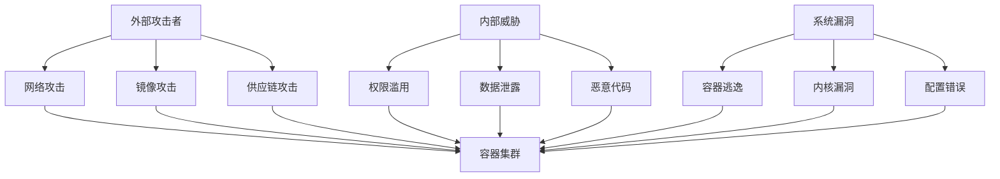
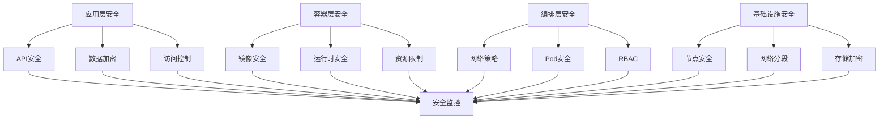

# 容器安全框架与最佳实践深度解析

## 目录

1. [容器安全威胁模型](#容器安全威胁模型)
2. [安全框架架构设计](#安全框架架构设计)
3. [镜像安全与供应链](#镜像安全与供应链)
4. [运行时安全防护](#运行时安全防护)
5. [网络安全与隔离](#网络安全与隔离)
6. [访问控制与权限管理](#访问控制与权限管理)
7. [形式化安全模型](#形式化安全模型)
8. [代码实现与验证](#代码实现与验证)
9. [最佳实践与案例](#最佳实践与案例)
10. [未来发展趋势](#未来发展趋势)

## 容器安全威胁模型

### 威胁分类与风险评估

**定义1 (容器安全威胁)**: 容器安全威胁T是一个三元组

```text
T = (A, V, I)
```

其中：

- A 是攻击向量集合
- V 是漏洞集合
- I 是影响程度集合

**威胁分类**:

1. **镜像威胁**: 恶意镜像、漏洞镜像、供应链攻击
2. **运行时威胁**: 容器逃逸、权限提升、资源滥用
3. **网络威胁**: 网络攻击、数据泄露、服务劫持
4. **存储威胁**: 数据泄露、持久化攻击、配置泄露

### 攻击向量分析



## 安全框架架构设计

### 零信任安全架构

```yaml
# 零信任安全框架配置
apiVersion: v1
kind: ConfigMap
metadata:
  name: zero-trust-security
data:
  security-config.yml: |
    # 零信任原则
    zero_trust_principles:
      - "永不信任，始终验证"
      - "最小权限原则"
      - "深度防御"
      - "持续监控"
    
    # 身份验证
    authentication:
      multi_factor: true
      certificate_based: true
      token_rotation: 3600  # 1小时
      session_timeout: 1800  # 30分钟
    
    # 授权控制
    authorization:
      rbac_enabled: true
      abac_enabled: true
      policy_engine: "opa"
      default_deny: true
    
    # 网络分段
    network_segmentation:
      micro_segmentation: true
      service_mesh: "istio"
      network_policies: true
      encryption: "mTLS"
    
    # 监控审计
    monitoring_audit:
      continuous_monitoring: true
      behavioral_analysis: true
      threat_detection: true
      compliance_reporting: true
```

### 安全控制层次



## 镜像安全与供应链

### 镜像安全扫描

```yaml
# 镜像安全扫描配置
apiVersion: v1
kind: ConfigMap
metadata:
  name: image-security-scan
data:
  scan-config.yml: |
    # 扫描策略
    scan_policy:
      vulnerability_threshold: "HIGH"
      license_compliance: true
      malware_scan: true
      secrets_scan: true
      sbom_generation: true
    
    # 扫描工具
    scan_tools:
      - name: "trivy"
        enabled: true
        config:
          severity: ["CRITICAL", "HIGH", "MEDIUM"]
          ignore_unfixed: false
      - name: "clair"
        enabled: true
        config:
          update_interval: "24h"
      - name: "anchore"
        enabled: true
        config:
          policy_bundle: "default"
    
    # 供应链安全
    supply_chain_security:
      image_signing: true
      attestation: true
      provenance: true
      sbom_verification: true
      registry_scanning: true
```

### 镜像签名与验证

```bash
#!/bin/bash
# 镜像签名与验证脚本

# 1. 生成签名密钥
cosign generate-key-pair

# 2. 签名镜像
cosign sign --key cosign.key myregistry.com/myapp:v1.0.0

# 3. 验证镜像签名
cosign verify --key cosign.pub myregistry.com/myapp:v1.0.0

# 4. 生成SBOM
syft myregistry.com/myapp:v1.0.0 -o spdx-json > sbom.json

# 5. 签名SBOM
cosign attest --key cosign.key --predicate sbom.json myregistry.com/myapp:v1.0.0

# 6. 验证SBOM
cosign verify-attestation --key cosign.pub myregistry.com/myapp:v1.0.0
```

## 运行时安全防护

### 容器运行时安全

```yaml
# 容器运行时安全配置
apiVersion: v1
kind: Pod
metadata:
  name: secure-pod
spec:
  securityContext:
    runAsNonRoot: true
    runAsUser: 1000
    runAsGroup: 1000
    fsGroup: 1000
    seccompProfile:
      type: RuntimeDefault
    seLinuxOptions:
      level: "s0:c123,c456"
  containers:
  - name: app
    image: myapp:latest
    securityContext:
      allowPrivilegeEscalation: false
      readOnlyRootFilesystem: true
      runAsNonRoot: true
      runAsUser: 1000
      capabilities:
        drop:
          - ALL
        add:
          - NET_BIND_SERVICE
    resources:
      limits:
        cpu: 500m
        memory: 512Mi
      requests:
        cpu: 100m
        memory: 128Mi
    volumeMounts:
    - name: tmp
      mountPath: /tmp
    - name: cache
      mountPath: /var/cache
  volumes:
  - name: tmp
    emptyDir: {}
  - name: cache
    emptyDir: {}
```

### 运行时监控

```yaml
# 运行时安全监控配置
apiVersion: v1
kind: ConfigMap
metadata:
  name: runtime-security-monitor
data:
  monitor-config.yml: |
    # 监控策略
    monitoring_policy:
      file_integrity: true
      process_monitoring: true
      network_monitoring: true
      system_call_monitoring: true
      privilege_escalation: true
    
    # 告警规则
    alert_rules:
      - name: "privilege_escalation"
        condition: "process.privilege_escalation"
        severity: "critical"
      - name: "suspicious_process"
        condition: "process.name in suspicious_list"
        severity: "high"
      - name: "file_modification"
        condition: "file.modification in protected_paths"
        severity: "medium"
      - name: "network_anomaly"
        condition: "network.connection to suspicious_ip"
        severity: "high"
    
    # 响应策略
    response_policy:
      auto_quarantine: true
      process_termination: true
      network_isolation: true
      alert_notification: true
```

## 网络安全与隔离

### 网络策略配置

```yaml
# 网络安全策略
apiVersion: networking.k8s.io/v1
kind: NetworkPolicy
metadata:
  name: web-app-network-policy
spec:
  podSelector:
    matchLabels:
      app: web
  policyTypes:
  - Ingress
  - Egress
  ingress:
  - from:
    - namespaceSelector:
        matchLabels:
          name: frontend
    - podSelector:
        matchLabels:
          app: frontend
    ports:
    - protocol: TCP
      port: 80
  - from:
    - namespaceSelector:
        matchLabels:
          name: monitoring
    ports:
    - protocol: TCP
      port: 8080
  egress:
  - to:
    - namespaceSelector:
        matchLabels:
          name: backend
    ports:
    - protocol: TCP
      port: 5432
  - to: []
    ports:
    - protocol: TCP
      port: 53
    - protocol: UDP
      port: 53
```

### 服务网格安全

```yaml
# Istio安全配置
apiVersion: security.istio.io/v1beta1
kind: PeerAuthentication
metadata:
  name: default
  namespace: production
spec:
  mtls:
    mode: STRICT
---
apiVersion: security.istio.io/v1beta1
kind: AuthorizationPolicy
metadata:
  name: web-app-authz
  namespace: production
spec:
  selector:
    matchLabels:
      app: web
  rules:
  - from:
    - source:
        principals: ["cluster.local/ns/frontend/sa/frontend"]
    to:
    - operation:
        methods: ["GET", "POST"]
        paths: ["/api/*"]
  - from:
    - source:
        principals: ["cluster.local/ns/monitoring/sa/prometheus"]
    to:
    - operation:
        methods: ["GET"]
        paths: ["/metrics"]
```

## 访问控制与权限管理

### RBAC配置

```yaml
# 角色定义
apiVersion: rbac.authorization.k8s.io/v1
kind: Role
metadata:
  name: pod-reader
  namespace: production
rules:
- apiGroups: [""]
  resources: ["pods"]
  verbs: ["get", "list", "watch"]
- apiGroups: [""]
  resources: ["pods/log"]
  verbs: ["get", "list"]
---
# 角色绑定
apiVersion: rbac.authorization.k8s.io/v1
kind: RoleBinding
metadata:
  name: pod-reader-binding
  namespace: production
subjects:
- kind: User
  name: developer
  apiGroup: rbac.authorization.k8s.io
roleRef:
  kind: Role
  name: pod-reader
  apiGroup: rbac.authorization.k8s.io
```

### Pod安全策略

```yaml
# Pod安全策略
apiVersion: policy/v1beta1
kind: PodSecurityPolicy
metadata:
  name: restricted-psp
spec:
  privileged: false
  allowPrivilegeEscalation: false
  requiredDropCapabilities:
    - ALL
  volumes:
    - 'configMap'
    - 'emptyDir'
    - 'projected'
    - 'secret'
    - 'downwardAPI'
    - 'persistentVolumeClaim'
  runAsUser:
    rule: 'MustRunAsNonRoot'
  seLinux:
    rule: 'RunAsAny'
  fsGroup:
    rule: 'RunAsAny'
```

## 形式化安全模型

### 安全属性形式化定义

**定义2 (安全属性)**: 安全属性S是一个四元组

```text
S = (C, I, A, N)
```

其中：

- C 是机密性属性
- I 是完整性属性
- A 是可用性属性
- N 是不可否认性属性

**定义3 (安全策略)**: 安全策略P是一个三元组

```text
P = (R, A, E)
```

其中：

- R 是规则集合
- A 是动作集合
- E 是执行条件集合

**定理1 (安全策略一致性)**: 对于安全策略P，如果满足：

1. 规则集合R是无矛盾的
2. 动作集合A是完备的
3. 执行条件E是可满足的

则安全策略P是一致的。

**证明**:
由于规则无矛盾，不存在冲突的安全决策。
由于动作完备，所有安全事件都有对应的处理动作。
由于条件可满足，策略可以正确执行。
因此，安全策略是一致的。□

## 代码实现与验证

### Rust安全监控实现

```rust
use std::collections::HashMap;
use std::sync::{Arc, RwLock};
use std::time::{Duration, Instant};
use serde::{Deserialize, Serialize};
use tokio::time::interval;

#[derive(Debug, Clone, Serialize, Deserialize)]
pub struct SecurityEvent {
    pub id: String,
    pub timestamp: Instant,
    pub event_type: SecurityEventType,
    pub severity: SecuritySeverity,
    pub source: String,
    pub target: String,
    pub details: HashMap<String, String>,
}

#[derive(Debug, Clone, Serialize, Deserialize)]
pub enum SecurityEventType {
    PrivilegeEscalation,
    SuspiciousProcess,
    FileModification,
    NetworkAnomaly,
    ContainerEscape,
    MalwareDetection,
    UnauthorizedAccess,
}

#[derive(Debug, Clone, Serialize, Deserialize)]
pub enum SecuritySeverity {
    Critical,
    High,
    Medium,
    Low,
    Info,
}

#[derive(Debug, Clone, Serialize, Deserialize)]
pub struct SecurityPolicy {
    pub id: String,
    pub name: String,
    pub rules: Vec<SecurityRule>,
    pub actions: Vec<SecurityAction>,
    pub enabled: bool,
}

#[derive(Debug, Clone, Serialize, Deserialize)]
pub struct SecurityRule {
    pub id: String,
    pub condition: String,
    pub severity: SecuritySeverity,
    pub enabled: bool,
}

#[derive(Debug, Clone, Serialize, Deserialize)]
pub struct SecurityAction {
    pub id: String,
    pub action_type: SecurityActionType,
    pub parameters: HashMap<String, String>,
    pub enabled: bool,
}

#[derive(Debug, Clone, Serialize, Deserialize)]
pub enum SecurityActionType {
    Alert,
    Quarantine,
    Terminate,
    Isolate,
    Log,
}

#[derive(Debug)]
pub struct SecurityMonitor {
    events: Arc<RwLock<Vec<SecurityEvent>>>,
    policies: Arc<RwLock<HashMap<String, SecurityPolicy>>>,
    alert_manager: Arc<AlertManager>,
    response_engine: Arc<ResponseEngine>,
}

#[derive(Debug)]
pub struct AlertManager {
    alerts: Arc<RwLock<Vec<SecurityAlert>>>,
}

#[derive(Debug, Clone, Serialize, Deserialize)]
pub struct SecurityAlert {
    pub id: String,
    pub event_id: String,
    pub severity: SecuritySeverity,
    pub message: String,
    pub timestamp: Instant,
    pub acknowledged: bool,
}

#[derive(Debug)]
pub struct ResponseEngine {
    actions: Arc<RwLock<HashMap<String, SecurityAction>>>,
}

impl SecurityMonitor {
    pub fn new() -> Self {
        Self {
            events: Arc::new(RwLock::new(Vec::new())),
            policies: Arc::new(RwLock::new(HashMap::new())),
            alert_manager: Arc::new(AlertManager::new()),
            response_engine: Arc::new(ResponseEngine::new()),
        }
    }

    pub async fn start_monitoring(&self) -> Result<(), Box<dyn std::error::Error>> {
        let mut interval = interval(Duration::from_secs(1));
        let events = Arc::clone(&self.events);
        let policies = Arc::clone(&self.policies);
        let alert_manager = Arc::clone(&self.alert_manager);
        let response_engine = Arc::clone(&self.response_engine);

        loop {
            interval.tick().await;
            
            // 收集安全事件
            let new_events = self.collect_security_events().await?;
            
            // 处理安全事件
            for event in new_events {
                self.process_security_event(&event, &policies, &alert_manager, &response_engine).await?;
            }
        }
    }

    async fn collect_security_events(&self) -> Result<Vec<SecurityEvent>, Box<dyn std::error::Error>> {
        let mut events = Vec::new();
        
        // 模拟收集安全事件
        if self.should_generate_event() {
            events.push(SecurityEvent {
                id: format!("event_{}", Instant::now().elapsed().as_millis()),
                timestamp: Instant::now(),
                event_type: SecurityEventType::SuspiciousProcess,
                severity: SecuritySeverity::High,
                source: "container-123".to_string(),
                target: "host-system".to_string(),
                details: HashMap::from([
                    ("process_name".to_string(), "suspicious.exe".to_string()),
                    ("pid".to_string(), "1234".to_string()),
                    ("user".to_string(), "root".to_string()),
                ]),
            });
        }
        
        Ok(events)
    }

    async fn process_security_event(
        &self,
        event: &SecurityEvent,
        policies: &Arc<RwLock<HashMap<String, SecurityPolicy>>>,
        alert_manager: &Arc<AlertManager>,
        response_engine: &Arc<ResponseEngine>,
    ) -> Result<(), Box<dyn std::error::Error>> {
        // 存储事件
        {
            let mut events = self.events.write().unwrap();
            events.push(event.clone());
            
            // 限制事件数量
            if events.len() > 10000 {
                events.drain(0..1000);
            }
        }
        
        // 评估安全策略
        let policies_guard = policies.read().unwrap();
        for policy in policies_guard.values() {
            if !policy.enabled {
                continue;
            }
            
            for rule in &policy.rules {
                if !rule.enabled {
                    continue;
                }
                
                if self.evaluate_rule(rule, event) {
                    // 生成告警
                    alert_manager.add_alert(SecurityAlert {
                        id: format!("alert_{}", Instant::now().elapsed().as_millis()),
                        event_id: event.id.clone(),
                        severity: rule.severity.clone(),
                        message: format!("安全策略 {} 触发规则 {}", policy.name, rule.id),
                        timestamp: Instant::now(),
                        acknowledged: false,
                    }).await;
                    
                    // 执行响应动作
                    for action in &policy.actions {
                        if action.enabled {
                            response_engine.execute_action(action, event).await?;
                        }
                    }
                }
            }
        }
        
        Ok(())
    }

    fn evaluate_rule(&self, rule: &SecurityRule, event: &SecurityEvent) -> bool {
        // 简单的规则评估实现
        match rule.condition.as_str() {
            "privilege_escalation" => matches!(event.event_type, SecurityEventType::PrivilegeEscalation),
            "suspicious_process" => matches!(event.event_type, SecurityEventType::SuspiciousProcess),
            "file_modification" => matches!(event.event_type, SecurityEventType::FileModification),
            "network_anomaly" => matches!(event.event_type, SecurityEventType::NetworkAnomaly),
            "container_escape" => matches!(event.event_type, SecurityEventType::ContainerEscape),
            _ => false,
        }
    }

    fn should_generate_event(&self) -> bool {
        use rand::Rng;
        let mut rng = rand::thread_rng();
        rng.gen_bool(0.1) // 10%概率生成事件
    }

    pub fn add_policy(&self, policy: SecurityPolicy) {
        let mut policies = self.policies.write().unwrap();
        policies.insert(policy.id.clone(), policy);
    }

    pub fn get_security_events(&self, limit: usize) -> Vec<SecurityEvent> {
        let events = self.events.read().unwrap();
        events.iter().rev().take(limit).cloned().collect()
    }

    pub fn get_security_report(&self) -> SecurityReport {
        let events = self.events.read().unwrap();
        let policies = self.policies.read().unwrap();
        
        let total_events = events.len();
        let critical_events = events.iter().filter(|e| matches!(e.severity, SecuritySeverity::Critical)).count();
        let high_events = events.iter().filter(|e| matches!(e.severity, SecuritySeverity::High)).count();
        let medium_events = events.iter().filter(|e| matches!(e.severity, SecuritySeverity::Medium)).count();
        
        SecurityReport {
            timestamp: Instant::now(),
            total_events,
            critical_events,
            high_events,
            medium_events,
            total_policies: policies.len(),
            enabled_policies: policies.values().filter(|p| p.enabled).count(),
        }
    }
}

impl AlertManager {
    pub fn new() -> Self {
        Self {
            alerts: Arc::new(RwLock::new(Vec::new())),
        }
    }

    pub async fn add_alert(&self, alert: SecurityAlert) {
        let mut alerts = self.alerts.write().unwrap();
        alerts.push(alert);
        
        // 限制告警数量
        if alerts.len() > 1000 {
            alerts.drain(0..100);
        }
    }

    pub fn get_alerts(&self) -> Vec<SecurityAlert> {
        let alerts = self.alerts.read().unwrap();
        alerts.clone()
    }

    pub fn get_critical_alerts(&self) -> Vec<SecurityAlert> {
        let alerts = self.alerts.read().unwrap();
        alerts.iter()
            .filter(|a| matches!(a.severity, SecuritySeverity::Critical))
            .cloned()
            .collect()
    }
}

impl ResponseEngine {
    pub fn new() -> Self {
        Self {
            actions: Arc::new(RwLock::new(HashMap::new())),
        }
    }

    pub async fn execute_action(&self, action: &SecurityAction, event: &SecurityEvent) -> Result<(), Box<dyn std::error::Error>> {
        match action.action_type {
            SecurityActionType::Alert => {
                println!("安全告警: {}", event.id);
            }
            SecurityActionType::Quarantine => {
                println!("隔离容器: {}", event.source);
            }
            SecurityActionType::Terminate => {
                println!("终止进程: {}", event.source);
            }
            SecurityActionType::Isolate => {
                println!("网络隔离: {}", event.source);
            }
            SecurityActionType::Log => {
                println!("记录日志: {:?}", event);
            }
        }
        
        Ok(())
    }
}

#[derive(Debug, Clone, Serialize, Deserialize)]
pub struct SecurityReport {
    pub timestamp: Instant,
    pub total_events: usize,
    pub critical_events: usize,
    pub high_events: usize,
    pub medium_events: usize,
    pub total_policies: usize,
    pub enabled_policies: usize,
}

#[tokio::main]
async fn main() -> Result<(), Box<dyn std::error::Error>> {
    let monitor = SecurityMonitor::new();
    
    // 添加安全策略
    monitor.add_policy(SecurityPolicy {
        id: "policy1".to_string(),
        name: "容器安全策略".to_string(),
        rules: vec![
            SecurityRule {
                id: "rule1".to_string(),
                condition: "privilege_escalation".to_string(),
                severity: SecuritySeverity::Critical,
                enabled: true,
            },
            SecurityRule {
                id: "rule2".to_string(),
                condition: "suspicious_process".to_string(),
                severity: SecuritySeverity::High,
                enabled: true,
            },
        ],
        actions: vec![
            SecurityAction {
                id: "action1".to_string(),
                action_type: SecurityActionType::Alert,
                parameters: HashMap::new(),
                enabled: true,
            },
            SecurityAction {
                id: "action2".to_string(),
                action_type: SecurityActionType::Quarantine,
                parameters: HashMap::new(),
                enabled: true,
            },
        ],
        enabled: true,
    });
    
    // 启动监控
    let monitor_handle = tokio::spawn(async move {
        monitor.start_monitoring().await
    });
    
    // 等待一段时间后获取报告
    tokio::time::sleep(Duration::from_secs(60)).await;
    
    let report = monitor.get_security_report();
    println!("安全报告: {:#?}", report);
    
    let alerts = monitor.alert_manager.get_alerts();
    println!("告警数量: {}", alerts.len());
    
    monitor_handle.abort();
    Ok(())
}
```

## 最佳实践与案例

### 1. 企业级容器安全架构

```yaml
# 企业级容器安全架构配置
enterprise_security:
  # 安全策略
  security_policies:
    - name: "镜像安全策略"
      rules:
        - vulnerability_scan: true
        - signature_verification: true
        - sbom_verification: true
        - license_compliance: true
    
    - name: "运行时安全策略"
      rules:
        - privilege_escalation: false
        - root_user: false
        - read_only_filesystem: true
        - resource_limits: true
    
    - name: "网络安全策略"
      rules:
        - network_policies: true
        - service_mesh: true
        - encryption: "mTLS"
        - micro_segmentation: true
  
  # 监控告警
  monitoring_alerts:
    - name: "安全事件告警"
      conditions:
        - privilege_escalation
        - container_escape
        - suspicious_process
      severity: "critical"
      response: "immediate"
    
    - name: "合规性告警"
      conditions:
        - policy_violation
        - configuration_drift
        - unauthorized_access
      severity: "high"
      response: "24h"
```

### 2. 合规性安全配置

```yaml
# 合规性安全配置
compliance_security:
  # CIS基准
  cis_benchmark:
    enabled: true
    version: "1.6"
    rules:
      - "5.1.1"
      - "5.1.2"
      - "5.1.3"
      - "5.1.4"
      - "5.1.5"
  
  # NIST框架
  nist_framework:
    enabled: true
    categories:
      - "identify"
      - "protect"
      - "detect"
      - "respond"
      - "recover"
  
  # SOC2合规
  soc2_compliance:
    enabled: true
    trust_services:
      - "security"
      - "availability"
      - "processing_integrity"
      - "confidentiality"
      - "privacy"
```

## 未来发展趋势

### 1. AI驱动安全

- **智能威胁检测**: 基于机器学习的威胁检测
- **自动化响应**: AI驱动的自动化安全响应
- **行为分析**: 基于用户行为的安全分析

### 2. 云原生安全

- **服务网格安全**: 深度集成服务网格安全
- **无服务器安全**: 针对无服务器架构的安全
- **边缘安全**: 边缘计算环境的安全防护

### 3. 零信任架构

- **身份验证**: 多因素身份验证和零信任网络
- **微分段**: 细粒度的网络分段
- **持续验证**: 持续的安全验证和监控

---

*本文档提供了容器安全框架与最佳实践的全面解析，包括威胁模型、安全架构、防护策略、代码实现等各个方面，为容器环境的安全防护提供了完整的解决方案。*
