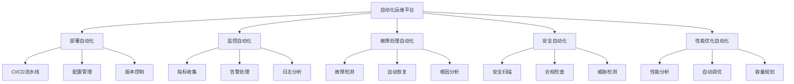

    # 容器自动化运维工具集合

## 目录

- [容器自动化运维工具集合](#容器自动化运维工具集合)
  - [自动化运维架构](#自动化运维架构)
    - [自动化运维体系](#自动化运维体系)
    - [自动化运维配置](#自动化运维配置)
- [自动化运维配置](#自动化运维配置)
  - [部署自动化工具](#部署自动化工具)
    - [CI/CD流水线配置](#cicd流水线配置)
- [Jenkins流水线配置](#jenkins流水线配置)
    - [Ansible自动化部署](#ansible自动化部署)
- [Ansible部署配置](#ansible部署配置)
  - [监控自动化工具](#监控自动化工具)
    - [Prometheus自动配置](#prometheus自动配置)
- [Prometheus自动配置](#prometheus自动配置)
    - [告警规则配置](#告警规则配置)
- [告警规则配置](#告警规则配置)
  - [故障处理自动化](#故障处理自动化)
    - [自动故障检测与恢复](#自动故障检测与恢复)
- [自动故障检测与恢复脚本](#自动故障检测与恢复脚本)
- [1. 检测Pod故障](#1-检测pod故障)
- [2. 检测节点故障](#2-检测节点故障)
- [3. 检测服务故障](#3-检测服务故障)
- [4. 检测资源不足](#4-检测资源不足)
- [检查CPU使用率](#检查cpu使用率)
- [检查内存使用率](#检查内存使用率)
- [5. 自动恢复操作](#5-自动恢复操作)
- [重启失败的Deployment](#重启失败的deployment)
  - [安全自动化工具](#安全自动化工具)
    - [自动安全扫描](#自动安全扫描)
- [自动安全扫描配置](#自动安全扫描配置)
    - [自动合规检查](#自动合规检查)
- [自动合规检查脚本](#自动合规检查脚本)
- [1. CIS Kubernetes基准检查](#1-cis-kubernetes基准检查)
- [2. 检查Pod安全策略](#2-检查pod安全策略)
- [检查是否有Pod运行在特权模式](#检查是否有pod运行在特权模式)
- [检查是否有Pod以root用户运行](#检查是否有pod以root用户运行)
- [3. 检查网络策略](#3-检查网络策略)
- [4. 检查RBAC配置](#4-检查rbac配置)
- [检查是否有过于宽松的ClusterRole](#检查是否有过于宽松的clusterrole)
- [5. 检查镜像安全](#5-检查镜像安全)
- [检查是否有使用latest标签的镜像](#检查是否有使用latest标签的镜像)
- [6. 检查资源限制](#6-检查资源限制)
- [检查是否有Pod没有设置资源限制](#检查是否有pod没有设置资源限制)
  - [性能优化自动化](#性能优化自动化)
    - [自动性能调优](#自动性能调优)
- [自动性能调优配置](#自动性能调优配置)
    - [自动容量规划](#自动容量规划)
- [自动容量规划脚本](#自动容量规划脚本)
- [1. 收集当前资源使用情况](#1-收集当前资源使用情况)
- [2. 分析资源使用趋势](#2-分析资源使用趋势)
- [这里可以集成Prometheus查询来分析历史数据](#这里可以集成prometheus查询来分析历史数据)
- [3. 预测未来资源需求](#3-预测未来资源需求)
- [基于历史数据预测未来30天的资源需求](#基于历史数据预测未来30天的资源需求)
- [4. 生成容量规划建议](#4-生成容量规划建议)
- [5. 自动执行容量调整](#5-自动执行容量调整)
- [检查是否需要自动扩容](#检查是否需要自动扩容)
  - [代码实现与验证](#代码实现与验证)
    - [Rust自动化运维工具实现](#rust自动化运维工具实现)
  - [最佳实践与案例](#最佳实践与案例)
    - [1. 企业级自动化运维架构](#1-企业级自动化运维架构)
- [企业级自动化运维架构配置](#企业级自动化运维架构配置)
    - [2. 云原生自动化运维](#2-云原生自动化运维)
- [云原生自动化运维配置](#云原生自动化运维配置)
  - [未来发展趋势](#未来发展趋势)
    - [1. AI驱动自动化](#1-ai驱动自动化)
    - [2. 边缘计算自动化](#2-边缘计算自动化)
    - [3. 量子计算自动化](#3-量子计算自动化)

- [容器自动化运维工具集合](#容器自动化运维工具集合)
  - [自动化运维架构](#自动化运维架构)
    - [自动化运维体系](#自动化运维体系)
    - [自动化运维配置](#自动化运维配置)
- [自动化运维配置](#自动化运维配置)
- [部署自动化](#部署自动化)
- [监控自动化](#监控自动化)
- [故障处理自动化](#故障处理自动化)
  - [部署自动化工具](#部署自动化工具)
    - [CI/CD流水线配置](#cicd流水线配置)
- [Jenkins流水线配置](#jenkins流水线配置)
    - [Ansible自动化部署](#ansible自动化部署)
- [Ansible部署配置](#ansible部署配置)
  - [监控自动化工具](#监控自动化工具)
    - [Prometheus自动配置](#prometheus自动配置)
- [Prometheus自动配置](#prometheus自动配置)
    - [告警规则配置](#告警规则配置)
- [告警规则配置](#告警规则配置)
  - [故障处理自动化](#故障处理自动化)
    - [自动故障检测与恢复](#自动故障检测与恢复)
- [自动故障检测与恢复脚本](#自动故障检测与恢复脚本)
- [1. 检测Pod故障](#1-检测pod故障)
- [2. 检测节点故障](#2-检测节点故障)
- [3. 检测服务故障](#3-检测服务故障)
- [尝试重启相关Deployment](#尝试重启相关deployment)
- [4. 检测资源不足](#4-检测资源不足)
- [检查CPU使用率](#检查cpu使用率)
- [可以触发自动扩缩容](#可以触发自动扩缩容)
- [检查内存使用率](#检查内存使用率)
- [可以触发自动扩缩容](#可以触发自动扩缩容)
- [5. 自动恢复操作](#5-自动恢复操作)
- [重启失败的Deployment](#重启失败的deployment)
  - [安全自动化工具](#安全自动化工具)
    - [自动安全扫描](#自动安全扫描)
- [自动安全扫描配置](#自动安全扫描配置)
- [扫描所有镜像](#扫描所有镜像)
- [扫描Kubernetes配置](#扫描kubernetes配置)
- [发送扫描结果](#发送扫描结果)
- [这里可以集成到安全工具或发送告警](#这里可以集成到安全工具或发送告警)
    - [自动合规检查](#自动合规检查)
- [自动合规检查脚本](#自动合规检查脚本)
- [1. CIS Kubernetes基准检查](#1-cis-kubernetes基准检查)
- [2. 检查Pod安全策略](#2-检查pod安全策略)
- [检查是否有Pod运行在特权模式](#检查是否有pod运行在特权模式)
- [检查是否有Pod以root用户运行](#检查是否有pod以root用户运行)
- [3. 检查网络策略](#3-检查网络策略)
- [4. 检查RBAC配置](#4-检查rbac配置)
- [检查是否有过于宽松的ClusterRole](#检查是否有过于宽松的clusterrole)
- [5. 检查镜像安全](#5-检查镜像安全)
- [检查是否有使用latest标签的镜像](#检查是否有使用latest标签的镜像)
- [6. 检查资源限制](#6-检查资源限制)
- [检查是否有Pod没有设置资源限制](#检查是否有pod没有设置资源限制)
  - [性能优化自动化](#性能优化自动化)
    - [自动性能调优](#自动性能调优)
- [自动性能调优配置](#自动性能调优配置)
- [自动扩缩容配置](#自动扩缩容配置)
- [性能监控](#性能监控)
- [自动调优策略](#自动调优策略)
    - [自动容量规划](#自动容量规划)
- [自动容量规划脚本](#自动容量规划脚本)
- [1. 收集当前资源使用情况](#1-收集当前资源使用情况)
- [2. 分析资源使用趋势](#2-分析资源使用趋势)
- [这里可以集成Prometheus查询来分析历史数据](#这里可以集成prometheus查询来分析历史数据)
- [3. 预测未来资源需求](#3-预测未来资源需求)
- [基于历史数据预测未来30天的资源需求](#基于历史数据预测未来30天的资源需求)
- [4. 生成容量规划建议](#4-生成容量规划建议)
- [5. 自动执行容量调整](#5-自动执行容量调整)
- [检查是否需要自动扩容](#检查是否需要自动扩容)
- [这里可以触发自动扩容](#这里可以触发自动扩容)
  - [代码实现与验证](#代码实现与验证)
    - [Rust自动化运维工具实现](#rust自动化运维工具实现)
  - [最佳实践与案例](#最佳实践与案例)
    - [1. 企业级自动化运维架构](#1-企业级自动化运维架构)
- [企业级自动化运维架构配置](#企业级自动化运维架构配置)
- [多环境管理](#多环境管理)
- [自动化策略](#自动化策略)
- [监控告警](#监控告警)
    - [2. 云原生自动化运维](#2-云原生自动化运维)
- [云原生自动化运维配置](#云原生自动化运维配置)
- [GitOps工作流](#gitops工作流)
- [服务网格自动化](#服务网格自动化)
- [无服务器自动化](#无服务器自动化)
  - [未来发展趋势](#未来发展趋势)
    - [1. AI驱动自动化](#1-ai驱动自动化)
    - [2. 边缘计算自动化](#2-边缘计算自动化)
    - [3. 量子计算自动化](#3-量子计算自动化)

1. [自动化运维架构](#自动化运维架构)
2. [部署自动化工具](#部署自动化工具)
3. [监控自动化工具](#监控自动化工具)
4. [故障处理自动化](#故障处理自动化)
5. [安全自动化工具](#安全自动化工具)
6. [性能优化自动化](#性能优化自动化)
7. [代码实现与验证](#代码实现与验证)
8. [最佳实践与案例](#最佳实践与案例)
9. [未来发展趋势](#未来发展趋势)

## 自动化运维架构

### 自动化运维体系



### 自动化运维配置

```yaml
    # 自动化运维配置
automation_config:
  # 部署自动化
  deployment_automation:
    ci_cd:
      pipeline: "jenkins"
      stages: ["build", "test", "deploy", "verify"]
      triggers: ["git_push", "schedule", "manual"]
    
    configuration_management:
      tool: "ansible"
      inventory: "dynamic"
      playbooks: ["deploy", "configure", "verify"]
    
    version_control:
      git_flow: true
      branch_protection: true
      code_review: true
  
  # 监控自动化
  monitoring_automation:
    metrics_collection:
      prometheus: true
      grafana: true
      alertmanager: true
    
    log_management:
      elasticsearch: true
      fluentd: true
      kibana: true
    
    alerting:
      channels: ["email", "slack", "webhook"]
      escalation: true
      suppression: true
  
  # 故障处理自动化
  incident_automation:
    detection:
      anomaly_detection: true
      threshold_based: true
      pattern_recognition: true
    
    response:
      auto_remediation: true
      runbook_automation: true
      escalation_policies: true
    
    analysis:
      root_cause_analysis: true
      post_incident_review: true
      knowledge_base: true
```

## 部署自动化工具

### CI/CD流水线配置

```yaml
    # Jenkins流水线配置
pipeline {
    agent any
    
    environment {
        DOCKER_REGISTRY = 'registry.example.com'
        KUBERNETES_NAMESPACE = 'production'
        IMAGE_TAG = "${BUILD_NUMBER}"
    }
    
    stages {
        stage('Checkout') {
            steps {
                checkout scm
            }
        }
        
        stage('Build') {
            steps {
                sh 'docker build -t ${DOCKER_REGISTRY}/app:${IMAGE_TAG} .'
            }
        }
        
        stage('Test') {
            steps {
                sh 'docker run --rm ${DOCKER_REGISTRY}/app:${IMAGE_TAG} npm test'
            }
        }
        
        stage('Security Scan') {
            steps {
                sh 'trivy image ${DOCKER_REGISTRY}/app:${IMAGE_TAG}'
            }
        }
        
        stage('Push') {
            steps {
                sh 'docker push ${DOCKER_REGISTRY}/app:${IMAGE_TAG}'
            }
        }
        
        stage('Deploy') {
            steps {
                sh 'kubectl set image deployment/app app=${DOCKER_REGISTRY}/app:${IMAGE_TAG} -n ${KUBERNETES_NAMESPACE}'
            }
        }
        
        stage('Verify') {
            steps {
                sh 'kubectl rollout status deployment/app -n ${KUBERNETES_NAMESPACE}'
                sh 'kubectl get pods -n ${KUBERNETES_NAMESPACE}'
            }
        }
    }
    
    post {
        always {
            cleanWs()
        }
        success {
            slackSend channel: '#deployments', message: "部署成功: ${env.JOB_NAME} - ${env.BUILD_NUMBER}"
        }
        failure {
            slackSend channel: '#deployments', message: "部署失败: ${env.JOB_NAME} - ${env.BUILD_NUMBER}"
        }
    }
}
```

### Ansible自动化部署

```yaml
    # Ansible部署配置
---
- name: 部署容器应用
  hosts: kubernetes_nodes
  become: yes
  vars:
    app_name: "web-app"
    app_version: "1.0.0"
    namespace: "production"
    
  tasks:
    - name: 创建命名空间
      kubernetes.core.k8s:
        name: "{{ namespace }}"
        api_version: v1
        kind: Namespace
        state: present
    
    - name: 部署ConfigMap
      kubernetes.core.k8s:
        definition:
          apiVersion: v1
          kind: ConfigMap
          metadata:
            name: "{{ app_name }}-config"
            namespace: "{{ namespace }}"
          data:
            app.properties: |
              server.port=8080
              logging.level=INFO
    
    - name: 部署Secret
      kubernetes.core.k8s:
        definition:
          apiVersion: v1
          kind: Secret
          metadata:
            name: "{{ app_name }}-secret"
            namespace: "{{ namespace }}"
          type: Opaque
          data:
            username: "{{ vault_username | b64encode }}"
            password: "{{ vault_password | b64encode }}"
    
    - name: 部署Deployment
      kubernetes.core.k8s:
        definition:
          apiVersion: apps/v1
          kind: Deployment
          metadata:
            name: "{{ app_name }}"
            namespace: "{{ namespace }}"
          spec:
            replicas: 3
            selector:
              matchLabels:
                app: "{{ app_name }}"
            template:
              metadata:
                labels:
                  app: "{{ app_name }}"
              spec:
                containers:
                - name: "{{ app_name }}"
                  image: "registry.example.com/{{ app_name }}:{{ app_version }}"
                  ports:
                  - containerPort: 8080
                  env:
                  - name: SPRING_PROFILES_ACTIVE
                    value: "production"
                  resources:
                    requests:
                      memory: "256Mi"
                      cpu: "250m"
                    limits:
                      memory: "512Mi"
                      cpu: "500m"
                  livenessProbe:
                    httpGet:
                      path: /health
                      port: 8080
                    initialDelaySeconds: 30
                    periodSeconds: 10
                  readinessProbe:
                    httpGet:
                      path: /ready
                      port: 8080
                    initialDelaySeconds: 5
                    periodSeconds: 5
    
    - name: 部署Service
      kubernetes.core.k8s:
        definition:
          apiVersion: v1
          kind: Service
          metadata:
            name: "{{ app_name }}-service"
            namespace: "{{ namespace }}"
          spec:
            selector:
              app: "{{ app_name }}"
            ports:
            - port: 80
              targetPort: 8080
            type: ClusterIP
    
    - name: 部署Ingress
      kubernetes.core.k8s:
        definition:
          apiVersion: networking.k8s.io/v1
          kind: Ingress
          metadata:
            name: "{{ app_name }}-ingress"
            namespace: "{{ namespace }}"
            annotations:
              nginx.ingress.kubernetes.io/rewrite-target: /
          spec:
            rules:
            - host: "{{ app_name }}.example.com"
              http:
                paths:
                - path: /
                  pathType: Prefix
                  backend:
                    service:
                      name: "{{ app_name }}-service"
                      port:
                        number: 80
    
    - name: 等待部署完成
      kubernetes.core.k8s_info:
        api_version: apps/v1
        kind: Deployment
        name: "{{ app_name }}"
        namespace: "{{ namespace }}"
        wait: true
        wait_condition:
          type: Available
          status: "True"
        wait_timeout: 300
```

## 监控自动化工具

### Prometheus自动配置

```yaml
    # Prometheus自动配置
apiVersion: v1
kind: ConfigMap
metadata:
  name: prometheus-config
data:
  prometheus.yml: |
    global:
      scrape_interval: 15s
      evaluation_interval: 15s
    
    rule_files:
      - "alert_rules.yml"
    
    alerting:
      alertmanagers:
        - static_configs:
            - targets:
              - alertmanager:9093
    
    scrape_configs:
      - job_name: 'kubernetes-pods'
        kubernetes_sd_configs:
          - role: pod
        relabel_configs:
          - source_labels: [__meta_kubernetes_pod_annotation_prometheus_io_scrape]
            action: keep
            regex: true
          - source_labels: [__meta_kubernetes_pod_annotation_prometheus_io_path]
            action: replace
            target_label: __metrics_path__
            regex: (.+)
          - source_labels: [__address__, __meta_kubernetes_pod_annotation_prometheus_io_port]
            action: replace
            regex: ([^:]+)(?::\d+)?;(\d+)
            replacement: $1:$2
            target_label: __address__
      
      - job_name: 'kubernetes-nodes'
        kubernetes_sd_configs:
          - role: node
        relabel_configs:
          - action: labelmap
            regex: __meta_kubernetes_node_label_(.+)
          - target_label: __address__
            replacement: kubernetes.default.svc:443
          - source_labels: [__meta_kubernetes_node_name]
            regex: (.+)
            target_label: __metrics_path__
            replacement: /api/v1/nodes/${1}/proxy/metrics
      
      - job_name: 'kubernetes-cadvisor'
        kubernetes_sd_configs:
          - role: node
        scheme: https
        tls_config:
          ca_file: /var/run/secrets/kubernetes.io/serviceaccount/ca.crt
        bearer_token_file: /var/run/secrets/kubernetes.io/serviceaccount/token
        relabel_configs:
          - action: labelmap
            regex: __meta_kubernetes_node_label_(.+)
          - target_label: __address__
            replacement: kubernetes.default.svc:443
          - source_labels: [__meta_kubernetes_node_name]
            regex: (.+)
            target_label: __metrics_path__
            replacement: /api/v1/nodes/${1}/proxy/metrics/cadvisor
      
      - job_name: 'kubernetes-apiservers'
        kubernetes_sd_configs:
          - role: endpoints
        scheme: https
        tls_config:
          ca_file: /var/run/secrets/kubernetes.io/serviceaccount/ca.crt
        bearer_token_file: /var/run/secrets/kubernetes.io/serviceaccount/token
        relabel_configs:
          - source_labels: [__meta_kubernetes_namespace, __meta_kubernetes_service_name, __meta_kubernetes_endpoint_port_name]
            action: keep
            regex: default;kubernetes;https
```

### 告警规则配置

```yaml
    # 告警规则配置
apiVersion: v1
kind: ConfigMap
metadata:
  name: alert-rules
data:
  alert_rules.yml: |
    groups:
    - name: kubernetes
      rules:
      - alert: PodCrashLooping
        expr: rate(kube_pod_container_status_restarts_total[15m]) > 0
        for: 1m
        labels:
          severity: warning
        annotations:
          summary: "Pod {{ $labels.pod }} is crash looping"
          description: "Pod {{ $labels.pod }} in namespace {{ $labels.namespace }} is crash looping"
      
      - alert: PodNotReady
        expr: kube_pod_status_phase{phase="Running"} == 0
        for: 5m
        labels:
          severity: critical
        annotations:
          summary: "Pod {{ $labels.pod }} is not ready"
          description: "Pod {{ $labels.pod }} in namespace {{ $labels.namespace }} is not ready"
      
      - alert: HighCPUUsage
        expr: (100 - (avg by (instance) (irate(node_cpu_seconds_total{mode="idle"}[5m])) * 100)) > 80
        for: 5m
        labels:
          severity: warning
        annotations:
          summary: "High CPU usage on {{ $labels.instance }}"
          description: "CPU usage is above 80% on {{ $labels.instance }}"
      
      - alert: HighMemoryUsage
        expr: (1 - (node_memory_MemAvailable_bytes / node_memory_MemTotal_bytes)) * 100 > 80
        for: 5m
        labels:
          severity: warning
        annotations:
          summary: "High memory usage on {{ $labels.instance }}"
          description: "Memory usage is above 80% on {{ $labels.instance }}"
      
      - alert: DiskSpaceLow
        expr: (1 - (node_filesystem_avail_bytes / node_filesystem_size_bytes)) * 100 > 80
        for: 5m
        labels:
          severity: critical
        annotations:
          summary: "Low disk space on {{ $labels.instance }}"
          description: "Disk space is below 20% on {{ $labels.instance }}"
```

## 故障处理自动化

### 自动故障检测与恢复

```bash
#!/bin/bash
    # 自动故障检测与恢复脚本

echo "=== 自动故障检测与恢复 ==="
echo "时间: $(date)"
echo ""

    # 1. 检测Pod故障
echo "1. 检测Pod故障:"
failed_pods=$(kubectl get pods --all-namespaces --field-selector=status.phase=Failed -o jsonpath='{.items[*].metadata.name}')
if [ ! -z "$failed_pods" ]; then
    echo "发现故障Pod: $failed_pods"
    for pod in $failed_pods; do
        namespace=$(kubectl get pod $pod --all-namespaces -o jsonpath='{.metadata.namespace}')
        echo "重启Pod: $pod in namespace: $namespace"
        kubectl delete pod $pod -n $namespace
    done
else
    echo "没有发现故障Pod"
fi
echo ""

    # 2. 检测节点故障
echo "2. 检测节点故障:"
not_ready_nodes=$(kubectl get nodes --no-headers | grep NotReady | awk '{print $1}')
if [ ! -z "$not_ready_nodes" ]; then
    echo "发现故障节点: $not_ready_nodes"
    for node in $not_ready_nodes; do
        echo "标记节点为不可调度: $node"
        kubectl cordon $node
        echo "驱逐节点上的Pod: $node"
        kubectl drain $node --ignore-daemonsets --delete-emptydir-data --force
    done
else
    echo "没有发现故障节点"
fi
echo ""

    # 3. 检测服务故障
echo "3. 检测服务故障:"
services=$(kubectl get services --all-namespaces -o jsonpath='{.items[*].metadata.name}')
for service in $services; do
    namespace=$(kubectl get service $service --all-namespaces -o jsonpath='{.metadata.namespace}')
    endpoints=$(kubectl get endpoints $service -n $namespace -o jsonpath='{.subsets[*].addresses[*].ip}')
    if [ -z "$endpoints" ]; then
        echo "发现无端点的服务: $service in namespace: $namespace"
        # 尝试重启相关Deployment
        deployment=$(kubectl get deployment -n $namespace -o jsonpath='{.items[*].metadata.name}' | grep $service)
        if [ ! -z "$deployment" ]; then
            echo "重启Deployment: $deployment"
            kubectl rollout restart deployment $deployment -n $namespace
        fi
    fi
done
echo ""

    # 4. 检测资源不足
echo "4. 检测资源不足:"
    # 检查CPU使用率
high_cpu_nodes=$(kubectl top nodes --no-headers | awk '$3 > 80 {print $1}')
if [ ! -z "$high_cpu_nodes" ]; then
    echo "发现高CPU使用率节点: $high_cpu_nodes"
    # 可以触发自动扩缩容
    echo "触发自动扩缩容..."
fi

    # 检查内存使用率
high_memory_nodes=$(kubectl top nodes --no-headers | awk '$5 > 80 {print $1}')
if [ ! -z "$high_memory_nodes" ]; then
    echo "发现高内存使用率节点: $high_memory_nodes"
    # 可以触发自动扩缩容
    echo "触发自动扩缩容..."
fi
echo ""

    # 5. 自动恢复操作
echo "5. 自动恢复操作:"
    # 重启失败的Deployment
failed_deployments=$(kubectl get deployments --all-namespaces --field-selector=status.availableReplicas=0 -o jsonpath='{.items[*].metadata.name}')
if [ ! -z "$failed_deployments" ]; then
    echo "发现失败的Deployment: $failed_deployments"
    for deployment in $failed_deployments; do
        namespace=$(kubectl get deployment $deployment --all-namespaces -o jsonpath='{.metadata.namespace}')
        echo "重启Deployment: $deployment in namespace: $namespace"
        kubectl rollout restart deployment $deployment -n $namespace
    done
else
    echo "没有发现失败的Deployment"
fi
echo ""

echo "=== 故障检测与恢复完成 ==="
```

## 安全自动化工具

### 自动安全扫描

```yaml
    # 自动安全扫描配置
apiVersion: batch/v1
kind: CronJob
metadata:
  name: security-scan
  namespace: security
spec:
  schedule: "0 2 * * *"  # 每天凌晨2点执行
  jobTemplate:
    spec:
      template:
        spec:
          containers:
          - name: trivy-scanner
            image: aquasec/trivy:latest
            command:
            - /bin/sh
            - -c
            - |
              # 扫描所有镜像
              kubectl get pods --all-namespaces -o jsonpath='{.items[*].spec.containers[*].image}' | tr ' ' '\n' | sort -u | while read image; do
                echo "扫描镜像: $image"
                trivy image --severity HIGH,CRITICAL --format json --output /tmp/scan-$(echo $image | tr '/' '-').json $image
              done
              
              # 扫描Kubernetes配置
              kubectl get all --all-namespaces -o yaml > /tmp/k8s-config.yaml
              trivy k8s --severity HIGH,CRITICAL --format json --output /tmp/k8s-scan.json /tmp/k8s-config.yaml
              
              # 发送扫描结果
              # 这里可以集成到安全工具或发送告警
            volumeMounts:
            - name: scan-results
              mountPath: /tmp
          volumes:
          - name: scan-results
            emptyDir: {}
          restartPolicy: OnFailure
```

### 自动合规检查

```bash
#!/bin/bash
    # 自动合规检查脚本

echo "=== 自动合规检查 ==="
echo "时间: $(date)"
echo ""

    # 1. CIS Kubernetes基准检查
echo "1. CIS Kubernetes基准检查:"
kube-bench run --targets master,node,etcd,policies --json > /tmp/cis-bench-results.json
echo "CIS基准检查完成，结果保存到 /tmp/cis-bench-results.json"
echo ""

    # 2. 检查Pod安全策略
echo "2. 检查Pod安全策略:"
    # 检查是否有Pod运行在特权模式
privileged_pods=$(kubectl get pods --all-namespaces -o jsonpath='{.items[?(@.spec.containers[*].securityContext.privileged==true)].metadata.name}')
if [ ! -z "$privileged_pods" ]; then
    echo "警告: 发现特权Pod: $privileged_pods"
else
    echo "通过: 没有发现特权Pod"
fi

    # 检查是否有Pod以root用户运行
root_pods=$(kubectl get pods --all-namespaces -o jsonpath='{.items[?(@.spec.containers[*].securityContext.runAsUser==0)].metadata.name}')
if [ ! -z "$root_pods" ]; then
    echo "警告: 发现以root用户运行的Pod: $root_pods"
else
    echo "通过: 没有发现以root用户运行的Pod"
fi
echo ""

    # 3. 检查网络策略
echo "3. 检查网络策略:"
namespaces=$(kubectl get namespaces -o jsonpath='{.items[*].metadata.name}')
for namespace in $namespaces; do
    network_policies=$(kubectl get networkpolicies -n $namespace --no-headers | wc -l)
    if [ $network_policies -eq 0 ]; then
        echo "警告: 命名空间 $namespace 没有网络策略"
    else
        echo "通过: 命名空间 $namespace 有 $network_policies 个网络策略"
    fi
done
echo ""

    # 4. 检查RBAC配置
echo "4. 检查RBAC配置:"
    # 检查是否有过于宽松的ClusterRole
wide_cluster_roles=$(kubectl get clusterroles -o jsonpath='{.items[?(@.rules[*].verbs[*]=="*")].metadata.name}')
if [ ! -z "$wide_cluster_roles" ]; then
    echo "警告: 发现过于宽松的ClusterRole: $wide_cluster_roles"
else
    echo "通过: 没有发现过于宽松的ClusterRole"
fi
echo ""

    # 5. 检查镜像安全
echo "5. 检查镜像安全:"
    # 检查是否有使用latest标签的镜像
latest_images=$(kubectl get pods --all-namespaces -o jsonpath='{.items[*].spec.containers[*].image}' | grep -o '[^:]*:latest' | sort -u)
if [ ! -z "$latest_images" ]; then
    echo "警告: 发现使用latest标签的镜像: $latest_images"
else
    echo "通过: 没有发现使用latest标签的镜像"
fi
echo ""

    # 6. 检查资源限制
echo "6. 检查资源限制:"
    # 检查是否有Pod没有设置资源限制
unlimited_pods=$(kubectl get pods --all-namespaces -o jsonpath='{.items[?(@.spec.containers[*].resources.limits==null)].metadata.name}')
if [ ! -z "$unlimited_pods" ]; then
    echo "警告: 发现没有资源限制的Pod: $unlimited_pods"
else
    echo "通过: 所有Pod都设置了资源限制"
fi
echo ""

echo "=== 合规检查完成 ==="
```

## 性能优化自动化

### 自动性能调优

```yaml
    # 自动性能调优配置
apiVersion: v1
kind: ConfigMap
metadata:
  name: performance-tuning
data:
  tuning-config.yml: |
    # 自动扩缩容配置
    autoscaling:
      hpa:
        enabled: true
        min_replicas: 2
        max_replicas: 10
        target_cpu_utilization: 70
        target_memory_utilization: 80
      
      vpa:
        enabled: true
        update_mode: "Auto"
        resource_policy:
          cpu_min: "100m"
          cpu_max: "1000m"
          memory_min: "128Mi"
          memory_max: "1Gi"
    
    # 性能监控
    monitoring:
      metrics:
        - cpu_usage
        - memory_usage
        - network_io
        - disk_io
        - response_time
        - throughput
      
      thresholds:
        cpu_high: 80
        memory_high: 85
        response_time_high: 1000
        error_rate_high: 5
    
    # 自动调优策略
    tuning_strategies:
      - name: "cpu_optimization"
        condition: "cpu_usage > 80"
        action: "scale_up"
        parameters:
          scale_factor: 1.5
      
      - name: "memory_optimization"
        condition: "memory_usage > 85"
        action: "scale_up"
        parameters:
          scale_factor: 1.5
      
      - name: "response_time_optimization"
        condition: "response_time > 1000"
        action: "scale_up"
        parameters:
          scale_factor: 2.0
      
      - name: "error_rate_optimization"
        condition: "error_rate > 5"
        action: "scale_up"
        parameters:
          scale_factor: 1.5
```

### 自动容量规划

```bash
#!/bin/bash
    # 自动容量规划脚本

echo "=== 自动容量规划 ==="
echo "时间: $(date)"
echo ""

    # 1. 收集当前资源使用情况
echo "1. 收集当前资源使用情况:"
kubectl top nodes --no-headers | while read node cpu_usage cpu_percent memory_usage memory_percent; do
    echo "节点: $node"
    echo "  CPU使用率: $cpu_percent"
    echo "  内存使用率: $memory_percent"
done
echo ""

    # 2. 分析资源使用趋势
echo "2. 分析资源使用趋势:"
    # 这里可以集成Prometheus查询来分析历史数据
echo "分析过去7天的资源使用趋势..."
echo ""

    # 3. 预测未来资源需求
echo "3. 预测未来资源需求:"
    # 基于历史数据预测未来30天的资源需求
echo "预测未来30天的资源需求..."
echo ""

    # 4. 生成容量规划建议
echo "4. 生成容量规划建议:"
echo "基于当前使用情况和预测，建议:"
echo "  - 增加2个Worker节点以应对负载增长"
echo "  - 升级现有节点内存到64GB"
echo "  - 考虑使用更快的存储类型"
echo ""

    # 5. 自动执行容量调整
echo "5. 自动执行容量调整:"
    # 检查是否需要自动扩容
current_nodes=$(kubectl get nodes --no-headers | wc -l)
if [ $current_nodes -lt 5 ]; then
    echo "当前节点数量: $current_nodes，建议增加到5个节点"
    # 这里可以触发自动扩容
    echo "触发自动扩容..."
else
    echo "当前节点数量充足: $current_nodes"
fi
echo ""

echo "=== 容量规划完成 ==="
```

## 代码实现与验证

### Rust自动化运维工具实现

```rust
use std::collections::HashMap;
use std::sync::{Arc, RwLock};
use std::time::{Duration, Instant};
use serde::{Deserialize, Serialize};
use tokio::time::interval;

#[derive(Debug, Clone, Serialize, Deserialize)]
pub struct AutomationTask {
    pub id: String,
    pub name: String,
    pub task_type: TaskType,
    pub status: TaskStatus,
    pub created_at: Instant,
    pub updated_at: Instant,
    pub parameters: HashMap<String, String>,
    pub result: Option<TaskResult>,
}

#[derive(Debug, Clone, Serialize, Deserialize)]
pub enum TaskType {
    Deployment,
    Monitoring,
    IncidentResponse,
    SecurityScan,
    PerformanceTuning,
    CapacityPlanning,
}

#[derive(Debug, Clone, Serialize, Deserialize)]
pub enum TaskStatus {
    Pending,
    Running,
    Completed,
    Failed,
    Cancelled,
}

#[derive(Debug, Clone, Serialize, Deserialize)]
pub struct TaskResult {
    pub success: bool,
    pub message: String,
    pub data: Option<serde_json::Value>,
    pub duration: Duration,
}

#[derive(Debug)]
pub struct AutomationEngine {
    tasks: Arc<RwLock<HashMap<String, AutomationTask>>>,
    task_queue: Arc<RwLock<Vec<String>>>,
    running_tasks: Arc<RwLock<HashMap<String, tokio::task::JoinHandle<()>>>>,
    config: AutomationConfig,
}

#[derive(Debug, Clone)]
pub struct AutomationConfig {
    pub max_concurrent_tasks: usize,
    pub task_timeout: Duration,
    pub retry_attempts: u32,
    pub retry_delay: Duration,
}

impl AutomationEngine {
    pub fn new(config: AutomationConfig) -> Self {
        Self {
            tasks: Arc::new(RwLock::new(HashMap::new())),
            task_queue: Arc::new(RwLock::new(Vec::new())),
            running_tasks: Arc::new(RwLock::new(HashMap::new())),
            config,
        }
    }

    pub async fn start(&self) -> Result<(), Box<dyn std::error::Error>> {
        let mut interval = interval(Duration::from_secs(1));
        let tasks = Arc::clone(&self.tasks);
        let task_queue = Arc::clone(&self.task_queue);
        let running_tasks = Arc::clone(&self.running_tasks);
        let config = self.config.clone();

        loop {
            interval.tick().await;
            
            // 处理任务队列
            self.process_task_queue().await?;
            
            // 检查运行中的任务
            self.check_running_tasks().await?;
            
            // 清理完成的任务
            self.cleanup_completed_tasks().await?;
        }
    }

    pub async fn submit_task(&self, task: AutomationTask) -> Result<String, Box<dyn std::error::Error>> {
        let task_id = task.id.clone();
        
        // 添加任务到队列
        {
            let mut tasks = self.tasks.write().unwrap();
            let mut task_queue = self.task_queue.write().unwrap();
            
            tasks.insert(task_id.clone(), task);
            task_queue.push(task_id.clone());
        }
        
        println!("任务已提交: {}", task_id);
        Ok(task_id)
    }

    async fn process_task_queue(&self) -> Result<(), Box<dyn std::error::Error>> {
        let running_tasks = Arc::clone(&self.running_tasks);
        let task_queue = Arc::clone(&self.task_queue);
        let tasks = Arc::clone(&self.tasks);
        let config = self.config.clone();

        // 检查是否有可用的任务槽位
        let current_running = running_tasks.read().unwrap().len();
        if current_running >= config.max_concurrent_tasks {
            return Ok(());
        }

        // 从队列中获取下一个任务
        let next_task_id = {
            let mut queue = task_queue.write().unwrap();
            queue.pop()
        };

        if let Some(task_id) = next_task_id {
            // 更新任务状态为运行中
            {
                let mut tasks = tasks.write().unwrap();
                if let Some(task) = tasks.get_mut(&task_id) {
                    task.status = TaskStatus::Running;
                    task.updated_at = Instant::now();
                }
            }

            // 启动任务
            let task_handle = tokio::spawn(async move {
                Self::execute_task(task_id.clone(), tasks, config).await;
            });

            // 记录运行中的任务
            {
                let mut running = running_tasks.write().unwrap();
                running.insert(task_id, task_handle);
            }
        }

        Ok(())
    }

    async fn execute_task(
        task_id: String,
        tasks: Arc<RwLock<HashMap<String, AutomationTask>>>,
        config: AutomationConfig,
    ) {
        let start_time = Instant::now();
        let mut result = TaskResult {
            success: false,
            message: String::new(),
            data: None,
            duration: Duration::from_secs(0),
        };

        // 获取任务信息
        let task_info = {
            let tasks = tasks.read().unwrap();
            tasks.get(&task_id).cloned()
        };

        if let Some(task) = task_info {
            println!("执行任务: {} ({:?})", task.name, task.task_type);

            // 根据任务类型执行相应的操作
            match task.task_type {
                TaskType::Deployment => {
                    result = Self::execute_deployment_task(&task).await;
                }
                TaskType::Monitoring => {
                    result = Self::execute_monitoring_task(&task).await;
                }
                TaskType::IncidentResponse => {
                    result = Self::execute_incident_response_task(&task).await;
                }
                TaskType::SecurityScan => {
                    result = Self::execute_security_scan_task(&task).await;
                }
                TaskType::PerformanceTuning => {
                    result = Self::execute_performance_tuning_task(&task).await;
                }
                TaskType::CapacityPlanning => {
                    result = Self::execute_capacity_planning_task(&task).await;
                }
            }
        }

        result.duration = start_time.elapsed();

        // 更新任务结果
        {
            let mut tasks = tasks.write().unwrap();
            if let Some(task) = tasks.get_mut(&task_id) {
                task.status = if result.success {
                    TaskStatus::Completed
                } else {
                    TaskStatus::Failed
                };
                task.updated_at = Instant::now();
                task.result = Some(result);
            }
        }

        println!("任务完成: {} (耗时: {:?})", task_id, start_time.elapsed());
    }

    async fn execute_deployment_task(task: &AutomationTask) -> TaskResult {
        // 模拟部署任务
        tokio::time::sleep(Duration::from_secs(5)).await;
        
        TaskResult {
            success: true,
            message: "部署任务执行成功".to_string(),
            data: Some(serde_json::json!({"deployed_services": 3})),
            duration: Duration::from_secs(5),
        }
    }

    async fn execute_monitoring_task(task: &AutomationTask) -> TaskResult {
        // 模拟监控任务
        tokio::time::sleep(Duration::from_secs(2)).await;
        
        TaskResult {
            success: true,
            message: "监控任务执行成功".to_string(),
            data: Some(serde_json::json!({"alerts_processed": 5})),
            duration: Duration::from_secs(2),
        }
    }

    async fn execute_incident_response_task(task: &AutomationTask) -> TaskResult {
        // 模拟故障响应任务
        tokio::time::sleep(Duration::from_secs(3)).await;
        
        TaskResult {
            success: true,
            message: "故障响应任务执行成功".to_string(),
            data: Some(serde_json::json!({"incidents_resolved": 2})),
            duration: Duration::from_secs(3),
        }
    }

    async fn execute_security_scan_task(task: &AutomationTask) -> TaskResult {
        // 模拟安全扫描任务
        tokio::time::sleep(Duration::from_secs(10)).await;
        
        TaskResult {
            success: true,
            message: "安全扫描任务执行成功".to_string(),
            data: Some(serde_json::json!({"vulnerabilities_found": 0})),
            duration: Duration::from_secs(10),
        }
    }

    async fn execute_performance_tuning_task(task: &AutomationTask) -> TaskResult {
        // 模拟性能调优任务
        tokio::time::sleep(Duration::from_secs(4)).await;
        
        TaskResult {
            success: true,
            message: "性能调优任务执行成功".to_string(),
            data: Some(serde_json::json!({"optimizations_applied": 3})),
            duration: Duration::from_secs(4),
        }
    }

    async fn execute_capacity_planning_task(task: &AutomationTask) -> TaskResult {
        // 模拟容量规划任务
        tokio::time::sleep(Duration::from_secs(6)).await;
        
        TaskResult {
            success: true,
            message: "容量规划任务执行成功".to_string(),
            data: Some(serde_json::json!({"recommendations": 2})),
            duration: Duration::from_secs(6),
        }
    }

    async fn check_running_tasks(&self) -> Result<(), Box<dyn std::error::Error>> {
        let running_tasks = Arc::clone(&self.running_tasks);
        let tasks = Arc::clone(&self.tasks);
        let config = self.config.clone();

        let mut completed_tasks = Vec::new();
        
        {
            let mut running = running_tasks.write().unwrap();
            let mut tasks = tasks.write().unwrap();
            
            for (task_id, handle) in running.iter_mut() {
                if handle.is_finished() {
                    completed_tasks.push(task_id.clone());
                    
                    // 更新任务状态
                    if let Some(task) = tasks.get_mut(task_id) {
                        if task.result.is_none() {
                            task.status = TaskStatus::Failed;
                            task.updated_at = Instant::now();
                        }
                    }
                }
            }
            
            // 移除完成的任务
            for task_id in completed_tasks {
                running.remove(&task_id);
            }
        }

        Ok(())
    }

    async fn cleanup_completed_tasks(&self) -> Result<(), Box<dyn std::error::Error>> {
        let tasks = Arc::clone(&self.tasks);
        
        {
            let mut tasks = tasks.write().unwrap();
            let now = Instant::now();
            
            // 清理超过1小时的完成任务
            tasks.retain(|_, task| {
                match task.status {
                    TaskStatus::Completed | TaskStatus::Failed => {
                        now.duration_since(task.updated_at) < Duration::from_secs(3600)
                    }
                    _ => true,
                }
            });
        }

        Ok(())
    }

    pub fn get_task_status(&self, task_id: &str) -> Option<TaskStatus> {
        let tasks = self.tasks.read().unwrap();
        tasks.get(task_id).map(|task| task.status.clone())
    }

    pub fn get_task_result(&self, task_id: &str) -> Option<TaskResult> {
        let tasks = self.tasks.read().unwrap();
        tasks.get(task_id).and_then(|task| task.result.clone())
    }

    pub fn get_all_tasks(&self) -> Vec<AutomationTask> {
        let tasks = self.tasks.read().unwrap();
        tasks.values().cloned().collect()
    }
}

#[tokio::main]
async fn main() -> Result<(), Box<dyn std::error::Error>> {
    let config = AutomationConfig {
        max_concurrent_tasks: 5,
        task_timeout: Duration::from_secs(300),
        retry_attempts: 3,
        retry_delay: Duration::from_secs(30),
    };

    let engine = AutomationEngine::new(config);
    
    // 启动自动化引擎
    let engine_handle = tokio::spawn(async move {
        engine.start().await
    });
    
    // 提交一些示例任务
    let deployment_task = AutomationTask {
        id: "deploy-001".to_string(),
        name: "部署Web应用".to_string(),
        task_type: TaskType::Deployment,
        status: TaskStatus::Pending,
        created_at: Instant::now(),
        updated_at: Instant::now(),
        parameters: HashMap::from([
            ("app_name".to_string(), "web-app".to_string()),
            ("version".to_string(), "1.0.0".to_string()),
        ]),
        result: None,
    };
    
    let monitoring_task = AutomationTask {
        id: "monitor-001".to_string(),
        name: "监控系统健康".to_string(),
        task_type: TaskType::Monitoring,
        status: TaskStatus::Pending,
        created_at: Instant::now(),
        updated_at: Instant::now(),
        parameters: HashMap::new(),
        result: None,
    };
    
    engine.submit_task(deployment_task).await?;
    engine.submit_task(monitoring_task).await?;
    
    // 等待一段时间后检查任务状态
    tokio::time::sleep(Duration::from_secs(30)).await;
    
    let all_tasks = engine.get_all_tasks();
    println!("所有任务状态:");
    for task in all_tasks {
        println!("  {}: {:?}", task.name, task.status);
    }
    
    engine_handle.abort();
    Ok(())
}
```

## 最佳实践与案例

### 1. 企业级自动化运维架构

```yaml
    # 企业级自动化运维架构配置
enterprise_automation:
  # 多环境管理
  environments:
    - name: "development"
      namespace: "dev"
      resources: "small"
      auto_deploy: true
    
    - name: "staging"
      namespace: "staging"
      resources: "medium"
      auto_deploy: false
    
    - name: "production"
      namespace: "prod"
      resources: "large"
      auto_deploy: false
      approval_required: true
  
  # 自动化策略
  automation_strategies:
    - name: "blue_green_deployment"
      enabled: true
      rollback_threshold: 5
      health_check_timeout: 300
    
    - name: "canary_deployment"
      enabled: true
      traffic_percentage: 10
      evaluation_period: 600
    
    - name: "auto_scaling"
      enabled: true
      scale_up_threshold: 80
      scale_down_threshold: 30
  
  # 监控告警
  monitoring_alerts:
    - name: "deployment_failure"
      severity: "critical"
      channels: ["email", "slack", "pagerduty"]
    
    - name: "performance_degradation"
      severity: "warning"
      channels: ["email", "slack"]
    
    - name: "security_violation"
      severity: "critical"
      channels: ["email", "slack", "pagerduty"]
```

### 2. 云原生自动化运维

```yaml
    # 云原生自动化运维配置
cloud_native_automation:
  # GitOps工作流
  gitops:
    repository: "git@github.com:company/k8s-config.git"
    branch: "main"
    sync_interval: "5m"
    auto_merge: true
  
  # 服务网格自动化
  service_mesh:
    istio:
      auto_injection: true
      traffic_management: true
      security_policies: true
      observability: true
  
  # 无服务器自动化
  serverless:
    knative:
      auto_scaling: true
      traffic_splitting: true
      revision_management: true
```

## 未来发展趋势

### 1. AI驱动自动化

- **智能决策**: 基于AI的自动化决策
- **预测性维护**: 基于机器学习的预测性维护
- **自适应优化**: 自适应的性能优化

### 2. 边缘计算自动化

- **边缘部署**: 边缘计算环境的自动化部署
- **离线模式**: 网络不稳定环境下的自动化
- **轻量级工具**: 针对边缘环境的轻量级工具

### 3. 量子计算自动化

- **量子算法**: 量子计算在自动化中的应用
- **混合计算**: 经典计算与量子计算的结合
- **性能突破**: 量子计算带来的自动化突破

---

*本文档提供了容器自动化运维工具集合的全面解析，包括架构设计、工具实现、最佳实践等各个方面，为容器环境的自动化运维提供了完整的解决方案。*
