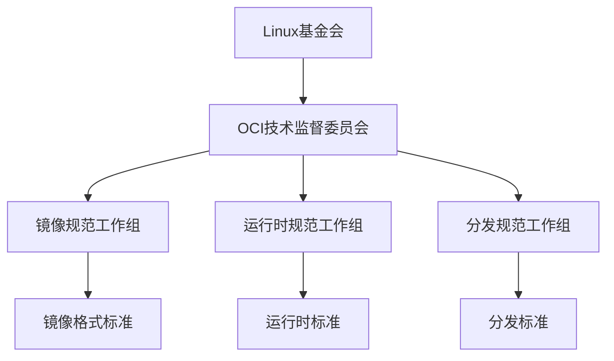
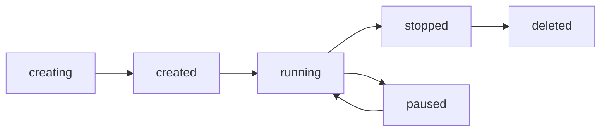

# OCI标准详解

> 版本锚点（新增）：本文涉及的 OCI 版本与实现信息统一参考《2025年技术标准最终对齐报告.md》的“OCI 1.1 标准”章节；如需调整，仅更新该报告并保持本文锚链接引用。

## 概述

OCI（Open Container Initiative）是Linux基金会下的开放容器倡议，旨在制定容器格式和运行时的开放标准。
本文档深入解析OCI标准的各个组成部分、技术规范和实施指南。

## 目录

- [OCI标准详解](#oci标准详解)
  - [概述](#概述)
  - [目录](#目录)
  - [OCI标准基础](#oci标准基础)
    - [OCI组织架构](#oci组织架构)
    - [核心规范](#核心规范)
      - [1. 镜像规范（Image Specification）](#1-镜像规范image-specification)
      - [2. 运行时规范（Runtime Specification）](#2-运行时规范runtime-specification)
      - [3. 分发规范（Distribution Specification）](#3-分发规范distribution-specification)
    - [标准演进](#标准演进)
  - [OCI镜像规范](#oci镜像规范)
    - [镜像结构](#镜像结构)
      - [基本组件](#基本组件)
      - [镜像索引](#镜像索引)
    - [镜像配置](#镜像配置)
      - [配置文件结构](#配置文件结构)
    - [层管理](#层管理)
      - [层结构](#层结构)
      - [层操作](#层操作)
  - [OCI运行时规范](#oci运行时规范)
    - [运行时配置](#运行时配置)
      - [配置文件结构1](#配置文件结构1)
    - [生命周期管理](#生命周期管理)
      - [运行时状态](#运行时状态)
      - [状态转换](#状态转换)
    - [钩子机制](#钩子机制)
      - [钩子类型](#钩子类型)
  - [OCI分发规范](#oci分发规范)
    - [分发API](#分发api)
      - [清单操作](#清单操作)
      - [Blob操作](#blob操作)
    - [认证机制](#认证机制)
      - [Token认证](#token认证)
      - [范围定义](#范围定义)
  - [OCI配置规范](#oci配置规范)
    - [注解规范](#注解规范)
      - [标准注解](#标准注解)
    - [媒体类型](#媒体类型)
      - [标准媒体类型](#标准媒体类型)
  - [标准实施指南](#标准实施指南)
    - [1. 镜像构建](#1-镜像构建)
      - [使用buildah构建](#使用buildah构建)
      - [使用skopeo操作](#使用skopeo操作)
    - [2. 运行时实施](#2-运行时实施)
      - [使用runc运行](#使用runc运行)
      - [使用crun运行](#使用crun运行)
    - [3. 分发实施](#3-分发实施)
      - [使用containerd分发](#使用containerd分发)
  - [最佳实践](#最佳实践)
    - [1. 镜像构建最佳实践](#1-镜像构建最佳实践)
      - [多阶段构建](#多阶段构建)
      - [层优化](#层优化)
    - [2. 运行时安全最佳实践](#2-运行时安全最佳实践)
      - [最小权限原则](#最小权限原则)
      - [资源限制](#资源限制)
    - [3. 分发安全最佳实践](#3-分发安全最佳实践)
      - [镜像签名](#镜像签名)
      - [漏洞扫描](#漏洞扫描)
  - [FAQ](#faq)
    - [Q1: OCI标准与Docker标准有什么区别？](#q1-oci标准与docker标准有什么区别)
    - [Q2: 如何迁移到OCI标准？](#q2-如何迁移到oci标准)
    - [Q3: OCI标准的优势是什么？](#q3-oci标准的优势是什么)
    - [Q4: 如何确保OCI标准的合规性？](#q4-如何确保oci标准的合规性)
  - [总结](#总结)

## OCI标准基础

### OCI组织架构



### 核心规范

#### 1. 镜像规范（Image Specification）

- **版本**：v1.0.2
- **范围**：定义容器镜像的格式和结构
- **组件**：清单、配置、层、索引

#### 2. 运行时规范（Runtime Specification）

- **版本**：v1.0.3
- **范围**：定义容器运行时的标准接口
- **组件**：配置、生命周期、钩子

#### 3. 分发规范（Distribution Specification）

- **版本**：v1.0.1
- **范围**：定义容器镜像分发协议
- **组件**：HTTP API、认证、推送/拉取

### 标准演进

```yaml
    # OCI标准版本演进
oci_standards:
  image_spec:
    v1.0.0: "2017-07-19"
    v1.0.1: "2019-02-01"
    v1.0.2: "2021-01-22"
  
  runtime_spec:
    v1.0.0: "2017-07-19"
    v1.0.1: "2019-02-01"
    v1.0.2: "2021-01-22"
    v1.0.3: "2023-02-17"
  
  distribution_spec:
    v1.0.0: "2020-05-08"
    v1.0.1: "2021-05-24"
```

## OCI镜像规范

### 镜像结构

#### 基本组件

```json
{
  "schemaVersion": 2,
  "mediaType": "application/vnd.oci.image.manifest.v1+json",
  "config": {
    "mediaType": "application/vnd.oci.image.config.v1+json",
    "size": 1469,
    "digest": "sha256:5b0bcabd1ed22e9fb1310cf6c2dec7cdef19f0ad69efa1f392e94a4333501270"
  },
  "layers": [
    {
      "mediaType": "application/vnd.oci.image.layer.v1.tar+gzip",
      "size": 32654,
      "digest": "sha256:e692418e4cbaf90ca69d05a66403747baa33ee08806650b51fab815ad7fc331f"
    }
  ],
  "annotations": {
    "org.opencontainers.image.created": "2023-01-01T00:00:00Z",
    "org.opencontainers.image.authors": "OCI Maintainers"
  }
}
```

#### 镜像索引

```json
{
  "schemaVersion": 2,
  "mediaType": "application/vnd.oci.image.index.v1+json",
  "manifests": [
    {
      "mediaType": "application/vnd.oci.image.manifest.v1+json",
      "size": 7143,
      "digest": "sha256:59eec8837a4d942cc19a52b8c09ea4a8726ef8b4c9c0f6c02640f3f61e7e0f5b",
      "platform": {
        "architecture": "amd64",
        "os": "linux"
      }
    },
    {
      "mediaType": "application/vnd.oci.image.manifest.v1+json",
      "size": 7682,
      "digest": "sha256:79eec8837a4d942cc19a52b8c09ea4a8726ef8b4c9c0f6c02640f3f61e7e0f5c",
      "platform": {
        "architecture": "arm64",
        "os": "linux"
      }
    }
  ]
}
```

### 镜像配置

#### 配置文件结构

```json
{
  "created": "2023-01-01T00:00:00Z",
  "author": "OCI Maintainers",
  "architecture": "amd64",
  "os": "linux",
  "config": {
    "User": "1000:1000",
    "ExposedPorts": {
      "8080/tcp": {}
    },
    "Env": [
      "PATH=/usr/local/sbin:/usr/local/bin:/usr/sbin:/usr/bin:/sbin:/bin"
    ],
    "Entrypoint": ["/bin/sh"],
    "Cmd": ["-c", "echo 'Hello OCI'"],
    "WorkingDir": "/app",
    "Labels": {
      "org.opencontainers.image.title": "OCI Example",
      "org.opencontainers.image.description": "An example OCI image"
    }
  },
  "rootfs": {
    "type": "layers",
    "diff_ids": [
      "sha256:5b0bcabd1ed22e9fb1310cf6c2dec7cdef19f0ad69efa1f392e94a4333501270"
    ]
  },
  "history": [
    {
      "created": "2023-01-01T00:00:00Z",
      "created_by": "/bin/sh -c #(nop) ADD file:abc123 in /",
      "comment": "Add base layer"
    }
  ]
}
```

### 层管理

#### 层结构

```bash
    # 层文件系统结构
layer/
├── bin/
├── etc/
├── usr/
├── var/
└── .wh..wh..opq  # 白化文件（删除标记）
```

#### 层操作

```bash
    # 创建层
tar -czf layer.tar.gz -C layer/ .

    # 计算层摘要
sha256sum layer.tar.gz

    # 验证层完整性
sha256sum -c layer.sha256
```

## OCI运行时规范

### 运行时配置

#### 配置文件结构1

```json
{
  "ociVersion": "1.0.3",
  "process": {
    "terminal": true,
    "user": {
      "uid": 1000,
      "gid": 1000,
      "additionalGids": [100, 200]
    },
    "args": ["/bin/sh"],
    "env": [
      "PATH=/usr/local/sbin:/usr/local/bin:/usr/sbin:/usr/bin:/sbin:/bin",
      "TERM=xterm"
    ],
    "cwd": "/",
    "capabilities": {
      "bounding": [
        "CAP_AUDIT_WRITE",
        "CAP_KILL",
        "CAP_NET_BIND_SERVICE"
      ],
      "effective": [
        "CAP_AUDIT_WRITE",
        "CAP_KILL",
        "CAP_NET_BIND_SERVICE"
      ],
      "inheritable": [
        "CAP_AUDIT_WRITE",
        "CAP_KILL",
        "CAP_NET_BIND_SERVICE"
      ],
      "permitted": [
        "CAP_AUDIT_WRITE",
        "CAP_KILL",
        "CAP_NET_BIND_SERVICE"
      ]
    },
    "rlimits": [
      {
        "type": "RLIMIT_NOFILE",
        "hard": 1024,
        "soft": 1024
      }
    ],
    "noNewPrivileges": true
  },
  "root": {
    "path": "rootfs",
    "readonly": true
  },
  "hostname": "container",
  "mounts": [
    {
      "destination": "/proc",
      "type": "proc",
      "source": "proc"
    },
    {
      "destination": "/dev",
      "type": "tmpfs",
      "source": "tmpfs",
      "options": ["nosuid", "strictatime", "mode=755", "size=65536k"]
    }
  ],
  "hooks": {
    "prestart": [
      {
        "path": "/usr/bin/fix-mounts",
        "args": ["fix-mounts", "arg1", "arg2"],
        "env": ["key1=value1"]
      }
    ],
    "poststart": [
      {
        "path": "/usr/bin/notify-start",
        "timeout": 5
      }
    ],
    "poststop": [
      {
        "path": "/usr/bin/cleanup.sh"
      }
    ]
  },
  "linux": {
    "resources": {
      "devices": [
        {
          "allow": false,
          "access": "rwm"
        },
        {
          "allow": true,
          "type": "c",
          "major": 1,
          "minor": 5,
          "access": "rwm"
        }
      ],
      "memory": {
        "limit": 536870912,
        "reservation": 536870912,
        "swap": 536870912,
        "kernel": 67108864,
        "kernelTCP": 134217728,
        "swappiness": 0
      },
      "cpu": {
        "shares": 1024,
        "quota": 1000000,
        "period": 500000,
        "realtimeRuntime": 950000,
        "realtimePeriod": 1000000,
        "cpus": "2-3",
        "mems": "0-7"
      },
      "pids": {
        "limit": 32768
      },
      "blockIO": {
        "weight": 750,
        "leafWeight": 500,
        "weightDevice": [
          {
            "major": 8,
            "minor": 0,
            "weight": 500,
            "leafWeight": 300
          }
        ],
        "throttleReadBpsDevice": [
          {
            "major": 8,
            "minor": 0,
            "rate": 600
          }
        ],
        "throttleWriteBpsDevice": [
          {
            "major": 8,
            "minor": 0,
            "rate": 600
          }
        ]
      },
      "hugepageLimits": [
        {
          "pageSize": "2MB",
          "limit": 9223372036854775807
        }
      ],
      "network": {
        "classID": 1048577,
        "priorities": [
          {
            "name": "eth0",
            "priority": 500
          }
        ]
      }
    },
    "cgroupsPath": "/myRuntime/containerID",
    "namespaces": [
      {
        "type": "pid"
      },
      {
        "type": "network"
      },
      {
        "type": "ipc"
      },
      {
        "type": "uts"
      },
      {
        "type": "mount"
      },
      {
        "type": "user"
      }
    ],
    "devices": [
      {
        "path": "/dev/fuse",
        "type": "c",
        "major": 10,
        "minor": 229,
        "fileMode": 438,
        "uid": 0,
        "gid": 0
      },
      {
        "path": "/dev/sda",
        "type": "b",
        "major": 8,
        "minor": 0,
        "fileMode": 432,
        "uid": 0,
        "gid": 0
      }
    ],
    "seccomp": {
      "defaultAction": "SCMP_ACT_ERRNO",
      "architectures": [
        "SCMP_ARCH_X86_64",
        "SCMP_ARCH_X86",
        "SCMP_ARCH_X32"
      ],
      "syscalls": [
        {
          "names": [
            "accept",
            "accept4",
            "access",
            "alarm"
          ],
          "action": "SCMP_ACT_ALLOW"
        }
      ]
    },
    "rootfsPropagation": "rprivate",
    "maskedPaths": [
      "/proc/kcore",
      "/proc/latency_stats",
      "/proc/timer_stats",
      "/proc/sched_debug"
    ],
    "readonlyPaths": [
      "/proc/asound",
      "/proc/bus",
      "/proc/fs",
      "/proc/irq",
      "/proc/sys",
      "/proc/sysrq-trigger"
    ],
    "mountLabel": "system_u:object_r:svirt_sandbox_file_t:s0:c715,c811"
  }
}
```

### 生命周期管理

#### 运行时状态

```json
{
  "ociVersion": "1.0.3",
  "id": "containerID",
  "status": "running",
  "pid": 4422,
  "bundle": "/containers/redis",
  "annotations": {
    "com.example.key1": "value1",
    "com.example.key2": "value2"
  }
}
```

#### 状态转换



### 钩子机制

#### 钩子类型

```bash
    # 预启动钩子
{
  "path": "/usr/bin/fix-mounts",
  "args": ["fix-mounts", "arg1", "arg2"],
  "env": ["key1=value1"],
  "timeout": 30
}

    # 启动后钩子
{
  "path": "/usr/bin/notify-start",
  "timeout": 5
}

    # 停止后钩子
{
  "path": "/usr/bin/cleanup.sh"
}
```

## OCI分发规范

### 分发API

#### 清单操作

```http
    # 获取清单
GET /v2/<name>/manifests/<reference>
Host: <registry>
Authorization: Bearer <token>

    # 推送清单
PUT /v2/<name>/manifests/<reference>
Host: <registry>
Authorization: Bearer <token>
Content-Type: application/vnd.oci.image.manifest.v1+json

    # 删除清单
DELETE /v2/<name>/manifests/<reference>
Host: <registry>
Authorization: Bearer <token>
```

#### Blob操作

```http
    # 获取Blob
GET /v2/<name>/blobs/<digest>
Host: <registry>
Authorization: Bearer <token>

    # 推送Blob
PUT /v2/<name>/blobs/uploads/<uuid>
Host: <registry>
Authorization: Bearer <token>
Content-Type: application/octet-stream

    # 检查Blob存在
HEAD /v2/<name>/blobs/<digest>
Host: <registry>
Authorization: Bearer <token>
```

### 认证机制

#### Token认证

```http
    # 获取Token
GET /v2/token?service=<service>&scope=<scope>
Host: <auth-server>
Authorization: Basic <base64-credentials>

    # 响应
{
  "token": "eyJhbGciOiJSUzI1NiIsInR5cCI6IkpXVCJ9...",
  "access_token": "eyJhbGciOiJSUzI1NiIsInR5cCI6IkpXVCJ9...",
  "expires_in": 3600,
  "issued_at": "2023-01-01T00:00:00Z"
}
```

#### 范围定义

```bash
    # 范围格式
scope = <resource-type>:<resource-name>:<actions>

    # 示例
repository:library/nginx:pull
repository:library/nginx:pull,push
registry:catalog:*
```

## OCI配置规范

### 注解规范

#### 标准注解

```json
{
  "annotations": {
    "org.opencontainers.image.created": "2023-01-01T00:00:00Z",
    "org.opencontainers.image.authors": "OCI Maintainers",
    "org.opencontainers.image.url": "https://example.com",
    "org.opencontainers.image.documentation": "https://example.com/docs",
    "org.opencontainers.image.source": "https://github.com/example/repo",
    "org.opencontainers.image.version": "1.0.0",
    "org.opencontainers.image.revision": "abc123",
    "org.opencontainers.image.vendor": "Example Corp",
    "org.opencontainers.image.licenses": "Apache-2.0",
    "org.opencontainers.image.ref.name": "latest",
    "org.opencontainers.image.title": "Example Image",
    "org.opencontainers.image.description": "An example OCI image",
    "org.opencontainers.image.base.digest": "sha256:...",
    "org.opencontainers.image.base.name": "ubuntu:20.04"
  }
}
```

### 媒体类型

#### 标准媒体类型

```yaml
    # 镜像相关
image_media_types:
  manifest: "application/vnd.oci.image.manifest.v1+json"
  manifest_list: "application/vnd.oci.image.index.v1+json"
  config: "application/vnd.oci.image.config.v1+json"
  layer: "application/vnd.oci.image.layer.v1.tar+gzip"
  layer_nondistributable: "application/vnd.oci.image.layer.nondistributable.v1.tar+gzip"

    # 运行时相关
runtime_media_types:
  config: "application/vnd.oci.runtime.config.v1+json"
  state: "application/vnd.oci.runtime.state.v1+json"
```

## 标准实施指南

### 1. 镜像构建

#### 使用buildah构建

```bash
    # 创建容器
buildah from ubuntu:20.04

    # 配置容器
buildah config --label "org.opencontainers.image.title=My App" mycontainer
buildah config --port 8080 mycontainer
buildah config --user 1000:1000 mycontainer

    # 安装软件
buildah run mycontainer -- apt-get update
buildah run mycontainer -- apt-get install -y nginx

    # 提交镜像
buildah commit mycontainer myapp:latest
```

#### 使用skopeo操作

```bash
    # 复制镜像
skopeo copy docker://nginx:latest oci:nginx:latest

    # 检查镜像
skopeo inspect oci:nginx:latest

    # 同步镜像
skopeo sync --src docker --dest oci nginx:latest oci:nginx:latest
```

### 2. 运行时实施

#### 使用runc运行

```bash
    # 创建运行时配置
runc spec

    # 运行容器
runc run mycontainer

    # 列出容器
runc list

    # 停止容器
runc kill mycontainer SIGTERM
```

#### 使用crun运行

```bash
    # 创建运行时配置
crun spec

    # 运行容器
crun run mycontainer

    # 列出容器
crun list
```

### 3. 分发实施

#### 使用containerd分发

```bash
    # 拉取镜像
ctr images pull docker.io/library/nginx:latest

    # 推送镜像
ctr images push docker.io/myregistry/myapp:latest

    # 列出镜像
ctr images list
```

## 最佳实践

### 1. 镜像构建最佳实践

#### 多阶段构建

```dockerfile
    # 构建阶段
FROM golang:1.19-alpine AS builder
WORKDIR /app
COPY . .
RUN go build -o myapp .

    # 运行阶段
FROM alpine:latest
RUN apk --no-cache add ca-certificates
WORKDIR /root/
COPY --from=builder /app/myapp .
CMD ["./myapp"]
```

#### 层优化

```bash
    # 合并RUN指令
RUN apt-get update && \
    apt-get install -y nginx && \
    apt-get clean && \
    rm -rf /var/lib/apt/lists/*

    # 使用.dockerignore
echo "node_modules" >> .dockerignore
echo "*.log" >> .dockerignore
```

### 2. 运行时安全最佳实践

#### 最小权限原则

```json
{
  "process": {
    "user": {
      "uid": 1000,
      "gid": 1000
    },
    "capabilities": {
      "bounding": ["CAP_NET_BIND_SERVICE"],
      "effective": ["CAP_NET_BIND_SERVICE"],
      "inheritable": [],
      "permitted": ["CAP_NET_BIND_SERVICE"]
    },
    "noNewPrivileges": true
  }
}
```

#### 资源限制

```json
{
  "linux": {
    "resources": {
      "memory": {
        "limit": 536870912,
        "swap": 536870912
      },
      "cpu": {
        "shares": 1024,
        "quota": 1000000,
        "period": 500000
      },
      "pids": {
        "limit": 32768
      }
    }
  }
}
```

### 3. 分发安全最佳实践

#### 镜像签名

```bash
    # 创建签名密钥
cosign generate-key-pair

    # 签名镜像
cosign sign --key cosign.key myregistry/myapp:latest

    # 验证签名
cosign verify --key cosign.pub myregistry/myapp:latest
```

#### 漏洞扫描

```bash
    # 使用trivy扫描
trivy image myregistry/myapp:latest

    # 使用grype扫描
grype myregistry/myapp:latest
```

## FAQ

### Q1: OCI标准与Docker标准有什么区别？

**A**: 主要区别：

- **标准化程度**：OCI是开放标准，Docker是专有格式
- **兼容性**：OCI标准具有更好的跨平台兼容性
- **功能范围**：OCI标准更加全面和规范
- **社区支持**：OCI标准有更广泛的社区支持

### Q2: 如何迁移到OCI标准？

**A**: 迁移步骤：

1. **评估现状**：分析现有容器镜像和运行时
2. **选择工具**：选择支持OCI标准的工具
3. **逐步迁移**：从新项目开始，逐步迁移现有项目
4. **测试验证**：确保迁移后的功能正常
5. **文档更新**：更新相关文档和流程

### Q3: OCI标准的优势是什么？

**A**: OCI标准的主要优势：

- **标准化**：统一的容器格式和运行时标准
- **互操作性**：不同工具和平台之间的互操作
- **安全性**：内置的安全机制和最佳实践
- **可扩展性**：支持多种架构和平台
- **社区驱动**：开放的标准制定过程

### Q4: 如何确保OCI标准的合规性？

**A**: 合规性检查方法：

- **工具验证**：使用OCI验证工具检查合规性
- **自动化测试**：集成到CI/CD流程中
- **定期审计**：定期进行合规性审计
- **文档审查**：审查相关文档和配置
- **社区反馈**：参与OCI社区讨论和反馈

---

## 总结

OCI标准为容器技术提供了统一的标准规范，包括：

1. **镜像规范**：定义了容器镜像的格式和结构
2. **运行时规范**：定义了容器运行时的标准接口
3. **分发规范**：定义了容器镜像分发协议
4. **配置规范**：定义了各种配置和注解标准

通过遵循OCI标准，可以实现更好的互操作性、安全性和可维护性，为容器技术的发展奠定坚实的基础。
