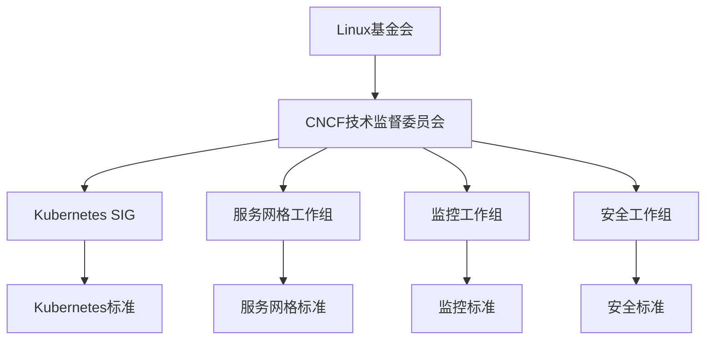

# CNCF标准详解

## 概述

CNCF（Cloud Native Computing Foundation）是Linux基金会下的云原生计算基金会，致力于推动云原生技术的标准化和普及。本文档深入解析CNCF标准体系、技术规范和最佳实践。

## 目录

- [CNCF标准详解](#cncf标准详解)
  - [概述](#概述)
  - [CNCF标准基础](#cncf标准基础)
    - [CNCF组织架构](#cncf组织架构)
    - [核心标准](#核心标准)
      - [1. Kubernetes标准](#1-kubernetes标准)
      - [2. 服务网格标准](#2-服务网格标准)
      - [3. 监控标准](#3-监控标准)
    - [标准演进](#标准演进)
- [CNCF标准版本演进](#cncf标准版本演进)
  - [Kubernetes标准](#kubernetes标准)
    - [API标准](#api标准)
      - [资源定义](#资源定义)
- [Pod标准定义](#pod标准定义)
      - [服务定义](#服务定义)
- [Service标准定义](#service标准定义)
    - [调度标准](#调度标准)
      - [节点选择](#节点选择)
- [NodeSelector标准](#nodeselector标准)
      - [亲和性规则](#亲和性规则)
- [Affinity标准](#affinity标准)
    - [网络标准](#网络标准)
      - [网络策略](#网络策略)
- [NetworkPolicy标准](#networkpolicy标准)
      - [Ingress标准](#ingress标准)
- [Ingress标准](#ingress标准)
  - [服务网格标准](#服务网格标准)
    - [Service Mesh Interface](#service-mesh-interface)
      - [流量分割](#流量分割)
- [TrafficSplit标准](#trafficsplit标准)
      - [流量访问控制](#流量访问控制)
- [TrafficAccessControl标准](#trafficaccesscontrol标准)
      - [流量规范](#流量规范)
- [TrafficSpec标准](#trafficspec标准)
    - [Istio标准](#istio标准)
      - [虚拟服务](#虚拟服务)
- [VirtualService标准](#virtualservice标准)
      - [目标规则](#目标规则)
- [DestinationRule标准](#destinationrule标准)
  - [监控标准](#监控标准)
    - [Prometheus标准](#prometheus标准)
      - [指标定义](#指标定义)
- [ServiceMonitor标准](#servicemonitor标准)
      - [告警规则](#告警规则)
- [PrometheusRule标准](#prometheusrule标准)
    - [OpenTelemetry标准](#opentelemetry标准)
      - [指标配置](#指标配置)
- [OpenTelemetryCollector标准](#opentelemetrycollector标准)
  - [安全标准](#安全标准)
    - [Pod安全标准](#pod安全标准)
      - [Pod安全策略](#pod安全策略)
- [PodSecurityPolicy标准](#podsecuritypolicy标准)
      - [Pod安全标准1](#pod安全标准1)
- [PodSecurityStandard标准](#podsecuritystandard标准)
    - [网络策略标准](#网络策略标准)
      - [默认拒绝策略](#默认拒绝策略)
- [默认拒绝所有入站流量](#默认拒绝所有入站流量)
- [默认拒绝所有出站流量](#默认拒绝所有出站流量)
  - [存储标准](#存储标准)
    - [持久卷标准](#持久卷标准)
      - [存储类定义](#存储类定义)
- [StorageClass标准](#storageclass标准)
      - [持久卷声明](#持久卷声明)
- [PersistentVolumeClaim标准](#persistentvolumeclaim标准)
    - [CSI标准](#csi标准)
      - [CSI驱动配置](#csi驱动配置)
- [CSIDriver标准](#csidriver标准)
  - [网络标准1](#网络标准1)
    - [CNI标准](#cni标准)
      - [网络配置](#网络配置)
    - [服务网格网络](#服务网格网络)
      - [网关配置](#网关配置)
- [Gateway标准](#gateway标准)
  - [最佳实践](#最佳实践)
    - [1. 标准化部署](#1-标准化部署)
      - [命名规范](#命名规范)
- [资源命名标准](#资源命名标准)
      - [标签规范](#标签规范)
- [标签标准](#标签标准)
    - [2. 安全最佳实践](#2-安全最佳实践)
      - [安全基线](#安全基线)
- [安全基线配置](#安全基线配置)
    - [3. 监控最佳实践](#3-监控最佳实践)
      - [监控指标](#监控指标)
- [监控指标标准](#监控指标标准)
  - [FAQ](#faq)
    - [Q1: CNCF标准与Kubernetes标准有什么区别？](#q1-cncf标准与kubernetes标准有什么区别)
    - [Q2: 如何实施CNCF标准？](#q2-如何实施cncf标准)
    - [Q3: CNCF标准的优势是什么？](#q3-cncf标准的优势是什么)
    - [Q4: 如何确保CNCF标准的合规性？](#q4-如何确保cncf标准的合规性)
  - [总结](#总结)

- [CNCF标准详解](#cncf标准详解)
  - [概述](#概述)
  - [CNCF标准基础](#cncf标准基础)
    - [CNCF组织架构](#cncf组织架构)
    - [核心标准](#核心标准)
      - [1. Kubernetes标准](#1-kubernetes标准)
      - [2. 服务网格标准](#2-服务网格标准)
      - [3. 监控标准](#3-监控标准)
    - [标准演进](#标准演进)
- [CNCF标准版本演进](#cncf标准版本演进)
  - [Kubernetes标准](#kubernetes标准)
    - [API标准](#api标准)
      - [资源定义](#资源定义)
- [Pod标准定义](#pod标准定义)
      - [服务定义](#服务定义)
- [Service标准定义](#service标准定义)
    - [调度标准](#调度标准)
      - [节点选择](#节点选择)
- [NodeSelector标准](#nodeselector标准)
      - [亲和性规则](#亲和性规则)
- [Affinity标准](#affinity标准)
    - [网络标准](#网络标准)
      - [网络策略](#网络策略)
- [NetworkPolicy标准](#networkpolicy标准)
      - [Ingress标准](#ingress标准)
- [Ingress标准](#ingress标准)
  - [服务网格标准](#服务网格标准)
    - [Service Mesh Interface](#service-mesh-interface)
      - [流量分割](#流量分割)
- [TrafficSplit标准](#trafficsplit标准)
      - [流量访问控制](#流量访问控制)
- [TrafficAccessControl标准](#trafficaccesscontrol标准)
      - [流量规范](#流量规范)
- [TrafficSpec标准](#trafficspec标准)
    - [Istio标准](#istio标准)
      - [虚拟服务](#虚拟服务)
- [VirtualService标准](#virtualservice标准)
      - [目标规则](#目标规则)
- [DestinationRule标准](#destinationrule标准)
  - [监控标准](#监控标准)
    - [Prometheus标准](#prometheus标准)
      - [指标定义](#指标定义)
- [ServiceMonitor标准](#servicemonitor标准)
      - [告警规则](#告警规则)
- [PrometheusRule标准](#prometheusrule标准)
    - [OpenTelemetry标准](#opentelemetry标准)
      - [指标配置](#指标配置)
- [OpenTelemetryCollector标准](#opentelemetrycollector标准)
  - [安全标准](#安全标准)
    - [Pod安全标准](#pod安全标准)
      - [Pod安全策略](#pod安全策略)
- [PodSecurityPolicy标准](#podsecuritypolicy标准)
      - [Pod安全标准1](#pod安全标准1)
- [PodSecurityStandard标准](#podsecuritystandard标准)
    - [网络策略标准](#网络策略标准)
      - [默认拒绝策略](#默认拒绝策略)
- [默认拒绝所有入站流量](#默认拒绝所有入站流量)
- [默认拒绝所有出站流量](#默认拒绝所有出站流量)
  - [存储标准](#存储标准)
    - [持久卷标准](#持久卷标准)
      - [存储类定义](#存储类定义)
- [StorageClass标准](#storageclass标准)
      - [持久卷声明](#持久卷声明)
- [PersistentVolumeClaim标准](#persistentvolumeclaim标准)
    - [CSI标准](#csi标准)
      - [CSI驱动配置](#csi驱动配置)
- [CSIDriver标准](#csidriver标准)
  - [网络标准1](#网络标准1)
    - [CNI标准](#cni标准)
      - [网络配置](#网络配置)
    - [服务网格网络](#服务网格网络)
      - [网关配置](#网关配置)
- [Gateway标准](#gateway标准)
  - [最佳实践](#最佳实践)
    - [1. 标准化部署](#1-标准化部署)
      - [命名规范](#命名规范)
- [资源命名标准](#资源命名标准)
      - [标签规范](#标签规范)
- [标签标准](#标签标准)
    - [2. 安全最佳实践](#2-安全最佳实践)
      - [安全基线](#安全基线)
- [安全基线配置](#安全基线配置)
    - [3. 监控最佳实践](#3-监控最佳实践)
      - [监控指标](#监控指标)
- [监控指标标准](#监控指标标准)
  - [FAQ](#faq)
    - [Q1: CNCF标准与Kubernetes标准有什么区别？](#q1-cncf标准与kubernetes标准有什么区别)
    - [Q2: 如何实施CNCF标准？](#q2-如何实施cncf标准)
    - [Q3: CNCF标准的优势是什么？](#q3-cncf标准的优势是什么)
    - [Q4: 如何确保CNCF标准的合规性？](#q4-如何确保cncf标准的合规性)
  - [总结](#总结)

- [CNCF标准基础](#cncf标准基础)
- [Kubernetes标准](#kubernetes标准)
- [服务网格标准](#服务网格标准)
- [监控标准](#监控标准)
- [安全标准](#安全标准)
- [存储标准](#存储标准)
- [网络标准](#网络标准)
- [最佳实践](#最佳实践)
- [FAQ](#faq)

## CNCF标准基础

### CNCF组织架构



### 核心标准

#### 1. Kubernetes标准

- **版本**：v1.28+
- **范围**：容器编排和管理
- **组件**：API、调度、网络、存储

#### 2. 服务网格标准

- **版本**：Service Mesh Interface v0.6.0
- **范围**：服务间通信管理
- **组件**：流量管理、安全、可观测性

#### 3. 监控标准

- **版本**：Prometheus v2.45+
- **范围**：指标收集和告警
- **组件**：指标、告警、可视化

### 标准演进

```yaml
# CNCF标准版本演进
cncf_standards:
  kubernetes:
    v1.25: "2022-08-23"
    v1.26: "2022-12-08"
    v1.27: "2023-04-11"
    v1.28: "2023-08-15"
  
  service_mesh_interface:
    v0.6.0: "2023-03-15"
    v0.5.0: "2022-09-20"
    v0.4.0: "2022-03-10"
  
  prometheus:
    v2.45: "2023-05-16"
    v2.44: "2023-03-15"
    v2.43: "2023-01-18"
```

## Kubernetes标准

### API标准

#### 资源定义

```yaml
# Pod标准定义
apiVersion: v1
kind: Pod
metadata:
  name: example-pod
  labels:
    app: example
    version: v1.0.0
  annotations:
    description: "Example pod following CNCF standards"
spec:
  containers:
  - name: app
    image: nginx:1.21
    ports:
    - containerPort: 80
      protocol: TCP
    resources:
      requests:
        memory: "64Mi"
        cpu: "250m"
      limits:
        memory: "128Mi"
        cpu: "500m"
    livenessProbe:
      httpGet:
        path: /
        port: 80
      initialDelaySeconds: 30
      periodSeconds: 10
    readinessProbe:
      httpGet:
        path: /
        port: 80
      initialDelaySeconds: 5
      periodSeconds: 5
```

#### 服务定义

```yaml
# Service标准定义
apiVersion: v1
kind: Service
metadata:
  name: example-service
  labels:
    app: example
spec:
  selector:
    app: example
  ports:
  - name: http
    port: 80
    targetPort: 80
    protocol: TCP
  type: ClusterIP
```

### 调度标准

#### 节点选择

```yaml
# NodeSelector标准
apiVersion: apps/v1
kind: Deployment
metadata:
  name: example-deployment
spec:
  replicas: 3
  selector:
    matchLabels:
      app: example
  template:
    metadata:
      labels:
        app: example
    spec:
      nodeSelector:
        kubernetes.io/os: linux
        node-type: worker
      containers:
      - name: app
        image: nginx:1.21
```

#### 亲和性规则

```yaml
# Affinity标准
apiVersion: apps/v1
kind: Deployment
metadata:
  name: example-deployment
spec:
  replicas: 3
  selector:
    matchLabels:
      app: example
  template:
    metadata:
      labels:
        app: example
    spec:
      affinity:
        nodeAffinity:
          requiredDuringSchedulingIgnoredDuringExecution:
            nodeSelectorTerms:
            - matchExpressions:
              - key: kubernetes.io/os
                operator: In
                values:
                - linux
        podAntiAffinity:
          preferredDuringSchedulingIgnoredDuringExecution:
          - weight: 100
            podAffinityTerm:
              labelSelector:
                matchExpressions:
                - key: app
                  operator: In
                  values:
                  - example
              topologyKey: kubernetes.io/hostname
      containers:
      - name: app
        image: nginx:1.21
```

### 网络标准

#### 网络策略

```yaml
# NetworkPolicy标准
apiVersion: networking.k8s.io/v1
kind: NetworkPolicy
metadata:
  name: example-network-policy
  namespace: default
spec:
  podSelector:
    matchLabels:
      app: example
  policyTypes:
  - Ingress
  - Egress
  ingress:
  - from:
    - namespaceSelector:
        matchLabels:
          name: frontend
    - podSelector:
        matchLabels:
          app: frontend
    ports:
    - protocol: TCP
      port: 80
  egress:
  - to:
    - namespaceSelector:
        matchLabels:
          name: backend
    ports:
    - protocol: TCP
      port: 5432
  - to: []
    ports:
    - protocol: TCP
      port: 53
    - protocol: UDP
      port: 53
```

#### Ingress标准

```yaml
# Ingress标准
apiVersion: networking.k8s.io/v1
kind: Ingress
metadata:
  name: example-ingress
  annotations:
    nginx.ingress.kubernetes.io/rewrite-target: /
    nginx.ingress.kubernetes.io/ssl-redirect: "true"
spec:
  tls:
  - hosts:
    - example.com
    secretName: example-tls
  rules:
  - host: example.com
    http:
      paths:
      - path: /
        pathType: Prefix
        backend:
          service:
            name: example-service
            port:
              number: 80
```

## 服务网格标准

### Service Mesh Interface

#### 流量分割

```yaml
# TrafficSplit标准
apiVersion: split.smi-spec.io/v1alpha4
kind: TrafficSplit
metadata:
  name: example-traffic-split
  namespace: default
spec:
  service: example-service
  backends:
  - service: example-service-v1
    weight: 90
  - service: example-service-v2
    weight: 10
```

#### 流量访问控制

```yaml
# TrafficAccessControl标准
apiVersion: access.smi-spec.io/v1alpha3
kind: TrafficTarget
metadata:
  name: example-traffic-target
  namespace: default
spec:
  destination:
    kind: ServiceAccount
    name: backend
    namespace: default
  sources:
  - kind: ServiceAccount
    name: frontend
    namespace: default
  rules:
  - kind: HTTPRouteGroup
    name: example-http-route-group
    matches:
    - api
---
apiVersion: specs.smi-spec.io/v1alpha4
kind: HTTPRouteGroup
metadata:
  name: example-http-route-group
  namespace: default
spec:
  matches:
  - name: api
    pathRegex: "/api/*"
    methods:
    - GET
    - POST
```

#### 流量规范

```yaml
# TrafficSpec标准
apiVersion: specs.smi-spec.io/v1alpha4
kind: TCPRoute
metadata:
  name: example-tcp-route
  namespace: default
spec:
  matches:
    ports:
    - 8080
    - 8081
```

### Istio标准

#### 虚拟服务

```yaml
# VirtualService标准
apiVersion: networking.istio.io/v1alpha3
kind: VirtualService
metadata:
  name: example-virtual-service
  namespace: default
spec:
  hosts:
  - example.com
  gateways:
  - example-gateway
  http:
  - match:
    - uri:
        prefix: /api
    route:
    - destination:
        host: example-service
        port:
          number: 80
    fault:
      delay:
        percentage:
          value: 0.1
        fixedDelay: 5s
    retries:
      attempts: 3
      perTryTimeout: 2s
```

#### 目标规则

```yaml
# DestinationRule标准
apiVersion: networking.istio.io/v1alpha3
kind: DestinationRule
metadata:
  name: example-destination-rule
  namespace: default
spec:
  host: example-service
  trafficPolicy:
    loadBalancer:
      simple: ROUND_ROBIN
    connectionPool:
      tcp:
        maxConnections: 10
      http:
        http1MaxPendingRequests: 10
        maxRequestsPerConnection: 2
    circuitBreaker:
      consecutiveErrors: 3
      interval: 30s
      baseEjectionTime: 30s
```

## 监控标准

### Prometheus标准

#### 指标定义

```yaml
# ServiceMonitor标准
apiVersion: monitoring.coreos.com/v1
kind: ServiceMonitor
metadata:
  name: example-service-monitor
  namespace: default
  labels:
    app: example
spec:
  selector:
    matchLabels:
      app: example
  endpoints:
  - port: metrics
    path: /metrics
    interval: 30s
    scrapeTimeout: 10s
```

#### 告警规则

```yaml
# PrometheusRule标准
apiVersion: monitoring.coreos.com/v1
kind: PrometheusRule
metadata:
  name: example-prometheus-rule
  namespace: default
  labels:
    app: example
spec:
  groups:
  - name: example.rules
    rules:
    - alert: HighErrorRate
      expr: rate(http_requests_total{status=~"5.."}[5m]) > 0.1
      for: 5m
      labels:
        severity: critical
      annotations:
        summary: "High error rate detected"
        description: "Error rate is {{ $value }} errors per second"
    - alert: HighMemoryUsage
      expr: (container_memory_usage_bytes / container_spec_memory_limit_bytes) > 0.8
      for: 5m
      labels:
        severity: warning
      annotations:
        summary: "High memory usage detected"
        description: "Memory usage is {{ $value }}% of limit"
```

### OpenTelemetry标准

#### 指标配置

```yaml
# OpenTelemetryCollector标准
apiVersion: opentelemetry.io/v1alpha1
kind: OpenTelemetryCollector
metadata:
  name: example-collector
  namespace: default
spec:
  config: |
    receivers:
      otlp:
        protocols:
          grpc:
            endpoint: 0.0.0.0:4317
          http:
            endpoint: 0.0.0.0:4318
    processors:
      batch:
        timeout: 1s
        send_batch_size: 1024
    exporters:
      prometheus:
        endpoint: "0.0.0.0:8889"
      jaeger:
        endpoint: jaeger:14250
        tls:
          insecure: true
    service:
      pipelines:
        metrics:
          receivers: [otlp]
          processors: [batch]
          exporters: [prometheus]
        traces:
          receivers: [otlp]
          processors: [batch]
          exporters: [jaeger]
```

## 安全标准

### Pod安全标准

#### Pod安全策略

```yaml
# PodSecurityPolicy标准
apiVersion: policy/v1beta1
kind: PodSecurityPolicy
metadata:
  name: restricted-psp
spec:
  privileged: false
  allowPrivilegeEscalation: false
  requiredDropCapabilities:
    - ALL
  volumes:
    - 'configMap'
    - 'emptyDir'
    - 'projected'
    - 'secret'
    - 'downwardAPI'
    - 'persistentVolumeClaim'
  runAsUser:
    rule: 'MustRunAsNonRoot'
  seLinux:
    rule: 'RunAsAny'
  fsGroup:
    rule: 'RunAsAny'
```

#### Pod安全标准1

```yaml
# PodSecurityStandard标准
apiVersion: v1
kind: Namespace
metadata:
  name: example-namespace
  labels:
    pod-security.kubernetes.io/enforce: restricted
    pod-security.kubernetes.io/audit: restricted
    pod-security.kubernetes.io/warn: restricted
```

### 网络策略标准

#### 默认拒绝策略

```yaml
# 默认拒绝所有入站流量
apiVersion: networking.k8s.io/v1
kind: NetworkPolicy
metadata:
  name: deny-all-ingress
  namespace: default
spec:
  podSelector: {}
  policyTypes:
  - Ingress
  ingress: []
---
# 默认拒绝所有出站流量
apiVersion: networking.k8s.io/v1
kind: NetworkPolicy
metadata:
  name: deny-all-egress
  namespace: default
spec:
  podSelector: {}
  policyTypes:
  - Egress
  egress: []
```

## 存储标准

### 持久卷标准

#### 存储类定义

```yaml
# StorageClass标准
apiVersion: storage.k8s.io/v1
kind: StorageClass
metadata:
  name: fast-ssd
provisioner: kubernetes.io/aws-ebs
parameters:
  type: gp3
  iops: "3000"
  throughput: "125"
  fsType: ext4
reclaimPolicy: Delete
allowVolumeExpansion: true
volumeBindingMode: WaitForFirstConsumer
```

#### 持久卷声明

```yaml
# PersistentVolumeClaim标准
apiVersion: v1
kind: PersistentVolumeClaim
metadata:
  name: example-pvc
  namespace: default
spec:
  accessModes:
    - ReadWriteOnce
  resources:
    requests:
      storage: 10Gi
  storageClassName: fast-ssd
```

### CSI标准

#### CSI驱动配置

```yaml
# CSIDriver标准
apiVersion: storage.k8s.io/v1
kind: CSIDriver
metadata:
  name: example-csi-driver
spec:
  attachRequired: true
  podInfoOnMount: true
  volumeLifecycleModes:
  - Persistent
  - Ephemeral
```

## 网络标准1

### CNI标准

#### 网络配置

```json
{
  "cniVersion": "0.4.0",
  "name": "example-network",
  "type": "bridge",
  "bridge": "cnio0",
  "isGateway": true,
  "ipMasq": true,
  "ipam": {
    "type": "host-local",
    "ranges": [
      [
        {
          "subnet": "10.244.0.0/16"
        }
      ]
    ],
    "routes": [
      {
        "dst": "0.0.0.0/0"
      }
    ]
  }
}
```

### 服务网格网络

#### 网关配置

```yaml
# Gateway标准
apiVersion: networking.istio.io/v1alpha3
kind: Gateway
metadata:
  name: example-gateway
  namespace: default
spec:
  selector:
    istio: ingressgateway
  servers:
  - port:
      number: 80
      name: http
      protocol: HTTP
    hosts:
    - example.com
    tls:
      httpsRedirect: true
  - port:
      number: 443
      name: https
      protocol: HTTPS
    hosts:
    - example.com
    tls:
      mode: SIMPLE
      credentialName: example-tls
```

## 最佳实践

### 1. 标准化部署

#### 命名规范

```yaml
# 资源命名标准
naming_conventions:
  namespaces:
    pattern: "^(dev|staging|prod)-[a-z0-9-]+$"
    examples: ["dev-frontend", "staging-api", "prod-database"]
  
  deployments:
    pattern: "^[a-z0-9-]+$"
    examples: ["frontend", "api-server", "database"]
  
  services:
    pattern: "^[a-z0-9-]+$"
    examples: ["frontend-service", "api-service", "db-service"]
  
  configmaps:
    pattern: "^[a-z0-9-]+-config$"
    examples: ["app-config", "database-config"]
  
  secrets:
    pattern: "^[a-z0-9-]+-secret$"
    examples: ["app-secret", "database-secret"]
```

#### 标签规范

```yaml
# 标签标准
label_standards:
  required_labels:
    app: "应用名称"
    version: "版本号"
    component: "组件类型"
    tier: "层级"
    environment: "环境"
  
  optional_labels:
    team: "团队名称"
    project: "项目名称"
    owner: "负责人"
    cost-center: "成本中心"
```

### 2. 安全最佳实践

#### 安全基线

```yaml
# 安全基线配置
security_baseline:
  pod_security:
    runAsNonRoot: true
    runAsUser: 1000
    runAsGroup: 1000
    fsGroup: 1000
    seccompProfile:
      type: RuntimeDefault
  
  network_policy:
    default_deny: true
    explicit_allow: true
  
  resource_limits:
    memory_limit: "128Mi"
    cpu_limit: "500m"
    memory_request: "64Mi"
    cpu_request: "250m"
```

### 3. 监控最佳实践

#### 监控指标

```yaml
# 监控指标标准
monitoring_metrics:
  application_metrics:
    - name: "http_requests_total"
      type: "counter"
      description: "Total HTTP requests"
    - name: "http_request_duration_seconds"
      type: "histogram"
      description: "HTTP request duration"
    - name: "active_connections"
      type: "gauge"
      description: "Active connections"
  
  infrastructure_metrics:
    - name: "container_cpu_usage_seconds_total"
      type: "counter"
    - name: "container_memory_usage_bytes"
      type: "gauge"
    - name: "container_network_receive_bytes_total"
      type: "counter"
```

## FAQ

### Q1: CNCF标准与Kubernetes标准有什么区别？

**A**: 主要区别：

- **范围**：CNCF标准涵盖更广泛的云原生技术
- **层次**：CNCF标准是更高层次的标准框架
- **兼容性**：CNCF标准确保不同技术之间的互操作
- **演进**：CNCF标准推动整个云原生生态的演进

### Q2: 如何实施CNCF标准？

**A**: 实施步骤：

1. **评估现状**：分析现有基础设施和应用
2. **制定计划**：制定CNCF标准实施计划
3. **选择工具**：选择符合CNCF标准的工具
4. **逐步迁移**：分阶段实施CNCF标准
5. **持续改进**：持续优化和改进

### Q3: CNCF标准的优势是什么？

**A**: CNCF标准的主要优势：

- **标准化**：统一的云原生技术标准
- **互操作性**：不同工具和平台之间的互操作
- **可移植性**：应用在不同环境间的可移植性
- **社区支持**：强大的社区支持和发展
- **创新驱动**：推动技术创新和最佳实践

### Q4: 如何确保CNCF标准的合规性？

**A**: 合规性检查方法：

- **工具验证**：使用CNCF验证工具检查合规性
- **自动化测试**：集成到CI/CD流程中
- **定期审计**：定期进行合规性审计
- **社区参与**：参与CNCF社区讨论和反馈
- **持续学习**：持续学习CNCF标准的最新发展

---

## 总结

CNCF标准为云原生技术提供了统一的标准框架，包括：

1. **Kubernetes标准**：容器编排和管理的标准
2. **服务网格标准**：服务间通信管理的标准
3. **监控标准**：指标收集和告警的标准
4. **安全标准**：云原生安全的标准
5. **存储标准**：云原生存储的标准
6. **网络标准**：云原生网络的标准

通过遵循CNCF标准，可以实现更好的互操作性、可移植性和可维护性，为云原生应用的发展奠定坚实的基础。
