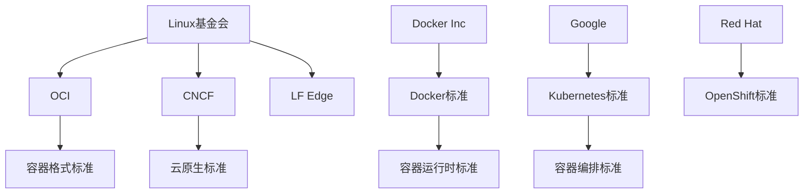
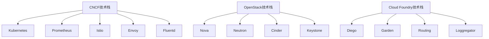
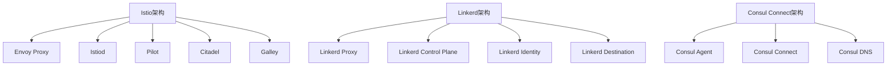
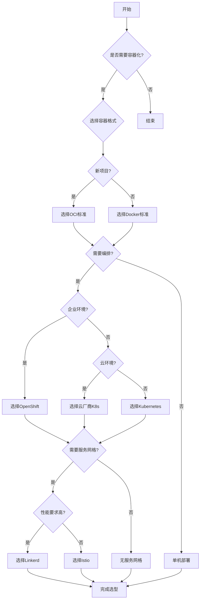

# 容器技术标准对比分析

## 概述

本文档深入对比分析各种容器技术标准，包括OCI、CNCF、Docker、Kubernetes等标准，帮助读者理解不同标准的特点、适用场景和选择建议。

## 目录

- [容器技术标准对比分析](#容器技术标准对比分析)
  - [概述](#概述)
  - [目录](#目录)
  - [标准概览](#标准概览)
    - [主要标准组织](#主要标准组织)
    - [标准分类](#标准分类)
  - [OCI vs Docker标准](#oci-vs-docker标准)
    - [标准对比](#标准对比)
      - [1. 镜像格式对比](#1-镜像格式对比)
      - [2. 运行时对比](#2-运行时对比)
      - [3. 分发协议对比](#3-分发协议对比)
    - [迁移分析](#迁移分析)
      - [从Docker到OCI](#从docker到oci)
      - [兼容性分析](#兼容性分析)
  - [CNCF vs 其他标准](#cncf-vs-其他标准)
    - [标准对比1](#标准对比1)
      - [1. 云原生标准对比](#1-云原生标准对比)
      - [2. 技术栈对比](#2-技术栈对比)
      - [3. 生态系统对比](#3-生态系统对比)
  - [Kubernetes标准对比](#kubernetes标准对比)
    - [发行版对比](#发行版对比)
      - [1. 主要发行版](#1-主要发行版)
      - [2. 功能对比](#2-功能对比)
      - [3. 部署复杂度对比](#3-部署复杂度对比)
  - [服务网格标准对比](#服务网格标准对比)
    - [主要服务网格](#主要服务网格)
      - [1. 功能对比](#1-功能对比)
      - [2. 架构对比](#2-架构对比)
      - [3. 性能对比](#3-性能对比)
  - [监控标准对比](#监控标准对比)
    - [监控技术栈](#监控技术栈)
      - [1. 主要监控方案](#1-主要监控方案)
      - [2. 技术栈对比1](#2-技术栈对比1)
      - [3. 成本对比](#3-成本对比)
  - [安全标准对比](#安全标准对比)
    - [安全技术对比](#安全技术对比)
      - [1. 容器安全方案](#1-容器安全方案)
      - [2. 安全标准对比](#2-安全标准对比)
      - [3. 合规性对比](#3-合规性对比)
  - [选型建议](#选型建议)
    - [1. 标准选择矩阵](#1-标准选择矩阵)
      - [容器格式标准](#容器格式标准)
      - [容器编排标准](#容器编排标准)
      - [服务网格标准](#服务网格标准)
    - [2. 技术选型决策树](#2-技术选型决策树)
    - [3. 实施建议](#3-实施建议)
      - [分阶段实施](#分阶段实施)
  - [FAQ](#faq)
    - [Q1: 如何选择最适合的容器技术标准？](#q1-如何选择最适合的容器技术标准)
    - [Q2: OCI标准和Docker标准可以混用吗？](#q2-oci标准和docker标准可以混用吗)
    - [Q3: 如何评估不同标准的成熟度？](#q3-如何评估不同标准的成熟度)
    - [Q4: 标准迁移的最佳实践是什么？](#q4-标准迁移的最佳实践是什么)
  - [总结](#总结)

## 标准概览

### 主要标准组织



### 标准分类

| 标准类型 | 主要标准 | 版本 | 维护组织 |
|---------|---------|------|---------|
| 容器格式 | OCI Image Spec | v1.0.2 | OCI |
| 容器运行时 | OCI Runtime Spec | v1.0.3 | OCI |
| 容器分发 | OCI Distribution Spec | v1.0.1 | OCI |
| 容器编排 | Kubernetes | v1.28+ | CNCF |
| 服务网格 | Service Mesh Interface | v0.6.0 | CNCF |
| 监控 | Prometheus | v2.45+ | CNCF |
| 安全 | Pod Security Standards | v1.0 | CNCF |

## OCI vs Docker标准

### 标准对比

#### 1. 镜像格式对比

| 特性 | OCI标准 | Docker标准 | 优势分析 |
|------|---------|-------------|----------|
| 标准化程度 | 开放标准 | 专有格式 | OCI更开放 |
| 兼容性 | 跨平台 | 主要Linux | OCI兼容性更好 |
| 功能完整性 | 完整 | 完整 | 功能相当 |
| 社区支持 | 广泛 | 广泛 | 支持度相当 |
| 工具支持 | 丰富 | 丰富 | 工具支持相当 |

#### 2. 运行时对比

```yaml
    # OCI运行时配置
oci_runtime:
  version: "1.0.3"
  process:
    user:
      uid: 1000
      gid: 1000
    capabilities:
      bounding: ["CAP_NET_BIND_SERVICE"]
    noNewPrivileges: true
  linux:
    namespaces:
      - type: "pid"
      - type: "network"
    resources:
      memory:
        limit: 536870912
      cpu:
        shares: 1024

    # Docker运行时配置
docker_runtime:
  version: "1.40"
  process:
    user: "1000:1000"
    capabilities:
      - "NET_BIND_SERVICE"
    privileged: false
  resources:
    memory: "512m"
    cpus: "0.5"
```

#### 3. 分发协议对比

| 特性 | OCI Distribution | Docker Registry API | 优势分析 |
|------|------------------|---------------------|----------|
| API设计 | RESTful | RESTful | 设计相当 |
| 认证机制 | OAuth2/JWT | Docker Auth | OCI更标准 |
| 多架构支持 | 完整 | 完整 | 支持相当 |
| 签名验证 | 支持 | 支持 | 功能相当 |
| 扩展性 | 良好 | 良好 | 扩展性相当 |

### 迁移分析

#### 从Docker到OCI

```bash
    # 使用skopeo迁移镜像
skopeo copy docker://nginx:latest oci:nginx:latest

    # 使用buildah构建OCI镜像
buildah from ubuntu:20.04
buildah config --label "org.opencontainers.image.title=My App" mycontainer
buildah commit mycontainer oci:myapp:latest

    # 使用runc运行OCI容器
runc spec
runc run mycontainer
```

#### 兼容性分析

```yaml
    # 兼容性矩阵
compatibility_matrix:
  docker_to_oci:
    image_format: "完全兼容"
    runtime_config: "部分兼容"
    distribution: "完全兼容"
  
  oci_to_docker:
    image_format: "完全兼容"
    runtime_config: "部分兼容"
    distribution: "完全兼容"
```

## CNCF vs 其他标准

### 标准对比1

#### 1. 云原生标准对比

| 标准 | CNCF | OpenStack | Cloud Foundry | 优势分析 |
|------|------|-----------|---------------|----------|
| 容器支持 | 原生 | 支持 | 支持 | CNCF原生支持 |
| 微服务架构 | 原生 | 支持 | 支持 | CNCF原生支持 |
| 服务网格 | 原生 | 不支持 | 不支持 | CNCF独有优势 |
| 可观测性 | 完整 | 基础 | 基础 | CNCF更完整 |
| 社区活跃度 | 极高 | 中等 | 低 | CNCF最活跃 |

#### 2. 技术栈对比



#### 3. 生态系统对比

| 特性 | CNCF | OpenStack | Cloud Foundry |
|------|------|-----------|---------------|
| 项目数量 | 100+ | 50+ | 20+ |
| 贡献者数量 | 10000+ | 5000+ | 1000+ |
| 企业采用率 | 80%+ | 30%+ | 10%+ |
| 技术成熟度 | 高 | 中 | 中 |
| 学习曲线 | 中 | 高 | 中 |

## Kubernetes标准对比

### 发行版对比

#### 1. 主要发行版

| 发行版 | 维护组织 | 特点 | 适用场景 |
|--------|----------|------|----------|
| Kubernetes | CNCF | 上游版本 | 通用场景 |
| OpenShift | Red Hat | 企业级 | 企业环境 |
| Rancher | SUSE | 易用性 | 中小企业 |
| EKS | AWS | 云原生 | AWS环境 |
| GKE | Google | 云原生 | GCP环境 |
| AKS | Microsoft | 云原生 | Azure环境 |

#### 2. 功能对比

```yaml
    # 功能对比矩阵
feature_comparison:
  kubernetes:
    basic_features: "完整"
    advanced_features: "完整"
    security: "基础"
    monitoring: "基础"
    storage: "基础"
  
  openshift:
    basic_features: "完整"
    advanced_features: "增强"
    security: "增强"
    monitoring: "增强"
    storage: "增强"
  
  rancher:
    basic_features: "完整"
    advanced_features: "简化"
    security: "基础"
    monitoring: "增强"
    storage: "基础"
```

#### 3. 部署复杂度对比

| 发行版 | 部署复杂度 | 维护复杂度 | 学习曲线 | 社区支持 |
|--------|------------|------------|----------|----------|
| Kubernetes | 高 | 高 | 高 | 极高 |
| OpenShift | 中 | 中 | 中 | 高 |
| Rancher | 低 | 低 | 低 | 中 |
| EKS | 低 | 低 | 中 | 高 |
| GKE | 低 | 低 | 中 | 高 |
| AKS | 低 | 低 | 中 | 高 |

## 服务网格标准对比

### 主要服务网格

#### 1. 功能对比

| 特性 | Istio | Linkerd | Consul Connect | 优势分析 |
|------|-------|---------|----------------|----------|
| 流量管理 | 完整 | 基础 | 完整 | Istio功能最全 |
| 安全 | 完整 | 基础 | 完整 | Istio和Consul相当 |
| 可观测性 | 完整 | 完整 | 基础 | Istio和Linkerd相当 |
| 性能 | 中等 | 高 | 高 | Linkerd性能最好 |
| 易用性 | 低 | 高 | 中 | Linkerd最易用 |

#### 2. 架构对比



#### 3. 性能对比

| 指标 | Istio | Linkerd | Consul Connect |
|------|-------|---------|----------------|
| 延迟增加 | 2-5ms | 1-2ms | 1-3ms |
| CPU使用率 | 10-20% | 5-10% | 8-15% |
| 内存使用 | 50-100MB | 20-50MB | 30-80MB |
| 吞吐量影响 | 5-10% | 2-5% | 3-8% |

## 监控标准对比

### 监控技术栈

#### 1. 主要监控方案

| 方案 | Prometheus | Grafana | Jaeger | 优势分析 |
|------|------------|---------|--------|----------|
| 指标收集 | 原生 | 支持 | 不支持 | Prometheus专业 |
| 可视化 | 基础 | 专业 | 不支持 | Grafana最专业 |
| 链路追踪 | 不支持 | 支持 | 专业 | Jaeger最专业 |
| 告警 | 完整 | 支持 | 不支持 | Prometheus完整 |
| 存储 | 时序数据库 | 多种 | 时序数据库 | 各有优势 |

#### 2. 技术栈对比1

```yaml
    # 监控技术栈对比
monitoring_stack_comparison:
  prometheus_stack:
    metrics: "Prometheus"
    visualization: "Grafana"
    alerting: "Alertmanager"
    service_discovery: "Prometheus"
    storage: "Prometheus TSDB"
  
  elastic_stack:
    metrics: "Metricbeat"
    visualization: "Kibana"
    alerting: "Watcher"
    service_discovery: "Beats"
    storage: "Elasticsearch"
  
  datadog_stack:
    metrics: "Datadog Agent"
    visualization: "Datadog Dashboard"
    alerting: "Datadog Alerts"
    service_discovery: "Datadog"
    storage: "Datadog Cloud"
```

#### 3. 成本对比

| 方案 | 开源成本 | 商业成本 | 维护成本 | 总成本 |
|------|----------|----------|----------|--------|
| Prometheus Stack | 低 | 无 | 中 | 低 |
| Elastic Stack | 低 | 中 | 高 | 中 |
| Datadog | 无 | 高 | 低 | 高 |
| New Relic | 无 | 高 | 低 | 高 |

## 安全标准对比

### 安全技术对比

#### 1. 容器安全方案

| 方案 | Falco | Twistlock | Aqua | 优势分析 |
|------|-------|-----------|------|----------|
| 运行时监控 | 完整 | 完整 | 完整 | 功能相当 |
| 镜像扫描 | 不支持 | 完整 | 完整 | Twistlock和Aqua更全 |
| 网络策略 | 基础 | 完整 | 完整 | Twistlock和Aqua更全 |
| 合规检查 | 基础 | 完整 | 完整 | Twistlock和Aqua更全 |
| 成本 | 开源 | 商业 | 商业 | Falco成本最低 |

#### 2. 安全标准对比

```yaml
    # 安全标准对比
security_standards_comparison:
  pod_security_standards:
    privileged: "拒绝"
    baseline: "限制"
    restricted: "严格"
  
  network_policies:
    default_deny: "推荐"
    explicit_allow: "推荐"
    namespace_isolation: "推荐"
  
  rbac:
    least_privilege: "推荐"
    role_based: "推荐"
    service_account: "推荐"
```

#### 3. 合规性对比

| 标准 | CIS | NIST | ISO 27001 | 优势分析 |
|------|-----|------|-----------|----------|
| 容器安全 | 完整 | 基础 | 基础 | CIS最专业 |
| 云安全 | 完整 | 完整 | 基础 | CIS和NIST相当 |
| 数据保护 | 基础 | 完整 | 完整 | NIST和ISO更全 |
| 审计要求 | 基础 | 完整 | 完整 | NIST和ISO更全 |

## 选型建议

### 1. 标准选择矩阵

#### 容器格式标准

| 场景 | 推荐标准 | 理由 |
|------|----------|------|
| 新项目 | OCI | 开放标准，兼容性好 |
| 现有Docker项目 | Docker | 迁移成本低 |
| 多平台部署 | OCI | 跨平台兼容性最好 |
| 企业环境 | OCI | 标准化程度高 |

#### 容器编排标准

| 场景 | 推荐标准 | 理由 |
|------|----------|------|
| 云原生应用 | Kubernetes | 生态最完整 |
| 企业环境 | OpenShift | 企业级特性丰富 |
| 中小企业 | Rancher | 易用性最好 |
| 云环境 | 云厂商K8s | 集成度最高 |

#### 服务网格标准

| 场景 | 推荐标准 | 理由 |
|------|----------|------|
| 复杂微服务 | Istio | 功能最完整 |
| 性能敏感 | Linkerd | 性能最好 |
| 简单场景 | Consul Connect | 易用性最好 |
| 多云环境 | Istio | 支持最好 |

### 2. 技术选型决策树



### 3. 实施建议

#### 分阶段实施

```yaml
    # 实施阶段规划
implementation_phases:
  phase1:
    name: "基础容器化"
    duration: "1-2个月"
    tasks:
      - "选择容器格式标准"
      - "实施基础容器化"
      - "建立CI/CD流程"
  
  phase2:
    name: "容器编排"
    duration: "2-3个月"
    tasks:
      - "选择编排平台"
      - "实施容器编排"
      - "建立监控体系"
  
  phase3:
    name: "服务网格"
    duration: "2-4个月"
    tasks:
      - "选择服务网格"
      - "实施服务网格"
      - "优化性能和安全"
  
  phase4:
    name: "高级特性"
    duration: "3-6个月"
    tasks:
      - "实施高级监控"
      - "完善安全策略"
      - "优化运维流程"
```

## FAQ

### Q1: 如何选择最适合的容器技术标准？

**A**: 选择标准需要考虑以下因素：

- **项目需求**：根据项目特点选择合适标准
- **团队技能**：考虑团队的技术能力
- **成本预算**：评估实施和维护成本
- **长期规划**：考虑技术的长期发展
- **生态系统**：选择生态最完善的标准

### Q2: OCI标准和Docker标准可以混用吗？

**A**: 可以混用，但需要注意：

- **兼容性**：大部分情况下兼容性良好
- **工具支持**：确保工具支持两种标准
- **迁移成本**：混用可能增加维护成本
- **标准化**：建议逐步统一到OCI标准

### Q3: 如何评估不同标准的成熟度？

**A**: 评估标准成熟度的方法：

- **版本稳定性**：查看版本发布频率和稳定性
- **社区活跃度**：评估社区贡献和讨论活跃度
- **企业采用率**：了解企业采用情况
- **工具支持**：评估第三方工具支持情况
- **文档质量**：评估文档完整性和质量

### Q4: 标准迁移的最佳实践是什么？

**A**: 标准迁移最佳实践：

- **评估现状**：全面评估现有技术栈
- **制定计划**：制定详细的迁移计划
- **分阶段实施**：分阶段进行迁移
- **充分测试**：在每个阶段进行充分测试
- **文档更新**：及时更新相关文档
- **团队培训**：对团队进行新标准培训

---

## 总结

容器技术标准对比分析显示：

1. **OCI标准**：在容器格式和运行时方面具有优势
2. **CNCF标准**：在云原生技术栈方面最完整
3. **Kubernetes标准**：在容器编排方面是事实标准
4. **服务网格标准**：Istio功能最全，Linkerd性能最好
5. **监控标准**：Prometheus在指标收集方面最专业
6. **安全标准**：需要根据具体需求选择合适方案

选择合适的标准需要综合考虑项目需求、团队能力、成本预算和长期规划，建议采用分阶段实施的方式逐步完善技术栈。
