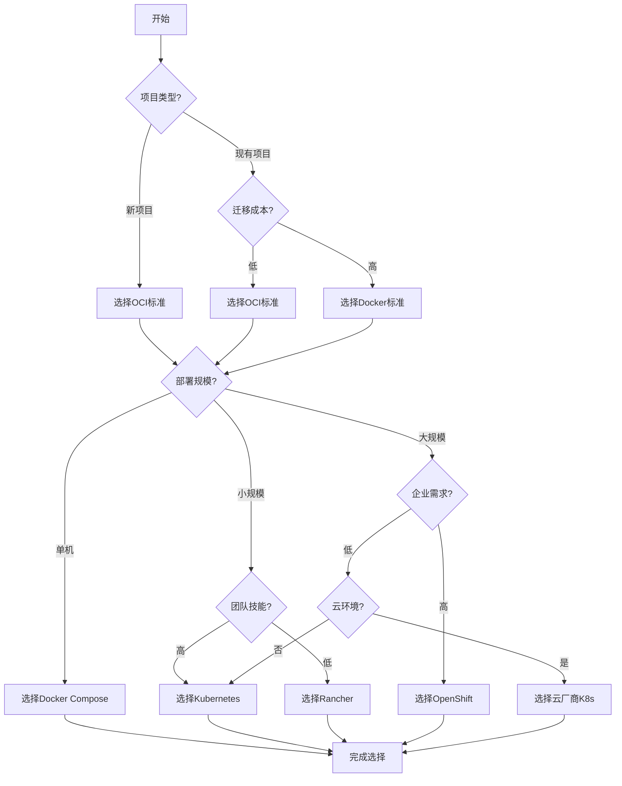
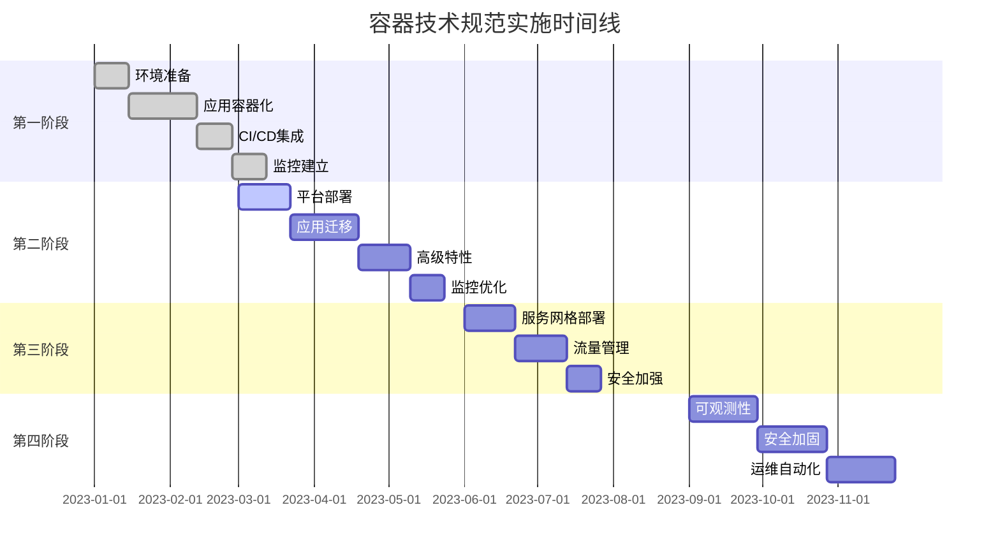

# 容器技术规范实施指南

## 概述

本文档提供容器技术规范的实施指南，包括标准选择、实施策略、最佳实践和故障排除，帮助组织成功实施容器技术标准。

## 目录

- [容器技术规范实施指南](#容器技术规范实施指南)
  - [概述](#概述)
  - [实施准备](#实施准备)
    - [1. 现状评估](#1-现状评估)
      - [技术栈评估](#技术栈评估)
- [技术栈评估模板](#技术栈评估模板)
      - [组织能力评估](#组织能力评估)
- [组织能力评估](#组织能力评估)
    - [2. 需求分析](#2-需求分析)
      - [业务需求](#业务需求)
- [业务需求分析](#业务需求分析)
      - [技术需求](#技术需求)
- [技术需求分析](#技术需求分析)
  - [标准选择策略](#标准选择策略)
    - [1. 选择决策矩阵](#1-选择决策矩阵)
      - [容器格式标准选择](#容器格式标准选择)
- [容器格式标准选择矩阵](#容器格式标准选择矩阵)
      - [编排平台选择](#编排平台选择)
- [编排平台选择矩阵](#编排平台选择矩阵)
    - [2. 选择决策树](#2-选择决策树)
  - [实施路线图](#实施路线图)
    - [1. 分阶段实施计划](#1-分阶段实施计划)
      - [第一阶段：基础容器化（1-3个月）](#第一阶段基础容器化1-3个月)
- [第一阶段实施计划](#第一阶段实施计划)
      - [第二阶段：容器编排（2-4个月）](#第二阶段容器编排2-4个月)
- [第二阶段实施计划](#第二阶段实施计划)
      - [第三阶段：服务网格（2-3个月）](#第三阶段服务网格2-3个月)
- [第三阶段实施计划](#第三阶段实施计划)
      - [第四阶段：高级特性（3-6个月）](#第四阶段高级特性3-6个月)
- [第四阶段实施计划](#第四阶段实施计划)
    - [2. 里程碑规划](#2-里程碑规划)
  - [技术实施](#技术实施)
    - [1. 容器化实施](#1-容器化实施)
      - [Dockerfile最佳实践](#dockerfile最佳实践)
- [多阶段构建示例](#多阶段构建示例)
- [设置工作目录](#设置工作目录)
- [复制依赖文件](#复制依赖文件)
- [下载依赖](#下载依赖)
- [复制源代码](#复制源代码)
- [构建应用](#构建应用)
- [运行阶段](#运行阶段)
- [安装必要的包](#安装必要的包)
- [设置时区](#设置时区)
- [创建非root用户](#创建非root用户)
- [设置工作目录](#设置工作目录)
- [从构建阶段复制二进制文件](#从构建阶段复制二进制文件)
- [更改文件所有者](#更改文件所有者)
- [切换到非root用户](#切换到非root用户)
- [暴露端口](#暴露端口)
- [健康检查](#健康检查)
- [启动应用](#启动应用)
      - [镜像优化策略](#镜像优化策略)
- [镜像优化脚本](#镜像优化脚本)
- [1. 使用多阶段构建](#1-使用多阶段构建)
- [2. 使用.dockerignore](#2-使用dockerignore)
- [3. 镜像大小分析](#3-镜像大小分析)
- [4. 镜像安全扫描](#4-镜像安全扫描)
- [5. 镜像签名](#5-镜像签名)
    - [2. Kubernetes实施](#2-kubernetes实施)
      - [部署清单模板](#部署清单模板)
- [Deployment模板](#deployment模板)
      - [服务配置](#服务配置)
- [Service模板](#service模板)
- [Ingress模板](#ingress模板)
    - [3. 服务网格实施](#3-服务网格实施)
      - [Istio配置](#istio配置)
- [Istio Gateway](#istio-gateway)
- [VirtualService](#virtualservice)
- [DestinationRule](#destinationrule)
  - [安全实施](#安全实施)
    - [1. 镜像安全](#1-镜像安全)
      - [镜像扫描](#镜像扫描)
- [镜像安全扫描脚本](#镜像安全扫描脚本)
- [使用Trivy扫描镜像](#使用trivy扫描镜像)
- [使用Clair扫描镜像](#使用clair扫描镜像)
- [使用Anchore扫描镜像](#使用anchore扫描镜像)
- [生成安全报告](#生成安全报告)
      - [镜像签名](#镜像签名)
- [使用Cosign签名镜像](#使用cosign签名镜像)
- [验证镜像签名](#验证镜像签名)
- [使用Notary签名镜像](#使用notary签名镜像)
    - [2. 运行时安全](#2-运行时安全)
      - [Pod安全策略](#pod安全策略)
- [PodSecurityPolicy](#podsecuritypolicy)
- [PodSecurityStandard](#podsecuritystandard)
      - [网络策略](#网络策略)
- [默认拒绝所有入站流量](#默认拒绝所有入站流量)
- [默认拒绝所有出站流量](#默认拒绝所有出站流量)
- [允许特定服务通信](#允许特定服务通信)
    - [3. 运行时监控](#3-运行时监控)
      - [Falco配置](#falco配置)
- [Falco规则](#falco规则)
  - [监控实施](#监控实施)
    - [1. 指标监控](#1-指标监控)
      - [Prometheus配置](#prometheus配置)
- [Prometheus配置](#prometheus配置)
      - [告警规则](#告警规则)
- [告警规则](#告警规则)
    - [2. 日志监控](#2-日志监控)
      - [Fluentd配置](#fluentd配置)
- [Fluentd配置](#fluentd配置)
    - [3. 链路追踪](#3-链路追踪)
      - [Jaeger配置](#jaeger配置)
- [Jaeger配置](#jaeger配置)
  - [运维实施](#运维实施)
    - [1. 自动化部署](#1-自动化部署)
      - [GitOps配置](#gitops配置)
- [ArgoCD应用配置](#argocd应用配置)
      - [Helm Chart](#helm-chart)
- [values.yaml](#valuesyaml)
    - [2. 备份恢复](#2-备份恢复)
      - [备份脚本](#备份脚本)
- [Kubernetes备份脚本](#kubernetes备份脚本)
- [设置变量](#设置变量)
- [创建备份目录](#创建备份目录)
- [备份命名空间资源](#备份命名空间资源)
- [备份ConfigMap](#备份configmap)
- [备份Secret](#备份secret)
- [备份PVC](#备份pvc)
- [备份网络策略](#备份网络策略)
- [压缩备份](#压缩备份)
- [清理旧备份（保留30天）](#清理旧备份保留30天)
    - [3. 灾难恢复](#3-灾难恢复)
      - [恢复脚本](#恢复脚本)
- [Kubernetes恢复脚本](#kubernetes恢复脚本)
- [设置变量](#设置变量)
- [解压备份](#解压备份)
- [创建命名空间](#创建命名空间)
- [恢复资源](#恢复资源)
- [清理临时目录](#清理临时目录)
  - [最佳实践](#最佳实践)
    - [1. 实施最佳实践](#1-实施最佳实践)
      - [团队协作](#团队协作)
- [团队协作最佳实践](#团队协作最佳实践)
      - [文档管理](#文档管理)
- [文档管理最佳实践](#文档管理最佳实践)
    - [2. 性能优化](#2-性能优化)
      - [资源优化](#资源优化)
- [资源优化配置](#资源优化配置)
      - [网络优化](#网络优化)
- [网络优化配置](#网络优化配置)
    - [3. 成本优化](#3-成本优化)
      - [资源使用优化](#资源使用优化)
- [资源使用分析脚本](#资源使用分析脚本)
- [分析Pod资源使用](#分析pod资源使用)
- [分析节点资源使用](#分析节点资源使用)
- [生成资源使用报告](#生成资源使用报告)
  - [故障排除](#故障排除)
    - [1. 常见问题](#1-常见问题)
      - [容器启动失败](#容器启动失败)
- [检查Pod状态](#检查pod状态)
- [检查容器日志](#检查容器日志)
- [检查事件](#检查事件)
- [检查资源使用](#检查资源使用)
      - [网络连接问题](#网络连接问题)
- [检查服务状态](#检查服务状态)
- [检查端点](#检查端点)
- [检查网络策略](#检查网络策略)
- [测试网络连接](#测试网络连接)
      - [存储问题](#存储问题)
- [检查PVC状态](#检查pvc状态)
- [检查PV状态](#检查pv状态)
- [检查存储类](#检查存储类)
    - [2. 诊断工具](#2-诊断工具)
      - [调试工具](#调试工具)
- [使用kubectl debug](#使用kubectl-debug)
- [使用kubectl exec](#使用kubectl-exec)
- [使用kubectl port-forward](#使用kubectl-port-forward)
- [使用kubectl proxy](#使用kubectl-proxy)
      - [监控工具](#监控工具)
- [使用kubectl top](#使用kubectl-top)
- [使用kubectl get](#使用kubectl-get)
- [使用kubectl describe](#使用kubectl-describe)
  - [FAQ](#faq)
    - [Q1: 如何选择合适的容器技术标准？](#q1-如何选择合适的容器技术标准)
    - [Q2: 实施容器技术标准需要多长时间？](#q2-实施容器技术标准需要多长时间)
    - [Q3: 如何确保实施的成功？](#q3-如何确保实施的成功)
    - [Q4: 实施过程中遇到问题如何解决？](#q4-实施过程中遇到问题如何解决)
  - [总结](#总结)

- [容器技术规范实施指南](#容器技术规范实施指南)
  - [概述](#概述)
  - [实施准备](#实施准备)
    - [1. 现状评估](#1-现状评估)
      - [技术栈评估](#技术栈评估)
- [技术栈评估模板](#技术栈评估模板)
      - [组织能力评估](#组织能力评估)
- [组织能力评估](#组织能力评估)
    - [2. 需求分析](#2-需求分析)
      - [业务需求](#业务需求)
- [业务需求分析](#业务需求分析)
      - [技术需求](#技术需求)
- [技术需求分析](#技术需求分析)
  - [标准选择策略](#标准选择策略)
    - [1. 选择决策矩阵](#1-选择决策矩阵)
      - [容器格式标准选择](#容器格式标准选择)
- [容器格式标准选择矩阵](#容器格式标准选择矩阵)
      - [编排平台选择](#编排平台选择)
- [编排平台选择矩阵](#编排平台选择矩阵)
    - [2. 选择决策树](#2-选择决策树)
  - [实施路线图](#实施路线图)
    - [1. 分阶段实施计划](#1-分阶段实施计划)
      - [第一阶段：基础容器化（1-3个月）](#第一阶段基础容器化1-3个月)
- [第一阶段实施计划](#第一阶段实施计划)
      - [第二阶段：容器编排（2-4个月）](#第二阶段容器编排2-4个月)
- [第二阶段实施计划](#第二阶段实施计划)
      - [第三阶段：服务网格（2-3个月）](#第三阶段服务网格2-3个月)
- [第三阶段实施计划](#第三阶段实施计划)
      - [第四阶段：高级特性（3-6个月）](#第四阶段高级特性3-6个月)
- [第四阶段实施计划](#第四阶段实施计划)
    - [2. 里程碑规划](#2-里程碑规划)
  - [技术实施](#技术实施)
    - [1. 容器化实施](#1-容器化实施)
      - [Dockerfile最佳实践](#dockerfile最佳实践)
- [多阶段构建示例](#多阶段构建示例)
- [设置工作目录](#设置工作目录)
- [复制依赖文件](#复制依赖文件)
- [下载依赖](#下载依赖)
- [复制源代码](#复制源代码)
- [构建应用](#构建应用)
- [运行阶段](#运行阶段)
- [安装必要的包](#安装必要的包)
- [设置时区](#设置时区)
- [创建非root用户](#创建非root用户)
- [设置工作目录](#设置工作目录)
- [从构建阶段复制二进制文件](#从构建阶段复制二进制文件)
- [更改文件所有者](#更改文件所有者)
- [切换到非root用户](#切换到非root用户)
- [暴露端口](#暴露端口)
- [健康检查](#健康检查)
- [启动应用](#启动应用)
      - [镜像优化策略](#镜像优化策略)
- [镜像优化脚本](#镜像优化脚本)
- [1. 使用多阶段构建](#1-使用多阶段构建)
- [2. 使用.dockerignore](#2-使用dockerignore)
- [3. 镜像大小分析](#3-镜像大小分析)
- [4. 镜像安全扫描](#4-镜像安全扫描)
- [5. 镜像签名](#5-镜像签名)
    - [2. Kubernetes实施](#2-kubernetes实施)
      - [部署清单模板](#部署清单模板)
- [Deployment模板](#deployment模板)
      - [服务配置](#服务配置)
- [Service模板](#service模板)
- [Ingress模板](#ingress模板)
    - [3. 服务网格实施](#3-服务网格实施)
      - [Istio配置](#istio配置)
- [Istio Gateway](#istio-gateway)
- [VirtualService](#virtualservice)
- [DestinationRule](#destinationrule)
  - [安全实施](#安全实施)
    - [1. 镜像安全](#1-镜像安全)
      - [镜像扫描](#镜像扫描)
- [镜像安全扫描脚本](#镜像安全扫描脚本)
- [使用Trivy扫描镜像](#使用trivy扫描镜像)
- [使用Clair扫描镜像](#使用clair扫描镜像)
- [使用Anchore扫描镜像](#使用anchore扫描镜像)
- [生成安全报告](#生成安全报告)
      - [镜像签名](#镜像签名)
- [使用Cosign签名镜像](#使用cosign签名镜像)
- [验证镜像签名](#验证镜像签名)
- [使用Notary签名镜像](#使用notary签名镜像)
    - [2. 运行时安全](#2-运行时安全)
      - [Pod安全策略](#pod安全策略)
- [PodSecurityPolicy](#podsecuritypolicy)
- [PodSecurityStandard](#podsecuritystandard)
      - [网络策略](#网络策略)
- [默认拒绝所有入站流量](#默认拒绝所有入站流量)
- [默认拒绝所有出站流量](#默认拒绝所有出站流量)
- [允许特定服务通信](#允许特定服务通信)
    - [3. 运行时监控](#3-运行时监控)
      - [Falco配置](#falco配置)
- [Falco规则](#falco规则)
  - [监控实施](#监控实施)
    - [1. 指标监控](#1-指标监控)
      - [Prometheus配置](#prometheus配置)
- [Prometheus配置](#prometheus配置)
      - [告警规则](#告警规则)
- [告警规则](#告警规则)
    - [2. 日志监控](#2-日志监控)
      - [Fluentd配置](#fluentd配置)
- [Fluentd配置](#fluentd配置)
    - [3. 链路追踪](#3-链路追踪)
      - [Jaeger配置](#jaeger配置)
- [Jaeger配置](#jaeger配置)
  - [运维实施](#运维实施)
    - [1. 自动化部署](#1-自动化部署)
      - [GitOps配置](#gitops配置)
- [ArgoCD应用配置](#argocd应用配置)
      - [Helm Chart](#helm-chart)
- [values.yaml](#valuesyaml)
    - [2. 备份恢复](#2-备份恢复)
      - [备份脚本](#备份脚本)
- [Kubernetes备份脚本](#kubernetes备份脚本)
- [设置变量](#设置变量)
- [创建备份目录](#创建备份目录)
- [备份命名空间资源](#备份命名空间资源)
- [备份ConfigMap](#备份configmap)
- [备份Secret](#备份secret)
- [备份PVC](#备份pvc)
- [备份网络策略](#备份网络策略)
- [压缩备份](#压缩备份)
- [清理旧备份（保留30天）](#清理旧备份保留30天)
    - [3. 灾难恢复](#3-灾难恢复)
      - [恢复脚本](#恢复脚本)
- [Kubernetes恢复脚本](#kubernetes恢复脚本)
- [设置变量](#设置变量)
- [解压备份](#解压备份)
- [创建命名空间](#创建命名空间)
- [恢复资源](#恢复资源)
- [清理临时目录](#清理临时目录)
  - [最佳实践](#最佳实践)
    - [1. 实施最佳实践](#1-实施最佳实践)
      - [团队协作](#团队协作)
- [团队协作最佳实践](#团队协作最佳实践)
      - [文档管理](#文档管理)
- [文档管理最佳实践](#文档管理最佳实践)
    - [2. 性能优化](#2-性能优化)
      - [资源优化](#资源优化)
- [资源优化配置](#资源优化配置)
      - [网络优化](#网络优化)
- [网络优化配置](#网络优化配置)
    - [3. 成本优化](#3-成本优化)
      - [资源使用优化](#资源使用优化)
- [资源使用分析脚本](#资源使用分析脚本)
- [分析Pod资源使用](#分析pod资源使用)
- [分析节点资源使用](#分析节点资源使用)
- [生成资源使用报告](#生成资源使用报告)
  - [故障排除](#故障排除)
    - [1. 常见问题](#1-常见问题)
      - [容器启动失败](#容器启动失败)
- [检查Pod状态](#检查pod状态)
- [检查容器日志](#检查容器日志)
- [检查事件](#检查事件)
- [检查资源使用](#检查资源使用)
      - [网络连接问题](#网络连接问题)
- [检查服务状态](#检查服务状态)
- [检查端点](#检查端点)
- [检查网络策略](#检查网络策略)
- [测试网络连接](#测试网络连接)
      - [存储问题](#存储问题)
- [检查PVC状态](#检查pvc状态)
- [检查PV状态](#检查pv状态)
- [检查存储类](#检查存储类)
    - [2. 诊断工具](#2-诊断工具)
      - [调试工具](#调试工具)
- [使用kubectl debug](#使用kubectl-debug)
- [使用kubectl exec](#使用kubectl-exec)
- [使用kubectl port-forward](#使用kubectl-port-forward)
- [使用kubectl proxy](#使用kubectl-proxy)
      - [监控工具](#监控工具)
- [使用kubectl top](#使用kubectl-top)
- [使用kubectl get](#使用kubectl-get)
- [使用kubectl describe](#使用kubectl-describe)
  - [FAQ](#faq)
    - [Q1: 如何选择合适的容器技术标准？](#q1-如何选择合适的容器技术标准)
    - [Q2: 实施容器技术标准需要多长时间？](#q2-实施容器技术标准需要多长时间)
    - [Q3: 如何确保实施的成功？](#q3-如何确保实施的成功)
    - [Q4: 实施过程中遇到问题如何解决？](#q4-实施过程中遇到问题如何解决)
  - [总结](#总结)

- [实施准备](#实施准备)
- [标准选择策略](#标准选择策略)
- [实施路线图](#实施路线图)
- [技术实施](#技术实施)
- [安全实施](#安全实施)
- [监控实施](#监控实施)
- [运维实施](#运维实施)
- [最佳实践](#最佳实践)
- [故障排除](#故障排除)
- [FAQ](#faq)

## 实施准备

### 1. 现状评估

#### 技术栈评估

```yaml
# 技术栈评估模板
technology_assessment:
  current_state:
    containerization:
      level: "none|basic|advanced"
      tools: ["docker", "podman", "kubernetes"]
      coverage: "percentage"
    
    orchestration:
      level: "none|basic|advanced"
      platform: "kubernetes|openshift|rancher"
      features: ["scaling", "networking", "storage"]
    
    monitoring:
      level: "none|basic|advanced"
      tools: ["prometheus", "grafana", "jaeger"]
      coverage: "percentage"
    
    security:
      level: "none|basic|advanced"
      tools: ["falco", "twistlock", "aqua"]
      policies: ["network", "rbac", "pod-security"]
```

#### 组织能力评估

```yaml
# 组织能力评估
organizational_assessment:
  technical_skills:
    container_knowledge: "beginner|intermediate|advanced"
    kubernetes_experience: "none|basic|expert"
    devops_practices: "traditional|agile|devops"
  
  process_maturity:
    ci_cd: "manual|automated|advanced"
    testing: "manual|automated|advanced"
    deployment: "manual|automated|advanced"
  
  infrastructure:
    cloud_readiness: "on-premise|hybrid|cloud-native"
    automation_level: "manual|scripted|infrastructure-as-code"
    monitoring_coverage: "basic|comprehensive|advanced"
```

### 2. 需求分析

#### 业务需求

```yaml
# 业务需求分析
business_requirements:
  scalability:
    current_scale: "number_of_applications"
    target_scale: "number_of_applications"
    growth_rate: "percentage_per_year"
  
  performance:
    current_performance: "response_time"
    target_performance: "response_time"
    sla_requirements: "availability_percentage"
  
  security:
    compliance_requirements: ["pci-dss", "sox", "gdpr"]
    data_classification: "public|internal|confidential|restricted"
    access_control: "role-based|attribute-based"
  
  cost:
    current_cost: "monthly_cost"
    target_cost: "monthly_cost"
    roi_expectation: "timeframe"
```

#### 技术需求

```yaml
# 技术需求分析
technical_requirements:
  application_types:
    - type: "web_application"
      count: 10
      complexity: "simple|medium|complex"
    - type: "microservice"
      count: 5
      complexity: "simple|medium|complex"
    - type: "batch_job"
      count: 3
      complexity: "simple|medium|complex"
  
  infrastructure_requirements:
    compute: "cpu_cores|memory_gb|storage_tb"
    network: "bandwidth|latency|security"
    storage: "capacity|performance|durability"
  
  integration_requirements:
    external_systems: ["database", "message_queue", "api_gateway"]
    internal_systems: ["ldap", "monitoring", "logging"]
    third_party: ["saas", "paas", "iaas"]
```

## 标准选择策略

### 1. 选择决策矩阵

#### 容器格式标准选择

```yaml
# 容器格式标准选择矩阵
container_format_selection:
  criteria:
    - name: "标准化程度"
      weight: 0.3
      oci: 9
      docker: 7
    - name: "兼容性"
      weight: 0.25
      oci: 9
      docker: 8
    - name: "工具支持"
      weight: 0.2
      oci: 8
      docker: 9
    - name: "迁移成本"
      weight: 0.15
      oci: 7
      docker: 9
    - name: "社区支持"
      weight: 0.1
      oci: 8
      docker: 9
  
  recommendation: "基于加权评分选择"
```

#### 编排平台选择

```yaml
# 编排平台选择矩阵
orchestration_platform_selection:
  criteria:
    - name: "功能完整性"
      weight: 0.25
      kubernetes: 9
      openshift: 9
      rancher: 7
      cloud_k8s: 8
    - name: "易用性"
      weight: 0.2
      kubernetes: 6
      openshift: 7
      rancher: 9
      cloud_k8s: 8
    - name: "企业特性"
      weight: 0.2
      kubernetes: 7
      openshift: 9
      rancher: 6
      cloud_k8s: 7
    - name: "成本"
      weight: 0.15
      kubernetes: 8
      openshift: 6
      rancher: 7
      cloud_k8s: 5
    - name: "社区支持"
      weight: 0.1
      kubernetes: 9
      openshift: 8
      rancher: 6
      cloud_k8s: 8
    - name: "学习曲线"
      weight: 0.1
      kubernetes: 5
      openshift: 6
      rancher: 8
      cloud_k8s: 7
```

### 2. 选择决策树



## 实施路线图

### 1. 分阶段实施计划

#### 第一阶段：基础容器化（1-3个月）

```yaml
# 第一阶段实施计划
phase1_basic_containerization:
  duration: "1-3个月"
  objectives:
    - "建立容器化基础"
    - "实施基础CI/CD"
    - "建立监控体系"
  
  tasks:
    - name: "环境准备"
      duration: "2周"
      tasks:
        - "安装Docker/Podman"
        - "配置镜像仓库"
        - "建立开发环境"
    
    - name: "应用容器化"
      duration: "4周"
      tasks:
        - "选择基础镜像"
        - "编写Dockerfile"
        - "优化镜像大小"
        - "测试容器运行"
    
    - name: "CI/CD集成"
      duration: "2周"
      tasks:
        - "集成容器构建"
        - "自动化测试"
        - "镜像推送"
        - "部署验证"
    
    - name: "监控建立"
      duration: "2周"
      tasks:
        - "部署Prometheus"
        - "配置Grafana"
        - "设置告警规则"
        - "建立日志收集"
  
  deliverables:
    - "容器化应用"
    - "CI/CD流水线"
    - "监控仪表板"
    - "操作文档"
```

#### 第二阶段：容器编排（2-4个月）

```yaml
# 第二阶段实施计划
phase2_container_orchestration:
  duration: "2-4个月"
  objectives:
    - "实施容器编排"
    - "建立服务发现"
    - "实现自动扩缩容"
  
  tasks:
    - name: "平台部署"
      duration: "3周"
      tasks:
        - "选择编排平台"
        - "部署Kubernetes集群"
        - "配置网络插件"
        - "设置存储类"
    
    - name: "应用迁移"
      duration: "4周"
      tasks:
        - "编写Kubernetes清单"
        - "配置服务发现"
        - "设置健康检查"
        - "测试应用部署"
    
    - name: "高级特性"
      duration: "3周"
      tasks:
        - "配置HPA"
        - "设置网络策略"
        - "实施RBAC"
        - "配置资源配额"
    
    - name: "监控优化"
      duration: "2周"
      tasks:
        - "部署集群监控"
        - "配置告警规则"
        - "建立日志聚合"
        - "性能调优"
  
  deliverables:
    - "Kubernetes集群"
    - "应用部署清单"
    - "监控仪表板"
    - "运维手册"
```

#### 第三阶段：服务网格（2-3个月）

```yaml
# 第三阶段实施计划
phase3_service_mesh:
  duration: "2-3个月"
  objectives:
    - "实施服务网格"
    - "实现流量管理"
    - "加强安全控制"
  
  tasks:
    - name: "服务网格部署"
      duration: "3周"
      tasks:
        - "选择服务网格"
        - "部署Istio/Linkerd"
        - "配置Sidecar注入"
        - "测试服务通信"
    
    - name: "流量管理"
      duration: "3周"
      tasks:
        - "配置路由规则"
        - "实现负载均衡"
        - "设置故障转移"
        - "测试流量分割"
    
    - name: "安全加强"
      duration: "2周"
      tasks:
        - "配置mTLS"
        - "设置授权策略"
        - "实施网络隔离"
        - "安全测试"
  
  deliverables:
    - "服务网格部署"
    - "流量管理配置"
    - "安全策略"
    - "性能报告"
```

#### 第四阶段：高级特性（3-6个月）

```yaml
# 第四阶段实施计划
phase4_advanced_features:
  duration: "3-6个月"
  objectives:
    - "实施高级监控"
    - "完善安全体系"
    - "优化运维流程"
  
  tasks:
    - name: "可观测性"
      duration: "4周"
      tasks:
        - "部署链路追踪"
        - "配置分布式监控"
        - "建立告警体系"
        - "性能分析"
    
    - name: "安全加固"
      duration: "4周"
      tasks:
        - "实施镜像扫描"
        - "配置运行时安全"
        - "设置合规检查"
        - "安全审计"
    
    - name: "运维自动化"
      duration: "4周"
      tasks:
        - "实施GitOps"
        - "自动化备份"
        - "灾难恢复"
        - "容量规划"
  
  deliverables:
    - "完整监控体系"
    - "安全合规报告"
    - "自动化运维"
    - "最佳实践文档"
```

### 2. 里程碑规划



## 技术实施

### 1. 容器化实施

#### Dockerfile最佳实践

```dockerfile
# 多阶段构建示例
FROM golang:1.19-alpine AS builder

# 设置工作目录
WORKDIR /app

# 复制依赖文件
COPY go.mod go.sum ./

# 下载依赖
RUN go mod download

# 复制源代码
COPY . .

# 构建应用
RUN CGO_ENABLED=0 GOOS=linux go build -a -installsuffix cgo -o main .

# 运行阶段
FROM alpine:latest

# 安装必要的包
RUN apk --no-cache add ca-certificates tzdata

# 设置时区
ENV TZ=Asia/Shanghai

# 创建非root用户
RUN addgroup -g 1000 appgroup && \
    adduser -D -s /bin/sh -u 1000 -G appgroup appuser

# 设置工作目录
WORKDIR /app

# 从构建阶段复制二进制文件
COPY --from=builder /app/main .

# 更改文件所有者
RUN chown -R appuser:appgroup /app

# 切换到非root用户
USER appuser

# 暴露端口
EXPOSE 8080

# 健康检查
HEALTHCHECK --interval=30s --timeout=3s --start-period=5s --retries=3 \
  CMD curl -f http://localhost:8080/health || exit 1

# 启动应用
CMD ["./main"]
```

#### 镜像优化策略

```bash
# 镜像优化脚本
#!/bin/bash

# 1. 使用多阶段构建
docker build -t myapp:latest .

# 2. 使用.dockerignore
cat > .dockerignore << EOF
node_modules
npm-debug.log
.git
.gitignore
README.md
.env
.nyc_output
coverage
.nyc_output
.coverage
EOF

# 3. 镜像大小分析
docker history myapp:latest

# 4. 镜像安全扫描
docker run --rm -v /var/run/docker.sock:/var/run/docker.sock \
  aquasec/trivy image myapp:latest

# 5. 镜像签名
cosign sign --key cosign.key myapp:latest
```

### 2. Kubernetes实施

#### 部署清单模板

```yaml
# Deployment模板
apiVersion: apps/v1
kind: Deployment
metadata:
  name: myapp-deployment
  namespace: production
  labels:
    app: myapp
    version: v1.0.0
    component: backend
spec:
  replicas: 3
  selector:
    matchLabels:
      app: myapp
  template:
    metadata:
      labels:
        app: myapp
        version: v1.0.0
      annotations:
        prometheus.io/scrape: "true"
        prometheus.io/port: "8080"
        prometheus.io/path: "/metrics"
    spec:
      serviceAccountName: myapp-service-account
      securityContext:
        runAsNonRoot: true
        runAsUser: 1000
        runAsGroup: 1000
        fsGroup: 1000
      containers:
      - name: myapp
        image: myregistry/myapp:v1.0.0
        ports:
        - containerPort: 8080
          name: http
          protocol: TCP
        env:
        - name: ENVIRONMENT
          value: "production"
        - name: LOG_LEVEL
          value: "info"
        resources:
          requests:
            memory: "128Mi"
            cpu: "250m"
          limits:
            memory: "256Mi"
            cpu: "500m"
        livenessProbe:
          httpGet:
            path: /health
            port: 8080
          initialDelaySeconds: 30
          periodSeconds: 10
          timeoutSeconds: 5
          failureThreshold: 3
        readinessProbe:
          httpGet:
            path: /ready
            port: 8080
          initialDelaySeconds: 5
          periodSeconds: 5
          timeoutSeconds: 3
          failureThreshold: 3
        volumeMounts:
        - name: config-volume
          mountPath: /app/config
          readOnly: true
        - name: logs-volume
          mountPath: /app/logs
      volumes:
      - name: config-volume
        configMap:
          name: myapp-config
      - name: logs-volume
        emptyDir: {}
      nodeSelector:
        kubernetes.io/os: linux
        node-type: worker
      tolerations:
      - key: "app"
        operator: "Equal"
        value: "myapp"
        effect: "NoSchedule"
      affinity:
        podAntiAffinity:
          preferredDuringSchedulingIgnoredDuringExecution:
          - weight: 100
            podAffinityTerm:
              labelSelector:
                matchExpressions:
                - key: app
                  operator: In
                  values:
                  - myapp
              topologyKey: kubernetes.io/hostname
```

#### 服务配置

```yaml
# Service模板
apiVersion: v1
kind: Service
metadata:
  name: myapp-service
  namespace: production
  labels:
    app: myapp
spec:
  selector:
    app: myapp
  ports:
  - name: http
    port: 80
    targetPort: 8080
    protocol: TCP
  type: ClusterIP
---
# Ingress模板
apiVersion: networking.k8s.io/v1
kind: Ingress
metadata:
  name: myapp-ingress
  namespace: production
  annotations:
    nginx.ingress.kubernetes.io/rewrite-target: /
    nginx.ingress.kubernetes.io/ssl-redirect: "true"
    nginx.ingress.kubernetes.io/rate-limit: "100"
    nginx.ingress.kubernetes.io/rate-limit-window: "1m"
spec:
  tls:
  - hosts:
    - myapp.example.com
    secretName: myapp-tls
  rules:
  - host: myapp.example.com
    http:
      paths:
      - path: /
        pathType: Prefix
        backend:
          service:
            name: myapp-service
            port:
              number: 80
```

### 3. 服务网格实施

#### Istio配置

```yaml
# Istio Gateway
apiVersion: networking.istio.io/v1alpha3
kind: Gateway
metadata:
  name: myapp-gateway
  namespace: production
spec:
  selector:
    istio: ingressgateway
  servers:
  - port:
      number: 80
      name: http
      protocol: HTTP
    hosts:
    - myapp.example.com
    tls:
      httpsRedirect: true
  - port:
      number: 443
      name: https
      protocol: HTTPS
    hosts:
    - myapp.example.com
    tls:
      mode: SIMPLE
      credentialName: myapp-tls
---
# VirtualService
apiVersion: networking.istio.io/v1alpha3
kind: VirtualService
metadata:
  name: myapp-virtual-service
  namespace: production
spec:
  hosts:
  - myapp.example.com
  gateways:
  - myapp-gateway
  http:
  - match:
    - uri:
        prefix: /api
    route:
    - destination:
        host: myapp-service
        port:
          number: 80
    fault:
      delay:
        percentage:
          value: 0.1
        fixedDelay: 5s
    retries:
      attempts: 3
      perTryTimeout: 2s
    timeout: 10s
---
# DestinationRule
apiVersion: networking.istio.io/v1alpha3
kind: DestinationRule
metadata:
  name: myapp-destination-rule
  namespace: production
spec:
  host: myapp-service
  trafficPolicy:
    loadBalancer:
      simple: ROUND_ROBIN
    connectionPool:
      tcp:
        maxConnections: 10
      http:
        http1MaxPendingRequests: 10
        maxRequestsPerConnection: 2
    circuitBreaker:
      consecutiveErrors: 3
      interval: 30s
      baseEjectionTime: 30s
```

## 安全实施

### 1. 镜像安全

#### 镜像扫描

```bash
# 镜像安全扫描脚本
#!/bin/bash

# 使用Trivy扫描镜像
trivy image --severity HIGH,CRITICAL myregistry/myapp:latest

# 使用Clair扫描镜像
clair-scanner --ip 192.168.1.100 myregistry/myapp:latest

# 使用Anchore扫描镜像
anchore-cli image add myregistry/myapp:latest
anchore-cli image vuln myregistry/myapp:latest all

# 生成安全报告
trivy image --format json --output myapp-security-report.json myregistry/myapp:latest
```

#### 镜像签名

```bash
# 使用Cosign签名镜像
cosign generate-key-pair
cosign sign --key cosign.key myregistry/myapp:latest

# 验证镜像签名
cosign verify --key cosign.pub myregistry/myapp:latest

# 使用Notary签名镜像
docker trust key generate myapp-key
docker trust signer add --key myapp-key.pub myapp-signer myregistry/myapp:latest
docker trust sign myregistry/myapp:latest
```

### 2. 运行时安全

#### Pod安全策略

```yaml
# PodSecurityPolicy
apiVersion: policy/v1beta1
kind: PodSecurityPolicy
metadata:
  name: restricted-psp
spec:
  privileged: false
  allowPrivilegeEscalation: false
  requiredDropCapabilities:
    - ALL
  volumes:
    - 'configMap'
    - 'emptyDir'
    - 'projected'
    - 'secret'
    - 'downwardAPI'
    - 'persistentVolumeClaim'
  runAsUser:
    rule: 'MustRunAsNonRoot'
  seLinux:
    rule: 'RunAsAny'
  fsGroup:
    rule: 'RunAsAny'
---
# PodSecurityStandard
apiVersion: v1
kind: Namespace
metadata:
  name: production
  labels:
    pod-security.kubernetes.io/enforce: restricted
    pod-security.kubernetes.io/audit: restricted
    pod-security.kubernetes.io/warn: restricted
```

#### 网络策略

```yaml
# 默认拒绝所有入站流量
apiVersion: networking.k8s.io/v1
kind: NetworkPolicy
metadata:
  name: deny-all-ingress
  namespace: production
spec:
  podSelector: {}
  policyTypes:
  - Ingress
  ingress: []
---
# 默认拒绝所有出站流量
apiVersion: networking.k8s.io/v1
kind: NetworkPolicy
metadata:
  name: deny-all-egress
  namespace: production
spec:
  podSelector: {}
  policyTypes:
  - Egress
  egress: []
---
# 允许特定服务通信
apiVersion: networking.k8s.io/v1
kind: NetworkPolicy
metadata:
  name: allow-frontend-to-backend
  namespace: production
spec:
  podSelector:
    matchLabels:
      app: backend
  policyTypes:
  - Ingress
  ingress:
  - from:
    - namespaceSelector:
        matchLabels:
          name: frontend
    - podSelector:
        matchLabels:
          app: frontend
    ports:
    - protocol: TCP
      port: 8080
```

### 3. 运行时监控

#### Falco配置

```yaml
# Falco规则
- rule: Unauthorized process in container
  desc: Detect unauthorized processes in containers
  condition: >
    spawned_process and
    container and
    not proc.name in (nginx, apache, redis, postgres, mysql, node, python, java, go)
  output: >
    Unauthorized process in container (user=%user.name command=%proc.cmdline container_id=%container.id container_name=%container.name)
  priority: WARNING
  tags: [container, process]

- rule: Container running in privileged mode
  desc: Detect containers running in privileged mode
  condition: >
    container and
    container.privileged = true
  output: >
    Container running in privileged mode (container_id=%container.id container_name=%container.name)
  priority: CRITICAL
  tags: [container, privileged]
```

## 监控实施

### 1. 指标监控

#### Prometheus配置

```yaml
# Prometheus配置
global:
  scrape_interval: 15s
  evaluation_interval: 15s

rule_files:
  - "alert_rules.yml"

alerting:
  alertmanagers:
    - static_configs:
        - targets:
          - alertmanager:9093

scrape_configs:
  - job_name: 'kubernetes-pods'
    kubernetes_sd_configs:
    - role: pod
    relabel_configs:
    - source_labels: [__meta_kubernetes_pod_annotation_prometheus_io_scrape]
      action: keep
      regex: true
    - source_labels: [__meta_kubernetes_pod_annotation_prometheus_io_path]
      action: replace
      target_label: __metrics_path__
      regex: (.+)
    - source_labels: [__address__, __meta_kubernetes_pod_annotation_prometheus_io_port]
      action: replace
      regex: ([^:]+)(?::\d+)?;(\d+)
      replacement: $1:$2
      target_label: __address__
    - action: labelmap
      regex: __meta_kubernetes_pod_label_(.+)
    - source_labels: [__meta_kubernetes_namespace]
      action: replace
      target_label: kubernetes_namespace
    - source_labels: [__meta_kubernetes_pod_name]
      action: replace
      target_label: kubernetes_pod_name
```

#### 告警规则

```yaml
# 告警规则
groups:
- name: kubernetes.rules
  rules:
  - alert: HighErrorRate
    expr: rate(http_requests_total{status=~"5.."}[5m]) > 0.1
    for: 5m
    labels:
      severity: critical
    annotations:
      summary: "High error rate detected"
      description: "Error rate is {{ $value }} errors per second"

  - alert: HighMemoryUsage
    expr: (container_memory_usage_bytes / container_spec_memory_limit_bytes) > 0.8
    for: 5m
    labels:
      severity: warning
    annotations:
      summary: "High memory usage detected"
      description: "Memory usage is {{ $value }}% of limit"

  - alert: PodCrashLooping
    expr: rate(kube_pod_container_status_restarts_total[15m]) > 0
    for: 5m
    labels:
      severity: critical
    annotations:
      summary: "Pod is crash looping"
      description: "Pod {{ $labels.pod }} is restarting frequently"
```

### 2. 日志监控

#### Fluentd配置

```yaml
# Fluentd配置
apiVersion: v1
kind: ConfigMap
metadata:
  name: fluentd-config
  namespace: kube-system
data:
  fluent.conf: |
    <source>
      @type tail
      path /var/log/containers/*.log
      pos_file /var/log/fluentd-containers.log.pos
      tag kubernetes.*
      format json
      time_key time
      time_format %Y-%m-%dT%H:%M:%S.%NZ
    </source>
    
    <filter kubernetes.**>
      @type kubernetes_metadata
    </filter>
    
    <match kubernetes.**>
      @type elasticsearch
      host elasticsearch.logging.svc.cluster.local
      port 9200
      index_name fluentd
      type_name fluentd
    </match>
```

### 3. 链路追踪

#### Jaeger配置

```yaml
# Jaeger配置
apiVersion: apps/v1
kind: Deployment
metadata:
  name: jaeger
  namespace: monitoring
spec:
  replicas: 1
  selector:
    matchLabels:
      app: jaeger
  template:
    metadata:
      labels:
        app: jaeger
    spec:
      containers:
      - name: jaeger
        image: jaegertracing/all-in-one:1.40
        ports:
        - containerPort: 16686
          name: ui
        - containerPort: 14268
          name: http
        env:
        - name: COLLECTOR_OTLP_ENABLED
          value: "true"
        resources:
          requests:
            memory: "128Mi"
            cpu: "100m"
          limits:
            memory: "256Mi"
            cpu: "200m"
```

## 运维实施

### 1. 自动化部署

#### GitOps配置

```yaml
# ArgoCD应用配置
apiVersion: argoproj.io/v1alpha1
kind: Application
metadata:
  name: myapp
  namespace: argocd
spec:
  project: default
  source:
    repoURL: https://github.com/myorg/myapp
    targetRevision: HEAD
    path: k8s
  destination:
    server: https://kubernetes.default.svc
    namespace: production
  syncPolicy:
    automated:
      prune: true
      selfHeal: true
    syncOptions:
    - CreateNamespace=true
    - PrunePropagationPolicy=foreground
    - PruneLast=true
```

#### Helm Chart

```yaml
# values.yaml
replicaCount: 3

image:
  repository: myregistry/myapp
  tag: "v1.0.0"
  pullPolicy: IfNotPresent

service:
  type: ClusterIP
  port: 80
  targetPort: 8080

ingress:
  enabled: true
  className: "nginx"
  annotations:
    nginx.ingress.kubernetes.io/rewrite-target: /
  hosts:
    - host: myapp.example.com
      paths:
        - path: /
          pathType: Prefix
  tls:
    - secretName: myapp-tls
      hosts:
        - myapp.example.com

resources:
  limits:
    cpu: 500m
    memory: 256Mi
  requests:
    cpu: 250m
    memory: 128Mi

autoscaling:
  enabled: true
  minReplicas: 3
  maxReplicas: 10
  targetCPUUtilizationPercentage: 80
  targetMemoryUtilizationPercentage: 80

nodeSelector: {}
tolerations: []
affinity: {}
```

### 2. 备份恢复

#### 备份脚本

```bash
#!/bin/bash
# Kubernetes备份脚本

# 设置变量
BACKUP_DIR="/backup/kubernetes"
DATE=$(date +%Y%m%d_%H%M%S)
NAMESPACE="production"

# 创建备份目录
mkdir -p $BACKUP_DIR/$DATE

# 备份命名空间资源
kubectl get all -n $NAMESPACE -o yaml > $BACKUP_DIR/$DATE/namespace-resources.yaml

# 备份ConfigMap
kubectl get configmaps -n $NAMESPACE -o yaml > $BACKUP_DIR/$DATE/configmaps.yaml

# 备份Secret
kubectl get secrets -n $NAMESPACE -o yaml > $BACKUP_DIR/$DATE/secrets.yaml

# 备份PVC
kubectl get pvc -n $NAMESPACE -o yaml > $BACKUP_DIR/$DATE/pvcs.yaml

# 备份网络策略
kubectl get networkpolicies -n $NAMESPACE -o yaml > $BACKUP_DIR/$DATE/networkpolicies.yaml

# 压缩备份
tar -czf $BACKUP_DIR/$DATE.tar.gz -C $BACKUP_DIR $DATE
rm -rf $BACKUP_DIR/$DATE

# 清理旧备份（保留30天）
find $BACKUP_DIR -name "*.tar.gz" -mtime +30 -delete

echo "Backup completed: $BACKUP_DIR/$DATE.tar.gz"
```

### 3. 灾难恢复

#### 恢复脚本

```bash
#!/bin/bash
# Kubernetes恢复脚本

# 设置变量
BACKUP_FILE=$1
NAMESPACE="production"

if [ -z "$BACKUP_FILE" ]; then
    echo "Usage: $0 <backup_file>"
    exit 1
fi

# 解压备份
BACKUP_DIR=$(mktemp -d)
tar -xzf $BACKUP_FILE -C $BACKUP_DIR

# 创建命名空间
kubectl create namespace $NAMESPACE --dry-run=client -o yaml | kubectl apply -f -

# 恢复资源
kubectl apply -f $BACKUP_DIR/*/namespace-resources.yaml
kubectl apply -f $BACKUP_DIR/*/configmaps.yaml
kubectl apply -f $BACKUP_DIR/*/secrets.yaml
kubectl apply -f $BACKUP_DIR/*/pvcs.yaml
kubectl apply -f $BACKUP_DIR/*/networkpolicies.yaml

# 清理临时目录
rm -rf $BACKUP_DIR

echo "Restore completed for namespace: $NAMESPACE"
```

## 最佳实践

### 1. 实施最佳实践

#### 团队协作

```yaml
# 团队协作最佳实践
team_collaboration:
  roles:
    platform_engineer:
      responsibilities:
        - "基础设施管理"
        - "平台维护"
        - "安全策略"
      skills:
        - "Kubernetes"
        - "Docker"
        - "监控工具"
    
    devops_engineer:
      responsibilities:
        - "CI/CD流水线"
        - "自动化部署"
        - "运维脚本"
      skills:
        - "Jenkins/GitLab CI"
        - "Helm"
        - "脚本编程"
    
    security_engineer:
      responsibilities:
        - "安全策略"
        - "合规检查"
        - "漏洞管理"
      skills:
        - "容器安全"
        - "网络安全"
        - "合规标准"
  
  processes:
    code_review:
      - "所有代码变更需要代码审查"
      - "安全相关变更需要安全团队审查"
      - "基础设施变更需要平台团队审查"
    
    deployment:
      - "使用GitOps进行部署"
      - "分环境部署（dev/staging/prod）"
      - "自动化测试和验证"
    
    monitoring:
      - "建立完整的监控体系"
      - "设置合理的告警阈值"
      - "定期进行性能分析"
```

#### 文档管理

```yaml
# 文档管理最佳实践
documentation_management:
  types:
    architecture_docs:
      - "系统架构图"
      - "技术选型说明"
      - "部署架构"
    
    operational_docs:
      - "运维手册"
      - "故障处理指南"
      - "备份恢复流程"
    
    development_docs:
      - "开发规范"
      - "API文档"
      - "测试指南"
  
  maintenance:
    - "定期更新文档"
    - "版本控制管理"
    - "团队协作编写"
    - "定期审查验证"
```

### 2. 性能优化

#### 资源优化

```yaml
# 资源优化配置
resource_optimization:
  requests:
    cpu: "250m"
    memory: "128Mi"
  
  limits:
    cpu: "500m"
    memory: "256Mi"
  
  hpa:
    minReplicas: 3
    maxReplicas: 10
    targetCPUUtilizationPercentage: 70
    targetMemoryUtilizationPercentage: 80
  
  vpa:
    updateMode: "Auto"
    resourcePolicy:
      cpu:
        min: "100m"
        max: "1"
      memory:
        min: "64Mi"
        max: "512Mi"
```

#### 网络优化

```yaml
# 网络优化配置
network_optimization:
  service_mesh:
    sidecar_injection: "automatic"
    traffic_policy:
      loadBalancer:
        simple: ROUND_ROBIN
      connectionPool:
        tcp:
          maxConnections: 10
        http:
          http1MaxPendingRequests: 10
  
  cni:
    type: "calico"
    ipam:
      type: "calico-ipam"
    policy:
      type: "k8s"
```

### 3. 成本优化

#### 资源使用优化

```bash
# 资源使用分析脚本
#!/bin/bash

# 分析Pod资源使用
kubectl top pods --all-namespaces --sort-by=cpu
kubectl top pods --all-namespaces --sort-by=memory

# 分析节点资源使用
kubectl top nodes

# 生成资源使用报告
kubectl get pods --all-namespaces -o json | jq -r '
  .items[] | 
  select(.spec.containers[0].resources.requests) |
  "\(.metadata.namespace) \(.metadata.name) \(.spec.containers[0].resources.requests.cpu) \(.spec.containers[0].resources.requests.memory)"
' > resource-usage-report.txt
```

## 故障排除

### 1. 常见问题

#### 容器启动失败

```bash
# 检查Pod状态
kubectl get pods -n production
kubectl describe pod <pod-name> -n production

# 检查容器日志
kubectl logs <pod-name> -n production
kubectl logs <pod-name> -n production --previous

# 检查事件
kubectl get events -n production --sort-by='.lastTimestamp'

# 检查资源使用
kubectl top pod <pod-name> -n production
```

#### 网络连接问题

```bash
# 检查服务状态
kubectl get svc -n production
kubectl describe svc <service-name> -n production

# 检查端点
kubectl get endpoints -n production

# 检查网络策略
kubectl get networkpolicies -n production
kubectl describe networkpolicy <policy-name> -n production

# 测试网络连接
kubectl run test-pod --image=nicolaka/netshoot --rm -it -- /bin/bash
```

#### 存储问题

```bash
# 检查PVC状态
kubectl get pvc -n production
kubectl describe pvc <pvc-name> -n production

# 检查PV状态
kubectl get pv
kubectl describe pv <pv-name>

# 检查存储类
kubectl get storageclass
kubectl describe storageclass <storageclass-name>
```

### 2. 诊断工具

#### 调试工具

```bash
# 使用kubectl debug
kubectl debug <pod-name> -n production -it --image=nicolaka/netshoot

# 使用kubectl exec
kubectl exec -it <pod-name> -n production -- /bin/bash

# 使用kubectl port-forward
kubectl port-forward <pod-name> -n production 8080:8080

# 使用kubectl proxy
kubectl proxy --port=8001
```

#### 监控工具

```bash
# 使用kubectl top
kubectl top nodes
kubectl top pods --all-namespaces

# 使用kubectl get
kubectl get all --all-namespaces
kubectl get events --all-namespaces

# 使用kubectl describe
kubectl describe node <node-name>
kubectl describe pod <pod-name> -n production
```

## FAQ

### Q1: 如何选择合适的容器技术标准？

**A**: 选择标准需要考虑以下因素：

- **项目需求**：根据项目特点选择合适标准
- **团队技能**：考虑团队的技术能力
- **成本预算**：评估实施和维护成本
- **长期规划**：考虑技术的长期发展
- **生态系统**：选择生态最完善的标准

### Q2: 实施容器技术标准需要多长时间？

**A**: 实施时间取决于多个因素：

- **项目规模**：大型项目需要更长时间
- **团队经验**：经验丰富的团队实施更快
- **复杂度**：复杂的技术栈需要更多时间
- **资源投入**：充足的资源可以加快实施
- **一般时间**：基础实施1-3个月，完整实施6-12个月

### Q3: 如何确保实施的成功？

**A**: 确保成功的关键因素：

- **充分准备**：做好现状评估和需求分析
- **分阶段实施**：采用分阶段实施策略
- **团队培训**：对团队进行充分培训
- **持续监控**：建立完善的监控体系
- **经验总结**：及时总结经验和教训

### Q4: 实施过程中遇到问题如何解决？

**A**: 问题解决方法：

- **文档查阅**：查阅相关技术文档
- **社区求助**：在技术社区寻求帮助
- **专家咨询**：咨询相关技术专家
- **工具诊断**：使用专业诊断工具
- **经验分享**：与同行分享经验

---

## 总结

容器技术规范实施是一个复杂的过程，需要：

1. **充分准备**：做好现状评估、需求分析和标准选择
2. **分阶段实施**：采用分阶段实施策略，逐步完善
3. **技术实施**：按照最佳实践进行技术实施
4. **安全实施**：建立完善的安全体系
5. **监控实施**：建立全面的监控体系
6. **运维实施**：实现自动化运维
7. **持续优化**：持续优化和改进

通过系统性的实施方法，可以成功建立符合标准的容器技术体系，为组织的数字化转型提供强有力的技术支撑。
