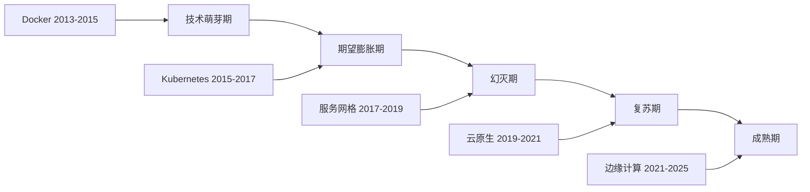
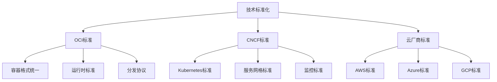
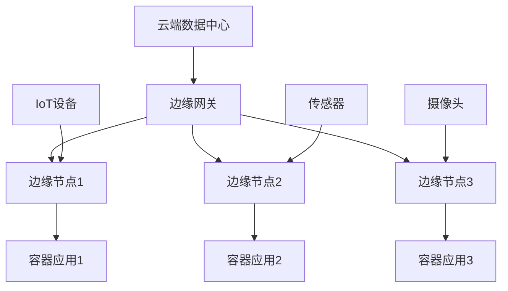

    # 2025年容器技术趋势分析

## 概述

本文档深入分析2025年容器技术的发展趋势，包括技术演进、市场变化、新兴技术和未来展望，为技术决策和投资提供参考。

## 目录

- [2025年容器技术趋势分析](#2025年容器技术趋势分析)
  - [概述](#概述)
  - [技术演进趋势](#技术演进趋势)
    - [1. 容器技术成熟度](#1-容器技术成熟度)
      - [技术成熟度曲线](#技术成熟度曲线)
      - [2025年技术成熟度](#2025年技术成熟度)
    - [2. 技术架构演进](#2-技术架构演进)
      - [从单体到微服务到云原生](#从单体到微服务到云原生)
- [架构演进阶段](#架构演进阶段)
    - [3. 技术标准化趋势](#3-技术标准化趋势)
      - [标准统一化](#标准统一化)
  - [市场发展趋势](#市场发展趋势)
    - [1. 市场规模预测](#1-市场规模预测)
      - [全球容器市场规模](#全球容器市场规模)
- [容器市场规模预测（2025年）](#容器市场规模预测2025年)
    - [2. 企业采用趋势](#2-企业采用趋势)
      - [企业采用阶段](#企业采用阶段)
- [企业采用阶段分析](#企业采用阶段分析)
    - [3. 技术投资趋势](#3-技术投资趋势)
      - [投资重点领域](#投资重点领域)
- [技术投资重点](#技术投资重点)
  - [新兴技术分析](#新兴技术分析)
    - [1. WebAssembly (WASM)](#1-webassembly-wasm)
      - [技术特点](#技术特点)
- [WebAssembly技术分析](#webassembly技术分析)
      - [容器与WASM对比](#容器与wasm对比)
    - [2. 边缘计算容器](#2-边缘计算容器)
      - [边缘容器特点](#边缘容器特点)
- [边缘计算容器分析](#边缘计算容器分析)
      - [边缘容器架构](#边缘容器架构)
    - [3. 无服务器容器](#3-无服务器容器)
      - [无服务器容器模式](#无服务器容器模式)
- [无服务器容器分析](#无服务器容器分析)
  - [技术融合趋势](#技术融合趋势)
    - [1. AI/ML与容器融合](#1-aiml与容器融合)
      - [AI容器化趋势](#ai容器化趋势)
- [AI/ML容器化分析](#aiml容器化分析)
    - [2. 区块链与容器融合](#2-区块链与容器融合)
      - [区块链容器化](#区块链容器化)
- [区块链容器化分析](#区块链容器化分析)
    - [3. IoT与容器融合](#3-iot与容器融合)
      - [IoT容器化](#iot容器化)
- [IoT容器化分析](#iot容器化分析)
  - [安全发展趋势](#安全发展趋势)
    - [1. 零信任安全](#1-零信任安全)
      - [零信任容器安全](#零信任容器安全)
- [零信任容器安全分析](#零信任容器安全分析)
    - [2. 供应链安全](#2-供应链安全)
      - [容器供应链安全](#容器供应链安全)
- [容器供应链安全分析](#容器供应链安全分析)
    - [3. 合规性要求](#3-合规性要求)
      - [容器合规性](#容器合规性)
- [容器合规性分析](#容器合规性分析)
  - [性能优化趋势](#性能优化趋势)
    - [1. 容器性能优化](#1-容器性能优化)
      - [性能优化技术](#性能优化技术)
- [容器性能优化分析](#容器性能优化分析)
    - [2. 存储性能优化](#2-存储性能优化)
      - [容器存储优化](#容器存储优化)
- [容器存储性能优化](#容器存储性能优化)
    - [3. 网络性能优化](#3-网络性能优化)
      - [容器网络优化](#容器网络优化)
- [容器网络性能优化](#容器网络性能优化)
  - [生态发展趋势](#生态发展趋势)
    - [1. 开源生态](#1-开源生态)
      - [开源项目发展](#开源项目发展)
- [开源生态分析](#开源生态分析)
    - [2. 商业生态](#2-商业生态)
      - [商业产品发展](#商业产品发展)
- [商业生态分析](#商业生态分析)
    - [3. 社区发展](#3-社区发展)
      - [社区活跃度](#社区活跃度)
- [社区发展分析](#社区发展分析)
  - [投资建议](#投资建议)
    - [1. 技术投资优先级](#1-技术投资优先级)
      - [投资建议矩阵](#投资建议矩阵)
- [技术投资建议](#技术投资建议)
    - [2. 投资策略](#2-投资策略)
      - [分阶段投资](#分阶段投资)
- [投资策略](#投资策略)
    - [3. 风险控制](#3-风险控制)
      - [投资风险分析](#投资风险分析)
- [投资风险分析](#投资风险分析)
  - [FAQ](#faq)
    - [Q1: 2025年容器技术的主要趋势是什么？](#q1-2025年容器技术的主要趋势是什么)
    - [Q2: 企业应该如何规划容器技术投资？](#q2-企业应该如何规划容器技术投资)
    - [Q3: 新兴技术如WebAssembly对容器技术有什么影响？](#q3-新兴技术如webassembly对容器技术有什么影响)
    - [Q4: 如何应对容器技术的快速变化？](#q4-如何应对容器技术的快速变化)
  - [总结](#总结)

- [2025年容器技术趋势分析](#2025年容器技术趋势分析)
  - [概述](#概述)
  - [技术演进趋势](#技术演进趋势)
    - [1. 容器技术成熟度](#1-容器技术成熟度)
      - [技术成熟度曲线](#技术成熟度曲线)
      - [2025年技术成熟度](#2025年技术成熟度)
    - [2. 技术架构演进](#2-技术架构演进)
      - [从单体到微服务到云原生](#从单体到微服务到云原生)
- [架构演进阶段](#架构演进阶段)
    - [3. 技术标准化趋势](#3-技术标准化趋势)
      - [标准统一化](#标准统一化)
  - [市场发展趋势](#市场发展趋势)
    - [1. 市场规模预测](#1-市场规模预测)
      - [全球容器市场规模](#全球容器市场规模)
- [容器市场规模预测（2025年）](#容器市场规模预测2025年)
    - [2. 企业采用趋势](#2-企业采用趋势)
      - [企业采用阶段](#企业采用阶段)
- [企业采用阶段分析](#企业采用阶段分析)
    - [3. 技术投资趋势](#3-技术投资趋势)
      - [投资重点领域](#投资重点领域)
- [技术投资重点](#技术投资重点)
  - [新兴技术分析](#新兴技术分析)
    - [1. WebAssembly (WASM)](#1-webassembly-wasm)
      - [技术特点](#技术特点)
- [WebAssembly技术分析](#webassembly技术分析)
      - [容器与WASM对比](#容器与wasm对比)
    - [2. 边缘计算容器](#2-边缘计算容器)
      - [边缘容器特点](#边缘容器特点)
- [边缘计算容器分析](#边缘计算容器分析)
      - [边缘容器架构](#边缘容器架构)
    - [3. 无服务器容器](#3-无服务器容器)
      - [无服务器容器模式](#无服务器容器模式)
- [无服务器容器分析](#无服务器容器分析)
  - [技术融合趋势](#技术融合趋势)
    - [1. AI/ML与容器融合](#1-aiml与容器融合)
      - [AI容器化趋势](#ai容器化趋势)
- [AI/ML容器化分析](#aiml容器化分析)
    - [2. 区块链与容器融合](#2-区块链与容器融合)
      - [区块链容器化](#区块链容器化)
- [区块链容器化分析](#区块链容器化分析)
    - [3. IoT与容器融合](#3-iot与容器融合)
      - [IoT容器化](#iot容器化)
- [IoT容器化分析](#iot容器化分析)
  - [安全发展趋势](#安全发展趋势)
    - [1. 零信任安全](#1-零信任安全)
      - [零信任容器安全](#零信任容器安全)
- [零信任容器安全分析](#零信任容器安全分析)
    - [2. 供应链安全](#2-供应链安全)
      - [容器供应链安全](#容器供应链安全)
- [容器供应链安全分析](#容器供应链安全分析)
    - [3. 合规性要求](#3-合规性要求)
      - [容器合规性](#容器合规性)
- [容器合规性分析](#容器合规性分析)
  - [性能优化趋势](#性能优化趋势)
    - [1. 容器性能优化](#1-容器性能优化)
      - [性能优化技术](#性能优化技术)
- [容器性能优化分析](#容器性能优化分析)
    - [2. 存储性能优化](#2-存储性能优化)
      - [容器存储优化](#容器存储优化)
- [容器存储性能优化](#容器存储性能优化)
    - [3. 网络性能优化](#3-网络性能优化)
      - [容器网络优化](#容器网络优化)
- [容器网络性能优化](#容器网络性能优化)
  - [生态发展趋势](#生态发展趋势)
    - [1. 开源生态](#1-开源生态)
      - [开源项目发展](#开源项目发展)
- [开源生态分析](#开源生态分析)
    - [2. 商业生态](#2-商业生态)
      - [商业产品发展](#商业产品发展)
- [商业生态分析](#商业生态分析)
    - [3. 社区发展](#3-社区发展)
      - [社区活跃度](#社区活跃度)
- [社区发展分析](#社区发展分析)
  - [投资建议](#投资建议)
    - [1. 技术投资优先级](#1-技术投资优先级)
      - [投资建议矩阵](#投资建议矩阵)
- [技术投资建议](#技术投资建议)
    - [2. 投资策略](#2-投资策略)
      - [分阶段投资](#分阶段投资)
- [投资策略](#投资策略)
    - [3. 风险控制](#3-风险控制)
      - [投资风险分析](#投资风险分析)
- [投资风险分析](#投资风险分析)
  - [FAQ](#faq)
    - [Q1: 2025年容器技术的主要趋势是什么？](#q1-2025年容器技术的主要趋势是什么)
    - [Q2: 企业应该如何规划容器技术投资？](#q2-企业应该如何规划容器技术投资)
    - [Q3: 新兴技术如WebAssembly对容器技术有什么影响？](#q3-新兴技术如webassembly对容器技术有什么影响)
    - [Q4: 如何应对容器技术的快速变化？](#q4-如何应对容器技术的快速变化)
  - [总结](#总结)

- [技术演进趋势](#技术演进趋势)
- [市场发展趋势](#市场发展趋势)
- [新兴技术分析](#新兴技术分析)
- [技术融合趋势](#技术融合趋势)
- [安全发展趋势](#安全发展趋势)
- [性能优化趋势](#性能优化趋势)
- [生态发展趋势](#生态发展趋势)
- [投资建议](#投资建议)
- [FAQ](#faq)

## 技术演进趋势

### 1. 容器技术成熟度

#### 技术成熟度曲线



#### 2025年技术成熟度

| 技术领域 | 成熟度 | 采用率 | 发展趋势 |
|---------|--------|--------|----------|
| 容器基础技术 | 成熟 | 90%+ | 标准化、优化 |
| Kubernetes | 成熟 | 80%+ | 企业级、多集群 |
| 服务网格 | 复苏 | 40%+ | 简化、性能优化 |
| 边缘计算 | 萌芽 | 20%+ | 快速增长 |
| WebAssembly | 萌芽 | 10%+ | 技术突破 |
| 无服务器容器 | 复苏 | 30%+ | 混合模式 |

### 2. 技术架构演进

#### 从单体到微服务到云原生

```yaml
    # 架构演进阶段
architecture_evolution:
  stage1_monolith:
    period: "2010-2015"
    characteristics:
      - "单体应用"
      - "垂直扩展"
      - "紧耦合"
    technologies: ["Java EE", "Spring", "传统数据库"]
  
  stage2_microservices:
    period: "2015-2020"
    characteristics:
      - "微服务架构"
      - "水平扩展"
      - "松耦合"
    technologies: ["Docker", "Kubernetes", "API Gateway"]
  
  stage3_cloud_native:
    period: "2020-2025"
    characteristics:
      - "云原生架构"
      - "弹性扩展"
      - "服务网格"
    technologies: ["Istio", "Knative", "Serverless"]
  
  stage4_edge_native:
    period: "2025-2030"
    characteristics:
      - "边缘原生"
      - "分布式计算"
      - "AI驱动"
    technologies: ["Edge Computing", "WebAssembly", "AI/ML"]
```

### 3. 技术标准化趋势

#### 标准统一化



## 市场发展趋势

### 1. 市场规模预测

#### 全球容器市场规模

```yaml
    # 容器市场规模预测（2025年）
container_market_size:
  total_market: "$15.2B"
  growth_rate: "25.3%"
  
  by_component:
    container_platforms: "$6.8B"
    container_orchestration: "$4.2B"
    container_security: "$2.1B"
    container_monitoring: "$1.8B"
    container_storage: "$0.3B"
  
  by_region:
    north_america: "$6.1B"
    europe: "$4.2B"
    asia_pacific: "$3.8B"
    rest_of_world: "$1.1B"
  
  by_industry:
    financial_services: "$2.8B"
    healthcare: "$2.1B"
    retail: "$1.9B"
    manufacturing: "$1.7B"
    government: "$1.3B"
    others: "$5.4B"
```

### 2. 企业采用趋势

#### 企业采用阶段

```yaml
    # 企业采用阶段分析
enterprise_adoption:
  early_adopters:
    percentage: "15%"
    characteristics:
      - "技术驱动"
      - "创新文化"
      - "快速决策"
    examples: ["Netflix", "Uber", "Airbnb"]
  
  early_majority:
    percentage: "35%"
    characteristics:
      - "实用主义"
      - "风险控制"
      - "标准化"
    examples: ["传统企业", "金融机构", "制造业"]
  
  late_majority:
    percentage: "40%"
    characteristics:
      - "保守谨慎"
      - "成本敏感"
      - "成熟技术"
    examples: ["政府机构", "教育机构", "中小企业"]
  
  laggards:
    percentage: "10%"
    characteristics:
      - "传统思维"
      - "技术滞后"
      - "被动采用"
    examples: ["传统行业", "小型企业"]
```

### 3. 技术投资趋势

#### 投资重点领域

```yaml
    # 技术投资重点
investment_focus:
  high_priority:
    - name: "容器安全"
      investment: "$2.1B"
      growth_rate: "30%"
      drivers: ["合规要求", "安全威胁", "零信任"]
    
    - name: "边缘计算"
      investment: "$1.8B"
      growth_rate: "35%"
      drivers: ["5G网络", "IoT设备", "实时处理"]
    
    - name: "AI/ML集成"
      investment: "$1.5B"
      growth_rate: "40%"
      drivers: ["智能运维", "预测分析", "自动化"]
  
  medium_priority:
    - name: "多云管理"
      investment: "$1.2B"
      growth_rate: "25%"
      drivers: ["避免锁定", "成本优化", "风险分散"]
    
    - name: "服务网格"
      investment: "$0.8B"
      growth_rate: "20%"
      drivers: ["微服务管理", "流量控制", "可观测性"]
  
  emerging_areas:
    - name: "WebAssembly"
      investment: "$0.3B"
      growth_rate: "50%"
      drivers: ["性能提升", "跨平台", "安全隔离"]
    
    - name: "无服务器容器"
      investment: "$0.5B"
      growth_rate: "45%"
      drivers: ["成本优化", "弹性扩展", "简化运维"]
```

## 新兴技术分析

### 1. WebAssembly (WASM)

#### 技术特点

```yaml
    # WebAssembly技术分析
webassembly:
  definition: "一种新的字节码格式，可以在浏览器和服务器端运行"
  
  advantages:
    - "高性能：接近原生代码性能"
    - "跨平台：支持多种编程语言"
    - "安全：沙箱隔离执行"
    - "轻量：比容器更小的资源占用"
  
  use_cases:
    - "边缘计算：轻量级函数执行"
    - "插件系统：安全的第三方代码执行"
    - "数据处理：高性能计算任务"
    - "游戏引擎：跨平台游戏开发"
  
  container_integration:
    - "WASM容器：结合容器和WASM优势"
    - "混合部署：容器和WASM共存"
    - "性能优化：特定场景使用WASM"
```

#### 容器与WASM对比

| 特性 | 容器 | WebAssembly | 优势分析 |
|------|------|-------------|----------|
| 启动时间 | 秒级 | 毫秒级 | WASM启动更快 |
| 资源占用 | 较大 | 很小 | WASM资源占用更少 |
| 隔离性 | 命名空间 | 沙箱 | 隔离机制不同 |
| 生态 | 丰富 | 新兴 | 容器生态更成熟 |
| 性能 | 好 | 更好 | WASM性能更优 |

### 2. 边缘计算容器

#### 边缘容器特点

```yaml
    # 边缘计算容器分析
edge_containers:
  definition: "在边缘节点运行的容器化应用"
  
  characteristics:
    - "低延迟：接近数据源"
    - "高可用：分布式部署"
    - "资源受限：边缘设备限制"
    - "网络不稳定：连接质量差"
  
  challenges:
    - "资源管理：有限的计算资源"
    - "网络连接：不稳定的网络环境"
    - "数据同步：边缘和云端数据一致性"
    - "安全防护：边缘设备安全风险"
  
  solutions:
    - "轻量级容器：减少资源占用"
    - "离线能力：支持断网运行"
    - "数据缓存：本地数据存储"
    - "安全加固：多层安全防护"
```

#### 边缘容器架构



### 3. 无服务器容器

#### 无服务器容器模式

```yaml
    # 无服务器容器分析
serverless_containers:
  definition: "基于容器的无服务器计算模式"
  
  models:
    knative:
      description: "基于Kubernetes的无服务器平台"
      advantages:
        - "标准Kubernetes API"
        - "自动扩缩容"
        - "事件驱动"
      use_cases: ["微服务", "API服务", "数据处理"]
    
    aws_fargate:
      description: "AWS托管的容器服务"
      advantages:
        - "无需管理基础设施"
        - "按需付费"
        - "高可用性"
      use_cases: ["Web应用", "批处理", "机器学习"]
    
    azure_container_instances:
      description: "Azure容器实例服务"
      advantages:
        - "快速启动"
        - "按秒计费"
        - "简单部署"
      use_cases: ["开发测试", "批处理", "CI/CD"]
```

## 技术融合趋势

### 1. AI/ML与容器融合

#### AI容器化趋势

```yaml
    # AI/ML容器化分析
ai_ml_containerization:
  drivers:
    - "模型部署：容器化AI模型"
    - "数据流水线：ML工作流容器化"
    - "实验管理：ML实验环境标准化"
    - "模型服务：AI服务容器化部署"
  
  technologies:
    kubeflow:
      description: "Kubernetes原生ML平台"
      features:
        - "ML工作流编排"
        - "模型训练和部署"
        - "实验跟踪"
        - "模型版本管理"
    
    mlflow:
      description: "ML生命周期管理平台"
      features:
        - "实验跟踪"
        - "模型注册"
        - "模型部署"
        - "模型监控"
    
    seldon:
      description: "ML模型部署平台"
      features:
        - "模型服务化"
        - "A/B测试"
        - "模型监控"
        - "自动扩缩容"
  
  benefits:
    - "标准化：统一的ML部署标准"
    - "可移植性：跨环境模型部署"
    - "可扩展性：弹性扩缩容"
    - "可观测性：完整的监控体系"
```

### 2. 区块链与容器融合

#### 区块链容器化

```yaml
    # 区块链容器化分析
blockchain_containerization:
  drivers:
    - "节点部署：区块链节点容器化"
    - "智能合约：合约执行环境标准化"
    - "网络管理：区块链网络容器化"
    - "开发环境：区块链开发工具容器化"
  
  use_cases:
    - "企业区块链：私有链部署"
    - "开发测试：区块链应用开发"
    - "网络节点：公链节点部署"
    - "智能合约：合约开发和部署"
  
  challenges:
    - "数据持久化：区块链数据存储"
    - "网络配置：P2P网络设置"
    - "性能优化：区块链性能调优"
    - "安全防护：区块链安全加固"
```

### 3. IoT与容器融合

#### IoT容器化

```yaml
    # IoT容器化分析
iot_containerization:
  drivers:
    - "设备管理：IoT设备容器化"
    - "数据处理：边缘数据处理"
    - "应用部署：IoT应用容器化"
    - "协议支持：多种IoT协议"
  
  architectures:
    edge_computing:
      description: "边缘计算架构"
      components:
        - "边缘节点：运行容器应用"
        - "数据采集：传感器数据收集"
        - "本地处理：边缘数据处理"
        - "云端同步：数据云端同步"
    
    fog_computing:
      description: "雾计算架构"
      components:
        - "雾节点：中间层计算"
        - "数据路由：智能数据路由"
        - "负载均衡：计算负载分配"
        - "服务发现：服务自动发现"
  
  benefits:
    - "标准化：统一的IoT应用部署"
    - "可扩展性：弹性扩缩容"
    - "可维护性：简化运维管理"
    - "安全性：容器安全隔离"
```

## 安全发展趋势

### 1. 零信任安全

#### 零信任容器安全

```yaml
    # 零信任容器安全分析
zero_trust_container_security:
  principles:
    - "永不信任，始终验证"
    - "最小权限原则"
    - "持续监控和验证"
    - "动态安全策略"
  
  implementation:
    identity_verification:
      - "服务身份认证"
      - "工作负载身份"
      - "设备身份验证"
      - "用户身份管理"
    
    network_segmentation:
      - "微分段网络"
      - "服务间通信控制"
      - "网络策略管理"
      - "流量加密"
    
    continuous_monitoring:
      - "实时威胁检测"
      - "行为分析"
      - "异常检测"
      - "安全事件响应"
  
  technologies:
    service_mesh:
      - "Istio：服务网格安全"
      - "Linkerd：轻量级服务网格"
      - "Consul Connect：服务发现和安全"
    
    runtime_security:
      - "Falco：运行时威胁检测"
      - "Aqua：容器安全平台"
      - "Twistlock：容器安全解决方案"
```

### 2. 供应链安全

#### 容器供应链安全

```yaml
    # 容器供应链安全分析
container_supply_chain_security:
  threats:
    - "恶意镜像：包含恶意代码的镜像"
    - "依赖攻击：第三方依赖漏洞"
    - "构建攻击：构建过程被攻击"
    - "分发攻击：镜像分发过程攻击"
  
  security_measures:
    image_security:
      - "镜像签名：数字签名验证"
      - "漏洞扫描：安全漏洞检测"
      - "镜像扫描：恶意代码检测"
      - "来源验证：镜像来源验证"
    
    build_security:
      - "安全构建：安全构建环境"
      - "依赖管理：安全依赖管理"
      - "代码审查：代码安全审查"
      - "构建验证：构建过程验证"
    
    distribution_security:
      - "安全传输：加密传输"
      - "访问控制：分发访问控制"
      - "完整性检查：镜像完整性验证"
      - "审计日志：分发审计日志"
  
  tools:
    - "Trivy：漏洞扫描工具"
    - "Clair：镜像安全扫描"
    - "Anchore：容器安全平台"
    - "Cosign：镜像签名工具"
```

### 3. 合规性要求

#### 容器合规性

```yaml
    # 容器合规性分析
container_compliance:
  standards:
    cis_benchmarks:
      description: "CIS容器安全基准"
      requirements:
        - "容器运行时安全"
        - "镜像安全"
        - "网络安全"
        - "存储安全"
    
    nist_framework:
      description: "NIST网络安全框架"
      requirements:
        - "识别：资产和风险识别"
        - "保护：安全控制实施"
        - "检测：威胁检测"
        - "响应：事件响应"
        - "恢复：业务恢复"
    
    iso_27001:
      description: "ISO 27001信息安全管理"
      requirements:
        - "信息安全管理体系"
        - "风险评估"
        - "安全控制"
        - "持续改进"
  
  implementation:
    - "安全策略制定"
    - "安全控制实施"
    - "合规性检查"
    - "审计和报告"
    - "持续改进"
```

## 性能优化趋势

### 1. 容器性能优化

#### 性能优化技术

```yaml
    # 容器性能优化分析
container_performance_optimization:
  optimization_areas:
    startup_time:
      - "镜像优化：减少镜像大小"
      - "预热技术：容器预热"
      - "缓存策略：智能缓存"
      - "并行启动：多容器并行启动"
    
    resource_utilization:
      - "资源限制：合理设置资源限制"
      - "资源监控：实时资源监控"
      - "自动扩缩容：基于负载扩缩容"
      - "资源调度：智能资源调度"
    
    network_performance:
      - "网络优化：网络配置优化"
      - "负载均衡：智能负载均衡"
      - "连接池：连接池管理"
      - "缓存策略：网络缓存"
  
  technologies:
    - "Kata Containers：轻量级虚拟机"
    - "gVisor：用户空间内核"
    - "Firecracker：微虚拟机"
    - "Unikernel：单地址空间内核"
```

### 2. 存储性能优化

#### 容器存储优化

```yaml
    # 容器存储性能优化
container_storage_optimization:
  optimization_strategies:
    storage_types:
      - "本地存储：高性能本地存储"
      - "网络存储：共享网络存储"
      - "对象存储：可扩展对象存储"
      - "缓存存储：高速缓存存储"
    
    performance_optimization:
      - "SSD存储：高速固态存储"
      - "NVMe存储：超高速存储"
      - "存储分层：多级存储"
      - "数据压缩：存储数据压缩"
    
    data_management:
      - "数据生命周期：数据生命周期管理"
      - "数据备份：自动数据备份"
      - "数据恢复：快速数据恢复"
      - "数据迁移：数据迁移优化"
  
  technologies:
    - "CSI驱动：容器存储接口"
    - "存储类：动态存储配置"
    - "持久卷：数据持久化"
    - "存储快照：数据快照"
```

### 3. 网络性能优化

#### 容器网络优化

```yaml
    # 容器网络性能优化
container_network_optimization:
  optimization_areas:
    network_plugins:
      - "Calico：高性能网络插件"
      - "Cilium：基于eBPF的网络"
      - "Flannel：简单网络插件"
      - "Weave：加密网络插件"
    
    performance_optimization:
      - "网络加速：硬件网络加速"
      - "负载均衡：智能负载均衡"
      - "流量控制：网络流量控制"
      - "QoS管理：服务质量管理"
    
    security_optimization:
      - "网络策略：细粒度网络控制"
      - "流量加密：网络流量加密"
      - "访问控制：网络访问控制"
      - "威胁检测：网络威胁检测"
  
  technologies:
    - "eBPF：内核可编程网络"
    - "DPDK：用户空间网络"
    - "SR-IOV：硬件虚拟化"
    - "RDMA：远程直接内存访问"
```

## 生态发展趋势

### 1. 开源生态

#### 开源项目发展

```yaml
    # 开源生态分析
open_source_ecosystem:
  major_projects:
    kubernetes:
      status: "成熟"
      contributors: "3000+"
      adoption: "80%+"
      trends: ["企业级", "多集群", "边缘计算"]
    
    docker:
      status: "成熟"
      contributors: "1000+"
      adoption: "90%+"
      trends: ["标准化", "安全加固", "性能优化"]
    
    istio:
      status: "复苏"
      contributors: "500+"
      adoption: "40%+"
      trends: ["简化部署", "性能优化", "多集群"]
    
    prometheus:
      status: "成熟"
      contributors: "800+"
      adoption: "70%+"
      trends: ["云原生", "边缘监控", "AI集成"]
  
  emerging_projects:
    - "WebAssembly：新兴运行时"
    - "Knative：无服务器平台"
    - "Tekton：CI/CD平台"
    - "Argo：GitOps工具"
```

### 2. 商业生态

#### 商业产品发展

```yaml
    # 商业生态分析
commercial_ecosystem:
  platform_providers:
    aws:
      services: ["EKS", "Fargate", "ECS"]
      market_share: "35%"
      trends: ["无服务器", "边缘计算", "AI集成"]
    
    google:
      services: ["GKE", "Cloud Run", "Anthos"]
      market_share: "25%"
      trends: ["多云管理", "AI/ML", "安全"]
    
    microsoft:
      services: ["AKS", "Container Instances", "Arc"]
      market_share: "20%"
      trends: ["混合云", "DevOps", "安全"]
    
    red_hat:
      services: ["OpenShift", "Podman", "Quay"]
      market_share: "15%"
      trends: ["企业级", "安全", "合规"]
  
  solution_providers:
    - "VMware：企业虚拟化"
    - "SUSE：企业Linux"
    - "Canonical：Ubuntu"
    - "Mirantis：Kubernetes服务"
```

### 3. 社区发展

#### 社区活跃度

```yaml
    # 社区发展分析
community_development:
  cncf_landscape:
    total_projects: "100+"
    graduated_projects: "15"
    incubating_projects: "25"
    sandbox_projects: "60+"
  
  community_metrics:
    contributors:
      kubernetes: "3000+"
      docker: "1000+"
      prometheus: "800+"
      istio: "500+"
    
    github_activity:
      stars: "100K+"
      forks: "50K+"
      issues: "10K+"
      pull_requests: "5K+"
  
  events:
    - "KubeCon + CloudNativeCon"
    - "DockerCon"
    - "CNCF Meetups"
    - "Local User Groups"
```

## 投资建议

### 1. 技术投资优先级

#### 投资建议矩阵

```yaml
    # 技术投资建议
investment_recommendations:
  high_priority:
    - name: "容器安全"
      investment_level: "高"
      expected_roi: "300%"
      time_to_value: "6个月"
      rationale: "安全威胁增加，合规要求严格"
    
    - name: "边缘计算"
      investment_level: "高"
      expected_roi: "250%"
      time_to_value: "12个月"
      rationale: "5G网络普及，IoT设备增长"
    
    - name: "AI/ML集成"
      investment_level: "中高"
      expected_roi: "200%"
      time_to_value: "9个月"
      rationale: "智能运维需求，自动化趋势"
  
  medium_priority:
    - name: "多云管理"
      investment_level: "中"
      expected_roi: "150%"
      time_to_value: "12个月"
      rationale: "避免厂商锁定，成本优化"
    
    - name: "服务网格"
      investment_level: "中"
      expected_roi: "120%"
      time_to_value: "18个月"
      rationale: "微服务管理，可观测性"
  
  low_priority:
    - name: "WebAssembly"
      investment_level: "低"
      expected_roi: "100%"
      time_to_value: "24个月"
      rationale: "技术不成熟，生态不完善"
    
    - name: "无服务器容器"
      investment_level: "低"
      expected_roi: "80%"
      time_to_value: "18个月"
      rationale: "使用场景有限，成本效益待验证"
```

### 2. 投资策略

#### 分阶段投资

```yaml
    # 投资策略
investment_strategy:
  phase1_immediate:
    duration: "0-6个月"
    focus: "基础建设"
    investments:
      - "容器安全工具"
      - "监控系统"
      - "CI/CD流水线"
    budget: "$500K"
  
  phase2_short_term:
    duration: "6-18个月"
    focus: "能力建设"
    investments:
      - "边缘计算平台"
      - "AI/ML工具"
      - "多云管理"
    budget: "$1M"
  
  phase3_long_term:
    duration: "18-36个月"
    focus: "创新探索"
    investments:
      - "WebAssembly"
      - "无服务器容器"
      - "新兴技术"
    budget: "$500K"
```

### 3. 风险控制

#### 投资风险分析

```yaml
    # 投资风险分析
investment_risks:
  technical_risks:
    - name: "技术不成熟"
      probability: "中"
      impact: "高"
      mitigation: "技术验证，小规模试点"
    
    - name: "标准不统一"
      probability: "低"
      impact: "中"
      mitigation: "选择主流标准，关注标准化进程"
    
    - name: "性能问题"
      probability: "中"
      impact: "中"
      mitigation: "性能测试，优化方案"
  
  market_risks:
    - name: "市场变化"
      probability: "中"
      impact: "高"
      mitigation: "市场调研，灵活调整"
    
    - name: "竞争加剧"
      probability: "高"
      impact: "中"
      mitigation: "差异化策略，技术领先"
    
    - name: "成本上升"
      probability: "低"
      impact: "中"
      mitigation: "成本控制，效率提升"
  
  operational_risks:
    - name: "人才短缺"
      probability: "高"
      impact: "高"
      mitigation: "人才培养，外部合作"
    
    - name: "技能不匹配"
      probability: "中"
      impact: "中"
      mitigation: "培训计划，技能提升"
    
    - name: "组织阻力"
      probability: "中"
      impact: "中"
      mitigation: "变革管理，文化转型"
```

## FAQ

### Q1: 2025年容器技术的主要趋势是什么？

**A**: 2025年容器技术的主要趋势包括：

- **边缘计算**：容器在边缘节点的广泛应用
- **AI/ML集成**：容器化AI/ML工作负载
- **安全加固**：零信任安全和供应链安全
- **性能优化**：更快的启动时间和更低的资源占用
- **标准化**：OCI和CNCF标准的进一步普及

### Q2: 企业应该如何规划容器技术投资？

**A**: 企业容器技术投资规划建议：

- **评估现状**：分析现有技术栈和业务需求
- **制定策略**：制定分阶段的投资策略
- **优先投资**：优先投资安全、监控和基础建设
- **风险控制**：建立风险控制机制
- **持续优化**：根据市场变化调整投资策略

### Q3: 新兴技术如WebAssembly对容器技术有什么影响？

**A**: WebAssembly对容器技术的影响：

- **性能提升**：更快的启动时间和更低的资源占用
- **安全增强**：更好的安全隔离机制
- **使用场景**：边缘计算和插件系统的新选择
- **技术融合**：容器和WASM的混合部署模式
- **生态发展**：推动新的工具和平台发展

### Q4: 如何应对容器技术的快速变化？

**A**: 应对容器技术快速变化的策略：

- **持续学习**：建立持续学习机制
- **技术跟踪**：跟踪技术发展趋势
- **实验验证**：小规模实验验证新技术
- **社区参与**：积极参与技术社区
- **合作伙伴**：与技术厂商建立合作关系

---

## 总结

2025年容器技术发展趋势显示：

1. **技术成熟**：容器技术进入成熟期，标准化程度提高
2. **应用扩展**：从云到边缘，从传统应用到AI/ML
3. **安全加强**：零信任安全和供应链安全成为重点
4. **性能优化**：启动时间、资源占用和网络性能持续优化
5. **生态繁荣**：开源和商业生态持续发展
6. **投资增长**：企业投资持续增长，重点领域明确

企业应该根据自身情况，制定合适的容器技术投资策略，抓住技术发展机遇，实现数字化转型目标。
