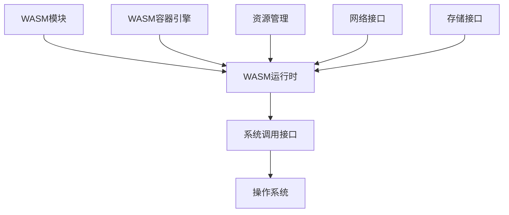
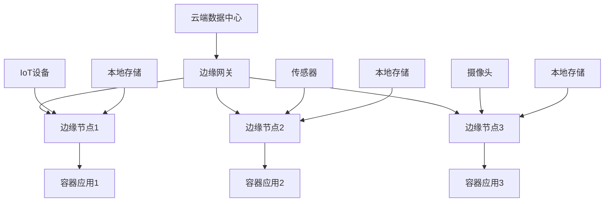
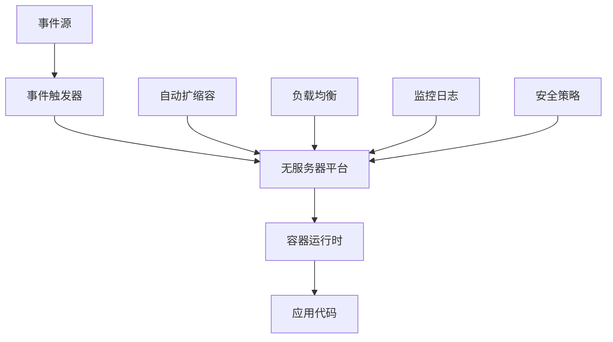
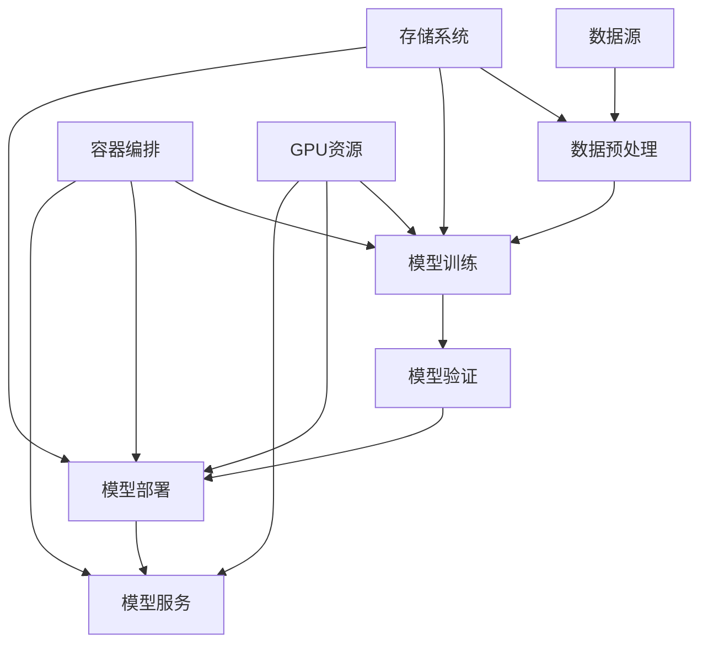
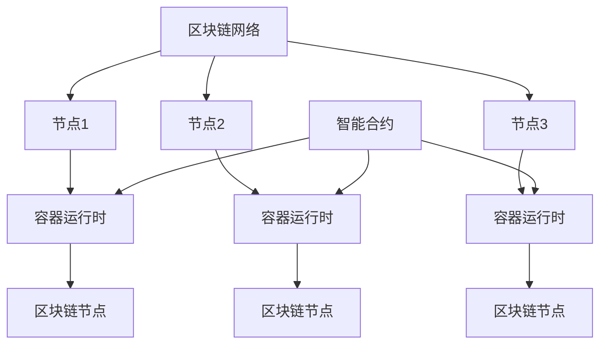
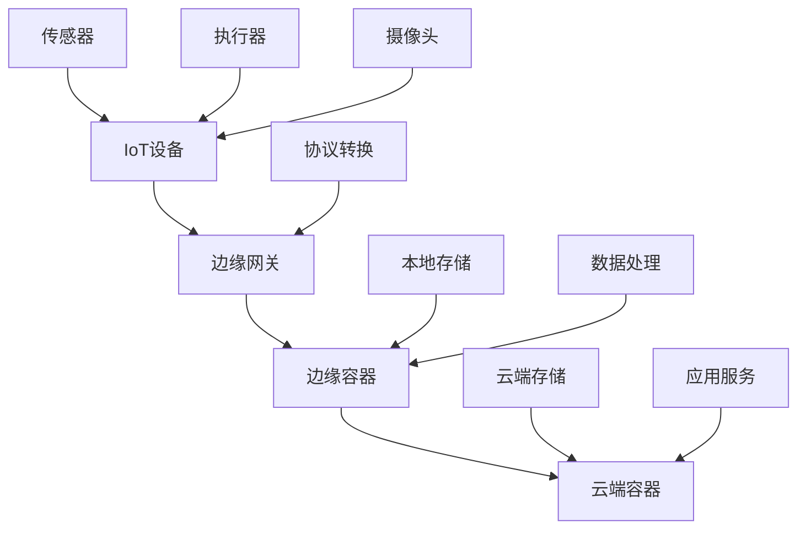

# 新兴容器技术分析

## 概述

本文档深入分析新兴容器技术，包括WebAssembly、边缘容器、无服务器容器、AI容器等前沿技术，探讨其技术特点、应用场景和发展前景。

## 目录

- [WebAssembly容器技术](#webassembly容器技术)
- [边缘容器技术](#边缘容器技术)
- [无服务器容器技术](#无服务器容器技术)
- [AI/ML容器技术](#aiml容器技术)
- [区块链容器技术](#区块链容器技术)
- [IoT容器技术](#iot容器技术)
- [量子计算容器](#量子计算容器)
- [技术对比分析](#技术对比分析)
- [发展前景](#发展前景)
- [FAQ](#faq)

## WebAssembly容器技术

### 1. WebAssembly基础

#### 技术原理

```yaml
# WebAssembly技术原理
webassembly_principles:
  definition: "一种新的字节码格式，可以在浏览器和服务器端运行"
  
  architecture:
    - "字节码格式：紧凑的二进制格式"
    - "虚拟机：高效的执行引擎"
    - "沙箱隔离：安全的执行环境"
    - "跨平台：支持多种操作系统"
  
  advantages:
    - "高性能：接近原生代码性能"
    - "安全性：沙箱隔离执行"
    - "可移植性：跨平台运行"
    - "轻量级：比容器更小的资源占用"
  
  limitations:
    - "生态不成熟：工具链和库有限"
    - "调试困难：调试工具不完善"
    - "学习曲线：需要学习新的开发模式"
    - "兼容性：与现有系统集成复杂"
```

#### 与容器对比

| 特性 | 容器 | WebAssembly | 优势分析 |
|------|------|-------------|----------|
| 启动时间 | 秒级 | 毫秒级 | WASM启动更快 |
| 资源占用 | 较大 | 很小 | WASM资源占用更少 |
| 隔离性 | 命名空间 | 沙箱 | 隔离机制不同 |
| 生态 | 丰富 | 新兴 | 容器生态更成熟 |
| 性能 | 好 | 更好 | WASM性能更优 |
| 调试 | 容易 | 困难 | 容器调试更简单 |

### 2. WASM容器实现

#### 技术架构



#### 实现方案

```yaml
# WASM容器实现方案
wasm_container_implementations:
  wasmtime:
    description: "高性能WASM运行时"
    features:
      - "JIT编译"
      - "多线程支持"
      - "SIMD支持"
      - "WASI支持"
    use_cases: ["服务器端", "边缘计算", "插件系统"]
  
  wasmer:
    description: "通用WASM运行时"
    features:
      - "多后端支持"
      - "包管理"
      - "语言绑定"
      - "云原生支持"
    use_cases: ["微服务", "函数计算", "边缘计算"]
  
  wasm3:
    description: "轻量级WASM解释器"
    features:
      - "解释执行"
      - "小内存占用"
      - "快速启动"
      - "嵌入式支持"
    use_cases: ["IoT设备", "嵌入式系统", "边缘节点"]
  
  wasmcloud:
    description: "WASM云原生平台"
    features:
      - "分布式计算"
      - "服务网格"
      - "安全隔离"
      - "动态部署"
    use_cases: ["云原生应用", "微服务", "边缘计算"]
```

### 3. WASM容器应用

#### 应用场景

```yaml
# WASM容器应用场景
wasm_container_use_cases:
  edge_computing:
    description: "边缘计算场景"
    advantages:
      - "快速启动：毫秒级启动时间"
      - "资源节约：低内存和CPU占用"
      - "安全隔离：沙箱执行环境"
      - "跨平台：支持多种硬件架构"
    examples:
      - "IoT数据处理"
      - "实时图像处理"
      - "边缘AI推理"
      - "CDN边缘计算"
  
  plugin_systems:
    description: "插件系统"
    advantages:
      - "安全执行：沙箱隔离"
      - "动态加载：运行时加载"
      - "跨语言：支持多种编程语言"
      - "性能优化：接近原生性能"
    examples:
      - "数据库插件"
      - "Web服务器插件"
      - "游戏引擎插件"
      - "IDE插件"
  
  serverless_computing:
    description: "无服务器计算"
    advantages:
      - "冷启动快：毫秒级启动"
      - "资源效率：高资源利用率"
      - "安全隔离：多租户安全"
      - "成本优化：按需付费"
    examples:
      - "API网关"
      - "数据处理"
      - "图像处理"
      - "机器学习推理"
```

## 边缘容器技术

### 1. 边缘计算基础

#### 边缘计算特点

```yaml
# 边缘计算特点分析
edge_computing_characteristics:
  definition: "在数据源附近进行数据处理和计算"
  
  key_features:
    - "低延迟：减少网络传输延迟"
    - "高带宽：本地数据处理"
    - "实时性：实时数据处理"
    - "可靠性：减少网络依赖"
  
  challenges:
    - "资源受限：边缘设备资源有限"
    - "网络不稳定：网络连接质量差"
    - "管理复杂：分布式管理复杂"
    - "安全风险：边缘设备安全风险"
  
  benefits:
    - "性能提升：减少延迟"
    - "成本降低：减少带宽成本"
    - "隐私保护：本地数据处理"
    - "可靠性：离线运行能力"
```

#### 边缘容器架构



### 2. 边缘容器技术

#### 边缘容器特点

```yaml
# 边缘容器技术特点
edge_container_technologies:
  lightweight_containers:
    description: "轻量级容器技术"
    features:
      - "小镜像：减少镜像大小"
      - "快速启动：优化启动时间"
      - "低资源：减少资源占用"
      - "离线运行：支持离线模式"
    examples:
      - "Alpine Linux"
      - "Distroless镜像"
      - "Scratch镜像"
      - "多阶段构建"
  
  edge_orchestration:
    description: "边缘编排技术"
    features:
      - "分布式管理：多节点管理"
      - "自动部署：自动应用部署"
      - "故障恢复：自动故障恢复"
      - "负载均衡：智能负载分配"
    examples:
      - "K3s：轻量级Kubernetes"
      - "KubeEdge：边缘Kubernetes"
      - "OpenYurt：边缘云原生"
      - "SuperEdge：边缘容器平台"
  
  edge_storage:
    description: "边缘存储技术"
    features:
      - "本地存储：本地数据存储"
      - "数据同步：云端数据同步"
      - "缓存策略：智能缓存管理"
      - "数据压缩：存储数据压缩"
    examples:
      - "本地卷：本地存储卷"
      - "分布式存储：边缘分布式存储"
      - "对象存储：边缘对象存储"
      - "时序数据库：边缘时序数据"
```

### 3. 边缘容器应用

#### 应用场景3

```yaml
# 边缘容器应用场景
edge_container_applications:
  iot_data_processing:
    description: "IoT数据处理"
    use_cases:
      - "传感器数据采集"
      - "实时数据分析"
      - "异常检测"
      - "数据预处理"
    benefits:
      - "实时处理：低延迟数据处理"
      - "带宽节约：减少数据传输"
      - "离线能力：网络中断时继续运行"
      - "成本优化：减少云端计算成本"
  
  video_analytics:
    description: "视频分析"
    use_cases:
      - "实时视频流处理"
      - "人脸识别"
      - "物体检测"
      - "行为分析"
    benefits:
      - "实时分析：毫秒级响应"
      - "隐私保护：本地处理"
      - "带宽优化：只传输结果"
      - "成本降低：减少云端计算"
  
  industrial_automation:
    description: "工业自动化"
    use_cases:
      - "设备监控"
      - "预测性维护"
      - "质量控制"
      - "生产优化"
    benefits:
      - "实时控制：低延迟控制"
      - "可靠性：减少网络依赖"
      - "安全性：本地数据处理"
      - "效率提升：智能决策"
```

## 无服务器容器技术

### 1. 无服务器容器基础

#### 技术概念

```yaml
# 无服务器容器技术概念
serverless_container_concepts:
  definition: "基于容器的无服务器计算模式"
  
  key_characteristics:
    - "事件驱动：基于事件触发"
    - "自动扩缩容：根据负载自动调整"
    - "按需付费：按实际使用付费"
    - "无状态：无状态函数执行"
  
  advantages:
    - "成本优化：按需付费模式"
    - "运维简化：无需管理基础设施"
    - "弹性扩展：自动扩缩容"
    - "快速部署：快速应用部署"
  
  limitations:
    - "冷启动：首次启动延迟"
    - "执行时间限制：函数执行时间限制"
    - "状态管理：无状态执行限制"
    - "调试困难：分布式调试复杂"
```

#### 技术架构3



### 2. 无服务器容器平台

#### 主要平台

```yaml
# 无服务器容器平台
serverless_container_platforms:
  knative:
    description: "基于Kubernetes的无服务器平台"
    features:
      - "自动扩缩容：基于请求量自动调整"
      - "事件驱动：支持多种事件源"
      - "流量管理：智能流量路由"
      - "版本管理：多版本部署管理"
    advantages:
      - "标准Kubernetes API"
      - "开源免费"
      - "云厂商无关"
      - "生态丰富"
    use_cases:
      - "微服务架构"
      - "API服务"
      - "数据处理"
      - "事件处理"
  
  aws_fargate:
    description: "AWS托管的容器服务"
    features:
      - "无服务器：无需管理基础设施"
      - "按需付费：按实际使用付费"
      - "自动扩缩容：根据负载自动调整"
      - "安全隔离：容器级别安全隔离"
    advantages:
      - "完全托管"
      - "高可用性"
      - "安全可靠"
      - "成本优化"
    use_cases:
      - "Web应用"
      - "批处理任务"
      - "机器学习"
      - "微服务"
  
  azure_container_instances:
    description: "Azure容器实例服务"
    features:
      - "快速启动：秒级启动时间"
      - "按秒计费：精确计费模式"
      - "简单部署：简化部署流程"
      - "多平台支持：支持多种操作系统"
    advantages:
      - "启动快速"
      - "计费精确"
      - "部署简单"
      - "成本透明"
    use_cases:
      - "开发测试"
      - "批处理"
      - "CI/CD"
      - "临时任务"
  
  google_cloud_run:
    description: "Google Cloud Run服务"
    features:
      - "完全托管：无需管理基础设施"
      - "自动扩缩容：从0到N自动扩缩容"
      - "HTTP请求：基于HTTP请求触发"
      - "多语言支持：支持多种编程语言"
    advantages:
      - "完全托管"
      - "自动扩缩容"
      - "多语言支持"
      - "成本优化"
    use_cases:
      - "Web应用"
      - "API服务"
      - "数据处理"
      - "微服务"
```

### 3. 无服务器容器应用

#### 应用场景4

```yaml
# 无服务器容器应用场景
serverless_container_applications:
  api_gateway:
    description: "API网关服务"
    use_cases:
      - "请求路由"
      - "身份验证"
      - "限流控制"
      - "监控日志"
    benefits:
      - "自动扩缩容：根据请求量自动调整"
      - "成本优化：按请求量付费"
      - "高可用：自动故障恢复"
      - "运维简化：无需管理基础设施"
  
  data_processing:
    description: "数据处理服务"
    use_cases:
      - "ETL处理"
      - "数据转换"
      - "批量计算"
      - "实时分析"
    benefits:
      - "弹性计算：按需分配资源"
      - "成本控制：按实际使用付费"
      - "快速部署：快速数据处理"
      - "自动扩缩容：根据数据量调整"
  
  event_processing:
    description: "事件处理服务"
    use_cases:
      - "消息队列处理"
      - "事件驱动架构"
      - "实时流处理"
      - "通知服务"
    benefits:
      - "事件驱动：基于事件触发"
      - "实时处理：低延迟处理"
      - "自动扩缩容：根据事件量调整"
      - "成本优化：按事件量付费"
```

## AI/ML容器技术

### 1. AI/ML容器化基础

#### 技术特点

```yaml
# AI/ML容器化特点
ai_ml_containerization:
  definition: "将AI/ML工作负载容器化部署"
  
  key_features:
    - "环境一致性：统一的运行环境"
    - "可移植性：跨平台部署"
    - "可扩展性：弹性资源分配"
    - "版本管理：模型版本控制"
  
  advantages:
    - "标准化：统一的部署标准"
    - "可重复性：可重复的实验环境"
    - "协作性：团队协作开发"
    - "运维简化：简化ML运维"
  
  challenges:
    - "资源需求：GPU等特殊资源"
    - "数据管理：大数据集管理"
    - "模型大小：大型模型部署"
    - "性能优化：ML性能优化"
```

#### 技术架构4



### 2. AI/ML容器平台

#### 主要平台2

```yaml
# AI/ML容器平台
ai_ml_container_platforms:
  kubeflow:
    description: "Kubernetes原生ML平台"
    features:
      - "ML工作流：端到端ML工作流"
      - "模型训练：分布式模型训练"
      - "模型部署：模型服务化部署"
      - "实验管理：ML实验跟踪"
    components:
      - "Pipelines：工作流编排"
      - "Training：模型训练"
      - "Serving：模型服务"
      - "Notebooks：Jupyter集成"
    use_cases:
      - "机器学习平台"
      - "模型训练"
      - "模型部署"
      - "实验管理"
  
  mlflow:
    description: "ML生命周期管理平台"
    features:
      - "实验跟踪：ML实验跟踪"
      - "模型注册：模型版本管理"
      - "模型部署：模型服务化"
      - "模型监控：模型性能监控"
    components:
      - "Tracking：实验跟踪"
      - "Projects：项目管理"
      - "Models：模型管理"
      - "Registry：模型注册"
    use_cases:
      - "ML实验管理"
      - "模型版本控制"
      - "模型部署"
      - "模型监控"
  
  seldon:
    description: "ML模型部署平台"
    features:
      - "模型服务化：模型API服务"
      - "A/B测试：模型A/B测试"
      - "模型监控：模型性能监控"
      - "自动扩缩容：根据负载扩缩容"
    components:
      - "Core：核心引擎"
      - "Alibi：模型解释"
      - "Alibi Detect：异常检测"
      - "MLflow：实验管理"
    use_cases:
      - "模型服务化"
      - "A/B测试"
      - "模型监控"
      - "模型解释"
  
  tensorflow_serving:
    description: "TensorFlow模型服务"
    features:
      - "模型服务：TensorFlow模型服务"
      - "版本管理：模型版本管理"
      - "批处理：批量推理"
      - "GPU支持：GPU加速推理"
    components:
      - "Model Server：模型服务器"
      - "Client API：客户端API"
      - "Model Management：模型管理"
      - "Monitoring：监控系统"
    use_cases:
      - "TensorFlow模型服务"
      - "深度学习推理"
      - "批量推理"
      - "GPU加速推理"
```

### 3. AI/ML容器应用

#### 应用场景5

```yaml
# AI/ML容器应用场景
ai_ml_container_applications:
  model_training:
    description: "模型训练"
    use_cases:
      - "分布式训练"
      - "超参数调优"
      - "实验管理"
      - "资源调度"
    benefits:
      - "资源优化：动态资源分配"
      - "可扩展性：水平扩展训练"
      - "可重复性：可重复的实验环境"
      - "协作性：团队协作开发"
  
  model_serving:
    description: "模型服务"
    use_cases:
      - "实时推理"
      - "批量推理"
      - "A/B测试"
      - "模型监控"
    benefits:
      - "高可用：自动故障恢复"
      - "可扩展性：自动扩缩容"
      - "性能优化：GPU加速"
      - "监控完善：完整的监控体系"
  
  ml_pipeline:
    description: "ML流水线"
    use_cases:
      - "数据预处理"
      - "特征工程"
      - "模型训练"
      - "模型部署"
    benefits:
      - "自动化：端到端自动化"
      - "可重复性：可重复的流水线"
      - "版本控制：流水线版本管理"
      - "监控完善：流水线监控"
```

## 区块链容器技术

### 1. 区块链容器化基础

#### 技术特点1

```yaml
# 区块链容器化特点
blockchain_containerization:
  definition: "将区块链节点和智能合约容器化部署"
  
  key_features:
    - "节点部署：区块链节点容器化"
    - "智能合约：合约执行环境标准化"
    - "网络管理：区块链网络容器化"
    - "开发环境：区块链开发工具容器化"
  
  advantages:
    - "标准化：统一的部署标准"
    - "可移植性：跨平台部署"
    - "可扩展性：弹性资源分配"
    - "运维简化：简化区块链运维"
  
  challenges:
    - "数据持久化：区块链数据存储"
    - "网络配置：P2P网络设置"
    - "性能优化：区块链性能调优"
    - "安全防护：区块链安全加固"
```

#### 技术架构1



### 2. 区块链容器平台

#### 主要平台2.1

```yaml
# 区块链容器平台
blockchain_container_platforms:
  hyperledger_fabric:
    description: "企业级区块链平台"
    features:
      - "模块化架构：可插拔组件"
      - "权限控制：细粒度权限管理"
      - "智能合约：链码支持"
      - "隐私保护：数据隐私保护"
    containerization:
      - "Peer节点容器化"
      - "Orderer节点容器化"
      - "CA节点容器化"
      - "链码容器化"
    use_cases:
      - "企业区块链"
      - "供应链管理"
      - "数字身份"
      - "金融交易"
  
  ethereum:
    description: "公链平台"
    features:
      - "智能合约：Solidity合约"
      - "去中心化：去中心化网络"
      - "可编程：可编程区块链"
      - "生态丰富：丰富的DApp生态"
    containerization:
      - "Geth节点容器化"
      - "Parity节点容器化"
      - "智能合约容器化"
      - "DApp容器化"
    use_cases:
      - "去中心化应用"
      - "DeFi应用"
      - "NFT应用"
      - "智能合约"
  
  corda:
    description: "企业级分布式账本"
    features:
      - "隐私保护：数据隐私保护"
      - "法律框架：法律合规框架"
      - "智能合约：Corda合约"
      - "互操作性：跨网络互操作"
    containerization:
      - "节点容器化"
      - "合约容器化"
      - "应用容器化"
      - "网络容器化"
    use_cases:
      - "金融交易"
      - "贸易金融"
      - "数字资产"
      - "合规管理"
```

### 3. 区块链容器应用

#### 应用场景3.1

```yaml
# 区块链容器应用场景
blockchain_container_applications:
  enterprise_blockchain:
    description: "企业区块链"
    use_cases:
      - "供应链管理"
      - "数字身份"
      - "资产数字化"
      - "合规管理"
    benefits:
      - "标准化：统一的部署标准"
      - "可扩展性：弹性资源分配"
      - "运维简化：简化区块链运维"
      - "成本优化：降低部署成本"
  
  defi_applications:
    description: "DeFi应用"
    use_cases:
      - "去中心化交易所"
      - "借贷协议"
      - "流动性挖矿"
      - "衍生品交易"
    benefits:
      - "高可用：自动故障恢复"
      - "可扩展性：自动扩缩容"
      - "性能优化：GPU加速"
      - "监控完善：完整的监控体系"
  
  nft_applications:
    description: "NFT应用"
    use_cases:
      - "数字艺术品"
      - "游戏道具"
      - "数字收藏品"
      - "虚拟土地"
    benefits:
      - "标准化：统一的部署标准"
      - "可移植性：跨平台部署"
      - "可扩展性：弹性资源分配"
      - "运维简化：简化应用运维"
```

## IoT容器技术

### 1. IoT容器化基础

#### 技术特点1.1

```yaml
# IoT容器化特点
iot_containerization:
  definition: "将IoT应用和设备管理容器化"
  
  key_features:
    - "设备管理：IoT设备容器化"
    - "数据处理：边缘数据处理"
    - "应用部署：IoT应用容器化"
    - "协议支持：多种IoT协议"
  
  advantages:
    - "标准化：统一的部署标准"
    - "可移植性：跨平台部署"
    - "可扩展性：弹性资源分配"
    - "运维简化：简化IoT运维"
  
  challenges:
    - "资源受限：设备资源有限"
    - "网络不稳定：网络连接质量差"
    - "协议多样：多种IoT协议"
    - "安全风险：IoT设备安全风险"
```

#### 技术架构1.2



### 2. IoT容器平台

#### 主要平台2.2

```yaml
# IoT容器平台
iot_container_platforms:
  k3s:
    description: "轻量级Kubernetes"
    features:
      - "轻量级：资源占用少"
      - "快速启动：快速启动时间"
      - "边缘优化：边缘计算优化"
      - "简单部署：简化部署流程"
    iot_features:
      - "设备管理：IoT设备管理"
      - "数据处理：边缘数据处理"
      - "应用部署：IoT应用部署"
      - "监控管理：设备监控管理"
    use_cases:
      - "边缘计算"
      - "IoT网关"
      - "设备管理"
      - "数据处理"
  
  kubeedge:
    description: "边缘Kubernetes"
    features:
      - "边缘计算：边缘节点计算"
      - "设备管理：IoT设备管理"
      - "应用部署：边缘应用部署"
      - "数据同步：云端数据同步"
    iot_features:
      - "设备协议：多种设备协议"
      - "数据处理：边缘数据处理"
      - "应用管理：边缘应用管理"
      - "网络管理：边缘网络管理"
    use_cases:
      - "边缘计算"
      - "IoT平台"
      - "设备管理"
      - "数据处理"
  
  openyurt:
    description: "边缘云原生"
    features:
      - "边缘计算：边缘节点计算"
      - "云原生：云原生架构"
      - "设备管理：IoT设备管理"
      - "应用部署：边缘应用部署"
    iot_features:
      - "设备接入：设备接入管理"
      - "数据处理：边缘数据处理"
      - "应用管理：边缘应用管理"
      - "网络管理：边缘网络管理"
    use_cases:
      - "边缘计算"
      - "IoT平台"
      - "设备管理"
      - "数据处理"
```

### 3. IoT容器应用

#### 应用场景2.3

```yaml
# IoT容器应用场景
iot_container_applications:
  smart_city:
    description: "智慧城市"
    use_cases:
      - "交通管理"
      - "环境监测"
      - "公共安全"
      - "能源管理"
    benefits:
      - "实时处理：实时数据处理"
      - "成本优化：降低部署成本"
      - "可扩展性：弹性资源分配"
      - "运维简化：简化系统运维"
  
  industrial_iot:
    description: "工业物联网"
    use_cases:
      - "设备监控"
      - "预测性维护"
      - "质量控制"
      - "生产优化"
    benefits:
      - "实时控制：实时设备控制"
      - "可靠性：高可靠性系统"
      - "安全性：设备安全防护"
      - "效率提升：生产效率提升"
  
  smart_home:
    description: "智能家居"
    use_cases:
      - "设备控制"
      - "环境调节"
      - "安全监控"
      - "能源管理"
    benefits:
      - "用户体验：提升用户体验"
      - "成本优化：降低运营成本"
      - "可扩展性：弹性系统扩展"
      - "运维简化：简化系统运维"
```

## 量子计算容器

### 1. 量子计算基础

#### 技术特点1.5

```yaml
# 量子计算特点
quantum_computing:
  definition: "基于量子力学原理的计算技术"
  
  key_features:
    - "量子叠加：量子态叠加"
    - "量子纠缠：量子态纠缠"
    - "量子干涉：量子态干涉"
    - "量子测量：量子态测量"
  
  advantages:
    - "并行计算：量子并行计算"
    - "指数加速：特定问题指数加速"
    - "密码学：量子密码学"
    - "优化问题：优化问题求解"
  
  limitations:
    - "量子比特：量子比特稳定性"
    - "错误率：量子错误率"
    - "算法限制：算法适用范围"
    - "硬件要求：特殊硬件要求"
```

#### 容器化挑战

```yaml
# 量子计算容器化挑战
quantum_containerization_challenges:
  hardware_dependencies:
    - "量子硬件：需要特殊量子硬件"
    - "低温环境：需要极低温环境"
    - "电磁屏蔽：需要电磁屏蔽"
    - "稳定性：量子态稳定性"
  
  software_complexity:
    - "量子算法：复杂的量子算法"
    - "量子编程：量子编程语言"
    - "量子模拟：量子系统模拟"
    - "错误纠正：量子错误纠正"
  
  deployment_challenges:
    - "硬件集成：硬件软件集成"
    - "环境要求：特殊环境要求"
    - "资源管理：量子资源管理"
    - "监控调试：量子系统监控"
```

### 2. 量子计算容器平台

#### 主要平台2.5

```yaml
# 量子计算容器平台
quantum_container_platforms:
  qiskit:
    description: "IBM量子计算平台"
    features:
      - "量子编程：Python量子编程"
      - "量子模拟：量子系统模拟"
      - "量子硬件：真实量子硬件"
      - "量子算法：量子算法库"
    containerization:
      - "量子模拟器容器化"
      - "量子算法容器化"
      - "量子应用容器化"
      - "量子服务容器化"
    use_cases:
      - "量子算法开发"
      - "量子模拟"
      - "量子教育"
      - "量子研究"
  
  cirq:
    description: "Google量子计算平台"
    features:
      - "量子编程：Python量子编程"
      - "量子硬件：Google量子硬件"
      - "量子算法：量子算法库"
      - "量子优化：量子优化算法"
    containerization:
      - "量子模拟器容器化"
      - "量子算法容器化"
      - "量子应用容器化"
      - "量子服务容器化"
    use_cases:
      - "量子算法开发"
      - "量子模拟"
      - "量子优化"
      - "量子研究"
  
  pennylane:
    description: "量子机器学习平台"
    features:
      - "量子机器学习：量子ML算法"
      - "量子优化：量子优化算法"
      - "量子模拟：量子系统模拟"
      - "多后端：多量子后端支持"
    containerization:
      - "量子ML容器化"
      - "量子优化容器化"
      - "量子模拟容器化"
      - "量子服务容器化"
    use_cases:
      - "量子机器学习"
      - "量子优化"
      - "量子模拟"
      - "量子研究"
```

### 3. 量子计算容器应用

#### 应用场景3.2

```yaml
# 量子计算容器应用场景
quantum_container_applications:
  quantum_simulation:
    description: "量子模拟"
    use_cases:
      - "分子模拟"
      - "材料设计"
      - "化学反应"
      - "物理系统"
    benefits:
      - "精确模拟：高精度量子模拟"
      - "可扩展性：弹性资源分配"
      - "标准化：统一的部署标准"
      - "协作性：团队协作开发"
  
  quantum_optimization:
    description: "量子优化"
    use_cases:
      - "组合优化"
      - "物流优化"
      - "金融优化"
      - "机器学习"
    benefits:
      - "优化性能：量子优化算法"
      - "可扩展性：弹性资源分配"
      - "标准化：统一的部署标准"
      - "协作性：团队协作开发"
  
  quantum_machine_learning:
    description: "量子机器学习"
    use_cases:
      - "量子神经网络"
      - "量子分类"
      - "量子回归"
      - "量子聚类"
    benefits:
      - "算法优势：量子ML算法"
      - "可扩展性：弹性资源分配"
      - "标准化：统一的部署标准"
      - "协作性：团队协作开发"
```

## 技术对比分析

### 1. 技术成熟度对比

#### 成熟度矩阵

| 技术 | 成熟度 | 采用率 | 生态 | 投资热度 | 发展前景 |
|------|--------|--------|------|----------|----------|
| WebAssembly | 萌芽 | 10% | 新兴 | 高 | 很好 |
| 边缘容器 | 复苏 | 30% | 中等 | 高 | 很好 |
| 无服务器容器 | 复苏 | 40% | 丰富 | 中 | 好 |
| AI/ML容器 | 成熟 | 60% | 丰富 | 高 | 很好 |
| 区块链容器 | 萌芽 | 20% | 新兴 | 中 | 中等 |
| IoT容器 | 复苏 | 35% | 中等 | 中 | 好 |
| 量子计算容器 | 萌芽 | 5% | 新兴 | 低 | 不确定 |

### 2. 技术特点对比

#### 特点对比矩阵

| 特性 | WebAssembly | 边缘容器 | 无服务器容器 | AI/ML容器 |
|------|-------------|----------|--------------|-----------|
| 启动时间 | 毫秒级 | 秒级 | 秒级 | 分钟级 |
| 资源占用 | 很小 | 小 | 中等 | 大 |
| 性能 | 很好 | 好 | 好 | 很好 |
| 生态 | 新兴 | 中等 | 丰富 | 丰富 |
| 学习曲线 | 陡峭 | 中等 | 平缓 | 陡峭 |
| 调试难度 | 困难 | 中等 | 中等 | 困难 |

### 3. 应用场景对比

#### 场景适用性

```yaml
# 应用场景适用性分析
application_scenario_analysis:
  edge_computing:
    best_fit: ["边缘容器", "WebAssembly"]
    good_fit: ["IoT容器"]
    poor_fit: ["量子计算容器"]
  
  serverless_computing:
    best_fit: ["无服务器容器", "WebAssembly"]
    good_fit: ["边缘容器"]
    poor_fit: ["AI/ML容器", "量子计算容器"]
  
  machine_learning:
    best_fit: ["AI/ML容器"]
    good_fit: ["无服务器容器"]
    poor_fit: ["WebAssembly", "量子计算容器"]
  
  blockchain:
    best_fit: ["区块链容器"]
    good_fit: ["边缘容器"]
    poor_fit: ["WebAssembly", "量子计算容器"]
  
  iot_applications:
    best_fit: ["IoT容器", "边缘容器"]
    good_fit: ["WebAssembly"]
    poor_fit: ["量子计算容器"]
```

## 发展前景

### 1. 技术发展趋势

#### 短期趋势（1-2年）

```yaml
# 短期技术趋势
short_term_trends:
  webassembly:
    - "性能优化：WASM性能持续优化"
    - "生态发展：工具链和库不断完善"
    - "标准制定：WASM标准进一步完善"
    - "应用扩展：更多应用场景"
  
  edge_containers:
    - "平台成熟：边缘容器平台成熟"
    - "应用普及：边缘应用普及"
    - "性能优化：边缘性能优化"
    - "标准统一：边缘标准统一"
  
  serverless_containers:
    - "平台完善：无服务器平台完善"
    - "性能提升：冷启动性能提升"
    - "生态丰富：无服务器生态丰富"
    - "成本优化：成本进一步优化"
  
  ai_ml_containers:
    - "平台成熟：AI/ML平台成熟"
    - "工具丰富：AI/ML工具丰富"
    - "性能优化：ML性能优化"
    - "应用普及：AI/ML应用普及"
```

#### 中期趋势（3-5年）

```yaml
# 中期技术趋势
medium_term_trends:
  technology_convergence:
    - "技术融合：多种技术融合"
    - "标准统一：技术标准统一"
    - "生态整合：技术生态整合"
    - "平台统一：统一技术平台"
  
  performance_optimization:
    - "性能提升：整体性能提升"
    - "资源优化：资源使用优化"
    - "成本降低：部署成本降低"
    - "效率提升：开发效率提升"
  
  security_enhancement:
    - "安全加固：安全机制加固"
    - "隐私保护：隐私保护增强"
    - "合规管理：合规管理完善"
    - "威胁防护：威胁防护加强"
  
  automation_intelligence:
    - "自动化：运维自动化"
    - "智能化：系统智能化"
    - "自愈能力：系统自愈能力"
    - "预测分析：预测分析能力"
```

#### 长期趋势（5-10年）

```yaml
# 长期技术趋势
long_term_trends:
  quantum_integration:
    - "量子计算：量子计算集成"
    - "量子算法：量子算法应用"
    - "量子安全：量子安全机制"
    - "量子优化：量子优化算法"
  
  ai_driven:
    - "AI驱动：AI驱动系统"
    - "智能运维：智能运维系统"
    - "预测分析：预测分析系统"
    - "自主决策：自主决策系统"
  
  edge_native:
    - "边缘原生：边缘原生架构"
    - "分布式计算：分布式计算"
    - "实时处理：实时处理能力"
    - "离线能力：离线运行能力"
  
  sustainable_computing:
    - "绿色计算：绿色计算技术"
    - "能源优化：能源使用优化"
    - "碳足迹：碳足迹管理"
    - "可持续发展：可持续发展"
```

### 2. 市场发展预测

#### 市场规模预测

```yaml
# 市场规模预测
market_size_predictions:
  webassembly:
    current: "$100M"
    year_2025: "$500M"
    year_2030: "$2B"
    growth_rate: "35%"
  
  edge_containers:
    current: "$1B"
    year_2025: "$3B"
    year_2030: "$8B"
    growth_rate: "30%"
  
  serverless_containers:
    current: "$2B"
    year_2025: "$5B"
    year_2030: "$12B"
    growth_rate: "25%"
  
  ai_ml_containers:
    current: "$3B"
    year_2025: "$8B"
    year_2030: "$20B"
    growth_rate: "28%"
  
  blockchain_containers:
    current: "$200M"
    year_2025: "$800M"
    year_2030: "$2B"
    growth_rate: "32%"
  
  iot_containers:
    current: "$500M"
    year_2025: "$1.5B"
    year_2030: "$4B"
    growth_rate: "29%"
  
  quantum_containers:
    current: "$50M"
    year_2025: "$200M"
    year_2030: "$1B"
    growth_rate: "40%"
```

### 3. 投资建议

#### 投资优先级

```yaml
# 投资优先级建议
investment_priority:
  high_priority:
    - name: "AI/ML容器"
      investment_level: "高"
      expected_roi: "300%"
      time_to_value: "6个月"
      rationale: "AI/ML需求增长，技术成熟"
    
    - name: "边缘容器"
      investment_level: "高"
      expected_roi: "250%"
      time_to_value: "12个月"
      rationale: "5G网络普及，IoT设备增长"
    
    - name: "WebAssembly"
      investment_level: "中高"
      expected_roi: "200%"
      time_to_value: "18个月"
      rationale: "性能优势明显，生态快速发展"
  
  medium_priority:
    - name: "无服务器容器"
      investment_level: "中"
      expected_roi: "150%"
      time_to_value: "12个月"
      rationale: "技术成熟，应用场景明确"
    
    - name: "IoT容器"
      investment_level: "中"
      expected_roi: "120%"
      time_to_value: "18个月"
      rationale: "IoT市场增长，技术需求增加"
  
  low_priority:
    - name: "区块链容器"
      investment_level: "低"
      expected_roi: "100%"
      time_to_value: "24个月"
      rationale: "技术不成熟，应用场景有限"
    
    - name: "量子计算容器"
      investment_level: "低"
      expected_roi: "80%"
      time_to_value: "36个月"
      rationale: "技术早期，投资风险高"
```

## FAQ

### Q1: 新兴容器技术中哪些最有发展前景？

**A**: 最有发展前景的新兴容器技术：

- **AI/ML容器**：技术成熟，市场需求大，投资回报高
- **边缘容器**：5G和IoT推动，应用场景丰富
- **WebAssembly**：性能优势明显，生态快速发展
- **无服务器容器**：技术成熟，成本效益好

### Q2: 如何选择合适的新兴容器技术？

**A**: 选择新兴容器技术的考虑因素：

- **业务需求**：根据业务需求选择技术
- **技术成熟度**：考虑技术成熟度和稳定性
- **团队能力**：评估团队技术能力
- **投资回报**：评估投资回报和风险
- **生态支持**：考虑技术生态和支持

### Q3: 新兴容器技术的实施难点是什么？

**A**: 新兴容器技术实施难点：

- **技术不成熟**：技术处于早期阶段
- **生态不完善**：工具链和生态不完善
- **人才短缺**：相关技术人才短缺
- **标准不统一**：技术标准不统一
- **投资风险**：技术投资风险较高

### Q4: 如何降低新兴容器技术的投资风险？

**A**: 降低投资风险的方法：

- **技术验证**：小规模技术验证
- **分阶段投资**：分阶段投资策略
- **合作伙伴**：与技术厂商合作
- **人才培养**：投资人才培养
- **风险控制**：建立风险控制机制

---

## 总结

新兴容器技术分析显示：

1. **技术多样性**：新兴容器技术种类丰富，各有特点
2. **发展不平衡**：不同技术成熟度和发展速度不同
3. **应用场景明确**：每种技术都有明确的应用场景
4. **投资机会多**：新兴技术带来新的投资机会
5. **风险与机遇并存**：技术风险与市场机遇并存

企业应该根据自身情况，选择合适的新兴容器技术，制定合理的投资策略，抓住技术发展机遇，实现技术创新和业务发展。
