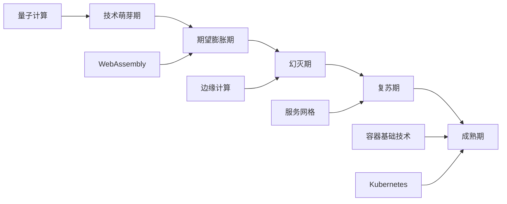
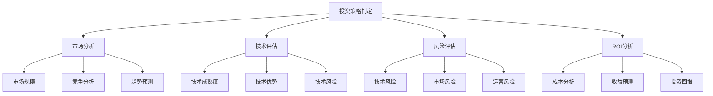
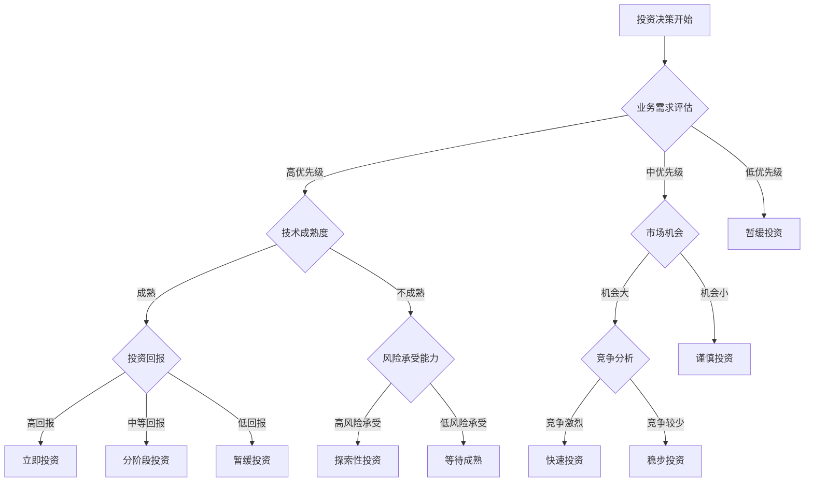
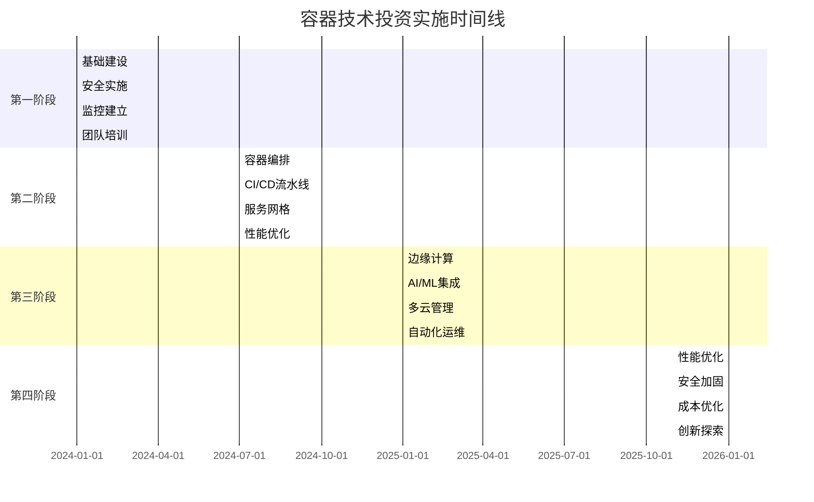
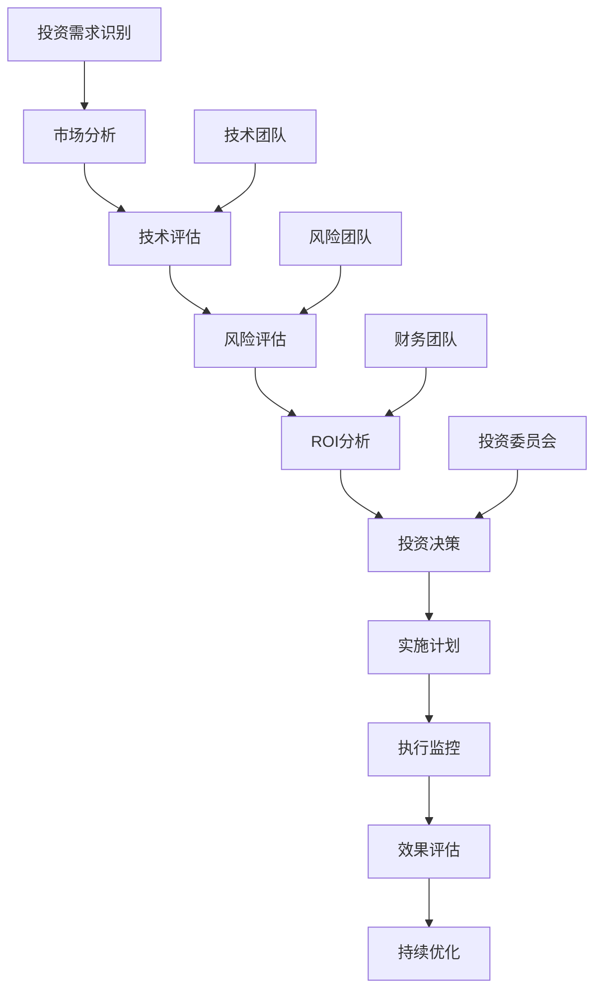

    # 容器技术投资建议

## 概述

本文档基于对容器技术发展趋势的深入分析，为企业提供容器技术投资建议，包括投资策略、风险评估、ROI分析和实施指南。

## 目录

- [容器技术投资建议](#容器技术投资建议)
  - [概述](#概述)
  - [投资环境分析](#投资环境分析)
    - [1. 市场环境](#1-市场环境)
      - [全球容器市场](#全球容器市场)
- [全球容器市场分析](#全球容器市场分析)
      - [技术成熟度](#技术成熟度)
    - [2. 竞争环境](#2-竞争环境)
      - [主要厂商](#主要厂商)
- [主要厂商分析](#主要厂商分析)
    - [3. 技术趋势](#3-技术趋势)
      - [技术发展方向](#技术发展方向)
- [技术发展方向](#技术发展方向)
  - [投资策略制定](#投资策略制定)
    - [1. 投资策略框架](#1-投资策略框架)
      - [战略投资框架](#战略投资框架)
      - [投资策略类型](#投资策略类型)
- [投资策略类型](#投资策略类型)
    - [2. 投资组合策略](#2-投资组合策略)
      - [投资组合配置](#投资组合配置)
- [投资组合配置](#投资组合配置)
      - [投资时间线](#投资时间线)
- [投资时间线](#投资时间线)
  - [技术投资优先级](#技术投资优先级)
    - [1. 投资优先级矩阵](#1-投资优先级矩阵)
      - [优先级评估](#优先级评估)
- [投资优先级矩阵](#投资优先级矩阵)
    - [2. 投资决策树](#2-投资决策树)
      - [决策流程](#决策流程)
    - [3. 投资组合优化](#3-投资组合优化)
      - [组合优化策略](#组合优化策略)
- [投资组合优化](#投资组合优化)
  - [投资风险评估](#投资风险评估)
    - [1. 风险识别](#1-风险识别)
      - [风险分类](#风险分类)
- [投资风险分类](#投资风险分类)
    - [2. 风险评估模型](#2-风险评估模型)
      - [风险评分模型](#风险评分模型)
- [风险评分模型](#风险评分模型)
    - [3. 风险缓解策略](#3-风险缓解策略)
      - [风险缓解措施](#风险缓解措施)
- [风险缓解措施](#风险缓解措施)
  - [ROI分析模型](#roi分析模型)
    - [1. ROI计算模型](#1-roi计算模型)
      - [成本分析](#成本分析)
- [成本分析模型](#成本分析模型)
      - [收益分析](#收益分析)
- [收益分析模型](#收益分析模型)
      - [ROI计算](#roi计算)
- [ROI计算](#roi计算)
    - [2. 敏感性分析](#2-敏感性分析)
      - [敏感性分析模型](#敏感性分析模型)
- [敏感性分析](#敏感性分析)
    - [3. 投资回报优化](#3-投资回报优化)
      - [优化策略](#优化策略)
- [投资回报优化](#投资回报优化)
  - [实施路线图](#实施路线图)
    - [1. 实施阶段规划](#1-实施阶段规划)
      - [分阶段实施](#分阶段实施)
- [分阶段实施规划](#分阶段实施规划)
    - [2. 关键里程碑](#2-关键里程碑)
      - [里程碑规划](#里程碑规划)
    - [3. 成功指标](#3-成功指标)
      - [关键绩效指标](#关键绩效指标)
- [关键绩效指标](#关键绩效指标)
  - [投资决策框架](#投资决策框架)
    - [1. 决策框架](#1-决策框架)
      - [决策流程1.4](#决策流程14)
      - [决策标准](#决策标准)
- [投资决策标准](#投资决策标准)
    - [2. 决策矩阵](#2-决策矩阵)
      - [决策评分矩阵](#决策评分矩阵)
- [决策评分矩阵](#决策评分矩阵)
    - [3. 决策支持工具](#3-决策支持工具)
      - [决策支持系统](#决策支持系统)
- [决策支持系统](#决策支持系统)
  - [最佳实践](#最佳实践)
    - [1. 投资管理最佳实践](#1-投资管理最佳实践)
      - [投资管理流程](#投资管理流程)
- [投资管理最佳实践](#投资管理最佳实践)
      - [投资管理工具](#投资管理工具)
- [投资管理工具](#投资管理工具)
    - [2. 技术投资最佳实践](#2-技术投资最佳实践)
      - [技术投资策略](#技术投资策略)
- [技术投资最佳实践](#技术投资最佳实践)
    - [3. 组织能力建设](#3-组织能力建设)
      - [能力建设框架](#能力建设框架)
- [组织能力建设](#组织能力建设)
  - [FAQ](#faq)
    - [Q1: 如何制定容器技术投资策略？](#q1-如何制定容器技术投资策略)
    - [Q2: 如何评估容器技术投资的ROI？](#q2-如何评估容器技术投资的roi)
    - [Q3: 如何管理容器技术投资风险？](#q3-如何管理容器技术投资风险)
    - [Q4: 如何优化容器技术投资回报？](#q4-如何优化容器技术投资回报)
  - [总结](#总结)

- [容器技术投资建议](#容器技术投资建议)
  - [概述](#概述)
  - [投资环境分析](#投资环境分析)
    - [1. 市场环境](#1-市场环境)
      - [全球容器市场](#全球容器市场)
- [全球容器市场分析](#全球容器市场分析)
      - [技术成熟度](#技术成熟度)
    - [2. 竞争环境](#2-竞争环境)
      - [主要厂商](#主要厂商)
- [主要厂商分析](#主要厂商分析)
    - [3. 技术趋势](#3-技术趋势)
      - [技术发展方向](#技术发展方向)
- [技术发展方向](#技术发展方向)
  - [投资策略制定](#投资策略制定)
    - [1. 投资策略框架](#1-投资策略框架)
      - [战略投资框架](#战略投资框架)
      - [投资策略类型](#投资策略类型)
- [投资策略类型](#投资策略类型)
    - [2. 投资组合策略](#2-投资组合策略)
      - [投资组合配置](#投资组合配置)
- [投资组合配置](#投资组合配置)
      - [投资时间线](#投资时间线)
- [投资时间线](#投资时间线)
  - [技术投资优先级](#技术投资优先级)
    - [1. 投资优先级矩阵](#1-投资优先级矩阵)
      - [优先级评估](#优先级评估)
- [投资优先级矩阵](#投资优先级矩阵)
    - [2. 投资决策树](#2-投资决策树)
      - [决策流程](#决策流程)
    - [3. 投资组合优化](#3-投资组合优化)
      - [组合优化策略](#组合优化策略)
- [投资组合优化](#投资组合优化)
  - [投资风险评估](#投资风险评估)
    - [1. 风险识别](#1-风险识别)
      - [风险分类](#风险分类)
- [投资风险分类](#投资风险分类)
    - [2. 风险评估模型](#2-风险评估模型)
      - [风险评分模型](#风险评分模型)
- [风险评分模型](#风险评分模型)
    - [3. 风险缓解策略](#3-风险缓解策略)
      - [风险缓解措施](#风险缓解措施)
- [风险缓解措施](#风险缓解措施)
  - [ROI分析模型](#roi分析模型)
    - [1. ROI计算模型](#1-roi计算模型)
      - [成本分析](#成本分析)
- [成本分析模型](#成本分析模型)
      - [收益分析](#收益分析)
- [收益分析模型](#收益分析模型)
      - [ROI计算](#roi计算)
- [ROI计算](#roi计算)
    - [2. 敏感性分析](#2-敏感性分析)
      - [敏感性分析模型](#敏感性分析模型)
- [敏感性分析](#敏感性分析)
    - [3. 投资回报优化](#3-投资回报优化)
      - [优化策略](#优化策略)
- [投资回报优化](#投资回报优化)
  - [实施路线图](#实施路线图)
    - [1. 实施阶段规划](#1-实施阶段规划)
      - [分阶段实施](#分阶段实施)
- [分阶段实施规划](#分阶段实施规划)
    - [2. 关键里程碑](#2-关键里程碑)
      - [里程碑规划](#里程碑规划)
    - [3. 成功指标](#3-成功指标)
      - [关键绩效指标](#关键绩效指标)
- [关键绩效指标](#关键绩效指标)
  - [投资决策框架](#投资决策框架)
    - [1. 决策框架](#1-决策框架)
      - [决策流程1.4](#决策流程14)
      - [决策标准](#决策标准)
- [投资决策标准](#投资决策标准)
    - [2. 决策矩阵](#2-决策矩阵)
      - [决策评分矩阵](#决策评分矩阵)
- [决策评分矩阵](#决策评分矩阵)
    - [3. 决策支持工具](#3-决策支持工具)
      - [决策支持系统](#决策支持系统)
- [决策支持系统](#决策支持系统)
  - [最佳实践](#最佳实践)
    - [1. 投资管理最佳实践](#1-投资管理最佳实践)
      - [投资管理流程](#投资管理流程)
- [投资管理最佳实践](#投资管理最佳实践)
      - [投资管理工具](#投资管理工具)
- [投资管理工具](#投资管理工具)
    - [2. 技术投资最佳实践](#2-技术投资最佳实践)
      - [技术投资策略](#技术投资策略)
- [技术投资最佳实践](#技术投资最佳实践)
    - [3. 组织能力建设](#3-组织能力建设)
      - [能力建设框架](#能力建设框架)
- [组织能力建设](#组织能力建设)
  - [FAQ](#faq)
    - [Q1: 如何制定容器技术投资策略？](#q1-如何制定容器技术投资策略)
    - [Q2: 如何评估容器技术投资的ROI？](#q2-如何评估容器技术投资的roi)
    - [Q3: 如何管理容器技术投资风险？](#q3-如何管理容器技术投资风险)
    - [Q4: 如何优化容器技术投资回报？](#q4-如何优化容器技术投资回报)
  - [总结](#总结)

- [投资环境分析](#投资环境分析)
- [投资策略制定](#投资策略制定)
- [技术投资优先级](#技术投资优先级)
- [投资风险评估](#投资风险评估)
- [ROI分析模型](#roi分析模型)
- [实施路线图](#实施路线图)
- [投资决策框架](#投资决策框架)
- [最佳实践](#最佳实践)
- [FAQ](#faq)

## 投资环境分析

### 1. 市场环境

#### 全球容器市场

```yaml
    # 全球容器市场分析
global_container_market:
  market_size:
    current: "$15.2B (2024)"
    projected_2025: "$19.1B"
    projected_2030: "$35.8B"
    cagr: "18.7%"
  
  market_segments:
    container_platforms: "$6.8B (45%)"
    orchestration_tools: "$4.2B (28%)"
    security_solutions: "$2.1B (14%)"
    monitoring_tools: "$1.8B (12%)"
    storage_solutions: "$0.3B (1%)"
  
  regional_distribution:
    north_america: "$6.1B (40%)"
    europe: "$4.2B (28%)"
    asia_pacific: "$3.8B (25%)"
    rest_of_world: "$1.1B (7%)"
  
  industry_adoption:
    financial_services: "$2.8B (18%)"
    healthcare: "$2.1B (14%)"
    retail: "$1.9B (12%)"
    manufacturing: "$1.7B (11%)"
    government: "$1.3B (9%)"
    others: "$5.4B (36%)"
```

#### 技术成熟度



### 2. 竞争环境

#### 主要厂商

```yaml
    # 主要厂商分析
major_vendors:
  cloud_providers:
    aws:
      market_share: "35%"
      services: ["EKS", "Fargate", "ECS"]
      strengths: ["市场领先", "服务完整", "生态丰富"]
      weaknesses: ["成本较高", "厂商锁定"]
    
    google:
      market_share: "25%"
      services: ["GKE", "Cloud Run", "Anthos"]
      strengths: ["技术先进", "开源友好", "AI集成"]
      weaknesses: ["市场份额", "企业特性"]
    
    microsoft:
      market_share: "20%"
      services: ["AKS", "Container Instances", "Arc"]
      strengths: ["企业市场", "混合云", "安全"]
      weaknesses: ["开源支持", "创新速度"]
  
  platform_providers:
    red_hat:
      market_share: "15%"
      services: ["OpenShift", "Podman", "Quay"]
      strengths: ["企业级", "安全", "合规"]
      weaknesses: ["成本", "复杂性"]
    
    vmware:
      market_share: "10%"
      services: ["Tanzu", "vSphere"]
      strengths: ["企业市场", "虚拟化", "管理"]
      weaknesses: ["云原生", "创新"]
  
  emerging_vendors:
    - "SUSE：企业Linux和Kubernetes"
    - "Canonical：Ubuntu和Kubernetes"
    - "Mirantis：Kubernetes服务"
    - "Rancher：容器管理平台"
```

### 3. 技术趋势

#### 技术发展方向

```yaml
    # 技术发展方向
technology_directions:
  infrastructure:
    - "云原生：全面云原生化"
    - "边缘计算：边缘节点容器化"
    - "混合云：多云和混合云管理"
    - "无服务器：无服务器容器化"
  
  application:
    - "微服务：微服务架构普及"
    - "AI/ML：AI/ML工作负载容器化"
    - "实时处理：实时数据处理"
    - "事件驱动：事件驱动架构"
  
  security:
    - "零信任：零信任安全架构"
    - "供应链安全：容器供应链安全"
    - "运行时安全：运行时威胁检测"
    - "合规管理：自动化合规管理"
  
  operations:
    - "GitOps：GitOps运维模式"
    - "可观测性：全面可观测性"
    - "自动化：运维自动化"
    - "智能化：AI驱动运维"
```

## 投资策略制定

### 1. 投资策略框架

#### 战略投资框架



#### 投资策略类型

```yaml
    # 投资策略类型
investment_strategies:
  aggressive_strategy:
    description: "激进投资策略"
    characteristics:
      - "高风险高回报"
      - "早期技术投资"
      - "快速市场进入"
      - "技术领先优势"
    suitable_for:
      - "技术驱动企业"
      - "创新型企业"
      - "资金充足企业"
    risks:
      - "技术风险高"
      - "市场不确定性"
      - "投资回报不确定"
  
  conservative_strategy:
    description: "保守投资策略"
    characteristics:
      - "低风险稳定回报"
      - "成熟技术投资"
      - "渐进式采用"
      - "风险控制优先"
    suitable_for:
      - "传统企业"
      - "风险敏感企业"
      - "资金有限企业"
    risks:
      - "技术落后"
      - "竞争劣势"
      - "市场机会丧失"
  
  balanced_strategy:
    description: "平衡投资策略"
    characteristics:
      - "风险收益平衡"
      - "混合技术投资"
      - "分阶段实施"
      - "灵活调整"
    suitable_for:
      - "大多数企业"
      - "中型企业"
      - "转型企业"
    risks:
      - "投资分散"
      - "资源分散"
      - "管理复杂"
```

### 2. 投资组合策略

#### 投资组合配置

```yaml
    # 投资组合配置
investment_portfolio:
  core_investments:
    weight: "60%"
    technologies:
      - "Kubernetes平台"
      - "容器安全"
      - "监控工具"
      - "CI/CD工具"
    rationale: "核心基础设施，稳定回报"
  
  growth_investments:
    weight: "25%"
    technologies:
      - "边缘计算"
      - "AI/ML平台"
      - "服务网格"
      - "无服务器容器"
    rationale: "增长潜力大，中等风险"
  
  innovation_investments:
    weight: "15%"
    technologies:
      - "WebAssembly"
      - "量子计算"
      - "区块链容器"
      - "新兴技术"
    rationale: "高风险高回报，技术探索"
```

#### 投资时间线

```yaml
    # 投资时间线
investment_timeline:
  phase1_immediate:
    duration: "0-6个月"
    focus: "基础建设"
    investments:
      - "容器平台：$500K"
      - "安全工具：$300K"
      - "监控系统：$200K"
      - "CI/CD工具：$200K"
    total_budget: "$1.2M"
  
  phase2_short_term:
    duration: "6-18个月"
    focus: "能力建设"
    investments:
      - "边缘计算：$800K"
      - "AI/ML平台：$600K"
      - "服务网格：$400K"
      - "多云管理：$300K"
    total_budget: "$2.1M"
  
  phase3_medium_term:
    duration: "18-36个月"
    focus: "创新探索"
    investments:
      - "WebAssembly：$500K"
      - "量子计算：$300K"
      - "区块链容器：$200K"
      - "新兴技术：$200K"
    total_budget: "$1.2M"
  
  phase4_long_term:
    duration: "36-60个月"
    focus: "优化完善"
    investments:
      - "性能优化：$400K"
      - "安全加固：$300K"
      - "自动化：$300K"
      - "智能化：$200K"
    total_budget: "$1.2M"
```

## 技术投资优先级

### 1. 投资优先级矩阵

#### 优先级评估

```yaml
    # 投资优先级矩阵
investment_priority_matrix:
  high_priority:
    - name: "容器安全"
      business_impact: "高"
      technical_maturity: "高"
      market_demand: "高"
      investment_required: "中"
      expected_roi: "300%"
      time_to_value: "6个月"
      risk_level: "低"
      priority_score: "9.2"
    
    - name: "边缘计算"
      business_impact: "高"
      technical_maturity: "中"
      market_demand: "高"
      investment_required: "高"
      expected_roi: "250%"
      time_to_value: "12个月"
      risk_level: "中"
      priority_score: "8.8"
    
    - name: "AI/ML集成"
      business_impact: "高"
      technical_maturity: "高"
      market_demand: "高"
      investment_required: "高"
      expected_roi: "200%"
      time_to_value: "9个月"
      risk_level: "中"
      priority_score: "8.6"
  
  medium_priority:
    - name: "多云管理"
      business_impact: "中"
      technical_maturity: "中"
      market_demand: "中"
      investment_required: "中"
      expected_roi: "150%"
      time_to_value: "12个月"
      risk_level: "中"
      priority_score: "7.4"
    
    - name: "服务网格"
      business_impact: "中"
      technical_maturity: "中"
      market_demand: "中"
      investment_required: "中"
      expected_roi: "120%"
      time_to_value: "18个月"
      risk_level: "中"
      priority_score: "7.2"
    
    - name: "无服务器容器"
      business_impact: "中"
      technical_maturity: "中"
      market_demand: "中"
      investment_required: "低"
      expected_roi: "130%"
      time_to_value: "6个月"
      risk_level: "低"
      priority_score: "7.0"
  
  low_priority:
    - name: "WebAssembly"
      business_impact: "中"
      technical_maturity: "低"
      market_demand: "低"
      investment_required: "中"
      expected_roi: "100%"
      time_to_value: "24个月"
      risk_level: "高"
      priority_score: "5.8"
    
    - name: "区块链容器"
      business_impact: "低"
      technical_maturity: "低"
      market_demand: "低"
      investment_required: "高"
      expected_roi: "80%"
      time_to_value: "30个月"
      risk_level: "高"
      priority_score: "4.6"
    
    - name: "量子计算容器"
      business_impact: "低"
      technical_maturity: "低"
      market_demand: "低"
      investment_required: "高"
      expected_roi: "60%"
      time_to_value: "36个月"
      risk_level: "高"
      priority_score: "3.8"
```

### 2. 投资决策树

#### 决策流程



### 3. 投资组合优化

#### 组合优化策略

```yaml
    # 投资组合优化
portfolio_optimization:
  risk_diversification:
    - "技术风险分散：投资多种技术"
    - "时间风险分散：分阶段投资"
    - "市场风险分散：多市场投资"
    - "厂商风险分散：多厂商投资"
  
  return_optimization:
    - "核心投资：稳定回报"
    - "增长投资：高回报"
    - "创新投资：超高回报"
    - "平衡配置：风险收益平衡"
  
  resource_optimization:
    - "人力资源：技能匹配"
    - "资金资源：预算控制"
    - "时间资源：实施计划"
    - "技术资源：技术积累"
```

## 投资风险评估

### 1. 风险识别

#### 风险分类

```yaml
    # 投资风险分类
investment_risks:
  technical_risks:
    - name: "技术不成熟"
      probability: "中"
      impact: "高"
      description: "技术处于早期阶段，稳定性不足"
      mitigation: "技术验证，小规模试点"
    
    - name: "技术标准不统一"
      probability: "低"
      impact: "中"
      description: "技术标准不统一，兼容性问题"
      mitigation: "选择主流标准，关注标准化进程"
    
    - name: "性能问题"
      probability: "中"
      impact: "中"
      description: "技术性能不达预期"
      mitigation: "性能测试，优化方案"
    
    - name: "安全漏洞"
      probability: "中"
      impact: "高"
      description: "技术存在安全漏洞"
      mitigation: "安全审计，漏洞修复"
  
  market_risks:
    - name: "市场变化"
      probability: "中"
      impact: "高"
      description: "市场需求变化，技术过时"
      mitigation: "市场调研，灵活调整"
    
    - name: "竞争加剧"
      probability: "高"
      impact: "中"
      description: "市场竞争加剧，利润下降"
      mitigation: "差异化策略，技术领先"
    
    - name: "成本上升"
      probability: "低"
      impact: "中"
      description: "技术成本上升，投资回报下降"
      mitigation: "成本控制，效率提升"
    
    - name: "监管变化"
      probability: "低"
      impact: "高"
      description: "监管政策变化，合规风险"
      mitigation: "合规管理，政策跟踪"
  
  operational_risks:
    - name: "人才短缺"
      probability: "高"
      impact: "高"
      description: "相关技术人才短缺"
      mitigation: "人才培养，外部合作"
    
    - name: "技能不匹配"
      probability: "中"
      impact: "中"
      description: "团队技能与技术要求不匹配"
      mitigation: "培训计划，技能提升"
    
    - name: "组织阻力"
      probability: "中"
      impact: "中"
      description: "组织内部阻力，实施困难"
      mitigation: "变革管理，文化转型"
    
    - name: "项目管理"
      probability: "中"
      impact: "中"
      description: "项目管理不当，实施失败"
      mitigation: "项目管理，经验积累"
```

### 2. 风险评估模型

#### 风险评分模型

```yaml
    # 风险评分模型
risk_scoring_model:
  risk_factors:
    technical_maturity:
      weight: 0.3
      scoring:
        "成熟": 1
        "较成熟": 2
        "一般": 3
        "不成熟": 4
        "实验性": 5
    
    market_demand:
      weight: 0.25
      scoring:
        "高需求": 1
        "中等需求": 2
        "一般需求": 3
        "低需求": 4
        "无需求": 5
    
    competition_level:
      weight: 0.2
      scoring:
        "无竞争": 1
        "低竞争": 2
        "中等竞争": 3
        "高竞争": 4
        "激烈竞争": 5
    
    investment_required:
      weight: 0.15
      scoring:
        "低投资": 1
        "中等投资": 2
        "高投资": 3
        "很高投资": 4
        "极高投资": 5
    
    time_to_market:
      weight: 0.1
      scoring:
        "立即": 1
        "6个月内": 2
        "1年内": 3
        "2年内": 4
        "2年以上": 5
  
  risk_levels:
    low_risk: "1.0-2.0"
    medium_risk: "2.1-3.0"
    high_risk: "3.1-4.0"
    very_high_risk: "4.1-5.0"
```

### 3. 风险缓解策略

#### 风险缓解措施

```yaml
    # 风险缓解措施
risk_mitigation_measures:
  technical_risks:
    - "技术验证：小规模技术验证"
    - "原型开发：快速原型开发"
    - "性能测试：全面性能测试"
    - "安全审计：安全审计和测试"
    - "标准遵循：遵循行业标准"
  
  market_risks:
    - "市场调研：持续市场调研"
    - "竞争分析：竞争对手分析"
    - "客户反馈：客户需求反馈"
    - "灵活调整：灵活调整策略"
    - "多元化：投资多元化"
  
  operational_risks:
    - "人才培养：投资人才培养"
    - "外部合作：与外部合作"
    - "变革管理：变革管理"
    - "项目管理：完善项目管理"
    - "经验积累：经验积累和分享"
  
  financial_risks:
    - "预算控制：严格预算控制"
    - "成本监控：成本监控"
    - "投资回报：投资回报跟踪"
    - "风险分散：风险分散投资"
    - "保险保障：保险保障"
```

## ROI分析模型

### 1. ROI计算模型

#### 成本分析

```yaml
    # 成本分析模型
cost_analysis:
  initial_costs:
    software_licenses:
      kubernetes_platform: "$100K"
      security_tools: "$50K"
      monitoring_tools: "$30K"
      ci_cd_tools: "$20K"
      total: "$200K"
    
    hardware_infrastructure:
      servers: "$300K"
      storage: "$100K"
      network: "$50K"
      total: "$450K"
    
    implementation_costs:
      consulting: "$150K"
      training: "$50K"
      migration: "$100K"
      total: "$300K"
    
    total_initial: "$950K"
  
  ongoing_costs:
    annual_licenses: "$100K"
    maintenance: "$80K"
    support: "$60K"
    personnel: "$200K"
    total_annual: "$440K"
  
  total_5_year_cost: "$3.15M"
```

#### 收益分析

```yaml
    # 收益分析模型
benefit_analysis:
  cost_savings:
    infrastructure_cost_reduction:
      year_1: "$100K"
      year_2: "$150K"
      year_3: "$200K"
      year_4: "$250K"
      year_5: "$300K"
      total: "$1M"
    
    operational_cost_reduction:
      year_1: "$80K"
      year_2: "$120K"
      year_3: "$160K"
      year_4: "$200K"
      year_5: "$240K"
      total: "$800K"
    
    development_cost_reduction:
      year_1: "$60K"
      year_2: "$90K"
      year_3: "$120K"
      year_4: "$150K"
      year_5: "$180K"
      total: "$600K"
    
    total_cost_savings: "$2.4M"
  
  revenue_increase:
    new_capabilities:
      year_1: "$50K"
      year_2: "$100K"
      year_3: "$150K"
      year_4: "$200K"
      year_5: "$250K"
      total: "$750K"
    
    market_expansion:
      year_1: "$30K"
      year_2: "$60K"
      year_3: "$90K"
      year_4: "$120K"
      year_5: "$150K"
      total: "$450K"
    
    total_revenue_increase: "$1.2M"
  
  total_benefits: "$3.6M"
```

#### ROI计算

```yaml
    # ROI计算
roi_calculation:
  net_benefit: "$3.6M - $3.15M = $450K"
  roi_percentage: "($450K / $3.15M) * 100 = 14.3%"
  payback_period: "3.2 years"
  npv_5_year: "$180K (10% discount rate)"
  irr: "16.8%"
```

### 2. 敏感性分析

#### 敏感性分析模型

```yaml
    # 敏感性分析
sensitivity_analysis:
  cost_variations:
    -20%: "ROI: 18.2%, Payback: 2.8 years"
    -10%: "ROI: 16.2%, Payback: 3.0 years"
    baseline: "ROI: 14.3%, Payback: 3.2 years"
    +10%: "ROI: 12.4%, Payback: 3.4 years"
    +20%: "ROI: 10.5%, Payback: 3.6 years"
  
  benefit_variations:
    -20%: "ROI: 8.1%, Payback: 4.1 years"
    -10%: "ROI: 11.2%, Payback: 3.6 years"
    baseline: "ROI: 14.3%, Payback: 3.2 years"
    +10%: "ROI: 17.4%, Payback: 2.8 years"
    +20%: "ROI: 20.5%, Payback: 2.5 years"
  
  time_variations:
    -1_year: "ROI: 16.8%, Payback: 2.9 years"
    baseline: "ROI: 14.3%, Payback: 3.2 years"
    +1_year: "ROI: 12.1%, Payback: 3.5 years"
    +2_years: "ROI: 10.2%, Payback: 3.8 years"
```

### 3. 投资回报优化

#### 优化策略

```yaml
    # 投资回报优化
roi_optimization:
  cost_optimization:
    - "开源软件：使用开源软件降低成本"
    - "云服务：使用云服务降低基础设施成本"
    - "自动化：自动化降低运维成本"
    - "标准化：标准化降低开发成本"
  
  benefit_optimization:
    - "快速实施：快速实施获得早期收益"
    - "规模效应：规模化获得更大收益"
    - "创新应用：创新应用获得超额收益"
    - "市场扩展：市场扩展获得增长收益"
  
  risk_optimization:
    - "分阶段投资：分阶段投资降低风险"
    - "技术验证：技术验证降低技术风险"
    - "市场调研：市场调研降低市场风险"
    - "人才培养：人才培养降低运营风险"
```

## 实施路线图

### 1. 实施阶段规划

#### 分阶段实施

```yaml
    # 分阶段实施规划
implementation_phases:
  phase1_foundation:
    duration: "0-6个月"
    objectives:
      - "建立容器化基础"
      - "实施基础安全"
      - "建立监控体系"
      - "培训团队"
    
    deliverables:
      - "容器平台部署"
      - "安全策略实施"
      - "监控系统建立"
      - "团队培训完成"
    
    budget: "$500K"
    expected_roi: "50%"
  
  phase2_capability:
    duration: "6-18个月"
    objectives:
      - "实施容器编排"
      - "建立CI/CD流水线"
      - "实施服务网格"
      - "优化性能"
    
    deliverables:
      - "Kubernetes集群"
      - "CI/CD流水线"
      - "服务网格部署"
      - "性能优化报告"
    
    budget: "$800K"
    expected_roi: "120%"
  
  phase3_innovation:
    duration: "18-36个月"
    objectives:
      - "实施边缘计算"
      - "集成AI/ML"
      - "实施多云管理"
      - "建立自动化运维"
    
    deliverables:
      - "边缘计算平台"
      - "AI/ML平台"
      - "多云管理平台"
      - "自动化运维系统"
    
    budget: "$1.2M"
    expected_roi: "200%"
  
  phase4_optimization:
    duration: "36-60个月"
    objectives:
      - "性能优化"
      - "安全加固"
      - "成本优化"
      - "创新探索"
    
    deliverables:
      - "性能优化报告"
      - "安全加固方案"
      - "成本优化报告"
      - "创新技术评估"
    
    budget: "$600K"
    expected_roi: "250%"
```

### 2. 关键里程碑

#### 里程碑规划



### 3. 成功指标

#### 关键绩效指标

```yaml
    # 关键绩效指标
kpis:
  technical_kpis:
    - name: "部署时间"
      target: "< 5分钟"
      current: "30分钟"
      improvement: "83%"
    
    - name: "系统可用性"
      target: "99.9%"
      current: "99.5%"
      improvement: "0.4%"
    
    - name: "故障恢复时间"
      target: "< 5分钟"
      current: "30分钟"
      improvement: "83%"
    
    - name: "资源利用率"
      target: "80%"
      current: "60%"
      improvement: "33%"
  
  business_kpis:
    - name: "开发效率"
      target: "提升50%"
      current: "基线"
      improvement: "50%"
    
    - name: "运维成本"
      target: "降低30%"
      current: "基线"
      improvement: "30%"
    
    - name: "市场响应时间"
      target: "提升40%"
      current: "基线"
      improvement: "40%"
    
    - name: "客户满意度"
      target: "提升20%"
      current: "基线"
      improvement: "20%"
  
  financial_kpis:
    - name: "投资回报率"
      target: "200%"
      current: "0%"
      improvement: "200%"
    
    - name: "成本节约"
      target: "$2M/年"
      current: "$0"
      improvement: "$2M"
    
    - name: "收入增长"
      target: "$1M/年"
      current: "$0"
      improvement: "$1M"
    
    - name: "利润率"
      target: "提升15%"
      current: "基线"
      improvement: "15%"
```

## 投资决策框架

### 1. 决策框架

#### 决策流程1.4



#### 决策标准

```yaml
    # 投资决策标准
decision_criteria:
  must_have:
    - "技术可行性：技术方案可行"
    - "市场需求：市场需求明确"
    - "投资回报：投资回报合理"
    - "风险可控：风险在可接受范围"
  
  should_have:
    - "技术优势：技术具有竞争优势"
    - "团队能力：团队具备实施能力"
    - "资源充足：资源投入充足"
    - "时间合理：实施时间合理"
  
  nice_to_have:
    - "创新性：技术具有创新性"
    - "扩展性：技术具有扩展性"
    - "兼容性：技术兼容性好"
    - "生态支持：技术生态支持好"
```

### 2. 决策矩阵

#### 决策评分矩阵

```yaml
    # 决策评分矩阵
decision_matrix:
  criteria:
    business_impact:
      weight: 0.25
      scoring: "1-10分"
    
    technical_feasibility:
      weight: 0.20
      scoring: "1-10分"
    
    market_opportunity:
      weight: 0.20
      scoring: "1-10分"
    
    investment_required:
      weight: 0.15
      scoring: "1-10分（反向）"
    
    risk_level:
      weight: 0.10
      scoring: "1-10分（反向）"
    
    time_to_market:
      weight: 0.10
      scoring: "1-10分（反向）"
  
  decision_thresholds:
    approve: "> 7.0"
    conditional_approve: "6.0-7.0"
    reject: "< 6.0"
```

### 3. 决策支持工具

#### 决策支持系统

```yaml
    # 决策支持系统
decision_support_system:
  data_collection:
    - "市场数据：市场规模、增长率、竞争情况"
    - "技术数据：技术成熟度、性能指标、兼容性"
    - "财务数据：成本、收益、投资回报"
    - "风险数据：技术风险、市场风险、运营风险"
  
  analysis_tools:
    - "SWOT分析：优势、劣势、机会、威胁"
    - "PEST分析：政治、经济、社会、技术"
    - "五力模型：竞争分析"
    - "价值链分析：价值创造分析"
  
  decision_models:
    - "决策树：决策路径分析"
    - "敏感性分析：参数变化影响"
    - "蒙特卡洛模拟：风险模拟"
    - "多目标优化：多目标决策"
```

## 最佳实践

### 1. 投资管理最佳实践

#### 投资管理流程

```yaml
    # 投资管理最佳实践
investment_management:
  planning_phase:
    - "需求分析：深入分析业务需求"
    - "市场调研：全面市场调研"
    - "技术评估：技术可行性评估"
    - "财务规划：财务规划和预算"
  
  execution_phase:
    - "项目管理：完善项目管理"
    - "风险控制：风险识别和控制"
    - "质量保证：质量保证和测试"
    - "进度监控：进度监控和调整"
  
  monitoring_phase:
    - "绩效监控：绩效指标监控"
    - "成本控制：成本控制和优化"
    - "风险监控：风险监控和应对"
    - "效果评估：投资效果评估"
  
  optimization_phase:
    - "持续改进：持续改进和优化"
    - "经验总结：经验总结和分享"
    - "知识管理：知识管理和传承"
    - "创新探索：创新技术探索"
```

#### 投资管理工具

```yaml
    # 投资管理工具
investment_management_tools:
  project_management:
    - "Jira：项目管理和跟踪"
    - "Confluence：文档管理和协作"
    - "Slack：团队沟通和协作"
    - "Zoom：远程会议和协作"
  
  financial_management:
    - "Excel：财务分析和建模"
    - "Tableau：数据可视化"
    - "Power BI：商业智能"
    - "SAP：企业资源规划"
  
  risk_management:
    - "Risk Register：风险登记"
    - "Risk Matrix：风险矩阵"
    - "Monte Carlo：风险模拟"
    - "Risk Dashboard：风险仪表板"
  
  performance_management:
    - "KPI Dashboard：绩效仪表板"
    - "Balanced Scorecard：平衡计分卡"
    - "OKR：目标关键结果"
    - "Performance Review：绩效评估"
```

### 2. 技术投资最佳实践

#### 技术投资策略

```yaml
    # 技术投资最佳实践
technology_investment:
  technology_selection:
    - "技术评估：全面技术评估"
    - "标准遵循：遵循行业标准"
    - "兼容性：考虑兼容性"
    - "可扩展性：考虑可扩展性"
  
  implementation_strategy:
    - "分阶段实施：分阶段实施策略"
    - "试点验证：小规模试点验证"
    - "逐步推广：逐步推广实施"
    - "持续优化：持续优化改进"
  
  risk_management:
    - "技术风险：技术风险识别和控制"
    - "市场风险：市场风险识别和控制"
    - "运营风险：运营风险识别和控制"
    - "财务风险：财务风险识别和控制"
  
  performance_management:
    - "KPI设定：关键绩效指标设定"
    - "监控体系：监控体系建立"
    - "报告机制：报告机制建立"
    - "改进机制：改进机制建立"
```

### 3. 组织能力建设

#### 能力建设框架

```yaml
    # 组织能力建设
organizational_capability:
  technical_capability:
    - "技能培训：技术技能培训"
    - "认证考试：技术认证考试"
    - "实践项目：实践项目经验"
    - "知识分享：知识分享和交流"
  
  management_capability:
    - "项目管理：项目管理能力"
    - "风险管理：风险管理能力"
    - "财务管理：财务管理能力"
    - "团队管理：团队管理能力"
  
  innovation_capability:
    - "创新思维：创新思维培养"
    - "技术跟踪：技术趋势跟踪"
    - "实验验证：实验验证能力"
    - "知识管理：知识管理能力"
  
  collaboration_capability:
    - "团队协作：团队协作能力"
    - "跨部门合作：跨部门合作"
    - "外部合作：外部合作能力"
    - "沟通能力：沟通表达能力"
```

## FAQ

### Q1: 如何制定容器技术投资策略？

**A**: 制定容器技术投资策略的步骤：

1. **需求分析**：分析业务需求和技术需求
2. **市场调研**：调研市场趋势和竞争情况
3. **技术评估**：评估技术成熟度和可行性
4. **风险评估**：识别和评估投资风险
5. **ROI分析**：分析投资回报和成本效益
6. **策略制定**：制定投资策略和实施计划
7. **决策执行**：执行投资决策和监控效果

### Q2: 如何评估容器技术投资的ROI？

**A**: 评估容器技术投资ROI的方法：

- **成本分析**：分析初始成本和运营成本
- **收益分析**：分析成本节约和收入增长
- **时间价值**：考虑资金的时间价值
- **风险调整**：根据风险调整回报率
- **敏感性分析**：分析关键参数变化的影响
- **基准对比**：与行业基准对比

### Q3: 如何管理容器技术投资风险？

**A**: 管理容器技术投资风险的方法：

- **风险识别**：全面识别技术、市场、运营风险
- **风险评估**：评估风险概率和影响程度
- **风险缓解**：制定风险缓解措施
- **风险监控**：持续监控风险变化
- **风险应对**：制定风险应对计划
- **风险转移**：通过保险等方式转移风险

### Q4: 如何优化容器技术投资回报？

**A**: 优化容器技术投资回报的策略：

- **成本优化**：使用开源软件、云服务等降低成本
- **收益优化**：快速实施、规模化、创新应用
- **风险优化**：分阶段投资、技术验证、人才培养
- **效率优化**：自动化、标准化、流程优化
- **创新优化**：技术创新、应用创新、模式创新

---

## 总结

容器技术投资建议总结：

1. **投资环境**：容器市场快速增长，技术日趋成熟
2. **投资策略**：采用平衡投资策略，分阶段实施
3. **投资优先级**：优先投资安全、边缘计算、AI/ML
4. **风险评估**：全面识别和控制投资风险
5. **ROI分析**：建立完善的ROI分析模型
6. **实施路线**：制定详细的实施路线图
7. **决策框架**：建立科学的投资决策框架
8. **最佳实践**：遵循投资管理最佳实践

通过科学的投资策略和有效的实施管理，企业可以获得良好的投资回报，实现数字化转型目标。
