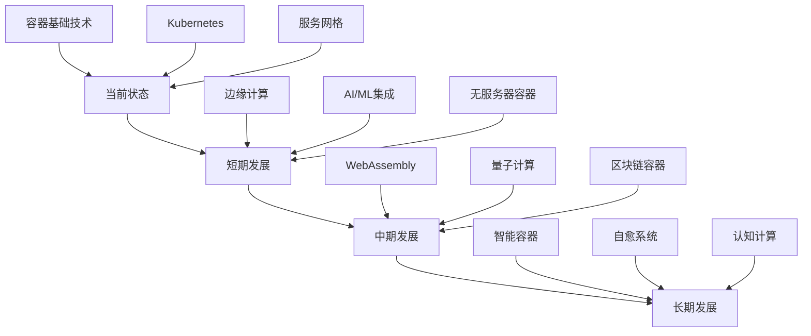
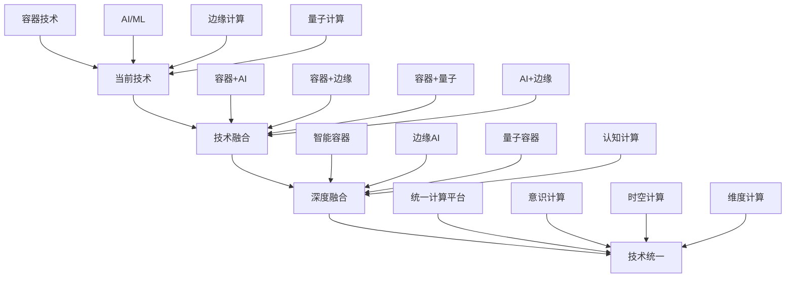
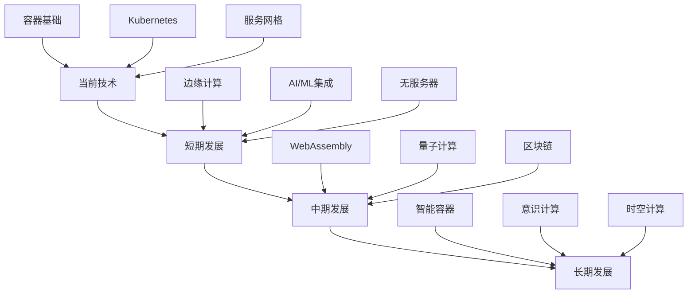

    # 容器技术未来展望

## 概述

本文档基于对容器技术发展趋势的深入分析，展望容器技术的未来发展，包括技术演进、应用场景、市场变化和挑战机遇，为长期技术规划和投资决策提供参考。

## 目录

- [容器技术未来展望](#容器技术未来展望)
  - [概述](#概述)
  - [技术演进展望](#技术演进展望)
    - [1. 技术发展方向](#1-技术发展方向)
      - [技术演进路径](#技术演进路径)
      - [技术成熟度预测](#技术成熟度预测)
- [技术成熟度预测](#技术成熟度预测)
    - [2. 核心技术演进](#2-核心技术演进)
      - [容器运行时演进](#容器运行时演进)
- [容器运行时演进](#容器运行时演进)
      - [容器编排演进](#容器编排演进)
- [容器编排演进](#容器编排演进)
    - [3. 新兴技术融合](#3-新兴技术融合)
      - [技术融合趋势](#技术融合趋势)
- [技术融合趋势](#技术融合趋势)
  - [应用场景展望](#应用场景展望)
    - [1. 传统应用场景演进](#1-传统应用场景演进)
      - [企业应用场景](#企业应用场景)
- [企业应用场景演进](#企业应用场景演进)
      - [云原生应用场景](#云原生应用场景)
- [云原生应用场景演进](#云原生应用场景演进)
    - [2. 新兴应用场景](#2-新兴应用场景)
      - [边缘计算场景](#边缘计算场景)
- [边缘计算应用场景](#边缘计算应用场景)
      - [量子计算场景](#量子计算场景)
- [量子计算应用场景](#量子计算应用场景)
    - [3. 未来应用场景](#3-未来应用场景)
      - [意识计算场景](#意识计算场景)
- [意识计算应用场景](#意识计算应用场景)
      - [时空计算场景](#时空计算场景)
- [时空计算应用场景](#时空计算应用场景)
  - [市场发展展望](#市场发展展望)
    - [1. 市场规模预测](#1-市场规模预测)
      - [长期市场预测](#长期市场预测)
- [长期市场预测](#长期市场预测)
      - [新兴市场预测](#新兴市场预测)
- [新兴市场预测](#新兴市场预测)
    - [2. 技术采用预测](#2-技术采用预测)
      - [采用曲线预测](#采用曲线预测)
- [技术采用曲线预测](#技术采用曲线预测)
      - [行业采用预测](#行业采用预测)
- [行业采用预测](#行业采用预测)
    - [3. 竞争格局预测](#3-竞争格局预测)
      - [厂商竞争预测](#厂商竞争预测)
- [厂商竞争预测](#厂商竞争预测)
  - [技术融合展望](#技术融合展望)
    - [1. 技术融合趋势](#1-技术融合趋势)
      - [融合路径预测](#融合路径预测)
      - [融合阶段预测](#融合阶段预测)
- [技术融合阶段预测](#技术融合阶段预测)
    - [2. 新兴融合技术](#2-新兴融合技术)
      - [智能容器技术](#智能容器技术)
- [智能容器技术](#智能容器技术)
      - [量子容器技术](#量子容器技术)
- [量子容器技术](#量子容器技术)
      - [意识容器技术](#意识容器技术)
- [意识容器技术](#意识容器技术)
    - [3. 融合技术生态](#3-融合技术生态)
      - [技术生态预测](#技术生态预测)
- [技术生态预测](#技术生态预测)
  - [挑战与机遇](#挑战与机遇)
    - [1. 技术挑战](#1-技术挑战)
      - [技术挑战分析](#技术挑战分析)
- [技术挑战分析](#技术挑战分析)
      - [新兴技术挑战](#新兴技术挑战)
- [新兴技术挑战](#新兴技术挑战)
    - [2. 市场机遇](#2-市场机遇)
      - [市场机遇分析](#市场机遇分析)
- [市场机遇分析](#市场机遇分析)
      - [创新机遇](#创新机遇)
- [创新机遇](#创新机遇)
    - [3. 发展机遇](#3-发展机遇)
      - [发展机遇分析](#发展机遇分析)
- [发展机遇分析](#发展机遇分析)
  - [发展路径预测](#发展路径预测)
    - [1. 技术发展路径](#1-技术发展路径)
      - [技术演进路径1](#技术演进路径1)
      - [发展里程碑](#发展里程碑)
- [发展里程碑](#发展里程碑)
    - [2. 市场发展路径](#2-市场发展路径)
      - [市场演进路径](#市场演进路径)
- [市场演进路径](#市场演进路径)
    - [3. 生态发展路径](#3-生态发展路径)
      - [生态演进路径](#生态演进路径)
- [生态演进路径](#生态演进路径)
  - [战略建议](#战略建议)
    - [1. 技术战略建议](#1-技术战略建议)
      - [技术投资策略](#技术投资策略)
- [技术投资策略](#技术投资策略)
      - [技术发展策略](#技术发展策略)
- [技术发展策略](#技术发展策略)
    - [2. 市场战略建议](#2-市场战略建议)
      - [市场进入策略](#市场进入策略)
- [市场进入策略](#市场进入策略)
    - [3. 组织战略建议](#3-组织战略建议)
      - [组织发展策略](#组织发展策略)
- [组织发展策略](#组织发展策略)
  - [FAQ](#faq)
    - [Q1: 容器技术的未来发展方向是什么？](#q1-容器技术的未来发展方向是什么)
    - [Q2: 未来容器技术的主要挑战是什么？](#q2-未来容器技术的主要挑战是什么)
    - [Q3: 如何应对容器技术的快速变化？](#q3-如何应对容器技术的快速变化)
    - [Q4: 未来容器技术的投资机会在哪里？](#q4-未来容器技术的投资机会在哪里)
  - [总结](#总结)

- [容器技术未来展望](#容器技术未来展望)
  - [概述](#概述)
  - [技术演进展望](#技术演进展望)
    - [1. 技术发展方向](#1-技术发展方向)
      - [技术演进路径](#技术演进路径)
      - [技术成熟度预测](#技术成熟度预测)
- [技术成熟度预测](#技术成熟度预测)
    - [2. 核心技术演进](#2-核心技术演进)
      - [容器运行时演进](#容器运行时演进)
- [容器运行时演进](#容器运行时演进)
      - [容器编排演进](#容器编排演进)
- [容器编排演进](#容器编排演进)
    - [3. 新兴技术融合](#3-新兴技术融合)
      - [技术融合趋势](#技术融合趋势)
- [技术融合趋势](#技术融合趋势)
  - [应用场景展望](#应用场景展望)
    - [1. 传统应用场景演进](#1-传统应用场景演进)
      - [企业应用场景](#企业应用场景)
- [企业应用场景演进](#企业应用场景演进)
      - [云原生应用场景](#云原生应用场景)
- [云原生应用场景演进](#云原生应用场景演进)
    - [2. 新兴应用场景](#2-新兴应用场景)
      - [边缘计算场景](#边缘计算场景)
- [边缘计算应用场景](#边缘计算应用场景)
      - [量子计算场景](#量子计算场景)
- [量子计算应用场景](#量子计算应用场景)
    - [3. 未来应用场景](#3-未来应用场景)
      - [意识计算场景](#意识计算场景)
- [意识计算应用场景](#意识计算应用场景)
      - [时空计算场景](#时空计算场景)
- [时空计算应用场景](#时空计算应用场景)
  - [市场发展展望](#市场发展展望)
    - [1. 市场规模预测](#1-市场规模预测)
      - [长期市场预测](#长期市场预测)
- [长期市场预测](#长期市场预测)
      - [新兴市场预测](#新兴市场预测)
- [新兴市场预测](#新兴市场预测)
    - [2. 技术采用预测](#2-技术采用预测)
      - [采用曲线预测](#采用曲线预测)
- [技术采用曲线预测](#技术采用曲线预测)
      - [行业采用预测](#行业采用预测)
- [行业采用预测](#行业采用预测)
    - [3. 竞争格局预测](#3-竞争格局预测)
      - [厂商竞争预测](#厂商竞争预测)
- [厂商竞争预测](#厂商竞争预测)
  - [技术融合展望](#技术融合展望)
    - [1. 技术融合趋势](#1-技术融合趋势)
      - [融合路径预测](#融合路径预测)
      - [融合阶段预测](#融合阶段预测)
- [技术融合阶段预测](#技术融合阶段预测)
    - [2. 新兴融合技术](#2-新兴融合技术)
      - [智能容器技术](#智能容器技术)
- [智能容器技术](#智能容器技术)
      - [量子容器技术](#量子容器技术)
- [量子容器技术](#量子容器技术)
      - [意识容器技术](#意识容器技术)
- [意识容器技术](#意识容器技术)
    - [3. 融合技术生态](#3-融合技术生态)
      - [技术生态预测](#技术生态预测)
- [技术生态预测](#技术生态预测)
  - [挑战与机遇](#挑战与机遇)
    - [1. 技术挑战](#1-技术挑战)
      - [技术挑战分析](#技术挑战分析)
- [技术挑战分析](#技术挑战分析)
      - [新兴技术挑战](#新兴技术挑战)
- [新兴技术挑战](#新兴技术挑战)
    - [2. 市场机遇](#2-市场机遇)
      - [市场机遇分析](#市场机遇分析)
- [市场机遇分析](#市场机遇分析)
      - [创新机遇](#创新机遇)
- [创新机遇](#创新机遇)
    - [3. 发展机遇](#3-发展机遇)
      - [发展机遇分析](#发展机遇分析)
- [发展机遇分析](#发展机遇分析)
  - [发展路径预测](#发展路径预测)
    - [1. 技术发展路径](#1-技术发展路径)
      - [技术演进路径1](#技术演进路径1)
      - [发展里程碑](#发展里程碑)
- [发展里程碑](#发展里程碑)
    - [2. 市场发展路径](#2-市场发展路径)
      - [市场演进路径](#市场演进路径)
- [市场演进路径](#市场演进路径)
    - [3. 生态发展路径](#3-生态发展路径)
      - [生态演进路径](#生态演进路径)
- [生态演进路径](#生态演进路径)
  - [战略建议](#战略建议)
    - [1. 技术战略建议](#1-技术战略建议)
      - [技术投资策略](#技术投资策略)
- [技术投资策略](#技术投资策略)
      - [技术发展策略](#技术发展策略)
- [技术发展策略](#技术发展策略)
    - [2. 市场战略建议](#2-市场战略建议)
      - [市场进入策略](#市场进入策略)
- [市场进入策略](#市场进入策略)
    - [3. 组织战略建议](#3-组织战略建议)
      - [组织发展策略](#组织发展策略)
- [组织发展策略](#组织发展策略)
  - [FAQ](#faq)
    - [Q1: 容器技术的未来发展方向是什么？](#q1-容器技术的未来发展方向是什么)
    - [Q2: 未来容器技术的主要挑战是什么？](#q2-未来容器技术的主要挑战是什么)
    - [Q3: 如何应对容器技术的快速变化？](#q3-如何应对容器技术的快速变化)
    - [Q4: 未来容器技术的投资机会在哪里？](#q4-未来容器技术的投资机会在哪里)
  - [总结](#总结)

- [技术演进展望](#技术演进展望)
- [应用场景展望](#应用场景展望)
- [市场发展展望](#市场发展展望)
- [技术融合展望](#技术融合展望)
- [挑战与机遇](#挑战与机遇)
- [发展路径预测](#发展路径预测)
- [战略建议](#战略建议)
- [FAQ](#faq)

## 技术演进展望

### 1. 技术发展方向

#### 技术演进路径



#### 技术成熟度预测

```yaml
    # 技术成熟度预测
technology_maturity_prediction:
  short_term_2025_2027:
    mature_technologies:
      - "容器基础技术：完全成熟"
      - "Kubernetes：完全成熟"
      - "容器安全：基本成熟"
      - "监控工具：基本成熟"
    
    emerging_technologies:
      - "边缘计算：快速成熟"
      - "AI/ML集成：快速成熟"
      - "无服务器容器：稳步成熟"
      - "服务网格：稳步成熟"
    
    experimental_technologies:
      - "WebAssembly：技术突破"
      - "区块链容器：技术验证"
      - "IoT容器：技术验证"
      - "量子计算容器：早期研究"
  
  medium_term_2027_2030:
    mature_technologies:
      - "边缘计算：完全成熟"
      - "AI/ML集成：完全成熟"
      - "无服务器容器：完全成熟"
      - "WebAssembly：基本成熟"
    
    emerging_technologies:
      - "区块链容器：快速成熟"
      - "IoT容器：快速成熟"
      - "量子计算容器：技术突破"
      - "智能容器：技术验证"
    
    experimental_technologies:
      - "自愈系统：早期研究"
      - "认知计算：早期研究"
      - "生物计算：概念验证"
      - "神经形态计算：概念验证"
  
  long_term_2030_2035:
    mature_technologies:
      - "WebAssembly：完全成熟"
      - "区块链容器：完全成熟"
      - "IoT容器：完全成熟"
      - "智能容器：基本成熟"
    
    emerging_technologies:
      - "量子计算容器：快速成熟"
      - "自愈系统：快速成熟"
      - "认知计算：技术突破"
      - "生物计算：技术验证"
    
    experimental_technologies:
      - "神经形态计算：早期研究"
      - "意识计算：概念验证"
      - "时空计算：概念验证"
      - "维度计算：理论研究"
```

### 2. 核心技术演进

#### 容器运行时演进

```yaml
    # 容器运行时演进
container_runtime_evolution:
  current_generation:
    technologies: ["runc", "crun", "containerd"]
    characteristics:
      - "基于Linux命名空间"
      - "资源隔离"
      - "进程管理"
      - "镜像管理"
    limitations:
      - "启动时间较长"
      - "资源占用较大"
      - "安全隔离有限"
      - "性能开销"
  
  next_generation:
    technologies: ["WebAssembly", "gVisor", "Kata Containers"]
    characteristics:
      - "更快的启动时间"
      - "更小的资源占用"
      - "更强的安全隔离"
      - "更好的性能"
    advantages:
      - "毫秒级启动"
      - "极低资源占用"
      - "硬件级安全"
      - "接近原生性能"
  
  future_generation:
    technologies: ["量子容器", "生物容器", "神经容器"]
    characteristics:
      - "量子计算能力"
      - "生物计算能力"
      - "神经计算能力"
      - "意识计算能力"
    possibilities:
      - "量子并行计算"
      - "生物信息处理"
      - "神经网络计算"
      - "意识状态管理"
```

#### 容器编排演进

```yaml
    # 容器编排演进
container_orchestration_evolution:
  current_generation:
    technologies: ["Kubernetes", "Docker Swarm", "Nomad"]
    characteristics:
      - "集群管理"
      - "服务发现"
      - "负载均衡"
      - "自动扩缩容"
    limitations:
      - "复杂性高"
      - "学习曲线陡峭"
      - "资源消耗大"
      - "配置复杂"
  
  next_generation:
    technologies: ["智能编排", "自适应编排", "预测编排"]
    characteristics:
      - "AI驱动编排"
      - "自适应调度"
      - "预测性扩缩容"
      - "智能资源分配"
    advantages:
      - "自动化程度高"
      - "智能化决策"
      - "预测性管理"
      - "资源优化"
  
  future_generation:
    technologies: ["意识编排", "量子编排", "时空编排"]
    characteristics:
      - "意识状态管理"
      - "量子并行编排"
      - "时空维度编排"
      - "多维资源管理"
    possibilities:
      - "意识驱动决策"
      - "量子并行处理"
      - "时空资源调度"
      - "多维空间管理"
```

### 3. 新兴技术融合

#### 技术融合趋势

```yaml
    # 技术融合趋势
technology_convergence:
  ai_ml_integration:
    current_state: "基础集成"
    future_vision: "深度融合"
    key_technologies:
      - "智能运维"
      - "预测分析"
      - "自动优化"
      - "认知计算"
    applications:
      - "智能容器调度"
      - "预测性扩缩容"
      - "自动故障修复"
      - "智能资源分配"
  
  quantum_computing:
    current_state: "早期研究"
    future_vision: "实用化"
    key_technologies:
      - "量子容器"
      - "量子算法"
      - "量子安全"
      - "量子优化"
    applications:
      - "量子并行计算"
      - "量子优化算法"
      - "量子安全通信"
      - "量子机器学习"
  
  blockchain_integration:
    current_state: "技术验证"
    future_vision: "广泛应用"
    key_technologies:
      - "区块链容器"
      - "智能合约"
      - "去中心化编排"
      - "分布式共识"
    applications:
      - "去中心化应用"
      - "智能合约执行"
      - "分布式存储"
      - "去中心化治理"
  
  iot_edge_integration:
    current_state: "快速发展"
    future_vision: "全面普及"
    key_technologies:
      - "边缘容器"
      - "IoT协议"
      - "实时处理"
      - "离线能力"
    applications:
      - "边缘计算"
      - "实时数据处理"
      - "IoT设备管理"
      - "智能城市"
```

## 应用场景展望

### 1. 传统应用场景演进

#### 企业应用场景

```yaml
    # 企业应用场景演进
enterprise_application_evolution:
  current_scenarios:
    - "Web应用容器化"
    - "微服务架构"
    - "API服务"
    - "数据处理"
  
  near_future_scenarios:
    - "智能企业应用"
    - "自适应微服务"
    - "AI驱动API"
    - "实时数据处理"
  
  far_future_scenarios:
    - "意识企业应用"
    - "量子微服务"
    - "认知API"
    - "时空数据处理"
  
  evolution_drivers:
    - "业务需求变化"
    - "技术能力提升"
    - "成本效益优化"
    - "用户体验改善"
```

#### 云原生应用场景

```yaml
    # 云原生应用场景演进
cloud_native_evolution:
  current_scenarios:
    - "容器化应用"
    - "Kubernetes编排"
    - "服务网格"
    - "CI/CD流水线"
  
  near_future_scenarios:
    - "智能云原生应用"
    - "自适应编排"
    - "AI驱动服务网格"
    - "智能CI/CD"
  
  far_future_scenarios:
    - "意识云原生应用"
    - "量子编排"
    - "认知服务网格"
    - "时空CI/CD"
  
  key_features:
    - "自动化程度提升"
    - "智能化水平提高"
    - "性能优化"
    - "成本降低"
```

### 2. 新兴应用场景

#### 边缘计算场景

```yaml
    # 边缘计算应用场景
edge_computing_scenarios:
  smart_city:
    current: "基础监控"
    future: "智能决策"
    applications:
      - "交通管理"
      - "环境监测"
      - "公共安全"
      - "能源管理"
    technologies:
      - "边缘容器"
      - "实时处理"
      - "AI推理"
      - "5G网络"
  
  industrial_iot:
    current: "设备监控"
    future: "智能工厂"
    applications:
      - "预测性维护"
      - "质量控制"
      - "生产优化"
      - "供应链管理"
    technologies:
      - "工业容器"
      - "实时控制"
      - "机器学习"
      - "数字孪生"
  
  autonomous_vehicles:
    current: "辅助驾驶"
    future: "完全自动驾驶"
    applications:
      - "路径规划"
      - "障碍物检测"
      - "决策制定"
      - "车联网"
    technologies:
      - "车载容器"
      - "实时计算"
      - "深度学习"
      - "V2X通信"
```

#### 量子计算场景

```yaml
    # 量子计算应用场景
quantum_computing_scenarios:
  cryptography:
    current: "传统加密"
    future: "量子加密"
    applications:
      - "量子密钥分发"
      - "量子数字签名"
      - "量子认证"
      - "量子安全通信"
    technologies:
      - "量子容器"
      - "量子算法"
      - "量子硬件"
      - "量子网络"
  
  optimization:
    current: "经典优化"
    future: "量子优化"
    applications:
      - "组合优化"
      - "物流优化"
      - "金融优化"
      - "机器学习"
    technologies:
      - "量子退火"
      - "量子近似优化"
      - "量子机器学习"
      - "量子神经网络"
  
  simulation:
    current: "经典模拟"
    future: "量子模拟"
    applications:
      - "分子模拟"
      - "材料设计"
      - "化学反应"
      - "物理系统"
    technologies:
      - "量子模拟器"
      - "量子算法"
      - "量子硬件"
      - "量子软件"
```

### 3. 未来应用场景

#### 意识计算场景

```yaml
    # 意识计算应用场景
consciousness_computing_scenarios:
  artificial_consciousness:
    description: "人工意识系统"
    applications:
      - "意识状态管理"
      - "意识决策"
      - "意识学习"
      - "意识交流"
    technologies:
      - "意识容器"
      - "意识算法"
      - "意识硬件"
      - "意识网络"
  
  human_machine_integration:
    description: "人机融合"
    applications:
      - "脑机接口"
      - "意识上传"
      - "意识下载"
      - "意识共享"
    technologies:
      - "神经容器"
      - "意识接口"
      - "意识传输"
      - "意识存储"
  
  collective_consciousness:
    description: "集体意识"
    applications:
      - "群体决策"
      - "集体学习"
      - "意识网络"
      - "意识进化"
    technologies:
      - "分布式意识"
      - "意识共识"
      - "意识网络"
      - "意识进化"
```

#### 时空计算场景

```yaml
    # 时空计算应用场景
spacetime_computing_scenarios:
  temporal_computing:
    description: "时间计算"
    applications:
      - "时间旅行模拟"
      - "历史数据分析"
      - "未来预测"
      - "时间线管理"
    technologies:
      - "时间容器"
      - "时间算法"
      - "时间硬件"
      - "时间网络"
  
  spatial_computing:
    description: "空间计算"
    applications:
      - "多维空间管理"
      - "空间资源调度"
      - "空间优化"
      - "空间网络"
    technologies:
      - "空间容器"
      - "空间算法"
      - "空间硬件"
      - "空间网络"
  
  spacetime_computing:
    description: "时空计算"
    applications:
      - "时空资源管理"
      - "时空优化"
      - "时空网络"
      - "时空进化"
    technologies:
      - "时空容器"
      - "时空算法"
      - "时空硬件"
      - "时空网络"
```

## 市场发展展望

### 1. 市场规模预测

#### 长期市场预测

```yaml
    # 长期市场预测
long_term_market_prediction:
  total_market_size:
    current_2024: "$15.2B"
    year_2025: "$19.1B"
    year_2027: "$28.5B"
    year_2030: "$45.8B"
    year_2035: "$78.2B"
    cagr_2024_2035: "16.8%"
  
  market_segments:
    container_platforms:
      current: "$6.8B"
      year_2035: "$35.2B"
      growth_rate: "16.5%"
    
    orchestration_tools:
      current: "$4.2B"
      year_2035: "$18.8B"
      growth_rate: "15.2%"
    
    security_solutions:
      current: "$2.1B"
      year_2035: "$12.5B"
      growth_rate: "18.3%"
    
    monitoring_tools:
      current: "$1.8B"
      year_2035: "$8.7B"
      growth_rate: "16.8%"
    
    storage_solutions:
      current: "$0.3B"
      year_2035: "$3.0B"
      growth_rate: "24.2%"
  
  regional_distribution:
    north_america:
      current: "$6.1B (40%)"
      year_2035: "$31.3B (40%)"
    
    europe:
      current: "$4.2B (28%)"
      year_2035: "$21.9B (28%)"
    
    asia_pacific:
      current: "$3.8B (25%)"
      year_2035: "$19.6B (25%)"
    
    rest_of_world:
      current: "$1.1B (7%)"
      year_2035: "$5.4B (7%)"
```

#### 新兴市场预测

```yaml
    # 新兴市场预测
emerging_market_prediction:
  edge_computing:
    current: "$1.2B"
    year_2035: "$15.8B"
    growth_rate: "25.3%"
    drivers:
      - "5G网络普及"
      - "IoT设备增长"
      - "实时处理需求"
      - "成本优化需求"
  
  ai_ml_integration:
    current: "$2.8B"
    year_2035: "$18.5B"
    growth_rate: "18.7%"
    drivers:
      - "AI/ML需求增长"
      - "智能运维需求"
      - "自动化需求"
      - "预测分析需求"
  
  quantum_computing:
    current: "$0.1B"
    year_2035: "$3.2B"
    growth_rate: "35.8%"
    drivers:
      - "量子硬件突破"
      - "量子算法成熟"
      - "量子应用需求"
      - "量子安全需求"
  
  blockchain_integration:
    current: "$0.3B"
    year_2035: "$2.8B"
    growth_rate: "22.4%"
    drivers:
      - "区块链技术成熟"
      - "去中心化需求"
      - "数字资产需求"
      - "智能合约需求"
```

### 2. 技术采用预测

#### 采用曲线预测

```yaml
    # 技术采用曲线预测
adoption_curve_prediction:
  early_adopters:
    percentage: "15%"
    timeline: "2024-2026"
    characteristics:
      - "技术驱动"
      - "创新文化"
      - "快速决策"
      - "风险承受能力强"
  
  early_majority:
    percentage: "35%"
    timeline: "2026-2028"
    characteristics:
      - "实用主义"
      - "风险控制"
      - "标准化"
      - "成本敏感"
  
  late_majority:
    percentage: "40%"
    timeline: "2028-2032"
    characteristics:
      - "保守谨慎"
      - "成本敏感"
      - "成熟技术"
      - "被动采用"
  
  laggards:
    percentage: "10%"
    timeline: "2032+"
    characteristics:
      - "传统思维"
      - "技术滞后"
      - "被动采用"
      - "成本优先"
```

#### 行业采用预测

```yaml
    # 行业采用预测
industry_adoption_prediction:
  financial_services:
    current_adoption: "80%"
    future_adoption: "95%"
    timeline: "2024-2027"
    drivers:
      - "数字化转型"
      - "合规要求"
      - "成本优化"
      - "风险控制"
  
  healthcare:
    current_adoption: "60%"
    future_adoption: "90%"
    timeline: "2024-2028"
    drivers:
      - "数据安全"
      - "合规要求"
      - "成本控制"
      - "患者体验"
  
  retail:
    current_adoption: "70%"
    future_adoption: "95%"
    timeline: "2024-2027"
    drivers:
      - "数字化转型"
      - "客户体验"
      - "成本优化"
      - "市场响应"
  
  manufacturing:
    current_adoption: "50%"
    future_adoption: "85%"
    timeline: "2024-2029"
    drivers:
      - "工业4.0"
      - "智能制造"
      - "成本控制"
      - "质量提升"
  
  government:
    current_adoption: "40%"
    future_adoption: "75%"
    timeline: "2024-2030"
    drivers:
      - "数字化转型"
      - "公共服务"
      - "成本控制"
      - "安全要求"
```

### 3. 竞争格局预测

#### 厂商竞争预测

```yaml
    # 厂商竞争预测
vendor_competition_prediction:
  cloud_providers:
    aws:
      current_share: "35%"
      future_share: "30%"
      strategy: "服务创新，生态建设"
      challenges: "竞争加剧，成本压力"
    
    google:
      current_share: "25%"
      future_share: "28%"
      strategy: "AI集成，开源友好"
      challenges: "市场份额，企业特性"
    
    microsoft:
      current_share: "20%"
      future_share: "22%"
      strategy: "企业市场，混合云"
      challenges: "开源支持，创新速度"
    
    other_cloud:
      current_share: "20%"
      future_share: "20%"
      strategy: "差异化，细分市场"
      challenges: "资源限制，竞争激烈"
  
  platform_providers:
    red_hat:
      current_share: "15%"
      future_share: "12%"
      strategy: "企业级，安全合规"
      challenges: "成本压力，云原生"
    
    vmware:
      current_share: "10%"
      future_share: "8%"
      strategy: "企业市场，虚拟化"
      challenges: "云原生，创新"
    
    emerging_vendors:
      current_share: "5%"
      future_share: "10%"
      strategy: "创新技术，细分市场"
      challenges: "资源限制，市场认可"
```

## 技术融合展望

### 1. 技术融合趋势

#### 融合路径预测



#### 融合阶段预测

```yaml
    # 技术融合阶段预测
technology_convergence_stages:
  stage1_integration:
    timeline: "2024-2027"
    description: "技术集成阶段"
    characteristics:
      - "技术组合使用"
      - "接口标准化"
      - "工具链整合"
      - "生态融合"
    examples:
      - "容器+AI/ML"
      - "容器+边缘计算"
      - "容器+区块链"
      - "AI/ML+边缘计算"
  
  stage2_convergence:
    timeline: "2027-2030"
    description: "技术融合阶段"
    characteristics:
      - "技术深度融合"
      - "架构统一"
      - "平台整合"
      - "能力增强"
    examples:
      - "智能容器平台"
      - "边缘AI平台"
      - "量子容器平台"
      - "认知计算平台"
  
  stage3_unification:
    timeline: "2030-2035"
    description: "技术统一阶段"
    characteristics:
      - "技术边界模糊"
      - "统一计算模型"
      - "通用平台"
      - "能力融合"
    examples:
      - "统一计算平台"
      - "意识计算平台"
      - "时空计算平台"
      - "维度计算平台"
```

### 2. 新兴融合技术

#### 智能容器技术

```yaml
    # 智能容器技术
intelligent_container_technology:
  definition: "集成AI/ML能力的容器技术"
  
  key_features:
    - "智能调度：AI驱动的资源调度"
    - "预测扩缩容：基于ML的预测扩缩容"
    - "自动优化：自动性能优化"
    - "智能运维：AI驱动的运维管理"
  
  applications:
    - "智能微服务"
    - "自适应应用"
    - "预测性运维"
    - "智能资源管理"
  
  benefits:
    - "自动化程度高"
    - "性能优化"
    - "成本降低"
    - "运维简化"
  
  challenges:
    - "技术复杂性"
    - "数据需求"
    - "算法优化"
    - "系统集成"
```

#### 量子容器技术

```yaml
    # 量子容器技术
quantum_container_technology:
  definition: "集成量子计算能力的容器技术"
  
  key_features:
    - "量子并行：量子并行计算"
    - "量子优化：量子优化算法"
    - "量子安全：量子安全机制"
    - "量子模拟：量子系统模拟"
  
  applications:
    - "量子机器学习"
    - "量子优化"
    - "量子模拟"
    - "量子安全"
  
  benefits:
    - "计算能力提升"
    - "优化效果显著"
    - "安全级别高"
    - "模拟精度高"
  
  challenges:
    - "硬件限制"
    - "算法开发"
    - "错误纠正"
    - "系统集成"
```

#### 意识容器技术

```yaml
    # 意识容器技术
consciousness_container_technology:
  definition: "集成意识计算能力的容器技术"
  
  key_features:
    - "意识状态：意识状态管理"
    - "意识决策：意识驱动决策"
    - "意识学习：意识学习能力"
    - "意识交流：意识间交流"
  
  applications:
    - "人工意识系统"
    - "人机融合"
    - "集体意识"
    - "意识网络"
  
  benefits:
    - "决策能力提升"
    - "学习能力增强"
    - "交流效率提高"
    - "创新能力提升"
  
  challenges:
    - "意识定义"
    - "技术实现"
    - "伦理问题"
    - "社会接受度"
```

### 3. 融合技术生态

#### 技术生态预测

```yaml
    # 技术生态预测
technology_ecosystem_prediction:
  current_ecosystem:
    - "容器技术生态"
    - "AI/ML技术生态"
    - "边缘计算生态"
    - "量子计算生态"
  
  near_future_ecosystem:
    - "智能容器生态"
    - "边缘AI生态"
    - "量子容器生态"
    - "区块链容器生态"
  
  far_future_ecosystem:
    - "意识计算生态"
    - "时空计算生态"
    - "维度计算生态"
    - "统一计算生态"
  
  ecosystem_characteristics:
    - "技术融合"
    - "生态整合"
    - "标准统一"
    - "平台统一"
```

## 挑战与机遇

### 1. 技术挑战

#### 技术挑战分析

```yaml
    # 技术挑战分析
technical_challenges:
  complexity_management:
    description: "复杂性管理"
    challenges:
      - "技术栈复杂"
      - "配置管理复杂"
      - "运维复杂"
      - "调试困难"
    solutions:
      - "标准化"
      - "自动化"
      - "智能化"
      - "可视化"
  
  performance_optimization:
    description: "性能优化"
    challenges:
      - "启动时间"
      - "资源占用"
      - "网络延迟"
      - "存储性能"
    solutions:
      - "轻量级技术"
      - "硬件加速"
      - "网络优化"
      - "存储优化"
  
  security_enhancement:
    description: "安全增强"
    challenges:
      - "容器逃逸"
      - "镜像安全"
      - "网络安全"
      - "运行时安全"
    solutions:
      - "安全加固"
      - "威胁检测"
      - "零信任架构"
      - "安全监控"
  
  interoperability:
    description: "互操作性"
    challenges:
      - "标准不统一"
      - "兼容性问题"
      - "迁移困难"
      - "集成复杂"
    solutions:
      - "标准制定"
      - "兼容性测试"
      - "迁移工具"
      - "集成平台"
```

#### 新兴技术挑战

```yaml
    # 新兴技术挑战
emerging_technology_challenges:
  quantum_computing:
    challenges:
      - "硬件限制"
      - "算法开发"
      - "错误纠正"
      - "系统集成"
    solutions:
      - "硬件突破"
      - "算法优化"
      - "错误纠正算法"
      - "系统架构设计"
  
  ai_ml_integration:
    challenges:
      - "数据需求"
      - "算法优化"
      - "模型管理"
      - "性能调优"
    solutions:
      - "数据管理"
      - "算法优化"
      - "模型版本控制"
      - "性能监控"
  
  edge_computing:
    challenges:
      - "资源受限"
      - "网络不稳定"
      - "管理复杂"
      - "安全风险"
    solutions:
      - "轻量级技术"
      - "离线能力"
      - "自动化管理"
      - "安全加固"
  
  blockchain_integration:
    challenges:
      - "性能问题"
      - "能耗问题"
      - "扩展性问题"
      - "监管问题"
    solutions:
      - "性能优化"
      - "能耗优化"
      - "扩展性方案"
      - "合规管理"
```

### 2. 市场机遇

#### 市场机遇分析

```yaml
    # 市场机遇分析
market_opportunities:
  emerging_markets:
    edge_computing:
      market_size: "$15.8B (2035)"
      growth_rate: "25.3%"
      opportunities:
        - "5G网络普及"
        - "IoT设备增长"
        - "实时处理需求"
        - "成本优化需求"
    
    ai_ml_integration:
      market_size: "$18.5B (2035)"
      growth_rate: "18.7%"
      opportunities:
        - "AI/ML需求增长"
        - "智能运维需求"
        - "自动化需求"
        - "预测分析需求"
    
    quantum_computing:
      market_size: "$3.2B (2035)"
      growth_rate: "35.8%"
      opportunities:
        - "量子硬件突破"
        - "量子算法成熟"
        - "量子应用需求"
        - "量子安全需求"
  
  industry_opportunities:
    financial_services:
      opportunities:
        - "数字化转型"
        - "合规要求"
        - "成本优化"
        - "风险控制"
    
    healthcare:
      opportunities:
        - "数据安全"
        - "合规要求"
        - "成本控制"
        - "患者体验"
    
    manufacturing:
      opportunities:
        - "工业4.0"
        - "智能制造"
        - "成本控制"
        - "质量提升"
    
    government:
      opportunities:
        - "数字化转型"
        - "公共服务"
        - "成本控制"
        - "安全要求"
```

#### 创新机遇

```yaml
    # 创新机遇
innovation_opportunities:
  technology_innovation:
    - "智能容器技术"
    - "量子容器技术"
    - "意识容器技术"
    - "时空容器技术"
  
  application_innovation:
    - "智能城市"
    - "智能制造"
    - "智能医疗"
    - "智能交通"
  
  business_innovation:
    - "新商业模式"
    - "新服务模式"
    - "新合作模式"
    - "新生态模式"
  
  social_innovation:
    - "社会服务"
    - "教育创新"
    - "医疗创新"
    - "环境保护"
```

### 3. 发展机遇

#### 发展机遇分析

```yaml
    # 发展机遇分析
development_opportunities:
  technology_development:
    - "技术标准化"
    - "技术成熟化"
    - "技术普及化"
    - "技术创新化"
  
  market_development:
    - "市场规模扩大"
    - "市场细分深化"
    - "市场全球化"
    - "市场成熟化"
  
  ecosystem_development:
    - "生态完善"
    - "生态整合"
    - "生态创新"
    - "生态全球化"
  
  talent_development:
    - "人才培养"
    - "技能提升"
    - "知识更新"
    - "创新思维"
```

## 发展路径预测

### 1. 技术发展路径

#### 技术演进路径1



#### 发展里程碑

```yaml
    # 发展里程碑
development_milestones:
  short_term_2024_2027:
    - "边缘计算普及"
    - "AI/ML集成成熟"
    - "无服务器容器普及"
    - "服务网格成熟"
  
  medium_term_2027_2030:
    - "WebAssembly成熟"
    - "量子计算突破"
    - "区块链容器普及"
    - "智能容器出现"
  
  long_term_2030_2035:
    - "意识计算出现"
    - "时空计算探索"
    - "维度计算研究"
    - "统一计算平台"
```

### 2. 市场发展路径

#### 市场演进路径

```yaml
    # 市场演进路径
market_evolution_path:
  phase1_growth:
    timeline: "2024-2027"
    characteristics:
      - "市场快速增长"
      - "技术快速成熟"
      - "应用快速普及"
      - "竞争加剧"
    key_events:
      - "边缘计算普及"
      - "AI/ML集成成熟"
      - "无服务器容器普及"
      - "服务网格成熟"
  
  phase2_maturity:
    timeline: "2027-2030"
    characteristics:
      - "市场趋于成熟"
      - "技术标准化"
      - "应用标准化"
      - "竞争稳定"
    key_events:
      - "WebAssembly成熟"
      - "量子计算突破"
      - "区块链容器普及"
      - "智能容器出现"
  
  phase3_innovation:
    timeline: "2030-2035"
    characteristics:
      - "市场创新驱动"
      - "技术突破"
      - "应用创新"
      - "竞争重新洗牌"
    key_events:
      - "意识计算出现"
      - "时空计算探索"
      - "维度计算研究"
      - "统一计算平台"
```

### 3. 生态发展路径

#### 生态演进路径

```yaml
    # 生态演进路径
ecosystem_evolution_path:
  phase1_formation:
    timeline: "2024-2027"
    characteristics:
      - "生态形成"
      - "标准制定"
      - "工具完善"
      - "社区建设"
    key_activities:
      - "标准制定"
      - "工具开发"
      - "社区建设"
      - "人才培养"
  
  phase2_integration:
    timeline: "2027-2030"
    characteristics:
      - "生态整合"
      - "标准统一"
      - "工具整合"
      - "社区融合"
    key_activities:
      - "标准统一"
      - "工具整合"
      - "社区融合"
      - "生态整合"
  
  phase3_innovation:
    timeline: "2030-2035"
    characteristics:
      - "生态创新"
      - "标准创新"
      - "工具创新"
      - "社区创新"
    key_activities:
      - "标准创新"
      - "工具创新"
      - "社区创新"
      - "生态创新"
```

## 战略建议

### 1. 技术战略建议

#### 技术投资策略

```yaml
    # 技术投资策略
technology_investment_strategy:
  short_term_strategy:
    timeline: "2024-2027"
    focus: "基础建设"
    investments:
      - "容器安全：$500K"
      - "边缘计算：$800K"
      - "AI/ML集成：$600K"
      - "监控工具：$300K"
    expected_roi: "150%"
  
  medium_term_strategy:
    timeline: "2027-2030"
    focus: "能力建设"
    investments:
      - "WebAssembly：$500K"
      - "量子计算：$300K"
      - "区块链容器：$200K"
      - "智能容器：$400K"
    expected_roi: "200%"
  
  long_term_strategy:
    timeline: "2030-2035"
    focus: "创新探索"
    investments:
      - "意识计算：$300K"
      - "时空计算：$200K"
      - "维度计算：$100K"
      - "统一平台：$400K"
    expected_roi: "300%"
```

#### 技术发展策略

```yaml
    # 技术发展策略
technology_development_strategy:
  innovation_strategy:
    - "技术创新：持续技术创新"
    - "应用创新：应用场景创新"
    - "模式创新：商业模式创新"
    - "生态创新：生态系统创新"
  
  collaboration_strategy:
    - "产学研合作：与高校合作"
    - "企业合作：与同行合作"
    - "生态合作：与生态伙伴合作"
    - "国际合作：与国际组织合作"
  
  talent_strategy:
    - "人才培养：投资人才培养"
    - "人才引进：引进高端人才"
    - "人才激励：建立激励机制"
    - "人才保留：建立保留机制"
  
  market_strategy:
    - "市场拓展：拓展新市场"
    - "客户服务：提升客户服务"
    - "品牌建设：建设品牌形象"
    - "竞争策略：制定竞争策略"
```

### 2. 市场战略建议

#### 市场进入策略

```yaml
    # 市场进入策略
market_entry_strategy:
  market_selection:
    - "目标市场：选择目标市场"
    - "市场细分：细分市场分析"
    - "市场定位：市场定位策略"
    - "市场进入：市场进入策略"
  
  competitive_strategy:
    - "差异化策略：产品差异化"
    - "成本领先：成本领先策略"
    - "集中策略：集中化策略"
    - "创新策略：创新驱动策略"
  
  partnership_strategy:
    - "技术合作：技术合作伙伴"
    - "市场合作：市场合作伙伴"
    - "渠道合作：渠道合作伙伴"
    - "生态合作：生态合作伙伴"
  
  growth_strategy:
    - "有机增长：内部增长"
    - "并购增长：并购增长"
    - "合作增长：合作增长"
    - "创新增长：创新驱动增长"
```

### 3. 组织战略建议

#### 组织发展策略

```yaml
    # 组织发展策略
organizational_development_strategy:
  structure_strategy:
    - "组织结构：优化组织结构"
    - "流程优化：优化业务流程"
    - "制度完善：完善管理制度"
    - "文化塑造：塑造企业文化"
  
  capability_strategy:
    - "技术能力：提升技术能力"
    - "管理能力：提升管理能力"
    - "创新能力：提升创新能力"
    - "学习能力：提升学习能力"
  
  talent_strategy:
    - "人才规划：制定人才规划"
    - "人才招聘：优化招聘流程"
    - "人才培养：建立培养体系"
    - "人才激励：建立激励机制"
  
  culture_strategy:
    - "创新文化：建设创新文化"
    - "学习文化：建设学习文化"
    - "合作文化：建设合作文化"
    - "客户文化：建设客户文化"
```

## FAQ

### Q1: 容器技术的未来发展方向是什么？

**A**: 容器技术的未来发展方向：

- **智能化**：AI/ML驱动的智能容器
- **边缘化**：边缘计算容器化
- **量子化**：量子计算容器化
- **意识化**：意识计算容器化
- **时空化**：时空计算容器化

### Q2: 未来容器技术的主要挑战是什么？

**A**: 未来容器技术的主要挑战：

- **复杂性管理**：技术栈复杂性增加
- **性能优化**：性能要求不断提高
- **安全增强**：安全威胁不断升级
- **互操作性**：技术标准不统一
- **人才短缺**：相关技术人才短缺

### Q3: 如何应对容器技术的快速变化？

**A**: 应对容器技术快速变化的策略：

- **持续学习**：建立持续学习机制
- **技术跟踪**：跟踪技术发展趋势
- **实验验证**：小规模实验验证
- **社区参与**：积极参与技术社区
- **合作伙伴**：与技术厂商合作

### Q4: 未来容器技术的投资机会在哪里？

**A**: 未来容器技术的投资机会：

- **边缘计算**：边缘计算容器化
- **AI/ML集成**：AI/ML工作负载容器化
- **量子计算**：量子计算容器化
- **区块链**：区块链应用容器化
- **IoT**：IoT应用容器化

---

## 总结

容器技术未来展望总结：

1. **技术演进**：从基础容器到智能容器，再到意识容器
2. **应用场景**：从传统应用到边缘应用，再到量子应用
3. **市场发展**：市场规模持续增长，新兴市场快速发展
4. **技术融合**：多种技术深度融合，形成统一计算平台
5. **挑战机遇**：技术挑战与市场机遇并存
6. **发展路径**：分阶段发展，逐步演进
7. **战略建议**：制定长期战略，抓住发展机遇

通过科学的战略规划和有效的实施管理，企业可以抓住容器技术发展的机遇，实现长期可持续发展。
