# 2025年容器技术与虚拟化知识体系架构图

## 目录

- [2025年容器技术与虚拟化知识体系架构图](#2025年容器技术与虚拟化知识体系架构图)
  - [知识体系总体架构](#知识体系总体架构)
  - [知识体系层次结构](#知识体系层次结构)
    - [第一层：理论基础层 (01_理论基础)](#第一层理论基础层-01_理论基础)
    - [第二层：技术标准层 (02_技术标准与规范)](#第二层技术标准层-02_技术标准与规范)
    - [第三层：技术实现层 (03_vSphere_VMware技术体系 + 04_容器技术详解)](#第三层技术实现层-03_vsphere_vmware技术体系-04_容器技术详解)
    - [第四层：硬件支持层 (05_硬件支持分析)](#第四层硬件支持层-05_硬件支持分析)
    - [第五层：软件堆栈层 (06_软件堆栈分析)](#第五层软件堆栈层-06_软件堆栈分析)
    - [第六层：系统分析层 (07_执行流控制流数据流 + 08_分布式系统分析)](#第六层系统分析层-07_执行流控制流数据流-08_分布式系统分析)
    - [第七层：形式化论证层 (10_形式化论证)](#第七层形式化论证层-10_形式化论证)
    - [第八层：实践应用层 (11_实践案例与最佳实践)](#第八层实践应用层-11_实践案例与最佳实践)
    - [第九层：国际对标层 (12_国际对标分析)](#第九层国际对标层-12_国际对标分析)
    - [第十层：学习认证层 (13_学习路径与认证)](#第十层学习认证层-13_学习路径与认证)
    - [第十一层：研究发展层 (14_技术研究与发展趋势)](#第十一层研究发展层-14_技术研究与发展趋势)
  - [知识体系特点](#知识体系特点)
    - [1. 全面性](#1-全面性)
    - [2. 严谨性](#2-严谨性)
    - [3. 系统性](#3-系统性)
    - [4. 实用性](#4-实用性)
    - [5. 国际性](#5-国际性)
    - [6. 前瞻性](#6-前瞻性)
  - [知识体系应用场景](#知识体系应用场景)
    - [1. 学术研究](#1-学术研究)
    - [2. 企业应用](#2-企业应用)
    - [3. 教育培训](#3-教育培训)
    - [4. 技术咨询](#4-技术咨询)
    - [5. 产品开发](#5-产品开发)

- [2025年容器技术与虚拟化知识体系架构图](#2025年容器技术与虚拟化知识体系架构图)
  - [知识体系总体架构](#知识体系总体架构)
  - [知识体系层次结构](#知识体系层次结构)
    - [第一层：理论基础层 (01_理论基础)](#第一层理论基础层-01_理论基础)
    - [第二层：技术标准层 (02_技术标准与规范)](#第二层技术标准层-02_技术标准与规范)
    - [第三层：技术实现层 (03_vSphere_VMware技术体系 + 04_容器技术详解)](#第三层技术实现层-03_vsphere_vmware技术体系-04_容器技术详解)
    - [第四层：硬件支持层 (05_硬件支持分析)](#第四层硬件支持层-05_硬件支持分析)
    - [第五层：软件堆栈层 (06_软件堆栈分析)](#第五层软件堆栈层-06_软件堆栈分析)
    - [第六层：系统分析层 (07_执行流控制流数据流 + 08_分布式系统分析)](#第六层系统分析层-07_执行流控制流数据流-08_分布式系统分析)
    - [第七层：形式化论证层 (10_形式化论证)](#第七层形式化论证层-10_形式化论证)
    - [第八层：实践应用层 (11_实践案例与最佳实践)](#第八层实践应用层-11_实践案例与最佳实践)
    - [第九层：国际对标层 (12_国际对标分析)](#第九层国际对标层-12_国际对标分析)
    - [第十层：学习认证层 (13_学习路径与认证)](#第十层学习认证层-13_学习路径与认证)
    - [第十一层：研究发展层 (14_技术研究与发展趋势)](#第十一层研究发展层-14_技术研究与发展趋势)
  - [知识体系特点](#知识体系特点)
    - [1. 全面性](#1-全面性)
    - [2. 严谨性](#2-严谨性)
    - [3. 系统性](#3-系统性)
    - [4. 实用性](#4-实用性)
    - [5. 国际性](#5-国际性)
    - [6. 前瞻性](#6-前瞻性)
  - [知识体系应用场景](#知识体系应用场景)
    - [1. 学术研究](#1-学术研究)
    - [2. 企业应用](#2-企业应用)
    - [3. 教育培训](#3-教育培训)
    - [4. 技术咨询](#4-技术咨询)
    - [5. 产品开发](#5-产品开发)

- [2025年容器技术与虚拟化知识体系架构图](#2025年容器技术与虚拟化知识体系架构图)
  - [目录](#目录)
  - [知识体系总体架构](#知识体系总体架构)
  - [知识体系层次结构](#知识体系层次结构)
    - [第一层：理论基础层 (01\_理论基础)](#第一层理论基础层-01_理论基础)
    - [第二层：技术标准层 (02\_技术标准与规范)](#第二层技术标准层-02_技术标准与规范)
    - [第三层：技术实现层 (03\_vSphere\_VMware技术体系 + 04\_容器技术详解)](#第三层技术实现层-03_vsphere_vmware技术体系--04_容器技术详解)
    - [第四层：硬件支持层 (05\_硬件支持分析)](#第四层硬件支持层-05_硬件支持分析)
    - [第五层：软件堆栈层 (06\_软件堆栈分析)](#第五层软件堆栈层-06_软件堆栈分析)
    - [第六层：系统分析层 (07\_执行流控制流数据流 + 08\_分布式系统分析)](#第六层系统分析层-07_执行流控制流数据流--08_分布式系统分析)
    - [第七层：形式化论证层 (10\_形式化论证)](#第七层形式化论证层-10_形式化论证)
    - [第八层：实践应用层 (11\_实践案例与最佳实践)](#第八层实践应用层-11_实践案例与最佳实践)
    - [第九层：国际对标层 (12\_国际对标分析)](#第九层国际对标层-12_国际对标分析)
    - [第十层：学习认证层 (13\_学习路径与认证)](#第十层学习认证层-13_学习路径与认证)
    - [第十一层：研究发展层 (14\_技术研究与发展趋势)](#第十一层研究发展层-14_技术研究与发展趋势)
  - [知识体系特点](#知识体系特点)
    - [1. 全面性](#1-全面性)
    - [2. 严谨性](#2-严谨性)
    - [3. 系统性](#3-系统性)
    - [4. 实用性](#4-实用性)
    - [5. 国际性](#5-国际性)
    - [6. 前瞻性](#6-前瞻性)
  - [知识体系应用场景](#知识体系应用场景)
    - [1. 学术研究](#1-学术研究)
    - [2. 企业应用](#2-企业应用)
    - [3. 教育培训](#3-教育培训)
    - [4. 技术咨询](#4-技术咨询)
    - [5. 产品开发](#5-产品开发)

## 知识体系总体架构

```mermaid
graph TB
    A[容器技术与虚拟化知识体系] --> B[理论基础层]
    A --> C[技术标准层]
    A --> D[技术实现层]
    A --> E[硬件支持层]
    A --> F[软件堆栈层]
    A --> G[系统分析层]
    A --> H[形式化论证层]
    A --> I[实践应用层]
    A --> J[国际对标层]
    A --> K[学习认证层]
    A --> L[研究发展层]

    B --> B1[虚拟化概念与原理]
    B --> B2[容器技术基础]
    B --> B3[分布式系统理论]
    B --> B4[云计算架构]
    B --> B5[微服务架构]

    C --> C1[ISO/IEC标准]
    C --> C2[IEEE标准]
    C --> C3[OCI容器标准]
    C --> C4[CNCF云原生标准]
    C --> C5[行业最佳实践]

    D --> D1[vSphere VMware技术]
    D --> D2[Docker容器技术]
    D --> D3[Podman容器技术]
    D --> D4[Kubernetes编排]
    D --> D5[其他容器技术]

    E --> E1[CPU虚拟化支持]
    E --> E2[内存虚拟化支持]
    E --> E3[I/O虚拟化支持]
    E --> E4[网络虚拟化支持]
    E --> E5[存储虚拟化支持]

    F --> F1[操作系统层]
    F --> F2[虚拟化层]
    F --> F3[容器运行时层]
    F --> F4[编排管理层]
    F --> F5[应用服务层]

    G --> G1[执行流分析]
    G --> G2[控制流分析]
    G --> G3[数据流分析]
    G --> G4[分布式系统分析]
    G --> G5[多维度矩阵分析]

    H --> H1[数学证明]
    H --> H2[逻辑验证]
    H --> H3[形式化规范]
    H --> H4[算法正确性]
    H --> H5[系统安全性]

    I --> I1[企业级部署案例]
    I --> I2[性能优化实践]
    I --> I3[安全最佳实践]
    I --> I4[故障排除案例]
    I --> I5[运维管理实践]

    J --> J1[国际大学课程对标]
    J --> J2[全球技术规范对标]
    J --> J3[行业标准对比]
    J --> J4[技术趋势分析]
    J --> J5[最佳实践对比]

    K --> K1[学习路径规划]
    K --> K2[认证体系指南]
    K --> K3[技能评估标准]
    K --> K4[职业发展路径]
    K --> K5[持续学习计划]

    L --> L1[技术发展趋势]
    L --> L2[新兴技术研究]
    L --> L3[性能基准测试]
    L --> L4[安全威胁分析]
    L --> L5[未来技术预测]
```

## 知识体系层次结构

### 第一层：理论基础层 (01_理论基础)

- **目标**: 建立完整的技术理论基础
- **内容**: 概念定义、原理机制、数学基础
- **特点**: 严谨性、完整性、系统性

### 第二层：技术标准层 (02_技术标准与规范)

- **目标**: 对标国际标准和行业规范
- **内容**: ISO/IEC、IEEE、OCI、CNCF标准
- **特点**: 权威性、规范性、国际性

### 第三层：技术实现层 (03_vSphere_VMware技术体系 + 04_容器技术详解)

- **目标**: 深入解析具体技术实现
- **内容**: vSphere、Docker、Podman、Kubernetes
- **特点**: 实用性、深度性、全面性

### 第四层：硬件支持层 (05_硬件支持分析)

- **目标**: 分析硬件对虚拟化和容器的支持
- **内容**: CPU、内存、I/O、网络、存储支持
- **特点**: 技术性、专业性、前瞻性

### 第五层：软件堆栈层 (06_软件堆栈分析)

- **目标**: 分析完整的软件技术栈
- **内容**: 操作系统、虚拟化、容器、编排、应用
- **特点**: 系统性、层次性、完整性

### 第六层：系统分析层 (07_执行流控制流数据流 + 08_分布式系统分析)

- **目标**: 深入分析系统运行机制
- **内容**: 执行流、控制流、数据流、分布式系统
- **特点**: 分析性、逻辑性、系统性

### 第七层：形式化论证层 (10_形式化论证)

- **目标**: 提供严谨的数学证明和逻辑验证
- **内容**: 数学证明、逻辑验证、形式化规范
- **特点**: 严谨性、科学性、可验证性

### 第八层：实践应用层 (11_实践案例与最佳实践)

- **目标**: 提供实际应用案例和最佳实践
- **内容**: 企业案例、性能优化、安全实践
- **特点**: 实用性、可操作性、指导性

### 第九层：国际对标层 (12_国际对标分析)

- **目标**: 对标国际先进技术和标准
- **内容**: 大学课程、技术规范、行业标准
- **特点**: 国际性、先进性、对比性

### 第十层：学习认证层 (13_学习路径与认证)

- **目标**: 提供完整的学习和认证指导
- **内容**: 学习路径、认证体系、技能评估
- **特点**: 指导性、系统性、实用性

### 第十一层：研究发展层 (14_技术研究与发展趋势)

- **目标**: 跟踪技术发展趋势和前沿研究
- **内容**: 技术趋势、新兴技术、未来预测
- **特点**: 前瞻性、研究性、创新性

## 知识体系特点

### 1. 全面性

- 涵盖虚拟化和容器技术的所有重要方面
- 从理论基础到实践应用的完整覆盖
- 包含硬件、软件、系统、应用各个层面

### 2. 严谨性

- 基于国际标准和行业规范
- 提供形式化论证和数学证明
- 确保内容的科学性和准确性

### 3. 系统性

- 层次化的知识结构
- 模块化的内容组织
- 便于学习和扩展

### 4. 实用性

- 丰富的实践案例
- 详细的最佳实践
- 完整的学习路径

### 5. 国际性

- 对标国际先进技术
- 参考国际标准和规范
- 具备国际视野

### 6. 前瞻性

- 跟踪最新技术趋势
- 关注新兴技术发展
- 预测未来发展方向

## 知识体系应用场景

### 1. 学术研究

- 为学术研究提供理论基础
- 支持技术论文写作
- 促进学术交流

### 2. 企业应用

- 指导企业技术选型
- 支持数字化转型
- 提供最佳实践

### 3. 教育培训

- 支持技术培训课程
- 提供认证考试指导
- 促进人才培养

### 4. 技术咨询

- 支持技术咨询服务
- 提供解决方案设计
- 指导项目实施

### 5. 产品开发

- 指导产品技术架构
- 支持技术选型决策
- 促进产品创新
