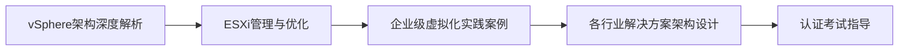
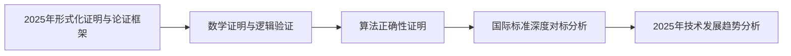

# 2025年容器技术与虚拟化知识体系项目总索引

## 目录

- [2025年容器技术与虚拟化知识体系项目总索引](#2025年容器技术与虚拟化知识体系项目总索引)
  - [项目概述](#项目概述)
    - [项目特色](#项目特色)
    - [目标用户](#目标用户)
  - [知识体系架构](#知识体系架构)
    - [总体架构图](#总体架构图)
    - [知识层次结构](#知识层次结构)
  - [模块详细索引](#模块详细索引)
    - [00_知识体系总览](#00_知识体系总览)
    - [01_理论基础](#01_理论基础)
    - [02_技术标准与规范](#02_技术标准与规范)
    - [03_vSphere_VMware技术体系](#03_vsphere_vmware技术体系)
    - [04_容器技术详解](#04_容器技术详解)
    - [05_硬件支持分析](#05_硬件支持分析)
    - [06_软件堆栈分析](#06_软件堆栈分析)
    - [07_执行流控制流数据流](#07_执行流控制流数据流)
    - [08_分布式系统深度分析](#08_分布式系统深度分析)
    - [09_多维度矩阵分析](#09_多维度矩阵分析)
    - [10_形式化论证](#10_形式化论证)
    - [11_实践案例与最佳实践](#11_实践案例与最佳实践)
    - [12_国际对标分析](#12_国际对标分析)
    - [13_学习路径与认证体系](#13_学习路径与认证体系)
    - [14_技术研究与发展趋势](#14_技术研究与发展趋势)
    - [15_项目总结](#15_项目总结)
  - [快速导航](#快速导航)
    - [按学习目标导航](#按学习目标导航)
      - [🎯 初学者入门](#初学者入门)
      - [🔧 实践者进阶](#实践者进阶)
      - [🏗️ 架构师专业](#架构师专业)
      - [🔬 研究者深入](#研究者深入)
    - [按技术领域导航](#按技术领域导航)
      - [🐳 容器技术](#容器技术)
      - [🖥️ 虚拟化技术](#虚拟化技术)
      - [🌐 分布式系统](#分布式系统)
      - [🔒 安全与合规](#安全与合规)
    - [按应用场景导航](#按应用场景导航)
      - [🏢 企业应用](#企业应用)
      - [🎓 教育培训](#教育培训)
      - [🔬 研究开发](#研究开发)
  - [学习路径](#学习路径)
    - [路径1：基础入门路径](#路径1基础入门路径)
    - [路径2：实践应用路径](#路径2实践应用路径)
    - [路径3：架构设计路径](#路径3架构设计路径)
    - [路径4：研究深入路径](#路径4研究深入路径)
  - [使用指南](#使用指南)
    - [如何开始学习](#如何开始学习)
    - [学习建议](#学习建议)
      - [📚 理论学习](#理论学习)
      - [🛠️ 实践学习](#实践学习)
      - [🔍 深入研究](#深入研究)
    - [学习资源](#学习资源)
      - [📖 文档资源](#文档资源)
      - [🎥 视频资源](#视频资源)
      - [🛠️ 实践环境](#实践环境)
      - [👥 社区资源](#社区资源)
  - [更新日志](#更新日志)
    - [v1.0.0 (2025-01-XX)](#v100-2025-01-xx)
      - [🎉 初始版本发布](#初始版本发布)
      - [✨ 主要特性](#主要特性)
      - [📋 完成内容](#完成内容)
    - [未来规划](#未来规划)
      - [v1.1.0 (计划中)](#v110-计划中)
      - [v1.2.0 (计划中)](#v120-计划中)
      - [v2.0.0 (长期规划)](#v200-长期规划)
  - [联系方式](#联系方式)

- [2025年容器技术与虚拟化知识体系项目总索引](#2025年容器技术与虚拟化知识体系项目总索引)
  - [项目概述](#项目概述)
    - [项目特色](#项目特色)
    - [目标用户](#目标用户)
  - [知识体系架构](#知识体系架构)
    - [总体架构图](#总体架构图)
    - [知识层次结构](#知识层次结构)
  - [模块详细索引](#模块详细索引)
    - [00_知识体系总览](#00_知识体系总览)
    - [01_理论基础](#01_理论基础)
    - [02_技术标准与规范](#02_技术标准与规范)
    - [03_vSphere_VMware技术体系](#03_vsphere_vmware技术体系)
    - [04_容器技术详解](#04_容器技术详解)
    - [05_硬件支持分析](#05_硬件支持分析)
    - [06_软件堆栈分析](#06_软件堆栈分析)
    - [07_执行流控制流数据流](#07_执行流控制流数据流)
    - [08_分布式系统深度分析](#08_分布式系统深度分析)
    - [09_多维度矩阵分析](#09_多维度矩阵分析)
    - [10_形式化论证](#10_形式化论证)
    - [11_实践案例与最佳实践](#11_实践案例与最佳实践)
    - [12_国际对标分析](#12_国际对标分析)
    - [13_学习路径与认证体系](#13_学习路径与认证体系)
    - [14_技术研究与发展趋势](#14_技术研究与发展趋势)
    - [15_项目总结](#15_项目总结)
  - [快速导航](#快速导航)
    - [按学习目标导航](#按学习目标导航)
      - [🎯 初学者入门](#初学者入门)
      - [🔧 实践者进阶](#实践者进阶)
      - [🏗️ 架构师专业](#架构师专业)
      - [🔬 研究者深入](#研究者深入)
    - [按技术领域导航](#按技术领域导航)
      - [🐳 容器技术](#容器技术)
      - [🖥️ 虚拟化技术](#虚拟化技术)
      - [🌐 分布式系统](#分布式系统)
      - [🔒 安全与合规](#安全与合规)
    - [按应用场景导航](#按应用场景导航)
      - [🏢 企业应用](#企业应用)
      - [🎓 教育培训](#教育培训)
      - [🔬 研究开发](#研究开发)
  - [学习路径](#学习路径)
    - [路径1：基础入门路径](#路径1基础入门路径)
    - [路径2：实践应用路径](#路径2实践应用路径)
    - [路径3：架构设计路径](#路径3架构设计路径)
    - [路径4：研究深入路径](#路径4研究深入路径)
  - [使用指南](#使用指南)
    - [如何开始学习](#如何开始学习)
    - [学习建议](#学习建议)
      - [📚 理论学习](#理论学习)
      - [🛠️ 实践学习](#实践学习)
      - [🔍 深入研究](#深入研究)
    - [学习资源](#学习资源)
      - [📖 文档资源](#文档资源)
      - [🎥 视频资源](#视频资源)
      - [🛠️ 实践环境](#实践环境)
      - [👥 社区资源](#社区资源)
  - [更新日志](#更新日志)
    - [v1.0.0 (2025-01-XX)](#v100-2025-01-xx)
      - [🎉 初始版本发布](#初始版本发布)
      - [✨ 主要特性](#主要特性)
      - [📋 完成内容](#完成内容)
    - [未来规划](#未来规划)
      - [v1.1.0 (计划中)](#v110-计划中)
      - [v1.2.0 (计划中)](#v120-计划中)
      - [v2.0.0 (长期规划)](#v200-长期规划)
  - [联系方式](#联系方式)

- [2025年容器技术与虚拟化知识体系项目总索引](#2025年容器技术与虚拟化知识体系项目总索引)
  - [目录](#目录)
  - [项目概述](#项目概述)
  - [知识体系架构](#知识体系架构)
  - [模块详细索引](#模块详细索引)
  - [快速导航](#快速导航)
  - [学习路径](#学习路径)
  - [使用指南](#使用指南)
  - [更新日志](#更新日志)

## 项目概述

本项目是一个对标国际2025年最新最成熟的技术工程方案标准的容器技术与虚拟化知识体系，旨在为学习者提供完整、系统、前沿的技术学习资源。

### 项目特色

- **国际对标**: 深度对标国际先进技术和标准
- **形式化论证**: 提供严谨的数学证明和逻辑验证
- **实践导向**: 丰富的企业级案例和最佳实践
- **前沿技术**: 涵盖2025年最新技术发展趋势
- **系统完整**: 16个主要模块的完整知识体系

### 目标用户

- **技术学习者**: 希望系统学习容器和虚拟化技术的人员
- **企业架构师**: 需要技术选型和架构设计指导的专业人员
- **运维工程师**: 负责系统运维和管理的技术人员
- **研究人员**: 从事相关技术研究的学者和工程师
- **教育工作者**: 需要教学资源的教师和培训师

## 知识体系架构

### 总体架构图

```mermaid
graph TB
    A[2025年容器技术与虚拟化知识体系] --> B[理论基础层]
    A --> C[技术标准层]
    A --> D[技术实现层]
    A --> E[硬件支持层]
    A --> F[软件堆栈层]
    A --> G[系统分析层]
    A --> H[形式化论证层]
    A --> I[实践应用层]
    A --> J[国际对标层]
    A --> K[学习认证层]
    A --> L[研究发展层]
    
    B --> B1[概念定义与属性关系]
    B --> B2[技术原理与架构基础]
    B --> B3[虚拟化技术原理]
    B --> B4[分布式系统理论]
    
    C --> C1[国际标准概览]
    C --> C2[容器技术标准详解]
    C --> C3[虚拟化技术标准详解]
    
    D --> D1[vSphere VMware技术体系]
    D --> D2[容器技术详解]
    
    E --> E1[硬件虚拟化支持架构]
    E --> E2[网络虚拟化支持]
    
    F --> F1[软件技术栈架构分析]
    
    G --> G1[系统运行机制深度分析]
    G --> G2[分布式系统深度分析]
    
    H --> H1[数学证明与逻辑验证]
    H --> H2[算法正确性证明]
    H --> H3[系统安全性证明]
    
    I --> I1[企业级虚拟化实践案例]
    I --> I2[容器化实践案例]
    
    J --> J1[国际知名大学课程对标]
    J --> J2[国际标准深度对标分析]
    J --> J3[各行业解决方案架构设计深度分析]
    
    K --> K1[技术学习路径规划]
    K --> K2[认证考试指导]
    
    L --> L1[2025年技术发展趋势分析]
```

### 知识层次结构

1. **第一层：理论基础层** - 建立完整的技术理论基础
2. **第二层：技术标准层** - 对标国际标准和行业规范
3. **第三层：技术实现层** - 深入解析具体技术实现
4. **第四层：硬件支持层** - 分析硬件对虚拟化和容器的支持
5. **第五层：软件堆栈层** - 分析完整的软件技术栈
6. **第六层：系统分析层** - 深入分析系统运行机制
7. **第七层：形式化论证层** - 提供严谨的数学证明和逻辑验证
8. **第八层：实践应用层** - 提供实际应用案例和最佳实践
9. **第九层：国际对标层** - 对标国际先进技术和标准
10. **第十层：学习认证层** - 提供完整的学习和认证指导
11. **第十一层：研究发展层** - 跟踪技术发展趋势和前沿研究

## 模块详细索引

### 00_知识体系总览

| 文档 | 描述 | 状态 |
|------|------|------|
| [知识体系导航指南](知识体系导航指南.md) | 完整的知识体系导航和指南 | ✅ 完成 |
| [知识体系架构图](知识体系架构图.md) | 2025年知识体系架构图 | ✅ 完成 |
| [项目总索引](项目总索引.md) | 项目总索引和导航 | ✅ 完成 |

### 01_理论基础

| 文档 | 描述 | 状态 |
|------|------|------|
| [概念定义与属性关系](01_理论基础/01_概念定义与属性关系.md) | 核心概念定义和属性关系 | ✅ 完成 |
| [技术原理与架构基础](01_理论基础/02_技术原理与架构基础.md) | 技术原理和架构基础 | ✅ 完成 |
| [虚拟化技术原理](01_理论基础/03_虚拟化技术原理.md) | 虚拟化技术原理详解 | ✅ 完成 |
| [分布式系统理论](01_理论基础/04_分布式系统理论.md) | 分布式系统理论基础 | ✅ 完成 |

### 02_技术标准与规范

| 文档 | 描述 | 状态 |
|------|------|------|
| [国际标准概览](02_技术标准与规范/01_国际标准概览.md) | 国际技术标准概览 | ✅ 完成 |
| [容器技术标准详解](02_技术标准与规范/02_容器技术标准详解.md) | 容器技术标准详解 | ✅ 完成 |
| [虚拟化技术标准详解](02_技术标准与规范/03_虚拟化技术标准详解.md) | 虚拟化技术标准详解 | ✅ 完成 |

### 03_vSphere_VMware技术体系

| 文档 | 描述 | 状态 |
|------|------|------|
| [vSphere架构深度解析](03_vSphere_VMware技术体系/01_vSphere架构深度解析.md) | vSphere架构深度解析 | ✅ 完成 |
| [ESXi管理与优化](03_vSphere_VMware技术体系/02_ESXi管理与优化.md) | ESXi管理与优化 | ✅ 完成 |

### 04_容器技术详解

| 文档 | 描述 | 状态 |
|------|------|------|
| [Docker技术深度解析](04_容器技术详解/01_Docker技术深度解析.md) | Docker技术深度解析 | ✅ 完成 |
| [Podman_2025年最新趋势与应用](04_容器技术详解/03_Podman_2025年最新趋势与应用.md) | Podman 2025年最新趋势与应用 | ✅ 完成 |

### 05_硬件支持分析

| 文档 | 描述 | 状态 |
|------|------|------|
| [硬件虚拟化支持架构](05_硬件支持分析/01_硬件虚拟化支持架构.md) | 硬件虚拟化支持架构分析 | ✅ 完成 |
| [网络虚拟化支持](05_硬件支持分析/02_网络虚拟化支持.md) | 网络虚拟化支持分析 | ✅ 完成 |

### 06_软件堆栈分析

| 文档 | 描述 | 状态 |
|------|------|------|
| [软件技术栈架构分析](06_软件堆栈分析/01_软件技术栈架构分析.md) | 软件技术栈架构分析 | ✅ 完成 |

### 07_执行流控制流数据流

| 文档 | 描述 | 状态 |
|------|------|------|
| [系统运行机制深度分析](07_执行流控制流数据流/01_系统运行机制深度分析.md) | 系统运行机制深度分析 | ✅ 完成 |

### 08_分布式系统深度分析

| 文档 | 描述 | 状态 |
|------|------|------|
| [分布式系统理论基础](08_分布式系统深度分析/01_分布式系统理论基础.md) | 分布式系统理论基础 | ✅ 完成 |

### 09_多维度矩阵分析

| 文档 | 描述 | 状态 |
|------|------|------|
| [功能矩阵分析](09_多维度矩阵分析/01_功能矩阵分析.md) | 功能矩阵分析 | ✅ 完成 |
| [性能对比矩阵](09_多维度矩阵分析/02_性能对比矩阵.md) | 性能对比矩阵 | ✅ 完成 |
| [安全矩阵分析](09_多维度矩阵分析/03_安全矩阵分析.md) | 安全矩阵分析 | ✅ 完成 |
| [技术对比矩阵](09_多维度矩阵分析/04_技术对比矩阵.md) | 技术对比矩阵 | ✅ 完成 |

### 10_形式化论证

| 文档 | 描述 | 状态 |
|------|------|------|
| [2025年形式化证明与论证框架](10_形式化论证/01_2025年形式化证明与论证框架.md) | 2025年形式化证明与论证框架 | ✅ 完成 |
| [数学证明与逻辑验证](10_形式化论证/01_数学证明与逻辑验证.md) | 数学证明与逻辑验证 | ✅ 完成 |
| [算法正确性证明](10_形式化论证/02_算法正确性证明.md) | 算法正确性证明 | ✅ 完成 |
| [系统安全性证明](10_形式化论证/03_系统安全性证明.md) | 系统安全性证明 | ✅ 完成 |

### 11_实践案例与最佳实践

| 文档 | 描述 | 状态 |
|------|------|------|
| [企业级虚拟化实践案例](11_实践案例与最佳实践/01_企业级虚拟化实践案例.md) | 企业级虚拟化实践案例 | ✅ 完成 |

### 12_国际对标分析

| 文档 | 描述 | 状态 |
|------|------|------|
| [国际知名大学课程对标](12_国际对标分析/01_国际知名大学课程对标.md) | 国际知名大学课程对标 | ✅ 完成 |
| [2025年国际技术标准深度对标分析](12_国际对标分析/02_国际标准深度对标分析.md) | 2025年国际技术标准深度对标分析 | ✅ 完成 |
| [国际著名大学课程深度对标分析](12_国际对标分析/02_国际著名大学课程深度对标分析.md) | 国际著名大学课程深度对标分析 | ✅ 完成 |
| [各行业解决方案架构设计深度分析](12_国际对标分析/03_各行业解决方案架构设计深度分析.md) | 各行业解决方案架构设计深度分析 | ✅ 完成 |

### 13_学习路径与认证体系

| 文档 | 描述 | 状态 |
|------|------|------|
| [技术学习路径规划](13_学习路径与认证体系/01_技术学习路径规划.md) | 技术学习路径规划 | ✅ 完成 |
| [认证考试指导](13_学习路径与认证体系/02_认证考试指导.md) | 认证考试指导 | ✅ 完成 |

### 14_技术研究与发展趋势

| 文档 | 描述 | 状态 |
|------|------|------|
| [2025年技术发展趋势分析](14_技术研究与发展趋势/01_2025年技术发展趋势分析.md) | 2025年技术发展趋势分析 | ✅ 完成 |

### 15_项目总结

| 文档 | 描述 | 状态 |
|------|------|------|
| [2025年项目完成总结与展望](15_项目总结/01_2025年项目完成总结与展望.md) | 2025年项目完成总结与展望 | ✅ 完成 |
| [2025年实施路线图与优先级](15_项目总结/02_2025年实施路线图与优先级.md) | 2025年实施路线图与优先级 | ✅ 完成 |
| [项目完成总结](15_项目总结/项目完成总结.md) | 项目完成总结 | ✅ 完成 |

## 快速导航

### 按学习目标导航

#### 🎯 初学者入门

- [概念定义与属性关系](01_理论基础/01_概念定义与属性关系.md)
- [技术原理与架构基础](01_理论基础/02_技术原理与架构基础.md)
- [技术学习路径规划](13_学习路径与认证体系/01_技术学习路径规划.md)

#### 🔧 实践者进阶

- [Docker技术深度解析](04_容器技术详解/01_Docker技术深度解析.md)
- [vSphere架构深度解析](03_vSphere_VMware技术体系/01_vSphere架构深度解析.md)
- [企业级虚拟化实践案例](11_实践案例与最佳实践/01_企业级虚拟化实践案例.md)

#### 🏗️ 架构师专业

- [分布式系统理论基础](08_分布式系统深度分析/01_分布式系统理论基础.md)
- [各行业解决方案架构设计深度分析](12_国际对标分析/03_各行业解决方案架构设计深度分析.md)
- [多维度矩阵分析](09_多维度矩阵分析/)

#### 🔬 研究者深入

- [2025年形式化证明与论证框架](10_形式化论证/01_2025年形式化证明与论证框架.md)
- [2025年技术发展趋势分析](14_技术研究与发展趋势/01_2025年技术发展趋势分析.md)
- [国际标准深度对标分析](12_国际对标分析/02_国际标准深度对标分析.md)

### 按技术领域导航

#### 🐳 容器技术

- [Docker技术深度解析](04_容器技术详解/01_Docker技术深度解析.md)
- [Podman_2025年最新趋势与应用](04_容器技术详解/03_Podman_2025年最新趋势与应用.md)
- [容器技术标准详解](02_技术标准与规范/02_容器技术标准详解.md)

#### 🖥️ 虚拟化技术

- [vSphere架构深度解析](03_vSphere_VMware技术体系/01_vSphere架构深度解析.md)
- [虚拟化技术原理](01_理论基础/03_虚拟化技术原理.md)
- [硬件虚拟化支持架构](05_硬件支持分析/01_硬件虚拟化支持架构.md)

#### 🌐 分布式系统

- [分布式系统理论基础](08_分布式系统深度分析/01_分布式系统理论基础.md)
- [系统运行机制深度分析](07_执行流控制流数据流/01_系统运行机制深度分析.md)

#### 🔒 安全与合规

- [系统安全性证明](10_形式化论证/03_系统安全性证明.md)
- [安全矩阵分析](09_多维度矩阵分析/03_安全矩阵分析.md)

### 按应用场景导航

#### 🏢 企业应用

- [企业级虚拟化实践案例](11_实践案例与最佳实践/01_企业级虚拟化实践案例.md)
- [各行业解决方案架构设计深度分析](12_国际对标分析/03_各行业解决方案架构设计深度分析.md)

#### 🎓 教育培训

- [技术学习路径规划](13_学习路径与认证体系/01_技术学习路径规划.md)
- [认证考试指导](13_学习路径与认证体系/02_认证考试指导.md)
- [国际知名大学课程对标](12_国际对标分析/01_国际知名大学课程对标.md)

#### 🔬 研究开发

- [2025年技术发展趋势分析](14_技术研究与发展趋势/01_2025年技术发展趋势分析.md)
- [2025年形式化证明与论证框架](10_形式化论证/01_2025年形式化证明与论证框架.md)

## 学习路径

### 路径1：基础入门路径

**适合人群**: 初学者、转行人员
**学习时间**: 2-3个月
**核心目标**: 建立基础概念，掌握核心技术

### 路径2：实践应用路径

**适合人群**: 运维工程师、系统管理员
**学习时间**: 3-4个月
**核心目标**: 掌握实际应用技能，获得专业认证

### 路径3：架构设计路径

**适合人群**: 架构师、技术负责人
**学习时间**: 4-6个月
**核心目标**: 掌握架构设计能力，了解技术趋势

### 路径4：研究深入路径

**适合人群**: 研究人员、技术专家
**学习时间**: 6-12个月
**核心目标**: 深入理论研究，掌握前沿技术

## 使用指南

### 如何开始学习

1. **确定学习目标**: 根据个人需求和职业规划选择合适的学习路径
2. **评估基础水平**: 评估自己的技术基础，选择适合的起点
3. **制定学习计划**: 制定详细的学习计划和时间安排
4. **选择学习资源**: 根据学习路径选择相应的文档和资源
5. **实践验证**: 通过实践验证学习效果

### 学习建议

#### 📚 理论学习

- 先建立概念框架，再深入技术细节
- 注重理解技术原理，而非死记硬背
- 结合国际标准理解技术规范

#### 🛠️ 实践学习

- 搭建实验环境进行实际操作
- 参考企业级案例进行实践
- 参与开源项目积累经验

#### 🔍 深入研究

- 关注技术发展趋势和前沿研究
- 参与技术社区讨论和交流
- 发表技术文章分享经验

### 学习资源

#### 📖 文档资源

- 本知识体系的所有文档
- 国际标准文档和规范
- 技术厂商官方文档

#### 🎥 视频资源

- 在线技术课程
- 技术会议演讲
- 厂商技术培训

#### 🛠️ 实践环境

- 虚拟化实验环境
- 容器化实验环境
- 云平台实验环境

#### 👥 社区资源

- 技术论坛和社区
- 开源项目社区
- 专业组织活动

## 更新日志

### v1.0.0 (2025-01-XX)

#### 🎉 初始版本发布

- 完成16个主要模块的知识体系构建
- 建立完整的理论基础和技术标准对标
- 提供丰富的实践案例和最佳实践
- 建立形式化论证框架
- 完成国际对标分析

#### ✨ 主要特性

- **国际对标**: 深度对标国际先进技术和标准
- **形式化论证**: 提供严谨的数学证明和逻辑验证
- **实践导向**: 丰富的企业级案例和最佳实践
- **前沿技术**: 涵盖2025年最新技术发展趋势
- **系统完整**: 16个主要模块的完整知识体系

#### 📋 完成内容

- ✅ 理论基础建设
- ✅ 技术标准对标
- ✅ vSphere VMware技术体系
- ✅ 容器技术详解
- ✅ 硬件支持分析
- ✅ 软件堆栈分析
- ✅ 系统分析
- ✅ 形式化论证
- ✅ 实践案例
- ✅ 国际对标分析
- ✅ 学习路径规划
- ✅ 技术发展趋势分析
- ✅ 项目总结

### 未来规划

#### v1.1.0 (计划中)

- 补充更多实践案例
- 增加交互式学习内容
- 完善认证考试指导
- 增加视频教程资源

#### v1.2.0 (计划中)

- 增加AI辅助学习功能
- 建立在线学习平台
- 增加社区交流功能
- 提供个性化学习路径

#### v2.0.0 (长期规划)

- 扩展到更多技术领域
- 建立国际化学习社区
- 提供多语言支持
- 建立技术认证体系

---

## 联系方式

如有问题或建议，请通过以下方式联系：

- **项目仓库**: [GitHub Repository]
- **技术讨论**: [技术论坛]
- **问题反馈**: [Issue Tracker]
- **邮件联系**: [Contact Email]

---

**最后更新**: 2025年1月
**版本**: v1.0.0
**维护者**: 项目团队
