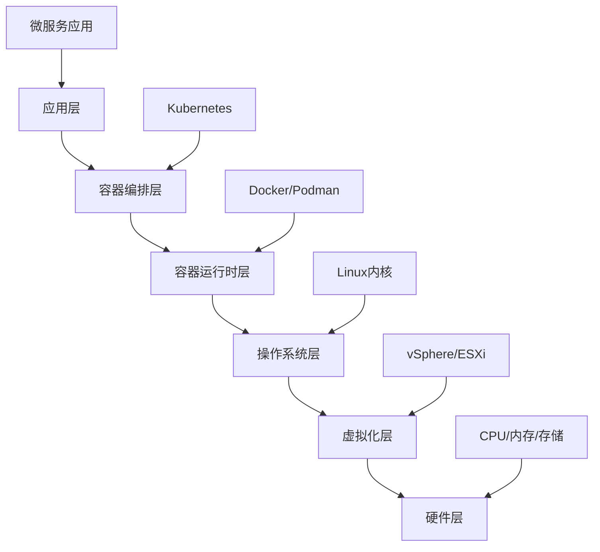
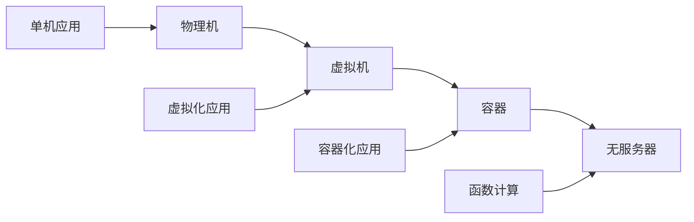
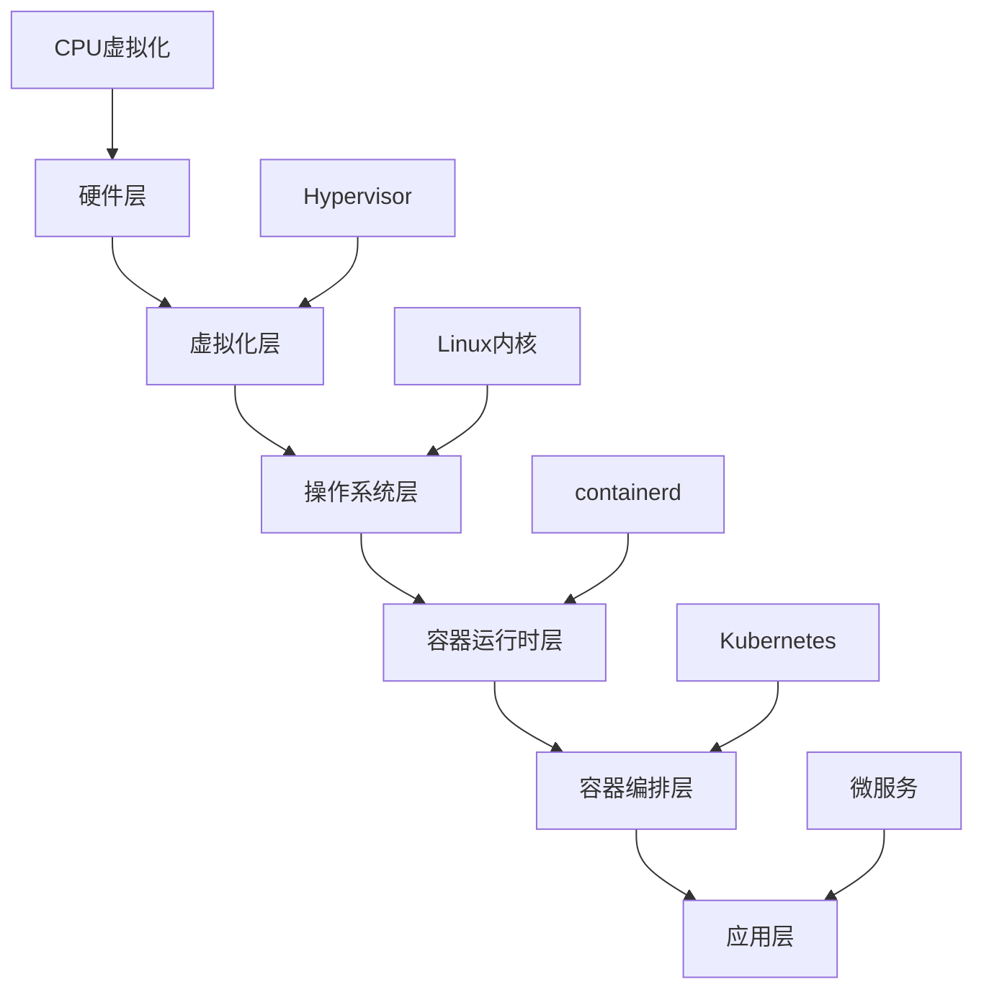

# 概念定义与属性关系

## 摘要

本文档深入解析虚拟化、容器化和分布式系统等核心概念的定义、属性关系和技术特征。通过形式化数学定义、属性关系矩阵和概念层次结构，建立了完整的技术概念体系，为虚拟化容器化技术的理解和应用提供理论基础。

## 目录

- [概念定义与属性关系](#概念定义与属性关系)
  - [摘要](#摘要)
  - [1. 核心概念定义](#1-核心概念定义)
    - [1.1 虚拟化 (Virtualization)](#11-虚拟化-virtualization)
      - [1.1.1 定义](#111-定义)
      - [1.1.2 数学定义](#112-数学定义)
      - [1.1.3 属性关系](#113-属性关系)
    - [1.2 容器化 (Containerization)](#12-容器化-containerization)
      - [1.2.1 定义](#121-定义)
      - [1.2.2 数学定义](#122-数学定义)
      - [1.2.3 属性关系](#123-属性关系)
    - [1.3 分布式系统 (Distributed System)](#13-分布式系统-distributed-system)
      - [1.3.1 定义](#131-定义)
      - [1.3.2 数学定义](#132-数学定义)
      - [1.3.3 属性关系](#133-属性关系)
  - [2. 技术概念层次结构](#2-技术概念层次结构)
    - [2.1 抽象层次](#21-抽象层次)
    - [2.2 概念继承关系](#22-概念继承关系)
      - [2.2.1 虚拟化概念继承](#221-虚拟化概念继承)
      - [2.2.2 容器概念继承](#222-容器概念继承)
  - [3. 属性关系矩阵](#3-属性关系矩阵)
    - [3.1 技术特性对比矩阵](#31-技术特性对比矩阵)
    - [3.2 性能特性矩阵](#32-性能特性矩阵)
    - [3.3 安全特性矩阵](#33-安全特性矩阵)
  - [4. 概念关系图](#4-概念关系图)
    - [4.1 技术演进关系](#41-技术演进关系)
    - [4.2 技术依赖关系](#42-技术依赖关系)
  - [5. 形式化属性定义](#5-形式化属性定义)
    - [5.1 虚拟化属性](#51-虚拟化属性)
      - [5.1.1 资源抽象属性](#511-资源抽象属性)
      - [5.1.2 隔离属性](#512-隔离属性)
      - [5.1.3 封装属性](#513-封装属性)
    - [5.2 容器化属性](#52-容器化属性)
      - [5.2.1 命名空间隔离属性](#521-命名空间隔离属性)
      - [5.2.2 资源限制属性](#522-资源限制属性)
      - [5.2.3 共享内核属性](#523-共享内核属性)
    - [5.3 分布式系统属性](#53-分布式系统属性)
      - [5.3.1 一致性属性](#531-一致性属性)
      - [5.3.2 可用性属性](#532-可用性属性)
      - [5.3.3 分区容错属性](#533-分区容错属性)
  - [6. 概念应用场景](#6-概念应用场景)
    - [6.1 虚拟化应用场景](#61-虚拟化应用场景)
      - [6.1.1 服务器整合](#611-服务器整合)
      - [6.1.2 开发测试环境](#612-开发测试环境)
      - [6.1.3 灾难恢复](#613-灾难恢复)
    - [6.2 容器化应用场景](#62-容器化应用场景)
      - [6.2.1 微服务架构](#621-微服务架构)
      - [6.2.2 持续集成/持续部署](#622-持续集成持续部署)
      - [6.2.3 云原生应用](#623-云原生应用)
    - [6.3 分布式系统应用场景](#63-分布式系统应用场景)
      - [6.3.1 大规模数据处理](#631-大规模数据处理)
      - [6.3.2 高可用服务](#632-高可用服务)
      - [6.3.3 全球分布式应用](#633-全球分布式应用)

## 1. 核心概念定义

### 1.1 虚拟化 (Virtualization)

#### 1.1.1 定义

虚拟化是一种计算机技术，通过在物理硬件和操作系统之间创建一个抽象层，使得多个虚拟环境可以在同一台物理机器上同时运行。

#### 1.1.2 数学定义

设物理资源集合为 $P = \{p_1, p_2, ..., p_n\}$，虚拟资源集合为 $V = \{v_1, v_2, ..., v_m\}$，则虚拟化函数 $f: P \rightarrow V$ 满足：

- **资源映射**: $\forall p_i \in P, \exists v_j \in V, f(p_i) = v_j$
- **资源隔离**: $\forall v_i, v_j \in V, i \neq j \Rightarrow v_i \cap v_j = \emptyset$
- **资源抽象**: $f$ 隐藏了物理资源的实现细节

#### 1.1.3 属性关系

- **抽象性**: 隐藏底层硬件复杂性
- **隔离性**: 虚拟机间相互隔离
- **封装性**: 虚拟机状态可保存和恢复
- **可移植性**: 虚拟机可在不同物理机间迁移

### 1.2 容器化 (Containerization)

#### 1.2.1 定义

容器化是一种操作系统级虚拟化技术，通过共享操作系统内核，在用户空间创建隔离的运行环境。

#### 1.2.2 数学定义

设主机操作系统为 $OS$，容器集合为 $C = \{c_1, c_2, ..., c_k\}$，则容器化函数 $g: OS \rightarrow C$ 满足：

- **命名空间隔离**: $\forall c_i \in C, namespace(c_i) \cap namespace(c_j) = \emptyset, i \neq j$
- **资源限制**: $\forall c_i \in C, resource\_limit(c_i) \leq allocated\_resource$
- **共享内核**: $\forall c_i \in C, kernel(c_i) = kernel(OS)$

#### 1.2.3 属性关系

- **轻量级**: 共享操作系统内核，资源开销小
- **快速启动**: 无需启动完整操作系统
- **高密度**: 可在单台主机运行更多实例
- **可移植性**: 容器镜像可在不同环境运行

### 1.3 分布式系统 (Distributed System)

#### 1.3.1 定义

分布式系统是由多个独立的计算节点组成的系统，这些节点通过网络通信协作完成共同的任务。

#### 1.3.2 数学定义

设节点集合为 $N = \{n_1, n_2, ..., n_p\}$，通信网络为 $G = (N, E)$，其中 $E$ 为边集合，则分布式系统 $DS = (N, G, P)$ 满足：

- **节点独立性**: $\forall n_i \in N, state(n_i)$ 独立维护
- **网络连通性**: $\forall n_i, n_j \in N, \exists path(n_i, n_j)$
- **协议一致性**: $\forall n_i \in N, protocol(n_i) = P$

#### 1.3.3 属性关系

- **并发性**: 多个节点同时执行任务
- **容错性**: 部分节点故障不影响整体系统
- **可扩展性**: 可动态添加或删除节点
- **透明性**: 用户感知不到分布式特性

## 2. 技术概念层次结构

### 2.1 抽象层次



### 2.2 概念继承关系

#### 2.2.1 虚拟化概念继承

```text
计算虚拟化
├── 完全虚拟化
│   ├── 硬件辅助虚拟化
│   └── 软件虚拟化
├── 半虚拟化
└── 操作系统级虚拟化
    └── 容器化
```

#### 2.2.2 容器概念继承

```text
容器技术
├── 应用容器
│   ├── Docker容器
│   └── Podman容器
├── 系统容器
│   └── LXC容器
└── 容器编排
    └── Kubernetes
```

## 3. 属性关系矩阵

### 3.1. 技术特性对比矩阵

| 特性 | 物理机 | 虚拟机 | 容器 |
|------|--------|--------|------|
| 资源开销 | 100% | 5-15% | 1-3% |
| 启动时间 | 分钟级 | 秒级 | 毫秒级 |
| 隔离程度 | 完全隔离 | 强隔离 | 弱隔离 |
| 可移植性 | 低 | 高 | 极高 |
| 管理复杂度 | 低 | 中 | 高 |

### 3.2. 性能特性矩阵

| 性能指标 | 物理机 | 虚拟机 | 容器 |
|----------|--------|--------|------|
| CPU性能 | 100% | 95-98% | 98-99% |
| 内存性能 | 100% | 95-98% | 98-99% |
| 网络性能 | 100% | 90-95% | 95-98% |
| 存储性能 | 100% | 85-95% | 95-98% |

### 3.3. 安全特性矩阵

| 安全特性 | 物理机 | 虚拟机 | 容器 |
|----------|--------|--------|------|
| 进程隔离 | 无 | 强 | 中 |
| 内核隔离 | 无 | 强 | 无 |
| 资源隔离 | 无 | 强 | 中 |
| 网络隔离 | 无 | 强 | 中 |

## 4. 概念关系图

### 4.1. 技术演进关系



### 4.2. 技术依赖关系



## 5. 形式化属性定义

### 5.1. 虚拟化属性

#### 5.1.1 资源抽象属性

$$\forall r \in Resources, \exists v \in VirtualResources, abstract(r) = v$$

#### 5.1.2 隔离属性

$$\forall v_1, v_2 \in VirtualResources, v_1 \neq v_2 \Rightarrow isolated(v_1, v_2)$$

#### 5.1.3 封装属性

$$\forall v \in VirtualResources, \exists state(v) \in StateSpace$$

### 5.2. 容器化属性

#### 5.2.1 命名空间隔离属性

$$\forall c_1, c_2 \in Containers, namespace(c_1) \cap namespace(c_2) = \emptyset$$

#### 5.2.2 资源限制属性

$$\forall c \in Containers, \sum_{r \in resources(c)} r \leq limit(c)$$

#### 5.2.3 共享内核属性

$$\forall c \in Containers, kernel(c) = kernel(host)$$

### 5.3. 分布式系统属性

#### 5.3.1 一致性属性

$$\forall n_1, n_2 \in Nodes, state(n_1) = state(n_2) \Rightarrow consistent$$

#### 5.3.2 可用性属性

$$\forall t \in Time, \exists n \in Nodes, available(n, t)$$

#### 5.3.3 分区容错属性

$$\forall partition \in Partitions, \exists majority \in partition, functional(majority)$$

## 6. 概念应用场景

### 6.1. 虚拟化应用场景

#### 6.1.1 服务器整合

- **场景**: 多台物理服务器整合到少数几台
- **优势**: 提高资源利用率，降低硬件成本
- **技术**: vSphere、Hyper-V、KVM

#### 6.1.2 开发测试环境

- **场景**: 快速创建和销毁测试环境
- **优势**: 环境一致性，快速部署
- **技术**: VMware Workstation、VirtualBox

#### 6.1.3 灾难恢复

- **场景**: 跨数据中心的虚拟机复制
- **优势**: 快速恢复，数据一致性
- **技术**: vSphere Replication、SRM

### 6.2. 容器化应用场景

#### 6.2.1 微服务架构

- **场景**: 将单体应用拆分为微服务
- **优势**: 独立部署，技术栈灵活
- **技术**: Docker、Kubernetes

#### 6.2.2 持续集成/持续部署

- **场景**: 自动化构建、测试、部署
- **优势**: 环境一致性，快速交付
- **技术**: Docker、Jenkins、GitLab CI

#### 6.2.3 云原生应用

- **场景**: 构建云原生应用
- **优势**: 弹性扩展，高可用性
- **技术**: Kubernetes、Istio、Prometheus

### 6.3. 分布式系统应用场景

#### 6.3.1 大规模数据处理

- **场景**: 处理海量数据
- **优势**: 并行处理，高吞吐量
- **技术**: Hadoop、Spark、Kafka

#### 6.3.2 高可用服务

- **场景**: 提供7x24小时服务
- **优势**: 故障容错，服务连续性
- **技术**: 负载均衡、故障转移、数据复制

#### 6.3.3 全球分布式应用

- **场景**: 服务全球用户
- **优势**: 低延迟，高可用性
- **技术**: CDN、多区域部署、数据同步
