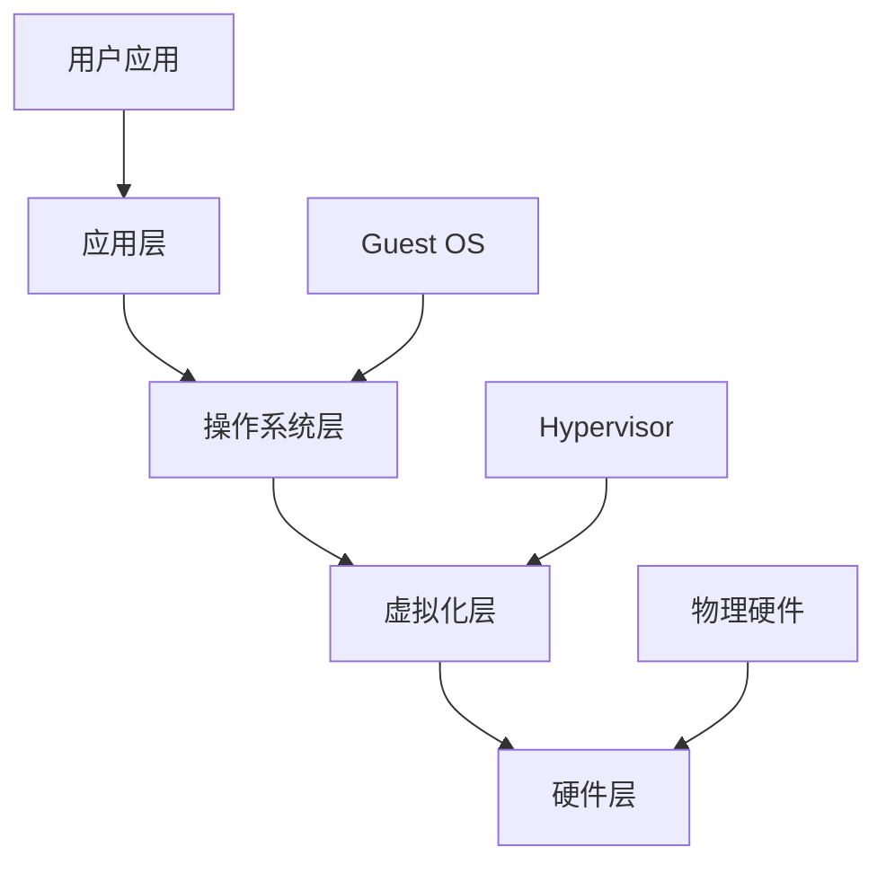
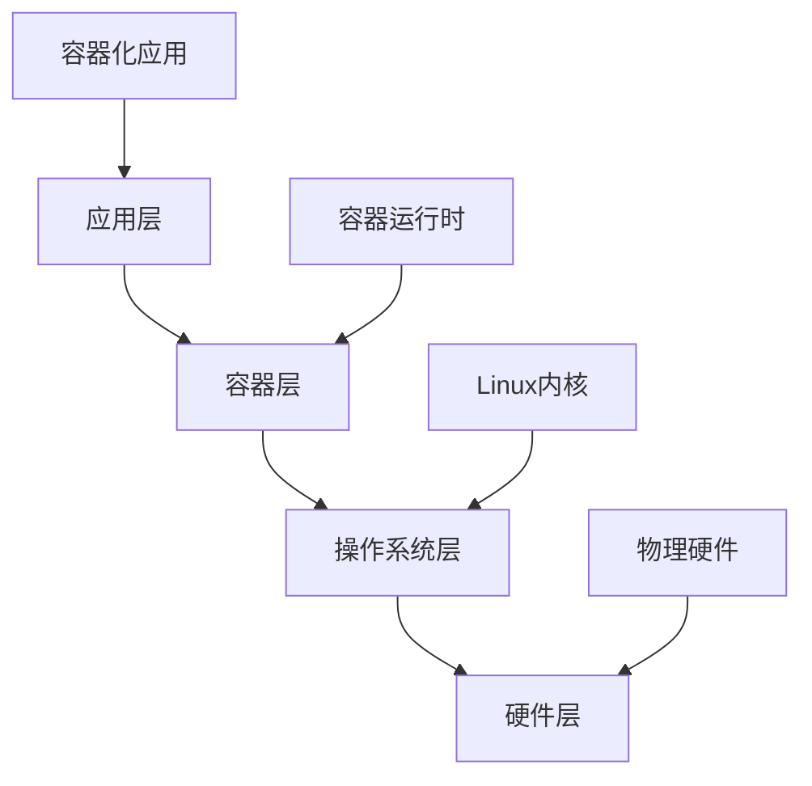
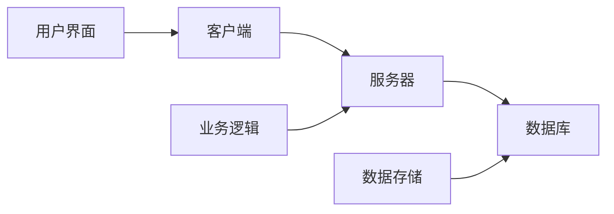
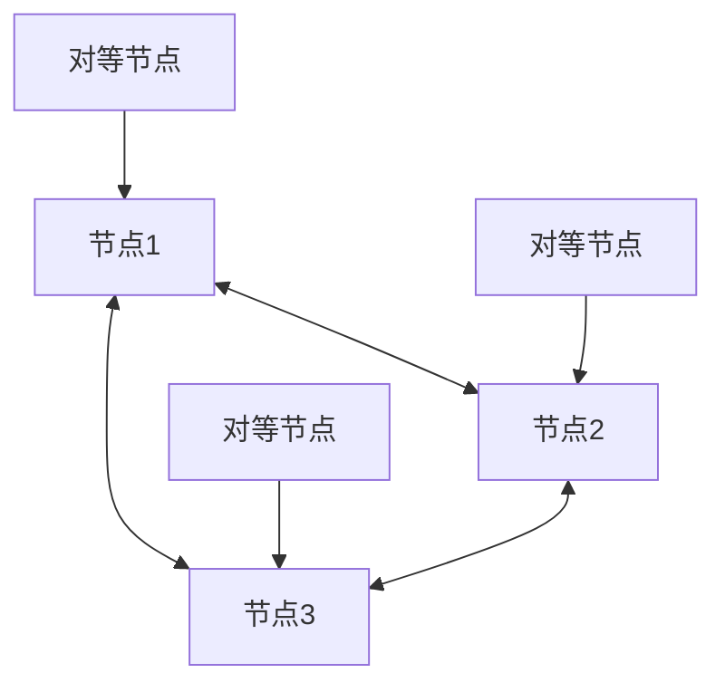
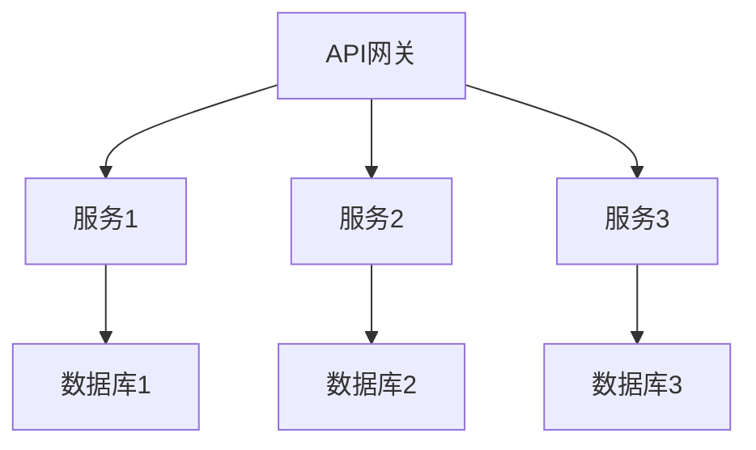

# 技术原理与架构基础

## 目录

- [技术原理与架构基础](#技术原理与架构基础)
  - [虚拟化技术原理](#虚拟化技术原理)
    - [1. 虚拟化基础原理](#1-虚拟化基础原理)
      - [1.1 虚拟化抽象层次](#11-虚拟化抽象层次)
      - [1.2 虚拟化类型分类](#12-虚拟化类型分类)
        - [1.2.1 完全虚拟化 (Full Virtualization)](#121-完全虚拟化-full-virtualization)
        - [1.2.2 半虚拟化 (Para-virtualization)](#122-半虚拟化-para-virtualization)
        - [1.2.3 硬件辅助虚拟化 (Hardware-assisted Virtualization)](#123-硬件辅助虚拟化-hardware-assisted-virtualization)
      - [1.3 虚拟化架构模式](#13-虚拟化架构模式)
        - [1.3.1 Type 1 Hypervisor (裸机虚拟化)](#131-type-1-hypervisor-裸机虚拟化)
        - [1.3.2 Type 2 Hypervisor (主机虚拟化)](#132-type-2-hypervisor-主机虚拟化)
    - [2. 容器技术原理](#2-容器技术原理)
      - [2.1 容器技术架构](#21-容器技术架构)
      - [2.2 容器核心技术](#22-容器核心技术)
        - [2.2.1 命名空间 (Namespaces)](#221-命名空间-namespaces)
        - [2.2.2 控制组 (Cgroups)](#222-控制组-cgroups)
        - [2.2.3 联合文件系统 (UnionFS)](#223-联合文件系统-unionfs)
      - [2.3 容器运行时架构](#23-容器运行时架构)
        - [2.3.1 Docker架构](#231-docker架构)
        - [2.3.2 Podman架构](#232-podman架构)
    - [3. 分布式系统原理](#3-分布式系统原理)
      - [3.1 分布式系统架构模式](#31-分布式系统架构模式)
        - [3.1.1 客户端-服务器模式](#311-客户端-服务器模式)
        - [3.1.2 对等网络模式](#312-对等网络模式)
        - [3.1.3 微服务架构模式](#313-微服务架构模式)
      - [3.2 分布式一致性原理](#32-分布式一致性原理)
        - [3.2.1 CAP定理](#321-cap定理)
        - [3.2.2 BASE理论](#322-base理论)
        - [3.2.3 一致性算法](#323-一致性算法)
          - [Raft算法](#raft算法)
          - [Paxos算法](#paxos算法)
  - [架构设计原理](#架构设计原理)
    - [1. 系统架构层次](#1-系统架构层次)
      - [1.1 分层架构](#11-分层架构)
      - [1.2 微服务架构](#12-微服务架构)
      - [1.3 事件驱动架构](#13-事件驱动架构)
    - [2. 设计模式](#2-设计模式)
      - [2.1 创建型模式](#21-创建型模式)
      - [2.2 结构型模式](#22-结构型模式)
      - [2.3 行为型模式](#23-行为型模式)
    - [3. 架构质量属性](#3-架构质量属性)
      - [3.1 性能属性](#31-性能属性)
      - [3.2 可靠性属性](#32-可靠性属性)
      - [3.3 安全性属性](#33-安全性属性)
  - [技术实现原理](#技术实现原理)
    - [1. 虚拟化实现](#1-虚拟化实现)
      - [1.1 CPU虚拟化](#11-cpu虚拟化)
      - [1.2 内存虚拟化](#12-内存虚拟化)
      - [1.3 存储虚拟化](#13-存储虚拟化)
      - [1.4 网络虚拟化](#14-网络虚拟化)
    - [2. 容器实现](#2-容器实现)
      - [2.1 容器运行时](#21-容器运行时)
      - [2.2 镜像管理](#22-镜像管理)
      - [2.3 容器编排](#23-容器编排)
    - [3. 分布式系统实现](#3-分布式系统实现)
      - [3.1 通信机制](#31-通信机制)
      - [3.2 数据一致性](#32-数据一致性)
      - [3.3 故障处理](#33-故障处理)
  - [性能优化原理](#性能优化原理)
    - [1. 虚拟化性能优化](#1-虚拟化性能优化)
      - [1.1 CPU性能优化](#11-cpu性能优化)
      - [1.2 内存性能优化](#12-内存性能优化)
      - [1.3 存储性能优化](#13-存储性能优化)
      - [1.4 网络性能优化](#14-网络性能优化)
    - [2. 容器性能优化](#2-容器性能优化)
      - [2.1 容器启动优化](#21-容器启动优化)
      - [2.2 运行时性能优化](#22-运行时性能优化)
      - [2.3 网络性能优化](#23-网络性能优化)
    - [3. 分布式系统性能优化](#3-分布式系统性能优化)
      - [3.1 通信性能优化](#31-通信性能优化)
      - [3.2 数据处理优化](#32-数据处理优化)
      - [3.3 系统性能优化](#33-系统性能优化)

- [技术原理与架构基础](#技术原理与架构基础)
  - [虚拟化技术原理](#虚拟化技术原理)
    - [1. 虚拟化基础原理](#1-虚拟化基础原理)
      - [1.1 虚拟化抽象层次](#11-虚拟化抽象层次)
      - [1.2 虚拟化类型分类](#12-虚拟化类型分类)
        - [1.2.1 完全虚拟化 (Full Virtualization)](#121-完全虚拟化-full-virtualization)
        - [1.2.2 半虚拟化 (Para-virtualization)](#122-半虚拟化-para-virtualization)
        - [1.2.3 硬件辅助虚拟化 (Hardware-assisted Virtualization)](#123-硬件辅助虚拟化-hardware-assisted-virtualization)
      - [1.3 虚拟化架构模式](#13-虚拟化架构模式)
        - [1.3.1 Type 1 Hypervisor (裸机虚拟化)](#131-type-1-hypervisor-裸机虚拟化)
        - [1.3.2 Type 2 Hypervisor (主机虚拟化)](#132-type-2-hypervisor-主机虚拟化)
    - [2. 容器技术原理](#2-容器技术原理)
      - [2.1 容器技术架构](#21-容器技术架构)
      - [2.2 容器核心技术](#22-容器核心技术)
        - [2.2.1 命名空间 (Namespaces)](#221-命名空间-namespaces)
        - [2.2.2 控制组 (Cgroups)](#222-控制组-cgroups)
        - [2.2.3 联合文件系统 (UnionFS)](#223-联合文件系统-unionfs)
      - [2.3 容器运行时架构](#23-容器运行时架构)
        - [2.3.1 Docker架构](#231-docker架构)
        - [2.3.2 Podman架构](#232-podman架构)
    - [3. 分布式系统原理](#3-分布式系统原理)
      - [3.1 分布式系统架构模式](#31-分布式系统架构模式)
        - [3.1.1 客户端-服务器模式](#311-客户端-服务器模式)
        - [3.1.2 对等网络模式](#312-对等网络模式)
        - [3.1.3 微服务架构模式](#313-微服务架构模式)
      - [3.2 分布式一致性原理](#32-分布式一致性原理)
        - [3.2.1 CAP定理](#321-cap定理)
        - [3.2.2 BASE理论](#322-base理论)
        - [3.2.3 一致性算法](#323-一致性算法)
          - [Raft算法](#raft算法)
          - [Paxos算法](#paxos算法)
  - [架构设计原理](#架构设计原理)
    - [1. 系统架构层次](#1-系统架构层次)
      - [1.1 分层架构](#11-分层架构)
      - [1.2 微服务架构](#12-微服务架构)
      - [1.3 事件驱动架构](#13-事件驱动架构)
    - [2. 设计模式](#2-设计模式)
      - [2.1 创建型模式](#21-创建型模式)
      - [2.2 结构型模式](#22-结构型模式)
      - [2.3 行为型模式](#23-行为型模式)
    - [3. 架构质量属性](#3-架构质量属性)
      - [3.1 性能属性](#31-性能属性)
      - [3.2 可靠性属性](#32-可靠性属性)
      - [3.3 安全性属性](#33-安全性属性)
  - [技术实现原理](#技术实现原理)
    - [1. 虚拟化实现](#1-虚拟化实现)
      - [1.1 CPU虚拟化](#11-cpu虚拟化)
      - [1.2 内存虚拟化](#12-内存虚拟化)
      - [1.3 存储虚拟化](#13-存储虚拟化)
      - [1.4 网络虚拟化](#14-网络虚拟化)
    - [2. 容器实现](#2-容器实现)
      - [2.1 容器运行时](#21-容器运行时)
      - [2.2 镜像管理](#22-镜像管理)
      - [2.3 容器编排](#23-容器编排)
    - [3. 分布式系统实现](#3-分布式系统实现)
      - [3.1 通信机制](#31-通信机制)
      - [3.2 数据一致性](#32-数据一致性)
      - [3.3 故障处理](#33-故障处理)
  - [性能优化原理](#性能优化原理)
    - [1. 虚拟化性能优化](#1-虚拟化性能优化)
      - [1.1 CPU性能优化](#11-cpu性能优化)
      - [1.2 内存性能优化](#12-内存性能优化)
      - [1.3 存储性能优化](#13-存储性能优化)
      - [1.4 网络性能优化](#14-网络性能优化)
    - [2. 容器性能优化](#2-容器性能优化)
      - [2.1 容器启动优化](#21-容器启动优化)
      - [2.2 运行时性能优化](#22-运行时性能优化)
      - [2.3 网络性能优化](#23-网络性能优化)
    - [3. 分布式系统性能优化](#3-分布式系统性能优化)
      - [3.1 通信性能优化](#31-通信性能优化)
      - [3.2 数据处理优化](#32-数据处理优化)
      - [3.3 系统性能优化](#33-系统性能优化)


# 技术原理与架构基础

## 虚拟化技术原理

### 1. 虚拟化基础原理

#### 1.1 虚拟化抽象层次



#### 1.2 虚拟化类型分类

##### 1.2.1 完全虚拟化 (Full Virtualization)

- **原理**: 通过二进制翻译和硬件辅助实现完全隔离
- **数学表示**: $VMM(x) = \begin{cases}
    direct\_execution(x) & \text{if } x \in privileged\_instructions \\
    binary\_translation(x) & \text{otherwise}
\end{cases}$
- **特点**: 无需修改Guest OS，完全隔离
- **代表技术**: VMware vSphere、VirtualBox

##### 1.2.2 半虚拟化 (Para-virtualization)

- **原理**: 修改Guest OS，使用hypercall接口
- **数学表示**: $VMM(x) = hypercall(x)$
- **特点**: 性能更好，但需要修改OS
- **代表技术**: Xen、早期VMware

##### 1.2.3 硬件辅助虚拟化 (Hardware-assisted Virtualization)

- **原理**: 利用CPU硬件特性支持虚拟化
- **数学表示**: $VMM(x) = hardware\_assisted\_execution(x)$
- **特点**: 性能最优，硬件支持
- **代表技术**: Intel VT-x、AMD-V

#### 1.3 虚拟化架构模式

##### 1.3.1 Type 1 Hypervisor (裸机虚拟化)

```text
硬件层
├── Hypervisor (直接运行在硬件上)
├── 虚拟机1 (Guest OS + 应用)
├── 虚拟机2 (Guest OS + 应用)
└── 虚拟机N (Guest OS + 应用)
```

##### 1.3.2 Type 2 Hypervisor (主机虚拟化)

```text
硬件层
├── Host OS
├── Hypervisor (运行在Host OS上)
├── 虚拟机1 (Guest OS + 应用)
├── 虚拟机2 (Guest OS + 应用)
└── 虚拟机N (Guest OS + 应用)
```

### 2. 容器技术原理

#### 2.1 容器技术架构



#### 2.2 容器核心技术

##### 2.2.1 命名空间 (Namespaces)

- **原理**: 为进程提供独立的系统资源视图
- **数学表示**: $namespace(pid) = \{resource\_view(pid)\}$
- **类型**: PID、Network、Mount、UTS、IPC、User
- **隔离效果**: 进程间资源隔离

##### 2.2.2 控制组 (Cgroups)

- **原理**: 限制和监控进程组资源使用
- **数学表示**: $cgroup(pid) = \{limit(cpu), limit(memory), limit(io)\}$
- **功能**: 资源限制、资源监控、资源分配
- **版本**: v1、v2 (unified hierarchy)

##### 2.2.3 联合文件系统 (UnionFS)

- **原理**: 将多个文件系统层叠合并
- **数学表示**: $unionfs = \bigcup_{i=1}^{n} layer_i$
- **特点**: 写时复制、分层存储、共享基础层
- **实现**: OverlayFS、AUFS、DeviceMapper

#### 2.3 容器运行时架构

##### 2.3.1 Docker架构

```text
Docker Client
├── Docker Daemon
├── containerd
├── runc
└── 容器实例
```

##### 2.3.2 Podman架构

```text
Podman Client
├── Podman Engine
├── conmon
├── runc
└── 容器实例
```

### 3. 分布式系统原理

#### 3.1 分布式系统架构模式

##### 3.1.1 客户端-服务器模式



##### 3.1.2 对等网络模式



##### 3.1.3 微服务架构模式



#### 3.2 分布式一致性原理

##### 3.2.1 CAP定理

- **一致性 (Consistency)**: 所有节点看到相同数据
- **可用性 (Availability)**: 系统持续可用
- **分区容错性 (Partition Tolerance)**: 网络分区时系统仍可用
- **数学表示**: $CAP = \{C, A, P\}, |CAP| \leq 2$

##### 3.2.2 BASE理论

- **基本可用 (Basically Available)**: 系统基本可用
- **软状态 (Soft State)**: 允许中间状态
- **最终一致性 (Eventually Consistent)**: 最终达到一致

##### 3.2.3 一致性算法

###### Raft算法

- **原理**: 基于领导者的共识算法
- **状态**: Leader、Follower、Candidate
- **选举**: 多数投票选举Leader
- **日志复制**: Leader复制日志到Followers

###### Paxos算法

- **原理**: 分布式共识算法
- **角色**: Proposer、Acceptor、Learner
- **阶段**: Prepare、Accept、Learn
- **保证**: 安全性、活性

## 架构设计原理

### 1. 系统架构层次

#### 1.1 分层架构

```text
应用层 (Application Layer)
├── 业务逻辑层 (Business Logic Layer)
├── 服务层 (Service Layer)
├── 数据访问层 (Data Access Layer)
└── 数据层 (Data Layer)
```

#### 1.2 微服务架构

```text
API网关
├── 用户服务
├── 订单服务
├── 支付服务
└── 商品服务
```

#### 1.3 事件驱动架构

```text
事件总线
├── 事件生产者
├── 事件消费者
└── 事件存储
```

### 2. 设计模式

#### 2.1 创建型模式

- **单例模式**: 确保类只有一个实例
- **工厂模式**: 创建对象的接口
- **建造者模式**: 构建复杂对象

#### 2.2 结构型模式

- **适配器模式**: 接口转换
- **装饰器模式**: 动态添加功能
- **代理模式**: 控制对象访问

#### 2.3 行为型模式

- **观察者模式**: 对象间依赖关系
- **策略模式**: 算法族封装
- **命令模式**: 请求封装为对象

### 3. 架构质量属性

#### 3.1 性能属性

- **响应时间**: $T_{response} = T_{processing} + T_{network} + T_{queue}$
- **吞吐量**: $Throughput = \frac{Requests}{Time}$
- **资源利用率**: $Utilization = \frac{Used\_Resources}{Total\_Resources}$

#### 3.2 可靠性属性

- **可用性**: $Availability = \frac{MTBF}{MTBF + MTTR}$
- **故障率**: $Failure\_Rate = \frac{Failures}{Time}$
- **恢复时间**: $RTO = Time\_to\_Recovery$

#### 3.3 安全性属性

- **机密性**: 信息不被未授权访问
- **完整性**: 信息不被未授权修改
- **可用性**: 信息可被授权用户访问

## 技术实现原理

### 1. 虚拟化实现

#### 1.1 CPU虚拟化

- **指令集虚拟化**: 敏感指令处理
- **内存虚拟化**: 地址空间映射
- **中断虚拟化**: 中断路由和注入
- **I/O虚拟化**: 设备模拟和直通

#### 1.2 内存虚拟化

- **内存管理单元 (MMU)**: 地址转换
- **影子页表**: 虚拟地址到物理地址映射
- **扩展页表 (EPT)**: 硬件辅助地址转换
- **内存气球**: 动态内存分配

#### 1.3 存储虚拟化

- **存储抽象**: 物理存储到逻辑存储映射
- **存储池**: 存储资源统一管理
- **快照**: 时间点数据副本
- **克隆**: 快速创建虚拟机副本

#### 1.4 网络虚拟化

- **虚拟交换机**: 虚拟机间网络连接
- **虚拟网卡**: 虚拟机网络接口
- **网络隔离**: VLAN、VXLAN、Geneve
- **负载均衡**: 流量分发和故障转移

### 2. 容器实现

#### 2.1 容器运行时

- **容器生命周期管理**: 创建、启动、停止、删除
- **资源管理**: CPU、内存、I/O限制
- **网络管理**: 容器网络配置
- **存储管理**: 数据卷挂载

#### 2.2 镜像管理

- **镜像构建**: Dockerfile到镜像转换
- **镜像存储**: 分层存储和压缩
- **镜像分发**: 镜像仓库和传输
- **镜像安全**: 镜像签名和扫描

#### 2.3 容器编排

- **调度**: 容器到节点的分配
- **服务发现**: 服务注册和发现
- **负载均衡**: 流量分发
- **健康检查**: 服务状态监控

### 3. 分布式系统实现

#### 3.1 通信机制

- **同步通信**: 请求-响应模式
- **异步通信**: 消息队列模式
- **RPC**: 远程过程调用
- **REST API**: 基于HTTP的API

#### 3.2 数据一致性

- **强一致性**: 同步复制
- **弱一致性**: 异步复制
- **最终一致性**: 延迟一致性
- **因果一致性**: 因果顺序保证

#### 3.3 故障处理

- **故障检测**: 心跳机制
- **故障恢复**: 自动重启
- **故障转移**: 服务切换
- **故障隔离**: 故障影响范围控制

## 性能优化原理

### 1. 虚拟化性能优化

#### 1.1 CPU性能优化

- **CPU亲和性**: 绑定虚拟机到特定CPU核心
- **CPU超分**: 虚拟CPU与物理CPU比例优化
- **CPU调度**: 虚拟机调度算法优化
- **NUMA优化**: 非统一内存访问优化

#### 1.2 内存性能优化

- **内存超分**: 虚拟内存与物理内存比例优化
- **内存压缩**: 内存页面压缩
- **透明页面共享**: 相同页面共享
- **内存气球**: 动态内存回收

#### 1.3 存储性能优化

- **存储缓存**: 读写缓存优化
- **存储分层**: 热数据SSD，冷数据HDD
- **存储去重**: 重复数据消除
- **存储压缩**: 数据压缩存储

#### 1.4 网络性能优化

- **SR-IOV**: 单根I/O虚拟化
- **网络直通**: 虚拟机直接访问网络设备
- **网络加速**: 硬件网络加速
- **网络优化**: 网络参数调优

### 2. 容器性能优化

#### 2.1 容器启动优化

- **镜像优化**: 减小镜像大小
- **启动参数优化**: 优化启动参数
- **预热机制**: 容器预热
- **快速启动**: 减少启动时间

#### 2.2 运行时性能优化

- **资源限制**: 合理设置资源限制
- **CPU调度**: 容器调度优化
- **内存管理**: 内存使用优化
- **I/O优化**: 存储I/O优化

#### 2.3 网络性能优化

- **网络模式**: 选择合适的网络模式
- **网络加速**: 使用网络加速技术
- **负载均衡**: 网络负载均衡
- **网络监控**: 网络性能监控

### 3. 分布式系统性能优化

#### 3.1 通信性能优化

- **连接池**: 复用网络连接
- **批量处理**: 批量数据传输
- **压缩**: 数据压缩传输
- **缓存**: 数据缓存机制

#### 3.2 数据处理优化

- **并行处理**: 数据并行处理
- **流水线**: 数据处理流水线
- **分片**: 数据分片处理
- **索引**: 数据索引优化

#### 3.3 系统性能优化

- **负载均衡**: 请求负载均衡
- **缓存策略**: 多级缓存
- **异步处理**: 异步任务处理
- **资源池**: 资源池管理
