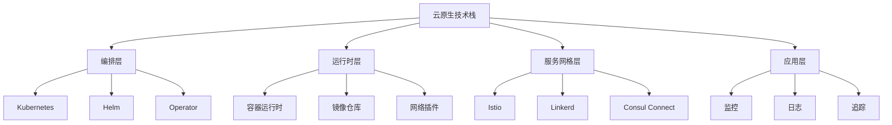

# 容器技术标准详解

## 概述

本文档深入解析容器技术的国际标准，包括OCI(Open Container Initiative)标准、CNCF(Cloud Native Computing Foundation)标准等，为容器技术的标准化应用提供权威指导。

## OCI 容器标准体系

### 1. OCI Runtime Specification

#### 1.1 标准概述

**OCI Runtime Specification v1.0.2**

- **发布机构**: Open Container Initiative
- **发布时间**: 2019年10月
- **标准范围**: 容器运行时接口标准化
- **核心目标**: 定义容器运行时的标准接口和行为

#### 1.2 核心组件

**容器生命周期管理**

```yaml
# 容器生命周期状态
states:
  creating: 容器创建中
  created: 容器已创建
  running: 容器运行中
  stopped: 容器已停止
  paused: 容器已暂停
  removing: 容器删除中
```

**资源隔离机制**

- **命名空间隔离**: PID、网络、挂载、用户、IPC、UTS、Cgroup
- **控制组限制**: CPU、内存、I/O、网络带宽
- **能力控制**: Linux capabilities、SELinux、AppArmor
- **文件系统隔离**: 根文件系统、挂载点、设备访问

**安全控制标准**

- **用户权限**: 非特权用户运行、用户映射
- **文件权限**: 文件系统权限、设备访问权限
- **网络隔离**: 网络命名空间、防火墙规则
- **进程限制**: 进程数量限制、资源使用限制

#### 1.3 标准实现

**主流运行时实现**

- **runc**: Docker默认运行时，OCI标准参考实现
- **crun**: 轻量级运行时，性能优化
- **gvisor**: 用户空间内核，安全隔离
- **kata-containers**: 轻量级虚拟机，强隔离

**性能对比分析**

| 运行时 | 启动时间 | 内存开销 | 安全级别 | 兼容性 |
|--------|----------|----------|----------|--------|
| runc   | 快       | 低       | 中等     | 高     |
| crun   | 很快     | 很低     | 中等     | 高     |
| gvisor | 中等     | 中等     | 高       | 中等   |
| kata   | 慢       | 高       | 很高     | 中等   |

### 2. OCI Image Specification

#### 2.1 镜像格式标准

**镜像层结构**

```json
{
  "schemaVersion": 2,
  "mediaType": "application/vnd.oci.image.manifest.v1+json",
  "config": {
    "mediaType": "application/vnd.oci.image.config.v1+json",
    "size": 1469,
    "digest": "sha256:5b0bcabd1ed22e9fb1310cf6c2dec7cdef19f0ad69efa1f392e94a4333501270"
  },
  "layers": [
    {
      "mediaType": "application/vnd.oci.image.layer.v1.tar+gzip",
      "size": 32654,
      "digest": "sha256:e692418e4cbaf90ca69d05a66403747baa33ee08806650b51fab815ad7fc331f"
    }
  ]
}
```

**镜像配置标准**

- **架构支持**: amd64、arm64、ppc64le、s390x
- **操作系统**: Linux、Windows
- **环境变量**: 运行时环境配置
- **入口点**: 容器启动命令和参数
- **工作目录**: 容器内工作目录
- **用户设置**: 运行用户和组

#### 2.2 镜像安全标准

**镜像签名验证**

- **数字签名**: 使用GPG、X.509证书签名
- **内容哈希**: SHA256内容完整性验证
- **时间戳**: 签名时间戳验证
- **撤销机制**: 证书撤销列表(CRL)

**镜像扫描标准**

- **漏洞扫描**: CVE漏洞数据库检查
- **恶意软件检测**: 病毒、木马检测
- **合规性检查**: 安全策略合规性验证
- **许可证检查**: 开源许可证合规性

### 3. OCI Distribution Specification

#### 3.1 注册表标准

**API接口标准**

```http
# 镜像清单获取
GET /v2/{name}/manifests/{reference}
Authorization: Bearer {token}
Accept: application/vnd.oci.image.manifest.v1+json

# 镜像层下载
GET /v2/{name}/blobs/{digest}
Authorization: Bearer {token}
```

**认证授权标准**

- **Bearer Token**: OAuth 2.0 Bearer Token认证
- **Basic Auth**: HTTP Basic认证
- **JWT Token**: JSON Web Token认证
- **API Key**: 基于API密钥的认证

#### 3.2 内容分发标准

**内容发现机制**

- **清单发现**: 通过标签或摘要发现镜像
- **层去重**: 基于内容哈希的层去重
- **增量同步**: 只传输变更的层
- **多架构支持**: 支持多架构镜像分发

## CNCF 云原生标准

### 1. 云原生定义标准

#### 1.1 云原生技术栈

**CNCF Cloud Native Definition v1.0**

- **容器化**: 应用程序打包在容器中
- **微服务**: 应用程序分解为微服务
- **DevOps**: 开发运维一体化
- **持续交付**: 自动化部署和发布

**技术栈组件**



#### 1.2 云原生原则

**12-Factor App原则**

1. **代码库**: 一个代码库，多个部署
2. **依赖**: 显式声明依赖关系
3. **配置**: 在环境中存储配置
4. **后端服务**: 把后端服务当作附加资源
5. **构建、发布、运行**: 严格分离构建和运行阶段
6. **进程**: 以一个或多个无状态进程运行应用
7. **端口绑定**: 通过端口绑定提供服务
8. **并发**: 通过进程模型进行扩展
9. **易处理**: 快速启动和优雅终止
10. **开发环境与生产环境等价**: 保持开发、预发布、生产环境一致
11. **日志**: 把日志当作事件流
12. **管理进程**: 后台管理任务当作一次性进程运行

### 2. Kubernetes 标准

#### 2.1 API 设计标准

**API版本控制**

```yaml
# API版本控制示例
apiVersion: apps/v1
kind: Deployment
metadata:
  name: nginx-deployment
  labels:
    app: nginx
spec:
  replicas: 3
  selector:
    matchLabels:
      app: nginx
  template:
    metadata:
      labels:
        app: nginx
    spec:
      containers:
      - name: nginx
        image: nginx:1.14.2
        ports:
        - containerPort: 80
```

**资源定义标准**

- **命名规范**: 使用小写字母和连字符
- **标签标准**: 使用标准标签键值对
- **注解规范**: 使用标准注解格式
- **选择器规范**: 使用标签选择器

#### 2.2 扩展机制标准

**自定义资源定义(CRD)**

```yaml
# CRD定义示例
apiVersion: apiextensions.k8s.io/v1
kind: CustomResourceDefinition
metadata:
  name: crontabs.stable.example.com
spec:
  group: stable.example.com
  versions:
  - name: v1
    served: true
    storage: true
    schema:
      openAPIV3Schema:
        type: object
        properties:
          spec:
            type: object
            properties:
              cronSpec:
                type: string
              image:
                type: string
              replicas:
                type: integer
  scope: Namespaced
  names:
    plural: crontabs
    singular: crontab
    kind: CronTab
```

**Operator模式标准**

- **控制器模式**: 使用控制器模式管理自定义资源
- **事件驱动**: 基于事件驱动的资源管理
- **状态管理**: 维护资源期望状态和实际状态
- **错误处理**: 实现错误处理和重试机制

### 3. 服务网格标准

#### 3.1 Service Mesh Interface (SMI)

**SMI标准组件**

- **流量管理**: 流量分割、流量镜像、流量限制
- **安全策略**: mTLS、访问控制、认证授权
- **可观测性**: 指标收集、日志聚合、分布式追踪

**SMI资源定义**

```yaml
# 流量分割示例
apiVersion: split.smi-spec.io/v1alpha2
kind: TrafficSplit
metadata:
  name: bookstore-split
spec:
  service: bookstore
  backends:
  - service: bookstore-v1
    weight: 50
  - service: bookstore-v2
    weight: 50
```

#### 3.2 服务网格实现标准

**Istio标准**

- **数据平面**: Envoy代理、Sidecar模式
- **控制平面**: Pilot、Citadel、Galley
- **管理平面**: Istio Dashboard、监控集成

**Linkerd标准**

- **轻量级设计**: 最小化资源消耗
- **简单配置**: 零配置服务网格
- **高性能**: 优化的数据平面性能

## 容器安全标准

### 1. 容器运行时安全

#### 1.1 安全基线标准

**CIS Docker Benchmark**

- **主机配置**: 主机安全配置检查
- **Docker守护进程**: 守护进程安全配置
- **容器镜像**: 镜像安全扫描和验证
- **容器运行时**: 运行时安全配置

**安全配置检查清单**

```yaml
# 安全配置示例
security:
  user: "1000:1000"  # 非root用户
  readOnlyRootFilesystem: true  # 只读根文件系统
  allowPrivilegeEscalation: false  # 禁止权限提升
  capabilities:
    drop:
    - ALL
    add:
    - NET_BIND_SERVICE
  seccompProfile:
    type: RuntimeDefault
```

#### 1.2 容器隔离标准

**命名空间隔离**

- **PID命名空间**: 进程ID隔离
- **网络命名空间**: 网络栈隔离
- **挂载命名空间**: 文件系统隔离
- **用户命名空间**: 用户ID隔离

**控制组限制**

- **CPU限制**: CPU使用率限制
- **内存限制**: 内存使用量限制
- **I/O限制**: 磁盘I/O限制
- **网络限制**: 网络带宽限制

### 2. 容器镜像安全

#### 2.1 镜像构建安全

**多阶段构建安全**

```dockerfile
# 多阶段构建示例
FROM golang:1.19-alpine AS builder
WORKDIR /app
COPY . .
RUN go build -o app .

FROM alpine:latest
RUN apk --no-cache add ca-certificates
WORKDIR /root/
COPY --from=builder /app/app .
CMD ["./app"]
```

**安全构建原则**

- **最小化基础镜像**: 使用最小化基础镜像
- **非root用户**: 使用非特权用户运行
- **只读文件系统**: 使用只读根文件系统
- **最小权限**: 遵循最小权限原则

#### 2.2 镜像扫描标准

**漏洞扫描标准**

- **CVE数据库**: 使用最新CVE数据库
- **扫描频率**: 定期扫描镜像漏洞
- **严重性分级**: 按严重性分级处理漏洞
- **修复策略**: 制定漏洞修复策略

**合规性检查标准**

- **许可证检查**: 开源许可证合规性
- **安全策略**: 企业安全策略合规性
- **配置检查**: 安全配置合规性
- **最佳实践**: 安全最佳实践合规性

## 容器编排标准

### 1. Kubernetes 安全标准

#### 1.1 RBAC 权限控制

**角色定义标准**

```yaml
# Role定义示例
apiVersion: rbac.authorization.k8s.io/v1
kind: Role
metadata:
  namespace: default
  name: pod-reader
rules:
- apiGroups: [""]
  resources: ["pods"]
  verbs: ["get", "watch", "list"]
```

**集群角色标准**

```yaml
# ClusterRole定义示例
apiVersion: rbac.authorization.k8s.io/v1
kind: ClusterRole
metadata:
  name: secret-reader
rules:
- apiGroups: [""]
  resources: ["secrets"]
  verbs: ["get", "watch", "list"]
```

#### 1.2 网络策略标准

**网络隔离策略**

```yaml
# NetworkPolicy示例
apiVersion: networking.k8s.io/v1
kind: NetworkPolicy
metadata:
  name: test-network-policy
  namespace: default
spec:
  podSelector:
    matchLabels:
      role: db
  policyTypes:
  - Ingress
  - Egress
  ingress:
  - from:
    - namespaceSelector:
        matchLabels:
          name: frontend
    ports:
    - protocol: TCP
      port: 6379
```

### 2. 服务网格安全标准

#### 2.1 mTLS 认证标准

**证书管理标准**

- **证书颁发**: 自动证书颁发和轮换
- **证书验证**: 双向TLS认证
- **证书存储**: 安全的证书存储机制
- **证书撤销**: 证书撤销和更新机制

**安全策略标准**

```yaml
# 安全策略示例
apiVersion: security.istio.io/v1beta1
kind: PeerAuthentication
metadata:
  name: default
  namespace: production
spec:
  mtls:
    mode: STRICT
```

#### 2.2 访问控制标准

**授权策略标准**

```yaml
# 授权策略示例
apiVersion: security.istio.io/v1beta1
kind: AuthorizationPolicy
metadata:
  name: allow-nothing
  namespace: production
spec:
  {}
---
apiVersion: security.istio.io/v1beta1
kind: AuthorizationPolicy
metadata:
  name: productpage-viewer
  namespace: production
spec:
  selector:
    matchLabels:
      app: productpage
  rules:
  - from:
    - source:
        principals: ["cluster.local/ns/default/sa/bookinfo-productpage"]
    to:
    - operation:
        methods: ["GET"]
```

## 标准实施指南

### 1. 标准采用策略

#### 1.1 渐进式采用

**阶段1: 基础标准采用**

- 采用OCI Runtime和Image标准
- 实施基础安全配置
- 建立镜像扫描机制

**阶段2: 高级标准采用**

- 实施Kubernetes安全标准
- 部署服务网格
- 建立完整的监控体系

**阶段3: 全面标准采用**

- 实施完整的云原生标准
- 建立自动化安全流程
- 实现持续合规性检查

#### 1.2 标准评估方法

**标准符合性评估**

- **技术符合性**: 技术实现符合标准要求
- **流程符合性**: 流程符合标准规范
- **文档符合性**: 文档符合标准格式
- **测试符合性**: 测试符合标准方法

### 2. 标准维护机制

#### 2.1 标准更新跟踪

**标准版本跟踪**

- 跟踪标准版本更新
- 评估新版本影响
- 制定升级计划
- 实施版本升级

**标准变化管理**

- 分析标准变化影响
- 更新实施计划
- 培训相关人员
- 验证实施效果

#### 2.2 标准质量保证

**标准实施验证**

- 定期验证标准实施
- 检查标准符合性
- 识别改进机会
- 持续优化实施

**标准效果评估**

- 评估标准实施效果
- 收集用户反馈
- 分析改进需求
- 优化标准实施

## 总结

容器技术标准体系为容器技术的标准化应用提供了完整的框架。通过系统性的标准分析和实施，可以确保容器技术的安全性、可靠性和互操作性。

主要标准包括：

1. **OCI标准**: 容器运行时、镜像格式、分发接口的标准化
2. **CNCF标准**: 云原生技术的标准化和最佳实践
3. **安全标准**: 容器安全、镜像安全、编排安全的标准化
4. **实施标准**: 标准采用、维护、质量保证的标准化

通过持续的标准跟踪和实施，可以确保容器技术应用始终符合国际先进标准，为企业的数字化转型提供可靠的技术支撑。
