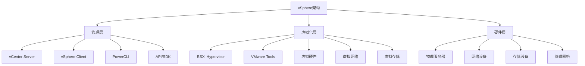
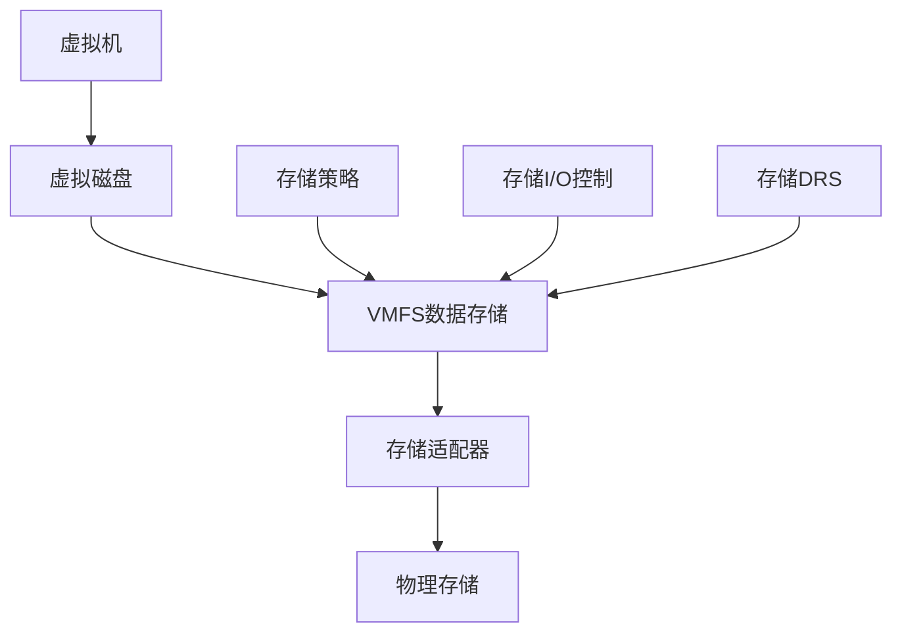
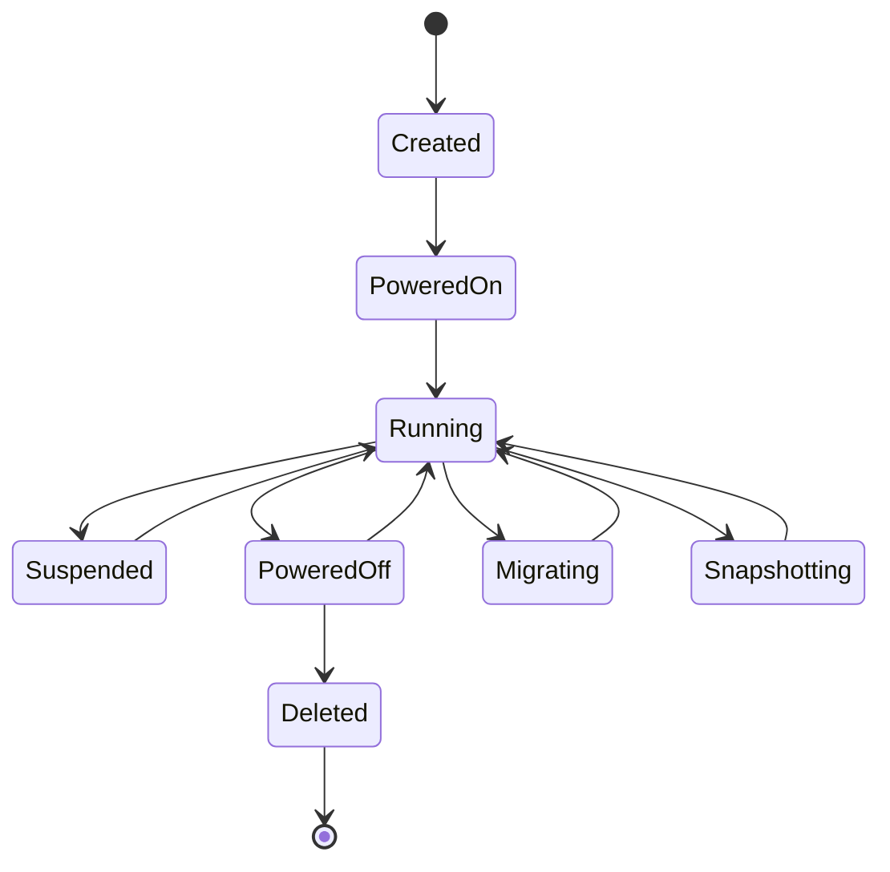

# vSphere架构深度解析

## 概述

本文档深入解析VMware vSphere的架构设计，包括ESXi、vCenter Server、虚拟化层、管理层的完整技术体系。通过系统性的架构分析，为vSphere的部署、管理和优化提供全面的技术指导。

## vSphere总体架构

### 1. 架构层次结构



### 2. 核心组件关系

**vSphere核心组件**

- **ESXi**: 裸机虚拟化平台
- **vCenter Server**: 集中管理平台
- **vSphere Client**: 管理界面
- **VMware Tools**: 虚拟机增强工具
- **vSphere API**: 编程接口

**组件交互关系**

```yaml
# 组件交互示例
vCenter_Server:
  manages: [ESXi_hosts, Virtual_machines, Datastores, Networks]
  provides: [Centralized_management, High_availability, Resource_optimization]
  
ESXi_Host:
  runs: [Virtual_machines, Virtual_networks, Virtual_storage]
  provides: [Hardware_abstraction, Resource_isolation, Performance_optimization]
  
Virtual_Machine:
  uses: [Virtual_CPU, Virtual_Memory, Virtual_Disk, Virtual_NIC]
  benefits: [Hardware_independence, Snapshot, Cloning, Migration]
```

## ESXi架构深度分析

### 1. ESXi内核架构

#### 1.1 VMkernel架构

**VMkernel核心组件**

```text
VMkernel架构层次:
├── 用户空间 (User Space)
│   ├── 虚拟机 (Virtual Machines)
│   ├── 管理代理 (Management Agents)
│   └── 服务控制台 (Service Console)
├── VMkernel内核空间 (Kernel Space)
│   ├── 虚拟化层 (Virtualization Layer)
│   ├── 资源管理器 (Resource Manager)
│   ├── 设备驱动 (Device Drivers)
│   └── 硬件抽象层 (HAL)
└── 硬件层 (Hardware Layer)
    ├── CPU (Intel VT-x/AMD-V)
    ├── 内存 (MMU/EPT)
    ├── I/O设备 (PCIe/SATA/NIC)
    └── 固件 (UEFI/BIOS)
```

**VMkernel关键特性**

- **微内核设计**: 最小化内核代码，提高稳定性
- **直接硬件访问**: 绕过操作系统，直接访问硬件
- **资源隔离**: 虚拟机间完全隔离
- **性能优化**: 优化的I/O路径和内存管理

#### 1.2 虚拟化技术实现

**CPU虚拟化**

```yaml
# CPU虚拟化技术
CPU_Virtualization:
  Intel_VT_x:
    features: [VMX_instructions, Extended_page_tables, VT_d]
    benefits: [Hardware_assisted_virtualization, Performance_improvement]
  
  AMD_V:
    features: [SVM_instructions, Nested_page_tables, IOMMU]
    benefits: [Hardware_assisted_virtualization, Memory_optimization]
  
  Software_Virtualization:
    technique: [Binary_translation, Paravirtualization]
    use_case: [Legacy_hardware, Compatibility_mode]
```

**内存虚拟化**

```yaml
# 内存虚拟化技术
Memory_Virtualization:
  Shadow_Page_Tables:
    technique: [Guest_PT -> Shadow_PT -> Host_PT]
    overhead: [High_memory_overhead, Complex_management]
  
  Extended_Page_Tables:
    technique: [Guest_PT -> EPT -> Host_PT]
    benefits: [Hardware_assisted, Lower_overhead]
  
  Memory_Ballooning:
    technique: [Dynamic_memory_reclamation]
    benefits: [Memory_overcommit, Dynamic_allocation]
```

### 2. ESXi存储架构

#### 2.1 存储虚拟化层

**存储抽象层**



**VMFS文件系统**

```yaml
# VMFS特性
VMFS_Features:
  version: "VMFS-6"
  features:
    - "64TB_max_volume_size"
    - "2MB_block_size"
    - "Atomic_file_operations"
    - "Distributed_locking"
    - "Snapshot_support"
    - "Thin_provisioning"
  
  performance:
    - "Concurrent_access"
    - "Load_balancing"
    - "I/O_optimization"
    - "Cache_management"
```

#### 2.2 存储I/O路径

**I/O处理流程**

```text
虚拟机I/O处理流程:
1. 虚拟机发起I/O请求
2. 虚拟SCSI适配器处理
3. VMkernel I/O管理器调度
4. 存储适配器驱动处理
5. 物理存储设备执行
6. I/O完成回调处理
7. 虚拟机接收I/O完成通知
```

**存储性能优化**

- **队列深度优化**: 调整设备队列深度
- **I/O调度算法**: 使用优化的I/O调度器
- **缓存策略**: 实施智能缓存策略
- **负载均衡**: 存储路径负载均衡

### 3. ESXi网络架构

#### 3.1 虚拟网络层

**虚拟网络组件**

```yaml
# 虚拟网络架构
Virtual_Network:
  Virtual_Switch:
    types: [Standard_vSwitch, Distributed_vSwitch]
    features: [Port_groups, VLANs, Traffic_shaping]
  
  Virtual_NIC:
    types: [VMXNET3, E1000, SR-IOV]
    features: [Hardware_offload, Jumbo_frames, RSS]
  
  Network_Services:
    - "vMotion_network"
    - "Management_network"
    - "Storage_network"
    - "Fault_tolerance_network"
```

**分布式虚拟交换机**

```yaml
# vDS特性
Distributed_vSwitch:
  features:
    - "Centralized_management"
    - "Network_I/O_control"
    - "Port_mirroring"
    - "NetFlow_monitoring"
    - "LACP_support"
    - "Private_VLANs"
  
  benefits:
    - "Simplified_management"
    - "Enhanced_monitoring"
    - "Advanced_features"
    - "Scalability"
```

#### 3.2 网络性能优化

**网络I/O控制**

```yaml
# NIOC配置
Network_I/O_Control:
  traffic_types:
    - "vMotion"
    - "Fault_Tolerance"
    - "Management"
    - "Virtual_Machine"
    - "NFS"
    - "iSCSI"
  
  allocation_methods:
    - "Shares_based"
    - "Reservation_based"
    - "Limit_based"
```

## vCenter Server架构分析

### 1. vCenter Server组件架构

#### 1.1 服务组件

**vCenter Server服务**

```yaml
# vCenter服务组件
vCenter_Services:
  vpxd:
    description: "vCenter Server主服务"
    functions: ["API_server", "Database_interface", "Authentication"]
  
  vpxa:
    description: "ESXi主机代理"
    functions: ["Host_communication", "Command_execution", "Status_reporting"]
  
  vpxd-svcs:
    description: "vCenter服务管理"
    functions: ["Service_management", "Health_monitoring", "Logging"]
  
  vmware-vpxd:
    description: "vCenter核心服务"
    functions: ["Core_management", "Resource_scheduling", "Event_processing"]
```

#### 1.2 数据库架构

**vCenter数据库设计**

```sql
-- 核心表结构示例
CREATE TABLE vpx_host (
    id INT PRIMARY KEY,
    name VARCHAR(255),
    ip_address VARCHAR(45),
    version VARCHAR(50),
    status VARCHAR(20)
);

CREATE TABLE vpx_vm (
    id INT PRIMARY KEY,
    name VARCHAR(255),
    host_id INT,
    power_state VARCHAR(20),
    guest_os VARCHAR(100),
    FOREIGN KEY (host_id) REFERENCES vpx_host(id)
);

CREATE TABLE vpx_datastore (
    id INT PRIMARY KEY,
    name VARCHAR(255),
    type VARCHAR(50),
    capacity BIGINT,
    free_space BIGINT
);
```

### 2. vCenter Server功能模块

#### 2.1 资源管理

**资源池管理**

```yaml
# 资源池配置
Resource_Pool:
  CPU_Resources:
    shares: [Low, Normal, High, Custom]
    reservation: "MHz"
    limit: "MHz"
    expandable: true/false
  
  Memory_Resources:
    shares: [Low, Normal, High, Custom]
    reservation: "MB"
    limit: "MB"
    expandable: true/false
  
  Storage_Resources:
    datastores: ["datastore1", "datastore2"]
    storage_policy: "policy_name"
```

#### 2.2 高可用性

**vSphere HA配置**

```yaml
# HA配置参数
vSphere_HA:
  admission_control:
    policy: "Percentage" # Percentage, Slot, Failover
    percentage: 50
    slot_size: "CPU:256MHz,Memory:2GB"
  
  heartbeat_datastores:
    selection_policy: "automatic" # automatic, user
    datastores: ["datastore1", "datastore2"]
  
  isolation_response:
    power_off: true
    shutdown: false
```

**vSphere DRS配置**

```yaml
# DRS配置参数
vSphere_DRS:
  automation_level: "FullyAutomated" # Manual, PartiallyAutomated, FullyAutomated
  migration_threshold: 3 # 1-5 scale
  predictive_drs: true
  
  rules:
    - type: "affinity"
      vms: ["vm1", "vm2"]
      hosts: ["host1", "host2"]
    - type: "anti-affinity"
      vms: ["vm3", "vm4"]
```

## 虚拟化技术深度分析

### 1. 虚拟机架构

#### 1.1 虚拟硬件抽象

**虚拟硬件组件**

```yaml
# 虚拟硬件架构
Virtual_Hardware:
  CPU:
    type: "Virtual CPU (vCPU)"
    features: ["Hardware_virtualization", "Multi_core", "Hot_add"]
    limits: "Max_128_vCPUs_per_VM"
  
  Memory:
    type: "Virtual Memory (vRAM)"
    features: ["Memory_overcommit", "Balloon_driver", "Hot_add"]
    limits: "Max_6TB_per_VM"
  
  Storage:
    type: "Virtual Disk (vDisk)"
    formats: ["VMDK", "RDM", "VVols"]
    features: ["Thin_provisioning", "Snapshot", "Cloning"]
  
  Network:
    type: "Virtual NIC (vNIC)"
    adapters: ["VMXNET3", "E1000", "SR-IOV"]
    features: ["Hardware_offload", "Jumbo_frames"]
```

#### 1.2 虚拟机生命周期

**VM生命周期管理**



### 2. 高级虚拟化特性

#### 2.1 vMotion技术

**vMotion工作原理**

```yaml
# vMotion技术细节
vMotion_Technology:
  prerequisites:
    - "Shared_storage"
    - "Compatible_CPUs"
    - "Network_connectivity"
    - "Sufficient_resources"
  
  process:
    1: "Pre_copy_phase"
    2: "Switch_over_phase"
    3: "Cleanup_phase"
  
  performance:
    - "Zero_downtime"
    - "Memory_compression"
    - "Network_optimization"
    - "CPU_compatibility_check"
```

#### 2.2 存储vMotion

**Storage vMotion技术**

```yaml
# Storage vMotion特性
Storage_vMotion:
  features:
    - "Zero_downtime_migration"
    - "Thin_to_thick_conversion"
    - "Thick_to_thin_conversion"
    - "Datastore_migration"
  
  use_cases:
    - "Storage_maintenance"
    - "Performance_optimization"
    - "Capacity_management"
    - "Storage_tiering"
```

#### 2.3 容错技术

**vSphere Fault Tolerance**

```yaml
# FT技术特性
Fault_Tolerance:
  requirements:
    - "FT_compatible_CPUs"
    - "Shared_storage"
    - "FT_network"
    - "Sufficient_resources"
  
  limitations:
    - "Single_vCPU_only"
    - "No_snapshot_support"
    - "No_paravirtualized_devices"
    - "No_RDM_support"
  
  benefits:
    - "Zero_downtime_protection"
    - "Continuous_availability"
    - "Automatic_failover"
```

## 性能优化与调优

### 1. CPU性能优化

#### 1.1 CPU调度优化

**CPU调度策略**

```yaml
# CPU调度配置
CPU_Scheduling:
  scheduler: "Co-scheduler"
  features:
    - "CPU_affinity"
    - "NUMA_awareness"
    - "CPU_overcommit"
    - "Load_balancing"
  
  optimization:
    - "Right_size_VMs"
    - "CPU_affinity_rules"
    - "NUMA_topology_awareness"
    - "CPU_reservations"
```

#### 1.2 内存性能优化

**内存管理优化**

```yaml
# 内存优化策略
Memory_Optimization:
  techniques:
    - "Memory_overcommit"
    - "Balloon_driver"
    - "Memory_compression"
    - "TPS_(Transparent_Page_Sharing)"
  
  monitoring:
    - "Memory_usage"
    - "Balloon_driver_activity"
    - "Memory_compression_ratio"
    - "TPS_effectiveness"
```

### 2. 存储性能优化

#### 2.1 存储I/O优化

**存储性能调优**

```yaml
# 存储优化配置
Storage_Optimization:
  queue_depth:
    default: 32
    optimized: 64-128
    monitoring: "Queue_depth_utilization"
  
  multipathing:
    policy: "Round_Robin" # Round_Robin, Fixed, MRU
    path_selection: "Automatic"
  
  caching:
    read_cache: "Enabled"
    write_cache: "Enabled"
    cache_size: "Adaptive"
```

#### 2.2 网络性能优化

**网络性能调优**

```yaml
# 网络优化配置
Network_Optimization:
  virtual_switches:
    - "Use_vDS_when_possible"
    - "Optimize_port_group_settings"
    - "Enable_network_I/O_control"
  
  virtual_nics:
    - "Use_VMXNET3_adapter"
    - "Enable_jumbo_frames"
    - "Configure_RSS"
    - "Enable_hardware_offload"
```

## 安全架构分析

### 1. 虚拟化安全

#### 1.1 虚拟机隔离

**VM隔离机制**

```yaml
# VM安全隔离
VM_Isolation:
  hardware_isolation:
    - "CPU_virtualization"
    - "Memory_virtualization"
    - "I/O_virtualization"
    - "Network_virtualization"
  
  software_isolation:
    - "VMkernel_protection"
    - "Hypervisor_security"
    - "Guest_OS_isolation"
    - "Application_isolation"
```

#### 1.2 管理安全

**管理安全控制**

```yaml
# 管理安全配置
Management_Security:
  authentication:
    - "Active_Directory_integration"
    - "Multi_factor_authentication"
    - "Role_based_access_control"
    - "Single_sign_on"
  
  authorization:
    - "RBAC_roles"
    - "Permission_sets"
    - "Object_permissions"
    - "Privilege_escalation_control"
```

### 2. 网络安全

#### 2.1 虚拟网络安全

**虚拟网络安全**

```yaml
# 虚拟网络安全
Virtual_Network_Security:
  micro_segmentation:
    - "NSX_distributed_firewall"
    - "Network_security_groups"
    - "Traffic_isolation"
    - "Zero_trust_networking"
  
  encryption:
    - "vMotion_encryption"
    - "Storage_encryption"
    - "Network_encryption"
    - "Key_management"
```

## 监控与故障排除

### 1. 性能监控

#### 1.1 监控指标

**关键性能指标**

```yaml
# 性能监控指标
Performance_Metrics:
  CPU:
    - "CPU_utilization"
    - "CPU_ready_time"
    - "CPU_co_stop_time"
    - "CPU_wait_time"
  
  Memory:
    - "Memory_utilization"
    - "Memory_ballooning"
    - "Memory_compression"
    - "Memory_swapping"
  
  Storage:
    - "Storage_utilization"
    - "Storage_latency"
    - "Storage_throughput"
    - "Storage_queue_depth"
  
  Network:
    - "Network_utilization"
    - "Network_latency"
    - "Network_packet_loss"
    - "Network_throughput"
```

#### 1.2 监控工具

**监控工具集成**

```yaml
# 监控工具
Monitoring_Tools:
  vSphere_native:
    - "vCenter_Server_performance_charts"
    - "ESXi_performance_charts"
    - "vRealize_Operations"
    - "vRealize_Log_Insight"
  
  third_party:
    - "Nagios"
    - "Zabbix"
    - "Prometheus"
    - "Grafana"
```

### 2. 故障排除

#### 2.1 常见问题诊断

**故障诊断流程**

```yaml
# 故障诊断
Troubleshooting:
  performance_issues:
    1: "Identify_bottleneck"
    2: "Analyze_metrics"
    3: "Check_configuration"
    4: "Apply_optimization"
    5: "Monitor_results"
  
  connectivity_issues:
    1: "Check_network_connectivity"
    2: "Verify_vSwitch_configuration"
    3: "Check_VLAN_settings"
    4: "Test_network_paths"
    5: "Review_network_logs"
```

## 总结

vSphere架构是一个复杂而完整的虚拟化平台，通过深入分析其架构组件、技术实现和优化策略，可以更好地理解和使用vSphere技术。

主要架构特点：

1. **分层架构**: 清晰的分层设计，便于管理和扩展
2. **硬件抽象**: 完整的硬件虚拟化抽象
3. **资源管理**: 智能的资源调度和管理
4. **高可用性**: 完善的高可用性机制
5. **性能优化**: 多层次的性能优化策略
6. **安全控制**: 全面的安全控制机制

通过系统性的架构理解和优化实践，可以充分发挥vSphere的技术优势，为企业虚拟化环境提供稳定、高效、安全的技术支撑。
