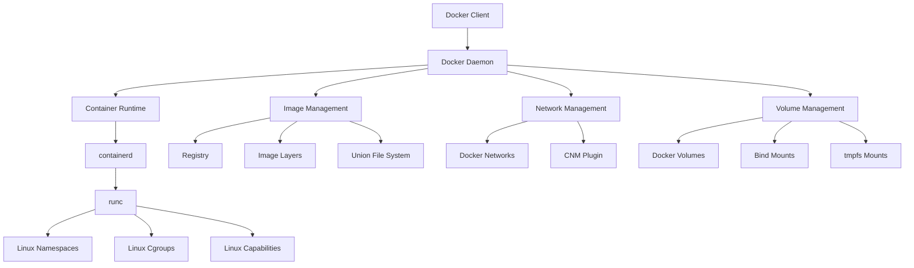

# Docker技术深度解析

## 摘要

本文档深入解析Docker容器技术的核心原理、架构设计、实现机制和最佳实践，为容器化应用开发和部署提供全面的技术指导。

## 目录

- [Docker技术深度解析](#docker技术深度解析)
  - [摘要](#摘要)
  - [1. Docker核心架构](#1-docker核心架构)
  - [2. 容器运行时机制](#2-容器运行时机制)
  - [3. 网络架构](#3-网络架构)
  - [4. 存储架构](#4-存储架构)
  - [5. 容器编排](#5-容器编排)
  - [6. 性能优化](#6-性能优化)
  - [7. 安全最佳实践](#7-安全最佳实践)
  - [8. Docker生态系统](#8-docker生态系统)
  - [9. Docker最佳实践](#9-docker最佳实践)
  - [10. Docker故障排除](#10-docker故障排除)
  - [11. 总结](#11-总结)

## 1. Docker核心架构

### 1.1 整体架构



### 1.2 核心组件

#### 1.2.1 Docker Engine

**架构组成**:

- **Docker Daemon**: 后台服务进程
- **Docker CLI**: 命令行接口
- **REST API**: 程序化接口
- **数学表示**: $Docker\_Engine = \{Daemon, CLI, REST\_API\}$

**功能特性**:

- 容器生命周期管理
- 镜像构建和管理
- 网络和存储管理
- 插件系统支持

#### 1.2.2 Container Runtime

**运行时层次**:

- **containerd**: 高级容器运行时
- **runc**: 低级容器运行时
- **shim**: 容器进程管理
- **数学表示**: $Runtime = \{containerd, runc, shim\}$

**技术实现**:

- Linux Namespaces隔离
- Linux Cgroups资源限制
- Linux Capabilities权限控制
- Seccomp系统调用过滤

### 1.3 镜像系统

#### 1.3.1 镜像架构

**分层结构**:

- **基础层**: 操作系统基础镜像
- **中间层**: 软件包和依赖
- **应用层**: 应用程序代码
- **数学表示**: $Image = \{Base\_Layer, Middle\_Layers, App\_Layer\}$

**存储机制**:

- **Layer**: 只读文件系统层
- **UnionFS**: 联合文件系统
- **Copy-on-Write**: 写时复制
- **数学表示**: $Storage = \{Layer, UnionFS, CoW\}$

#### 1.3.2 镜像构建

**构建过程**:

1. **Dockerfile解析**: 解析构建指令
2. **上下文准备**: 准备构建上下文
3. **层构建**: 逐层构建镜像
4. **元数据生成**: 生成镜像元数据

- **数学表示**: $Build = \{Parse, Context, Layer, Metadata\}$

**优化策略**:

- 多阶段构建
- 层缓存优化
- 镜像大小优化
- 构建时间优化

## 2. 容器运行时机制

### 2.1 命名空间隔离

#### 2.1.1 命名空间类型

**核心命名空间**:

- **PID Namespace**: 进程ID隔离
- **Network Namespace**: 网络栈隔离
- **Mount Namespace**: 文件系统隔离
- **UTS Namespace**: 主机名隔离
- **IPC Namespace**: 进程间通信隔离
- **User Namespace**: 用户ID隔离
- **数学表示**: $Namespaces = \{PID, Network, Mount, UTS, IPC, User\}$

**隔离效果**:

- 进程隔离: 容器内进程独立
- 网络隔离: 独立网络栈
- 文件系统隔离: 独立根文件系统
- 用户隔离: 独立用户空间

#### 2.1.2 命名空间实现

**系统调用**:

- `clone()`: 创建新命名空间
- `unshare()`: 分离命名空间
- `setns()`: 加入命名空间
- **数学表示**: $Syscalls = \{clone, unshare, setns\}$

**内核支持**:

- 命名空间数据结构
- 命名空间管理机制
- 命名空间生命周期
- 命名空间权限控制

### 2.2 资源控制

#### 2.2.1 Cgroups机制

**控制组类型**:

- **CPU**: CPU使用限制
- **Memory**: 内存使用限制
- **I/O**: 磁盘I/O限制
- **Network**: 网络带宽限制
- **数学表示**: $Cgroups = \{CPU, Memory, I/O, Network\}$

**控制策略**:

- **硬限制**: 绝对资源限制
- **软限制**: 可超限资源限制
- **权重分配**: 按权重分配资源
- **数学表示**: $Policy = \{Hard\_Limit, Soft\_Limit, Weight\}$

#### 2.2.2 资源监控

**监控指标**:

- CPU使用率
- 内存使用量
- 磁盘I/O统计
- 网络流量统计
- **数学表示**: $Metrics = \{CPU\_Usage, Memory\_Usage, I/O\_Stats, Network\_Stats\}$

**监控实现**:

- Cgroups统计信息
- 系统调用监控
- 性能计数器
- 实时监控接口

### 2.3 安全机制

#### 2.3.1 权限控制

**Linux Capabilities**:

- **CAP_SYS_ADMIN**: 系统管理权限
- **CAP_NET_ADMIN**: 网络管理权限
- **CAP_DAC_OVERRIDE**: 文件访问权限
- **CAP_SETUID**: 用户ID设置权限
- **数学表示**: $Capabilities = \{SYS\_ADMIN, NET\_ADMIN, DAC\_OVERRIDE, SETUID\}$

**权限策略**:

- 最小权限原则
- 权限白名单
- 权限动态调整
- 权限审计日志

#### 2.3.2 系统调用过滤

**Seccomp机制**:

- **系统调用过滤**: 限制系统调用
- **过滤规则**: 定义允许/禁止的调用
- **过滤模式**: 严格模式/过滤模式
- **数学表示**: $Seccomp = \{Filter, Rules, Mode\}$

**安全策略**:

- 默认拒绝策略
- 白名单机制
- 动态策略调整
- 安全事件监控

## 3. 网络架构

### 3.1 网络模型

#### 3.1.1 网络驱动

**内置驱动**:

- **bridge**: 桥接网络
- **host**: 主机网络
- **none**: 无网络
- **overlay**: 覆盖网络
- **数学表示**: $Drivers = \{bridge, host, none, overlay\}$

**第三方驱动**:

- **macvlan**: MAC VLAN网络
- **ipvlan**: IP VLAN网络
- **自定义驱动**: 插件化网络驱动
- **数学表示**: $Third\_Party = \{macvlan, ipvlan, custom\}$

#### 3.1.2 网络配置

**网络参数**:

- **IP地址**: 容器IP地址
- **子网**: 网络子网配置
- **网关**: 网络网关设置
- **DNS**: DNS服务器配置
- **数学表示**: $Config = \{IP, Subnet, Gateway, DNS\}$

**网络策略**:

- 端口映射
- 网络隔离
- 流量控制
- 安全策略

### 3.2 服务发现

#### 3.2.1 DNS解析

**解析机制**:

- **内置DNS**: Docker内置DNS服务
- **外部DNS**: 外部DNS服务器
- **服务发现**: 自动服务发现
- **数学表示**: $DNS = \{Built\_in, External, Service\_Discovery\}$

**解析策略**:

- 容器名解析
- 服务名解析
- 外部域名解析
- 解析缓存机制

#### 3.2.2 负载均衡

**负载均衡算法**:

- **轮询**: Round Robin
- **最少连接**: Least Connections
- **IP哈希**: IP Hash
- **加权轮询**: Weighted Round Robin
- **数学表示**: $LB = \{RR, LC, IH, WRR\}$

**健康检查**:

- HTTP健康检查
- TCP健康检查
- 自定义健康检查
- 健康状态监控

## 4. 存储架构

### 4.1 存储驱动

#### 4.1.1 存储驱动类型

**Linux存储驱动**:

- **overlay2**: 推荐存储驱动
- **aufs**: 联合文件系统
- **devicemapper**: 设备映射
- **btrfs**: Btrfs文件系统
- **数学表示**: $Storage\_Drivers = \{overlay2, aufs, devicemapper, btrfs\}$

**Windows存储驱动**:

- **windowsfilter**: Windows过滤器
- **lcow**: Linux容器Windows
- **数学表示**: $Windows\_Drivers = \{windowsfilter, lcow\}$

#### 4.1.2 存储优化

**性能优化**:

- 存储驱动选择
- 层缓存优化
- 写时复制优化
- 存储空间管理

**空间管理**:

- 镜像清理
- 容器清理
- 卷清理
- 垃圾回收

### 4.2 数据卷

#### 4.2.1 卷类型

**卷类型**:

- **Docker Volumes**: Docker管理卷
- **Bind Mounts**: 绑定挂载
- **tmpfs Mounts**: 内存文件系统
- **数学表示**: $Volume\_Types = \{Docker\_Volumes, Bind\_Mounts, tmpfs\_Mounts\}$

**卷特性**:

- 数据持久化
- 数据共享
- 数据备份
- 数据迁移

#### 4.2.2 卷管理

**卷操作**:

- 卷创建
- 卷挂载
- 卷卸载
- 卷删除
- **数学表示**: $Volume\_Ops = \{Create, Mount, Unmount, Delete\}$

**卷插件**:

- 本地存储插件
- 网络存储插件
- 云存储插件
- 自定义存储插件

## 5. 容器编排

### 5.1 Docker Compose

#### 5.1.1 服务定义

**服务配置**:

- **image**: 镜像名称
- **build**: 构建配置
- **ports**: 端口映射
- **volumes**: 卷挂载
- **environment**: 环境变量
- **数学表示**: $Service = \{image, build, ports, volumes, environment\}$

**网络配置**:

- 服务间网络
- 外部网络
- 网络驱动
- 网络参数

#### 5.1.2 编排特性

**编排功能**:

- 服务依赖管理
- 服务扩展
- 服务更新
- 服务回滚
- **数学表示**: $Orchestration = \{Dependencies, Scaling, Updates, Rollback\}$

**配置管理**:

- 环境配置
- 密钥管理
- 配置模板
- 配置验证

### 5.2 Docker Swarm

#### 5.2.1 集群架构

**节点类型**:

- **Manager节点**: 管理节点
- **Worker节点**: 工作节点
- **数学表示**: $Nodes = \{Manager, Worker\}$

**服务模式**:

- **Replicated**: 复制服务
- **Global**: 全局服务
- **数学表示**: $Service\_Mode = \{Replicated, Global\}$

#### 5.2.2 服务管理

**服务特性**:

- 服务发现
- 负载均衡
- 滚动更新
- 故障恢复
- **数学表示**: $Service\_Features = \{Discovery, LB, Rolling\_Update, Recovery\}$

**网络管理**:

- 覆盖网络
- 服务网络
- 网络隔离
- 网络加密

## 6. 性能优化

### 6.1 容器性能

#### 6.1.1 启动性能

**启动优化**:

- 镜像大小优化
- 启动参数优化
- 预加载机制
- 冷启动优化
- **数学表示**: $Startup\_Opt = \{Image\_Size, Params, Preload, Cold\_Start\}$

**性能指标**:

- 启动时间
- 内存占用
- CPU使用率
- 资源利用率

#### 6.1.2 运行时性能

**性能调优**:

- CPU调度优化
- 内存管理优化
- I/O性能优化
- 网络性能优化
- **数学表示**: $Runtime\_Opt = \{CPU\_Sched, Memory\_Mgmt, I/O\_Opt, Network\_Opt\}$

**监控指标**:

- 响应时间
- 吞吐量
- 资源使用率
- 错误率

### 6.2 镜像优化

#### 6.2.1 镜像构建优化

**构建策略**:

- 多阶段构建
- 层缓存利用
- 构建上下文优化
- 并行构建
- **数学表示**: $Build\_Opt = \{Multi\_stage, Layer\_Cache, Context\_Opt, Parallel\_Build\}$

**镜像优化**:

- 基础镜像选择
- 层合并优化
- 文件系统优化
- 压缩算法选择

#### 6.2.2 镜像管理

**镜像策略**:

- 镜像标签管理
- 镜像版本控制
- 镜像清理策略
- 镜像安全扫描
- **数学表示**: $Image\_Mgmt = \{Tag\_Mgmt, Version\_Control, Cleanup, Security\_Scan\}$

**存储优化**:

- 镜像去重
- 层共享
- 压缩存储
- 分层存储

## 7. 安全最佳实践

### 7.1 镜像安全

#### 7.1.1 安全扫描

**扫描内容**:

- 漏洞扫描
- 恶意软件检测
- 配置安全检查
- 依赖安全检查
- **数学表示**: $Security\_Scan = \{Vulnerability, Malware, Config, Dependencies\}$

**扫描工具**:

- Docker Security Scanning
- Clair
- Trivy
- Snyk

#### 7.1.2 安全策略

**安全原则**:

- 最小权限原则
- 深度防御
- 安全默认配置
- 持续安全监控
- **数学表示**: $Security\_Principles = \{Least\_Privilege, Defense\_in\_Depth, Secure\_Defaults, Continuous\_Monitoring\}$

**安全配置**:

- 非root用户运行
- 只读根文件系统
- 资源限制
- 网络隔离

### 7.2 运行时安全

#### 7.2.1 安全监控

**监控内容**:

- 容器行为监控
- 系统调用监控
- 网络流量监控
- 文件访问监控
- **数学表示**: $Security\_Monitor = \{Behavior, Syscalls, Network, File\_Access\}$

**监控工具**:

- Falco
- Aqua Security
- Twistlock
- Sysdig Secure

#### 7.2.2 安全响应

**响应机制**:

- 实时告警
- 自动隔离
- 事件记录
- 安全分析
- **数学表示**: $Security\_Response = \{Real\_time\_Alert, Auto\_Isolation, Event\_Logging, Security\_Analysis\}$

**应急处理**:

- 容器停止
- 网络隔离
- 数据保护
- 事件调查

## 8. Docker生态系统

### 8.1 Docker Hub与镜像仓库

#### 8.1.1 Docker Hub

**Docker Hub特性**:

```yaml
Docker_Hub:
  公共仓库:
    - 官方镜像
    - 社区镜像
    - 认证镜像
    - 自动化构建
  
  私有仓库:
    - 私有镜像存储
    - 团队协作
    - 访问控制
    - 镜像扫描
  
  企业功能:
    - 企业级支持
    - 高级安全
    - 合规性
    - 技术支持
```

**镜像管理策略**:

```yaml
镜像管理:
  版本控制:
    - 语义化版本
    - 标签管理
    - 版本回滚
    - 版本清理
  
  安全扫描:
    - 漏洞检测
    - 恶意软件扫描
    - 依赖分析
    - 合规检查
  
  镜像优化:
    - 多阶段构建
    - 层优化
    - 镜像压缩
    - 缓存策略
```

#### 8.1.2 私有镜像仓库

**Harbor企业级仓库**:

```yaml
Harbor_特性:
  高可用性:
    - 集群部署
    - 负载均衡
    - 故障转移
    - 数据备份
  
  安全功能:
    - 镜像签名
    - 漏洞扫描
    - 访问控制
    - 审计日志
  
  管理功能:
    - 项目管理
    - 用户管理
    - 配额管理
    - 垃圾回收
```

### 8.2 Docker开发工具链

#### 8.2.1 Docker Compose

**Compose文件格式**:

```yaml
# docker-compose.yml示例
version: '3.8'
services:
  web:
    image: nginx:alpine
    ports:
      - "80:80"
    volumes:
      - ./html:/usr/share/nginx/html
    environment:
      - NGINX_HOST=localhost
    depends_on:
      - db
  
  db:
    image: postgres:13
    environment:
      POSTGRES_DB: myapp
      POSTGRES_USER: user
      POSTGRES_PASSWORD: password
    volumes:
      - postgres_data:/var/lib/postgresql/data
    ports:
      - "5432:5432"

volumes:
  postgres_data:
```

**Compose高级特性**:

```yaml
Compose_高级特性:
  服务扩展:
    - 水平扩展
    - 负载均衡
    - 健康检查
    - 滚动更新
  
  网络管理:
    - 自定义网络
    - 网络隔离
    - 服务发现
    - 网络配置
  
  配置管理:
    - 环境变量
    - 配置文件
    - 密钥管理
    - 配置模板
```

#### 8.2.2 Docker Buildx

**多平台构建**:

```yaml
Buildx_特性:
  多架构支持:
    - AMD64
    - ARM64
    - ARMv7
    - 其他架构
  
  构建优化:
    - 并行构建
    - 缓存优化
    - 构建加速
    - 资源管理
  
  高级功能:
    - 自定义构建器
    - 远程构建
    - 构建输出
    - 构建历史
```

### 8.3 Docker监控与日志

#### 8.3.1 容器监控

**监控指标**:

```yaml
容器监控指标:
  资源指标:
    - CPU使用率
    - 内存使用量
    - 磁盘I/O
    - 网络I/O
  
  应用指标:
    - 请求响应时间
    - 错误率
    - 吞吐量
    - 并发连接数
  
  系统指标:
    - 容器数量
    - 镜像大小
    - 存储使用
    - 网络连接
```

**监控工具**:

```yaml
监控工具:
  Docker原生:
    - docker stats
    - docker events
    - docker logs
    - docker inspect
  
  第三方工具:
    - Prometheus
    - Grafana
    - cAdvisor
    - DataDog
  
  企业工具:
    - New Relic
    - AppDynamics
    - Dynatrace
    - Splunk
```

#### 8.3.2 日志管理

**日志收集**:

```yaml
日志收集:
  日志驱动:
    - json-file
    - syslog
    - journald
    - gelf
    - fluentd
    - awslogs
  
  日志格式:
    - 结构化日志
    - JSON格式
    - 时间戳
    - 日志级别
  
  日志聚合:
    - ELK Stack
    - Fluentd
    - Logstash
    - Splunk
```

## 9. Docker最佳实践

### 9.1 镜像构建最佳实践

#### 9.1.1 Dockerfile优化

**多阶段构建**:

```dockerfile
# 多阶段构建示例
FROM node:16-alpine AS builder
WORKDIR /app
COPY package*.json ./
RUN npm ci --only=production

FROM node:16-alpine AS runtime
WORKDIR /app
COPY --from=builder /app/node_modules ./node_modules
COPY . .
EXPOSE 3000
CMD ["npm", "start"]
```

**构建优化技巧**:

```yaml
构建优化:
  层优化:
    - 合并RUN指令
    - 使用.dockerignore
    - 最小化层数
    - 缓存利用
  
  基础镜像:
    - 选择合适的基础镜像
    - 使用Alpine Linux
    - 定期更新基础镜像
    - 安全扫描
  
  构建上下文:
    - 最小化构建上下文
    - 排除不必要文件
    - 使用.dockerignore
    - 优化COPY指令
```

#### 9.1.2 镜像安全

**安全构建**:

```yaml
镜像安全:
  非root用户:
    - 创建非root用户
    - 设置用户权限
    - 限制文件权限
    - 最小权限原则
  
  安全扫描:
    - 漏洞扫描
    - 依赖检查
    - 恶意软件检测
    - 合规性检查
  
  镜像签名:
    - 数字签名
    - 签名验证
    - 信任链
    - 撤销机制
```

### 9.2 容器运行最佳实践

#### 9.2.1 资源管理

**资源限制**:

```yaml
资源限制:
  CPU限制:
    - --cpus参数
    - CPU份额
    - CPU亲和性
    - CPU调度
  
  内存限制:
    - --memory参数
    - 内存交换
    - OOM处理
    - 内存监控
  
  I/O限制:
    - 磁盘I/O限制
    - 网络带宽限制
    - 设备访问控制
    - I/O优先级
```

#### 9.2.2 安全配置

**安全运行**:

```yaml
安全运行:
  权限控制:
    - 非特权用户
    - 能力限制
    - 系统调用过滤
    - 文件系统保护
  
  网络安全:
    - 网络隔离
    - 端口限制
    - 防火墙规则
    - 流量监控
  
  数据保护:
    - 数据加密
    - 访问控制
    - 备份策略
    - 数据完整性
```

### 9.3 生产环境部署

#### 9.3.1 高可用部署

**集群部署**:

```yaml
高可用部署:
  负载均衡:
    - 应用负载均衡
    - 数据库负载均衡
    - 会话保持
    - 健康检查
  
  故障转移:
    - 自动故障检测
    - 快速故障转移
    - 数据同步
    - 服务恢复
  
  扩展策略:
    - 水平扩展
    - 垂直扩展
    - 自动扩展
    - 容量规划
```

#### 9.3.2 监控告警

**监控体系**:

```yaml
监控体系:
  指标监控:
    - 系统指标
    - 应用指标
    - 业务指标
    - 自定义指标
  
  日志监控:
    - 错误日志
    - 访问日志
    - 审计日志
    - 性能日志
  
  告警机制:
    - 阈值告警
    - 异常检测
    - 告警升级
    - 告警抑制
```

## 10. Docker故障排除

### 10.1 常见问题诊断

#### 10.1.1 容器启动问题

**启动失败诊断**:

```yaml
启动问题诊断:
  镜像问题:
    - 镜像不存在
    - 镜像损坏
    - 权限问题
    - 依赖缺失
  
  配置问题:
    - 端口冲突
    - 卷挂载失败
    - 环境变量错误
    - 网络配置问题
  
  资源问题:
    - 内存不足
    - 磁盘空间不足
    - CPU资源不足
    - 文件描述符限制
```

#### 10.1.2 性能问题

**性能调优**:

```yaml
性能调优:
  CPU性能:
    - CPU使用率分析
    - 进程调度优化
    - CPU亲和性设置
    - 并发控制
  
  内存性能:
    - 内存使用分析
    - 内存泄漏检测
    - 缓存优化
    - 垃圾回收调优
  
  I/O性能:
    - 磁盘I/O分析
    - 网络I/O优化
    - 存储驱动选择
    - 缓存策略
```

### 10.2 调试工具

#### 10.2.1 Docker调试命令

**调试命令集**:

```bash
# 容器调试命令
docker exec -it container_name /bin/bash
docker logs -f container_name
docker inspect container_name
docker stats container_name

# 镜像调试命令
docker history image_name
docker diff container_name
docker commit container_name new_image

# 网络调试命令
docker network ls
docker network inspect network_name
docker port container_name
```

#### 10.2.2 第三方调试工具

**调试工具**:

```yaml
调试工具:
  容器调试:
    - kubectl debug
    - docker-debug
    - nsenter
    - strace
  
  网络调试:
    - tcpdump
    - wireshark
    - netstat
    - ss
  
  性能调试:
    - perf
    - valgrind
    - gdb
    - pprof
```

## 11. 总结

Docker容器技术通过命名空间隔离、资源控制、安全机制等技术，实现了轻量级、可移植、可扩展的应用部署方案。关键要点：

1. **架构设计**: 分层架构，组件解耦
2. **隔离机制**: 命名空间和Cgroups提供隔离
3. **安全控制**: 多层安全防护机制
4. **性能优化**: 多维度性能优化策略
5. **运维管理**: 完善的监控和管理工具
6. **生态系统**: 丰富的工具链和社区支持
7. **最佳实践**: 生产环境部署和运维经验
8. **故障排除**: 系统化的诊断和调试方法

通过深入理解Docker的核心机制和最佳实践，可以构建高效、安全、可靠的容器化应用系统。Docker作为容器技术的代表，将继续推动云原生技术的发展，为企业数字化转型提供强有力的技术支撑。
