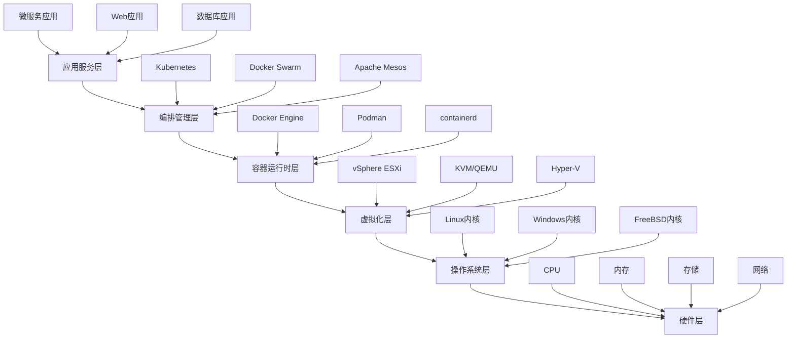

# 软件技术栈架构分析

## 概述

软件技术栈是虚拟化容器技术的基础支撑，从底层硬件抽象到上层应用服务，形成了完整的技术栈体系。本文档深入分析虚拟化容器技术的软件技术栈架构，包括操作系统层、虚拟化层、容器运行时层、编排管理层和应用服务层。

## 目录

- [软件技术栈架构分析](#软件技术栈架构分析)
  - [概述](#概述)
  - [目录](#目录)
  - [1. 软件技术栈总体架构](#1-软件技术栈总体架构)
    - [1.1 技术栈层次结构](#11-技术栈层次结构)
    - [1.2 技术栈组件关系](#12-技术栈组件关系)
  - [2. 操作系统层分析](#2-操作系统层分析)
    - [2.1 Linux操作系统](#21-linux操作系统)
      - [2.1.1 Linux内核架构](#211-linux内核架构)
      - [2.1.2 Linux容器支持](#212-linux容器支持)
      - [2.1.3 Linux虚拟化支持](#213-linux虚拟化支持)
    - [2.2 Windows操作系统](#22-windows操作系统)
      - [2.2.1 Windows内核架构](#221-windows内核架构)
      - [2.2.2 Windows容器支持](#222-windows容器支持)
      - [2.2.3 Windows虚拟化支持](#223-windows虚拟化支持)
  - [3. 虚拟化层分析](#3-虚拟化层分析)
    - [3.1 VMware vSphere](#31-vmware-vsphere)
      - [3.1.1 ESXi Hypervisor](#311-esxi-hypervisor)
      - [3.1.2 vCenter Server](#312-vcenter-server)
    - [3.2 KVM/QEMU](#32-kvmqemu)
      - [3.2.1 KVM架构](#321-kvm架构)
      - [3.2.2 QEMU设备模拟](#322-qemu设备模拟)
    - [3.3 Microsoft Hyper-V](#33-microsoft-hyper-v)
      - [3.3.1 Hyper-V架构](#331-hyper-v架构)
      - [3.3.2 Hyper-V管理](#332-hyper-v管理)
  - [4. 容器运行时层分析](#4-容器运行时层分析)
    - [4.1 Docker Engine](#41-docker-engine)
      - [4.1.1 Docker架构](#411-docker架构)
      - [4.1.2 Docker镜像管理](#412-docker镜像管理)
    - [4.2 Podman](#42-podman)
      - [4.2.1 Podman架构](#421-podman架构)
      - [4.2.2 Podman优势](#422-podman优势)
    - [4.3 containerd](#43-containerd)
      - [4.3.1 containerd架构](#431-containerd架构)
      - [4.3.2 containerd特性](#432-containerd特性)
  - [5. 编排管理层分析](#5-编排管理层分析)
    - [5.1 Kubernetes](#51-kubernetes)
      - [5.1.1 Kubernetes架构](#511-kubernetes架构)
      - [5.1.2 Kubernetes资源管理](#512-kubernetes资源管理)
    - [5.2 Docker Swarm](#52-docker-swarm)
      - [5.2.1 Swarm架构](#521-swarm架构)
      - [5.2.2 Swarm特性](#522-swarm特性)
    - [5.3 Apache Mesos](#53-apache-mesos)
      - [5.3.1 Mesos架构](#531-mesos架构)
      - [5.3.2 Mesos特性](#532-mesos特性)
  - [6. 应用服务层分析](#6-应用服务层分析)
    - [6.1 微服务架构](#61-微服务架构)
      - [6.1.1 微服务特性](#611-微服务特性)
      - [6.1.2 微服务技术栈](#612-微服务技术栈)
    - [6.2 云原生应用](#62-云原生应用)
      - [6.2.1 云原生特性](#621-云原生特性)
      - [6.2.2 云原生技术栈](#622-云原生技术栈)
  - [7. 技术栈集成分析](#7-技术栈集成分析)
    - [7.1 技术栈集成模式](#71-技术栈集成模式)
      - [7.1.1 垂直集成](#711-垂直集成)
      - [7.1.2 水平集成](#712-水平集成)
    - [7.2 技术栈选择策略](#72-技术栈选择策略)
      - [7.2.1 选择原则](#721-选择原则)
      - [7.2.2 选择策略](#722-选择策略)
  - [8. 技术栈发展趋势](#8-技术栈发展趋势)
    - [8.1 技术发展趋势](#81-技术发展趋势)
      - [8.1.1 云原生技术](#811-云原生技术)
      - [8.1.2 边缘计算](#812-边缘计算)
    - [8.2 应用发展趋势](#82-应用发展趋势)
      - [8.2.1 AI/ML集成](#821-aiml集成)
      - [8.2.2 无服务器计算](#822-无服务器计算)
  - [9. 总结](#9-总结)
    - [9.1 技术特点](#91-技术特点)
    - [9.2 技术优势](#92-技术优势)
    - [9.3 发展趋势](#93-发展趋势)

## 1. 软件技术栈总体架构

### 1.1 技术栈层次结构



### 1.2 技术栈组件关系

```yaml
软件技术栈:
  应用服务层:
    功能: 业务应用和服务
    技术: 微服务、Web应用、数据库
    特点: 业务逻辑、用户接口
    
  编排管理层:
    功能: 容器编排和调度
    技术: Kubernetes、Docker Swarm
    特点: 自动化、高可用、可扩展
    
  容器运行时层:
    功能: 容器生命周期管理
    技术: Docker、Podman、containerd
    特点: 轻量级、快速启动、资源隔离
    
  虚拟化层:
    功能: 硬件虚拟化抽象
    技术: vSphere、KVM、Hyper-V
    特点: 硬件抽象、资源隔离、高可用
    
  操作系统层:
    功能: 系统资源管理
    技术: Linux、Windows、FreeBSD
    特点: 进程管理、内存管理、I/O管理
    
  硬件层:
    功能: 物理计算资源
    技术: CPU、内存、存储、网络
    特点: 计算能力、存储能力、网络能力
```

## 2. 操作系统层分析

### 2.1 Linux操作系统

#### 2.1.1 Linux内核架构

**内核组件**:

```yaml
Linux内核:
  进程管理:
    - 进程调度器
    - 进程创建和销毁
    - 进程间通信
    
  内存管理:
    - 虚拟内存管理
    - 物理内存管理
    - 内存分配器
    
  文件系统:
    - VFS虚拟文件系统
    - 具体文件系统
    - 设备文件系统
    
  网络协议栈:
    - 网络接口层
    - 网络层
    - 传输层
    - 应用层
    
  设备驱动:
    - 字符设备驱动
    - 块设备驱动
    - 网络设备驱动
```

**内核特性**:

```yaml
Linux内核特性:
  多任务:
    - 抢占式多任务
    - 实时调度
    - 多核支持
    
  内存管理:
    - 虚拟内存
    - 内存映射
    - 交换空间
    
  文件系统:
    - 支持多种文件系统
    - 网络文件系统
    - 分布式文件系统
    
  网络支持:
    - TCP/IP协议栈
    - 网络设备驱动
    - 网络虚拟化
```

#### 2.1.2 Linux容器支持

**命名空间 (Namespaces)**:

```yaml
Linux命名空间:
  PID命名空间:
    功能: 进程ID隔离
    实现: 独立的进程ID空间
    应用: 容器进程隔离
    
  Network命名空间:
    功能: 网络栈隔离
    实现: 独立的网络接口
    应用: 容器网络隔离
    
  Mount命名空间:
    功能: 文件系统隔离
    实现: 独立的挂载点
    应用: 容器文件系统隔离
    
  UTS命名空间:
    功能: 主机名隔离
    实现: 独立的主机名
    应用: 容器主机名隔离
    
  IPC命名空间:
    功能: 进程间通信隔离
    实现: 独立的IPC资源
    应用: 容器IPC隔离
    
  User命名空间:
    功能: 用户ID隔离
    实现: 独立的用户ID空间
    应用: 容器用户隔离
```

**控制组 (Cgroups)**:

```yaml
Linux控制组:
  CPU控制组:
    功能: CPU资源限制
    实现: CPU时间片分配
    应用: 容器CPU限制
    
  内存控制组:
    功能: 内存资源限制
    实现: 内存使用量限制
    应用: 容器内存限制
    
  I/O控制组:
    功能: I/O资源限制
    实现: I/O带宽限制
    应用: 容器I/O限制
    
  网络控制组:
    功能: 网络资源限制
    实现: 网络带宽限制
    应用: 容器网络限制
```

#### 2.1.3 Linux虚拟化支持

**KVM (Kernel-based Virtual Machine)**:

```yaml
KVM虚拟化:
  架构:
    - 基于内核的虚拟化
    - 硬件辅助虚拟化
    - 全虚拟化支持
    
  特性:
    - 支持Intel VT-x
    - 支持AMD-V
    - 支持嵌套虚拟化
    
  性能:
    - 接近原生性能
    - 低虚拟化开销
    - 高可扩展性
```

**QEMU设备模拟**:

```yaml
QEMU设备模拟:
  设备类型:
    - 网络设备模拟
    - 存储设备模拟
    - 输入设备模拟
    
  性能优化:
    - 硬件加速
    - 设备直通
    - 用户空间I/O
```

### 2.2 Windows操作系统

#### 2.2.1 Windows内核架构

**内核组件**:

```yaml
Windows内核:
  执行体:
    - 对象管理器
    - 进程管理器
    - 内存管理器
    - I/O管理器
    
  内核:
    - 线程调度
    - 中断处理
    - 异常处理
    - 同步原语
    
  硬件抽象层:
    - 硬件抽象
    - 设备驱动接口
    - 平台适配
    
  设备驱动:
    - 内核模式驱动
    - 用户模式驱动
    - 即插即用支持
```

#### 2.2.2 Windows容器支持

**Windows容器技术**:

```yaml
Windows容器:
  Windows Server容器:
    功能: 应用容器
    隔离: 进程和命名空间隔离
    应用: 应用部署
    
  Hyper-V容器:
    功能: 系统容器
    隔离: 虚拟机级别隔离
    应用: 多租户环境
    
  容器运行时:
    - containerd
    - Docker Engine
    - Podman
```

#### 2.2.3 Windows虚拟化支持

**Hyper-V虚拟化**:

```yaml
Hyper-V虚拟化:
  架构:
    - Type-1 Hypervisor
    - 硬件辅助虚拟化
    - 全虚拟化支持
    
  特性:
    - 支持Intel VT-x
    - 支持AMD-V
    - 支持嵌套虚拟化
    
  管理:
    - Hyper-V管理器
    - PowerShell管理
    - System Center管理
```

## 3. 虚拟化层分析

### 3.1 VMware vSphere

#### 3.1.1 ESXi Hypervisor

**技术架构**:

```yaml
ESXi架构:
  VMkernel:
    功能: 虚拟化内核
    特性: 微内核设计
    优势: 高稳定性、高性能
    
  虚拟化层:
    - CPU虚拟化
    - 内存虚拟化
    - I/O虚拟化
    - 网络虚拟化
    
  管理接口:
    - vCenter Server
    - vSphere Client
    - PowerCLI
    - REST API
```

**虚拟化技术**:

```yaml
ESXi虚拟化:
  CPU虚拟化:
    - 硬件辅助虚拟化
    - 二进制翻译
    - 半虚拟化
    
  内存虚拟化:
    - 影子页表
    - 扩展页表(EPT)
    - 内存气球
    
  I/O虚拟化:
    - 设备模拟
    - 设备直通
    - SR-IOV支持
    
  网络虚拟化:
    - 虚拟交换机
    - 分布式虚拟交换机
    - 网络I/O控制
```

#### 3.1.2 vCenter Server

**管理架构**:

```yaml
vCenter_Server:
  核心服务:
    - vpxd服务
    - 数据库服务
    - 认证服务
    
  管理功能:
    - 虚拟机管理
    - 主机管理
    - 存储管理
    - 网络管理
    
  高可用性:
    - vCenter HA
    - 数据库集群
    - 负载均衡
```

### 3.2 KVM/QEMU

#### 3.2.1 KVM架构

**技术特性**:

```yaml
KVM架构:
  内核模块:
    - kvm.ko
    - kvm-intel.ko
    - kvm-amd.ko
    
  用户空间:
    - QEMU设备模拟
    - libvirt管理
    - 虚拟机监控
    
  硬件支持:
    - Intel VT-x
    - AMD-V
    - ARM虚拟化扩展
```

#### 3.2.2 QEMU设备模拟

**设备模拟**:

```yaml
QEMU设备模拟:
  网络设备:
    - e1000网卡
    - virtio-net网卡
    - 用户模式网络
    
  存储设备:
    - IDE硬盘
    - SCSI硬盘
    - virtio-blk设备
    
  其他设备:
    - 串口设备
    - 并口设备
    - USB设备
```

### 3.3 Microsoft Hyper-V

#### 3.3.1 Hyper-V架构

**技术架构**:

```yaml
Hyper-V架构:
  Hypervisor:
    功能: 虚拟化层
    特性: Type-1 Hypervisor
    优势: 高性能、高安全性
    
  分区:
    - 父分区
    - 子分区
    - 根分区
    
  虚拟化服务:
    - 虚拟化服务提供者
    - 虚拟化服务客户端
    - 虚拟化服务提供者库
```

#### 3.3.2 Hyper-V管理

**管理工具**:

```yaml
Hyper-V管理:
  Hyper-V管理器:
    功能: 图形化管理
    特性: 直观易用
    应用: 日常管理
    
  PowerShell:
    功能: 命令行管理
    特性: 自动化脚本
    应用: 批量管理
    
  System Center:
    功能: 企业级管理
    特性: 集中管理
    应用: 大规模部署
```

## 4. 容器运行时层分析

### 4.1 Docker Engine

#### 4.1.1 Docker架构

**技术架构**:

```yaml
Docker架构:
  Docker客户端:
    功能: 用户接口
    实现: Docker CLI
    协议: REST API
    
  Docker守护进程:
    功能: 容器管理
    实现: dockerd
    特性: 后台服务
    
  containerd:
    功能: 容器运行时
    实现: 容器生命周期管理
    特性: 轻量级、高性能
    
  runc:
    功能: 容器运行时
    实现: OCI标准实现
    特性: 标准兼容
```

**容器生命周期**:

```yaml
Docker容器生命周期:
  创建阶段:
    - 镜像拉取
    - 容器创建
    - 资源分配
    
  运行阶段:
    - 进程启动
    - 资源监控
    - 状态管理
    
  停止阶段:
    - 进程终止
    - 资源回收
    - 状态保存
    
  删除阶段:
    - 容器删除
    - 资源清理
    - 状态清理
```

#### 4.1.2 Docker镜像管理

**镜像架构**:

```yaml
Docker镜像:
  镜像层:
    - 只读层
    - 联合文件系统
    - 层间依赖关系
    
  镜像格式:
    - OCI镜像格式
    - Docker镜像格式
    - 多架构支持
    
  镜像存储:
    - 本地存储
    - 远程仓库
    - 镜像缓存
```

### 4.2 Podman

#### 4.2.1 Podman架构

**技术特性**:

```yaml
Podman架构:
  无根容器:
    功能: 非root用户运行
    实现: 用户命名空间
    优势: 提高安全性
    
  Pod支持:
    功能: Kubernetes Pod兼容
    实现: Pod概念实现
    优势: 完全兼容
    
  镜像管理:
    - Buildah构建
    - Skopeo复制
    - 镜像签名验证
```

#### 4.2.2 Podman优势

**技术优势**:

```yaml
Podman优势:
  安全性:
    - 无根容器
    - 用户命名空间
    - 安全策略支持
    
  兼容性:
    - Docker命令兼容
    - Kubernetes兼容
    - OCI标准兼容
    
  性能:
    - 轻量级设计
    - 快速启动
    - 低资源消耗
```

### 4.3 containerd

#### 4.3.1 containerd架构

**技术架构**:

```yaml
containerd架构:
  核心组件:
    - 容器运行时
    - 镜像管理
    - 快照管理
    - 内容管理
    
  API接口:
    - gRPC API
    - 插件系统
    - 事件系统
    
  存储后端:
    - 本地存储
    - 远程存储
    - 内容寻址存储
```

#### 4.3.2 containerd特性

**技术特性**:

```yaml
containerd特性:
  高性能:
    - 轻量级设计
    - 低延迟
    - 高吞吐量
    
  可扩展性:
    - 插件架构
    - 模块化设计
    - 自定义扩展
    
  标准兼容:
    - OCI标准
    - CRI接口
    - 容器标准
```

## 5. 编排管理层分析

### 5.1 Kubernetes

#### 5.1.1 Kubernetes架构

**集群架构**:

```yaml
Kubernetes架构:
  控制平面:
    - API Server
    - etcd
    - Scheduler
    - Controller Manager
    
  数据平面:
    - kubelet
    - kube-proxy
    - 容器运行时
    - 网络插件
    
  工作节点:
    - 节点管理
    - Pod调度
    - 资源管理
    - 健康检查
```

**核心组件**:

```yaml
Kubernetes组件:
  API Server:
    功能: 集群API入口
    特性: RESTful API
    安全: 认证授权
    
  etcd:
    功能: 集群状态存储
    特性: 分布式键值存储
    一致性: Raft算法
    
  Scheduler:
    功能: Pod调度
    特性: 智能调度
    策略: 可配置调度策略
    
  Controller Manager:
    功能: 控制器管理
    特性: 自动化管理
    类型: 多种控制器
```

#### 5.1.2 Kubernetes资源管理

**资源类型**:

```yaml
Kubernetes资源:
  Pod:
    功能: 最小部署单元
    特性: 容器组
    生命周期: 临时性
    
  Deployment:
    功能: 应用部署管理
    特性: 滚动更新
    管理: 副本管理
    
  Service:
    功能: 服务发现
    特性: 负载均衡
    类型: ClusterIP、NodePort、LoadBalancer
    
  ConfigMap:
    功能: 配置管理
    特性: 键值对存储
    应用: 配置注入
    
  Secret:
    功能: 敏感信息管理
    特性: 加密存储
    应用: 密码、证书
```

### 5.2 Docker Swarm

#### 5.2.1 Swarm架构

**集群架构**:

```yaml
Docker_Swarm:
  管理节点:
    功能: 集群管理
    特性: 高可用
    组件: 多个管理节点
    
  工作节点:
    功能: 容器运行
    特性: 负载均衡
    管理: 自动管理
    
  服务发现:
    - 内置服务发现
    - 负载均衡
    - 健康检查
```

#### 5.2.2 Swarm特性

**技术特性**:

```yaml
Swarm特性:
  简单性:
    - 易于部署
    - 简单配置
    - 快速上手
    
  集成性:
    - Docker原生集成
    - 统一命令行
    - 无缝迁移
    
  可靠性:
    - 高可用设计
    - 故障恢复
    - 服务保障
```

### 5.3 Apache Mesos

#### 5.3.1 Mesos架构

**技术架构**:

```yaml
Mesos架构:
  Master:
    功能: 集群管理
    特性: 高可用
    组件: 多个Master节点
    
  Agent:
    功能: 资源提供
    特性: 资源隔离
    管理: 任务执行
    
  Framework:
    功能: 应用框架
    特性: 可扩展
    类型: Marathon、Kubernetes
```

#### 5.3.2 Mesos特性

**技术特性**:

```yaml
Mesos特性:
  资源管理:
    - 统一资源管理
    - 资源隔离
    - 资源调度
    
  框架支持:
    - 多种框架
    - 自定义框架
    - 框架隔离
    
  可扩展性:
    - 大规模集群
    - 高并发
    - 弹性扩展
```

## 6. 应用服务层分析

### 6.1 微服务架构

#### 6.1.1 微服务特性

**架构特性**:

```yaml
微服务架构:
  服务拆分:
    - 业务功能拆分
    - 独立部署
    - 独立扩展
    
  服务通信:
    - HTTP/REST
    - gRPC
    - 消息队列
    
  服务治理:
    - 服务发现
    - 负载均衡
    - 熔断降级
    - 监控告警
```

#### 6.1.2 微服务技术栈

**技术组件**:

```yaml
微服务技术栈:
  服务框架:
    - Spring Boot
    - Spring Cloud
    - Dubbo
    - gRPC
    
  服务网格:
    - Istio
    - Linkerd
    - Consul Connect
    
  配置管理:
    - Consul
    - etcd
    - Apollo
    
  监控系统:
    - Prometheus
    - Grafana
    - Jaeger
```

### 6.2 云原生应用

#### 6.2.1 云原生特性

**技术特性**:

```yaml
云原生特性:
  容器化:
    - 应用容器化
    - 镜像管理
    - 容器编排
    
  微服务:
    - 服务拆分
    - 服务治理
    - 服务网格
    
  DevOps:
    - 持续集成
    - 持续部署
    - 自动化运维
    
  可观测性:
    - 监控
    - 日志
    - 链路追踪
```

#### 6.2.2 云原生技术栈

**技术组件**:

```yaml
云原生技术栈:
  容器技术:
    - Docker
    - containerd
    - CRI-O
    
  编排技术:
    - Kubernetes
    - Helm
    - Operator
    
  服务网格:
    - Istio
    - Linkerd
    - Consul Connect
    
  可观测性:
    - Prometheus
    - Grafana
    - Jaeger
    - ELK Stack
```

## 7. 技术栈集成分析

### 7.1 技术栈集成模式

#### 7.1.1 垂直集成

**集成模式**:

```yaml
垂直集成:
  特点:
    - 技术栈垂直整合
    - 厂商锁定
    - 统一管理
    
  优势:
    - 集成度高
    - 管理简单
    - 技术支持
    
  劣势:
    - 灵活性差
    - 成本高
    - 技术依赖
```

#### 7.1.2 水平集成

**集成模式**:

```yaml
水平集成:
  特点:
    - 技术栈水平整合
    - 开源技术
    - 标准化接口
    
  优势:
    - 灵活性高
    - 成本低
    - 技术选择
    
  劣势:
    - 集成复杂
    - 管理困难
    - 技术支持
```

### 7.2 技术栈选择策略

#### 7.2.1 选择原则

**选择原则**:

```yaml
技术栈选择:
  业务需求:
    - 功能需求
    - 性能需求
    - 安全需求
    
  技术成熟度:
    - 技术稳定性
    - 社区活跃度
    - 文档完整性
    
  团队能力:
    - 技术能力
    - 学习成本
    - 维护成本
    
  成本考虑:
    - 许可成本
    - 硬件成本
    - 运维成本
```

#### 7.2.2 选择策略

**选择策略**:

```yaml
选择策略:
  技术评估:
    - 功能评估
    - 性能评估
    - 安全评估
    
  成本分析:
    - 总体拥有成本
    - 投资回报率
    - 风险分析
    
  实施计划:
    - 分阶段实施
    - 风险控制
    - 效果评估
```

## 8. 技术栈发展趋势

### 8.1 技术发展趋势

#### 8.1.1 云原生技术

**发展趋势**:

```yaml
云原生技术:
  容器技术:
    - 轻量级容器
    - 安全容器
    - 边缘容器
    
  编排技术:
    - 多集群管理
    - 边缘编排
    - 混合云编排
    
  服务网格:
    - 统一服务治理
    - 可观测性
    - 安全策略
```

#### 8.1.2 边缘计算

**技术趋势**:

```yaml
边缘计算:
  边缘容器:
    - 轻量级运行时
    - 边缘编排
    - 离线运行
    
  边缘网络:
    - 边缘网络功能
    - 5G集成
    - 低延迟网络
    
  边缘存储:
    - 边缘存储
    - 数据同步
    - 缓存策略
```

### 8.2 应用发展趋势

#### 8.2.1 AI/ML集成

**技术趋势**:

```yaml
AI_ML集成:
  机器学习平台:
    - Kubeflow
    - MLflow
    - TensorFlow Serving
    
  AI服务:
    - 模型服务
    - 推理服务
    - 训练服务
    
  数据平台:
    - 数据湖
    - 数据管道
    - 实时处理
```

#### 8.2.2 无服务器计算

**技术趋势**:

```yaml
无服务器计算:
  函数计算:
    - AWS Lambda
    - Azure Functions
    - Google Cloud Functions
    
  容器无服务器:
    - Knative
    - OpenFaaS
    - Fission
    
  事件驱动:
    - 事件源
    - 事件处理
    - 事件存储
```

## 9. 总结

软件技术栈是虚拟化容器技术的基础支撑，从底层操作系统到上层应用服务，形成了完整的技术体系。主要特点包括：

### 9.1 技术特点

1. **分层架构**: 清晰的技术栈分层，便于管理和维护
2. **标准化**: 基于开放标准，提高互操作性
3. **模块化**: 模块化设计，支持灵活组合
4. **可扩展**: 支持水平扩展和垂直扩展

### 9.2 技术优势

1. **高性能**: 通过硬件加速和软件优化提高性能
2. **高可用**: 通过冗余设计和故障恢复保证可用性
3. **高安全**: 通过多层安全机制保证安全性
4. **高灵活**: 通过标准化接口和模块化设计提高灵活性

### 9.3 发展趋势

1. **云原生**: 向云原生技术栈演进
2. **边缘化**: 向边缘计算技术栈发展
3. **智能化**: 集成AI/ML技术
4. **无服务器**: 向无服务器计算发展

通过持续的技术创新和标准化，软件技术栈将继续为虚拟化容器技术提供更好的支撑。
