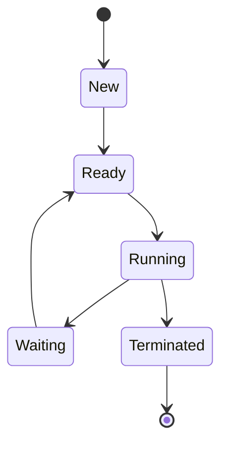
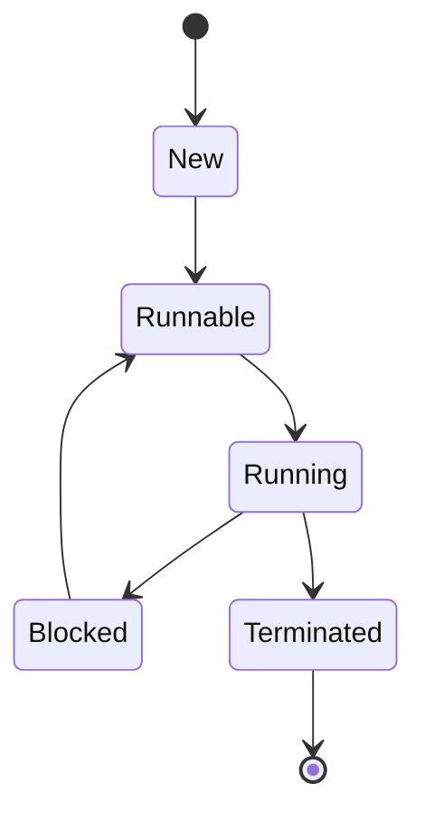
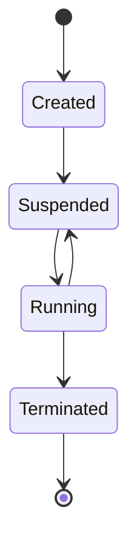

# 执行流控制流数据流分析 - 深入分析系统运行机制

## 概述

本文档深入解析虚拟化和容器化环境中的执行流、控制流和数据流，揭示系统内部的运行机制。
通过对这些核心概念的分析，可以更好地理解系统性能、安全性和可靠性。


## 目录

- [执行流控制流数据流分析 - 深入分析系统运行机制](#执行流控制流数据流分析-深入分析系统运行机制)
  - [概述](#概述)
  - [1. 执行流分析 (Execution Flow Analysis)](#1-执行流分析-execution-flow-analysis)
    - [1.1 进程执行流](#11-进程执行流)
      - [1.1.1 进程生命周期](#111-进程生命周期)
      - [1.1.2 进程调度](#112-进程调度)
    - [1.2 线程执行流](#12-线程执行流)
      - [1.2.1 线程生命周期](#121-线程生命周期)
      - [1.2.2 线程同步](#122-线程同步)
    - [1.3 协程执行流](#13-协程执行流)
      - [1.3.1 协程生命周期](#131-协程生命周期)
      - [1.3.2 协程调度](#132-协程调度)
  - [2. 控制流分析 (Control Flow Analysis)](#2-控制流分析-control-flow-analysis)
    - [2.1 系统调用控制流](#21-系统调用控制流)
      - [2.1.1 系统调用过程](#211-系统调用过程)
      - [2.1.2 系统调用拦截](#212-系统调用拦截)
    - [2.2 中断处理控制流](#22-中断处理控制流)
      - [2.2.1 中断类型](#221-中断类型)
      - [2.2.2 中断处理过程](#222-中断处理过程)
    - [2.3 异常处理控制流](#23-异常处理控制流)
      - [2.3.1 异常类型](#231-异常类型)
      - [2.3.2 异常处理过程](#232-异常处理过程)
  - [3. 数据流分析 (Data Flow Analysis)](#3-数据流分析-data-flow-analysis)
    - [3.1 内存数据流](#31-内存数据流)
      - [3.1.1 内存访问模式](#311-内存访问模式)
      - [3.1.2 缓存数据流](#312-缓存数据流)
    - [3.2 I/O数据流](#32-io数据流)
      - [3.2.1 磁盘I/O数据流](#321-磁盘io数据流)
      - [3.2.2 网络I/O数据流](#322-网络io数据流)
    - [3.3 进程间通信数据流](#33-进程间通信数据流)
      - [3.3.1 共享内存](#331-共享内存)
      - [3.3.2 消息队列](#332-消息队列)
      - [3.3.3 管道](#333-管道)
  - [4. 虚拟化与容器化环境中的流分析](#4-虚拟化与容器化环境中的流分析)
    - [4.1 虚拟化环境流分析](#41-虚拟化环境流分析)
      - [4.1.1 虚拟机执行流](#411-虚拟机执行流)
      - [4.1.2 虚拟机控制流](#412-虚拟机控制流)
      - [4.1.3 虚拟机数据流](#413-虚拟机数据流)
    - [4.2 容器化环境流分析](#42-容器化环境流分析)
      - [4.2.1 容器执行流](#421-容器执行流)
      - [4.2.2 容器控制流](#422-容器控制流)
      - [4.2.3 容器数据流](#423-容器数据流)
  - [5. 性能优化与安全加固](#5-性能优化与安全加固)
    - [5.1 性能优化](#51-性能优化)
      - [5.1.1 执行流优化](#511-执行流优化)
      - [5.1.2 控制流优化](#512-控制流优化)
      - [5.1.3 数据流优化](#513-数据流优化)
    - [5.2 安全加固](#52-安全加固)
      - [5.2.1 执行流安全](#521-执行流安全)
      - [5.2.2 控制流安全](#522-控制流安全)
      - [5.2.3 数据流安全](#523-数据流安全)
  - [6. 总结](#6-总结)

- [执行流控制流数据流分析 - 深入分析系统运行机制](#执行流控制流数据流分析-深入分析系统运行机制)
  - [概述](#概述)
  - [1. 执行流分析 (Execution Flow Analysis)](#1-执行流分析-execution-flow-analysis)
    - [1.1 进程执行流](#11-进程执行流)
      - [1.1.1 进程生命周期](#111-进程生命周期)
      - [1.1.2 进程调度](#112-进程调度)
    - [1.2 线程执行流](#12-线程执行流)
      - [1.2.1 线程生命周期](#121-线程生命周期)
      - [1.2.2 线程同步](#122-线程同步)
    - [1.3 协程执行流](#13-协程执行流)
      - [1.3.1 协程生命周期](#131-协程生命周期)
      - [1.3.2 协程调度](#132-协程调度)
  - [2. 控制流分析 (Control Flow Analysis)](#2-控制流分析-control-flow-analysis)
    - [2.1 系统调用控制流](#21-系统调用控制流)
      - [2.1.1 系统调用过程](#211-系统调用过程)
      - [2.1.2 系统调用拦截](#212-系统调用拦截)
    - [2.2 中断处理控制流](#22-中断处理控制流)
      - [2.2.1 中断类型](#221-中断类型)
      - [2.2.2 中断处理过程](#222-中断处理过程)
    - [2.3 异常处理控制流](#23-异常处理控制流)
      - [2.3.1 异常类型](#231-异常类型)
      - [2.3.2 异常处理过程](#232-异常处理过程)
  - [3. 数据流分析 (Data Flow Analysis)](#3-数据流分析-data-flow-analysis)
    - [3.1 内存数据流](#31-内存数据流)
      - [3.1.1 内存访问模式](#311-内存访问模式)
      - [3.1.2 缓存数据流](#312-缓存数据流)
    - [3.2 I/O数据流](#32-io数据流)
      - [3.2.1 磁盘I/O数据流](#321-磁盘io数据流)
      - [3.2.2 网络I/O数据流](#322-网络io数据流)
    - [3.3 进程间通信数据流](#33-进程间通信数据流)
      - [3.3.1 共享内存](#331-共享内存)
      - [3.3.2 消息队列](#332-消息队列)
      - [3.3.3 管道](#333-管道)
  - [4. 虚拟化与容器化环境中的流分析](#4-虚拟化与容器化环境中的流分析)
    - [4.1 虚拟化环境流分析](#41-虚拟化环境流分析)
      - [4.1.1 虚拟机执行流](#411-虚拟机执行流)
      - [4.1.2 虚拟机控制流](#412-虚拟机控制流)
      - [4.1.3 虚拟机数据流](#413-虚拟机数据流)
    - [4.2 容器化环境流分析](#42-容器化环境流分析)
      - [4.2.1 容器执行流](#421-容器执行流)
      - [4.2.2 容器控制流](#422-容器控制流)
      - [4.2.3 容器数据流](#423-容器数据流)
  - [5. 性能优化与安全加固](#5-性能优化与安全加固)
    - [5.1 性能优化](#51-性能优化)
      - [5.1.1 执行流优化](#511-执行流优化)
      - [5.1.2 控制流优化](#512-控制流优化)
      - [5.1.3 数据流优化](#513-数据流优化)
    - [5.2 安全加固](#52-安全加固)
      - [5.2.1 执行流安全](#521-执行流安全)
      - [5.2.2 控制流安全](#522-控制流安全)
      - [5.2.3 数据流安全](#523-数据流安全)
  - [6. 总结](#6-总结)

## 1. 执行流分析 (Execution Flow Analysis)

### 1.1 进程执行流

#### 1.1.1 进程生命周期



#### 1.1.2 进程调度

- **调度算法**: 先来先服务、短作业优先、时间片轮转、优先级调度
- **调度策略**: 抢占式调度、非抢占式调度
- **数学表示**: $Scheduler(P) = \{p_1, p_2, ..., p_n\}$

### 1.2 线程执行流

#### 1.2.1 线程生命周期



#### 1.2.2 线程同步

- **同步机制**: 互斥锁、信号量、条件变量、读写锁
- **同步问题**: 死锁、活锁、饥饿
- **数学表示**: $Synchronizer(T) = \{t_1, t_2, ..., t_m\}$

### 1.3 协程执行流

#### 1.3.1 协程生命周期



#### 1.3.2 协程调度

- **调度器**: 用户态调度器
- **调度策略**: 协作式调度
- **优势**: 轻量级、上下文切换开销小

## 2. 控制流分析 (Control Flow Analysis)

### 2.1 系统调用控制流

#### 2.1.1 系统调用过程

```text
用户态应用
├── 系统调用接口
├── 内核态处理
└── 返回用户态
```

#### 2.1.2 系统调用拦截

- **拦截机制**: Hooking、ptrace、seccomp
- **应用**: 安全监控、容器沙箱
- **数学表示**: $Interceptor(syscall) = \{allow, deny, modify\}$

### 2.2 中断处理控制流

#### 2.2.1 中断类型

- **硬件中断**: 外部设备中断
- **软件中断**: 异常、系统调用
- **中断向量表**: 存储中断处理程序地址

#### 2.2.2 中断处理过程

```text
中断发生
├── 保存上下文
├── 中断处理程序
├── 恢复上下文
└── 返回执行
```

### 2.3 异常处理控制流

#### 2.3.1 异常类型

- **同步异常**: 除零、无效指令
- **异步异常**: 外部中断
- **异常向量表**: 存储异常处理程序地址

#### 2.3.2 异常处理过程

```text
异常发生
├── 保存上下文
├── 异常处理程序
├── 恢复上下文
└── 返回执行
```

## 3. 数据流分析 (Data Flow Analysis)

### 3.1 内存数据流

#### 3.1.1 内存访问模式

- **顺序访问**: 连续内存访问
- **随机访问**: 非连续内存访问
- **局部性原理**: 时间局部性、空间局部性

#### 3.1.2 缓存数据流

- **缓存层次**: L1、L2、L3缓存
- **缓存命中**: 数据在缓存中找到
- **缓存缺失**: 数据不在缓存中，需要从主内存获取

### 3.2 I/O数据流

#### 3.2.1 磁盘I/O数据流

```text
应用层
├── 文件系统层
├── 块设备层
├── 驱动层
└── 物理磁盘
```

#### 3.2.2 网络I/O数据流

```text
应用层
├── 套接字层
├── 传输层
├── 网络层
├── 数据链路层
└── 物理层
```

### 3.3 进程间通信数据流

#### 3.3.1 共享内存

- **机制**: 多个进程共享同一块内存区域
- **优势**: 高效、低延迟
- **应用**: 大数据传输

#### 3.3.2 消息队列

- **机制**: 进程通过消息队列交换数据
- **优势**: 解耦、异步
- **应用**: 任务调度、事件通知

#### 3.3.3 管道

- **机制**: 进程通过管道进行单向通信
- **优势**: 简单、易用
- **应用**: 命令行工具

## 4. 虚拟化与容器化环境中的流分析

### 4.1 虚拟化环境流分析

#### 4.1.1 虚拟机执行流

- **VM_EXIT/VM_ENTRY**: 虚拟机退出和进入
- **Hypervisor调度**: Hypervisor调度虚拟机
- **数学表示**: $VM\_Execution = \{Guest\_Execution, Hypervisor\_Intervention\}$

#### 4.1.2 虚拟机控制流

- **虚拟中断**: 虚拟中断处理
- **虚拟系统调用**: 虚拟系统调用处理
- **虚拟异常**: 虚拟异常处理

#### 4.1.3 虚拟机数据流

- **虚拟内存**: 虚拟内存管理
- **虚拟I/O**: 虚拟I/O处理
- **虚拟网络**: 虚拟网络数据流

### 4.2 容器化环境流分析

#### 4.2.1 容器执行流

- **共享内核**: 容器共享宿主机内核
- **命名空间隔离**: 进程隔离
- **cgroups限制**: 资源限制

#### 4.2.2 容器控制流

- **系统调用过滤**: seccomp过滤系统调用
- **能力限制**: Linux capabilities限制权限
- **安全策略**: SELinux/AppArmor安全策略

#### 4.2.3 容器数据流

- **联合文件系统**: 分层文件系统
- **数据卷**: 持久化存储
- **容器网络**: 容器网络数据流

## 5. 性能优化与安全加固

### 5.1 性能优化

#### 5.1.1 执行流优化

- **减少上下文切换**: 优化调度算法
- **减少VM_EXIT/VM_ENTRY**: 硬件辅助虚拟化
- **协程**: 轻量级并发

#### 5.1.2 控制流优化

- **减少系统调用**: 批量处理、异步I/O
- **优化中断处理**: 中断合并、中断亲和性
- **减少异常**: 错误预测、容错设计

#### 5.1.3 数据流优化

- **缓存优化**: 提高缓存命中率
- **I/O优化**: 异步I/O、零拷贝
- **网络优化**: 协议优化、硬件加速

### 5.2 安全加固

#### 5.2.1 执行流安全

- **代码注入防护**: DEP、ASLR
- **控制流完整性**: CFI
- **沙箱**: 限制执行环境

#### 5.2.2 控制流安全

- **系统调用过滤**: seccomp
- **权限最小化**: 最小权限原则
- **访问控制**: RBAC

#### 5.2.3 数据流安全

- **数据加密**: 静态数据加密、传输数据加密
- **数据完整性**: 数据校验、数字签名
- **数据隔离**: 内存隔离、存储隔离

## 6. 总结

执行流、控制流和数据流是理解虚拟化和容器化系统运行机制的关键。通过深入分析这些流，可以：

1. **优化系统性能**: 识别瓶颈，提高效率
2. **增强系统安全**: 发现漏洞，加固防护
3. **提升系统可靠性**: 预测故障，实现容错

持续对这些流进行分析和优化，是构建高性能、高安全、高可靠的虚拟化和容器化环境的重要保障。
