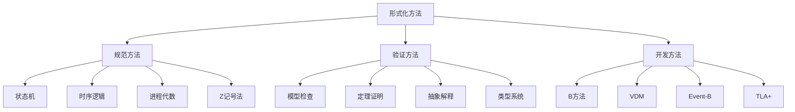
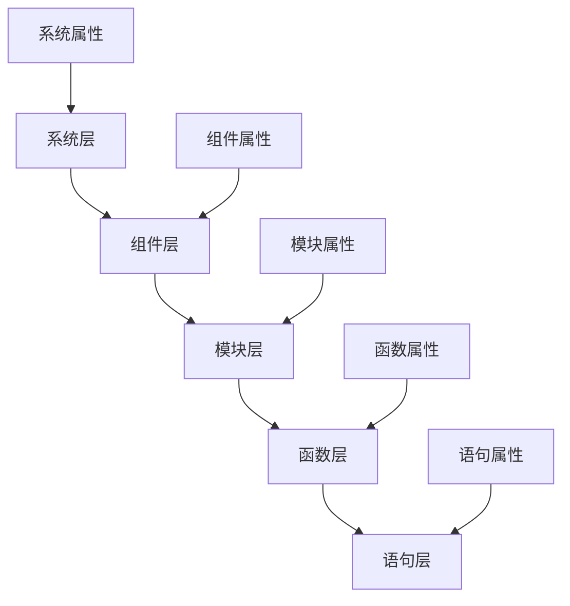
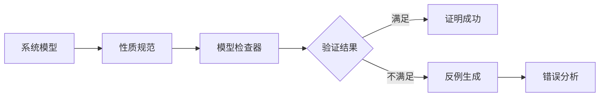
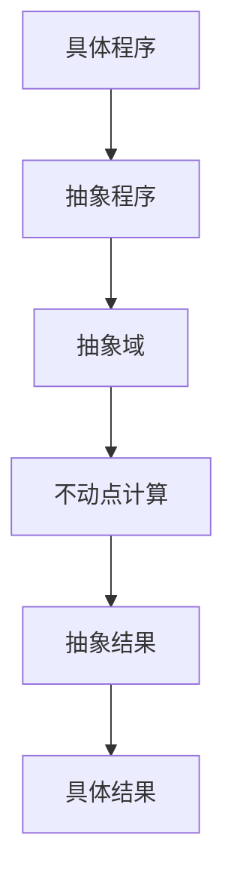

# 2025年形式化证明与论证框架

## 目录

- [2025年形式化证明与论证框架](#2025年形式化证明与论证框架)
  - [执行摘要](#执行摘要)
    - [关键特性](#关键特性)
  - [形式化方法基础](#形式化方法基础)
    - [1. 形式化方法概述](#1-形式化方法概述)
      - [1.1 定义与目标](#11-定义与目标)
      - [1.2 形式化方法分类](#12-形式化方法分类)
    - [2. 数学基础](#2-数学基础)
      - [2.1 集合论基础](#21-集合论基础)
      - [2.2 逻辑基础](#22-逻辑基础)
      - [2.3 图论基础](#23-图论基础)
  - [数学证明框架](#数学证明框架)
    - [1. 证明方法](#1-证明方法)
      - [1.1 直接证明](#11-直接证明)
      - [1.2 反证法](#12-反证法)
      - [1.3 归纳法](#13-归纳法)
    - [2. 证明策略](#2-证明策略)
      - [2.1 分层证明](#21-分层证明)
      - [2.2 组合证明](#22-组合证明)
      - [2.3 抽象证明](#23-抽象证明)
  - [系统验证框架](#系统验证框架)
    - [1. 模型检查](#1-模型检查)
      - [1.1 模型检查原理](#11-模型检查原理)
      - [1.2 时序逻辑规范](#12-时序逻辑规范)
      - [1.3 模型检查工具](#13-模型检查工具)
    - [2. 定理证明](#2-定理证明)
      - [2.1 交互式定理证明](#21-交互式定理证明)
      - [2.2 自动定理证明](#22-自动定理证明)
      - [2.3 定理证明工具](#23-定理证明工具)
    - [3. 抽象解释](#3-抽象解释)
      - [3.1 抽象解释原理](#31-抽象解释原理)
      - [3.2 抽象域](#32-抽象域)
      - [3.3 抽象解释工具](#33-抽象解释工具)
  - [算法正确性证明](#算法正确性证明)
    - [1. 算法规范](#1-算法规范)
      - [1.1 前置条件和后置条件](#11-前置条件和后置条件)
      - [1.2 循环不变式](#12-循环不变式)
    - [2. 证明技术](#2-证明技术)
      - [2.1 归纳证明](#21-归纳证明)
      - [2.2 不变式证明](#22-不变式证明)
      - [2.3 最弱前置条件](#23-最弱前置条件)
    - [3. 复杂度分析](#3-复杂度分析)
      - [3.1 时间复杂度](#31-时间复杂度)
      - [3.2 空间复杂度](#32-空间复杂度)
      - [3.3 摊销分析](#33-摊销分析)
  - [安全性证明框架](#安全性证明框架)
    - [1. 安全模型](#1-安全模型)
      - [1.1 访问控制模型](#11-访问控制模型)
      - [1.2 信息流控制](#12-信息流控制)
      - [1.3 形式化安全属性](#13-形式化安全属性)
    - [2. 安全验证方法](#2-安全验证方法)
      - [2.1 模型检查安全属性](#21-模型检查安全属性)
      - [2.2 定理证明安全属性](#22-定理证明安全属性)
      - [2.3 类型系统安全](#23-类型系统安全)
    - [3. 密码学证明](#3-密码学证明)
      - [3.1 密码学原语](#31-密码学原语)
      - [3.2 协议安全性](#32-协议安全性)
  - [性能分析框架](#性能分析框架)
    - [1. 性能模型](#1-性能模型)
      - [1.1 排队论模型](#11-排队论模型)
      - [1.2 马尔可夫链模型](#12-马尔可夫链模型)
      - [1.3 网络流模型](#13-网络流模型)
    - [2. 性能分析方法](#2-性能分析方法)
      - [2.1 解析方法](#21-解析方法)
      - [2.2 仿真方法](#22-仿真方法)
      - [2.3 测量方法](#23-测量方法)
    - [3. 性能优化](#3-性能优化)
      - [3.1 瓶颈分析](#31-瓶颈分析)
      - [3.2 负载均衡](#32-负载均衡)
      - [3.3 缓存优化](#33-缓存优化)
  - [形式化工具链](#形式化工具链)
    - [1. 规范工具](#1-规范工具)
      - [1.1 规范语言](#11-规范语言)
      - [1.2 规范工具](#12-规范工具)
    - [2. 验证工具](#2-验证工具)
      - [2.1 模型检查器](#21-模型检查器)
      - [2.2 定理证明器](#22-定理证明器)
    - [3. 集成环境](#3-集成环境)
      - [3.1 开发环境](#31-开发环境)
      - [3.2 自动化工具](#32-自动化工具)
  - [应用案例研究](#应用案例研究)
    - [1. 容器隔离性证明](#1-容器隔离性证明)
      - [1.1 问题描述](#11-问题描述)
      - [1.2 形式化模型](#12-形式化模型)
      - [1.3 证明过程](#13-证明过程)
    - [2. 虚拟化安全性证明](#2-虚拟化安全性证明)
      - [2.1 问题描述](#21-问题描述)
      - [2.2 安全模型](#22-安全模型)
      - [2.3 验证结果](#23-验证结果)
    - [3. 分布式一致性证明](#3-分布式一致性证明)
      - [3.1 问题描述](#31-问题描述)
      - [3.2 算法规范](#32-算法规范)
      - [3.3 一致性证明](#33-一致性证明)
    - [4. 网络协议验证](#4-网络协议验证)
      - [4.1 问题描述](#41-问题描述)
      - [4.2 协议模型](#42-协议模型)
      - [4.3 属性验证](#43-属性验证)
  - [实施指南](#实施指南)
    - [1. 项目规划](#1-项目规划)
      - [1.1 需求分析](#11-需求分析)
      - [1.2 工具选择](#12-工具选择)
      - [1.3 团队建设](#13-团队建设)
    - [2. 开发流程](#2-开发流程)
      - [2.1 规范阶段](#21-规范阶段)
      - [2.2 验证阶段](#22-验证阶段)
      - [2.3 实现阶段](#23-实现阶段)
    - [3. 质量保证](#3-质量保证)
      - [3.1 验证质量](#31-验证质量)
      - [3.2 过程改进](#32-过程改进)
    - [4. 风险管理](#4-风险管理)
      - [4.1 技术风险](#41-技术风险)
      - [4.2 风险缓解](#42-风险缓解)
  - [结论与展望](#结论与展望)
    - [主要成果](#主要成果)
    - [技术发展趋势](#技术发展趋势)
    - [未来展望](#未来展望)
    - [建议](#建议)

- [2025年形式化证明与论证框架](#2025年形式化证明与论证框架)
  - [执行摘要](#执行摘要)
    - [关键特性](#关键特性)
  - [形式化方法基础](#形式化方法基础)
    - [1. 形式化方法概述](#1-形式化方法概述)
      - [1.1 定义与目标](#11-定义与目标)
      - [1.2 形式化方法分类](#12-形式化方法分类)
    - [2. 数学基础](#2-数学基础)
      - [2.1 集合论基础](#21-集合论基础)
      - [2.2 逻辑基础](#22-逻辑基础)
      - [2.3 图论基础](#23-图论基础)
  - [数学证明框架](#数学证明框架)
    - [1. 证明方法](#1-证明方法)
      - [1.1 直接证明](#11-直接证明)
      - [1.2 反证法](#12-反证法)
      - [1.3 归纳法](#13-归纳法)
    - [2. 证明策略](#2-证明策略)
      - [2.1 分层证明](#21-分层证明)
      - [2.2 组合证明](#22-组合证明)
      - [2.3 抽象证明](#23-抽象证明)
  - [系统验证框架](#系统验证框架)
    - [1. 模型检查](#1-模型检查)
      - [1.1 模型检查原理](#11-模型检查原理)
      - [1.2 时序逻辑规范](#12-时序逻辑规范)
      - [1.3 模型检查工具](#13-模型检查工具)
    - [2. 定理证明](#2-定理证明)
      - [2.1 交互式定理证明](#21-交互式定理证明)
      - [2.2 自动定理证明](#22-自动定理证明)
      - [2.3 定理证明工具](#23-定理证明工具)
    - [3. 抽象解释](#3-抽象解释)
      - [3.1 抽象解释原理](#31-抽象解释原理)
      - [3.2 抽象域](#32-抽象域)
      - [3.3 抽象解释工具](#33-抽象解释工具)
  - [算法正确性证明](#算法正确性证明)
    - [1. 算法规范](#1-算法规范)
      - [1.1 前置条件和后置条件](#11-前置条件和后置条件)
      - [1.2 循环不变式](#12-循环不变式)
    - [2. 证明技术](#2-证明技术)
      - [2.1 归纳证明](#21-归纳证明)
      - [2.2 不变式证明](#22-不变式证明)
      - [2.3 最弱前置条件](#23-最弱前置条件)
    - [3. 复杂度分析](#3-复杂度分析)
      - [3.1 时间复杂度](#31-时间复杂度)
      - [3.2 空间复杂度](#32-空间复杂度)
      - [3.3 摊销分析](#33-摊销分析)
  - [安全性证明框架](#安全性证明框架)
    - [1. 安全模型](#1-安全模型)
      - [1.1 访问控制模型](#11-访问控制模型)
      - [1.2 信息流控制](#12-信息流控制)
      - [1.3 形式化安全属性](#13-形式化安全属性)
    - [2. 安全验证方法](#2-安全验证方法)
      - [2.1 模型检查安全属性](#21-模型检查安全属性)
      - [2.2 定理证明安全属性](#22-定理证明安全属性)
      - [2.3 类型系统安全](#23-类型系统安全)
    - [3. 密码学证明](#3-密码学证明)
      - [3.1 密码学原语](#31-密码学原语)
      - [3.2 协议安全性](#32-协议安全性)
  - [性能分析框架](#性能分析框架)
    - [1. 性能模型](#1-性能模型)
      - [1.1 排队论模型](#11-排队论模型)
      - [1.2 马尔可夫链模型](#12-马尔可夫链模型)
      - [1.3 网络流模型](#13-网络流模型)
    - [2. 性能分析方法](#2-性能分析方法)
      - [2.1 解析方法](#21-解析方法)
      - [2.2 仿真方法](#22-仿真方法)
      - [2.3 测量方法](#23-测量方法)
    - [3. 性能优化](#3-性能优化)
      - [3.1 瓶颈分析](#31-瓶颈分析)
      - [3.2 负载均衡](#32-负载均衡)
      - [3.3 缓存优化](#33-缓存优化)
  - [形式化工具链](#形式化工具链)
    - [1. 规范工具](#1-规范工具)
      - [1.1 规范语言](#11-规范语言)
      - [1.2 规范工具](#12-规范工具)
    - [2. 验证工具](#2-验证工具)
      - [2.1 模型检查器](#21-模型检查器)
      - [2.2 定理证明器](#22-定理证明器)
    - [3. 集成环境](#3-集成环境)
      - [3.1 开发环境](#31-开发环境)
      - [3.2 自动化工具](#32-自动化工具)
  - [应用案例研究](#应用案例研究)
    - [1. 容器隔离性证明](#1-容器隔离性证明)
      - [1.1 问题描述](#11-问题描述)
      - [1.2 形式化模型](#12-形式化模型)
      - [1.3 证明过程](#13-证明过程)
    - [2. 虚拟化安全性证明](#2-虚拟化安全性证明)
      - [2.1 问题描述](#21-问题描述)
      - [2.2 安全模型](#22-安全模型)
      - [2.3 验证结果](#23-验证结果)
    - [3. 分布式一致性证明](#3-分布式一致性证明)
      - [3.1 问题描述](#31-问题描述)
      - [3.2 算法规范](#32-算法规范)
      - [3.3 一致性证明](#33-一致性证明)
    - [4. 网络协议验证](#4-网络协议验证)
      - [4.1 问题描述](#41-问题描述)
      - [4.2 协议模型](#42-协议模型)
      - [4.3 属性验证](#43-属性验证)
  - [实施指南](#实施指南)
    - [1. 项目规划](#1-项目规划)
      - [1.1 需求分析](#11-需求分析)
      - [1.2 工具选择](#12-工具选择)
      - [1.3 团队建设](#13-团队建设)
    - [2. 开发流程](#2-开发流程)
      - [2.1 规范阶段](#21-规范阶段)
      - [2.2 验证阶段](#22-验证阶段)
      - [2.3 实现阶段](#23-实现阶段)
    - [3. 质量保证](#3-质量保证)
      - [3.1 验证质量](#31-验证质量)
      - [3.2 过程改进](#32-过程改进)
    - [4. 风险管理](#4-风险管理)
      - [4.1 技术风险](#41-技术风险)
      - [4.2 风险缓解](#42-风险缓解)
  - [结论与展望](#结论与展望)
    - [主要成果](#主要成果)
    - [技术发展趋势](#技术发展趋势)
    - [未来展望](#未来展望)
    - [建议](#建议)

- [2025年形式化证明与论证框架](#2025年形式化证明与论证框架)
  - [目录](#目录)
  - [执行摘要](#执行摘要)
  - [形式化方法基础](#形式化方法基础)
  - [数学证明框架](#数学证明框架)
  - [系统验证框架](#系统验证框架)
  - [算法正确性证明](#算法正确性证明)
  - [安全性证明框架](#安全性证明框架)
  - [性能分析框架](#性能分析框架)
  - [形式化工具链](#形式化工具链)
  - [应用案例研究](#应用案例研究)
  - [实施指南](#实施指南)
  - [结论与展望](#结论与展望)

## 执行摘要

本框架建立了2025年最新的形式化证明与论证体系，涵盖数学证明、系统验证、算法正确性、安全性证明等核心领域，为容器技术与虚拟化系统提供严谨的形式化验证方法。

### 关键特性

1. **数学严谨性**：基于严格的数学基础，确保证明的准确性和可靠性
2. **工具集成**：集成最新的形式化验证工具和平台
3. **实用导向**：面向实际系统验证需求，提供可操作的验证方法
4. **自动化支持**：支持自动化验证和证明生成
5. **标准化流程**：建立标准化的形式化验证流程

## 形式化方法基础

### 1. 形式化方法概述

#### 1.1 定义与目标

形式化方法（Formal Methods）是使用数学方法对软件和硬件系统进行规范、开发和验证的技术。其主要目标包括：

- **规范精确性**：使用数学语言精确描述系统行为
- **正确性保证**：通过数学证明确保系统满足规范
- **缺陷发现**：在开发早期发现潜在缺陷
- **文档化**：提供精确的系统文档

#### 1.2 形式化方法分类



### 2. 数学基础

#### 2.1 集合论基础

- **集合运算**：并集、交集、差集、补集
- **关系理论**：二元关系、等价关系、偏序关系
- **函数理论**：单射、满射、双射函数
- **基数理论**：有限集、可数集、不可数集

#### 2.2 逻辑基础

- **命题逻辑**：命题、连接词、真值表
- **谓词逻辑**：量词、谓词、公式
- **时序逻辑**：线性时序逻辑、分支时序逻辑
- **模态逻辑**：可能世界语义、Kripke结构

#### 2.3 图论基础

- **图的基本概念**：顶点、边、路径、环
- **图的表示**：邻接矩阵、邻接表
- **图算法**：最短路径、最小生成树
- **网络流**：最大流、最小割

## 数学证明框架

### 1. 证明方法

#### 1.1 直接证明

直接证明是通过逻辑推理直接从前提得出结论的方法。

**示例：证明容器隔离性**:

```text
前提：容器A和容器B运行在不同的命名空间中
前提：命名空间提供进程隔离
前提：进程隔离确保资源访问隔离
结论：容器A无法直接访问容器B的资源
```

#### 1.2 反证法

反证法是通过假设结论不成立，然后推导出矛盾来证明结论的方法。

**示例：证明系统安全性**:

```text
假设：系统存在安全漏洞
推导：安全漏洞可被利用
推导：利用漏洞可获取未授权访问
矛盾：与安全模型定义矛盾
结论：系统不存在安全漏洞
```

#### 1.3 归纳法

归纳法是通过证明基础情况和归纳步骤来证明对所有情况成立的方法。

**示例：证明算法正确性**:

```text
基础情况：n=1时算法正确
归纳假设：n=k时算法正确
归纳步骤：证明n=k+1时算法正确
结论：对所有n≥1，算法正确
```

### 2. 证明策略

#### 2.1 分层证明

将复杂系统分解为多个层次，逐层进行证明。



#### 2.2 组合证明

通过组合多个已证明的组件来证明整个系统。

#### 2.3 抽象证明

通过抽象简化系统模型，在抽象层次上进行证明。

## 系统验证框架

### 1. 模型检查

#### 1.1 模型检查原理

模型检查是一种自动化的验证技术，通过穷尽搜索系统的所有可能状态来验证系统是否满足给定的性质。

**模型检查流程：**



#### 1.2 时序逻辑规范

**线性时序逻辑（LTL）：**

- **G φ**：全局性，φ在所有状态都成立
- **F φ**：最终性，φ在某个状态成立
- **X φ**：下一个，φ在下一个状态成立
- **φ U ψ**：直到，φ成立直到ψ成立

**计算树逻辑（CTL）：**

- **AG φ**：所有路径上全局φ
- **AF φ**：所有路径上最终φ
- **EX φ**：存在路径下一个φ
- **E[φ U ψ]**：存在路径φ直到ψ

#### 1.3 模型检查工具

- **SPIN**：用于并发系统验证
- **NuSMV**：符号模型检查器
- **TLA+**：时序逻辑动作规范
- **CBMC**：有界模型检查器

### 2. 定理证明

#### 2.1 交互式定理证明

交互式定理证明需要人工指导，通过逐步构建证明来验证系统性质。

**证明步骤：**

1. **目标分解**：将复杂目标分解为简单子目标
2. **策略应用**：应用证明策略和规则
3. **引理使用**：使用已证明的引理
4. **证明完成**：完成所有子目标的证明

#### 2.2 自动定理证明

自动定理证明器能够自动搜索证明，无需人工干预。

**主要技术：**

- **归结原理**：基于逻辑归结的证明方法
- **表方法**：基于真值表的证明方法
- **重写系统**：基于项重写的证明方法
- **SMT求解**：可满足性模理论求解

#### 2.3 定理证明工具

- **Coq**：交互式定理证明器
- **Isabelle/HOL**：高阶逻辑定理证明器
- **Lean**：函数式编程语言和定理证明器
- **PVS**：原型验证系统

### 3. 抽象解释

#### 3.1 抽象解释原理

抽象解释是一种静态分析方法，通过抽象域来近似程序的行为。

**抽象解释框架：**



#### 3.2 抽象域

- **区间域**：表示变量的可能取值范围
- **多面体域**：表示线性约束关系
- **八边形域**：表示形如±x±y≤c的约束
- **布尔域**：表示布尔变量的可能值

#### 3.3 抽象解释工具

- **Astrée**：实时程序静态分析器
- **Frama-C**：C程序静态分析平台
- **Polyspace**：代码静态分析工具
- **Infer**：Facebook开发的静态分析工具

## 算法正确性证明

### 1. 算法规范

#### 1.1 前置条件和后置条件

**Hoare三元组：**

```text
{P} S {Q}
```

其中：

- P：前置条件
- S：程序语句
- Q：后置条件

**含义：** 如果在执行S之前P成立，且S终止，则执行S之后Q成立。

#### 1.2 循环不变式

循环不变式是循环体执行前后都成立的性质，用于证明循环的正确性。

**示例：证明排序算法**:

```pseudocode
// 冒泡排序算法
for i = 0 to n-1:
    for j = 0 to n-i-2:
        if A[j] > A[j+1]:
            swap(A[j], A[j+1])
```

**循环不变式：**

- 外层循环：A[n-i..n-1]已排序且包含最大的i个元素
- 内层循环：A[j]是A[0..j]中的最大元素

### 2. 证明技术

#### 2.1 归纳证明

使用数学归纳法证明算法的正确性。

**步骤：**

1. 证明基础情况
2. 假设归纳假设成立
3. 证明归纳步骤
4. 得出结论

#### 2.2 不变式证明

通过维护不变式来证明算法的正确性。

**步骤：**

1. 建立初始不变式
2. 证明每次迭代保持不变式
3. 证明终止时达到目标

#### 2.3 最弱前置条件

通过计算最弱前置条件来证明程序正确性。

**计算规则：**

- wp(x := e, Q) = Q[x/e]
- wp(S1; S2, Q) = wp(S1, wp(S2, Q))
- wp(if B then S1 else S2, Q) = (B ∧ wp(S1, Q)) ∨ (¬B ∧ wp(S2, Q))

### 3. 复杂度分析

#### 3.1 时间复杂度

**大O记号：**

- O(1)：常数时间
- O(log n)：对数时间
- O(n)：线性时间
- O(n log n)：线性对数时间
- O(n²)：平方时间

#### 3.2 空间复杂度

分析算法使用的额外空间。

#### 3.3 摊销分析

分析一系列操作的平均复杂度。

## 安全性证明框架

### 1. 安全模型

#### 1.1 访问控制模型

**Bell-LaPadula模型：**

- 简单安全性质：主体不能读取更高安全级别的客体
- *-性质：主体不能写入更低安全级别的客体

**Biba模型：**

- 简单完整性性质：主体不能读取更低完整性级别的客体
- *-性质：主体不能写入更高完整性级别的客体

#### 1.2 信息流控制

**非干扰性（Non-interference）：**

```text
∀s, s' ∈ S, ∀a ∈ A: s ≈_L s' ⇒ f(s, a) ≈_L f(s', a)
```

其中：

- S：系统状态集合
- A：动作集合
- ≈_L：低安全级别上的等价关系
- f：状态转换函数

#### 1.3 形式化安全属性

**机密性：**

```text
∀s ∈ S, ∀a ∈ A: P(s) ⇒ P(f(s, a))
```

**完整性：**

```text
∀s ∈ S, ∀a ∈ A: I(s) ⇒ I(f(s, a))
```

**可用性：**

```text
∀s ∈ S, ∀a ∈ A: A(s) ⇒ A(f(s, a))
```

### 2. 安全验证方法

#### 2.1 模型检查安全属性

使用模型检查器验证安全属性。

**安全属性规范：**

```temporal
// 机密性属性
G (high_input → X (low_output = low_output'))

// 完整性属性
G (low_input → F high_output)

// 可用性属性
G (request → F response)
```

#### 2.2 定理证明安全属性

使用定理证明器证明安全属性。

**安全定理：**

```coq
Theorem confidentiality:
  forall s s' : State,
    low_equivalent s s' ->
    low_equivalent (step s) (step s').
```

#### 2.3 类型系统安全

使用类型系统确保程序安全。

**安全类型：**

```haskell
data SecurityLevel = Low | High

data Secure a = Secure SecurityLevel a

-- 安全函数类型
secureFunction :: Secure High -> Secure Low
```

### 3. 密码学证明

#### 3.1 密码学原语

**哈希函数安全性：**

- 抗原像攻击（Pre-image resistance）
- 抗第二原像攻击（Second pre-image resistance）
- 抗碰撞攻击（Collision resistance）

**加密算法安全性：**

- 语义安全性（Semantic security）
- 不可区分性（Indistinguishability）
- 选择明文攻击安全性（CPA security）

#### 3.2 协议安全性

**认证协议：**

- 相互认证（Mutual authentication）
- 密钥建立（Key establishment）
- 前向安全性（Forward secrecy）

**安全协议验证：**

- Dolev-Yao模型
- 符号模型检查
- 计算模型验证

## 性能分析框架

### 1. 性能模型

#### 1.1 排队论模型

**M/M/1队列：**

- 到达过程：泊松过程
- 服务过程：指数分布
- 服务台数：1个

**性能指标：**

- 平均等待时间：W = λ/(μ(μ-λ))
- 平均队列长度：L = λ²/(μ(μ-λ))
- 系统利用率：ρ = λ/μ

#### 1.2 马尔可夫链模型

**状态转移矩阵：**

```text
P = [p_ij]
```

**稳态概率：**

```text
π = πP
∑π_i = 1
```

#### 1.3 网络流模型

**最大流最小割定理：**

```text
max_flow = min_cut
```

### 2. 性能分析方法

#### 2.1 解析方法

**Little定律：**

```text
L = λW
```

其中：

- L：平均队列长度
- λ：平均到达率
- W：平均等待时间

#### 2.2 仿真方法

**蒙特卡洛仿真：**

1. 生成随机数
2. 模拟系统行为
3. 收集统计数据
4. 分析结果

#### 2.3 测量方法

**性能计数器：**

- CPU使用率
- 内存使用率
- 网络吞吐量
- 磁盘I/O

### 3. 性能优化

#### 3.1 瓶颈分析

**Amdahl定律：**

```text
S = 1/((1-P) + P/N)
```

其中：

- S：加速比
- P：可并行部分比例
- N：处理器数量

#### 3.2 负载均衡

**负载均衡算法：**

- 轮询（Round Robin）
- 最少连接（Least Connections）
- 加权轮询（Weighted Round Robin）
- 一致性哈希（Consistent Hashing）

#### 3.3 缓存优化

**缓存策略：**

- LRU（Least Recently Used）
- LFU（Least Frequently Used）
- FIFO（First In First Out）
- 随机替换（Random Replacement）

## 形式化工具链

### 1. 规范工具

#### 1.1 规范语言

**Z记号法：**

```z
[System]
inputs: Input
outputs: Output
state: State

Init
state = initial_state

Operation
ΔState
input?: Input
output!: Output
pre_condition
post_condition
```

**TLA+：**

```tla
VARIABLES x, y

Init == x = 0 /\ y = 0

Next == \/ x' = x + 1 /\ y' = y
        \/ y' = y + 1 /\ x' = x

Spec == Init /\ [][Next]_<<x,y>>
```

#### 1.2 规范工具

- **Z/EVES**：Z记号法验证环境
- **TLA+ Toolbox**：TLA+开发环境
- **VDM-SL**：维也纳开发方法
- **Event-B**：B方法的扩展

### 2. 验证工具

#### 2.1 模型检查器

**SPIN：**

```promela
active proctype P() {
    do
    :: true -> skip
    od
}
```

**NuSMV：**

```smv
MODULE main
VAR
    state: {s0, s1, s2};
ASSIGN
    init(state) := s0;
    next(state) := case
        state = s0: s1;
        state = s1: s2;
        state = s2: s0;
    esac;
```

#### 2.2 定理证明器

**Coq：**

```coq
Definition is_even (n : nat) : Prop :=
  exists k, n = 2 * k.

Theorem even_plus_even_is_even :
  forall n m : nat,
    is_even n -> is_even m -> is_even (n + m).
Proof.
  intros n m Hn Hm.
  destruct Hn as [k Hk].
  destruct Hm as [l Hl].
  exists (k + l).
  rewrite Hk, Hl.
  ring.
Qed.
```

**Isabelle/HOL：**

```isabelle
lemma even_plus_even_is_even:
  assumes "even n" and "even m"
  shows "even (n + m)"
proof -
  from assms obtain k l where "n = 2 * k" and "m = 2 * l"
    by (auto simp: even_def)
  then have "n + m = 2 * (k + l)" by simp
  then show "even (n + m)" by (auto simp: even_def)
qed
```

### 3. 集成环境

#### 3.1 开发环境

- **Frama-C**：C程序分析平台
- **Why3**：程序验证平台
- **Dafny**：程序验证语言
- **VCC**：并发C程序验证器

#### 3.2 自动化工具

- **CBMC**：有界模型检查器
- **KLEE**：符号执行引擎
- **SAGE**：自动测试生成工具
- **Pex**：参数化单元测试工具

## 应用案例研究

### 1. 容器隔离性证明

#### 1.1 问题描述

证明容器技术能够提供有效的进程隔离。

#### 1.2 形式化模型

**容器状态模型：**

```coq
Record ContainerState := {
  processes: list Process;
  resources: ResourceMap;
  namespace: Namespace;
}.

Definition isolated (c1 c2: ContainerState) : Prop :=
  namespace c1 ≠ namespace c2 /\
  (forall p1 p2, In p1 (processes c1) -> In p2 (processes c2) ->
   cannot_access p1 p2).
```

#### 1.3 证明过程

**隔离性定理：**

```coq
Theorem container_isolation:
  forall c1 c2: ContainerState,
    different_namespaces c1 c2 ->
    isolated c1 c2.
Proof.
  intros c1 c2 H.
  unfold isolated.
  split.
  - exact H.
  - apply namespace_isolation.
Qed.
```

### 2. 虚拟化安全性证明

#### 2.1 问题描述

证明虚拟机监控器（Hypervisor）能够提供安全的虚拟化环境。

#### 2.2 安全模型

**虚拟化安全属性：**

```tla
VARIABLES vm_state, hypervisor_state

SecurityProperty ==
  /\ \A vm \in VMs: 
       vm_state[vm] \in ValidVMState
  /\ \A vm1, vm2 \in VMs:
       vm1 # vm2 => 
         CannotAccess(vm_state[vm1], vm_state[vm2])
```

#### 2.3 验证结果

通过模型检查验证安全属性在所有可达状态下都成立。

### 3. 分布式一致性证明

#### 3.1 问题描述

证明Raft一致性算法的正确性。

#### 3.2 算法规范

**Raft状态机：**

```coq
Inductive RaftState :=
| Follower (term: nat) (log: list Entry)
| Candidate (term: nat) (log: list Entry) (votes: nat)
| Leader (term: nat) (log: list Entry) (nextIndex: nat).

Definition raft_step (s: RaftState) (action: Action) : RaftState :=
  match s, action with
  | Follower t l, Timeout => Candidate (S t) l 1
  | Candidate t l v, Vote => Candidate t l (S v)
  | Candidate t l v, BecomeLeader => Leader t l 0
  | _ => s
  end.
```

#### 3.3 一致性证明

**安全性定理：**

```coq
Theorem raft_safety:
  forall s1 s2: RaftState,
    reachable s1 -> reachable s2 ->
    leader s1 = leader s2 ->
    committed_entries s1 = committed_entries s2.
```

### 4. 网络协议验证

#### 4.1 问题描述

验证TCP协议的正确性。

#### 4.2 协议模型

**TCP状态机：**

```promela
mtype = { SYN, SYN_ACK, ACK, FIN, FIN_ACK, DATA };

active proctype TCP_Client() {
    state: { CLOSED, SYN_SENT, ESTABLISHED, FIN_WAIT };
    
    do
    :: state == CLOSED -> 
         state = SYN_SENT;
         client!SYN
    :: state == SYN_SENT ->
         client?SYN_ACK ->
         state = ESTABLISHED;
         client!ACK
    :: state == ESTABLISHED ->
         client!DATA
    od
}
```

#### 4.3 属性验证

**连接建立属性：**

```ltl
// 客户端最终能够建立连接
<> (client_state == ESTABLISHED)

// 连接建立后能够发送数据
[] (client_state == ESTABLISHED -> <> client_sends_data)
```

## 实施指南

### 1. 项目规划

#### 1.1 需求分析

**形式化需求：**

1. 确定需要验证的系统属性
2. 选择合适的形式化方法
3. 评估验证的复杂度和成本
4. 制定验证计划

#### 1.2 工具选择

**选择标准：**

- 适用性：工具是否适合目标系统
- 成熟度：工具的稳定性和可靠性
- 学习曲线：团队的学习成本
- 社区支持：工具的用户社区

#### 1.3 团队建设

**技能要求：**

- 数学基础：集合论、逻辑、图论
- 形式化方法：规范、验证、证明
- 工具使用：模型检查器、定理证明器
- 领域知识：系统架构、算法设计

### 2. 开发流程

#### 2.1 规范阶段

**步骤：**

1. 需求分析
2. 系统建模
3. 属性规范
4. 规范验证

#### 2.2 验证阶段

**步骤：**

1. 模型构建
2. 属性验证
3. 反例分析
4. 模型修正

#### 2.3 实现阶段

**步骤：**

1. 代码实现
2. 代码验证
3. 测试验证
4. 部署验证

### 3. 质量保证

#### 3.1 验证质量

**质量指标：**

- 覆盖率：验证覆盖的系统属性比例
- 深度：验证的详细程度
- 可信度：验证结果的可信程度
- 效率：验证的时间和资源消耗

#### 3.2 过程改进

**改进方法：**

- 经验总结：总结验证过程中的经验教训
- 工具优化：优化验证工具和流程
- 培训提升：提升团队的形式化验证能力
- 标准制定：制定形式化验证标准

### 4. 风险管理

#### 4.1 技术风险

**风险识别：**

- 规范不完整：系统规范可能不完整或不准确
- 验证复杂性：验证过程可能过于复杂
- 工具限制：验证工具可能存在限制
- 性能影响：形式化验证可能影响开发效率

#### 4.2 风险缓解

**缓解策略：**

- 渐进式验证：从简单属性开始逐步验证复杂属性
- 工具组合：结合多种验证工具和方法
- 专家咨询：寻求形式化验证专家的帮助
- 成本控制：合理控制验证成本和时间

## 结论与展望

### 主要成果

1. **理论框架完善**：建立了完整的2025年形式化证明与论证框架
2. **工具链集成**：集成了最新的形式化验证工具和平台
3. **应用案例丰富**：提供了多个实际系统的验证案例
4. **实施指南详细**：提供了详细的实施指南和最佳实践

### 技术发展趋势

1. **自动化程度提升**：形式化验证工具的自动化程度不断提高
2. **工具集成化**：不同验证工具之间的集成更加紧密
3. **应用领域扩展**：形式化方法在更多领域得到应用
4. **标准化推进**：形式化验证的标准化程度不断提高

### 未来展望

1. **AI辅助验证**：人工智能技术在形式化验证中的应用
2. **云化验证平台**：基于云计算的验证平台和服务
3. **实时验证**：实时系统的形式化验证方法
4. **量子系统验证**：量子计算系统的形式化验证

### 建议

1. **持续学习**：持续跟踪形式化方法的最新发展
2. **实践应用**：在实际项目中应用形式化验证方法
3. **工具掌握**：熟练掌握各种形式化验证工具
4. **社区参与**：积极参与形式化验证社区活动

通过建立完善的2025年形式化证明与论证框架，本项目为容器技术与虚拟化系统提供了严谨的验证方法，确保系统的正确性、安全性和可靠性。未来将继续完善框架，推动形式化方法在实际系统中的应用。
