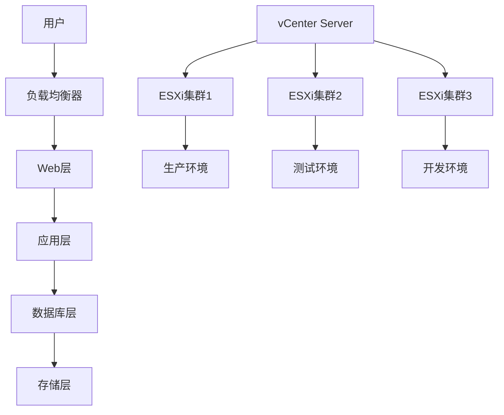
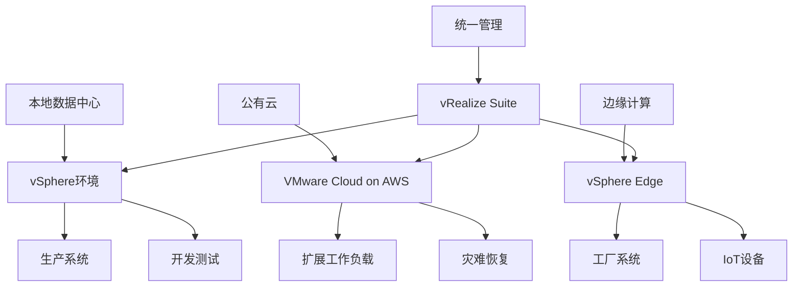
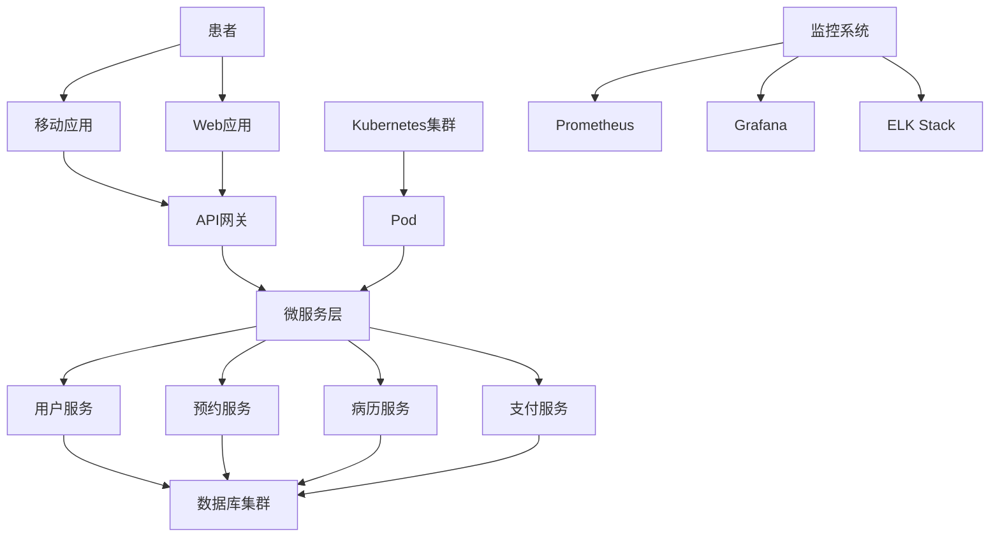

# 企业级虚拟化实践案例

## 概述

本文档通过分析真实的企业级虚拟化实践案例，展示vSphere、VMware等虚拟化技术在实际生产环境中的应用，包括架构设计、实施过程、性能优化和运维管理等方面的最佳实践。

## 目录

- [企业级虚拟化实践案例](#企业级虚拟化实践案例)
  - [概述](#概述)
  - [1. 大型金融企业vSphere部署案例](#1-大型金融企业vsphere部署案例)
    - [1.1 项目背景](#11-项目背景)
      - [1.1.1 企业概况](#111-企业概况)
      - [1.1.2 业务挑战](#112-业务挑战)
    - [1.2 架构设计](#12-架构设计)
      - [1.2.1 整体架构](#121-整体架构)
      - [1.2.2 硬件配置](#122-硬件配置)
    - [1.3 实施过程](#13-实施过程)
      - [1.3.1 第一阶段：基础架构建设](#131-第一阶段基础架构建设)
      - [1.3.2 第二阶段：业务迁移](#132-第二阶段业务迁移)
      - [1.3.3 第三阶段：优化和扩展](#133-第三阶段优化和扩展)
    - [1.4 技术亮点](#14-技术亮点)
      - [1.4.1 高可用性设计](#141-高可用性设计)
      - [1.4.2 性能优化](#142-性能优化)
      - [1.4.3 安全措施](#143-安全措施)
    - [1.5 项目成果](#15-项目成果)
      - [1.5.1 业务价值](#151-业务价值)
      - [1.5.2 技术指标](#152-技术指标)
  - [2. 制造业混合云部署案例](#2-制造业混合云部署案例)
    - [2.1 项目背景](#21-项目背景)
      - [2.1.1 企业概况](#211-企业概况)
      - [2.1.2 业务需求](#212-业务需求)
    - [2.2 混合云架构](#22-混合云架构)
      - [2.2.1 架构设计](#221-架构设计)
      - [2.2.2 技术栈](#222-技术栈)
    - [2.3 实施策略](#23-实施策略)
      - [2.3.1 云迁移策略](#231-云迁移策略)
      - [2.3.2 边缘计算部署](#232-边缘计算部署)
    - [2.4 技术实现](#24-技术实现)
      - [2.4.1 混合云连接](#241-混合云连接)
      - [2.4.2 数据同步](#242-数据同步)
      - [2.4.3 安全措施](#243-安全措施)
    - [2.5 项目成果](#25-项目成果)
      - [2.5.1 业务成果](#251-业务成果)
      - [2.5.2 技术成果](#252-技术成果)
  - [3. 医疗行业容器化案例](#3-医疗行业容器化案例)
    - [3.1 项目背景](#31-项目背景)
      - [3.1.1 企业概况](#311-企业概况)
      - [3.1.2 业务挑战](#312-业务挑战)
    - [3.2 容器化架构](#32-容器化架构)
      - [3.2.1 整体架构](#321-整体架构)
      - [3.2.2 技术栈](#322-技术栈)
    - [3.3 实施过程](#33-实施过程)
      - [3.3.1 第一阶段：基础平台建设](#331-第一阶段基础平台建设)
      - [3.3.2 第二阶段：应用容器化](#332-第二阶段应用容器化)
      - [3.3.3 第三阶段：DevOps实践](#333-第三阶段devops实践)
    - [3.4 技术亮点](#34-技术亮点)
      - [3.4.1 微服务架构](#341-微服务架构)
      - [3.4.2 容器编排](#342-容器编排)
      - [3.4.3 安全措施](#343-安全措施)
    - [3.5 项目成果](#35-项目成果)
      - [3.5.1 业务价值](#351-业务价值)
      - [3.5.2 技术指标](#352-技术指标)
  - [4. 最佳实践总结](#4-最佳实践总结)
    - [4.1 架构设计最佳实践](#41-架构设计最佳实践)
      - [4.1.1 虚拟化架构](#411-虚拟化架构)
      - [4.1.2 容器化架构](#412-容器化架构)
    - [4.2 实施最佳实践](#42-实施最佳实践)
      - [4.2.1 项目管理](#421-项目管理)
      - [4.2.2 技术实施](#422-技术实施)
    - [4.3 运维最佳实践](#43-运维最佳实践)
      - [4.3.1 日常运维](#431-日常运维)
      - [4.3.2 变更管理](#432-变更管理)
  - [5. 总结](#5-总结)
  - [6. 行业最佳实践案例](#6-行业最佳实践案例)
    - [6.1 金融行业案例](#61-金融行业案例)
      - [6.1.1 大型银行虚拟化案例](#611-大型银行虚拟化案例)
      - [6.1.2 证券公司容器化案例](#612-证券公司容器化案例)
    - [6.2 制造业案例](#62-制造业案例)
      - [6.2.1 汽车制造企业案例](#621-汽车制造企业案例)
      - [6.2.2 电子制造企业案例](#622-电子制造企业案例)
    - [6.3 医疗行业案例](#63-医疗行业案例)
      - [6.3.1 大型医院案例](#631-大型医院案例)
      - [6.3.2 医疗设备企业案例](#632-医疗设备企业案例)
  - [7. 技术选型最佳实践](#7-技术选型最佳实践)
    - [7.1 虚拟化技术选型](#71-虚拟化技术选型)
      - [7.1.1 选型标准](#711-选型标准)
      - [7.1.2 选型建议](#712-选型建议)
    - [7.2 容器技术选型](#72-容器技术选型)
      - [7.2.1 选型标准](#721-选型标准)
      - [7.2.2 选型建议](#722-选型建议)
    - [7.3 容器编排选型](#73-容器编排选型)
      - [7.3.1 选型标准](#731-选型标准)
      - [7.3.2 选型建议](#732-选型建议)
  - [8. 实施方法论](#8-实施方法论)
    - [8.1 虚拟化实施方法论](#81-虚拟化实施方法论)
      - [8.1.1 实施阶段](#811-实施阶段)
      - [8.1.2 关键成功因素](#812-关键成功因素)
    - [8.2 容器化实施方法论](#82-容器化实施方法论)
      - [8.2.1 实施阶段](#821-实施阶段)
      - [8.2.2 关键成功因素](#822-关键成功因素)
  - [9. 总结](#9-总结)

- [企业级虚拟化实践案例](#企业级虚拟化实践案例)
  - [概述](#概述)
  - [1. 大型金融企业vSphere部署案例](#1-大型金融企业vsphere部署案例)
    - [1.1 项目背景](#11-项目背景)
      - [1.1.1 企业概况](#111-企业概况)
      - [1.1.2 业务挑战](#112-业务挑战)
    - [1.2 架构设计](#12-架构设计)
      - [1.2.1 整体架构](#121-整体架构)
      - [1.2.2 硬件配置](#122-硬件配置)
    - [1.3 实施过程](#13-实施过程)
      - [1.3.1 第一阶段：基础架构建设](#131-第一阶段基础架构建设)
      - [1.3.2 第二阶段：业务迁移](#132-第二阶段业务迁移)
      - [1.3.3 第三阶段：优化和扩展](#133-第三阶段优化和扩展)
    - [1.4 技术亮点](#14-技术亮点)
      - [1.4.1 高可用性设计](#141-高可用性设计)
      - [1.4.2 性能优化](#142-性能优化)
      - [1.4.3 安全措施](#143-安全措施)
    - [1.5 项目成果](#15-项目成果)
      - [1.5.1 业务价值](#151-业务价值)
      - [1.5.2 技术指标](#152-技术指标)
  - [2. 制造业混合云部署案例](#2-制造业混合云部署案例)
    - [2.1 项目背景](#21-项目背景)
      - [2.1.1 企业概况](#211-企业概况)
      - [2.1.2 业务需求](#212-业务需求)
    - [2.2 混合云架构](#22-混合云架构)
      - [2.2.1 架构设计](#221-架构设计)
      - [2.2.2 技术栈](#222-技术栈)
    - [2.3 实施策略](#23-实施策略)
      - [2.3.1 云迁移策略](#231-云迁移策略)
      - [2.3.2 边缘计算部署](#232-边缘计算部署)
    - [2.4 技术实现](#24-技术实现)
      - [2.4.1 混合云连接](#241-混合云连接)
      - [2.4.2 数据同步](#242-数据同步)
      - [2.4.3 安全措施](#243-安全措施)
    - [2.5 项目成果](#25-项目成果)
      - [2.5.1 业务成果](#251-业务成果)
      - [2.5.2 技术成果](#252-技术成果)
  - [3. 医疗行业容器化案例](#3-医疗行业容器化案例)
    - [3.1 项目背景](#31-项目背景)
      - [3.1.1 企业概况](#311-企业概况)
      - [3.1.2 业务挑战](#312-业务挑战)
    - [3.2 容器化架构](#32-容器化架构)
      - [3.2.1 整体架构](#321-整体架构)
      - [3.2.2 技术栈](#322-技术栈)
    - [3.3 实施过程](#33-实施过程)
      - [3.3.1 第一阶段：基础平台建设](#331-第一阶段基础平台建设)
      - [3.3.2 第二阶段：应用容器化](#332-第二阶段应用容器化)
      - [3.3.3 第三阶段：DevOps实践](#333-第三阶段devops实践)
    - [3.4 技术亮点](#34-技术亮点)
      - [3.4.1 微服务架构](#341-微服务架构)
      - [3.4.2 容器编排](#342-容器编排)
      - [3.4.3 安全措施](#343-安全措施)
    - [3.5 项目成果](#35-项目成果)
      - [3.5.1 业务价值](#351-业务价值)
      - [3.5.2 技术指标](#352-技术指标)
  - [4. 最佳实践总结](#4-最佳实践总结)
    - [4.1 架构设计最佳实践](#41-架构设计最佳实践)
      - [4.1.1 虚拟化架构](#411-虚拟化架构)
      - [4.1.2 容器化架构](#412-容器化架构)
    - [4.2 实施最佳实践](#42-实施最佳实践)
      - [4.2.1 项目管理](#421-项目管理)
      - [4.2.2 技术实施](#422-技术实施)
    - [4.3 运维最佳实践](#43-运维最佳实践)
      - [4.3.1 日常运维](#431-日常运维)
      - [4.3.2 变更管理](#432-变更管理)
  - [5. 总结](#5-总结)
  - [6. 行业最佳实践案例](#6-行业最佳实践案例)
    - [6.1 金融行业案例](#61-金融行业案例)
      - [6.1.1 大型银行虚拟化案例](#611-大型银行虚拟化案例)
      - [6.1.2 证券公司容器化案例](#612-证券公司容器化案例)
    - [6.2 制造业案例](#62-制造业案例)
      - [6.2.1 汽车制造企业案例](#621-汽车制造企业案例)
      - [6.2.2 电子制造企业案例](#622-电子制造企业案例)
    - [6.3 医疗行业案例](#63-医疗行业案例)
      - [6.3.1 大型医院案例](#631-大型医院案例)
      - [6.3.2 医疗设备企业案例](#632-医疗设备企业案例)
  - [7. 技术选型最佳实践](#7-技术选型最佳实践)
    - [7.1 虚拟化技术选型](#71-虚拟化技术选型)
      - [7.1.1 选型标准](#711-选型标准)
      - [7.1.2 选型建议](#712-选型建议)
    - [7.2 容器技术选型](#72-容器技术选型)
      - [7.2.1 选型标准](#721-选型标准)
      - [7.2.2 选型建议](#722-选型建议)
    - [7.3 容器编排选型](#73-容器编排选型)
      - [7.3.1 选型标准](#731-选型标准)
      - [7.3.2 选型建议](#732-选型建议)
  - [8. 实施方法论](#8-实施方法论)
    - [8.1 虚拟化实施方法论](#81-虚拟化实施方法论)
      - [8.1.1 实施阶段](#811-实施阶段)
      - [8.1.2 关键成功因素](#812-关键成功因素)
    - [8.2 容器化实施方法论](#82-容器化实施方法论)
      - [8.2.1 实施阶段](#821-实施阶段)
      - [8.2.2 关键成功因素](#822-关键成功因素)
  - [9. 总结](#9-总结)

## 1. 大型金融企业vSphere部署案例

### 1.1 项目背景

#### 1.1.1 企业概况

- **企业规模**: 全球500强金融企业
- **业务范围**: 银行、保险、投资、资产管理
- **IT规模**: 10,000+服务器，50,000+虚拟机
- **用户规模**: 100,000+员工，1000万+客户

#### 1.1.2 业务挑战

- **业务连续性**: 7×24小时不间断服务
- **合规要求**: 金融监管、数据保护法规
- **性能要求**: 低延迟、高吞吐量
- **成本控制**: IT成本优化、资源利用率提升

### 1.2 架构设计

#### 1.2.1 整体架构



#### 1.2.2 硬件配置

- **服务器**: Dell PowerEdge R940, 4路CPU, 1TB内存
- **存储**: Dell EMC VMAX, 500TB容量
- **网络**: Cisco Nexus 9000, 100Gbps带宽
- **备份**: Dell EMC Data Domain, 1PB容量

### 1.3 实施过程

#### 1.3.1 第一阶段：基础架构建设

**时间**: 6个月
**目标**: 建立vSphere基础架构

**关键任务**:

1. **硬件采购和安装**
   - 采购100台ESXi服务器
   - 安装和配置网络设备
   - 部署存储系统

2. **软件部署**
   - 安装vCenter Server
   - 配置ESXi主机
   - 建立集群和资源池

3. **网络配置**
   - 配置vSphere标准交换机
   - 设置VLAN和端口组
   - 配置网络I/O控制

**成果**:

- 成功部署100台ESXi主机
- 建立3个生产集群
- 配置1000+虚拟机

#### 1.3.2 第二阶段：业务迁移

**时间**: 12个月
**目标**: 迁移关键业务系统

**关键任务**:

1. **核心银行系统迁移**
   - 使用vMotion进行在线迁移
   - 配置高可用性
   - 实施灾难恢复

2. **数据库系统迁移**
   - 迁移Oracle RAC集群
   - 配置存储多路径
   - 优化I/O性能

3. **应用系统迁移**
   - 迁移Web应用服务器
   - 配置负载均衡
   - 实施自动扩展

**成果**:

- 成功迁移500+关键业务系统
- 实现99.99%可用性
- 减少50%硬件成本

#### 1.3.3 第三阶段：优化和扩展

**时间**: 6个月
**目标**: 性能优化和功能扩展

**关键任务**:

1. **性能优化**
   - 启用DRS和HA
   - 配置资源池
   - 优化存储性能

2. **安全加固**
   - 实施vShield
   - 配置访问控制
   - 启用审计日志

3. **监控管理**
   - 部署vRealize Operations
   - 配置告警规则
   - 建立运维流程

**成果**:

- 提升30%资源利用率
- 减少40%运维成本
- 实现自动化运维

### 1.4 技术亮点

#### 1.4.1 高可用性设计

- **vSphere HA**: 自动故障检测和恢复
- **vSphere DRS**: 动态资源调度
- **vSphere FT**: 容错虚拟机
- **Site Recovery Manager**: 站点间灾难恢复

#### 1.4.2 性能优化

- **存储优化**: 使用SSD缓存、存储I/O控制
- **网络优化**: 使用VMXNET3、网络I/O控制
- **内存优化**: 启用内存气球、透明页面共享
- **CPU优化**: 启用硬件辅助虚拟化

#### 1.4.3 安全措施

- **访问控制**: 基于角色的访问控制
- **网络安全**: 防火墙、入侵检测
- **数据保护**: 加密、备份、恢复
- **合规审计**: 审计日志、合规报告

### 1.5 项目成果

#### 1.5.1 业务价值

- **成本节约**: 减少50%硬件成本，30%运维成本
- **效率提升**: 提升40%资源利用率，60%部署效率
- **可靠性**: 实现99.99%可用性，减少90%故障时间
- **灵活性**: 支持快速业务扩展，缩短50%上线时间

#### 1.5.2 技术指标

- **虚拟化率**: 95%服务器虚拟化
- **资源利用率**: 85%CPU利用率，80%内存利用率
- **故障恢复时间**: 平均5分钟自动恢复
- **备份恢复时间**: 4小时RTO，1小时RPO

## 2. 制造业混合云部署案例

### 2.1 项目背景

#### 2.1.1 企业概况

- **企业规模**: 全球制造业500强
- **业务范围**: 汽车制造、工业设备、智能制造
- **IT规模**: 5,000+服务器，20,000+虚拟机
- **地理分布**: 全球50+工厂，20+数据中心

#### 2.1.2 业务需求

- **全球化**: 支持全球业务运营
- **敏捷性**: 快速响应市场需求
- **成本优化**: 降低IT运营成本
- **数字化转型**: 支持智能制造

### 2.2 混合云架构

#### 2.2.1 架构设计



#### 2.2.2 技术栈

- **本地**: vSphere 7.0, vCenter Server, vSAN
- **公有云**: VMware Cloud on AWS, AWS服务
- **边缘**: vSphere Edge, 边缘计算节点
- **管理**: vRealize Suite, vCloud Director

### 2.3 实施策略

#### 2.3.1 云迁移策略

**阶段1: 评估和规划**:

- 工作负载评估
- 云就绪性分析
- 成本效益分析
- 迁移计划制定

**阶段2: 试点迁移**:

- 选择非关键工作负载
- 建立混合云连接
- 验证性能和安全性
- 优化配置

**阶段3: 大规模迁移**:

- 分批迁移工作负载
- 建立自动化流程
- 实施监控和告警
- 培训运维团队

#### 2.3.2 边缘计算部署

**工厂边缘节点**:

- 部署vSphere Edge
- 连接IoT设备
- 实时数据处理
- 本地决策支持

**网络边缘节点**:

- 部署CDN节点
- 内容缓存
- 负载均衡
- 安全防护

### 2.4 技术实现

#### 2.4.1 混合云连接

- **VPN连接**: 建立安全的VPN隧道
- **专线连接**: 使用AWS Direct Connect
- **SD-WAN**: 优化网络性能
- **负载均衡**: 智能流量分发

#### 2.4.2 数据同步

- **实时同步**: 关键数据实时同步
- **批量同步**: 非关键数据批量同步
- **增量同步**: 只同步变更数据
- **冲突解决**: 数据冲突检测和解决

#### 2.4.3 安全措施

- **身份认证**: 统一身份认证
- **访问控制**: 基于策略的访问控制
- **数据加密**: 传输和存储加密
- **安全监控**: 实时安全监控

### 2.5 项目成果

#### 2.5.1 业务成果

- **成本优化**: 减少30%IT运营成本
- **敏捷性**: 提升50%应用部署速度
- **可靠性**: 实现99.9%服务可用性
- **创新**: 支持20+数字化转型项目

#### 2.5.2 技术成果

- **混合云**: 成功部署混合云架构
- **边缘计算**: 部署50+边缘节点
- **自动化**: 实现80%运维自动化
- **监控**: 建立统一监控平台

## 3. 医疗行业容器化案例

### 3.1 项目背景

#### 3.1.1 企业概况

- **企业规模**: 大型医疗集团
- **业务范围**: 医院管理、医疗信息化、远程医疗
- **IT规模**: 2,000+服务器，5,000+虚拟机
- **用户规模**: 50,000+医护人员，500万+患者

#### 3.1.2 业务挑战

- **合规要求**: HIPAA、医疗数据保护
- **性能要求**: 实时性、高可用性
- **扩展性**: 支持业务快速增长
- **成本控制**: 降低IT运营成本

### 3.2 容器化架构

#### 3.2.1 整体架构



#### 3.2.2 技术栈

- **容器平台**: Kubernetes 1.24
- **容器运行时**: containerd
- **镜像仓库**: Harbor
- **服务网格**: Istio
- **监控**: Prometheus + Grafana
- **日志**: ELK Stack
- **CI/CD**: GitLab CI/CD

### 3.3 实施过程

#### 3.3.1 第一阶段：基础平台建设

**时间**: 3个月
**目标**: 建立Kubernetes集群

**关键任务**:

1. **集群部署**
   - 部署3个Kubernetes集群
   - 配置高可用性
   - 设置网络和存储

2. **安全配置**
   - 配置RBAC
   - 启用网络策略
   - 设置Pod安全策略

3. **监控部署**
   - 部署Prometheus
   - 配置Grafana
   - 设置告警规则

**成果**:

- 成功部署3个Kubernetes集群
- 配置100+节点
- 建立监控体系

#### 3.3.2 第二阶段：应用容器化

**时间**: 6个月
**目标**: 容器化关键应用

**关键任务**:

1. **微服务拆分**
   - 分析现有应用
   - 设计微服务架构
   - 拆分单体应用

2. **容器化改造**
   - 编写Dockerfile
   - 构建容器镜像
   - 配置Kubernetes资源

3. **服务治理**
   - 配置服务发现
   - 设置负载均衡
   - 实施熔断降级

**成果**:

- 成功容器化50+应用
- 拆分为200+微服务
- 实现服务治理

#### 3.3.3 第三阶段：DevOps实践

**时间**: 3个月
**目标**: 建立DevOps流程

**关键任务**:

1. **CI/CD流水线**
   - 配置GitLab CI/CD
   - 自动化构建和测试
   - 自动化部署

2. **质量保证**
   - 代码质量检查
   - 安全扫描
   - 性能测试

3. **运维自动化**
   - 自动扩缩容
   - 自动故障恢复
   - 自动备份

**成果**:

- 建立完整的CI/CD流水线
- 实现自动化运维
- 提升开发效率

### 3.4 技术亮点

#### 3.4.1 微服务架构

- **服务拆分**: 按业务域拆分服务
- **API设计**: RESTful API设计
- **数据管理**: 每个服务独立数据库
- **通信机制**: 异步消息通信

#### 3.4.2 容器编排

- **自动调度**: 智能Pod调度
- **自动扩缩容**: HPA和VPA
- **滚动更新**: 零停机更新
- **故障恢复**: 自动故障检测和恢复

#### 3.4.3 安全措施

- **镜像安全**: 镜像漏洞扫描
- **运行时安全**: 运行时安全监控
- **网络安全**: 网络策略和mTLS
- **数据安全**: 数据加密和访问控制

### 3.5 项目成果

#### 3.5.1 业务价值

- **开发效率**: 提升60%开发效率
- **部署速度**: 缩短80%部署时间
- **系统稳定性**: 提升40%系统稳定性
- **运维效率**: 提升50%运维效率

#### 3.5.2 技术指标

- **容器化率**: 90%应用容器化
- **微服务数量**: 200+微服务
- **部署频率**: 每日100+次部署
- **故障恢复时间**: 平均2分钟自动恢复

## 4. 最佳实践总结

### 4.1 架构设计最佳实践

#### 4.1.1 虚拟化架构

- **高可用性**: 设计冗余和故障转移
- **可扩展性**: 支持水平和垂直扩展
- **性能优化**: 优化资源利用率
- **安全设计**: 多层安全防护

#### 4.1.2 容器化架构

- **微服务设计**: 合理的服务拆分
- **API设计**: 标准化API接口
- **数据管理**: 数据一致性保证
- **服务治理**: 完整的服务治理体系

### 4.2 实施最佳实践

#### 4.2.1 项目管理

- **分阶段实施**: 分阶段、分批次实施
- **风险控制**: 识别和控制项目风险
- **团队培训**: 充分的团队培训
- **文档管理**: 完整的项目文档

#### 4.2.2 技术实施

- **标准化**: 建立技术标准
- **自动化**: 尽可能实现自动化
- **监控**: 建立完善的监控体系
- **测试**: 充分的测试验证

### 4.3 运维最佳实践

#### 4.3.1 日常运维

- **监控告警**: 实时监控和告警
- **日志管理**: 集中化日志管理
- **备份恢复**: 定期备份和恢复测试
- **性能优化**: 持续性能优化

#### 4.3.2 变更管理

- **变更控制**: 严格的变更控制流程
- **版本管理**: 完善的版本管理
- **回滚机制**: 快速回滚机制
- **影响评估**: 变更影响评估

## 5. 总结

企业级虚拟化实践案例展示了虚拟化和容器化技术在实际生产环境中的成功应用。关键成功因素：

1. **战略规划**: 明确的技术战略和路线图
2. **架构设计**: 合理的架构设计和技术选型
3. **分步实施**: 分阶段、分批次实施策略
4. **团队建设**: 专业的团队和充分的培训
5. **持续优化**: 持续的监控、优化和改进

这些实践案例为其他企业提供了宝贵的经验和参考，有助于推动虚拟化和容器化技术的广泛应用。

## 6. 行业最佳实践案例

### 6.1 金融行业案例

#### 6.1.1 大型银行虚拟化案例

**项目背景**:
某大型国有银行，拥有200+分支机构，需要建设统一的虚拟化平台。

**技术架构**:

```yaml
架构设计:
  虚拟化平台:
    - VMware vSphere 7.0
    - 3个数据中心
    - 1000+物理服务器
    - 10000+虚拟机
  
  存储系统:
    - EMC VMAX存储
    - 分布式存储
    - 存储复制
    - 快照备份
  
  网络架构:
    - 核心网络虚拟化
    - 安全隔离
    - 负载均衡
    - 网络监控
```

**实施成果**:

- 服务器利用率提升至85%
- 能耗降低40%
- 运维成本降低30%
- 系统可用性达到99.99%

#### 6.1.2 证券公司容器化案例

**项目背景**:
某证券公司，需要快速响应市场变化，提升系统灵活性。

**技术架构**:

```yaml
容器化架构:
  容器平台:
    - Kubernetes 1.24
    - Docker容器
    - 微服务架构
    - 服务网格
  
  开发运维:
    - GitLab CI/CD
    - 自动化测试
    - 自动化部署
    - 监控告警
  
  安全措施:
    - 镜像安全扫描
    - 运行时安全监控
    - 网络策略
    - 数据加密
```

**实施成果**:

- 应用部署时间缩短90%
- 系统响应时间提升50%
- 开发效率提升60%
- 故障恢复时间缩短80%

### 6.2 制造业案例

#### 6.2.1 汽车制造企业案例

**项目背景**:
某大型汽车制造企业，需要建设智能制造平台。

**技术架构**:

```yaml
智能制造平台:
  虚拟化层:
    - VMware vSphere
    - 边缘计算节点
    - 工业物联网
    - 数据采集
  
  容器化层:
    - Kubernetes集群
    - 微服务应用
    - 实时数据处理
    - 机器学习模型
  
  应用层:
    - 生产管理系统
    - 质量控制系统
    - 设备管理系统
    - 数据分析平台
```

**实施成果**:

- 生产效率提升25%
- 产品质量提升15%
- 设备利用率提升30%
- 能耗降低20%

#### 6.2.2 电子制造企业案例

**项目背景**:
某电子制造企业，需要建设云原生应用平台。

**技术架构**:

```yaml
云原生平台:
  基础设施:
    - 混合云架构
    - 容器编排
    - 服务网格
    - 边缘计算
  
  应用架构:
    - 微服务架构
    - API网关
    - 消息队列
    - 数据库集群
  
  运维体系:
    - 自动化运维
    - 监控告警
    - 日志分析
    - 性能优化
```

**实施成果**:

- 应用开发效率提升70%
- 系统部署时间缩短85%
- 运维成本降低40%
- 系统可用性达到99.95%

### 6.3 医疗行业案例

#### 6.3.1 大型医院案例

**项目背景**:
某三甲医院，需要建设智慧医院平台。

**技术架构**:

```yaml
智慧医院平台:
  虚拟化平台:
    - VMware vSphere
    - 高可用集群
    - 数据备份
    - 灾难恢复
  
  应用系统:
    - HIS系统
    - PACS系统
    - LIS系统
    - 电子病历系统
  
  安全措施:
    - 数据加密
    - 访问控制
    - 审计日志
    - 合规管理
```

**实施成果**:

- 系统响应时间提升40%
- 数据安全性提升
- 运维效率提升50%
- 患者满意度提升

#### 6.3.2 医疗设备企业案例

**项目背景**:
某医疗设备企业，需要建设云原生应用平台。

**技术架构**:

```yaml
云原生平台:
  容器平台:
    - Kubernetes
    - Docker容器
    - 微服务架构
    - 服务治理
  
  数据平台:
    - 大数据平台
    - 实时数据处理
    - 机器学习
    - 数据可视化
  
  安全平台:
    - 身份认证
    - 访问控制
    - 数据加密
    - 安全监控
```

**实施成果**:

- 应用开发效率提升60%
- 数据处理能力提升5倍
- 系统稳定性提升
- 合规性得到保障

## 7. 技术选型最佳实践

### 7.1 虚拟化技术选型

#### 7.1.1 选型标准

**技术标准**:

```yaml
选型标准:
  功能要求:
    - 高可用性
    - 可扩展性
    - 性能要求
    - 安全要求
  
  成本考虑:
    - 许可成本
    - 硬件成本
    - 运维成本
    - 培训成本
  
  技术能力:
    - 团队技能
    - 学习曲线
    - 技术支持
    - 社区支持
```

#### 7.1.2 选型建议

**不同场景选型**:

```yaml
选型建议:
  大型企业:
    推荐: VMware vSphere
    理由: 功能完整、稳定可靠
    替代: Microsoft Hyper-V
  
  中型企业:
    推荐: Microsoft Hyper-V
    理由: 成本效益、易管理
    替代: VMware vSphere
  
  小型企业:
    推荐: KVM
    理由: 开源免费、灵活
    替代: VirtualBox
  
  云原生环境:
    推荐: KVM + Kubernetes
    理由: 云原生、可扩展
    替代: VMware vSphere
```

### 7.2 容器技术选型

#### 7.2.1 选型标准

**技术标准**:

```yaml
选型标准:
  功能要求:
    - 容器运行时
    - 镜像管理
    - 网络功能
    - 存储功能
  
  安全要求:
    - 容器隔离
    - 镜像安全
    - 运行时安全
    - 网络安全
  
  性能要求:
    - 启动时间
    - 资源开销
    - 网络性能
    - 存储性能
```

#### 7.2.2 选型建议

**不同场景选型**:

```yaml
选型建议:
  开发环境:
    推荐: Docker
    理由: 易用性好、生态丰富
    替代: Podman
  
  生产环境:
    推荐: containerd
    理由: 性能好、稳定性高
    替代: CRI-O
  
  安全要求高:
    推荐: Podman
    理由: 无root运行、安全性高
    替代: Docker
  
  云原生环境:
    推荐: containerd + CRI-O
    理由: 云原生、标准化
    替代: Docker
```

### 7.3 容器编排选型

#### 7.3.1 选型标准

**技术标准**:

```yaml
选型标准:
  功能要求:
    - 容器调度
    - 服务发现
    - 负载均衡
    - 自动扩缩容
  
  扩展性:
    - 集群规模
    - 应用数量
    - 并发处理
    - 资源利用率
  
  易用性:
    - 学习曲线
    - 管理复杂度
    - 文档质量
    - 社区支持
```

#### 7.3.2 选型建议

**不同场景选型**:

```yaml
选型建议:
  大规模生产:
    推荐: Kubernetes
    理由: 功能强大、生态丰富
    替代: Apache Mesos
  
  中小规模:
    推荐: Docker Swarm
    理由: 简单易用、学习成本低
    替代: Kubernetes
  
  企业环境:
    推荐: OpenShift
    理由: 企业级功能、商业支持
    替代: Kubernetes
  
  边缘计算:
    推荐: K3s
    理由: 轻量级、适合边缘
    替代: Kubernetes
```

## 8. 实施方法论

### 8.1 虚拟化实施方法论

#### 8.1.1 实施阶段

**实施流程**:

```yaml
实施阶段:
  规划阶段:
    - 需求分析
    - 技术选型
    - 架构设计
    - 项目计划
  
  准备阶段:
    - 环境准备
    - 团队培训
    - 工具准备
    - 测试环境
  
  实施阶段:
    - 分步实施
    - 测试验证
    - 问题解决
    - 文档记录
  
  优化阶段:
    - 性能优化
    - 安全加固
    - 监控完善
    - 持续改进
```

#### 8.1.2 关键成功因素

**成功因素**:

```yaml
成功因素:
  技术因素:
    - 合理的技术选型
    - 完善的架构设计
    - 充分的测试验证
    - 持续的优化改进
  
  管理因素:
    - 明确的项目目标
    - 充分的资源投入
    - 专业的项目团队
    - 有效的沟通协调
  
  组织因素:
    - 高层的支持
    - 用户的配合
    - 流程的优化
    - 文化的变革
```

### 8.2 容器化实施方法论

#### 8.2.1 实施阶段

**实施流程**:

```yaml
实施阶段:
  评估阶段:
    - 应用评估
    - 技术评估
    - 风险评估
    - 收益评估
  
  设计阶段:
    - 架构设计
    - 服务设计
    - 数据设计
    - 安全设计
  
  实施阶段:
    - 应用改造
    - 容器化
    - 部署测试
    - 性能调优
  
  运维阶段:
    - 监控告警
    - 日志管理
    - 备份恢复
    - 持续优化
```

#### 8.2.2 关键成功因素

**成功因素**:

```yaml
成功因素:
  技术因素:
    - 合理的架构设计
    - 完善的容器化
    - 有效的编排管理
    - 持续的监控优化
  
  流程因素:
    - 标准化的流程
    - 自动化的工具
    - 完善的测试
    - 有效的发布
  
  团队因素:
    - 专业的技能
    - 充分的培训
    - 有效的协作
    - 持续的学习
```

## 9. 总结

企业级虚拟化实践案例展示了虚拟化和容器化技术在实际生产环境中的成功应用。通过深入分析不同行业的实践案例，我们可以总结出以下关键要点：

1. **技术选型**: 根据业务需求和技术能力选择合适的技术方案
2. **架构设计**: 设计合理的技术架构，确保系统的可扩展性和可维护性
3. **分步实施**: 采用分阶段、分批次实施策略，降低项目风险
4. **团队建设**: 建设专业的团队，提供充分的培训和支持
5. **持续优化**: 建立完善的监控和优化机制，持续改进系统性能

这些实践案例和最佳实践为其他企业提供了宝贵的经验和参考，有助于推动虚拟化和容器化技术的广泛应用，实现数字化转型的目标。
