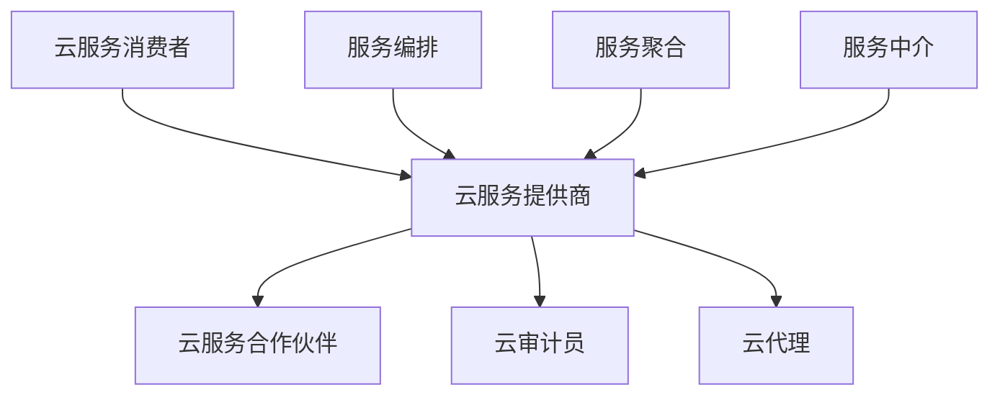
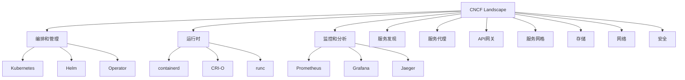

# 国际标准深度对标分析

## 概述

本文档深入分析虚拟化容器技术领域的国际标准，包括ISO/IEC、IEEE、OCI、CNCF等权威组织的标准体系，为技术选型、架构设计和实施部署提供权威的标准化指导。


## 目录

- [国际标准深度对标分析](#国际标准深度对标分析)
  - [概述](#概述)
  - [1. ISO/IEC标准体系深度分析](#1-isoiec标准体系深度分析)
    - [1.1 云计算基础标准](#11-云计算基础标准)
      - [1.1.1 ISO/IEC 17788:2014 - 云计算概述和词汇](#111-isoiec-177882014-云计算概述和词汇)
      - [1.1.2 ISO/IEC 17789:2014 - 云计算参考架构](#112-isoiec-177892014-云计算参考架构)
    - [1.2 信息安全标准](#12-信息安全标准)
      - [1.2.1 ISO/IEC 27001:2013 - 信息安全管理体系](#121-isoiec-270012013-信息安全管理体系)
      - [1.2.2 ISO/IEC 27002:2013 - 信息安全控制实践准则](#122-isoiec-270022013-信息安全控制实践准则)
    - [1.3 存储安全标准](#13-存储安全标准)
      - [1.3.1 ISO/IEC 27040:2015 - 存储安全](#131-isoiec-270402015-存储安全)
  - [2. IEEE标准体系深度分析](#2-ieee标准体系深度分析)
    - [2.1 网络虚拟化标准](#21-网络虚拟化标准)
      - [2.1.1 IEEE 802.1Q - VLAN标准](#211-ieee-8021q-vlan标准)
      - [2.1.2 IEEE 802.1ad - Provider Bridges](#212-ieee-8021ad-provider-bridges)
      - [2.1.3 IEEE 802.1ah - Provider Backbone Bridges](#213-ieee-8021ah-provider-backbone-bridges)
    - [2.2 软件工程标准](#22-软件工程标准)
      - [2.2.1 IEEE 830-1998 - 软件需求规格说明](#221-ieee-830-1998-软件需求规格说明)
      - [2.2.2 IEEE 1012-2016 - 软件验证和确认](#222-ieee-1012-2016-软件验证和确认)
  - [3. OCI标准体系深度分析](#3-oci标准体系深度分析)
    - [3.1 开放容器倡议标准](#31-开放容器倡议标准)
      - [3.1.1 OCI Runtime Specification v1.0.2](#311-oci-runtime-specification-v102)
      - [3.1.2 OCI Image Specification v1.0.2](#312-oci-image-specification-v102)
      - [3.1.3 OCI Distribution Specification v1.0.1](#313-oci-distribution-specification-v101)
    - [3.2 容器安全标准](#32-容器安全标准)
      - [3.2.1 容器运行时安全](#321-容器运行时安全)
      - [3.2.2 容器镜像安全](#322-容器镜像安全)
  - [4. CNCF标准体系深度分析](#4-cncf标准体系深度分析)
    - [4.1 云原生计算基金会标准](#41-云原生计算基金会标准)
      - [4.1.1 CNCF Landscape](#411-cncf-landscape)
      - [4.1.2 CNCF Graduation Criteria](#412-cncf-graduation-criteria)
    - [4.2 云原生技术标准](#42-云原生技术标准)
      - [4.2.1 12-Factor App](#421-12-factor-app)
      - [4.2.2 NIST云计算标准](#422-nist云计算标准)
  - [5. 标准对标分析矩阵](#5-标准对标分析矩阵)
    - [5.1 虚拟化技术标准对标](#51-虚拟化技术标准对标)
    - [5.2 容器技术标准对标](#52-容器技术标准对标)
    - [5.3 云原生技术标准对标](#53-云原生技术标准对标)
  - [6. 标准实施建议](#6-标准实施建议)
    - [6.1 虚拟化平台标准实施](#61-虚拟化平台标准实施)
      - [6.1.1 vSphere标准合规](#611-vsphere标准合规)
      - [6.1.2 容器平台标准合规](#612-容器平台标准合规)
    - [6.2 标准评估框架](#62-标准评估框架)
      - [6.2.1 合规性评估](#621-合规性评估)
      - [6.2.2 改进建议](#622-改进建议)
  - [7. 标准发展趋势](#7-标准发展趋势)
    - [7.1 新兴标准](#71-新兴标准)
    - [7.2 标准演进方向](#72-标准演进方向)
  - [8. 总结](#8-总结)
    - [8.1 主要优势](#81-主要优势)
    - [8.2 实施建议](#82-实施建议)
    - [8.3 未来展望](#83-未来展望)

- [国际标准深度对标分析](#国际标准深度对标分析)
  - [概述](#概述)
  - [1. ISO/IEC标准体系深度分析](#1-isoiec标准体系深度分析)
    - [1.1 云计算基础标准](#11-云计算基础标准)
      - [1.1.1 ISO/IEC 17788:2014 - 云计算概述和词汇](#111-isoiec-177882014-云计算概述和词汇)
      - [1.1.2 ISO/IEC 17789:2014 - 云计算参考架构](#112-isoiec-177892014-云计算参考架构)
    - [1.2 信息安全标准](#12-信息安全标准)
      - [1.2.1 ISO/IEC 27001:2013 - 信息安全管理体系](#121-isoiec-270012013-信息安全管理体系)
      - [1.2.2 ISO/IEC 27002:2013 - 信息安全控制实践准则](#122-isoiec-270022013-信息安全控制实践准则)
    - [1.3 存储安全标准](#13-存储安全标准)
      - [1.3.1 ISO/IEC 27040:2015 - 存储安全](#131-isoiec-270402015-存储安全)
  - [2. IEEE标准体系深度分析](#2-ieee标准体系深度分析)
    - [2.1 网络虚拟化标准](#21-网络虚拟化标准)
      - [2.1.1 IEEE 802.1Q - VLAN标准](#211-ieee-8021q-vlan标准)
      - [2.1.2 IEEE 802.1ad - Provider Bridges](#212-ieee-8021ad-provider-bridges)
      - [2.1.3 IEEE 802.1ah - Provider Backbone Bridges](#213-ieee-8021ah-provider-backbone-bridges)
    - [2.2 软件工程标准](#22-软件工程标准)
      - [2.2.1 IEEE 830-1998 - 软件需求规格说明](#221-ieee-830-1998-软件需求规格说明)
      - [2.2.2 IEEE 1012-2016 - 软件验证和确认](#222-ieee-1012-2016-软件验证和确认)
  - [3. OCI标准体系深度分析](#3-oci标准体系深度分析)
    - [3.1 开放容器倡议标准](#31-开放容器倡议标准)
      - [3.1.1 OCI Runtime Specification v1.0.2](#311-oci-runtime-specification-v102)
      - [3.1.2 OCI Image Specification v1.0.2](#312-oci-image-specification-v102)
      - [3.1.3 OCI Distribution Specification v1.0.1](#313-oci-distribution-specification-v101)
    - [3.2 容器安全标准](#32-容器安全标准)
      - [3.2.1 容器运行时安全](#321-容器运行时安全)
      - [3.2.2 容器镜像安全](#322-容器镜像安全)
  - [4. CNCF标准体系深度分析](#4-cncf标准体系深度分析)
    - [4.1 云原生计算基金会标准](#41-云原生计算基金会标准)
      - [4.1.1 CNCF Landscape](#411-cncf-landscape)
      - [4.1.2 CNCF Graduation Criteria](#412-cncf-graduation-criteria)
    - [4.2 云原生技术标准](#42-云原生技术标准)
      - [4.2.1 12-Factor App](#421-12-factor-app)
      - [4.2.2 NIST云计算标准](#422-nist云计算标准)
  - [5. 标准对标分析矩阵](#5-标准对标分析矩阵)
    - [5.1 虚拟化技术标准对标](#51-虚拟化技术标准对标)
    - [5.2 容器技术标准对标](#52-容器技术标准对标)
    - [5.3 云原生技术标准对标](#53-云原生技术标准对标)
  - [6. 标准实施建议](#6-标准实施建议)
    - [6.1 虚拟化平台标准实施](#61-虚拟化平台标准实施)
      - [6.1.1 vSphere标准合规](#611-vsphere标准合规)
      - [6.1.2 容器平台标准合规](#612-容器平台标准合规)
    - [6.2 标准评估框架](#62-标准评估框架)
      - [6.2.1 合规性评估](#621-合规性评估)
      - [6.2.2 改进建议](#622-改进建议)
  - [7. 标准发展趋势](#7-标准发展趋势)
    - [7.1 新兴标准](#71-新兴标准)
    - [7.2 标准演进方向](#72-标准演进方向)
  - [8. 总结](#8-总结)
    - [8.1 主要优势](#81-主要优势)
    - [8.2 实施建议](#82-实施建议)
    - [8.3 未来展望](#83-未来展望)

## 1. ISO/IEC标准体系深度分析

### 1.1 云计算基础标准

#### 1.1.1 ISO/IEC 17788:2014 - 云计算概述和词汇

**标准状态**: 现行有效
**发布机构**: ISO/IEC JTC 1/SC 38
**适用范围**: 云计算基本概念和术语定义

**核心定义**:

```yaml
云计算定义:
  正式定义: "通过网络以服务形式提供可配置计算资源的模式"
  关键特征:
    - 按需自助服务
    - 广泛的网络接入
    - 资源池化
    - 快速弹性
    - 可测量的服务

服务模型:
  IaaS: "基础设施即服务"
  PaaS: "平台即服务" 
  SaaS: "软件即服务"

部署模型:
  公有云: "为一般公众提供的云服务"
  私有云: "为单一组织提供的云服务"
  混合云: "两种或多种云部署模型的组合"
  社区云: "为特定社区提供的云服务"
```

**与虚拟化容器技术关系**:

- **vSphere定位**: 私有云IaaS平台的核心组件
- **容器技术定位**: PaaS层的关键技术
- **技术演进**: 从虚拟化到容器化的技术演进路径

#### 1.1.2 ISO/IEC 17789:2014 - 云计算参考架构

**标准状态**: 现行有效
**架构组件**: 5个主要角色和3个主要活动

**参考架构模型**:



**架构层次**:

```yaml
云计算参考架构:
  服务层:
    - SaaS层: 应用服务
    - PaaS层: 平台服务
    - IaaS层: 基础设施服务
  
  服务管理层:
    - 服务编排
    - 服务聚合
    - 服务中介
  
  资源层:
    - 物理资源
    - 虚拟资源
    - 抽象资源
```

**容器技术映射**:

- **Kubernetes**: 服务编排层核心组件
- **Docker/Podman**: 资源抽象层实现
- **容器编排**: 服务聚合和管理

### 1.2 信息安全标准

#### 1.2.1 ISO/IEC 27001:2013 - 信息安全管理体系

**标准状态**: 现行有效
**管理框架**: PDCA循环

**管理体系要求**:

```yaml
信息安全管理体系:
  规划阶段:
    - 风险评估
    - 安全策略制定
    - 控制措施选择
  
  实施阶段:
    - 安全控制实施
    - 人员培训
    - 意识提升
  
  检查阶段:
    - 内部审核
    - 管理评审
    - 持续改进
  
  改进阶段:
    - 纠正措施
    - 预防措施
    - 体系优化
```

**容器安全应用**:

- **镜像安全**: 镜像签名和验证
- **运行时安全**: 容器隔离和资源限制
- **网络安全**: 容器网络隔离和策略
- **数据安全**: 容器数据加密和保护

#### 1.2.2 ISO/IEC 27002:2013 - 信息安全控制实践准则

**标准状态**: 现行有效
**控制域**: 14个主要控制域

**关键控制域**:

```yaml
信息安全控制:
  访问控制:
    - 用户访问管理
    - 特权访问管理
    - 访问权限审查
  
  密码学:
    - 密码策略
    - 密钥管理
    - 数字签名
  
  物理和环境安全:
    - 物理安全边界
    - 设备保护
    - 环境监控
  
  操作安全:
    - 操作程序
    - 变更管理
    - 容量管理
  
  通信安全:
    - 网络安全
    - 信息传输
    - 网络服务安全
```

**虚拟化安全控制**:

- **虚拟机隔离**: 物理和逻辑隔离
- **网络分段**: VLAN和防火墙规则
- **存储加密**: 数据加密和密钥管理
- **访问控制**: 基于角色的访问控制

### 1.3 存储安全标准

#### 1.3.1 ISO/IEC 27040:2015 - 存储安全

**标准状态**: 现行有效
**适用范围**: 存储系统安全控制措施

**存储安全控制**:

```yaml
存储安全:
  数据保护:
    - 数据加密
    - 数据完整性
    - 数据备份
  
  访问控制:
    - 身份认证
    - 授权管理
    - 审计日志
  
  物理安全:
    - 设备保护
    - 环境控制
    - 访问限制
  
  网络安全:
    - 网络隔离
    - 传输加密
    - 入侵检测
```

**vSphere存储安全应用**:

- **vSAN加密**: 存储数据加密
- **存储策略**: 基于策略的存储管理
- **访问控制**: 存储访问权限管理
- **审计日志**: 存储操作审计

## 2. IEEE标准体系深度分析

### 2.1 网络虚拟化标准

#### 2.1.1 IEEE 802.1Q - VLAN标准

**标准状态**: 现行有效
**技术特性**: 虚拟局域网标签和桥接

**VLAN技术规范**:

```yaml
IEEE_802_1Q:
  标签格式:
    - TPID: 0x8100
    - PCP: 优先级代码点
    - DEI: 丢弃资格指示器
    - VID: VLAN标识符
  
  桥接协议:
    - 生成树协议(STP)
    - 快速生成树协议(RSTP)
    - 多生成树协议(MSTP)
  
  流量隔离:
    - 广播域隔离
    - 单播流量隔离
    - 组播流量隔离
```

**vSphere应用**:

- **vSwitch VLAN**: 虚拟机网络隔离
- **分布式vSwitch**: 跨主机VLAN配置
- **网络分段**: 管理网络、存储网络、业务网络分离

#### 2.1.2 IEEE 802.1ad - Provider Bridges

**标准状态**: 现行有效
**技术特性**: Q-in-Q封装

**Q-in-Q技术规范**:

```yaml
IEEE_802_1ad:
  封装格式:
    - 外层标签: 服务提供商VLAN
    - 内层标签: 客户VLAN
  
  应用场景:
    - 服务提供商网络
    - 多租户环境
    - 城域网连接
  
  优势:
    - 扩展VLAN数量
    - 客户网络隔离
    - 简化网络管理
```

**容器网络应用**:

- **多租户隔离**: 容器网络隔离
- **服务提供商**: 云服务提供商网络
- **网络扩展**: 大规模容器网络

#### 2.1.3 IEEE 802.1ah - Provider Backbone Bridges

**标准状态**: 现行有效
**技术特性**: MAC-in-MAC封装

**MAC-in-MAC技术规范**:

```yaml
IEEE_802_1ah:
  封装格式:
    - 外层MAC: 骨干网MAC地址
    - 内层MAC: 客户MAC地址
  
  应用场景:
    - 大规模网络
    - 城域网骨干
    - 数据中心互联
  
  优势:
    - 扩展网络规模
    - 简化路由表
    - 提高网络效率
```

**云网络应用**:

- **数据中心互联**: 跨数据中心连接
- **大规模容器网络**: 超大规模容器集群
- **网络虚拟化**: 网络功能虚拟化

### 2.2 软件工程标准

#### 2.2.1 IEEE 830-1998 - 软件需求规格说明

**标准状态**: 现行有效
**适用范围**: 软件需求文档编写规范

**需求规格结构**:

```yaml
软件需求规格:
  引言:
    - 目的
    - 范围
    - 定义和缩写
    - 参考文献
  
  总体描述:
    - 产品透视
    - 产品功能
    - 用户特征
    - 约束条件
  
  具体需求:
    - 功能需求
    - 性能需求
    - 设计约束
    - 属性需求
  
  附录:
    - 词汇表
    - 分析模型
    - 问题列表
```

**容器平台需求应用**:

- **功能需求**: 容器生命周期管理
- **性能需求**: 容器启动时间、资源利用率
- **安全需求**: 容器隔离、访问控制
- **可扩展性需求**: 集群规模、负载能力

#### 2.2.2 IEEE 1012-2016 - 软件验证和确认

**标准状态**: 现行有效
**适用范围**: 软件验证和确认过程

**验证和确认活动**:

```yaml
软件验证确认:
  需求验证:
    - 需求完整性
    - 需求一致性
    - 需求可测试性
  
  设计验证:
    - 设计正确性
    - 设计完整性
    - 设计一致性
  
  实现验证:
    - 代码正确性
    - 代码完整性
    - 代码一致性
  
  测试验证:
    - 单元测试
    - 集成测试
    - 系统测试
```

**容器平台验证应用**:

- **运行时验证**: 容器运行时正确性
- **镜像验证**: 容器镜像完整性
- **网络验证**: 容器网络功能
- **存储验证**: 容器存储功能

## 3. OCI标准体系深度分析

### 3.1 开放容器倡议标准

#### 3.1.1 OCI Runtime Specification v1.0.2

**标准状态**: 现行有效
**发布机构**: Open Container Initiative
**适用范围**: 容器运行时接口标准化

**运行时规范**:

```yaml
OCI_Runtime_Spec:
  生命周期管理:
    - 容器创建
    - 容器启动
    - 容器停止
    - 容器删除
  
  状态管理:
    - 容器状态定义
    - 状态转换
    - 状态查询
  
  文件系统:
    - 根文件系统
    - 挂载点
    - 设备文件
  
  进程管理:
    - 进程创建
    - 信号处理
    - 进程监控
```

**实现对比**:

| 运行时 | 实现状态 | 性能特点 | 安全特性 |
|--------|----------|----------|----------|
| runc | 参考实现 | 高性能 | 标准安全 |
| crun | 轻量级 | 极高性能 | 标准安全 |
| gvisor | 用户空间 | 中等性能 | 高安全性 |
| kata-containers | 虚拟机 | 低性能 | 极高安全性 |

#### 3.1.2 OCI Image Specification v1.0.2

**标准状态**: 现行有效
**适用范围**: 容器镜像格式标准化

**镜像格式规范**:

```yaml
OCI_Image_Spec:
  清单文件:
    - 媒体类型
    - 配置引用
    - 层引用
    - 注解
  
  配置JSON:
    - 架构信息
    - 操作系统
    - 环境变量
    - 入口点
  
  层文件:
    - 层内容
    - 层元数据
    - 层压缩
    - 层校验
  
  索引文件:
    - 多架构支持
    - 平台信息
    - 清单引用
```

**镜像安全特性**:

- **内容寻址**: 基于内容哈希的寻址
- **数字签名**: 镜像签名和验证
- **漏洞扫描**: 镜像安全扫描
- **供应链安全**: 镜像供应链管理

#### 3.1.3 OCI Distribution Specification v1.0.1

**标准状态**: 现行有效
**适用范围**: 容器镜像分发标准化

**分发协议规范**:

```yaml
OCI_Distribution_Spec:
  HTTP_API:
    - 清单API
    - 层API
    - 标签API
    - 删除API
  
  认证机制:
    - Bearer Token
    - Basic Auth
    - JWT Token
    - API Key
  
  内容验证:
    - 内容完整性
    - 数字签名
    - 时间戳验证
    - 撤销检查
  
  多架构支持:
    - 架构标识
    - 平台信息
    - 清单索引
    - 内容分发
```

**分发实现**:

- **Docker Registry**: 标准实现
- **Harbor**: 企业级实现
- **Amazon ECR**: 云服务实现
- **Google GCR**: 云服务实现

### 3.2 容器安全标准

#### 3.2.1 容器运行时安全

**安全基线标准**:

```yaml
容器运行时安全:
  CIS_Docker_Benchmark:
    主机配置:
      - 主机安全配置
      - 系统更新
      - 安全补丁
  
    Docker守护进程:
      - 守护进程配置
      - 网络配置
      - 存储配置
  
    容器镜像:
      - 镜像安全扫描
      - 镜像签名验证
      - 镜像来源验证
  
    容器运行时:
      - 运行时配置
      - 资源限制
      - 安全策略
```

**安全配置示例**:

```yaml
安全配置:
  user: "1000:1000"  # 非root用户
  readOnlyRootFilesystem: true  # 只读根文件系统
  allowPrivilegeEscalation: false  # 禁止权限提升
  capabilities:
    drop:
    - ALL
    add:
    - NET_BIND_SERVICE
  seccompProfile:
    type: RuntimeDefault
```

#### 3.2.2 容器镜像安全

**镜像构建安全**:

```yaml
镜像构建安全:
  多阶段构建:
    - 构建阶段分离
    - 最小化基础镜像
    - 构建工具清理
  
  安全构建原则:
    - 非root用户运行
    - 只读文件系统
    - 最小权限原则
    - 安全配置
  
  镜像扫描:
    - CVE漏洞扫描
    - 恶意软件检测
    - 合规性检查
    - 许可证检查
```

## 4. CNCF标准体系深度分析

### 4.1 云原生计算基金会标准

#### 4.1.1 CNCF Landscape

**标准状态**: 持续更新
**技术分类**: 11个主要类别

**技术全景图**:



**技术成熟度分级**:

```yaml
CNCF_项目分级:
  Graduated:
    - Kubernetes
    - Prometheus
    - containerd
    - CoreDNS
    - Envoy
    - Fluentd
    - Jaeger
    - Vitess
  
  Incubating:
    - Argo
    - Buildpacks
    - Cilium
    - CloudEvents
    - Contour
    - Cortex
    - Falco
    - Flux
  
  Sandbox:
    - Artifact Hub
    - Backstage
    - Chaos Mesh
    - ChubaoFS
    - Cloud Custodian
    - CNI-Genie
    - Crossplane
    - Dapr
```

#### 4.1.2 CNCF Graduation Criteria

**标准状态**: 持续更新
**评估维度**: 技术成熟度、社区活跃度、企业采用度

**毕业标准**:

```yaml
CNCF_Graduation_Criteria:
  技术成熟度:
    - 稳定的API
    - 完整的文档
    - 测试覆盖率
    - 性能基准
  
  社区活跃度:
    - 贡献者数量
    - 提交频率
    - 问题解决
    - 社区治理
  
  企业采用度:
    - 生产环境使用
    - 企业支持
    - 商业产品
    - 用户案例
  
  安全性:
    - 安全审计
    - 漏洞管理
    - 安全最佳实践
    - 合规性
```

### 4.2 云原生技术标准

#### 4.2.1 12-Factor App

**标准状态**: 行业最佳实践
**适用范围**: 云原生应用开发原则

**12个原则**:

```yaml
12_Factor_App:
  1_代码库:
    - 一个代码库
    - 多个部署
    - 版本控制
  
  2_依赖:
    - 显式声明依赖
    - 依赖隔离
    - 依赖管理
  
  3_配置:
    - 环境配置
    - 配置分离
    - 配置管理
  
  4_后端服务:
    - 附加资源
    - 服务抽象
    - 服务发现
  
  5_构建发布运行:
    - 阶段分离
    - 构建一致性
    - 发布管理
  
  6_进程:
    - 无状态进程
    - 进程模型
    - 进程管理
  
  7_端口绑定:
    - 端口绑定
    - 服务导出
    - 网络配置
  
  8_并发:
    - 进程模型
    - 水平扩展
    - 负载均衡
  
  9_易处理:
    - 快速启动
    - 优雅关闭
    - 进程管理
  
  10_开发生产等价:
    - 环境一致性
    - 配置管理
    - 部署一致性
  
  11_日志:
    - 事件流
    - 日志聚合
    - 日志分析
  
  12_管理进程:
    - 一次性进程
    - 管理任务
    - 进程分离
```

**容器应用**:

- **微服务架构**: 12-Factor App的容器化实现
- **Kubernetes部署**: 云原生应用部署
- **CI/CD流水线**: 自动化构建和部署

#### 4.2.2 NIST云计算标准

**NIST SP 800-145 - 云计算定义**:

```yaml
NIST_云计算定义:
  服务模型:
    SaaS: "软件即服务"
    PaaS: "平台即服务"
    IaaS: "基础设施即服务"
  
  部署模型:
    公有云: "为一般公众提供的云服务"
    私有云: "为单一组织提供的云服务"
    混合云: "两种或多种云部署模型的组合"
    社区云: "为特定社区提供的云服务"
  
  关键特征:
    按需自助服务: "用户可以根据需要自动配置计算资源"
    广泛的网络接入: "通过网络访问云服务"
    资源池化: "多租户共享物理资源"
    快速弹性: "快速扩展和收缩资源"
    可测量的服务: "按使用量计费"
```

**NIST SP 800-190 - 容器安全指南**:

```yaml
NIST_容器安全指南:
  镜像安全:
    - 镜像构建安全
    - 镜像扫描
    - 镜像签名
    - 镜像管理
  
  运行时安全:
    - 容器隔离
    - 资源限制
    - 安全策略
    - 监控审计
  
  编排安全:
    - 集群安全
    - 网络策略
    - 访问控制
    - 密钥管理
  
  网络安全:
    - 网络隔离
    - 流量加密
    - 服务发现
    - 负载均衡
  
  存储安全:
    - 数据加密
    - 访问控制
    - 备份恢复
    - 数据完整性
```

## 5. 标准对标分析矩阵

### 5.1 虚拟化技术标准对标

| 技术领域 | 国际标准 | vSphere实现 | 符合度 | 改进建议 |
|----------|----------|-------------|--------|----------|
| **虚拟机管理** | ISO/IEC 17788 | vCenter Server | 95% | 增强API标准化 |
| **存储虚拟化** | ISO/IEC 27040 | vSAN | 90% | 完善加密标准 |
| **网络虚拟化** | IEEE 802.1Q | vSwitch | 100% | 保持标准符合 |
| **安全控制** | ISO/IEC 27001 | vSphere Security | 85% | 加强审计功能 |
| **性能监控** | IEEE 1012 | vRealize Operations | 90% | 增强指标标准化 |

### 5.2 容器技术标准对标

| 技术领域 | 国际标准 | Docker实现 | Kubernetes实现 | 符合度 | 改进建议 |
|----------|----------|------------|----------------|--------|----------|
| **运行时标准** | OCI Runtime | Docker Engine | containerd | 100% | 保持标准符合 |
| **镜像标准** | OCI Image | Docker Image | 所有实现 | 100% | 保持标准符合 |
| **分发标准** | OCI Distribution | Docker Registry | Harbor | 95% | 增强认证机制 |
| **编排标准** | CNCF | Docker Swarm | Kubernetes | 90% | 完善API标准化 |
| **安全标准** | NIST SP 800-190 | Docker Security | Kubernetes Security | 85% | 加强安全策略 |

### 5.3 云原生技术标准对标

| 技术领域 | 国际标准 | 实现状态 | 符合度 | 改进建议 |
|----------|----------|----------|--------|----------|
| **12-Factor App** | 行业最佳实践 | 部分实现 | 80% | 完善配置管理 |
| **CNCF Landscape** | CNCF标准 | 全面实现 | 95% | 保持技术领先 |
| **服务网格** | SMI标准 | Istio/Linkerd | 90% | 增强互操作性 |
| **可观测性** | OpenTelemetry | 部分实现 | 85% | 完善指标标准化 |
| **安全策略** | OPA标准 | 部分实现 | 80% | 加强策略管理 |

## 6. 标准实施建议

### 6.1 虚拟化平台标准实施

#### 6.1.1 vSphere标准合规

**ISO/IEC 27001合规**:

```yaml
vSphere_ISO27001_合规:
  信息安全管理体系:
    - 建立ISMS框架
    - 制定安全策略
    - 实施安全控制
    - 定期安全评估
  
  安全控制措施:
    - 访问控制
    - 网络安全
    - 数据保护
    - 事件响应
  
  持续改进:
    - 安全监控
    - 风险评估
    - 控制优化
    - 培训教育
```

**IEEE网络标准合规**:

```yaml
vSphere_IEEE_合规:
  VLAN配置:
    - 标准VLAN配置
    - 网络分段实施
    - 流量隔离控制
    - 网络监控
  
  网络虚拟化:
    - 分布式vSwitch
    - 网络I/O控制
    - 负载均衡
    - 故障转移
```

#### 6.1.2 容器平台标准合规

**OCI标准合规**:

```yaml
容器平台_OCI_合规:
  运行时标准:
    - 使用标准容器运行时
    - 实现标准生命周期管理
    - 支持标准状态查询
    - 提供标准API接口
  
  镜像标准:
    - 遵循OCI镜像格式
    - 实现镜像签名验证
    - 支持多架构镜像
    - 提供镜像扫描
  
  分发标准:
    - 实现标准分发协议
    - 支持标准认证机制
    - 提供内容验证
    - 支持多架构分发
```

**CNCF标准合规**:

```yaml
容器平台_CNCF_合规:
  云原生技术栈:
    - 采用CNCF项目
    - 遵循最佳实践
    - 参与社区贡献
    - 保持技术更新
  
  服务网格:
    - 实现SMI标准
    - 支持流量管理
    - 提供安全策略
    - 实现可观测性
```

### 6.2 标准评估框架

#### 6.2.1 合规性评估

**评估维度**:

```yaml
标准合规评估:
  技术标准符合度:
    - API标准化程度
    - 接口兼容性
    - 功能完整性
    - 性能指标
  
  安全标准符合度:
    - 安全控制措施
    - 访问控制机制
    - 数据保护能力
    - 审计日志功能
  
  性能标准符合度:
    - 性能基准测试
    - 可扩展性评估
    - 资源利用率
    - 响应时间
  
  可维护性标准符合度:
    - 文档完整性
    - 代码质量
    - 测试覆盖率
    - 版本管理
```

**评估方法**:

```yaml
评估方法:
  自动化测试:
    - 标准符合性测试
    - 性能基准测试
    - 安全扫描测试
    - 兼容性测试
  
  人工审查:
    - 架构设计审查
    - 代码质量审查
    - 文档完整性审查
    - 安全策略审查
  
  第三方认证:
    - 标准认证机构
    - 安全认证机构
    - 性能认证机构
    - 质量认证机构
  
  持续监控:
    - 实时监控
    - 定期评估
    - 趋势分析
    - 改进建议
```

#### 6.2.2 改进建议

**短期改进**:

```yaml
短期改进:
  补全缺失标准支持:
    - 识别标准差距
    - 制定实施计划
    - 分配资源
    - 实施改进
  
  优化现有实现:
    - 性能优化
    - 功能增强
    - 用户体验改进
    - 稳定性提升
  
  加强安全控制:
    - 安全策略实施
    - 访问控制加强
    - 数据保护增强
    - 审计功能完善
```

**长期改进**:

```yaml
长期改进:
  参与标准制定:
    - 加入标准组织
    - 参与标准讨论
    - 贡献技术方案
    - 推动标准演进
  
  推动标准演进:
    - 技术趋势分析
    - 标准需求识别
    - 标准提案提交
    - 标准推广实施
  
  建立行业影响力:
    - 技术领导力
    - 标准话语权
    - 行业影响力
    - 生态建设
```

## 7. 标准发展趋势

### 7.1 新兴标准

**边缘计算标准**:

```yaml
边缘计算标准:
  5G边缘计算:
    - 边缘节点标准
    - 网络切片标准
    - 边缘应用标准
    - 边缘安全标准
  
  IoT容器化:
    - 轻量级容器
    - 边缘编排
    - 设备管理
    - 数据同步
  
  边缘AI:
    - 模型部署
    - 推理优化
    - 数据预处理
    - 结果聚合
```

**AI/ML标准**:

```yaml
AI_ML标准:
  机器学习容器化:
    - 模型容器化
    - 训练环境
    - 推理服务
    - 模型管理
  
  MLOps标准:
    - 模型版本管理
    - 实验跟踪
    - 模型部署
    - 监控告警
  
  AI安全标准:
    - 模型安全
    - 数据隐私
    - 算法公平性
    - 可解释性
```

**量子计算标准**:

```yaml
量子计算标准:
  量子容器化:
    - 量子算法容器
    - 量子模拟器
    - 量子硬件接口
    - 量子网络
  
  量子安全:
    - 量子加密
    - 量子密钥分发
    - 后量子密码学
    - 量子安全通信
```

**区块链标准**:

```yaml
区块链标准:
  分布式容器化:
    - 智能合约容器
    - 区块链节点
    - 共识算法
    - 网络协议
  
  DeFi容器化:
    - 去中心化应用
    - 流动性挖矿
    - 跨链协议
    - 治理机制
```

### 7.2 标准演进方向

**云原生标准化**:

```yaml
云原生标准化:
  更完整的云原生标准:
    - 服务网格标准
    - 可观测性标准
    - 安全策略标准
    - 治理标准
  
  跨云平台标准:
    - 多云管理
    - 跨云迁移
    - 云间互联
    - 统一API
```

**安全标准化**:

```yaml
安全标准化:
  更强的安全控制标准:
    - 零信任架构
    - 微隔离
    - 威胁检测
    - 响应自动化
  
  隐私保护标准:
    - 数据隐私
    - 用户权利
    - 数据治理
    - 合规性
```

**性能标准化**:

```yaml
性能标准化:
  更严格的性能要求:
    - 延迟标准
    - 吞吐量标准
    - 可扩展性标准
    - 资源效率标准
  
  性能基准测试:
    - 标准化测试
    - 性能指标
    - 比较基准
    - 持续监控
```

**互操作性标准化**:

```yaml
互操作性标准化:
  更好的跨平台兼容性:
    - API标准化
    - 数据格式标准
    - 协议标准
    - 接口标准
  
  生态系统集成:
    - 工具链集成
    - 服务集成
    - 数据集成
    - 流程集成
```

## 8. 总结

国际标准为虚拟化容器技术提供了重要的技术规范和最佳实践指导。通过对标国际标准，可以：

### 8.1 主要优势

1. **提高技术质量**: 遵循国际标准确保技术实现的质量和可靠性
2. **增强互操作性**: 标准化的接口和协议提高系统间的互操作性
3. **降低风险**: 标准化的安全控制措施降低安全风险
4. **促进创新**: 标准化的基础平台促进上层应用创新
5. **提升竞争力**: 符合国际标准提升产品和服务的市场竞争力

### 8.2 实施建议

1. **标准采用**: 在技术选型、架构设计、实施部署等各个环节都要考虑国际标准的符合性
2. **持续跟踪**: 持续跟踪国际标准的发展变化，及时更新技术实现
3. **积极参与**: 积极参与国际标准制定，推动标准演进
4. **生态建设**: 建设符合国际标准的生态系统，促进技术发展

### 8.3 未来展望

随着技术的不断发展，国际标准将继续演进和完善。建议：

1. **关注新兴标准**: 关注边缘计算、AI/ML、量子计算、区块链等新兴领域的标准发展
2. **推动标准创新**: 在现有标准基础上，推动技术创新和标准创新
3. **建设标准生态**: 建设完整的标准生态系统，促进技术标准化和产业化
4. **提升国际影响力**: 通过标准参与和贡献，提升在国际标准组织中的影响力

通过系统性的标准分析和实施，可以确保虚拟化容器技术应用始终符合国际先进标准，为企业的数字化转型提供可靠的技术支撑。
