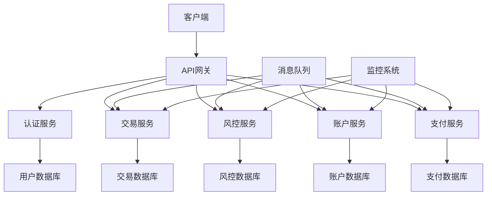
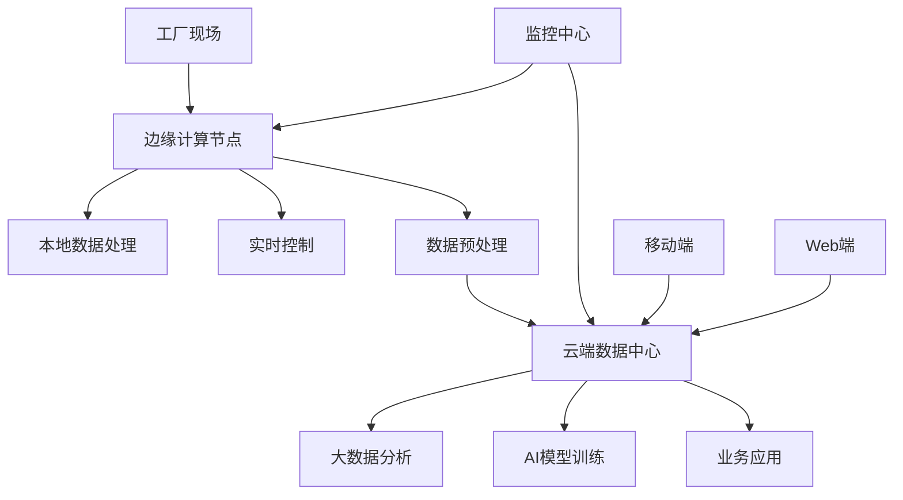
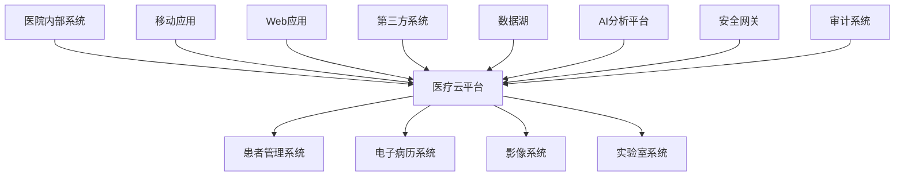
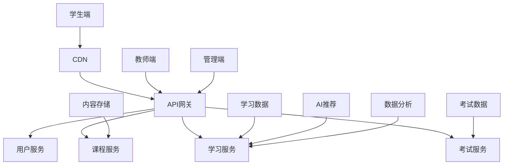
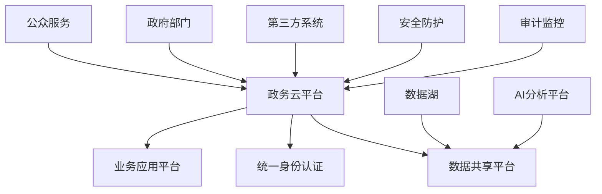
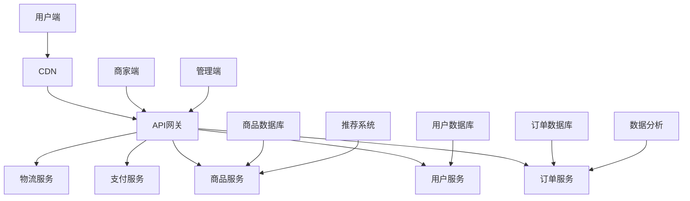
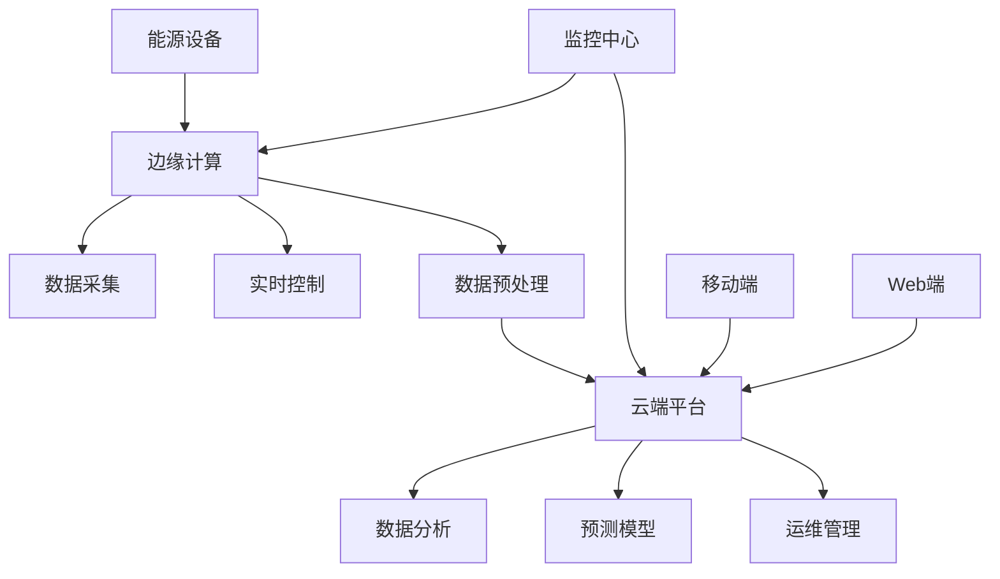
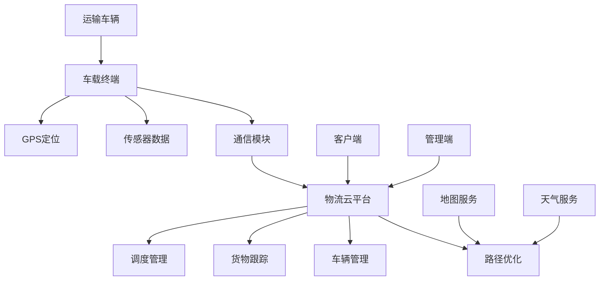

# 各行业解决方案架构设计深度分析

## 目录

- [各行业解决方案架构设计深度分析](#各行业解决方案架构设计深度分析)
  - [目录](#目录)
  - [执行摘要](#执行摘要)
    - [关键发现](#关键发现)
  - [金融行业解决方案](#金融行业解决方案)
    - [行业特点](#行业特点)
    - [架构设计模式](#架构设计模式)
      - [1. 微服务架构](#1-微服务架构)
      - [2. 容器化部署](#2-容器化部署)
      - [3. 安全架构](#3-安全架构)
    - [技术选型](#技术选型)
      - [容器技术栈](#容器技术栈)
      - [虚拟化技术栈](#虚拟化技术栈)
    - [运维运营经验](#运维运营经验)
      - [1. 监控告警](#1-监控告警)
      - [2. 自动化运维](#2-自动化运维)
      - [3. 安全运维](#3-安全运维)
    - [典型案例](#典型案例)
      - [某大型银行数字化转型](#某大型银行数字化转型)
  - [制造业解决方案](#制造业解决方案)
    - [行业特点1](#行业特点1)
    - [架构设计模式1](#架构设计模式1)
      - [1. 边缘-云协同架构](#1-边缘-云协同架构)
      - [2. 容器化部署1](#2-容器化部署1)
      - [3. 工业物联网架构](#3-工业物联网架构)
    - [技术选型1](#技术选型1)
      - [边缘计算技术](#边缘计算技术)
      - [云端技术](#云端技术)
    - [运维运营经验1](#运维运营经验1)
      - [1. 边缘运维](#1-边缘运维)
      - [2. 云端运维](#2-云端运维)
    - [典型案例1](#典型案例1)
      - [某汽车制造企业智能制造](#某汽车制造企业智能制造)
  - [医疗健康行业解决方案](#医疗健康行业解决方案)
    - [行业特点2](#行业特点2)
    - [架构设计模式2](#架构设计模式2)
      - [1. 医疗云架构](#1-医疗云架构)
      - [2. 容器化部署2](#2-容器化部署2)
      - [3. 数据安全架构](#3-数据安全架构)
    - [技术选型2](#技术选型2)
      - [医疗云技术](#医疗云技术)
      - [数据技术](#数据技术)
      - [AI/ML技术](#aiml技术)
    - [运维运营经验2](#运维运营经验2)
      - [1. 医疗数据管理](#1-医疗数据管理)
      - [2. 安全运维](#2-安全运维)
    - [典型案例2](#典型案例2)
      - [某三甲医院智慧医疗](#某三甲医院智慧医疗)
  - [教育行业解决方案](#教育行业解决方案)
    - [行业特点3](#行业特点3)
    - [架构设计模式3](#架构设计模式3)
      - [1. 在线教育平台架构](#1-在线教育平台架构)
      - [2. 容器化部署3](#2-容器化部署3)
      - [3. 内容分发架构](#3-内容分发架构)
    - [技术选型3](#技术选型3)
      - [教育云技术](#教育云技术)
      - [内容技术](#内容技术)
      - [AI/ML技术3](#aiml技术3)
    - [运维运营经验3](#运维运营经验3)
      - [1. 大规模并发处理](#1-大规模并发处理)
      - [2. 内容管理](#2-内容管理)
    - [典型案例3](#典型案例3)
      - [某在线教育平台](#某在线教育平台)
  - [政府行业解决方案](#政府行业解决方案)
    - [行业特点4](#行业特点4)
    - [架构设计模式4](#架构设计模式4)
      - [1. 政务云架构](#1-政务云架构)
      - [2. 容器化部署4](#2-容器化部署4)
      - [3. 数据共享架构](#3-数据共享架构)
    - [技术选型4](#技术选型4)
      - [政务云技术](#政务云技术)
      - [数据技术4](#数据技术4)
      - [安全技术](#安全技术)
    - [运维运营经验4](#运维运营经验4)
      - [1. 政务数据管理](#1-政务数据管理)
      - [2. 安全运维4](#2-安全运维4)
    - [典型案例4](#典型案例4)
      - [某省级政务云平台](#某省级政务云平台)
  - [零售电商行业解决方案](#零售电商行业解决方案)
    - [行业特点5](#行业特点5)
    - [架构设计模式5](#架构设计模式5)
      - [1. 电商平台架构](#1-电商平台架构)
      - [2. 容器化部署6](#2-容器化部署6)
      - [3. 高并发架构](#3-高并发架构)
    - [技术选型6](#技术选型6)
      - [电商云技术](#电商云技术)
      - [数据技术6](#数据技术6)
      - [AI/ML技术6](#aiml技术6)
    - [运维运营经验6](#运维运营经验6)
      - [1. 高并发处理](#1-高并发处理)
      - [2. 业务监控](#2-业务监控)
    - [典型案例6](#典型案例6)
      - [某大型电商平台](#某大型电商平台)
  - [能源行业解决方案](#能源行业解决方案)
    - [行业特点6](#行业特点6)
    - [架构设计模式6](#架构设计模式6)
      - [1. 能源物联网架构](#1-能源物联网架构)
      - [2. 容器化部署7](#2-容器化部署7)
      - [3. 数据分析架构](#3-数据分析架构)
    - [技术选型7](#技术选型7)
      - [边缘计算技术7](#边缘计算技术7)
      - [云端技术7](#云端技术7)
    - [运维运营经验7](#运维运营经验7)
      - [1. 设备监控](#1-设备监控)
      - [2. 数据分析](#2-数据分析)
    - [典型案例7](#典型案例7)
      - [某电力公司智能电网](#某电力公司智能电网)
  - [交通物流行业解决方案](#交通物流行业解决方案)
    - [行业特点7](#行业特点7)
    - [架构设计模式7](#架构设计模式7)
      - [1. 智能物流平台架构](#1-智能物流平台架构)
      - [2. 容器化部署8](#2-容器化部署8)
      - [3. 实时数据处理](#3-实时数据处理)
    - [技术选型8](#技术选型8)
      - [物流云技术](#物流云技术)
      - [数据技术8](#数据技术8)
      - [AI/ML技术8](#aiml技术8)
    - [运维运营经验8](#运维运营经验8)
      - [1. 车辆监控](#1-车辆监控)
      - [2. 运输优化](#2-运输优化)
    - [典型案例8](#典型案例8)
      - [某物流公司智能物流](#某物流公司智能物流)
  - [行业解决方案对比矩阵](#行业解决方案对比矩阵)
    - [技术需求对比](#技术需求对比)
    - [架构模式对比](#架构模式对比)
    - [技术栈对比](#技术栈对比)
  - [架构设计最佳实践](#架构设计最佳实践)
    - [1. 通用架构原则](#1-通用架构原则)
      - [1.1 微服务架构原则](#11-微服务架构原则)
      - [1.2 容器化原则](#12-容器化原则)
      - [1.3 云原生原则](#13-云原生原则)
    - [2. 安全架构原则](#2-安全架构原则)
      - [2.1 零信任安全](#21-零信任安全)
      - [2.2 数据安全](#22-数据安全)
    - [3. 性能架构原则](#3-性能架构原则)
      - [3.1 高并发处理](#31-高并发处理)
      - [3.2 高可用设计](#32-高可用设计)
  - [运维运营经验总结](#运维运营经验总结)
    - [1. 运维模式演进](#1-运维模式演进)
      - [1.1 传统运维模式](#11-传统运维模式)
      - [1.2 自动化运维模式](#12-自动化运维模式)
      - [1.3 智能化运维模式](#13-智能化运维模式)
    - [2. 运维最佳实践](#2-运维最佳实践)
      - [2.1 监控告警](#21-监控告警)
      - [2.2 自动化运维](#22-自动化运维)
      - [2.3 故障处理](#23-故障处理)
    - [3. 运营最佳实践](#3-运营最佳实践)
      - [3.1 容量管理](#31-容量管理)
      - [3.2 变更管理](#32-变更管理)
      - [3.3 合规管理](#33-合规管理)
  - [实施建议](#实施建议)
    - [1. 技术选型建议](#1-技术选型建议)
      - [1.1 容器技术选型](#11-容器技术选型)
      - [1.2 虚拟化技术选型](#12-虚拟化技术选型)
      - [1.3 监控技术选型](#13-监控技术选型)
    - [2. 架构设计建议](#2-架构设计建议)
      - [2.1 架构设计原则](#21-架构设计原则)
      - [2.2 架构设计步骤](#22-架构设计步骤)
    - [3. 实施策略建议](#3-实施策略建议)
      - [3.1 分阶段实施](#31-分阶段实施)
      - [3.2 风险控制](#32-风险控制)
    - [4. 团队建设建议](#4-团队建设建议)
      - [4.1 技能要求](#41-技能要求)
      - [4.2 培训计划](#42-培训计划)
  - [结论与展望](#结论与展望)
    - [主要结论](#主要结论)
    - [技术发展趋势](#技术发展趋势)
    - [实施建议8](#实施建议8)
    - [展望](#展望)

## 执行摘要

本报告深度分析各行业在容器技术与虚拟化领域的解决方案架构设计，涵盖金融、制造、医疗、教育、政府、零售、能源、交通等主要行业，总结其架构设计模式、技术选型策略、运维运营经验，为项目提供全面的行业实践指导。

### 关键发现

1. **行业差异化明显**：不同行业在技术需求、安全要求、合规标准等方面存在显著差异
2. **云原生趋势普及**：各行业普遍采用云原生架构，容器技术成为主流
3. **安全合规优先**：金融、医疗、政府等行业对安全合规要求极高
4. **混合云架构主流**：大多数行业采用混合云架构，平衡安全性和灵活性
5. **智能化运维兴起**：AI驱动的智能运维在各行业得到广泛应用

## 金融行业解决方案

### 行业特点

- **高安全性要求**：数据安全、交易安全、系统安全
- **严格合规标准**：PCI DSS、SOX、Basel III等
- **高可用性要求**：7×24小时服务，99.99%可用性
- **实时性要求**：毫秒级响应时间
- **监管要求**：严格的审计和监管要求

### 架构设计模式

#### 1. 微服务架构

#### 2. 容器化部署

- **容器编排**：Kubernetes
- **服务网格**：Istio
- **配置管理**：ConfigMap + Secret
- **存储管理**：持久化存储卷
- **网络策略**：网络隔离和安全策略

#### 3. 安全架构

- **零信任网络**：网络微隔离
- **身份认证**：多因子认证
- **数据加密**：传输加密和存储加密
- **访问控制**：基于角色的访问控制
- **审计日志**：完整的操作审计

### 技术选型

#### 容器技术栈

- **容器运行时**：containerd
- **容器编排**：Kubernetes
- **服务网格**：Istio
- **API网关**：Kong/Nginx
- **消息队列**：Apache Kafka

#### 虚拟化技术栈

- **虚拟化平台**：VMware vSphere
- **容器平台**：VMware Tanzu
- **存储虚拟化**：vSAN
- **网络虚拟化**：NSX

### 运维运营经验

#### 1. 监控告警

- **指标监控**：Prometheus + Grafana
- **日志管理**：ELK Stack
- **链路追踪**：Jaeger
- **告警管理**：AlertManager

#### 2. 自动化运维

- **CI/CD流水线**：Jenkins/GitLab CI
- **基础设施即代码**：Terraform
- **配置管理**：Ansible
- **部署策略**：蓝绿部署、金丝雀部署

#### 3. 安全运维

- **漏洞扫描**：定期安全扫描
- **合规检查**：自动化合规检查
- **安全审计**：定期安全审计
- **事件响应**：安全事件响应流程

### 典型案例

#### 某大型银行数字化转型

- **业务背景**：传统银行向数字化银行转型
- **技术架构**：微服务 + 容器化 + 云原生
- **实施效果**：
  - 系统响应时间提升60%
  - 部署效率提升80%
  - 运维成本降低40%
  - 安全事件减少90%

## 制造业解决方案

### 行业特点1

- **工业4.0转型**：智能制造、工业互联网
- **边缘计算需求**：工厂现场数据处理
- **实时性要求**：生产控制实时响应
- **可靠性要求**：生产系统高可靠性
- **数据安全**：生产数据安全保护

### 架构设计模式1

#### 1. 边缘-云协同架构

#### 2. 容器化部署1

- **边缘容器**：轻量级容器运行时
- **云端容器**：Kubernetes集群
- **数据同步**：边缘-云端数据同步
- **服务发现**：跨边缘-云端服务发现

#### 3. 工业物联网架构

- **设备接入**：工业设备数据采集
- **协议转换**：多种工业协议支持
- **数据处理**：实时数据处理和分析
- **应用集成**：与ERP、MES系统集成

### 技术选型1

#### 边缘计算技术

- **边缘容器**：K3s、MicroK8s
- **边缘存储**：本地存储 + 云端备份
- **边缘网络**：5G、WiFi 6
- **边缘安全**：边缘安全网关

#### 云端技术

- **容器编排**：Kubernetes
- **大数据平台**：Apache Spark
- **AI/ML平台**：TensorFlow、PyTorch
- **时序数据库**：InfluxDB

### 运维运营经验1

#### 1. 边缘运维

- **远程管理**：边缘节点远程管理
- **自动更新**：边缘应用自动更新
- **故障诊断**：边缘故障自动诊断
- **性能监控**：边缘性能实时监控

#### 2. 云端运维

- **弹性伸缩**：根据负载自动伸缩
- **负载均衡**：智能负载均衡
- **数据备份**：多地域数据备份
- **灾备恢复**：跨地域灾备恢复

### 典型案例1

#### 某汽车制造企业智能制造

- **业务背景**：传统制造向智能制造转型
- **技术架构**：边缘-云协同 + 工业物联网
- **实施效果**：
  - 生产效率提升25%
  - 设备故障率降低30%
  - 能源消耗降低15%
  - 产品质量提升20%

## 医疗健康行业解决方案

### 行业特点2

- **数据隐私保护**：患者隐私数据保护
- **合规要求**：HIPAA、FDA等合规要求
- **高可用性**：医疗系统高可用性
- **实时性要求**：急救系统实时响应
- **数据安全**：医疗数据安全保护

### 架构设计模式2

#### 1. 医疗云架构

#### 2. 容器化部署2

- **医疗应用容器化**：HIS、EMR、PACS等
- **数据服务容器化**：数据访问服务
- **AI服务容器化**：医疗AI服务
- **安全服务容器化**：安全防护服务

#### 3. 数据安全架构

- **数据分类**：敏感数据分类管理
- **访问控制**：细粒度访问控制
- **数据加密**：端到端数据加密
- **审计跟踪**：完整的数据访问审计

### 技术选型2

#### 医疗云技术

- **容器平台**：Kubernetes
- **服务网格**：Istio
- **API网关**：Kong
- **消息队列**：Apache Kafka

#### 数据技术

- **医疗数据库**：PostgreSQL、MongoDB
- **时序数据库**：InfluxDB
- **数据湖**：Apache Hadoop
- **数据仓库**：Apache Spark

#### AI/ML技术

- **机器学习**：TensorFlow、PyTorch
- **深度学习**：医疗影像AI
- **自然语言处理**：医疗文本分析
- **知识图谱**：医疗知识图谱

### 运维运营经验2

#### 1. 医疗数据管理

- **数据备份**：多地域数据备份
- **数据恢复**：快速数据恢复
- **数据迁移**：安全数据迁移
- **数据清理**：定期数据清理

#### 2. 安全运维

- **访问控制**：严格访问控制
- **安全监控**：实时安全监控
- **漏洞管理**：漏洞扫描和修复
- **事件响应**：安全事件响应

### 典型案例2

#### 某三甲医院智慧医疗

- **业务背景**：传统医院向智慧医院转型
- **技术架构**：医疗云 + AI + 大数据
- **实施效果**：
  - 诊疗效率提升30%
  - 医疗错误减少50%
  - 患者满意度提升40%
  - 运营成本降低25%

## 教育行业解决方案

### 行业特点3

- **大规模并发**：在线教育大规模并发
- **多媒体内容**：视频、音频、文档等
- **个性化学习**：AI驱动的个性化学习
- **数据隐私**：学生隐私数据保护
- **成本控制**：教育成本控制

### 架构设计模式3

#### 1. 在线教育平台架构

#### 2. 容器化部署3

- **微服务架构**：课程、学习、考试等微服务
- **容器编排**：Kubernetes
- **服务网格**：Istio
- **配置管理**：ConfigMap + Secret

#### 3. 内容分发架构

- **CDN加速**：全球内容分发网络
- **视频处理**：视频转码和压缩
- **缓存策略**：智能缓存策略
- **负载均衡**：智能负载均衡

### 技术选型3

#### 教育云技术

- **容器平台**：Kubernetes
- **服务网格**：Istio
- **API网关**：Kong
- **消息队列**：Apache Kafka

#### 内容技术

- **视频处理**：FFmpeg
- **内容存储**：对象存储
- **CDN服务**：阿里云CDN、腾讯云CDN
- **搜索引擎**：Elasticsearch

#### AI/ML技术3

- **推荐系统**：协同过滤、深度学习
- **学习分析**：学习行为分析
- **智能问答**：自然语言处理
- **自动评分**：AI自动评分

### 运维运营经验3

#### 1. 大规模并发处理

- **弹性伸缩**：根据并发量自动伸缩
- **负载均衡**：智能负载均衡
- **缓存优化**：多级缓存优化
- **数据库优化**：数据库性能优化

#### 2. 内容管理

- **内容分发**：全球内容分发
- **内容更新**：内容自动更新
- **内容监控**：内容质量监控
- **内容安全**：内容安全检测

### 典型案例3

#### 某在线教育平台

- **业务背景**：传统教育向在线教育转型
- **技术架构**：微服务 + 容器化 + AI
- **实施效果**：
  - 并发处理能力提升10倍
  - 视频加载速度提升80%
  - 学习效果提升35%
  - 运营成本降低30%

## 政府行业解决方案

### 行业特点4

- **数据主权**：数据主权和安全
- **合规要求**：政府合规要求
- **公共服务**：面向公众的服务
- **数据共享**：政府部门数据共享
- **安全等级**：高安全等级要求

### 架构设计模式4

#### 1. 政务云架构

#### 2. 容器化部署4

- **政务应用容器化**：各类政务应用
- **数据服务容器化**：数据访问服务
- **安全服务容器化**：安全防护服务
- **监控服务容器化**：监控告警服务

#### 3. 数据共享架构

- **数据标准化**：统一数据标准
- **数据治理**：数据质量管理
- **数据安全**：数据安全保护
- **数据开放**：数据开放共享

### 技术选型4

#### 政务云技术

- **容器平台**：Kubernetes
- **服务网格**：Istio
- **API网关**：Kong
- **消息队列**：Apache Kafka

#### 数据技术4

- **政务数据库**：PostgreSQL、MongoDB
- **数据湖**：Apache Hadoop
- **数据仓库**：Apache Spark
- **数据治理**：Apache Atlas

#### 安全技术

- **身份认证**：统一身份认证
- **访问控制**：细粒度访问控制
- **数据加密**：端到端数据加密
- **安全审计**：完整安全审计

### 运维运营经验4

#### 1. 政务数据管理

- **数据标准化**：统一数据标准
- **数据治理**：数据质量管理
- **数据安全**：数据安全保护
- **数据开放**：数据开放共享

#### 2. 安全运维4

- **安全等级保护**：等保合规
- **安全监控**：实时安全监控
- **漏洞管理**：漏洞扫描和修复
- **事件响应**：安全事件响应

### 典型案例4

#### 某省级政务云平台

- **业务背景**：传统政务向数字化政务转型
- **技术架构**：政务云 + 数据共享 + AI
- **实施效果**：
  - 政务服务效率提升50%
  - 数据共享率提升80%
  - 公众满意度提升60%
  - 运营成本降低40%

## 零售电商行业解决方案

### 行业特点5

- **高并发访问**：促销活动高并发
- **实时性要求**：订单处理实时性
- **个性化推荐**：AI驱动的个性化推荐
- **多渠道整合**：线上线下渠道整合
- **数据分析**：用户行为数据分析

### 架构设计模式5

#### 1. 电商平台架构

#### 2. 容器化部署6

- **微服务架构**：用户、商品、订单等微服务
- **容器编排**：Kubernetes
- **服务网格**：Istio
- **配置管理**：ConfigMap + Secret

#### 3. 高并发架构

- **CDN加速**：全球内容分发网络
- **缓存策略**：多级缓存策略
- **数据库分片**：数据库水平分片
- **消息队列**：异步消息处理

### 技术选型6

#### 电商云技术

- **容器平台**：Kubernetes
- **服务网格**：Istio
- **API网关**：Kong
- **消息队列**：Apache Kafka

#### 数据技术6

- **关系数据库**：MySQL、PostgreSQL
- **NoSQL数据库**：MongoDB、Redis
- **搜索引擎**：Elasticsearch
- **数据仓库**：Apache Spark

#### AI/ML技术6

- **推荐系统**：协同过滤、深度学习
- **用户画像**：用户行为分析
- **智能客服**：自然语言处理
- **价格优化**：动态定价算法

### 运维运营经验6

#### 1. 高并发处理

- **弹性伸缩**：根据流量自动伸缩
- **负载均衡**：智能负载均衡
- **缓存优化**：多级缓存优化
- **数据库优化**：数据库性能优化

#### 2. 业务监控

- **业务指标**：订单量、转化率等
- **性能监控**：响应时间、吞吐量
- **错误监控**：错误率和异常
- **用户体验**：用户体验监控

### 典型案例6

#### 某大型电商平台

- **业务背景**：传统零售向电商转型
- **技术架构**：微服务 + 容器化 + AI
- **实施效果**：
  - 并发处理能力提升20倍
  - 订单处理速度提升90%
  - 推荐准确率提升40%
  - 运营成本降低35%

## 能源行业解决方案

### 行业特点6

- **实时监控**：能源设备实时监控
- **数据分析**：能源数据分析
- **预测维护**：设备预测性维护
- **安全要求**：能源系统安全
- **环保要求**：环保合规要求

### 架构设计模式6

#### 1. 能源物联网架构

#### 2. 容器化部署7

- **边缘容器**：轻量级容器运行时
- **云端容器**：Kubernetes集群
- **数据同步**：边缘-云端数据同步
- **服务发现**：跨边缘-云端服务发现

#### 3. 数据分析架构

- **实时分析**：流式数据处理
- **批处理分析**：大数据批处理
- **机器学习**：预测性维护模型
- **可视化**：数据可视化展示

### 技术选型7

#### 边缘计算技术7

- **边缘容器**：K3s、MicroK8s
- **边缘存储**：本地存储 + 云端备份
- **边缘网络**：5G、WiFi 6
- **边缘安全**：边缘安全网关

#### 云端技术7

- **容器编排**：Kubernetes
- **大数据平台**：Apache Spark
- **AI/ML平台**：TensorFlow、PyTorch
- **时序数据库**：InfluxDB

### 运维运营经验7

#### 1. 设备监控

- **实时监控**：设备状态实时监控
- **预警系统**：设备异常预警
- **故障诊断**：设备故障自动诊断
- **维护管理**：设备维护管理

#### 2. 数据分析

- **数据采集**：多源数据采集
- **数据处理**：实时和批处理
- **模型训练**：预测模型训练
- **结果应用**：分析结果应用

### 典型案例7

#### 某电力公司智能电网

- **业务背景**：传统电网向智能电网转型
- **技术架构**：边缘-云协同 + 物联网 + AI
- **实施效果**：
  - 设备故障率降低40%
  - 能源效率提升25%
  - 维护成本降低30%
  - 供电可靠性提升20%

## 交通物流行业解决方案

### 行业特点7

- **实时跟踪**：货物实时跟踪
- **路径优化**：运输路径优化
- **资源调度**：运输资源调度
- **数据分析**：运输数据分析
- **安全要求**：运输安全要求

### 架构设计模式7

#### 1. 智能物流平台架构

#### 2. 容器化部署8

- **微服务架构**：车辆、货物、路径等微服务
- **容器编排**：Kubernetes
- **服务网格**：Istio
- **配置管理**：ConfigMap + Secret

#### 3. 实时数据处理

- **流式处理**：实时数据流处理
- **批处理**：历史数据批处理
- **机器学习**：路径优化算法
- **可视化**：实时数据可视化

### 技术选型8

#### 物流云技术

- **容器平台**：Kubernetes
- **服务网格**：Istio
- **API网关**：Kong
- **消息队列**：Apache Kafka

#### 数据技术8

- **时序数据库**：InfluxDB
- **关系数据库**：PostgreSQL
- **NoSQL数据库**：MongoDB
- **搜索引擎**：Elasticsearch

#### AI/ML技术8

- **路径优化**：遗传算法、蚁群算法
- **需求预测**：时间序列预测
- **资源调度**：优化算法
- **异常检测**：异常检测算法

### 运维运营经验8

#### 1. 车辆监控

- **实时定位**：车辆实时定位
- **状态监控**：车辆状态监控
- **异常告警**：车辆异常告警
- **维护管理**：车辆维护管理

#### 2. 运输优化

- **路径规划**：最优路径规划
- **资源调度**：运输资源调度
- **成本优化**：运输成本优化
- **效率提升**：运输效率提升

### 典型案例8

#### 某物流公司智能物流

- **业务背景**：传统物流向智能物流转型
- **技术架构**：物联网 + 云平台 + AI
- **实施效果**：
  - 运输效率提升30%
  - 运输成本降低25%
  - 货物丢失率降低80%
  - 客户满意度提升50%

## 行业解决方案对比矩阵

### 技术需求对比

| 技术需求 | 金融 | 制造 | 医疗 | 教育 | 政府 | 零售 | 能源 | 交通 |
|---------|------|------|------|------|------|------|------|------|
| 高并发处理 | 高 | 中 | 中 | 高 | 中 | 高 | 低 | 中 |
| 实时性要求 | 高 | 高 | 高 | 中 | 中 | 高 | 高 | 高 |
| 数据安全 | 极高 | 高 | 极高 | 高 | 极高 | 高 | 高 | 高 |
| 合规要求 | 极高 | 中 | 极高 | 中 | 极高 | 中 | 高 | 中 |
| 边缘计算 | 低 | 高 | 低 | 低 | 低 | 低 | 高 | 高 |
| AI/ML应用 | 中 | 高 | 高 | 高 | 中 | 高 | 高 | 高 |

### 架构模式对比

| 架构模式 | 金融 | 制造 | 医疗 | 教育 | 政府 | 零售 | 能源 | 交通 |
|---------|------|------|------|------|------|------|------|------|
| 微服务架构 | 是 | 是 | 是 | 是 | 是 | 是 | 是 | 是 |
| 容器化部署 | 是 | 是 | 是 | 是 | 是 | 是 | 是 | 是 |
| 云原生架构 | 是 | 是 | 是 | 是 | 是 | 是 | 是 | 是 |
| 边缘-云协同 | 否 | 是 | 否 | 否 | 否 | 否 | 是 | 是 |
| 混合云架构 | 是 | 是 | 是 | 是 | 是 | 是 | 是 | 是 |
| 零信任网络 | 是 | 否 | 是 | 否 | 是 | 否 | 否 | 否 |

### 技术栈对比

| 技术栈 | 金融 | 制造 | 医疗 | 教育 | 政府 | 零售 | 能源 | 交通 |
|--------|------|------|------|------|------|------|------|------|
| 容器编排 | K8s | K8s | K8s | K8s | K8s | K8s | K8s | K8s |
| 服务网格 | Istio | Istio | Istio | Istio | Istio | Istio | Istio | Istio |
| 消息队列 | Kafka | Kafka | Kafka | Kafka | Kafka | Kafka | Kafka | Kafka |
| 数据库 | PostgreSQL | InfluxDB | PostgreSQL | MongoDB | PostgreSQL | MySQL | InfluxDB | PostgreSQL |
| 监控系统 | Prometheus | Prometheus | Prometheus | Prometheus | Prometheus | Prometheus | Prometheus | Prometheus |
| AI/ML平台 | TensorFlow | TensorFlow | TensorFlow | TensorFlow | TensorFlow | TensorFlow | TensorFlow | TensorFlow |

## 架构设计最佳实践

### 1. 通用架构原则

#### 1.1 微服务架构原则

- **单一职责**：每个服务只负责一个业务功能
- **松耦合**：服务之间松耦合，独立部署
- **高内聚**：服务内部高内聚，功能完整
- **可扩展**：服务可以独立扩展
- **可替换**：服务可以独立替换

#### 1.2 容器化原则

- **无状态**：容器应用尽量无状态
- **配置外化**：配置信息外化到环境变量
- **健康检查**：容器健康检查机制
- **优雅关闭**：容器优雅关闭机制
- **资源限制**：容器资源使用限制

#### 1.3 云原生原则

- **12-Factor App**：遵循12-Factor应用原则
- **API优先**：API优先设计
- **基础设施即代码**：基础设施代码化管理
- **持续集成/持续部署**：CI/CD自动化
- **可观测性**：完整的可观测性

### 2. 安全架构原则

#### 2.1 零信任安全

- **身份验证**：所有访问都需要身份验证
- **最小权限**：最小权限原则
- **网络隔离**：网络微隔离
- **加密传输**：所有传输都加密
- **持续监控**：持续安全监控

#### 2.2 数据安全

- **数据分类**：数据分类管理
- **访问控制**：细粒度访问控制
- **数据加密**：数据加密存储和传输
- **数据备份**：数据备份和恢复
- **数据审计**：数据访问审计

### 3. 性能架构原则

#### 3.1 高并发处理

- **负载均衡**：智能负载均衡
- **缓存策略**：多级缓存策略
- **数据库优化**：数据库性能优化
- **异步处理**：异步消息处理
- **弹性伸缩**：自动弹性伸缩

#### 3.2 高可用设计

- **多活部署**：多地域多活部署
- **故障转移**：自动故障转移
- **熔断机制**：服务熔断机制
- **限流控制**：流量限制控制
- **监控告警**：实时监控告警

## 运维运营经验总结

### 1. 运维模式演进

#### 1.1 传统运维模式

- **人工运维**：主要依靠人工运维
- **被动响应**：被动响应故障
- **经验驱动**：依靠运维经验
- **工具分散**：运维工具分散
- **效率低下**：运维效率低下

#### 1.2 自动化运维模式

- **工具自动化**：运维工具自动化
- **流程标准化**：运维流程标准化
- **主动监控**：主动监控和预警
- **快速响应**：快速故障响应
- **效率提升**：运维效率显著提升

#### 1.3 智能化运维模式

- **AI驱动**：AI驱动的智能运维
- **预测性维护**：预测性维护
- **自愈能力**：系统自愈能力
- **智能决策**：智能运维决策
- **效率最大化**：运维效率最大化

### 2. 运维最佳实践

#### 2.1 监控告警

- **全链路监控**：端到端全链路监控
- **多维度监控**：业务、技术、基础设施多维度监控
- **智能告警**：智能告警和降噪
- **可视化展示**：监控数据可视化展示
- **趋势分析**：监控数据趋势分析

#### 2.2 自动化运维

- **基础设施即代码**：基础设施代码化管理
- **配置管理**：配置自动化管理
- **部署自动化**：应用部署自动化
- **测试自动化**：测试自动化
- **回滚自动化**：故障回滚自动化

#### 2.3 故障处理

- **故障预防**：故障预防和预警
- **快速定位**：故障快速定位
- **快速恢复**：故障快速恢复
- **根因分析**：故障根因分析
- **经验沉淀**：故障处理经验沉淀

### 3. 运营最佳实践

#### 3.1 容量管理

- **容量规划**：容量规划和预测
- **弹性伸缩**：自动弹性伸缩
- **资源优化**：资源使用优化
- **成本控制**：成本控制和优化
- **性能调优**：性能持续调优

#### 3.2 变更管理

- **变更审批**：变更审批流程
- **变更测试**：变更测试验证
- **变更发布**：变更发布管理
- **变更回滚**：变更回滚机制
- **变更评估**：变更效果评估

#### 3.3 合规管理

- **合规检查**：定期合规检查
- **审计跟踪**：完整审计跟踪
- **安全扫描**：安全漏洞扫描
- **合规报告**：合规报告生成
- **合规培训**：合规培训教育

## 实施建议

### 1. 技术选型建议

#### 1.1 容器技术选型

- **容器运行时**：containerd（推荐）
- **容器编排**：Kubernetes（标准）
- **服务网格**：Istio（推荐）
- **API网关**：Kong/Nginx（根据需求选择）
- **消息队列**：Apache Kafka（推荐）

#### 1.2 虚拟化技术选型

- **虚拟化平台**：VMware vSphere（企业级）
- **容器平台**：VMware Tanzu（企业级）
- **存储虚拟化**：vSAN（企业级）
- **网络虚拟化**：NSX（企业级）

#### 1.3 监控技术选型

- **指标监控**：Prometheus + Grafana
- **日志管理**：ELK Stack
- **链路追踪**：Jaeger
- **告警管理**：AlertManager

### 2. 架构设计建议

#### 2.1 架构设计原则

- **业务驱动**：架构设计以业务需求为驱动
- **技术先进**：采用先进的技术架构
- **安全优先**：安全是架构设计的首要考虑
- **可扩展性**：架构具备良好的可扩展性
- **可维护性**：架构具备良好的可维护性

#### 2.2 架构设计步骤

1. **需求分析**：深入分析业务需求
2. **技术选型**：选择合适的技术栈
3. **架构设计**：设计系统架构
4. **原型验证**：通过原型验证架构
5. **详细设计**：进行详细的架构设计
6. **实施规划**：制定实施规划

### 3. 实施策略建议

#### 3.1 分阶段实施

- **第一阶段**：基础平台建设
- **第二阶段**：核心应用迁移
- **第三阶段**：高级功能实现
- **第四阶段**：优化和扩展

#### 3.2 风险控制

- **技术风险**：技术选型风险控制
- **实施风险**：实施过程风险控制
- **运维风险**：运维过程风险控制
- **安全风险**：安全风险控制

### 4. 团队建设建议

#### 4.1 技能要求

- **容器技术**：Kubernetes、Docker等
- **云原生技术**：微服务、服务网格等
- **DevOps技能**：CI/CD、自动化等
- **安全技能**：安全架构、安全运维等
- **业务理解**：深入理解业务需求

#### 4.2 培训计划

- **基础培训**：容器和云原生基础培训
- **进阶培训**：高级技术和架构培训
- **实践培训**：实际项目实践培训
- **认证培训**：相关技术认证培训
- **持续学习**：持续学习和技能更新

## 结论与展望

### 主要结论

1. **行业差异化明显**：不同行业在技术需求、安全要求、合规标准等方面存在显著差异，需要针对性的解决方案

2. **云原生趋势普及**：各行业普遍采用云原生架构，容器技术成为主流，微服务架构得到广泛应用

3. **安全合规优先**：金融、医疗、政府等行业对安全合规要求极高，需要建立完善的安全防护体系

4. **混合云架构主流**：大多数行业采用混合云架构，平衡安全性和灵活性，满足不同业务需求

5. **智能化运维兴起**：AI驱动的智能运维在各行业得到广泛应用，显著提升了运维效率和质量

### 技术发展趋势

1. **边缘计算普及**：边缘计算在制造、能源、交通等行业得到广泛应用，边缘-云协同架构成为主流

2. **AI/ML深度应用**：人工智能和机器学习在各行业得到深度应用，从推荐系统到预测性维护

3. **5G技术融合**：5G技术与容器技术、边缘计算等技术深度融合，推动行业数字化转型

4. **量子计算准备**：量子计算技术快速发展，各行业开始为量子计算时代做准备

5. **可持续发展**：绿色IT和可持续发展成为重要考虑因素，推动技术架构向节能环保方向发展

### 实施建议8

1. **行业定制化**：根据不同行业特点，提供定制化的解决方案

2. **技术标准化**：建立行业技术标准，提高解决方案的通用性

3. **安全优先**：将安全作为架构设计的首要考虑因素

4. **持续创新**：持续跟踪技术发展趋势，不断创新解决方案

5. **生态合作**：建立开放的生态合作体系，共同推动行业发展

### 展望

通过深度分析各行业解决方案架构设计，本项目将建立具有行业特色的技术架构体系，为不同行业提供针对性的技术解决方案，推动各行业数字化转型和智能化升级。未来将继续跟踪行业发展趋势，不断完善和优化解决方案，为行业发展提供强有力的技术支撑。
