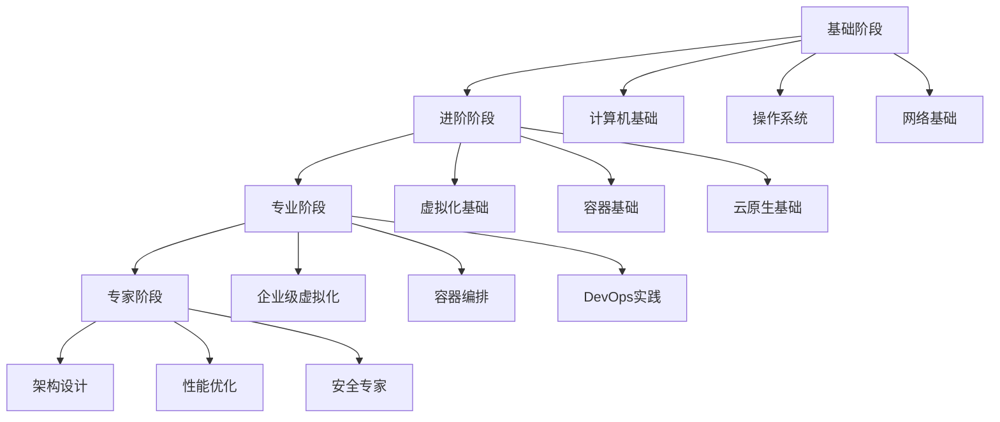

# 技术学习路径规划

## 概述

本文档为虚拟化和容器化技术学习者提供系统化的学习路径规划，包括基础知识、进阶技能、专业认证和实践项目，帮助学习者建立完整的技术知识体系。

## 目录

- [技术学习路径规划](#技术学习路径规划)
  - [概述](#概述)
  - [目录](#目录)
  - [1. 学习路径总览](#1-学习路径总览)
    - [1.1 学习阶段划分](#11-学习阶段划分)
    - [1.2 学习时间规划](#12-学习时间规划)
  - [2. 基础阶段学习路径](#2-基础阶段学习路径)
    - [2.1 计算机基础](#21-计算机基础)
      - [2.1.1 计算机组成原理](#211-计算机组成原理)
      - [2.1.2 操作系统原理](#212-操作系统原理)
      - [2.1.3 网络基础](#213-网络基础)
    - [2.2 编程基础](#22-编程基础)
      - [2.2.1 编程语言](#221-编程语言)
      - [2.2.2 数据结构与算法](#222-数据结构与算法)
  - [3. 进阶阶段学习路径](#3-进阶阶段学习路径)
    - [3.1 虚拟化技术](#31-虚拟化技术)
      - [3.1.1 虚拟化基础](#311-虚拟化基础)
      - [3.1.2 VMware vSphere](#312-vmware-vsphere)
      - [3.1.3 其他虚拟化平台](#313-其他虚拟化平台)
    - [3.2 容器技术](#32-容器技术)
      - [3.2.1 Docker基础](#321-docker基础)
      - [3.2.2 容器编排](#322-容器编排)
      - [3.2.3 云原生技术](#323-云原生技术)
  - [4. 专业阶段学习路径](#4-专业阶段学习路径)
    - [4.1 企业级应用](#41-企业级应用)
      - [4.1.1 企业架构设计](#411-企业架构设计)
      - [4.1.2 性能优化](#412-性能优化)
      - [4.1.3 安全专家](#413-安全专家)
    - [4.2 DevOps实践](#42-devops实践)
      - [4.2.1 CI/CD流水线](#421-cicd流水线)
      - [4.2.2 基础设施即代码](#422-基础设施即代码)
      - [4.2.3 监控和运维](#423-监控和运维)
  - [5. 认证体系](#5-认证体系)
    - [5.1 虚拟化认证](#51-虚拟化认证)
      - [5.1.1 VMware认证](#511-vmware认证)
      - [5.1.2 Microsoft认证](#512-microsoft认证)
      - [5.1.3 Red Hat认证](#513-red-hat认证)
    - [5.2 容器认证](#52-容器认证)
      - [5.2.1 Docker认证](#521-docker认证)
      - [5.2.2 Kubernetes认证](#522-kubernetes认证)
      - [5.2.3 CNCF认证](#523-cncf认证)
    - [5.3 云平台认证](#53-云平台认证)
      - [5.3.1 AWS认证](#531-aws认证)
      - [5.3.2 Azure认证](#532-azure认证)
      - [5.3.3 Google Cloud认证](#533-google-cloud认证)
  - [6. 实践项目建议](#6-实践项目建议)
    - [6.1 基础项目](#61-基础项目)
      - [6.1.1 虚拟化项目](#611-虚拟化项目)
      - [6.1.2 容器项目](#612-容器项目)
    - [6.2 进阶项目](#62-进阶项目)
      - [6.2.1 Kubernetes项目](#621-kubernetes项目)
      - [6.2.2 DevOps项目](#622-devops项目)
    - [6.3 高级项目](#63-高级项目)
      - [6.3.1 企业级项目](#631-企业级项目)
  - [7. 学习资源推荐](#7-学习资源推荐)
    - [7.1 在线课程](#71-在线课程)
      - [7.1.1 免费课程](#711-免费课程)
      - [7.1.2 付费课程](#712-付费课程)
    - [7.2 技术书籍](#72-技术书籍)
      - [7.2.1 基础书籍](#721-基础书籍)
      - [7.2.2 专业书籍](#722-专业书籍)
    - [7.3 技术社区](#73-技术社区)
      - [7.3.1 开源社区](#731-开源社区)
      - [7.3.2 专业社区](#732-专业社区)
  - [8. 学习计划制定](#8-学习计划制定)
    - [8.1 个人学习计划](#81-个人学习计划)
      - [8.1.1 目标设定](#811-目标设定)
      - [8.1.2 时间安排](#812-时间安排)
      - [8.1.3 进度跟踪](#813-进度跟踪)
    - [8.2 团队学习计划](#82-团队学习计划)
      - [8.2.1 团队培训](#821-团队培训)
      - [8.2.2 知识管理](#822-知识管理)
  - [9. 总结](#9-总结)

## 1. 学习路径总览

### 1.1 学习阶段划分

### 1.2 学习时间规划

| 阶段 | 学习时间 | 主要内容 | 目标 |
|------|----------|----------|------|
| 基础阶段 | 3-6个月 | 计算机基础、操作系统、网络 | 掌握基础概念 |
| 进阶阶段 | 6-12个月 | 虚拟化、容器、云原生 | 掌握核心技术 |
| 专业阶段 | 12-18个月 | 企业级应用、DevOps | 具备实战能力 |
| 专家阶段 | 18-24个月 | 架构设计、性能优化 | 成为技术专家 |

## 2. 基础阶段学习路径

### 2.1 计算机基础

#### 2.1.1 计算机组成原理

**学习内容**:

- CPU架构和指令集
- 内存层次结构
- 存储系统
- I/O系统
- 总线系统

**学习资源**:

- 《计算机组成原理》- 唐朔飞
- 《深入理解计算机系统》- Randal E. Bryant
- MIT 6.004课程

**实践项目**:

- 搭建简单的CPU模拟器
- 分析内存访问模式
- 优化I/O性能

#### 2.1.2 操作系统原理

**学习内容**:

- 进程和线程管理
- 内存管理
- 文件系统
- 设备管理
- 系统调用

**学习资源**:

- 《操作系统概念》- Abraham Silberschatz
- 《现代操作系统》- Andrew S. Tanenbaum
- MIT 6.828课程

**实践项目**:

- 实现简单的操作系统内核
- 分析进程调度算法
- 优化内存管理

#### 2.1.3 网络基础

**学习内容**:

- OSI七层模型
- TCP/IP协议栈
- 网络设备
- 网络安全
- 网络编程

**学习资源**:

- 《计算机网络》- 谢希仁
- 《TCP/IP详解》- W. Richard Stevens
- Stanford CS144课程

**实践项目**:

- 实现简单的网络协议
- 搭建网络实验环境
- 分析网络性能

### 2.2 编程基础

#### 2.2.1 编程语言

**推荐语言**:

- **Python**: 自动化脚本、DevOps工具
- **Go**: 容器技术、云原生应用
- **Java**: 企业级应用开发
- **Shell**: 系统管理和自动化

**学习路径**:

1. 选择一门主要语言深入学习
2. 学习其他语言作为补充
3. 掌握脚本编程
4. 学习函数式编程

#### 2.2.2 数据结构与算法

**学习内容**:

- 基本数据结构
- 算法设计
- 复杂度分析
- 算法优化

**学习资源**:

- 《算法导论》- Thomas H. Cormen
- LeetCode在线练习
- 《编程珠玑》- Jon Bentley

## 3. 进阶阶段学习路径

### 3.1 虚拟化技术

#### 3.1.1 虚拟化基础

**学习内容**:

- 虚拟化概念和分类
- 硬件虚拟化支持
- 虚拟化架构
- 性能优化

**学习资源**:

- 《虚拟化技术原理与实现》
- VMware官方文档
- Intel VT-x技术文档

**实践项目**:

- 搭建KVM虚拟化环境
- 配置虚拟机高可用
- 优化虚拟化性能

#### 3.1.2 VMware vSphere

**学习内容**:

- ESXi安装和配置
- vCenter Server管理
- 虚拟网络和存储
- 高可用性和容错

**学习资源**:

- VMware官方培训课程
- 《VMware vSphere 6.7实战指南》
- VMware Hands-on Labs

**实践项目**:

- 部署vSphere环境
- 配置DRS和HA
- 实施备份和恢复

#### 3.1.3 其他虚拟化平台

**学习内容**:

- Microsoft Hyper-V
- Citrix XenServer
- Red Hat Virtualization
- OpenStack

**学习资源**:

- 各厂商官方文档
- 开源项目文档
- 技术社区资源

### 3.2 容器技术

#### 3.2.1 Docker基础

**学习内容**:

- 容器概念和原理
- Docker安装和配置
- 镜像构建和管理
- 容器网络和存储

**学习资源**:

- Docker官方文档
- 《Docker技术入门与实战》
- Docker官方培训

**实践项目**:

- 构建Docker镜像
- 部署多容器应用
- 配置容器网络

#### 3.2.2 容器编排

**学习内容**:

- Kubernetes基础概念
- Pod、Service、Deployment
- 配置管理和存储
- 网络和服务发现

**学习资源**:

- Kubernetes官方文档
- 《Kubernetes权威指南》
- CNCF官方培训

**实践项目**:

- 部署Kubernetes集群
- 部署微服务应用
- 配置监控和日志

#### 3.2.3 云原生技术

**学习内容**:

- 云原生概念
- 微服务架构
- 服务网格
- 无服务器计算

**学习资源**:

- CNCF官方文档
- 《云原生应用架构实践指南》
- 云原生技术社区

**实践项目**:

- 构建云原生应用
- 实施微服务架构
- 配置服务网格

## 4. 专业阶段学习路径

### 4.1 企业级应用

#### 4.1.1 企业架构设计

**学习内容**:

- 企业架构方法论
- 技术架构设计
- 数据架构设计
- 安全架构设计

**学习资源**:

- 《企业架构实践指南》
- TOGAF框架
- 企业架构最佳实践

**实践项目**:

- 设计企业技术架构
- 制定技术标准
- 实施架构治理

#### 4.1.2 性能优化

**学习内容**:

- 性能分析方法
- 系统性能调优
- 应用性能优化
- 数据库性能优化

**学习资源**:

- 《性能之巅》
- 《系统性能调优》
- 性能优化最佳实践

**实践项目**:

- 性能测试和分析
- 系统性能调优
- 性能监控和告警

#### 4.1.3 安全专家

**学习内容**:

- 信息安全基础
- 网络安全
- 应用安全
- 数据安全

**学习资源**:

- 《信息安全原理与实践》
- CISSP认证课程
- 安全技术社区

**实践项目**:

- 安全风险评估
- 安全策略制定
- 安全事件响应

### 4.2 DevOps实践

#### 4.2.1 CI/CD流水线

**学习内容**:

- 持续集成概念
- 持续部署实践
- 自动化测试
- 部署策略

**学习资源**:

- 《持续交付》
- 《DevOps实践指南》
- Jenkins官方文档

**实践项目**:

- 搭建CI/CD流水线
- 实施自动化测试
- 配置部署策略

#### 4.2.2 基础设施即代码

**学习内容**:

- Infrastructure as Code概念
- Terraform使用
- Ansible自动化
- 配置管理

**学习资源**:

- 《Infrastructure as Code》
- Terraform官方文档
- Ansible官方文档

**实践项目**:

- 使用Terraform管理基础设施
- 使用Ansible自动化配置
- 实施配置管理

#### 4.2.3 监控和运维

**学习内容**:

- 监控体系设计
- 日志管理
- 告警机制
- 故障处理

**学习资源**:

- 《监控的艺术》
- Prometheus官方文档
- ELK Stack文档

**实践项目**:

- 搭建监控体系
- 配置日志收集
- 实施告警机制

## 5. 认证体系

### 5.1 虚拟化认证

#### 5.1.1 VMware认证

**VCP (VMware Certified Professional)**:

- VCP-DCV: 数据中心虚拟化
- VCP-NV: 网络虚拟化
- VCP-CMA: 云管理和自动化

**VCAP (VMware Certified Advanced Professional)**:

- VCAP-DCV Design: 数据中心虚拟化设计
- VCAP-DCV Deploy: 数据中心虚拟化部署

**VCIX (VMware Certified Implementation Expert)**:

- VCIX-DCV: 数据中心虚拟化专家

#### 5.1.2 Microsoft认证

**MCSA (Microsoft Certified Solutions Associate)**:

- MCSA: Windows Server 2016
- MCSA: Cloud Platform

**MCSE (Microsoft Certified Solutions Expert)**:

- MCSE: Cloud Platform and Infrastructure

#### 5.1.3 Red Hat认证

**RHCSA (Red Hat Certified System Administrator)**:

- 系统管理基础

**RHCE (Red Hat Certified Engineer)**:

- 系统管理进阶

**RHCA (Red Hat Certified Architect)**:

- 系统架构师

### 5.2 容器认证

#### 5.2.1 Docker认证

**DCA (Docker Certified Associate)**:

- Docker基础认证

**DCE (Docker Certified Engineer)**:

- Docker工程师认证

#### 5.2.2 Kubernetes认证

**CKA (Certified Kubernetes Administrator)**:

- Kubernetes管理员认证

**CKAD (Certified Kubernetes Application Developer)**:

- Kubernetes应用开发者认证

**CKS (Certified Kubernetes Security Specialist)**:

- Kubernetes安全专家认证

#### 5.2.3 CNCF认证

**CNCF认证项目**:

- Prometheus认证
- Envoy认证
- Fluentd认证

### 5.3 云平台认证

#### 5.3.1 AWS认证

**AWS Certified Solutions Architect**:

- Associate级别
- Professional级别

**AWS Certified DevOps Engineer**:

- Professional级别

#### 5.3.2 Azure认证

**Microsoft Azure Solutions Architect**:

- Expert级别

**Microsoft Azure DevOps Engineer**:

- Expert级别

#### 5.3.3 Google Cloud认证

**Google Cloud Professional Cloud Architect**:

- 云架构师认证

**Google Cloud Professional DevOps Engineer**:

- DevOps工程师认证

## 6. 实践项目建议

### 6.1 基础项目

#### 6.1.1 虚拟化项目

**项目1: 搭建虚拟化环境**:

- 目标: 掌握虚拟化基础
- 内容: 安装和配置KVM/vSphere
- 时间: 2-4周
- 成果: 可运行的虚拟化环境

**项目2: 虚拟机管理**:

- 目标: 掌握虚拟机管理
- 内容: 创建、配置、迁移虚拟机
- 时间: 2-3周
- 成果: 自动化虚拟机管理脚本

#### 6.1.2 容器项目

**项目1: Docker应用部署**:

- 目标: 掌握Docker基础
- 内容: 容器化Web应用
- 时间: 1-2周
- 成果: 容器化的Web应用

**项目2: 多容器应用**:

- 目标: 掌握容器编排
- 内容: 使用Docker Compose部署多容器应用
- 时间: 2-3周
- 成果: 完整的多容器应用

### 6.2 进阶项目

#### 6.2.1 Kubernetes项目

**项目1: Kubernetes集群部署**:

- 目标: 掌握Kubernetes基础
- 内容: 部署和管理Kubernetes集群
- 时间: 3-4周
- 成果: 可用的Kubernetes集群

**项目2: 微服务应用部署**:

- 目标: 掌握微服务架构
- 内容: 在Kubernetes上部署微服务应用
- 时间: 4-6周
- 成果: 完整的微服务应用

#### 6.2.2 DevOps项目

**项目1: CI/CD流水线**:

- 目标: 掌握DevOps实践
- 内容: 搭建完整的CI/CD流水线
- 时间: 4-6周
- 成果: 自动化CI/CD流水线

**项目2: 基础设施即代码**:

- 目标: 掌握IaC实践
- 内容: 使用Terraform管理基础设施
- 时间: 3-4周
- 成果: 基础设施自动化管理

### 6.3 高级项目

#### 6.3.1 企业级项目

**项目1: 混合云架构**:

- 目标: 掌握企业级架构
- 内容: 设计混合云架构
- 时间: 8-12周
- 成果: 完整的混合云解决方案

**项目2: 云原生平台**:

- 目标: 掌握云原生技术
- 内容: 构建云原生平台
- 时间: 12-16周
- 成果: 企业级云原生平台

## 7. 学习资源推荐

### 7.1 在线课程

#### 7.1.1 免费课程

- **Coursera**: 计算机科学、云计算课程
- **edX**: MIT、Stanford等名校课程
- **Udacity**: 技术实践课程
- **YouTube**: 技术视频教程

#### 7.1.2 付费课程

- **Pluralsight**: 专业技术课程
- **Linux Academy**: Linux和云计算课程
- **A Cloud Guru**: 云平台认证课程
- **VMware Learning**: VMware官方课程

### 7.2 技术书籍

#### 7.2.1 基础书籍

- 《计算机组成原理》
- 《操作系统概念》
- 《计算机网络》
- 《算法导论》

#### 7.2.2 专业书籍

- 《虚拟化技术原理与实现》
- 《Docker技术入门与实战》
- 《Kubernetes权威指南》
- 《云原生应用架构实践指南》

### 7.3 技术社区

#### 7.3.1 开源社区

- **GitHub**: 开源项目和学习资源
- **Stack Overflow**: 技术问答
- **Reddit**: 技术讨论
- **Hacker News**: 技术资讯

#### 7.3.2 专业社区

- **CNCF**: 云原生技术社区
- **VMware Community**: VMware技术社区
- **Docker Community**: Docker技术社区
- **Kubernetes Community**: Kubernetes技术社区

## 8. 学习计划制定

### 8.1 个人学习计划

#### 8.1.1 目标设定

- **短期目标**: 3-6个月掌握基础技能
- **中期目标**: 1-2年成为技术专家
- **长期目标**: 3-5年成为架构师

#### 8.1.2 时间安排

- **每日学习**: 2-3小时
- **周末实践**: 4-6小时
- **项目时间**: 每月1-2个项目

#### 8.1.3 进度跟踪

- **学习日志**: 记录学习进度
- **技能评估**: 定期技能测试
- **项目展示**: 展示实践成果

### 8.2 团队学习计划

#### 8.2.1 团队培训

- **技术分享**: 定期技术分享会
- **项目实践**: 团队项目实践
- **外部培训**: 参加外部培训课程

#### 8.2.2 知识管理

- **知识库**: 建立团队知识库
- **最佳实践**: 总结最佳实践
- **经验分享**: 分享项目经验

## 9. 总结

技术学习路径规划是成为虚拟化和容器化技术专家的关键。通过系统化的学习路径、实践项目和认证体系，学习者可以：

1. **建立完整知识体系**: 从基础到专业的完整学习路径
2. **获得实战经验**: 通过项目实践积累经验
3. **获得专业认证**: 通过认证证明技能水平
4. **持续学习成长**: 建立持续学习的习惯

关键成功因素：

- **明确目标**: 设定清晰的学习目标
- **系统学习**: 按照学习路径系统学习
- **实践验证**: 通过项目实践验证学习效果
- **持续改进**: 根据学习效果调整学习计划

通过科学的学习路径规划，学习者可以高效地掌握虚拟化和容器化技术，成为行业专家。
