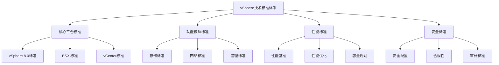

# vSphere技术标准详解

## 目录

- [vSphere技术标准详解](#vsphere技术标准详解)
  - [目录](#目录)
  - [技术标准概述](#技术标准概述)
    - [标准体系架构](#标准体系架构)
    - [标准分类](#标准分类)
      - [1. 技术标准分类](#1-技术标准分类)
      - [2. 标准级别分类](#2-标准级别分类)
  - [vSphere核心标准](#vsphere核心标准)
    - [vSphere 8.0技术标准](#vsphere-80技术标准)
      - [1. 架构标准](#1-架构标准)
      - [2. 部署标准](#2-部署标准)
    - [ESXi技术标准](#esxi技术标准)
      - [1. 系统标准](#1-系统标准)
      - [2. 安全标准](#2-安全标准)
    - [vCenter Server技术标准](#vcenter-server技术标准)
      - [1. 架构标准1](#1-架构标准1)
      - [2. 管理标准](#2-管理标准)
  - [存储技术标准](#存储技术标准)
    - [vSAN技术标准](#vsan技术标准)
      - [1. 架构标准2](#1-架构标准2)
      - [2. 性能标准](#2-性能标准)
    - [存储性能标准](#存储性能标准)
      - [1. 性能指标标准](#1-性能指标标准)
  - [网络技术标准](#网络技术标准)
    - [NSX技术标准](#nsx技术标准)
      - [1. 架构标准3](#1-架构标准3)
      - [2. 安全标准3](#2-安全标准3)
  - [安全技术标准](#安全技术标准)
    - [安全配置标准](#安全配置标准)
      - [1. 基础安全标准](#1-基础安全标准)
      - [2. 数据保护标准](#2-数据保护标准)
  - [性能技术标准](#性能技术标准)
    - [性能基准标准](#性能基准标准)
      - [1. 系统性能标准](#1-系统性能标准)
      - [2. 存储性能标准](#2-存储性能标准)
  - [国际标准对标](#国际标准对标)
    - [ISO标准对标](#iso标准对标)
      - [1. ISO/IEC 27001对标](#1-isoiec-27001对标)
      - [2. ISO/IEC 20000对标](#2-isoiec-20000对标)
    - [NIST标准对标](#nist标准对标)
      - [1. NIST SP 800-53对标](#1-nist-sp-800-53对标)
    - [CIS基准对标](#cis基准对标)
      - [1. CIS vSphere基准](#1-cis-vsphere基准)
  - [标准实施指南](#标准实施指南)
    - [标准实施流程](#标准实施流程)
      - [1. 实施阶段](#1-实施阶段)
      - [2. 实施方法](#2-实施方法)
    - [标准验证方法](#标准验证方法)
      - [1. 验证工具](#1-验证工具)
  - [最佳实践标准](#最佳实践标准)
    - [部署最佳实践](#部署最佳实践)
      - [1. 架构设计最佳实践](#1-架构设计最佳实践)
      - [2. 配置最佳实践](#2-配置最佳实践)
    - [运维最佳实践](#运维最佳实践)
      - [1. 监控最佳实践](#1-监控最佳实践)
      - [2. 维护最佳实践](#2-维护最佳实践)
  - [标准更新与维护](#标准更新与维护)
    - [标准版本管理](#标准版本管理)
      - [1. 版本控制](#1-版本控制)
      - [2. 变更管理](#2-变更管理)
    - [标准持续改进](#标准持续改进)
      - [1. 改进流程](#1-改进流程)

## 技术标准概述

### 标准体系架构



### 标准分类

#### 1. 技术标准分类

- **平台标准**: vSphere核心平台技术标准
- **功能标准**: 各功能模块技术标准
- **性能标准**: 性能基准和优化标准
- **安全标准**: 安全配置和合规标准
- **管理标准**: 运维管理标准

#### 2. 标准级别分类

- **企业级标准**: 大型企业应用标准
- **行业级标准**: 特定行业应用标准
- **国际级标准**: 国际通用技术标准
- **最佳实践标准**: 业界最佳实践标准

## vSphere核心标准

### vSphere 8.0技术标准

#### 1. 架构标准

```yaml
vsphere_8_architecture_standards:
  # 硬件要求标准
  hardware_requirements:
    cpu:
      minimum_cores: 2
      recommended_cores: 8
      architecture: "x86_64"
      virtualization_support: "Intel VT-x/AMD-V"
    
    memory:
      minimum_gb: 8
      recommended_gb: 32
      maximum_gb: 6144
    
    storage:
      minimum_gb: 100
      recommended_gb: 500
      supported_types: ["SATA", "SAS", "NVMe", "SSD"]
    
    network:
      minimum_ports: 1
      recommended_ports: 4
      supported_speeds: ["1Gb", "10Gb", "25Gb", "100Gb"]
  
  # 软件要求标准
  software_requirements:
    hypervisor:
      version: "8.0"
      build: "21495797"
      architecture: "x86_64"
    
    management:
      vcenter_version: "8.0"
      client_tools: "vSphere Client 8.0"
      api_version: "8.0"
```

#### 2. 部署标准

```yaml
vsphere_8_deployment_standards:
  # 安装标准
  installation_standards:
    esxi_installation:
      method: "ISO/USB"
      network_config: "DHCP/Static"
      storage_config: "Local/Network"
      security_config: "Lockdown Mode"
    
    vcenter_installation:
      deployment_type: "vCenter Server Appliance"
      database: "Embedded PostgreSQL"
      storage: "Thin Provisioned"
      network: "Management Network"
  
  # 配置标准
  configuration_standards:
    cluster_config:
      ha_enabled: true
      drs_enabled: true
      evc_enabled: true
      admission_control: "Host Failures"
    
    resource_pools:
      cpu_shares: "Normal"
      memory_shares: "Normal"
      cpu_reservation: 0
      memory_reservation: 0
```

### ESXi技术标准

#### 1. 系统标准

```yaml
esxi_system_standards:
  # 系统配置标准
  system_configuration:
    time_synchronization:
      ntp_servers: ["pool.ntp.org", "time.nist.gov"]
      timezone: "UTC"
      sync_interval: 60
    
    logging:
      log_level: "Info"
      log_retention: 30
      remote_logging: true
      syslog_server: "centralized-syslog"
    
    security:
      lockdown_mode: "Normal"
      firewall_rules: "Minimal"
      ssl_certificates: "Valid"
      password_policy: "Complex"
  
  # 性能标准
  performance_standards:
    cpu_utilization:
      normal_range: "0-70%"
      warning_threshold: "80%"
      critical_threshold: "90%"
    
    memory_utilization:
      normal_range: "0-80%"
      warning_threshold: "85%"
      critical_threshold: "95%"
    
    storage_io:
      normal_latency: "< 20ms"
      warning_latency: "20-50ms"
      critical_latency: "> 50ms"
```

#### 2. 安全标准

```yaml
esxi_security_standards:
  # 访问控制标准
  access_control:
    local_users: "Disabled"
    root_access: "Restricted"
    ssh_access: "Disabled"
    console_access: "Restricted"
    
  # 网络安全标准
  network_security:
    firewall:
      default_policy: "Deny"
      allowed_services: ["SSH", "HTTPS", "NTP"]
      blocked_ports: ["Telnet", "FTP", "HTTP"]
    
    ssl_tls:
      minimum_version: "TLS 1.2"
      cipher_suites: "Strong"
      certificate_validation: "Required"
  
  # 数据保护标准
  data_protection:
    encryption:
      at_rest: "AES-256"
      in_transit: "TLS 1.3"
      key_management: "Centralized"
    
    backup:
      configuration_backup: "Daily"
      retention_period: "30 days"
      offsite_storage: "Required"
```

### vCenter Server技术标准

#### 1. 架构标准1

```yaml
vcenter_architecture_standards:
  # 部署架构标准
  deployment_architecture:
    single_site:
      vcenter_instances: 1
      database: "Embedded PostgreSQL"
      storage: "Local Storage"
      network: "Single Network"
    
    multi_site:
      vcenter_instances: "Multiple"
      database: "External Database"
      storage: "Shared Storage"
      network: "Multiple Networks"
  
  # 高可用标准
  high_availability:
    vcenter_ha:
      enabled: true
      failover_time: "< 5 minutes"
      data_replication: "Synchronous"
      witness_host: "Required"
    
    database_ha:
      clustering: "Active-Passive"
      failover_time: "< 2 minutes"
      backup_strategy: "Continuous"
```

#### 2. 管理标准

```yaml
vcenter_management_standards:
  # 用户管理标准
  user_management:
    authentication:
      method: "Active Directory"
      sso_enabled: true
      mfa_enabled: true
      session_timeout: 30
    
    authorization:
      role_based: true
      least_privilege: true
      audit_logging: true
      permission_review: "Quarterly"
  
  # 监控标准
  monitoring_standards:
    performance_monitoring:
      collection_interval: 20
      retention_period: 365
      alert_thresholds: "Defined"
      reporting: "Automated"
    
    health_monitoring:
      service_health: "Continuous"
      database_health: "Continuous"
      storage_health: "Continuous"
      network_health: "Continuous"
```

## 存储技术标准

### vSAN技术标准

#### 1. 架构标准2

```yaml
vsan_architecture_standards:
  # 硬件要求标准
  hardware_requirements:
    minimum_hosts: 3
    recommended_hosts: 6
    cpu_cores: 8
    memory_gb: 32
    storage_capacity: "10TB per host"
    
    disk_requirements:
      cache_tier: "SSD"
      capacity_tier: "SSD/HDD"
      cache_ratio: "10%"
      capacity_ratio: "90%"
  
  # 网络要求标准
  network_requirements:
    vsan_network:
      bandwidth: "10Gb"
      latency: "< 1ms"
      redundancy: "Multiple NICs"
      isolation: "Dedicated VLAN"
    
    management_network:
      bandwidth: "1Gb"
      redundancy: "Multiple NICs"
      isolation: "Separate VLAN"
```

#### 2. 性能标准

```yaml
vsan_performance_standards:
  # 性能基准标准
  performance_benchmarks:
    read_iops:
      all_flash: "100,000+"
      hybrid: "50,000+"
      hdd: "10,000+"
    
    write_iops:
      all_flash: "50,000+"
      hybrid: "25,000+"
      hdd: "5,000+"
    
    latency:
      read_latency: "< 1ms"
      write_latency: "< 2ms"
      rebuild_latency: "< 5ms"
  
  # 容量标准
  capacity_standards:
    utilization:
      normal_range: "0-70%"
      warning_threshold: "80%"
      critical_threshold: "90%"
    
    thin_provisioning:
      overcommit_ratio: "2:1"
      monitoring: "Continuous"
      alerting: "Automated"
```

### 存储性能标准

#### 1. 性能指标标准

```yaml
storage_performance_standards:
  # IOPS标准
  iops_standards:
    database_workloads:
      read_iops: "10,000+"
      write_iops: "5,000+"
      mixed_iops: "7,500+"
    
    web_workloads:
      read_iops: "5,000+"
      write_iops: "2,500+"
      mixed_iops: "3,750+"
    
    file_workloads:
      read_iops: "2,500+"
      write_iops: "1,250+"
      mixed_iops: "1,875+"
  
  # 延迟标准
  latency_standards:
    database_workloads:
      read_latency: "< 5ms"
      write_latency: "< 10ms"
      mixed_latency: "< 7ms"
    
    web_workloads:
      read_latency: "< 10ms"
      write_latency: "< 20ms"
      mixed_latency: "< 15ms"
    
    file_workloads:
      read_latency: "< 20ms"
      write_latency: "< 40ms"
      mixed_latency: "< 30ms"
```

## 网络技术标准

### NSX技术标准

#### 1. 架构标准3

```yaml
nsx_architecture_standards:
  # 部署架构标准
  deployment_architecture:
    management_cluster:
      minimum_hosts: 3
      recommended_hosts: 6
      cpu_cores: 8
      memory_gb: 32
      storage_gb: 100
    
    edge_cluster:
      minimum_hosts: 2
      recommended_hosts: 4
      cpu_cores: 4
      memory_gb: 16
      storage_gb: 50
  
  # 网络要求标准
  network_requirements:
    management_network:
      bandwidth: "1Gb"
      redundancy: "Multiple NICs"
      isolation: "Dedicated VLAN"
    
    overlay_network:
      bandwidth: "10Gb"
      redundancy: "Multiple NICs"
      isolation: "Dedicated VLAN"
    
    edge_network:
      bandwidth: "10Gb"
      redundancy: "Multiple NICs"
      isolation: "Dedicated VLAN"
```

#### 2. 安全标准3

```yaml
nsx_security_standards:
  # 微分段标准
  micro_segmentation:
    default_policy: "Deny"
    east_west_traffic: "Controlled"
    north_south_traffic: "Controlled"
    application_isolation: "Required"
  
  # 防火墙标准
  firewall_standards:
    distributed_firewall:
      enabled: true
      rules_engine: "Layer 3/4"
      application_aware: true
      logging: "Enabled"
    
    edge_firewall:
      enabled: true
      rules_engine: "Layer 3/4/7"
      application_aware: true
      logging: "Enabled"
  
  # 负载均衡标准
  load_balancing_standards:
    algorithm: "Round Robin"
    health_check: "Enabled"
    persistence: "Source IP"
    ssl_termination: "Supported"
```

## 安全技术标准

### 安全配置标准

#### 1. 基础安全标准

```yaml
security_configuration_standards:
  # 身份认证标准
  authentication_standards:
    password_policy:
      minimum_length: 12
      complexity: "Required"
      history: 12
      expiration: 90
    
    multi_factor_authentication:
      enabled: true
      method: "TOTP/SMS"
      backup_codes: "Required"
      emergency_access: "Defined"
  
  # 访问控制标准
  access_control_standards:
    role_based_access:
      principle: "Least Privilege"
      role_separation: "Required"
      regular_review: "Quarterly"
      audit_logging: "Enabled"
    
    network_access:
      vpn_required: true
      ip_whitelisting: "Optional"
      session_timeout: 30
      concurrent_sessions: 2
```

#### 2. 数据保护标准

```yaml
data_protection_standards:
  # 加密标准
  encryption_standards:
    data_at_rest:
      algorithm: "AES-256"
      key_management: "Centralized"
      key_rotation: "Annual"
      backup_encryption: "Required"
    
    data_in_transit:
      protocol: "TLS 1.3"
      certificate_validation: "Required"
      perfect_forward_secrecy: "Enabled"
      hsts_enabled: true
  
  # 备份标准
  backup_standards:
    backup_frequency:
      critical_data: "Daily"
      important_data: "Weekly"
      standard_data: "Monthly"
    
    backup_retention:
      local_retention: "30 days"
      offsite_retention: "1 year"
      archive_retention: "7 years"
    
    backup_verification:
      restore_testing: "Monthly"
      integrity_checking: "Daily"
      encryption_verification: "Weekly"
```

## 性能技术标准

### 性能基准标准

#### 1. 系统性能标准

```yaml
system_performance_standards:
  # CPU性能标准
  cpu_performance:
    utilization:
      normal_range: "0-70%"
      warning_threshold: "80%"
      critical_threshold: "90%"
    
    ready_time:
      normal_range: "0-5%"
      warning_threshold: "10%"
      critical_threshold: "20%"
    
    co_stop:
      normal_range: "0-2%"
      warning_threshold: "5%"
      critical_threshold: "10%"
  
  # 内存性能标准
  memory_performance:
    utilization:
      normal_range: "0-80%"
      warning_threshold: "85%"
      critical_threshold: "95%"
    
    balloon_driver:
      enabled: true
      target_percentage: 75
      min_balloon_size: 64
    
    compression:
      enabled: true
      threshold: 80
      max_compression: 50
```

#### 2. 存储性能标准

```yaml
storage_performance_standards:
  # 存储I/O标准
  storage_io:
    read_iops:
      ssd: "10,000+"
      sas: "5,000+"
      sata: "2,500+"
    
    write_iops:
      ssd: "5,000+"
      sas: "2,500+"
      sata: "1,250+"
    
    latency:
      read_latency: "< 20ms"
      write_latency: "< 40ms"
      queue_depth: 32
  
  # 网络I/O标准
  network_io:
    throughput:
      management: "1Gb"
      vmotion: "10Gb"
      storage: "10Gb"
      vm_traffic: "10Gb"
    
    packet_loss:
      normal_range: "0%"
      warning_threshold: "0.1%"
      critical_threshold: "1%"
```

## 国际标准对标

### ISO标准对标

#### 1. ISO/IEC 27001对标

```yaml
iso_27001_mapping:
  # 信息安全管理体系
  information_security_management:
    policy_management:
      iso_requirement: "A.5.1.1"
      vsphere_implementation: "Security Policy Configuration"
      compliance_status: "Compliant"
    
    access_control:
      iso_requirement: "A.9.1.1"
      vsphere_implementation: "Role-Based Access Control"
      compliance_status: "Compliant"
    
    cryptography:
      iso_requirement: "A.10.1.1"
      vsphere_implementation: "Data Encryption"
      compliance_status: "Compliant"
  
  # 风险评估
  risk_assessment:
    asset_management:
      iso_requirement: "A.8.1.1"
      vsphere_implementation: "Asset Inventory"
      compliance_status: "Compliant"
    
    vulnerability_management:
      iso_requirement: "A.12.6.1"
      vsphere_implementation: "Patch Management"
      compliance_status: "Compliant"
```

#### 2. ISO/IEC 20000对标

```yaml
iso_20000_mapping:
  # 服务管理
  service_management:
    service_level_management:
      iso_requirement: "4.1"
      vsphere_implementation: "SLA Monitoring"
      compliance_status: "Compliant"
    
    capacity_management:
      iso_requirement: "4.2"
      vsphere_implementation: "Capacity Planning"
      compliance_status: "Compliant"
    
    availability_management:
      iso_requirement: "4.3"
      vsphere_implementation: "High Availability"
      compliance_status: "Compliant"
```

### NIST标准对标

#### 1. NIST SP 800-53对标

```yaml
nist_800_53_mapping:
  # 访问控制
  access_control:
    ac_1:
      control: "Access Control Policy"
      vsphere_implementation: "RBAC Configuration"
      compliance_status: "Compliant"
    
    ac_2:
      control: "Account Management"
      vsphere_implementation: "User Account Management"
      compliance_status: "Compliant"
    
    ac_3:
      control: "Access Enforcement"
      vsphere_implementation: "Permission Enforcement"
      compliance_status: "Compliant"
  
  # 审计与问责
  audit_accountability:
    au_1:
      control: "Audit Policy"
      vsphere_implementation: "Audit Logging"
      compliance_status: "Compliant"
    
    au_2:
      control: "Audit Events"
      vsphere_implementation: "Event Logging"
      compliance_status: "Compliant"
```

### CIS基准对标

#### 1. CIS vSphere基准

```yaml
cis_vsphere_benchmark:
  # ESXi基准
  esxi_benchmark:
    level_1:
      description: "Basic Security Configuration"
      controls: 50
      compliance_status: "Compliant"
    
    level_2:
      description: "Advanced Security Configuration"
      controls: 25
      compliance_status: "Partially Compliant"
  
  # vCenter基准
  vcenter_benchmark:
    level_1:
      description: "Basic Security Configuration"
      controls: 30
      compliance_status: "Compliant"
    
    level_2:
      description: "Advanced Security Configuration"
      controls: 15
      compliance_status: "Partially Compliant"
```

## 标准实施指南

### 标准实施流程

#### 1. 实施阶段

```yaml
standard_implementation_phases:
  # 准备阶段
  preparation_phase:
    duration: "2-4 weeks"
    activities:
      - "标准评估"
      - "差距分析"
      - "实施计划制定"
      - "资源准备"
    
  # 实施阶段
  implementation_phase:
    duration: "8-12 weeks"
    activities:
      - "配置实施"
      - "测试验证"
      - "文档更新"
      - "培训交付"
    
  # 验证阶段
  validation_phase:
    duration: "2-4 weeks"
    activities:
      - "合规性验证"
      - "性能测试"
      - "安全测试"
      - "用户验收"
    
  # 维护阶段
  maintenance_phase:
    duration: "Ongoing"
    activities:
      - "持续监控"
      - "定期审查"
      - "标准更新"
      - "改进优化"
```

#### 2. 实施方法

```yaml
implementation_methodology:
  # 分阶段实施
  phased_approach:
    phase_1:
      scope: "基础配置"
      duration: "4 weeks"
      priority: "High"
    
    phase_2:
      scope: "安全配置"
      duration: "4 weeks"
      priority: "High"
    
    phase_3:
      scope: "性能优化"
      duration: "4 weeks"
      priority: "Medium"
    
    phase_4:
      scope: "高级功能"
      duration: "4 weeks"
      priority: "Low"
  
  # 风险控制
  risk_control:
    rollback_plan: "Defined"
    testing_strategy: "Comprehensive"
    change_management: "Formal"
    communication_plan: "Structured"
```

### 标准验证方法

#### 1. 验证工具

```yaml
validation_tools:
  # 自动化验证
  automated_validation:
    powercli_scripts:
      purpose: "配置验证"
      frequency: "Daily"
      coverage: "100%"
    
    api_validation:
      purpose: "API合规性"
      frequency: "Weekly"
      coverage: "90%"
    
    performance_tools:
      purpose: "性能验证"
      frequency: "Monthly"
      coverage: "80%"
  
  # 手动验证
  manual_validation:
    configuration_review:
      purpose: "配置审查"
      frequency: "Monthly"
      coverage: "100%"
    
    security_assessment:
      purpose: "安全评估"
      frequency: "Quarterly"
      coverage: "100%"
    
    compliance_audit:
      purpose: "合规审计"
      frequency: "Annually"
      coverage: "100%"
```

## 最佳实践标准

### 部署最佳实践

#### 1. 架构设计最佳实践

```yaml
deployment_best_practices:
  # 架构设计
  architecture_design:
    scalability:
      principle: "Horizontal Scaling"
      implementation: "Cluster Design"
      benefits: "Improved Performance"
    
    availability:
      principle: "High Availability"
      implementation: "HA/DRS Configuration"
      benefits: "Reduced Downtime"
    
    security:
      principle: "Defense in Depth"
      implementation: "Multi-layer Security"
      benefits: "Enhanced Security"
  
  # 容量规划
  capacity_planning:
    resource_calculation:
      cpu: "Peak Usage + 20% Buffer"
      memory: "Peak Usage + 30% Buffer"
      storage: "Current Usage + 50% Growth"
    
    growth_planning:
      time_horizon: "3 Years"
      growth_rate: "20% Annually"
      contingency: "25% Additional"
```

#### 2. 配置最佳实践

```yaml
configuration_best_practices:
  # 系统配置
  system_configuration:
    time_synchronization:
      ntp_servers: "Multiple Sources"
      sync_interval: "60 seconds"
      timezone: "UTC"
    
    logging_configuration:
      log_level: "Info"
      retention: "30 days"
      remote_logging: "Enabled"
    
    security_configuration:
      lockdown_mode: "Normal"
      firewall: "Minimal Rules"
      ssl_certificates: "Valid"
  
  # 网络配置
  network_configuration:
    network_separation:
      management: "Dedicated VLAN"
      vmotion: "Dedicated VLAN"
      storage: "Dedicated VLAN"
      vm_traffic: "Dedicated VLAN"
    
    redundancy:
      nic_teaming: "Active-Active"
      failover: "Automatic"
      load_balancing: "Route Based"
```

### 运维最佳实践

#### 1. 监控最佳实践

```yaml
monitoring_best_practices:
  # 性能监控
  performance_monitoring:
    key_metrics:
      cpu: "Utilization, Ready Time"
      memory: "Utilization, Balloon"
      storage: "IOPS, Latency"
      network: "Throughput, Errors"
    
    alerting:
      thresholds: "Defined"
      escalation: "Automated"
      notification: "Multi-channel"
    
    reporting:
      frequency: "Daily/Weekly/Monthly"
      format: "Dashboard/Report"
      distribution: "Automated"
  
  # 健康监控
  health_monitoring:
    system_health:
      services: "All Critical Services"
      hardware: "All Components"
      software: "All Applications"
    
    proactive_monitoring:
      predictive_analysis: "Enabled"
      capacity_planning: "Automated"
      performance_tuning: "Continuous"
```

#### 2. 维护最佳实践

```yaml
maintenance_best_practices:
  # 定期维护
  regular_maintenance:
    patch_management:
      frequency: "Monthly"
      testing: "Pre-production"
      rollback: "Automated"
    
    backup_verification:
      frequency: "Weekly"
      restore_testing: "Monthly"
      offsite_verification: "Quarterly"
    
    security_updates:
      frequency: "As Available"
      testing: "Comprehensive"
      deployment: "Staged"
  
  # 变更管理
  change_management:
    change_process:
      approval: "Required"
      testing: "Mandatory"
      rollback: "Planned"
    
    documentation:
      change_records: "Complete"
      impact_analysis: "Detailed"
      communication: "Structured"
```

## 标准更新与维护

### 标准版本管理

#### 1. 版本控制

```yaml
version_control:
  # 版本策略
  versioning_strategy:
    major_version: "Breaking Changes"
    minor_version: "New Features"
    patch_version: "Bug Fixes"
    
  # 发布周期
  release_cycle:
    major_release: "Annual"
    minor_release: "Quarterly"
    patch_release: "Monthly"
    
  # 兼容性
  compatibility:
    backward_compatibility: "2 Major Versions"
    forward_compatibility: "1 Major Version"
    migration_path: "Documented"
```

#### 2. 变更管理

```yaml
change_management:
  # 变更流程
  change_process:
    request: "Formal Request"
    review: "Technical Review"
    approval: "Stakeholder Approval"
    implementation: "Controlled Deployment"
    
  # 影响评估
  impact_assessment:
    technical_impact: "Assessed"
    business_impact: "Evaluated"
    risk_assessment: "Completed"
    mitigation_plan: "Developed"
```

### 标准持续改进

#### 1. 改进流程

```yaml
continuous_improvement:
  # 反馈收集
  feedback_collection:
    user_feedback: "Regular Surveys"
    technical_feedback: "Expert Reviews"
    industry_feedback: "Standards Bodies"
    
  # 改进实施
  improvement_implementation:
    priority_assessment: "Impact vs Effort"
    resource_allocation: "Planned"
    timeline: "Defined"
    success_metrics: "Measurable"
    
  # 效果评估
  effectiveness_evaluation:
    metrics_collection: "Automated"
    analysis: "Regular"
    reporting: "Structured"
    action_plan: "Updated"
```

---

*本文档提供了vSphere技术标准的全面解析，包括核心标准、国际对标、实施指南等各个方面，为vSphere环境的标准化实施提供了完整的指导框架。*
