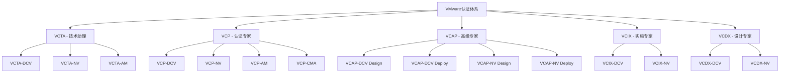

# VMware认证体系详解

## 目录

- [VMware认证体系详解](#vmware认证体系详解)
  - [目录](#目录)
  - [认证体系概述](#认证体系概述)
    - [认证架构](#认证架构)
    - [认证路径](#认证路径)
      - [1. 技术发展路径](#1-技术发展路径)
      - [2. 职业发展路径](#2-职业发展路径)
  - [VCTA认证](#vcta认证)
    - [VCTA-DCV认证](#vcta-dcv认证)
      - [1. 认证概述](#1-认证概述)
      - [2. 考试大纲](#2-考试大纲)
      - [3. 学习资源](#3-学习资源)
    - [VCTA-NV认证](#vcta-nv认证)
      - [1. 认证概述1](#1-认证概述1)
    - [VCTA-AM认证](#vcta-am认证)
      - [1. 认证概述2](#1-认证概述2)
  - [VCP认证](#vcp认证)
    - [VCP-DCV认证](#vcp-dcv认证)
      - [1. 认证概述3](#1-认证概述3)
      - [2. 考试大纲3](#2-考试大纲3)
      - [3. 实践经验要求](#3-实践经验要求)
    - [VCP-NV认证](#vcp-nv认证)
      - [1. 认证概述4](#1-认证概述4)
    - [VCP-AM认证](#vcp-am认证)
      - [1. 认证概述5](#1-认证概述5)
    - [VCP-CMA认证](#vcp-cma认证)
      - [1. 认证概述6](#1-认证概述6)
  - [VCAP认证](#vcap认证)
    - [VCAP-DCV Design认证](#vcap-dcv-design认证)
      - [1. 认证概述7](#1-认证概述7)
      - [2. 考试大纲8](#2-考试大纲8)
    - [VCAP-DCV Deploy认证](#vcap-dcv-deploy认证)
      - [1. 认证概述9](#1-认证概述9)
  - [VCIX认证](#vcix认证)
    - [VCIX-DCV认证](#vcix-dcv认证)
      - [1. 认证概述10](#1-认证概述10)
  - [VCDX认证](#vcdx认证)
    - [VCDX-DCV认证](#vcdx-dcv认证)
      - [1. 认证概述11](#1-认证概述11)
      - [2. 认证流程](#2-认证流程)
  - [认证准备指南](#认证准备指南)
    - [学习资源](#学习资源)
      - [1. 官方学习资源](#1-官方学习资源)
      - [2. 第三方学习资源](#2-第三方学习资源)
    - [实践经验](#实践经验)
      - [1. 实验室环境](#1-实验室环境)
      - [2. 实践场景](#2-实践场景)
    - [考试策略](#考试策略)
      - [1. 考试准备策略](#1-考试准备策略)
      - [2. 考试技巧](#2-考试技巧)
  - [认证维护](#认证维护)
    - [持续教育](#持续教育)
      - [1. 持续教育要求](#1-持续教育要求)
      - [2. 持续教育资源](#2-持续教育资源)
    - [认证更新](#认证更新)
      - [1. 认证更新流程](#1-认证更新流程)
      - [2. 认证升级路径](#2-认证升级路径)
  - [职业发展路径](#职业发展路径)
    - [技术路径](#技术路径)
      - [1. 技术专家发展路径](#1-技术专家发展路径)
    - [管理路径](#管理路径)
      - [1. 管理发展路径](#1-管理发展路径)
    - [架构师路径](#架构师路径)
      - [1. 架构师发展路径](#1-架构师发展路径)

## 认证体系概述

### 认证架构



### 认证路径

#### 1. 技术发展路径

```yaml
certification_paths:
  # 数据中心虚拟化路径
  datacenter_virtualization:
    entry_level:
      certification: "VCTA-DCV"
      experience: "0-1 years"
      focus: "基础操作"
    
    professional_level:
      certification: "VCP-DCV"
      experience: "1-3 years"
      focus: "系统管理"
    
    advanced_level:
      certification: "VCAP-DCV Design/Deploy"
      experience: "3-5 years"
      focus: "架构设计"
    
    expert_level:
      certification: "VCIX-DCV"
      experience: "5+ years"
      focus: "复杂实施"
    
    master_level:
      certification: "VCDX-DCV"
      experience: "7+ years"
      focus: "企业架构"
  
  # 网络虚拟化路径
  network_virtualization:
    entry_level:
      certification: "VCTA-NV"
      experience: "0-1 years"
      focus: "网络基础"
    
    professional_level:
      certification: "VCP-NV"
      experience: "1-3 years"
      focus: "网络管理"
    
    advanced_level:
      certification: "VCAP-NV Design/Deploy"
      experience: "3-5 years"
      focus: "网络架构"
    
    expert_level:
      certification: "VCIX-NV"
      experience: "5+ years"
      focus: "复杂网络"
    
    master_level:
      certification: "VCDX-NV"
      experience: "7+ years"
      focus: "网络架构"
```

#### 2. 职业发展路径

```yaml
career_development_paths:
  # 技术专家路径
  technical_expert:
    junior_admin:
      certifications: ["VCTA-DCV", "VCP-DCV"]
      skills: ["基础管理", "故障排除"]
      salary_range: "$50K-$70K"
    
    senior_admin:
      certifications: ["VCP-DCV", "VCAP-DCV Deploy"]
      skills: ["高级管理", "性能优化"]
      salary_range: "$70K-$90K"
    
    architect:
      certifications: ["VCAP-DCV Design", "VCIX-DCV"]
      skills: ["架构设计", "技术选型"]
      salary_range: "$90K-$120K"
    
    principal_architect:
      certifications: ["VCDX-DCV"]
      skills: ["企业架构", "技术领导"]
      salary_range: "$120K+"
  
  # 管理路径
  management_path:
    team_lead:
      certifications: ["VCP-DCV", "VCP-NV"]
      skills: ["团队管理", "项目管理"]
      salary_range: "$80K-$100K"
    
    manager:
      certifications: ["VCAP-DCV Design", "VCP-AM"]
      skills: ["部门管理", "战略规划"]
      salary_range: "$100K-$130K"
    
    director:
      certifications: ["VCDX-DCV", "VCP-CMA"]
      skills: ["组织管理", "业务战略"]
      salary_range: "$130K+"
```

## VCTA认证

### VCTA-DCV认证

#### 1. 认证概述

```yaml
vcta_dcv_overview:
  # 认证信息
  certification_info:
    full_name: "VMware Certified Technical Associate - Data Center Virtualization"
    exam_code: "1V0-21.20"
    duration: "105 minutes"
    questions: "70 questions"
    passing_score: "300/500"
    language: "English"
    
  # 认证目标
  certification_objectives:
    target_audience:
      - "虚拟化初学者"
      - "IT支持人员"
      - "系统管理员"
      - "技术销售"
    
    skills_validated:
      - "vSphere基础概念"
      - "ESXi主机管理"
      - "虚拟机操作"
      - "基础故障排除"
```

#### 2. 考试大纲

```yaml
vcta_dcv_exam_outline:
  # 考试领域
  exam_domains:
    domain_1:
      name: "vSphere架构和产品"
      weight: "15%"
      topics:
        - "vSphere组件概述"
        - "ESXi架构"
        - "vCenter Server功能"
        - "许可证管理"
    
    domain_2:
      name: "ESXi主机管理"
      weight: "25%"
      topics:
        - "ESXi安装和配置"
        - "主机配置管理"
        - "用户访问管理"
        - "主机维护操作"
    
    domain_3:
      name: "vCenter Server管理"
      weight: "20%"
      topics:
        - "vCenter Server部署"
        - "数据中心和集群管理"
        - "主机添加和管理"
        - "vCenter Server维护"
    
    domain_4:
      name: "虚拟机管理"
      weight: "25%"
      topics:
        - "虚拟机创建和配置"
        - "虚拟机操作"
        - "虚拟机模板管理"
        - "虚拟机快照管理"
    
    domain_5:
      name: "网络和存储基础"
      weight: "15%"
      topics:
        - "虚拟网络基础"
        - "存储基础概念"
        - "数据存储管理"
        - "基础性能监控"
```

#### 3. 学习资源

```yaml
vcta_dcv_learning_resources:
  # 官方资源
  official_resources:
    training_courses:
      - "VMware vSphere: Install, Configure, Manage [V8]"
      - "VMware vSphere: Fast Track [V8]"
    
    documentation:
      - "vSphere 8.0 Documentation"
      - "ESXi 8.0 Documentation"
      - "vCenter Server 8.0 Documentation"
    
    hands_on_labs:
      - "VMware Hands-on Labs"
      - "VMware Learning Platform"
  
  # 第三方资源
  third_party_resources:
    books:
      - "Mastering VMware vSphere 8.0"
      - "VMware vSphere 8.0 Administration Guide"
    
    online_courses:
      - "Pluralsight VMware Courses"
      - "Udemy VMware Courses"
    
    practice_exams:
      - "VMware Practice Exams"
      - "Third-party Practice Tests"
```

### VCTA-NV认证

#### 1. 认证概述1

```yaml
vcta_nv_overview:
  # 认证信息
  certification_info:
    full_name: "VMware Certified Technical Associate - Network Virtualization"
    exam_code: "1V0-41.20"
    duration: "105 minutes"
    questions: "70 questions"
    passing_score: "300/500"
    language: "English"
    
  # 认证目标
  certification_objectives:
    target_audience:
      - "网络管理员"
      - "虚拟化管理员"
      - "安全管理员"
      - "技术销售"
    
    skills_validated:
      - "NSX基础概念"
      - "网络虚拟化基础"
      - "安全策略配置"
      - "基础故障排除"
```

### VCTA-AM认证

#### 1. 认证概述2

```yaml
vcta_am_overview:
  # 认证信息
  certification_info:
    full_name: "VMware Certified Technical Associate - Application Modernization"
    exam_code: "1V0-31.20"
    duration: "105 minutes"
    questions: "70 questions"
    passing_score: "300/500"
    language: "English"
    
  # 认证目标
  certification_objectives:
    target_audience:
      - "应用开发者"
      - "DevOps工程师"
      - "云原生管理员"
      - "技术销售"
    
    skills_validated:
      - "Kubernetes基础"
      - "容器技术"
      - "Tanzu平台"
      - "云原生应用"
```

## VCP认证

### VCP-DCV认证

#### 1. 认证概述3

```yaml
vcp_dcv_overview:
  # 认证信息
  certification_info:
    full_name: "VMware Certified Professional - Data Center Virtualization"
    exam_code: "2V0-21.23"
    duration: "135 minutes"
    questions: "70 questions"
    passing_score: "300/500"
    language: "English"
    prerequisites: "VCTA-DCV or Training Course"
    
  # 认证目标
  certification_objectives:
    target_audience:
      - "虚拟化管理员"
      - "系统架构师"
      - "IT工程师"
      - "技术顾问"
    
    skills_validated:
      - "vSphere高级管理"
      - "集群和资源管理"
      - "高可用性配置"
      - "性能优化"
      - "故障排除"
```

#### 2. 考试大纲3

```yaml
vcp_dcv_exam_outline:
  # 考试领域
  exam_domains:
    domain_1:
      name: "vSphere架构和产品"
      weight: "10%"
      topics:
        - "vSphere组件架构"
        - "产品功能和特性"
        - "许可证和版本管理"
        - "兼容性要求"
    
    domain_2:
      name: "ESXi主机管理"
      weight: "15%"
      topics:
        - "ESXi安装和配置"
        - "主机配置管理"
        - "用户访问控制"
        - "主机维护和更新"
    
    domain_3:
      name: "vCenter Server管理"
      weight: "15%"
      topics:
        - "vCenter Server部署"
        - "数据中心和集群配置"
        - "主机和资源管理"
        - "vCenter Server高可用"
    
    domain_4:
      name: "虚拟机管理"
      weight: "20%"
      topics:
        - "虚拟机创建和配置"
        - "虚拟机操作和迁移"
        - "虚拟机模板和克隆"
        - "虚拟机快照和备份"
    
    domain_5:
      name: "网络配置"
      weight: "15%"
      topics:
        - "虚拟网络架构"
        - "虚拟交换机配置"
        - "网络策略和安全"
        - "网络故障排除"
    
    domain_6:
      name: "存储配置"
      weight: "15%"
      topics:
        - "存储架构和类型"
        - "数据存储管理"
        - "存储策略和配置"
        - "存储性能优化"
    
    domain_7:
      name: "高可用性和容灾"
      weight: "10%"
      topics:
        - "HA配置和管理"
        - "DRS配置和优化"
        - "容灾策略"
        - "业务连续性"
```

#### 3. 实践经验要求

```yaml
vcp_dcv_experience_requirements:
  # 实践经验
  hands_on_experience:
    minimum_experience: "6 months"
    recommended_experience: "1-2 years"
    
    required_skills:
      - "ESXi主机管理"
      - "vCenter Server管理"
      - "虚拟机生命周期管理"
      - "网络配置"
      - "存储管理"
      - "高可用性配置"
      - "性能监控和优化"
      - "故障排除"
    
    lab_environment:
      setup: "vSphere Lab Environment"
      components:
        - "2+ ESXi Hosts"
        - "vCenter Server"
        - "Shared Storage"
        - "Network Infrastructure"
      practice_scenarios:
        - "主机安装和配置"
        - "集群创建和管理"
        - "虚拟机部署"
        - "网络和存储配置"
        - "高可用性测试"
```

### VCP-NV认证

#### 1. 认证概述4

```yaml
vcp_nv_overview:
  # 认证信息
  certification_info:
    full_name: "VMware Certified Professional - Network Virtualization"
    exam_code: "2V0-41.23"
    duration: "135 minutes"
    questions: "70 questions"
    passing_score: "300/500"
    language: "English"
    prerequisites: "VCTA-NV or Training Course"
    
  # 认证目标
  certification_objectives:
    target_audience:
      - "网络管理员"
      - "安全管理员"
      - "虚拟化管理员"
      - "网络架构师"
    
    skills_validated:
      - "NSX架构和部署"
      - "网络虚拟化配置"
      - "安全策略实施"
      - "网络故障排除"
      - "性能优化"
```

### VCP-AM认证

#### 1. 认证概述5

```yaml
vcp_am_overview:
  # 认证信息
  certification_info:
    full_name: "VMware Certified Professional - Application Modernization"
    exam_code: "2V0-31.23"
    duration: "135 minutes"
    questions: "70 questions"
    passing_score: "300/500"
    language: "English"
    prerequisites: "VCTA-AM or Training Course"
    
  # 认证目标
  certification_objectives:
    target_audience:
      - "应用开发者"
      - "DevOps工程师"
      - "云原生管理员"
      - "平台工程师"
    
    skills_validated:
      - "Kubernetes管理"
      - "容器编排"
      - "Tanzu平台管理"
      - "云原生应用部署"
      - "CI/CD集成"
```

### VCP-CMA认证

#### 1. 认证概述6

```yaml
vcp_cma_overview:
  # 认证信息
  certification_info:
    full_name: "VMware Certified Professional - Cloud Management and Automation"
    exam_code: "2V0-01.23"
    duration: "135 minutes"
    questions: "70 questions"
    passing_score: "300/500"
    language: "English"
    prerequisites: "VCP-DCV or Training Course"
    
  # 认证目标
  certification_objectives:
    target_audience:
      - "云管理员"
      - "自动化工程师"
      - "IT运维经理"
      - "云架构师"
    
    skills_validated:
      - "vRealize Suite管理"
      - "云自动化"
      - "监控和运维"
      - "成本管理"
      - "合规管理"
```

## VCAP认证

### VCAP-DCV Design认证

#### 1. 认证概述7

```yaml
vcap_dcv_design_overview:
  # 认证信息
  certification_info:
    full_name: "VMware Certified Advanced Professional - Data Center Virtualization Design"
    exam_code: "3V0-21.21"
    duration: "135 minutes"
    questions: "70 questions"
    passing_score: "300/500"
    language: "English"
    prerequisites: "VCP-DCV"
    
  # 认证目标
  certification_objectives:
    target_audience:
      - "解决方案架构师"
      - "技术顾问"
      - "高级系统管理员"
      - "技术经理"
    
    skills_validated:
      - "vSphere架构设计"
      - "容量规划"
      - "性能设计"
      - "安全架构"
      - "业务连续性设计"
```

#### 2. 考试大纲8

```yaml
vcap_dcv_design_exam_outline:
  # 考试领域
  exam_domains:
    domain_1:
      name: "架构方法论"
      weight: "15%"
      topics:
        - "架构设计原则"
        - "需求分析"
        - "技术选型"
        - "风险评估"
    
    domain_2:
      name: "vSphere架构设计"
      weight: "25%"
      topics:
        - "ESXi主机设计"
        - "vCenter Server架构"
        - "集群设计"
        - "资源池设计"
    
    domain_3:
      name: "存储架构设计"
      weight: "20%"
      topics:
        - "存储架构选择"
        - "vSAN设计"
        - "存储策略设计"
        - "存储性能设计"
    
    domain_4:
      name: "网络架构设计"
      weight: "15%"
      topics:
        - "网络架构设计"
        - "虚拟网络设计"
        - "网络性能设计"
        - "网络安全设计"
    
    domain_5:
      name: "高可用性设计"
      weight: "15%"
      topics:
        - "HA架构设计"
        - "DRS设计"
        - "容灾设计"
        - "业务连续性设计"
    
    domain_6:
      name: "安全和合规设计"
      weight: "10%"
      topics:
        - "安全架构设计"
        - "合规性设计"
        - "访问控制设计"
        - "审计设计"
```

### VCAP-DCV Deploy认证

#### 1. 认证概述9

```yaml
vcap_dcv_deploy_overview:
  # 认证信息
  certification_info:
    full_name: "VMware Certified Advanced Professional - Data Center Virtualization Deploy"
    exam_code: "3V0-21.22"
    duration: "135 minutes"
    questions: "70 questions"
    passing_score: "300/500"
    language: "English"
    prerequisites: "VCP-DCV"
    
  # 认证目标
  certification_objectives:
    target_audience:
      - "高级系统管理员"
      - "实施工程师"
      - "技术顾问"
      - "运维经理"
    
    skills_validated:
      - "vSphere高级部署"
      - "复杂配置管理"
      - "性能优化"
      - "高级故障排除"
      - "自动化实施"
```

## VCIX认证

### VCIX-DCV认证

#### 1. 认证概述10

```yaml
vcix_dcv_overview:
  # 认证信息
  certification_info:
    full_name: "VMware Certified Implementation Expert - Data Center Virtualization"
    exam_code: "3V0-21.23"
    duration: "135 minutes"
    questions: "70 questions"
    passing_score: "300/500"
    language: "English"
    prerequisites: "VCAP-DCV Design and Deploy"
    
  # 认证目标
  certification_objectives:
    target_audience:
      - "高级架构师"
      - "技术专家"
      - "实施专家"
      - "技术领导"
    
    skills_validated:
      - "复杂环境实施"
      - "大规模部署"
      - "高级故障排除"
      - "性能调优"
      - "自动化实施"
```

## VCDX认证

### VCDX-DCV认证

#### 1. 认证概述11

```yaml
vcdx_dcv_overview:
  # 认证信息
  certification_info:
    full_name: "VMware Certified Design Expert - Data Center Virtualization"
    exam_type: "Design Defense"
    duration: "90 minutes"
    format: "Oral Defense"
    language: "English"
    prerequisites: "VCIX-DCV"
    
  # 认证目标
  certification_objectives:
    target_audience:
      - "首席架构师"
      - "技术总监"
      - "解决方案专家"
      - "技术顾问"
    
    skills_validated:
      - "企业级架构设计"
      - "复杂环境规划"
      - "技术领导力"
      - "业务理解"
      - "沟通能力"
```

#### 2. 认证流程

```yaml
vcdx_dcv_process:
  # 申请流程
  application_process:
    step_1:
      name: "提交设计文档"
      requirements:
        - "完整的设计文档"
        - "技术架构图"
        - "实施计划"
        - "风险评估"
    
    step_2:
      name: "文档审查"
      requirements:
        - "技术审查"
        - "架构审查"
        - "合规性检查"
    
    step_3:
      name: "设计答辩"
      requirements:
        - "技术答辩"
        - "架构答辩"
        - "实施答辩"
        - "问题解答"
    
    step_4:
      name: "认证授予"
      requirements:
        - "答辩通过"
        - "文档完善"
        - "经验验证"
```

## 认证准备指南

### 学习资源

#### 1. 官方学习资源

```yaml
official_learning_resources:
  # 培训课程
  training_courses:
    vcta_courses:
      - "VMware vSphere: Install, Configure, Manage [V8]"
      - "VMware vSphere: Fast Track [V8]"
    
    vcp_courses:
      - "VMware vSphere: Install, Configure, Manage [V8]"
      - "VMware vSphere: Optimize and Scale [V8]"
    
    vcap_courses:
      - "VMware vSphere: Design Workshop [V8]"
      - "VMware vSphere: Troubleshooting Workshop [V8]"
  
  # 文档资源
  documentation:
    product_docs:
      - "vSphere 8.0 Documentation"
      - "ESXi 8.0 Documentation"
      - "vCenter Server 8.0 Documentation"
    
    technical_papers:
      - "VMware Technical Papers"
      - "Best Practices Guides"
      - "Performance Tuning Guides"
  
  # 实践环境
  hands_on_labs:
    vmware_labs:
      - "VMware Hands-on Labs"
      - "VMware Learning Platform"
      - "VMware Cloud on AWS Labs"
    
    lab_scenarios:
      - "基础配置场景"
      - "高级配置场景"
      - "故障排除场景"
      - "性能优化场景"
```

#### 2. 第三方学习资源

```yaml
third_party_resources:
  # 书籍资源
  books:
    vcta_books:
      - "VMware vSphere 8.0 Administration Guide"
      - "Mastering VMware vSphere 8.0"
    
    vcp_books:
      - "VMware vSphere 8.0 Administration Guide"
      - "VMware vSphere 8.0 Performance Tuning Guide"
    
    vcap_books:
      - "VMware vSphere 8.0 Design Guide"
      - "VMware vSphere 8.0 Troubleshooting Guide"
  
  # 在线课程
  online_courses:
    platforms:
      - "Pluralsight"
      - "Udemy"
      - "Coursera"
      - "LinkedIn Learning"
    
    course_types:
      - "视频课程"
      - "互动实验室"
      - "实践项目"
      - "模拟考试"
  
  # 实践考试
  practice_exams:
    official_practice:
      - "VMware Practice Exams"
      - "VMware Learning Platform"
    
    third_party_practice:
      - "MeasureUp Practice Tests"
      - "Transcender Practice Tests"
      - "Boson Practice Tests"
```

### 实践经验

#### 1. 实验室环境

```yaml
lab_environment_setup:
  # 硬件要求
  hardware_requirements:
    minimum_specs:
      cpu: "Intel i7 or AMD Ryzen 7"
      memory: "32GB RAM"
      storage: "1TB SSD"
      network: "Gigabit Ethernet"
    
    recommended_specs:
      cpu: "Intel i9 or AMD Ryzen 9"
      memory: "64GB RAM"
      storage: "2TB NVMe SSD"
      network: "10 Gigabit Ethernet"
  
  # 软件要求
  software_requirements:
    hypervisor:
      - "VMware Workstation Pro"
      - "VMware Fusion Pro"
      - "VMware vSphere"
    
    management_tools:
      - "vSphere Client"
      - "PowerCLI"
      - "vSphere Web Client"
    
    monitoring_tools:
      - "vRealize Operations"
      - "vRealize Log Insight"
      - "vRealize Network Insight"
  
  # 实验室配置
  lab_configuration:
    esxi_hosts: 3
    vcenter_server: 1
    shared_storage: "vSAN"
    network_switches: 2
    virtual_machines: 20+
```

#### 2. 实践场景

```yaml
practice_scenarios:
  # 基础场景
  basic_scenarios:
    scenario_1:
      name: "ESXi主机安装和配置"
      objectives:
        - "ESXi安装"
        - "网络配置"
        - "存储配置"
        - "用户管理"
    
    scenario_2:
      name: "vCenter Server部署"
      objectives:
        - "vCenter Server安装"
        - "数据中心创建"
        - "主机添加"
        - "集群配置"
    
    scenario_3:
      name: "虚拟机管理"
      objectives:
        - "虚拟机创建"
        - "模板管理"
        - "快照管理"
        - "克隆操作"
  
  # 高级场景
  advanced_scenarios:
    scenario_1:
      name: "高可用性配置"
      objectives:
        - "HA配置"
        - "DRS配置"
        - "故障测试"
        - "性能优化"
    
    scenario_2:
      name: "存储优化"
      objectives:
        - "vSAN配置"
        - "存储策略"
        - "性能调优"
        - "容量规划"
    
    scenario_3:
      name: "网络虚拟化"
      objectives:
        - "NSX部署"
        - "网络分段"
        - "安全策略"
        - "负载均衡"
```

### 考试策略

#### 1. 考试准备策略

```yaml
exam_preparation_strategy:
  # 准备阶段
  preparation_phases:
    phase_1:
      name: "基础学习"
      duration: "4-6 weeks"
      activities:
        - "理论学习"
        - "文档阅读"
        - "视频课程"
        - "基础实践"
    
    phase_2:
      name: "深度实践"
      duration: "4-6 weeks"
      activities:
        - "实验室实践"
        - "场景练习"
        - "故障排除"
        - "性能优化"
    
    phase_3:
      name: "考试准备"
      duration: "2-3 weeks"
      activities:
        - "模拟考试"
        - "知识点复习"
        - "弱项强化"
        - "考试策略"
  
  # 学习计划
  study_plan:
    daily_schedule:
      weekdays: "2-3 hours"
      weekends: "4-6 hours"
    
    weekly_goals:
      - "完成指定章节"
      - "完成实践练习"
      - "参加模拟考试"
      - "复习错题"
    
    monthly_milestones:
      - "完成基础学习"
      - "完成实践练习"
      - "通过模拟考试"
      - "准备正式考试"
```

#### 2. 考试技巧

```yaml
exam_tips:
  # 考试策略
  exam_strategy:
    time_management:
      total_time: "135 minutes"
      questions: "70 questions"
      time_per_question: "1.9 minutes"
      review_time: "15 minutes"
    
    question_approach:
      - "快速浏览所有题目"
      - "先做简单题目"
      - "标记复杂题目"
      - "最后处理难题"
    
    answer_strategy:
      - "仔细阅读题目"
      - "理解关键词"
      - "排除错误选项"
      - "选择最佳答案"
  
  # 常见错误
  common_mistakes:
    reading_errors:
      - "未仔细阅读题目"
      - "误解题目要求"
      - "忽略关键信息"
    
    knowledge_errors:
      - "概念理解错误"
      - "配置步骤错误"
      - "最佳实践错误"
    
    strategy_errors:
      - "时间分配不当"
      - "过度纠结难题"
      - "未检查答案"
```

## 认证维护

### 持续教育

#### 1. 持续教育要求

```yaml
continuing_education_requirements:
  # VCP认证维护
  vcp_maintenance:
    renewal_period: "3 years"
    ce_credits_required: "60 credits"
    
    credit_sources:
      training_courses: "40 credits"
      conferences: "20 credits"
      webinars: "10 credits"
      publications: "10 credits"
      certifications: "30 credits"
    
    renewal_options:
      option_1: "完成持续教育"
      option_2: "重新参加考试"
      option_3: "获得更高级认证"
  
  # VCAP认证维护
  vcap_maintenance:
    renewal_period: "3 years"
    ce_credits_required: "80 credits"
    
    credit_sources:
      advanced_training: "50 credits"
      conferences: "30 credits"
      publications: "20 credits"
      mentoring: "20 credits"
    
    renewal_options:
      option_1: "完成持续教育"
      option_2: "重新参加考试"
      option_3: "获得VCIX认证"
```

#### 2. 持续教育资源

```yaml
continuing_education_resources:
  # 培训资源
  training_resources:
    vmware_training:
      - "VMware官方培训"
      - "VMware认证培训"
      - "VMware在线学习"
    
    third_party_training:
      - "Pluralsight"
      - "Udemy"
      - "Coursera"
      - "LinkedIn Learning"
  
  # 会议资源
  conference_resources:
    vmware_conferences:
      - "VMworld"
      - "VMware Explore"
      - "VMware User Group"
    
    industry_conferences:
      - "TechEd"
      - "Red Hat Summit"
      - "Microsoft Ignite"
  
  # 在线资源
  online_resources:
    webinars:
      - "VMware技术网络研讨会"
      - "第三方技术网络研讨会"
    
    publications:
      - "VMware技术博客"
      - "行业技术期刊"
      - "技术白皮书"
```

### 认证更新

#### 1. 认证更新流程

```yaml
certification_renewal_process:
  # 更新流程
  renewal_process:
    step_1:
      name: "评估当前认证"
      activities:
        - "检查认证状态"
        - "评估技能水平"
        - "确定更新需求"
    
    step_2:
      name: "制定更新计划"
      activities:
        - "选择更新方式"
        - "制定学习计划"
        - "安排时间表"
    
    step_3:
      name: "执行更新计划"
      activities:
        - "参加培训课程"
        - "完成实践项目"
        - "获得持续教育学分"
    
    step_4:
      name: "提交更新申请"
      activities:
        - "提交学分证明"
        - "完成更新申请"
        - "支付更新费用"
    
    step_5:
      name: "获得更新认证"
      activities:
        - "认证审核"
        - "获得新认证"
        - "更新简历"
```

#### 2. 认证升级路径

```yaml
certification_upgrade_paths:
  # 升级路径
  upgrade_paths:
    vcta_to_vcp:
      current_cert: "VCTA-DCV"
      target_cert: "VCP-DCV"
      requirements:
        - "完成培训课程"
        - "获得实践经验"
        - "通过VCP考试"
    
    vcp_to_vcap:
      current_cert: "VCP-DCV"
      target_cert: "VCAP-DCV Design"
      requirements:
        - "完成高级培训"
        - "获得高级实践经验"
        - "通过VCAP考试"
    
    vcap_to_vcix:
      current_cert: "VCAP-DCV Design/Deploy"
      target_cert: "VCIX-DCV"
      requirements:
        - "完成专家级培训"
        - "获得专家级经验"
        - "通过VCIX考试"
    
    vcix_to_vcdx:
      current_cert: "VCIX-DCV"
      target_cert: "VCDX-DCV"
      requirements:
        - "完成设计文档"
        - "通过设计答辩"
        - "获得专家认可"
```

## 职业发展路径

### 技术路径

#### 1. 技术专家发展路径

```yaml
technical_expert_path:
  # 初级管理员
  junior_administrator:
    certifications: ["VCTA-DCV", "VCP-DCV"]
    skills:
      - "基础系统管理"
      - "虚拟机操作"
      - "基础故障排除"
    responsibilities:
      - "日常运维任务"
      - "基础配置管理"
      - "用户支持"
    salary_range: "$50K-$70K"
  
  # 高级管理员
  senior_administrator:
    certifications: ["VCP-DCV", "VCAP-DCV Deploy"]
    skills:
      - "高级系统管理"
      - "性能优化"
      - "复杂故障排除"
    responsibilities:
      - "系统架构设计"
      - "性能调优"
      - "高级故障排除"
    salary_range: "$70K-$90K"
  
  # 技术专家
  technical_expert:
    certifications: ["VCAP-DCV Design", "VCIX-DCV"]
    skills:
      - "架构设计"
      - "技术选型"
      - "复杂项目实施"
    responsibilities:
      - "技术架构设计"
      - "技术选型决策"
      - "复杂项目实施"
    salary_range: "$90K-$120K"
  
  # 首席技术专家
  principal_technical_expert:
    certifications: ["VCDX-DCV"]
    skills:
      - "企业架构设计"
      - "技术领导"
      - "创新技术研究"
    responsibilities:
      - "企业技术战略"
      - "技术团队领导"
      - "创新技术研究"
    salary_range: "$120K+"
```

### 管理路径

#### 1. 管理发展路径

```yaml
management_path:
  # 团队领导
  team_lead:
    certifications: ["VCP-DCV", "VCP-NV"]
    skills:
      - "团队管理"
      - "项目管理"
      - "技术指导"
    responsibilities:
      - "团队日常管理"
      - "项目计划执行"
      - "技术指导"
    salary_range: "$80K-$100K"
  
  # 技术经理
  technical_manager:
    certifications: ["VCAP-DCV Design", "VCP-AM"]
    skills:
      - "部门管理"
      - "战略规划"
      - "预算管理"
    responsibilities:
      - "部门运营管理"
      - "技术战略规划"
      - "预算和资源管理"
    salary_range: "$100K-$130K"
  
  # 技术总监
  technical_director:
    certifications: ["VCDX-DCV", "VCP-CMA"]
    skills:
      - "组织管理"
      - "业务战略"
      - "技术领导"
    responsibilities:
      - "组织技术战略"
      - "业务技术对接"
      - "技术团队领导"
    salary_range: "$130K+"
```

### 架构师路径

#### 1. 架构师发展路径

```yaml
architect_path:
  # 解决方案架构师
  solution_architect:
    certifications: ["VCAP-DCV Design", "VCP-NV"]
    skills:
      - "解决方案设计"
      - "技术架构"
      - "客户沟通"
    responsibilities:
      - "解决方案设计"
      - "技术架构规划"
      - "客户技术咨询"
    salary_range: "$90K-$120K"
  
  # 企业架构师
  enterprise_architect:
    certifications: ["VCIX-DCV", "VCDX-DCV"]
    skills:
      - "企业架构设计"
      - "技术战略"
      - "业务理解"
    responsibilities:
      - "企业架构设计"
      - "技术战略制定"
      - "业务技术对接"
    salary_range: "$120K-$150K"
  
  # 首席架构师
  chief_architect:
    certifications: ["VCDX-DCV", "VCDX-NV"]
    skills:
      - "技术领导"
      - "创新研究"
      - "战略规划"
    responsibilities:
      - "技术战略领导"
      - "创新技术研究"
      - "技术团队指导"
    salary_range: "$150K+"
```

---

*本文档提供了VMware认证体系的全面解析，包括各级认证的详细信息、准备指南、维护要求等各个方面，为VMware技术人员的职业发展提供了完整的认证路径指导。*
