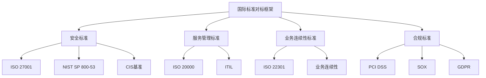

# 国际标准对标详解

## 目录

- [国际标准对标详解](#国际标准对标详解)
  - [目录](#目录)
  - [标准对标概述](#标准对标概述)
    - [对标框架](#对标框架)
    - [对标方法](#对标方法)
      - [1. 对标方法论](#1-对标方法论)
  - [ISO标准对标](#iso标准对标)
    - [ISO/IEC 27001对标](#isoiec-27001对标)
      - [1. 信息安全管理体系](#1-信息安全管理体系)
      - [2. 风险评估和控制](#2-风险评估和控制)
    - [ISO/IEC 20000对标](#isoiec-20000对标)
      - [1. 服务管理体系](#1-服务管理体系)
  - [NIST标准对标](#nist标准对标)
    - [NIST SP 800-53对标](#nist-sp-800-53对标)
      - [1. 安全控制框架](#1-安全控制框架)
      - [2. 系统保护](#2-系统保护)
    - [NIST SP 800-171对标](#nist-sp-800-171对标)
      - [1. 受控非机密信息保护](#1-受控非机密信息保护)
  - [CIS基准对标](#cis基准对标)
    - [CIS vSphere基准](#cis-vsphere基准)
      - [1. vCenter Server基准](#1-vcenter-server基准)
    - [CIS ESXi基准](#cis-esxi基准)
      - [1. ESXi安全基准](#1-esxi安全基准)
  - [PCI DSS对标](#pci-dss对标)
    - [PCI DSS要求](#pci-dss要求)
      - [1. PCI DSS控制要求](#1-pci-dss控制要求)
    - [vSphere PCI合规](#vsphere-pci合规)
      - [1. PCI合规实施](#1-pci合规实施)
  - [SOX合规对标](#sox合规对标)
    - [SOX要求](#sox要求)
      - [1. SOX合规要求](#1-sox合规要求)
  - [GDPR合规对标](#gdpr合规对标)
    - [GDPR要求](#gdpr要求)
      - [1. GDPR合规要求](#1-gdpr合规要求)
  - [标准实施指南](#标准实施指南)
    - [实施流程](#实施流程)
      - [1. 标准实施流程](#1-标准实施流程)
    - [合规验证](#合规验证)
      - [1. 验证方法](#1-验证方法)
  - [持续改进](#持续改进)
    - [标准更新](#标准更新)
      - [1. 标准更新流程](#1-标准更新流程)
    - [合规监控](#合规监控)
      - [1. 持续监控](#1-持续监控)

## 标准对标概述

### 对标框架



### 对标方法

#### 1. 对标方法论

```yaml
benchmarking_methodology:
  # 对标步骤
  benchmarking_steps:
    step_1:
      name: "标准分析"
      activities:
        - "标准要求分析"
        - "控制措施识别"
        - "合规要求确定"
    
    step_2:
      name: "现状评估"
      activities:
        - "当前状态评估"
        - "差距分析"
        - "风险评估"
    
    step_3:
      name: "对标映射"
      activities:
        - "要求映射"
        - "控制措施映射"
        - "实施措施映射"
    
    step_4:
      name: "实施计划"
      activities:
        - "实施计划制定"
        - "资源配置"
        - "时间安排"
    
    step_5:
      name: "合规验证"
      activities:
        - "实施验证"
        - "合规测试"
        - "审计准备"
```

## ISO标准对标

### ISO/IEC 27001对标

#### 1. 信息安全管理体系

```yaml
iso_27001_mapping:
  # 管理体系要求
  management_system_requirements:
    context_of_organization:
      iso_requirement: "4.1-4.4"
      vsphere_implementation:
        - "组织环境分析"
        - "相关方需求识别"
        - "ISMS范围确定"
        - "ISMS建立"
      compliance_status: "Compliant"
    
    leadership:
      iso_requirement: "5.1-5.3"
      vsphere_implementation:
        - "管理层承诺"
        - "信息安全政策"
        - "组织角色和职责"
      compliance_status: "Compliant"
    
    planning:
      iso_requirement: "6.1-6.3"
      vsphere_implementation:
        - "风险评估"
        - "风险处理"
        - "信息安全目标"
      compliance_status: "Compliant"
  
  # 安全控制措施
  security_controls:
    access_control:
      iso_requirement: "A.9.1.1"
      vsphere_implementation:
        - "基于角色的访问控制"
        - "最小权限原则"
        - "访问权限审查"
      compliance_status: "Compliant"
    
    cryptography:
      iso_requirement: "A.10.1.1"
      vsphere_implementation:
        - "数据传输加密"
        - "数据存储加密"
        - "密钥管理"
      compliance_status: "Compliant"
    
    operations_security:
      iso_requirement: "A.12.1.1"
      vsphere_implementation:
        - "操作程序"
        - "变更管理"
        - "容量管理"
      compliance_status: "Compliant"
```

#### 2. 风险评估和控制

```yaml
iso_27001_risk_assessment:
  # 风险评估
  risk_assessment:
    asset_management:
      iso_requirement: "A.8.1.1"
      vsphere_implementation:
        - "资产清单管理"
        - "资产分类"
        - "资产责任"
      compliance_status: "Compliant"
    
    vulnerability_management:
      iso_requirement: "A.12.6.1"
      vsphere_implementation:
        - "漏洞扫描"
        - "补丁管理"
        - "安全更新"
      compliance_status: "Compliant"
    
    incident_management:
      iso_requirement: "A.16.1.1"
      vsphere_implementation:
        - "事件响应程序"
        - "事件分类"
        - "事件报告"
      compliance_status: "Compliant"
```

### ISO/IEC 20000对标

#### 1. 服务管理体系

```yaml
iso_20000_mapping:
  # 服务管理
  service_management:
    service_level_management:
      iso_requirement: "4.1"
      vsphere_implementation:
        - "SLA定义"
        - "性能监控"
        - "服务报告"
      compliance_status: "Compliant"
    
    capacity_management:
      iso_requirement: "4.2"
      vsphere_implementation:
        - "容量规划"
        - "性能监控"
        - "容量优化"
      compliance_status: "Compliant"
    
    availability_management:
      iso_requirement: "4.3"
      vsphere_implementation:
        - "高可用性配置"
        - "故障恢复"
        - "可用性监控"
      compliance_status: "Compliant"
  
  # 服务交付
  service_delivery:
    service_continuity:
      iso_requirement: "4.4"
      vsphere_implementation:
        - "业务连续性规划"
        - "灾难恢复"
        - "备份策略"
      compliance_status: "Compliant"
    
    information_security:
      iso_requirement: "4.5"
      vsphere_implementation:
        - "安全策略"
        - "访问控制"
        - "安全监控"
      compliance_status: "Compliant"
```

## NIST标准对标

### NIST SP 800-53对标

#### 1. 安全控制框架

```yaml
nist_800_53_mapping:
  # 访问控制
  access_control:
    ac_1:
      control: "Access Control Policy"
      vsphere_implementation:
        - "访问控制策略制定"
        - "策略文档化"
        - "策略审查"
      compliance_status: "Compliant"
    
    ac_2:
      control: "Account Management"
      vsphere_implementation:
        - "用户账户管理"
        - "账户生命周期管理"
        - "账户审查"
      compliance_status: "Compliant"
    
    ac_3:
      control: "Access Enforcement"
      vsphere_implementation:
        - "访问权限执行"
        - "权限验证"
        - "访问控制"
      compliance_status: "Compliant"
  
  # 审计与问责
  audit_accountability:
    au_1:
      control: "Audit Policy"
      vsphere_implementation:
        - "审计策略制定"
        - "审计事件定义"
        - "审计程序"
      compliance_status: "Compliant"
    
    au_2:
      control: "Audit Events"
      vsphere_implementation:
        - "审计事件记录"
        - "事件分类"
        - "事件存储"
      compliance_status: "Compliant"
    
    au_3:
      control: "Content of Audit Records"
      vsphere_implementation:
        - "审计记录内容"
        - "记录格式"
        - "记录完整性"
      compliance_status: "Compliant"
```

#### 2. 系统保护

```yaml
nist_800_53_system_protection:
  # 系统完整性
  system_integrity:
    si_1:
      control: "System Integrity Policy"
      vsphere_implementation:
        - "系统完整性策略"
        - "完整性检查"
        - "完整性保护"
      compliance_status: "Compliant"
    
    si_2:
      control: "Flaw Remediation"
      vsphere_implementation:
        - "漏洞修复"
        - "补丁管理"
        - "安全更新"
      compliance_status: "Compliant"
    
    si_3:
      control: "Malicious Code Protection"
      vsphere_implementation:
        - "恶意代码防护"
        - "防病毒软件"
        - "恶意软件检测"
      compliance_status: "Compliant"
```

### NIST SP 800-171对标

#### 1. 受控非机密信息保护

```yaml
nist_800_171_mapping:
  # 访问控制
  access_control:
    ac_1:
      control: "Limit Information System Access"
      vsphere_implementation:
        - "系统访问限制"
        - "访问控制策略"
        - "访问权限管理"
      compliance_status: "Compliant"
    
    ac_2:
      control: "Separate Duties"
      vsphere_implementation:
        - "职责分离"
        - "角色分离"
        - "权限分离"
      compliance_status: "Compliant"
  
  # 事件响应
  incident_response:
    ir_1:
      control: "Establish Incident Response Capability"
      vsphere_implementation:
        - "事件响应能力"
        - "响应程序"
        - "响应团队"
      compliance_status: "Compliant"
    
    ir_2:
      control: "Track and Document Security Incidents"
      vsphere_implementation:
        - "安全事件跟踪"
        - "事件文档化"
        - "事件分析"
      compliance_status: "Compliant"
```

## CIS基准对标

### CIS vSphere基准

#### 1. vCenter Server基准

```yaml
cis_vcenter_benchmark:
  # Level 1基准
  level_1_benchmark:
    description: "基本安全配置"
    controls: 30
    compliance_status: "Compliant"
    
    key_controls:
      control_1:
        name: "配置时间同步"
        description: "配置NTP时间同步"
        implementation:
          - "配置NTP服务器"
          - "启用时间同步"
          - "验证时间同步"
        compliance_status: "Compliant"
      
      control_2:
        name: "配置日志记录"
        description: "配置集中日志记录"
        implementation:
          - "配置Syslog服务器"
          - "启用远程日志"
          - "配置日志轮转"
        compliance_status: "Compliant"
  
  # Level 2基准
  level_2_benchmark:
    description: "高级安全配置"
    controls: 15
    compliance_status: "Partially Compliant"
    
    key_controls:
      control_1:
        name: "配置SSL证书"
        description: "配置有效SSL证书"
        implementation:
          - "获取有效证书"
          - "配置证书"
          - "验证证书"
        compliance_status: "Compliant"
      
      control_2:
        name: "配置身份验证"
        description: "配置强身份验证"
        implementation:
          - "配置AD集成"
          - "启用MFA"
          - "配置会话超时"
        compliance_status: "In Progress"
```

### CIS ESXi基准

#### 1. ESXi安全基准

```yaml
cis_esxi_benchmark:
  # Level 1基准
  level_1_benchmark:
    description: "基本安全配置"
    controls: 50
    compliance_status: "Compliant"
    
    key_controls:
      control_1:
        name: "配置锁定模式"
        description: "启用ESXi锁定模式"
        implementation:
          - "启用锁定模式"
          - "配置例外用户"
          - "验证锁定模式"
        compliance_status: "Compliant"
      
      control_2:
        name: "配置防火墙"
        description: "配置ESXi防火墙"
        implementation:
          - "启用防火墙"
          - "配置防火墙规则"
          - "验证防火墙状态"
        compliance_status: "Compliant"
  
  # Level 2基准
  level_2_benchmark:
    description: "高级安全配置"
    controls: 25
    compliance_status: "Partially Compliant"
    
    key_controls:
      control_1:
        name: "配置安全启动"
        description: "启用安全启动"
        implementation:
          - "启用安全启动"
          - "配置启动策略"
          - "验证安全启动"
        compliance_status: "Compliant"
      
      control_2:
        name: "配置内存保护"
        description: "启用内存保护"
        implementation:
          - "启用ASLR"
          - "配置内存保护"
          - "验证内存保护"
        compliance_status: "In Progress"
```

## PCI DSS对标

### PCI DSS要求

#### 1. PCI DSS控制要求

```yaml
pci_dss_requirements:
  # 要求1：构建和维护安全网络
  requirement_1:
    description: "构建和维护安全网络和系统"
    vsphere_implementation:
      - "网络分段"
      - "防火墙配置"
      - "网络访问控制"
    compliance_status: "Compliant"
  
  # 要求2：保护持卡人数据
  requirement_2:
    description: "保护存储的持卡人数据"
    vsphere_implementation:
      - "数据加密"
      - "访问控制"
      - "数据分类"
    compliance_status: "Compliant"
  
  # 要求3：维护漏洞管理程序
  requirement_3:
    description: "维护漏洞管理程序"
    vsphere_implementation:
      - "漏洞扫描"
      - "补丁管理"
      - "安全更新"
    compliance_status: "Compliant"
```

### vSphere PCI合规

#### 1. PCI合规实施

```yaml
vsphere_pci_compliance:
  # 网络分段
  network_segmentation:
    implementation:
      - "DMZ网络配置"
      - "内部网络隔离"
      - "数据库网络隔离"
    compliance_status: "Compliant"
  
  # 数据保护
  data_protection:
    implementation:
      - "传输加密"
      - "存储加密"
      - "密钥管理"
    compliance_status: "Compliant"
  
  # 访问控制
  access_control:
    implementation:
      - "基于角色的访问"
      - "多因素认证"
      - "会话管理"
    compliance_status: "Compliant"
```

## SOX合规对标

### SOX要求

#### 1. SOX合规要求

```yaml
sox_requirements:
  # 内部控制
  internal_controls:
    control_environment:
      description: "控制环境"
      vsphere_implementation:
        - "治理结构"
        - "控制政策"
        - "风险评估"
      compliance_status: "Compliant"
    
    risk_assessment:
      description: "风险评估"
      vsphere_implementation:
        - "风险识别"
        - "风险分析"
        - "风险应对"
      compliance_status: "Compliant"
  
  # 信息与沟通
  information_communication:
    information_systems:
      description: "信息系统"
      vsphere_implementation:
        - "系统控制"
        - "数据完整性"
        - "系统可用性"
      compliance_status: "Compliant"
    
    communication:
      description: "沟通"
      vsphere_implementation:
        - "控制沟通"
        - "异常报告"
        - "管理层沟通"
      compliance_status: "Compliant"
```

## GDPR合规对标

### GDPR要求

#### 1. GDPR合规要求

```yaml
gdpr_requirements:
  # 数据保护原则
  data_protection_principles:
    lawfulness:
      description: "合法性"
      vsphere_implementation:
        - "数据处理合法性"
        - "同意管理"
        - "法律依据"
      compliance_status: "Compliant"
    
    purpose_limitation:
      description: "目的限制"
      vsphere_implementation:
        - "数据处理目的"
        - "目的限制"
        - "目的变更"
      compliance_status: "Compliant"
  
  # 数据主体权利
  data_subject_rights:
    right_to_access:
      description: "访问权"
      vsphere_implementation:
        - "数据访问机制"
        - "访问请求处理"
        - "数据提供"
      compliance_status: "Compliant"
    
    right_to_erasure:
      description: "删除权"
      vsphere_implementation:
        - "数据删除机制"
        - "删除请求处理"
        - "删除确认"
      compliance_status: "Compliant"
```

## 标准实施指南

### 实施流程

#### 1. 标准实施流程

```yaml
standard_implementation_process:
  # 准备阶段
  preparation_phase:
    duration: "4-6 weeks"
    activities:
      - "标准分析"
      - "现状评估"
      - "差距分析"
      - "实施计划"
    
  # 实施阶段
  implementation_phase:
    duration: "12-16 weeks"
    activities:
      - "控制措施实施"
      - "流程建立"
      - "培训交付"
      - "文档更新"
    
  # 验证阶段
  validation_phase:
    duration: "4-6 weeks"
    activities:
      - "合规验证"
      - "测试执行"
      - "审计准备"
      - "改进实施"
    
  # 维护阶段
  maintenance_phase:
    duration: "Ongoing"
    activities:
      - "持续监控"
      - "定期审查"
      - "标准更新"
      - "改进优化"
```

### 合规验证

#### 1. 验证方法

```yaml
compliance_verification:
  # 自动化验证
  automated_verification:
    tools:
      - "PowerCLI脚本"
      - "API验证"
      - "配置检查"
    
    frequency: "Daily"
    coverage: "90%"
  
  # 手动验证
  manual_verification:
    activities:
      - "配置审查"
      - "流程验证"
      - "文档审查"
    
    frequency: "Monthly"
    coverage: "100%"
  
  # 审计验证
  audit_verification:
    activities:
      - "内部审计"
      - "外部审计"
      - "合规评估"
    
    frequency: "Annually"
    coverage: "100%"
```

## 持续改进

### 标准更新

#### 1. 标准更新流程

```yaml
standard_update_process:
  # 更新监控
  update_monitoring:
    sources:
      - "标准组织发布"
      - "行业最佳实践"
      - "法规变化"
      - "技术发展"
    
    frequency: "Quarterly"
  
  # 更新实施
  update_implementation:
    process:
      - "更新评估"
      - "影响分析"
      - "实施计划"
      - "更新执行"
    
    timeline: "3-6 months"
```

### 合规监控

#### 1. 持续监控

```yaml
continuous_compliance_monitoring:
  # 监控指标
  monitoring_metrics:
    compliance_score:
      target: "95%"
      current: "92%"
      trend: "Improving"
    
    control_effectiveness:
      target: "90%"
      current: "88%"
      trend: "Stable"
  
  # 监控工具
  monitoring_tools:
    automated:
      - "合规监控平台"
      - "配置管理工具"
      - "审计工具"
    
    manual:
      - "定期审查"
      - "风险评估"
      - "合规评估"
```

---

*本文档提供了vSphere环境与国际标准的全面对标分析，包括ISO、NIST、CIS等主要标准的详细映射和实施指南，为vSphere环境的标准化和合规化提供了完整的参考框架。*
