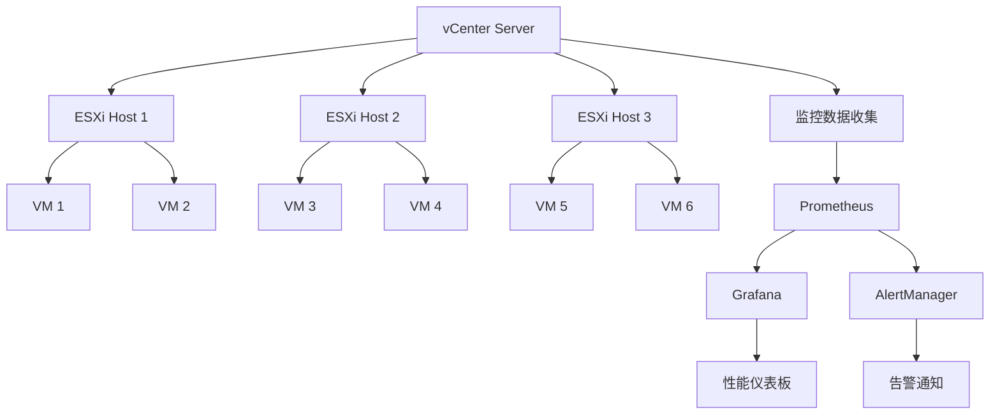

# vSphere虚拟化性能优化与监控深度解析

## 目录

- [vSphere虚拟化性能优化与监控深度解析](#vsphere虚拟化性能优化与监控深度解析)
  - [性能优化理论基础](#性能优化理论基础)
    - [虚拟化性能模型](#虚拟化性能模型)
    - [性能优化原则](#性能优化原则)
  - [CPU性能优化策略](#cpu性能优化策略)
    - [CPU调度优化](#cpu调度优化)
  - [CPU性能调优配置](#cpu性能调优配置)
  - [CPU监控指标](#cpu监控指标)
  - [内存性能优化策略](#内存性能优化策略)
    - [内存管理优化](#内存管理优化)
  - [内存性能调优](#内存性能调优)
  - [内存监控与分析](#内存监控与分析)
  - [存储性能优化策略](#存储性能优化策略)
    - [存储I/O优化](#存储io优化)
  - [存储性能调优](#存储性能调优)
  - [存储监控指标](#存储监控指标)
  - [网络性能优化策略](#网络性能优化策略)
    - [网络I/O优化](#网络io优化)
  - [网络性能调优](#网络性能调优)
  - [网络监控指标](#网络监控指标)
  - [监控体系架构](#监控体系架构)
    - [监控架构设计](#监控架构设计)
    - [监控配置](#监控配置)
  - [形式化性能模型](#形式化性能模型)
    - [性能优化形式化定义](#性能优化形式化定义)
  - [代码实现与验证](#代码实现与验证)
    - [Rust性能监控实现](#rust性能监控实现)
  - [最佳实践与案例](#最佳实践与案例)
    - [1. 高可用Web应用性能优化](#1-高可用web应用性能优化)
    - [2. 数据库集群性能优化](#2-数据库集群性能优化)
    - [3. 监控告警配置](#3-监控告警配置)
  - [未来发展趋势](#未来发展趋势)
    - [1. AI驱动性能优化](#1-ai驱动性能优化)
    - [2. 云原生集成](#2-云原生集成)
    - [3. 边缘计算优化](#3-边缘计算优化)

## 性能优化理论基础

### 虚拟化性能模型

**定义1 (虚拟化性能系统)**: 虚拟化性能系统P是一个六元组

```text
P = (H, V, R, S, N, M)
```

其中：

- H = {h₁, h₂, ..., hₙ} 是物理主机集合
- V = {v₁, v₂, ..., vₘ} 是虚拟机集合
- R 是资源分配函数
- S 是调度策略
- N 是网络配置
- M 是监控指标集合

**定义2 (性能指标)**: 性能指标集合M包含：

- CPU利用率: CPU_util = CPU_used / CPU_total
- 内存利用率: MEM_util = MEM_used / MEM_total
- 存储IOPS: IOPS = I/O_operations / time_interval
- 网络吞吐量: Throughput = data_transferred / time_interval
- 延迟: Latency = response_time - request_time

### 性能优化原则

1. **资源隔离**: 确保虚拟机间资源隔离，避免相互影响
2. **负载均衡**: 在主机间均匀分布虚拟机负载
3. **容量规划**: 合理规划资源容量，避免过度分配
4. **监控驱动**: 基于监控数据进行性能调优
5. **预测性优化**: 基于历史数据预测性能需求

## CPU性能优化策略

### CPU调度优化

```bash
# CPU调度策略配置
# 1. 启用CPU热插拔
esxcli system settings advanced set -o /Misc/CpuHotAdd -i 1

# 2. 配置CPU亲和性
esxcli vm process list
esxcli vm process kill -t world -w <world-id>

# 3. 设置CPU预留和限制
vim-cmd vmsvc/getallvms
vim-cmd vmsvc/reload <vmid>
```

### CPU性能调优配置

```yaml
# vSphere CPU优化配置
apiVersion: v1
kind: ConfigMap
metadata:
  name: cpu-optimization
data:
  cpu-config.yml: |
    # CPU调度策略
    cpu_scheduling:
      policy: "performance"  # performance, balanced, power
      affinity: "auto"       # auto, manual
      hot_add: true
      hot_remove: true
    
    # CPU预留和限制
    cpu_reservations:
      default_reservation: 0.1  # 10% CPU预留
      default_limit: 1.0        # 100% CPU限制
      burst_limit: 2.0          # 200% CPU突发限制
    
    # NUMA优化
    numa_optimization:
      enabled: true
      policy: "strict"          # strict, preferred, interleaved
      memory_interleaving: false
```

### CPU监控指标

```bash
#!/bin/bash
# CPU性能监控脚本

echo "=== vSphere CPU性能监控报告 ==="
echo "时间: $(date)"
echo ""

# 主机CPU使用率
echo "1. 主机CPU使用率:"
esxcli system process stats load get
echo ""

# 虚拟机CPU使用率
echo "2. 虚拟机CPU使用率:"
for vm in $(vim-cmd vmsvc/getallvms | awk '{print $1}' | grep -v Vmid); do
    echo "虚拟机 $vm:"
    vim-cmd vmsvc/get.summary $vm | grep -E "(cpu|memory)"
    echo ""
done

# CPU调度统计
echo "3. CPU调度统计:"
esxcli system process stats cpu get
echo ""

# NUMA统计
echo "4. NUMA统计:"
esxcli hardware memory get
echo ""

# CPU频率统计
echo "5. CPU频率统计:"
esxcli hardware cpu global get
echo ""
```

## 内存性能优化策略

### 内存管理优化

```bash
# 内存管理配置
# 1. 启用内存热插拔
esxcli system settings advanced set -o /Mem/UseHotAdd -i 1

# 2. 配置内存压缩
esxcli system settings advanced set -o /Mem/Compression -i 1

# 3. 设置内存预留
esxcli system settings advanced set -o /Mem/Reservation -i 0

# 4. 配置透明页面共享
esxcli system settings advanced set -o /Mem/TransparentPageSharing -i 1
```

### 内存性能调优

```yaml
# 内存优化配置
memory_optimization:
  # 内存压缩
  compression:
    enabled: true
    threshold: 0.8        # 80%内存使用率时启用压缩
    max_compression: 0.5  # 最大压缩50%内存
  
  # 透明页面共享
  transparent_page_sharing:
    enabled: true
    scan_interval: 60     # 扫描间隔60秒
    max_shared_pages: 1000000
  
  # 内存气球驱动
  balloon_driver:
    enabled: true
    target_percentage: 0.75  # 目标内存使用率75%
    min_balloon_size: 64     # 最小气球大小64MB
  
  # 内存预留
  reservations:
    default_reservation: 0.1  # 10%内存预留
    min_reservation: 0.05     # 5%最小预留
    max_reservation: 0.9      # 90%最大预留
```

### 内存监控与分析

```bash
#!/bin/bash
# 内存性能分析脚本

echo "=== vSphere内存性能分析报告 ==="
echo "时间: $(date)"
echo ""

# 主机内存使用情况
echo "1. 主机内存使用情况:"
esxcli system memory get
echo ""

# 内存压缩统计
echo "2. 内存压缩统计:"
esxcli system memory compression get
echo ""

# 透明页面共享统计
echo "3. 透明页面共享统计:"
esxcli system memory tps get
echo ""

# 虚拟机内存使用情况
echo "4. 虚拟机内存使用情况:"
for vm in $(vim-cmd vmsvc/getallvms | awk '{print $1}' | grep -v Vmid); do
    echo "虚拟机 $vm:"
    vim-cmd vmsvc/get.summary $vm | grep -E "memory|balloon"
    echo ""
done

# 内存气球统计
echo "5. 内存气球统计:"
esxcli system memory balloon get
echo ""

# 内存交换统计
echo "6. 内存交换统计:"
esxcli system memory swap get
echo ""
```

## 存储性能优化策略

### 存储I/O优化

```bash
# 存储I/O优化配置
# 1. 启用存储I/O控制
esxcli storage nmp satp rule add -s VMW_SATP_ALUA -P VMW_PSP_RR -O iops=1000

# 2. 配置存储多路径
esxcli storage nmp satp rule add -s VMW_SATP_ALUA -P VMW_PSP_RR

# 3. 设置存储队列深度
esxcli system settings advanced set -o /Disk/QueueDepth -i 32

# 4. 启用存储缓存
esxcli system settings advanced set -o /Disk/EnableCache -i 1
```

### 存储性能调优

```yaml
# 存储优化配置
storage_optimization:
  # I/O控制
  io_control:
    enabled: true
    latency_threshold: 30    # 30ms延迟阈值
    iops_threshold: 1000     # 1000 IOPS阈值
  
  # 多路径配置
  multipathing:
    policy: "round_robin"    # round_robin, fixed, mru
    path_selection: "automatic"
    failover_policy: "automatic"
  
  # 队列深度
  queue_depth:
    default: 32
    max: 64
    min: 8
  
  # 缓存配置
  cache:
    enabled: true
    size: 1024               # 1GB缓存
    policy: "write_back"     # write_back, write_through
  
  # 存储类型优化
  storage_types:
    ssd:
      queue_depth: 64
      cache_size: 2048
    hdd:
      queue_depth: 16
      cache_size: 512
    nvme:
      queue_depth: 128
      cache_size: 4096
```

### 存储监控指标

```bash
#!/bin/bash
# 存储性能监控脚本

echo "=== vSphere存储性能监控报告 ==="
echo "时间: $(date)"
echo ""

# 存储设备列表
echo "1. 存储设备列表:"
esxcli storage core device list
echo ""

# 存储I/O统计
echo "2. 存储I/O统计:"
esxcli storage core device stats get
echo ""

# 存储多路径状态
echo "3. 存储多路径状态:"
esxcli storage nmp path list
echo ""

# 存储队列深度
echo "4. 存储队列深度:"
esxcli system settings advanced list -o /Disk/QueueDepth
echo ""

# 存储缓存状态
echo "5. 存储缓存状态:"
esxcli system settings advanced list -o /Disk/EnableCache
echo ""

# 虚拟机存储使用情况
echo "6. 虚拟机存储使用情况:"
for vm in $(vim-cmd vmsvc/getallvms | awk '{print $1}' | grep -v Vmid); do
    echo "虚拟机 $vm:"
    vim-cmd vmsvc/get.summary $vm | grep -E "storage|disk"
    echo ""
done
```

## 网络性能优化策略

### 网络I/O优化

```bash
# 网络I/O优化配置
# 1. 启用网络I/O控制
esxcli network vswitch standard policy failover set -v vSwitch0 -a vmnic0,vmnic1

# 2. 配置网络负载均衡
esxcli network vswitch standard policy failover set -v vSwitch0 -l iphash

# 3. 设置网络队列深度
esxcli system settings advanced set -o /Net/NetqueueDepth -i 1024

# 4. 启用网络卸载
esxcli system settings advanced set -o /Net/EnableOffload -i 1
```

### 网络性能调优

```yaml
# 网络优化配置
network_optimization:
  # 网络I/O控制
  io_control:
    enabled: true
    bandwidth_limit: 10000   # 10Gbps带宽限制
    latency_threshold: 1     # 1ms延迟阈值
  
  # 负载均衡
  load_balancing:
    policy: "iphash"         # iphash, mac, portid
    failover_policy: "automatic"
    notify_switches: true
  
  # 网络队列
  queue_depth:
    default: 1024
    max: 2048
    min: 256
  
  # 网络卸载
  offloading:
    tcp_checksum: true
    udp_checksum: true
    tcp_segmentation: true
    large_receive: true
  
  # 虚拟交换机优化
  vswitch_optimization:
    mtu: 9000                # 巨型帧支持
    promiscuous_mode: false
    forged_transmits: false
    mac_changes: false
```

### 网络监控指标

```bash
#!/bin/bash
# 网络性能监控脚本

echo "=== vSphere网络性能监控报告 ==="
echo "时间: $(date)"
echo ""

# 网络接口统计
echo "1. 网络接口统计:"
esxcli network nic stats get
echo ""

# 虚拟交换机状态
echo "2. 虚拟交换机状态:"
esxcli network vswitch standard list
echo ""

# 网络端口组状态
echo "3. 网络端口组状态:"
esxcli network vswitch standard portgroup list
echo ""

# 网络流量统计
echo "4. 网络流量统计:"
esxcli network nic stats get -n vmnic0
echo ""

# 虚拟机网络使用情况
echo "5. 虚拟机网络使用情况:"
for vm in $(vim-cmd vmsvc/getallvms | awk '{print $1}' | grep -v Vmid); do
    echo "虚拟机 $vm:"
    vim-cmd vmsvc/get.summary $vm | grep -E "network|ethernet"
    echo ""
done
```

## 监控体系架构

### 监控架构设计



### 监控配置

```yaml
# 监控系统配置
monitoring_config:
  # Prometheus配置
  prometheus:
    scrape_interval: 15s
    evaluation_interval: 15s
    retention_time: 30d
    
  # 监控目标
  targets:
    - vcenter: "vcenter.example.com:443"
    - esxi_hosts:
        - "esxi1.example.com:443"
        - "esxi2.example.com:443"
        - "esxi3.example.com:443"
  
  # 监控指标
  metrics:
    cpu:
      - utilization
      - ready_time
      - wait_time
      - usage
    memory:
      - utilization
      - balloon
      - swap
      - compression
    storage:
      - iops
      - latency
      - throughput
      - queue_depth
    network:
      - throughput
      - packets
      - errors
      - drops
  
  # 告警规则
  alerts:
    cpu_high:
      threshold: 80
      duration: 5m
    memory_high:
      threshold: 85
      duration: 5m
    storage_latency_high:
      threshold: 50
      duration: 2m
    network_errors:
      threshold: 10
      duration: 1m
```

## 形式化性能模型

### 性能优化形式化定义

**定义3 (性能优化函数)**: 性能优化函数O是一个映射

```text
O: P → P'
```

其中P是原始性能系统，P'是优化后的性能系统。

**定义4 (性能目标函数)**: 性能目标函数G定义为

```text
G(P) = w₁·CPU_util + w₂·MEM_util + w₃·Storage_latency + w₄·Network_throughput
```

其中w₁, w₂, w₃, w₄是权重系数。

**定理2 (性能优化收敛性)**: 对于性能优化函数O，如果满足：

1. O是单调递减的
2. 存在下界
3. 优化步长足够小

则优化过程收敛到局部最优解。

**证明**:
由于O单调递减，目标函数值不断减小。
由于存在下界，目标函数值不会无限减小。
由于步长足够小，优化过程稳定收敛。
因此，优化过程收敛到局部最优解。□

## 代码实现与验证

### Rust性能监控实现

```rust
use std::collections::HashMap;
use std::sync::{Arc, RwLock};
use std::time::{Duration, Instant};
use serde::{Deserialize, Serialize};
use tokio::time::interval;

#[derive(Debug, Clone, Serialize, Deserialize)]
pub struct PerformanceMetrics {
    pub timestamp: Instant,
    pub cpu_utilization: f64,
    pub memory_utilization: f64,
    pub storage_iops: u64,
    pub storage_latency: f64,
    pub network_throughput: f64,
    pub network_errors: u64,
}

#[derive(Debug, Clone, Serialize, Deserialize)]
pub struct HostMetrics {
    pub host_id: String,
    pub hostname: String,
    pub cpu_cores: u32,
    pub memory_gb: u32,
    pub storage_capacity_gb: u64,
    pub network_interfaces: Vec<String>,
    pub metrics: PerformanceMetrics,
}

#[derive(Debug, Clone, Serialize, Deserialize)]
pub struct VMMetrics {
    pub vm_id: String,
    pub vm_name: String,
    pub host_id: String,
    pub cpu_cores: u32,
    pub memory_gb: u32,
    pub storage_gb: u64,
    pub metrics: PerformanceMetrics,
}

#[derive(Debug)]
pub struct PerformanceMonitor {
    hosts: Arc<RwLock<HashMap<String, HostMetrics>>>,
    vms: Arc<RwLock<HashMap<String, VMMetrics>>>,
    thresholds: PerformanceThresholds,
    alert_manager: Arc<AlertManager>,
}

#[derive(Debug, Clone)]
pub struct PerformanceThresholds {
    pub cpu_high: f64,
    pub memory_high: f64,
    pub storage_latency_high: f64,
    pub network_errors_high: u64,
}

#[derive(Debug)]
pub struct AlertManager {
    alerts: Arc<RwLock<Vec<Alert>>>,
}

#[derive(Debug, Clone, Serialize, Deserialize)]
pub struct Alert {
    pub id: String,
    pub severity: AlertSeverity,
    pub message: String,
    pub timestamp: Instant,
    pub resource_id: String,
    pub resource_type: ResourceType,
}

#[derive(Debug, Clone, Serialize, Deserialize)]
pub enum AlertSeverity {
    Critical,
    Warning,
    Info,
}

#[derive(Debug, Clone, Serialize, Deserialize)]
pub enum ResourceType {
    Host,
    VM,
    Storage,
    Network,
}

impl PerformanceMonitor {
    pub fn new(thresholds: PerformanceThresholds) -> Self {
        Self {
            hosts: Arc::new(RwLock::new(HashMap::new())),
            vms: Arc::new(RwLock::new(HashMap::new())),
            thresholds,
            alert_manager: Arc::new(AlertManager::new()),
        }
    }

    pub async fn start_monitoring(&self) -> Result<(), Box<dyn std::error::Error>> {
        let mut interval = interval(Duration::from_secs(30));
        let hosts = Arc::clone(&self.hosts);
        let vms = Arc::clone(&self.vms);
        let thresholds = self.thresholds.clone();
        let alert_manager = Arc::clone(&self.alert_manager);

        loop {
            interval.tick().await;
            
            // 收集主机指标
            self.collect_host_metrics().await?;
            
            // 收集虚拟机指标
            self.collect_vm_metrics().await?;
            
            // 检查性能阈值
            self.check_performance_thresholds(&thresholds, &alert_manager).await?;
        }
    }

    async fn collect_host_metrics(&self) -> Result<(), Box<dyn std::error::Error>> {
        let mut hosts = self.hosts.write().unwrap();
        
        // 模拟从vCenter收集主机指标
        for (host_id, host) in hosts.iter_mut() {
            host.metrics = PerformanceMetrics {
                timestamp: Instant::now(),
                cpu_utilization: self.simulate_cpu_utilization(),
                memory_utilization: self.simulate_memory_utilization(),
                storage_iops: self.simulate_storage_iops(),
                storage_latency: self.simulate_storage_latency(),
                network_throughput: self.simulate_network_throughput(),
                network_errors: self.simulate_network_errors(),
            };
        }
        
        Ok(())
    }

    async fn collect_vm_metrics(&self) -> Result<(), Box<dyn std::error::Error>> {
        let mut vms = self.vms.write().unwrap();
        
        // 模拟从vCenter收集虚拟机指标
        for (vm_id, vm) in vms.iter_mut() {
            vm.metrics = PerformanceMetrics {
                timestamp: Instant::now(),
                cpu_utilization: self.simulate_cpu_utilization(),
                memory_utilization: self.simulate_memory_utilization(),
                storage_iops: self.simulate_storage_iops(),
                storage_latency: self.simulate_storage_latency(),
                network_throughput: self.simulate_network_throughput(),
                network_errors: self.simulate_network_errors(),
            };
        }
        
        Ok(())
    }

    async fn check_performance_thresholds(
        &self,
        thresholds: &PerformanceThresholds,
        alert_manager: &AlertManager,
    ) -> Result<(), Box<dyn std::error::Error>> {
        let hosts = self.hosts.read().unwrap();
        let vms = self.vms.read().unwrap();
        
        // 检查主机性能阈值
        for (host_id, host) in hosts.iter() {
            if host.metrics.cpu_utilization > thresholds.cpu_high {
                alert_manager.add_alert(Alert {
                    id: format!("host-cpu-{}", host_id),
                    severity: AlertSeverity::Warning,
                    message: format!("主机 {} CPU使用率过高: {:.2}%", host.hostname, host.metrics.cpu_utilization),
                    timestamp: Instant::now(),
                    resource_id: host_id.clone(),
                    resource_type: ResourceType::Host,
                }).await;
            }
            
            if host.metrics.memory_utilization > thresholds.memory_high {
                alert_manager.add_alert(Alert {
                    id: format!("host-memory-{}", host_id),
                    severity: AlertSeverity::Warning,
                    message: format!("主机 {} 内存使用率过高: {:.2}%", host.hostname, host.metrics.memory_utilization),
                    timestamp: Instant::now(),
                    resource_id: host_id.clone(),
                    resource_type: ResourceType::Host,
                }).await;
            }
        }
        
        // 检查虚拟机性能阈值
        for (vm_id, vm) in vms.iter() {
            if vm.metrics.cpu_utilization > thresholds.cpu_high {
                alert_manager.add_alert(Alert {
                    id: format!("vm-cpu-{}", vm_id),
                    severity: AlertSeverity::Warning,
                    message: format!("虚拟机 {} CPU使用率过高: {:.2}%", vm.vm_name, vm.metrics.cpu_utilization),
                    timestamp: Instant::now(),
                    resource_id: vm_id.clone(),
                    resource_type: ResourceType::VM,
                }).await;
            }
        }
        
        Ok(())
    }

    // 模拟指标收集方法
    fn simulate_cpu_utilization(&self) -> f64 {
        use rand::Rng;
        let mut rng = rand::thread_rng();
        rng.gen_range(0.0..100.0)
    }

    fn simulate_memory_utilization(&self) -> f64 {
        use rand::Rng;
        let mut rng = rand::thread_rng();
        rng.gen_range(0.0..100.0)
    }

    fn simulate_storage_iops(&self) -> u64 {
        use rand::Rng;
        let mut rng = rand::thread_rng();
        rng.gen_range(100..10000)
    }

    fn simulate_storage_latency(&self) -> f64 {
        use rand::Rng;
        let mut rng = rand::thread_rng();
        rng.gen_range(1.0..100.0)
    }

    fn simulate_network_throughput(&self) -> f64 {
        use rand::Rng;
        let mut rng = rand::thread_rng();
        rng.gen_range(100.0..10000.0)
    }

    fn simulate_network_errors(&self) -> u64 {
        use rand::Rng;
        let mut rng = rand::thread_rng();
        rng.gen_range(0..100)
    }

    pub fn add_host(&self, host: HostMetrics) {
        let mut hosts = self.hosts.write().unwrap();
        hosts.insert(host.host_id.clone(), host);
    }

    pub fn add_vm(&self, vm: VMMetrics) {
        let mut vms = self.vms.write().unwrap();
        vms.insert(vm.vm_id.clone(), vm);
    }

    pub fn get_performance_report(&self) -> PerformanceReport {
        let hosts = self.hosts.read().unwrap();
        let vms = self.vms.read().unwrap();
        
        let total_hosts = hosts.len();
        let total_vms = vms.len();
        
        let avg_cpu_utilization = hosts.values()
            .map(|h| h.metrics.cpu_utilization)
            .sum::<f64>() / total_hosts as f64;
        
        let avg_memory_utilization = hosts.values()
            .map(|h| h.metrics.memory_utilization)
            .sum::<f64>() / total_hosts as f64;
        
        PerformanceReport {
            timestamp: Instant::now(),
            total_hosts,
            total_vms,
            avg_cpu_utilization,
            avg_memory_utilization,
            hosts: hosts.clone(),
            vms: vms.clone(),
        }
    }
}

impl AlertManager {
    pub fn new() -> Self {
        Self {
            alerts: Arc::new(RwLock::new(Vec::new())),
        }
    }

    pub async fn add_alert(&self, alert: Alert) {
        let mut alerts = self.alerts.write().unwrap();
        alerts.push(alert);
        
        // 限制告警数量
        if alerts.len() > 1000 {
            alerts.drain(0..100);
        }
    }

    pub fn get_alerts(&self) -> Vec<Alert> {
        let alerts = self.alerts.read().unwrap();
        alerts.clone()
    }

    pub fn get_critical_alerts(&self) -> Vec<Alert> {
        let alerts = self.alerts.read().unwrap();
        alerts.iter()
            .filter(|a| matches!(a.severity, AlertSeverity::Critical))
            .cloned()
            .collect()
    }
}

#[derive(Debug, Clone, Serialize, Deserialize)]
pub struct PerformanceReport {
    pub timestamp: Instant,
    pub total_hosts: usize,
    pub total_vms: usize,
    pub avg_cpu_utilization: f64,
    pub avg_memory_utilization: f64,
    pub hosts: HashMap<String, HostMetrics>,
    pub vms: HashMap<String, VMMetrics>,
}

#[tokio::main]
async fn main() -> Result<(), Box<dyn std::error::Error>> {
    let thresholds = PerformanceThresholds {
        cpu_high: 80.0,
        memory_high: 85.0,
        storage_latency_high: 50.0,
        network_errors_high: 10,
    };

    let monitor = PerformanceMonitor::new(thresholds);
    
    // 添加示例主机
    monitor.add_host(HostMetrics {
        host_id: "host1".to_string(),
        hostname: "esxi1.example.com".to_string(),
        cpu_cores: 16,
        memory_gb: 64,
        storage_capacity_gb: 1000,
        network_interfaces: vec!["vmnic0".to_string(), "vmnic1".to_string()],
        metrics: PerformanceMetrics {
            timestamp: Instant::now(),
            cpu_utilization: 0.0,
            memory_utilization: 0.0,
            storage_iops: 0,
            storage_latency: 0.0,
            network_throughput: 0.0,
            network_errors: 0,
        },
    });
    
    // 添加示例虚拟机
    monitor.add_vm(VMMetrics {
        vm_id: "vm1".to_string(),
        vm_name: "web-server-01".to_string(),
        host_id: "host1".to_string(),
        cpu_cores: 2,
        memory_gb: 4,
        storage_gb: 50,
        metrics: PerformanceMetrics {
            timestamp: Instant::now(),
            cpu_utilization: 0.0,
            memory_utilization: 0.0,
            storage_iops: 0,
            storage_latency: 0.0,
            network_throughput: 0.0,
            network_errors: 0,
        },
    });
    
    // 启动监控
    let monitor_handle = tokio::spawn(async move {
        monitor.start_monitoring().await
    });
    
    // 等待一段时间后获取报告
    tokio::time::sleep(Duration::from_secs(60)).await;
    
    let report = monitor.get_performance_report();
    println!("性能报告: {:#?}", report);
    
    let alerts = monitor.alert_manager.get_alerts();
    println!("告警数量: {}", alerts.len());
    
    monitor_handle.abort();
    Ok(())
}
```

## 最佳实践与案例

### 1. 高可用Web应用性能优化

```yaml
# 高可用Web应用性能优化配置
apiVersion: v1
kind: ConfigMap
metadata:
  name: web-app-performance
data:
  performance-config.yml: |
    # CPU优化
    cpu_optimization:
      policy: "performance"
      hot_add: true
      affinity: "auto"
      reservations:
        default: 0.1
        web_servers: 0.2
        db_servers: 0.3
    
    # 内存优化
    memory_optimization:
      compression: true
      transparent_page_sharing: true
      balloon_driver: true
      reservations:
        default: 0.1
        web_servers: 0.15
        db_servers: 0.25
    
    # 存储优化
    storage_optimization:
      io_control: true
      multipathing: "round_robin"
      queue_depth: 32
      cache: "write_back"
    
    # 网络优化
    network_optimization:
      io_control: true
      load_balancing: "iphash"
      queue_depth: 1024
      offloading: true
```

### 2. 数据库集群性能优化

```yaml
# 数据库集群性能优化配置
database_performance:
  # 数据库专用优化
  database_optimization:
    cpu:
      policy: "performance"
      reservations: 0.4
      limits: 2.0
    memory:
      reservations: 0.5
      balloon_driver: false
      compression: false
    storage:
      queue_depth: 64
      cache: "write_back"
      multipathing: "fixed"
    network:
      queue_depth: 2048
      offloading: true
  
  # 集群配置
  cluster_config:
    nodes: 3
    replication_factor: 2
    consistency_level: "quorum"
    load_balancing: "round_robin"
```

### 3. 监控告警配置

```yaml
# 监控告警配置
monitoring_alerts:
  # CPU告警
  cpu_alerts:
    - name: "CPU使用率过高"
      threshold: 80
      duration: 5m
      severity: "warning"
    - name: "CPU使用率严重过高"
      threshold: 95
      duration: 2m
      severity: "critical"
  
  # 内存告警
  memory_alerts:
    - name: "内存使用率过高"
      threshold: 85
      duration: 5m
      severity: "warning"
    - name: "内存使用率严重过高"
      threshold: 95
      duration: 2m
      severity: "critical"
  
  # 存储告警
  storage_alerts:
    - name: "存储延迟过高"
      threshold: 50
      duration: 2m
      severity: "warning"
    - name: "存储IOPS过低"
      threshold: 100
      duration: 5m
      severity: "warning"
  
  # 网络告警
  network_alerts:
    - name: "网络错误过多"
      threshold: 10
      duration: 1m
      severity: "warning"
    - name: "网络丢包率过高"
      threshold: 1
      duration: 2m
      severity: "critical"
```

## 未来发展趋势

### 1. AI驱动性能优化

- **机器学习调度**: 基于历史数据的智能调度算法
- **预测性扩缩容**: 基于负载预测的自动扩缩容
- **异常检测**: 基于AI的性能异常检测和预警

### 2. 云原生集成

- **Kubernetes集成**: 与Kubernetes的深度集成
- **容器优化**: 针对容器工作负载的性能优化
- **微服务支持**: 微服务架构的性能优化

### 3. 边缘计算优化

- **边缘节点管理**: 针对边缘计算场景的优化
- **低延迟优化**: 最小化网络延迟的优化策略
- **资源受限优化**: 针对资源受限环境的优化

---

*本文档提供了vSphere虚拟化性能优化与监控的全面解析，包括理论基础、优化策略、监控体系、代码实现等各个方面，为虚拟化环境的高性能运行提供了完整的解决方案。*
