# 2025年vSphere技术前沿与创新

## 目录

- [2025年vSphere技术前沿与创新](#2025年vsphere技术前沿与创新)
  - [目录](#目录)
  - [技术前沿概述](#技术前沿概述)
    - [创新技术趋势](#创新技术趋势)
    - [技术发展路线图](#技术发展路线图)
  - [AI驱动的智能运维](#ai驱动的智能运维)
    - [智能监控系统](#智能监控系统)
    - [预测性分析](#预测性分析)
    - [自动化决策](#自动化决策)
  - [云原生技术集成](#云原生技术集成)
    - [Kubernetes深度集成](#kubernetes深度集成)
    - [容器化工作负载](#容器化工作负载)
    - [微服务架构支持](#微服务架构支持)
  - [边缘计算技术](#边缘计算技术)
    - [边缘节点部署](#边缘节点部署)
    - [边缘数据管理](#边缘数据管理)
    - [边缘AI/ML支持](#边缘aiml支持)
  - [量子计算准备](#量子计算准备)
    - [量子计算概述](#量子计算概述)
    - [量子安全](#量子安全)
    - [量子优化](#量子优化)
  - [5G/6G网络集成](#5g6g网络集成)
    - [5G网络支持](#5g网络支持)
    - [6G网络准备](#6g网络准备)
    - [网络虚拟化演进](#网络虚拟化演进)
  - [绿色计算技术](#绿色计算技术)
    - [能效优化](#能效优化)
    - [碳足迹管理](#碳足迹管理)
    - [可持续计算](#可持续计算)
  - [数字孪生技术](#数字孪生技术)
    - [数字孪生架构](#数字孪生架构)
    - [实时同步](#实时同步)
    - [预测性维护](#预测性维护)
  - [自主运维系统](#自主运维系统)
    - [自主决策](#自主决策)
    - [自我修复](#自我修复)
    - [持续优化](#持续优化)
  - [技术融合趋势](#技术融合趋势)
    - [多技术融合](#多技术融合)
    - [融合应用场景](#融合应用场景)
  - [实施策略](#实施策略)
    - [技术评估](#技术评估)
    - [实施路线图](#实施路线图)
    - [风险控制](#风险控制)
  - [未来展望](#未来展望)
    - [2026-2030年趋势](#2026-2030年趋势)
    - [长期愿景](#长期愿景)

## 技术前沿概述

### 创新技术趋势

```mermaid
graph TB
    A[2025年vSphere技术前沿] --> B[AI智能运维]
    A --> C[云原生集成]
    A --> D[边缘计算]
    A --> E[量子计算]
    A --> F[5G/6G网络]
    A --> G[绿色计算]
    A --> H[数字孪生]
    A --> I[自主运维]
    
    B --> B1[智能监控]
    B --> B2[预测分析]
    B --> B3[自动决策]
    
    C --> C1[K8s集成]
    C --> C2[容器化]
    C --> C3[微服务]
    
    D --> D1[边缘节点]
    D --> D2[边缘数据]
    D --> D3[边缘AI]
    
    E --> E1[量子安全]
    E --> E2[量子优化]
    E --> E3[量子计算]
    
    F --> F1[5G支持]
    F --> F2[6G准备]
    F --> F3[网络虚拟化]
    
    G --> G1[能效优化]
    G --> G2[碳足迹]
    G --> G3[可持续]
    
    H --> H1[数字孪生]
    H --> H2[实时同步]
    H --> H3[预测维护]
    
    I --> I1[自主决策]
    I --> I2[自我修复]
    I --> I3[持续优化]
```



### 技术发展路线图

#### 1. 短期发展（2025年）

```yaml
short_term_roadmap:
  # 2025年Q1
  q1_2025:
    focus: "AI智能运维基础"
    deliverables:
      - "智能监控系统v1.0"
      - "预测性分析引擎"
      - "自动化决策框架"
    
  # 2025年Q2
  q2_2025:
    focus: "云原生深度集成"
    deliverables:
      - "Kubernetes 2.0集成"
      - "容器化工作负载支持"
      - "微服务架构优化"
    
  # 2025年Q3
  q3_2025:
    focus: "边缘计算扩展"
    deliverables:
      - "边缘节点管理v2.0"
      - "边缘数据同步"
      - "边缘AI/ML支持"
    
  # 2025年Q4
  q4_2025:
    focus: "绿色计算优化"
    deliverables:
      - "能效优化系统"
      - "碳足迹管理"
      - "可持续计算框架"
```

#### 2. 中期发展（2026-2027年）

```yaml
medium_term_roadmap:
  # 2026年
  year_2026:
    focus: "量子计算准备"
    deliverables:
      - "量子安全框架"
      - "量子优化算法"
      - "量子计算接口"
    
  # 2027年
  year_2027:
    focus: "5G/6G网络集成"
    deliverables:
      - "5G网络支持"
      - "6G网络准备"
      - "网络虚拟化演进"
```

#### 3. 长期发展（2028-2030年）

```yaml
long_term_roadmap:
  # 2028年
  year_2028:
    focus: "数字孪生技术"
    deliverables:
      - "数字孪生架构"
      - "实时同步系统"
      - "预测性维护"
    
  # 2029年
  year_2029:
    focus: "自主运维系统"
    deliverables:
      - "自主决策引擎"
      - "自我修复系统"
      - "持续优化框架"
    
  # 2030年
  year_2030:
    focus: "技术融合创新"
    deliverables:
      - "多技术融合平台"
      - "智能生态系统"
      - "下一代虚拟化"
```

## AI驱动的智能运维

### 智能监控系统

#### 1. AI监控架构

```yaml
ai_monitoring_architecture:
  # 监控组件
  monitoring_components:
    data_collection:
      sources:
        - "vCenter Server"
        - "ESXi Hosts"
        - "Virtual Machines"
        - "Network Devices"
        - "Storage Systems"
      
      collection_methods:
        - "API集成"
        - "SNMP监控"
        - "日志分析"
        - "性能指标"
    
    ai_processing:
      machine_learning:
        - "异常检测算法"
        - "模式识别"
        - "预测模型"
        - "分类算法"
      
      deep_learning:
        - "神经网络"
        - "深度学习模型"
        - "强化学习"
        - "自然语言处理"
    
    intelligent_analysis:
      real_time_analysis:
        - "实时异常检测"
        - "性能预测"
        - "容量规划"
        - "故障预测"
      
      historical_analysis:
        - "趋势分析"
        - "模式识别"
        - "根因分析"
        - "性能优化"
```

#### 2. 智能告警系统

```yaml
intelligent_alerting_system:
  # 告警智能
  alert_intelligence:
    smart_filtering:
      features:
        - "告警聚合"
        - "噪声过滤"
        - "相关性分析"
        - "优先级排序"
      
      algorithms:
        - "机器学习分类"
        - "异常检测"
        - "模式匹配"
        - "时间序列分析"
    
    predictive_alerting:
      features:
        - "故障预测"
        - "性能预警"
        - "容量预警"
        - "安全威胁预警"
      
      models:
        - "时间序列预测"
        - "回归分析"
        - "分类模型"
        - "集成学习"
    
    automated_response:
      features:
        - "自动修复"
        - "自动扩容"
        - "自动迁移"
        - "自动备份"
      
      actions:
        - "脚本执行"
        - "API调用"
        - "工作流触发"
        - "通知发送"
```

### 预测性分析

#### 1. 预测模型

```yaml
predictive_models:
  # 性能预测
  performance_prediction:
    cpu_utilization:
      model_type: "时间序列预测"
      algorithm: "LSTM神经网络"
      accuracy: "95%"
      prediction_horizon: "24小时"
    
    memory_utilization:
      model_type: "回归分析"
      algorithm: "随机森林"
      accuracy: "92%"
      prediction_horizon: "12小时"
    
    storage_utilization:
      model_type: "趋势分析"
      algorithm: "ARIMA模型"
      accuracy: "90%"
      prediction_horizon: "7天"
  
  # 故障预测
  failure_prediction:
    hardware_failure:
      model_type: "分类模型"
      algorithm: "支持向量机"
      accuracy: "88%"
      prediction_horizon: "30天"
    
    software_failure:
      model_type: "异常检测"
      algorithm: "孤立森林"
      accuracy: "85%"
      prediction_horizon: "7天"
    
    network_failure:
      model_type: "模式识别"
      algorithm: "决策树"
      accuracy: "90%"
      prediction_horizon: "24小时"
```

#### 2. 容量规划

```yaml
capacity_planning:
  # 容量预测
  capacity_prediction:
    resource_forecasting:
      cpu_forecast:
        method: "时间序列分析"
        horizon: "12个月"
        accuracy: "90%"
      
      memory_forecast:
        method: "回归分析"
        horizon: "12个月"
        accuracy: "88%"
      
      storage_forecast:
        method: "趋势分析"
        horizon: "12个月"
        accuracy: "85%"
    
    growth_planning:
      business_growth:
        method: "业务指标关联"
        factors: ["用户增长", "业务扩展", "新应用部署"]
      
      technical_growth:
        method: "技术趋势分析"
        factors: ["技术升级", "性能提升", "功能扩展"]
```

### 自动化决策

#### 1. 决策引擎

```yaml
automated_decision_engine:
  # 决策框架
  decision_framework:
    rule_engine:
      features:
        - "规则定义"
        - "条件评估"
        - "动作执行"
        - "结果反馈"
      
      rule_types:
        - "性能优化规则"
        - "故障处理规则"
        - "容量管理规则"
        - "安全策略规则"
    
    machine_learning_engine:
      features:
        - "模型训练"
        - "预测分析"
        - "决策优化"
        - "学习改进"
      
      algorithms:
        - "强化学习"
        - "决策树"
        - "随机森林"
        - "神经网络"
    
    expert_system:
      features:
        - "知识库"
        - "推理引擎"
        - "专家规则"
        - "经验积累"
      
      knowledge_domains:
        - "系统管理"
        - "性能优化"
        - "故障排除"
        - "安全防护"
```

#### 2. 自动化操作

```yaml
automated_operations:
  # 自动修复
  automated_remediation:
    self_healing:
      features:
        - "故障检测"
        - "根因分析"
        - "修复方案"
        - "执行验证"
      
      repair_actions:
        - "服务重启"
        - "配置修复"
        - "资源调整"
        - "故障转移"
    
    preventive_maintenance:
      features:
        - "预测性维护"
        - "预防性操作"
        - "性能优化"
        - "容量调整"
      
      maintenance_actions:
        - "定期清理"
        - "性能调优"
        - "容量扩展"
        - "安全更新"
  
  # 自动优化
  automated_optimization:
    performance_optimization:
      features:
        - "性能监控"
        - "瓶颈识别"
        - "优化建议"
        - "自动调整"
      
      optimization_actions:
        - "资源重分配"
        - "负载均衡"
        - "缓存优化"
        - "网络调优"
    
    cost_optimization:
      features:
        - "成本分析"
        - "资源优化"
        - "效率提升"
        - "成本控制"
      
      cost_actions:
        - "资源回收"
        - "实例优化"
        - "存储优化"
        - "网络优化"
```

## 云原生技术集成

### Kubernetes深度集成

#### 1. vSphere with Tanzu 3.0

```yaml
vsphere_with_tanzu_3_0:
  # 核心功能
  core_features:
    kubernetes_integration:
      features:
        - "原生Kubernetes支持"
        - "容器运行时优化"
        - "网络策略集成"
        - "存储类支持"
      
      capabilities:
        - "Pod调度优化"
        - "资源管理"
        - "网络隔离"
        - "存储管理"
    
    tanzu_kubernetes_grid:
      features:
        - "Kubernetes集群管理"
        - "多集群支持"
        - "集群生命周期管理"
        - "配置管理"
      
      management:
        - "集群创建"
        - "节点管理"
        - "升级管理"
        - "监控集成"
    
    tanzu_mission_control:
      features:
        - "多集群管理"
        - "策略管理"
        - "安全控制"
        - "合规管理"
      
      capabilities:
        - "统一管理界面"
        - "策略执行"
        - "安全监控"
        - "合规报告"
```

#### 2. 容器化工作负载

```yaml
containerized_workloads:
  # 工作负载类型
  workload_types:
    stateless_workloads:
      characteristics:
        - "无状态应用"
        - "水平扩展"
        - "快速部署"
        - "弹性伸缩"
      
      examples:
        - "Web应用"
        - "API服务"
        - "微服务"
        - "批处理作业"
    
    stateful_workloads:
      characteristics:
        - "有状态应用"
        - "数据持久化"
        - "垂直扩展"
        - "数据一致性"
      
      examples:
        - "数据库"
        - "消息队列"
        - "文件系统"
        - "缓存系统"
    
    daemon_workloads:
      characteristics:
        - "系统服务"
        - "节点级别"
        - "持续运行"
        - "资源监控"
      
      examples:
        - "日志收集"
        - "监控代理"
        - "网络代理"
        - "存储代理"
```

### 微服务架构支持

#### 1. 微服务管理

```yaml
microservices_management:
  # 服务发现
  service_discovery:
    features:
      - "服务注册"
      - "服务发现"
      - "健康检查"
      - "负载均衡"
    
    implementations:
      - "Consul集成"
      - "Etcd支持"
      - "Kubernetes DNS"
      - "自定义服务发现"
  
  # 服务网格
  service_mesh:
    features:
      - "服务间通信"
      - "流量管理"
      - "安全策略"
      - "可观测性"
    
    implementations:
      - "Istio集成"
      - "Linkerd支持"
      - "Consul Connect"
      - "自定义服务网格"
  
  # API网关
  api_gateway:
    features:
      - "API管理"
      - "认证授权"
      - "流量控制"
      - "监控分析"
    
    implementations:
      - "Kong集成"
      - "Ambassador支持"
      - "Traefik集成"
      - "自定义API网关"
```

## 边缘计算技术

### 边缘节点部署

#### 1. vSphere Edge

```yaml
vsphere_edge:
  # 边缘架构
  edge_architecture:
    edge_nodes:
      characteristics:
        - "轻量级部署"
        - "离线运行"
        - "自动同步"
        - "故障恢复"
      
      deployment:
        - "单节点部署"
        - "集群部署"
        - "高可用部署"
        - "混合部署"
    
    edge_management:
      features:
        - "远程管理"
        - "配置同步"
        - "监控集成"
        - "更新管理"
      
      capabilities:
        - "集中管理"
        - "批量操作"
        - "策略推送"
        - "状态监控"
    
    edge_connectivity:
      features:
        - "网络连接"
        - "数据同步"
        - "命令下发"
        - "状态上报"
      
      protocols:
        - "HTTPS/TLS"
        - "MQTT"
        - "WebSocket"
        - "自定义协议"
```

#### 2. 边缘数据管理

```yaml
edge_data_management:
  # 数据同步
  data_synchronization:
    sync_strategies:
      real_time_sync:
        features:
          - "实时数据同步"
          - "低延迟传输"
          - "数据一致性"
          - "冲突解决"
      
      batch_sync:
        features:
          - "批量数据同步"
          - "压缩传输"
          - "断点续传"
          - "数据校验"
      
      incremental_sync:
        features:
          - "增量数据同步"
          - "变更检测"
          - "差异传输"
          - "版本管理"
    
    data_processing:
      edge_processing:
        features:
          - "边缘数据处理"
          - "实时分析"
          - "数据过滤"
          - "结果聚合"
      
      cloud_processing:
        features:
          - "云端数据处理"
          - "批量分析"
          - "机器学习"
          - "深度分析"
```

### 边缘AI/ML支持

#### 1. 边缘AI架构

```yaml
edge_ai_architecture:
  # AI模型部署
  ai_model_deployment:
    model_types:
      inference_models:
        features:
          - "推理模型"
          - "实时预测"
          - "低延迟"
          - "高精度"
      
      training_models:
        features:
          - "训练模型"
          - "增量学习"
          - "模型更新"
          - "性能优化"
    
    deployment_strategies:
      edge_deployment:
        features:
          - "边缘部署"
          - "本地推理"
          - "离线运行"
          - "快速响应"
      
      hybrid_deployment:
        features:
          - "混合部署"
          - "边缘+云端"
          - "智能路由"
          - "负载均衡"
  
  # 边缘ML
  edge_ml:
    machine_learning:
      algorithms:
        - "监督学习"
        - "无监督学习"
        - "强化学习"
        - "深度学习"
      
      frameworks:
        - "TensorFlow Lite"
        - "PyTorch Mobile"
        - "ONNX Runtime"
        - "自定义框架"
    
    data_processing:
      features:
        - "数据预处理"
        - "特征提取"
        - "模型推理"
        - "结果后处理"
      
      optimizations:
        - "模型压缩"
        - "量化优化"
        - "硬件加速"
        - "内存优化"
```

## 量子计算准备

### 量子计算概述

#### 1. 量子计算基础

```yaml
quantum_computing_fundamentals:
  # 量子计算原理
  quantum_principles:
    quantum_bits:
      description: "量子比特"
      properties:
        - "叠加态"
        - "纠缠态"
        - "量子干涉"
        - "量子测量"
    
    quantum_gates:
      description: "量子门"
      types:
        - "单量子比特门"
        - "双量子比特门"
        - "多量子比特门"
        - "量子电路"
    
    quantum_algorithms:
      description: "量子算法"
      examples:
        - "Shor算法"
        - "Grover算法"
        - "量子机器学习"
        - "量子优化"
  
  # 量子计算应用
  quantum_applications:
    cryptography:
      applications:
        - "量子密钥分发"
        - "量子加密"
        - "量子数字签名"
        - "量子认证"
    
    optimization:
      applications:
        - "组合优化"
        - "线性规划"
        - "图论问题"
        - "机器学习优化"
    
    simulation:
      applications:
        - "量子系统模拟"
        - "分子模拟"
        - "材料科学"
        - "药物发现"
```

### 量子安全

#### 1. 量子安全框架

```yaml
quantum_security_framework:
  # 量子威胁
  quantum_threats:
    quantum_attacks:
      shor_algorithm:
        description: "Shor算法攻击"
        target: "RSA和ECC加密"
        impact: "破解现有加密"
      
      grover_algorithm:
        description: "Grover算法攻击"
        target: "对称加密"
        impact: "密钥搜索加速"
    
    post_quantum_cryptography:
      description: "后量子密码学"
      algorithms:
        - "格基密码"
        - "编码密码"
        - "多变量密码"
        - "哈希签名"
  
  # 量子安全实施
  quantum_security_implementation:
    key_management:
      features:
        - "量子密钥分发"
        - "密钥更新"
        - "密钥存储"
        - "密钥销毁"
    
    encryption:
      features:
        - "后量子加密"
        - "混合加密"
        - "量子随机数"
        - "量子认证"
    
    monitoring:
      features:
        - "量子攻击检测"
        - "安全监控"
        - "威胁情报"
        - "响应机制"
```

### 量子优化

#### 1. 量子优化算法

```yaml
quantum_optimization:
  # 优化问题
  optimization_problems:
    resource_allocation:
      description: "资源分配优化"
      quantum_approach:
        - "量子退火"
        - "变分量子本征求解器"
        - "量子近似优化算法"
    
    scheduling:
      description: "调度优化"
      quantum_approach:
        - "量子遗传算法"
        - "量子粒子群优化"
        - "量子模拟退火"
    
    network_optimization:
      description: "网络优化"
      quantum_approach:
        - "量子图算法"
        - "量子网络流"
        - "量子路由优化"
  
  # 量子优化实施
  quantum_optimization_implementation:
    quantum_annealing:
      features:
        - "D-Wave系统"
        - "量子退火算法"
        - "组合优化"
        - "实时优化"
    
    variational_quantum_eigensolver:
      features:
        - "变分量子算法"
        - "参数优化"
        - "量子电路"
        - "经典优化器"
    
    quantum_approximate_optimization:
      features:
        - "QAOA算法"
        - "近似优化"
        - "量子电路"
        - "经典后处理"
```

## 5G/6G网络集成

### 5G网络支持

#### 1. 5G网络特性

```yaml
5g_network_support:
  # 5G特性
  network_features:
    enhanced_mobile_bandwidth:
      features:
        - "高速数据传输"
        - "大带宽支持"
        - "低延迟通信"
        - "高可靠性"
    
    massive_machine_type_communications:
      features:
        - "大规模设备连接"
        - "低功耗通信"
        - "广覆盖"
        - "成本优化"
    
    ultra_reliable_low_latency:
      features:
        - "超低延迟"
        - "高可靠性"
        - "实时通信"
        - "关键应用支持"
  
  # 5G集成
  network_integration:
    network_slicing:
      features:
        - "网络切片"
        - "资源隔离"
        - "服务质量"
        - "动态配置"
    
    edge_computing:
      features:
        - "边缘计算"
        - "本地处理"
        - "低延迟"
        - "带宽优化"
    
    network_function_virtualization:
      features:
        - "网络功能虚拟化"
        - "软件定义网络"
        - "网络自动化"
        - "灵活部署"
```

### 6G网络准备

#### 1. 6G网络愿景

```yaml
6g_network_vision:
  # 6G特性
  network_characteristics:
    terahertz_communications:
      features:
        - "太赫兹通信"
        - "超高带宽"
        - "超低延迟"
        - "高精度定位"
    
    artificial_intelligence:
      features:
        - "AI原生网络"
        - "智能网络管理"
        - "自适应优化"
        - "预测性维护"
    
    quantum_communications:
      features:
        - "量子通信"
        - "量子密钥分发"
        - "量子网络"
        - "量子安全"
  
  # 6G应用
  network_applications:
    holographic_communications:
      features:
        - "全息通信"
        - "沉浸式体验"
        - "3D视频"
        - "虚拟现实"
    
    brain_computer_interface:
      features:
        - "脑机接口"
        - "神经信号传输"
        - "思维控制"
        - "认知增强"
    
    digital_twin:
      features:
        - "数字孪生"
        - "实时同步"
        - "虚拟仿真"
        - "预测分析"
```

## 绿色计算技术

### 能效优化

#### 1. 能效管理

```yaml
energy_efficiency_management:
  # 能效监控
  energy_monitoring:
    power_consumption:
      metrics:
        - "CPU功耗"
        - "内存功耗"
        - "存储功耗"
        - "网络功耗"
      
      monitoring:
        - "实时监控"
        - "历史分析"
        - "趋势预测"
        - "异常检测"
    
    energy_efficiency:
      metrics:
        - "能效比"
        - "功耗利用率"
        - "性能功耗比"
        - "碳排放量"
      
      optimization:
        - "动态调频"
        - "负载均衡"
        - "资源整合"
        - "休眠管理"
  
  # 能效优化
  energy_optimization:
    dynamic_power_management:
      features:
        - "动态电压调节"
        - "动态频率调节"
        - "核心休眠"
        - "设备休眠"
    
    intelligent_scheduling:
      features:
        - "智能调度"
        - "负载预测"
        - "资源优化"
        - "能效平衡"
    
    renewable_energy:
      features:
        - "可再生能源"
        - "太阳能集成"
        - "风能集成"
        - "储能管理"
```

### 碳足迹管理

#### 1. 碳排放监控

```yaml
carbon_footprint_management:
  # 碳排放计算
  carbon_calculation:
    direct_emissions:
      sources:
        - "电力消耗"
        - "燃料使用"
        - "制冷系统"
        - "网络设备"
      
      calculation:
        - "碳排放因子"
        - "活动数据"
        - "排放计算"
        - "报告生成"
    
    indirect_emissions:
      sources:
        - "采购电力"
        - "供应链"
        - "运输物流"
        - "废弃物处理"
      
      calculation:
        - "生命周期分析"
        - "供应链追踪"
        - "间接排放"
        - "综合计算"
  
  # 碳减排
  carbon_reduction:
    energy_efficiency:
      strategies:
        - "能效提升"
        - "设备优化"
        - "流程改进"
        - "技术升级"
    
    renewable_energy:
      strategies:
        - "可再生能源"
        - "绿色电力"
        - "碳抵消"
        - "碳中和"
    
    carbon_capture:
      strategies:
        - "碳捕获"
        - "碳存储"
        - "碳利用"
        - "碳循环"
```

## 数字孪生技术

### 数字孪生架构

#### 1. 数字孪生系统

```yaml
digital_twin_architecture:
  # 系统架构
  system_architecture:
    physical_layer:
      components:
        - "物理设备"
        - "传感器"
        - "执行器"
        - "网络设备"
      
      data_collection:
        - "传感器数据"
        - "设备状态"
        - "环境数据"
        - "操作数据"
    
    digital_layer:
      components:
        - "数字模型"
        - "仿真引擎"
        - "数据分析"
        - "决策系统"
      
      capabilities:
        - "实时建模"
        - "仿真分析"
        - "预测分析"
        - "优化建议"
    
    connection_layer:
      components:
        - "数据接口"
        - "通信协议"
        - "数据同步"
        - "控制接口"
      
      features:
        - "实时通信"
        - "数据同步"
        - "双向控制"
        - "状态更新"
```

#### 2. 数字孪生应用

```yaml
digital_twin_applications:
  # 基础设施
  infrastructure:
    data_center_twin:
      features:
        - "数据中心建模"
        - "设备监控"
        - "能耗优化"
        - "容量规划"
    
    network_twin:
      features:
        - "网络拓扑"
        - "流量分析"
        - "性能优化"
        - "故障预测"
  
  # 业务流程
  business_processes:
    it_operations:
      features:
        - "IT运维建模"
        - "流程优化"
        - "自动化决策"
        - "持续改进"
    
    service_delivery:
      features:
        - "服务建模"
        - "质量监控"
        - "客户体验"
        - "服务优化"
```

## 自主运维系统

### 自主决策

#### 1. 决策系统

```yaml
autonomous_decision_system:
  # 决策框架
  decision_framework:
    decision_engine:
      components:
        - "规则引擎"
        - "机器学习"
        - "专家系统"
        - "优化算法"
      
      capabilities:
        - "实时决策"
        - "多目标优化"
        - "风险评估"
        - "学习改进"
    
    knowledge_base:
      components:
        - "历史数据"
        - "专家知识"
        - "最佳实践"
        - "经验积累"
      
      features:
        - "知识管理"
        - "知识更新"
        - "知识推理"
        - "知识共享"
  
  # 决策类型
  decision_types:
    operational_decisions:
      examples:
        - "资源分配"
        - "负载均衡"
        - "故障处理"
        - "性能优化"
    
    strategic_decisions:
      examples:
        - "容量规划"
        - "技术选型"
        - "架构设计"
        - "投资决策"
```

### 自我修复

#### 1. 自愈系统

```yaml
self_healing_system:
  # 自愈机制
  healing_mechanisms:
    fault_detection:
      methods:
        - "异常检测"
        - "模式识别"
        - "阈值监控"
        - "行为分析"
      
      capabilities:
        - "实时检测"
        - "早期预警"
        - "根因分析"
        - "影响评估"
    
    automatic_recovery:
      methods:
        - "服务重启"
        - "配置修复"
        - "资源调整"
        - "故障转移"
      
      capabilities:
        - "快速恢复"
        - "最小影响"
        - "自动验证"
        - "状态同步"
  
  # 自愈策略
  healing_strategies:
    preventive_healing:
      features:
        - "预防性维护"
        - "健康检查"
        - "性能优化"
        - "容量管理"
    
    reactive_healing:
      features:
        - "故障响应"
        - "快速恢复"
        - "影响最小化"
        - "服务保障"
```

## 技术融合趋势

### 多技术融合

#### 1. 技术融合架构

```yaml
technology_convergence:
  # 融合平台
  convergence_platform:
    unified_management:
      features:
        - "统一管理界面"
        - "集成监控"
        - "统一策略"
        - "协调操作"
    
    intelligent_orchestration:
      features:
        - "智能编排"
        - "自动化协调"
        - "资源优化"
        - "服务集成"
    
    adaptive_architecture:
      features:
        - "自适应架构"
        - "动态调整"
        - "弹性扩展"
        - "持续优化"
  
  # 融合技术
  converging_technologies:
    ai_cloud_edge:
      integration:
        - "AI算法"
        - "云计算"
        - "边缘计算"
        - "智能决策"
    
    quantum_classical:
      integration:
        - "量子计算"
        - "经典计算"
        - "混合算法"
        - "优化求解"
    
    physical_digital:
      integration:
        - "物理系统"
        - "数字孪生"
        - "实时同步"
        - "虚拟现实"
```

## 实施策略

### 技术评估

#### 1. 评估框架

```yaml
technology_assessment:
  # 评估维度
  assessment_dimensions:
    technical_feasibility:
      criteria:
        - "技术成熟度"
        - "实现复杂度"
        - "集成难度"
        - "性能要求"
    
    business_value:
      criteria:
        - "业务价值"
        - "投资回报"
        - "竞争优势"
        - "市场机会"
    
    risk_assessment:
      criteria:
        - "技术风险"
        - "市场风险"
        - "实施风险"
        - "运营风险"
  
  # 评估方法
  assessment_methods:
    technical_evaluation:
      methods:
        - "技术验证"
        - "原型开发"
        - "性能测试"
        - "集成测试"
    
    business_evaluation:
      methods:
        - "成本效益分析"
        - "市场分析"
        - "竞争分析"
        - "投资分析"
```

### 实施路线图

#### 1. 实施计划

```yaml
implementation_roadmap:
  # 实施阶段
  implementation_phases:
    phase_1:
      name: "基础建设"
      duration: "6-12个月"
      focus: "基础设施和基础技术"
      deliverables:
        - "基础设施升级"
        - "基础技术部署"
        - "团队培训"
        - "流程建立"
    
    phase_2:
      name: "技术集成"
      duration: "12-18个月"
      focus: "技术集成和优化"
      deliverables:
        - "技术集成"
        - "系统优化"
        - "性能调优"
        - "安全加固"
    
    phase_3:
      name: "创新应用"
      duration: "18-24个月"
      focus: "创新应用和高级功能"
      deliverables:
        - "创新应用"
        - "高级功能"
        - "智能运维"
        - "持续优化"
```

## 未来展望

### 2026-2030年趋势

#### 1. 技术发展趋势

```yaml
future_technology_trends:
  # 2026年
  year_2026:
    focus: "量子计算商业化"
    technologies:
      - "量子计算云服务"
      - "量子机器学习"
      - "量子优化算法"
      - "量子安全通信"
  
  # 2027年
  year_2027:
    focus: "6G网络部署"
    technologies:
      - "6G网络基础设施"
      - "太赫兹通信"
      - "全息通信"
      - "脑机接口"
  
  # 2028年
  year_2028:
    focus: "通用人工智能"
    technologies:
      - "AGI系统"
      - "自主智能体"
      - "认知计算"
      - "智能决策"
  
  # 2029年
  year_2029:
    focus: "数字孪生普及"
    technologies:
      - "全息数字孪生"
      - "实时虚拟世界"
      - "预测性维护"
      - "虚拟现实集成"
  
  # 2030年
  year_2030:
    focus: "技术融合创新"
    technologies:
      - "多技术融合平台"
      - "智能生态系统"
      - "自主运维系统"
      - "下一代虚拟化"
```

### 长期愿景

#### 1. 技术愿景

```yaml
long_term_vision:
  # 技术愿景
  technology_vision:
    intelligent_infrastructure:
      description: "智能基础设施"
      features:
        - "自主运维"
        - "智能决策"
        - "自适应优化"
        - "持续创新"
    
    seamless_integration:
      description: "无缝集成"
      features:
        - "技术融合"
        - "服务集成"
        - "数据共享"
        - "协同工作"
    
    sustainable_computing:
      description: "可持续计算"
      features:
        - "绿色计算"
        - "能效优化"
        - "碳中性"
        - "环境友好"
  
  # 业务愿景
  business_vision:
    digital_transformation:
      description: "数字化转型"
      features:
        - "业务数字化"
        - "流程自动化"
        - "决策智能化"
        - "服务个性化"
    
    innovation_ecosystem:
      description: "创新生态系统"
      features:
        - "开放创新"
        - "协作平台"
        - "知识共享"
        - "持续创新"
```

---

*本文档提供了2025年vSphere技术前沿与创新的全面分析，包括AI智能运维、云原生集成、边缘计算、量子计算等前沿技术的详细解析，为vSphere技术的未来发展提供了完整的路线图和实施指南。*

