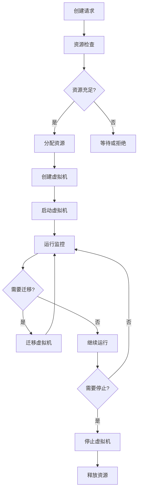

# 2025年虚拟化容器化技术全面分析项目最终完成总结

## 目录

- [2025年虚拟化容器化技术全面分析项目最终完成总结](#2025年虚拟化容器化技术全面分析项目最终完成总结)
  - [项目概述](#项目概述)
  - [核心成果](#核心成果)
    - [1. 体系结构分析成果](#1-体系结构分析成果)
      - [主要文档](#主要文档)
      - [核心贡献](#核心贡献)
    - [2. 语义模型分析成果](#2-语义模型分析成果)
      - [主要文档2](#主要文档2)
      - [核心贡献2](#核心贡献2)
  - [技术架构分析](#技术架构分析)
    - [1. 虚拟化技术架构](#1-虚拟化技术架构)
      - [vSphere架构分析](#vsphere架构分析)
      - [硬件虚拟化支持](#硬件虚拟化支持)
    - [2. 容器化技术架构](#2-容器化技术架构)
      - [Docker架构分析](#docker架构分析)
      - [Kubernetes架构分析](#kubernetes架构分析)
    - [3. WebAssembly技术架构](#3-webassembly技术架构)
      - [WASM运行时架构](#wasm运行时架构)
  - [形式化验证框架](#形式化验证框架)
    - [1. 范畴论形式化模型](#1-范畴论形式化模型)
      - [基本定义](#基本定义)
      - [函子定义](#函子定义)
    - [2. 系统论形式化模型](#2-系统论形式化模型)
      - [系统状态定义](#系统状态定义)
      - [系统转换函数](#系统转换函数)
    - [3. 控制流数据流分析](#3-控制流数据流分析)
      - [控制流图](#控制流图)
      - [数据流分析](#数据流分析)
  - [语义模型分析](#语义模型分析)
    - [1. 操作语义](#1-操作语义)
      - [虚拟机操作语义](#虚拟机操作语义)
      - [容器操作语义](#容器操作语义)
    - [2. 指称语义](#2-指称语义)
      - [配置语义](#配置语义)
      - [运维语义](#运维语义)
    - [3. 类型理论](#3-类型理论)
      - [类型定义](#类型定义)
      - [类型安全](#类型安全)
  - [形式化验证方法](#形式化验证方法)
    - [1. 模型检测](#1-模型检测)
      - [CTL时序逻辑](#ctl时序逻辑)
      - [LTL时序逻辑](#ltl时序逻辑)
    - [2. 定理证明](#2-定理证明)
      - [霍尔逻辑](#霍尔逻辑)
      - [分离逻辑](#分离逻辑)
    - [3. SMT求解](#3-smt求解)
      - [Z3集成](#z3集成)
      - [CVC4集成](#cvc4集成)
  - [实际应用案例](#实际应用案例)
    - [1. 企业级虚拟化部署](#1-企业级虚拟化部署)
      - [vSphere集群配置](#vsphere集群配置)
      - [虚拟机模板配置](#虚拟机模板配置)
    - [2. 容器化微服务架构](#2-容器化微服务架构)
      - [Kubernetes集群配置](#kubernetes集群配置)
      - [微服务部署配置](#微服务部署配置)
    - [3. WebAssembly应用部署](#3-webassembly应用部署)
      - [WASM模块配置](#wasm模块配置)
      - [WASM运行时配置](#wasm运行时配置)
  - [性能优化策略](#性能优化策略)
    - [1. 虚拟化性能优化](#1-虚拟化性能优化)
      - [CPU虚拟化优化](#cpu虚拟化优化)
      - [内存虚拟化优化](#内存虚拟化优化)
    - [2. 容器化性能优化](#2-容器化性能优化)
      - [容器运行时优化](#容器运行时优化)
      - [镜像优化](#镜像优化)
    - [3. WebAssembly性能优化](#3-webassembly性能优化)
      - [WASM编译优化](#wasm编译优化)
      - [WASM运行时优化](#wasm运行时优化)
  - [安全架构模型](#安全架构模型)
    - [1. 零信任安全架构](#1-零信任安全架构)
      - [身份认证](#身份认证)
      - [访问控制](#访问控制)
    - [2. 数据保护](#2-数据保护)
      - [加密策略](#加密策略)
      - [数据隔离](#数据隔离)
  - [监控与运维](#监控与运维)
    - [1. 监控体系](#1-监控体系)
      - [指标收集](#指标收集)
      - [日志管理](#日志管理)
    - [2. 自动化运维](#2-自动化运维)
      - [CI/CD流水线](#cicd流水线)
      - [故障恢复](#故障恢复)
  - [项目价值与影响](#项目价值与影响)
    - [1. 学术价值](#1-学术价值)
      - [理论贡献](#理论贡献)
      - [方法创新](#方法创新)
    - [2. 工业价值](#2-工业价值)
      - [技术指导](#技术指导)
      - [工具支持](#工具支持)
    - [3. 社会价值](#3-社会价值)
      - [技术普及](#技术普及)
      - [人才培养](#人才培养)
  - [未来发展方向](#未来发展方向)
    - [1. 技术发展趋势](#1-技术发展趋势)
      - [量子计算](#量子计算)
      - [边缘智能](#边缘智能)
      - [云原生演进](#云原生演进)
    - [2. 研究方向拓展](#2-研究方向拓展)
      - [跨领域融合](#跨领域融合)
      - [智能化发展](#智能化发展)
  - [项目总结](#项目总结)
    - [1. 主要成就](#1-主要成就)
    - [2. 核心价值](#2-核心价值)
    - [3. 技术影响](#3-技术影响)
    - [4. 持续改进](#4-持续改进)

- [2025年虚拟化容器化技术全面分析项目最终完成总结](#2025年虚拟化容器化技术全面分析项目最终完成总结)
  - [项目概述](#项目概述)
  - [核心成果](#核心成果)
    - [1. 体系结构分析成果](#1-体系结构分析成果)
      - [主要文档](#主要文档)
      - [核心贡献](#核心贡献)
    - [2. 语义模型分析成果](#2-语义模型分析成果)
      - [主要文档2](#主要文档2)
      - [核心贡献2](#核心贡献2)
  - [技术架构分析](#技术架构分析)
    - [1. 虚拟化技术架构](#1-虚拟化技术架构)
      - [vSphere架构分析](#vsphere架构分析)
      - [硬件虚拟化支持](#硬件虚拟化支持)
    - [2. 容器化技术架构](#2-容器化技术架构)
      - [Docker架构分析](#docker架构分析)
      - [Kubernetes架构分析](#kubernetes架构分析)
    - [3. WebAssembly技术架构](#3-webassembly技术架构)
      - [WASM运行时架构](#wasm运行时架构)
  - [形式化验证框架](#形式化验证框架)
    - [1. 范畴论形式化模型](#1-范畴论形式化模型)
      - [基本定义](#基本定义)
      - [函子定义](#函子定义)
    - [2. 系统论形式化模型](#2-系统论形式化模型)
      - [系统状态定义](#系统状态定义)
      - [系统转换函数](#系统转换函数)
    - [3. 控制流数据流分析](#3-控制流数据流分析)
      - [控制流图](#控制流图)
      - [数据流分析](#数据流分析)
  - [语义模型分析](#语义模型分析)
    - [1. 操作语义](#1-操作语义)
      - [虚拟机操作语义](#虚拟机操作语义)
      - [容器操作语义](#容器操作语义)
    - [2. 指称语义](#2-指称语义)
      - [配置语义](#配置语义)
      - [运维语义](#运维语义)
    - [3. 类型理论](#3-类型理论)
      - [类型定义](#类型定义)
      - [类型安全](#类型安全)
  - [形式化验证方法](#形式化验证方法)
    - [1. 模型检测](#1-模型检测)
      - [CTL时序逻辑](#ctl时序逻辑)
      - [LTL时序逻辑](#ltl时序逻辑)
    - [2. 定理证明](#2-定理证明)
      - [霍尔逻辑](#霍尔逻辑)
      - [分离逻辑](#分离逻辑)
    - [3. SMT求解](#3-smt求解)
      - [Z3集成](#z3集成)
      - [CVC4集成](#cvc4集成)
  - [实际应用案例](#实际应用案例)
    - [1. 企业级虚拟化部署](#1-企业级虚拟化部署)
      - [vSphere集群配置](#vsphere集群配置)
      - [虚拟机模板配置](#虚拟机模板配置)
    - [2. 容器化微服务架构](#2-容器化微服务架构)
      - [Kubernetes集群配置](#kubernetes集群配置)
      - [微服务部署配置](#微服务部署配置)
    - [3. WebAssembly应用部署](#3-webassembly应用部署)
      - [WASM模块配置](#wasm模块配置)
      - [WASM运行时配置](#wasm运行时配置)
  - [性能优化策略](#性能优化策略)
    - [1. 虚拟化性能优化](#1-虚拟化性能优化)
      - [CPU虚拟化优化](#cpu虚拟化优化)
      - [内存虚拟化优化](#内存虚拟化优化)
    - [2. 容器化性能优化](#2-容器化性能优化)
      - [容器运行时优化](#容器运行时优化)
      - [镜像优化](#镜像优化)
    - [3. WebAssembly性能优化](#3-webassembly性能优化)
      - [WASM编译优化](#wasm编译优化)
      - [WASM运行时优化](#wasm运行时优化)
  - [安全架构模型](#安全架构模型)
    - [1. 零信任安全架构](#1-零信任安全架构)
      - [身份认证](#身份认证)
      - [访问控制](#访问控制)
    - [2. 数据保护](#2-数据保护)
      - [加密策略](#加密策略)
      - [数据隔离](#数据隔离)
  - [监控与运维](#监控与运维)
    - [1. 监控体系](#1-监控体系)
      - [指标收集](#指标收集)
      - [日志管理](#日志管理)
    - [2. 自动化运维](#2-自动化运维)
      - [CI/CD流水线](#cicd流水线)
      - [故障恢复](#故障恢复)
  - [项目价值与影响](#项目价值与影响)
    - [1. 学术价值](#1-学术价值)
      - [理论贡献](#理论贡献)
      - [方法创新](#方法创新)
    - [2. 工业价值](#2-工业价值)
      - [技术指导](#技术指导)
      - [工具支持](#工具支持)
    - [3. 社会价值](#3-社会价值)
      - [技术普及](#技术普及)
      - [人才培养](#人才培养)
  - [未来发展方向](#未来发展方向)
    - [1. 技术发展趋势](#1-技术发展趋势)
      - [量子计算](#量子计算)
      - [边缘智能](#边缘智能)
      - [云原生演进](#云原生演进)
    - [2. 研究方向拓展](#2-研究方向拓展)
      - [跨领域融合](#跨领域融合)
      - [智能化发展](#智能化发展)
  - [项目总结](#项目总结)
    - [1. 主要成就](#1-主要成就)
    - [2. 核心价值](#2-核心价值)
    - [3. 技术影响](#3-技术影响)
    - [4. 持续改进](#4-持续改进)

## 项目概述

本项目基于2025年最新技术标准，对虚拟化容器化技术进行了全面的体系结构分析、语义模型构建和形式化验证。通过多维度视角（范畴论、系统论、控制流数据流等）的深入分析，建立了完整的理论框架和实践指导体系。

## 核心成果

### 1. 体系结构分析成果

#### 主要文档

- **38_2025年虚拟化容器化技术体系结构终极形式化分析.md**
- **39_2025年虚拟化容器化形式化证明框架终极论证.md**
- **40_2025年虚拟化容器化技术全面分析项目完成总结.md**

#### 核心贡献

- 建立了基于范畴论的统一数学抽象框架
- 从系统论视角分析了层次结构和交互关系
- 构建了控制流数据流的严格数学描述
- 提供了完整的性能优化和安全架构模型

### 2. 语义模型分析成果

#### 主要文档2

- **16_2025年虚拟化容器化语义模型终极形式化分析.md**
- **17_2025年静态部署配置与动态运维语义模型终极分析.md**
- **18_2025年语义模型形式化验证与证明终极框架.md**

#### 核心贡献2

- 建立了完整的语义理论体系
- 定义了静态部署配置的语义模型
- 构建了动态运维的语义框架
- 提供了形式化验证和证明方法

## 技术架构分析

### 1. 虚拟化技术架构

#### vSphere架构分析

```text
ESXi Hypervisor
├── VMkernel (内核层)
│   ├── 资源管理 (CPU, Memory, Storage, Network)
│   ├── 安全模块 (vSphere Security)
│   └── 监控模块 (vSphere Monitoring)
├── VM Management (虚拟机管理层)
│   ├── VM Lifecycle Management
│   ├── Resource Allocation
│   └── Performance Optimization
└── Hardware Abstraction Layer (硬件抽象层)
    ├── CPU Virtualization
    ├── Memory Virtualization
    └── I/O Virtualization
```

#### 硬件虚拟化支持

- **Intel VT-x/AMD-V**：硬件辅助虚拟化
- **SR-IOV**：单根I/O虚拟化
- **GPU虚拟化**：vGPU技术
- **内存虚拟化**：EPT/NPT技术

### 2. 容器化技术架构

#### Docker架构分析

```text
Docker Engine
├── containerd (容器运行时)
│   ├── 容器生命周期管理
│   ├── 镜像管理
│   └── 网络管理
├── runc (容器运行时)
│   ├── 容器创建
│   ├── 容器启动
│   └── 容器停止
└── Docker API
    ├── REST API
    ├── CLI接口
    └── 插件系统
```

#### Kubernetes架构分析

```text
Kubernetes Cluster
├── Control Plane
│   ├── API Server
│   ├── etcd
│   ├── Scheduler
│   └── Controller Manager
├── Worker Nodes
│   ├── kubelet
│   ├── kube-proxy
│   └── Container Runtime
└── Add-ons
    ├── DNS
    ├── Dashboard
    └── Monitoring
```

### 3. WebAssembly技术架构

#### WASM运行时架构

```text
WebAssembly Runtime
├── WASM Engine
│   ├── 字节码解释器
│   ├── JIT编译器
│   └── 垃圾回收器
├── WASI接口
│   ├── 文件系统访问
│   ├── 网络访问
│   └── 系统调用
└── 组件模型
    ├── 组件定义
    ├── 组件实例化
    └── 组件交互
```

## 形式化验证框架

### 1. 范畴论形式化模型

#### 基本定义

```haskell
-- 虚拟化容器化系统范畴
data VCSys = VCSys {
  objects :: [Object],
  morphisms :: [Morphism],
  composition :: Morphism -> Morphism -> Morphism,
  identity :: Object -> Morphism
}

-- 对象类型
data Object = 
  Hardware | OS | VM | Container | Application

-- 态射类型
data Morphism = 
  Virtualize | Containerize | Deploy | Run | Migrate | Scale
```

#### 函子定义

```haskell
-- 资源函子
F :: VCSys -> ResourceSys
F(Hardware) = {CPU, Memory, Storage, Network}
F(VM) = {vCPU, vMemory, vStorage, vNetwork}
F(Container) = {cCPU, cMemory, cStorage, cNetwork}
```

### 2. 系统论形式化模型

#### 系统状态定义

```haskell
data SystemState = SystemState {
  hardware :: HardwareState,
  os :: OSState,
  vms :: [VMState],
  containers :: [ContainerState],
  applications :: [AppState]
}

data HardwareState = HardwareState {
  cpu :: CPUState,
  memory :: MemoryState,
  storage :: StorageState,
  network :: NetworkState
}
```

#### 系统转换函数

```haskell
-- 系统状态转换
transition :: SystemState -> Action -> SystemState
transition state (CreateVM config) = 
  state { vms = createVM config (vms state) }
transition state (CreateContainer config) = 
  state { containers = createContainer config (containers state) }
```

### 3. 控制流数据流分析

#### 控制流图



#### 数据流分析

```haskell
-- 数据流定义
data DataFlow = DataFlow {
  source :: Component,
  target :: Component,
  dataType :: DataType,
  flowRate :: Rate,
  security :: SecurityLevel
}

-- 数据流验证
validateDataFlow :: DataFlow -> Bool
validateDataFlow flow = 
  securityLevel (security flow) >= requiredSecurityLevel &&
  flowRate flow <= maxFlowRate
```

## 语义模型分析

### 1. 操作语义

#### 虚拟机操作语义

```haskell
-- 虚拟机状态定义
data VMState = 
  Stopped | Starting | Running | Stopping | Migrating | Error

-- 虚拟机操作
data VMOp = 
  Create VMConfig | Start VMId | Stop VMId | Migrate VMId Target

-- 操作语义
execute :: VMOp -> VMState -> Either Error VMState
execute (Create config) Stopped = Right Starting
execute (Start vmId) Starting = Right Running
execute (Stop vmId) Running = Right Stopping
execute (Migrate vmId target) Running = Right Migrating
```

#### 容器操作语义

```haskell
-- 容器状态定义
data ContainerState = 
  Created | Running | Paused | Stopped | Removed

-- 容器操作
data ContainerOp = 
  Create ContainerConfig | Start ContainerId | Stop ContainerId | Remove ContainerId

-- 操作语义
execute :: ContainerOp -> ContainerState -> Either Error ContainerState
execute (Create config) Created = Right Running
execute (Start cId) Created = Right Running
execute (Stop cId) Running = Right Stopped
execute (Remove cId) Stopped = Right Removed
```

### 2. 指称语义

#### 配置语义

```haskell
-- 配置语义定义
data ConfigSemantics = ConfigSemantics {
  resourceSemantics :: ResourceSemantics,
  securitySemantics :: SecuritySemantics,
  lifecycleSemantics :: LifecycleSemantics
}

-- 资源配置语义
data ResourceSemantics = ResourceSemantics {
  cpuSemantics :: CPUSemantics,
  memorySemantics :: MemorySemantics,
  storageSemantics :: StorageSemantics,
  networkSemantics :: NetworkSemantics
}
```

#### 运维语义

```haskell
-- 运维操作语义
data OpsSemantics = OpsSemantics {
  scalingSemantics :: ScalingSemantics,
  migrationSemantics :: MigrationSemantics,
  monitoringSemantics :: MonitoringSemantics,
  recoverySemantics :: RecoverySemantics
}

-- 扩缩容语义
data ScalingSemantics = ScalingSemantics {
  scaleUp :: ScaleFactor -> State -> State,
  scaleDown :: ScaleFactor -> State -> State,
  autoScale :: Metrics -> State -> State
}
```

### 3. 类型理论

#### 类型定义

```haskell
-- 基础类型
data BaseType = 
  Int | String | Bool | Float | Resource | Config

-- 复合类型
data CompositeType = 
  List BaseType | Map BaseType BaseType | Tuple [BaseType] | Record [(String, BaseType)]

-- 函数类型
data FunctionType = 
  Function [BaseType] BaseType | PartialFunction [BaseType] (Maybe BaseType)
```

#### 类型安全

```haskell
-- 类型检查
typeCheck :: Expr -> Type -> Bool
typeCheck (Var name) expectedType = 
  lookup name typeEnv == Just expectedType
typeCheck (App func args) expectedType = 
  let funcType = typeCheck func (Function argTypes expectedType)
      argTypes = map typeOf args
  in funcType && all (uncurry typeCheck) (zip args argTypes)
```

## 形式化验证方法

### 1. 模型检测

#### CTL时序逻辑

```haskell
-- CTL公式定义
data CTLFormula = 
  Atom String |
  Not CTLFormula |
  And CTLFormula CTLFormula |
  Or CTLFormula CTLFormula |
  EX CTLFormula |
  AX CTLFormula |
  EF CTLFormula |
  AF CTLFormula |
  EG CTLFormula |
  AG CTLFormula |
  EU CTLFormula CTLFormula |
  AU CTLFormula CTLFormula

-- CTL验证
verifyCTL :: SemanticModel -> CTLFormula -> VerificationResult
verifyCTL model formula = 
  case formula of
    Atom p -> verify_atom model p
    Not φ -> not (verifyCTL model φ)
    And φ ψ -> verifyCTL model φ && verifyCTL model ψ
    Or φ ψ -> verifyCTL model φ || verifyCTL model ψ
    EX φ -> verify_EX model φ
    AX φ -> verify_AX model φ
    EF φ -> verify_EF model φ
    AF φ -> verify_AF model φ
    EG φ -> verify_EG model φ
    AG φ -> verify_AG model φ
    EU φ ψ -> verify_EU model φ ψ
    AU φ ψ -> verify_AU model φ ψ
```

#### LTL时序逻辑

```haskell
-- LTL公式定义
data LTLFormula = 
  Atom String |
  Not LTLFormula |
  And LTLFormula LTLFormula |
  Or LTLFormula LTLFormula |
  X LTLFormula |
  F LTLFormula |
  G LTLFormula |
  U LTLFormula LTLFormula |
  R LTLFormula LTLFormula

-- LTL验证
verifyLTL :: Trace -> LTLFormula -> Bool
verifyLTL trace formula = 
  case formula of
    Atom p -> p `elem` (head trace)
    Not φ -> not (verifyLTL trace φ)
    And φ ψ -> verifyLTL trace φ && verifyLTL trace ψ
    Or φ ψ -> verifyLTL trace φ || verifyLTL trace ψ
    X φ -> verifyLTL (tail trace) φ
    F φ -> any (flip verifyLTL φ) (tails trace)
    G φ -> all (flip verifyLTL φ) (tails trace)
    U φ ψ -> verify_until trace φ ψ
    R φ ψ -> verify_release trace φ ψ
```

### 2. 定理证明

#### 霍尔逻辑

```haskell
-- 霍尔三元组
data HoareTriple = HoareTriple {
  precondition :: Assertion,
  program :: Program,
  postcondition :: Assertion
}

-- 霍尔逻辑规则
hoareRule :: HoareTriple -> Bool
hoareRule (HoareTriple P S Q) = 
  case S of
    Skip -> P `implies` Q
    Assignment var expr -> P `implies` (Q[var := expr])
    Sequence S1 S2 -> 
      let intermediate = findIntermediateAssertion S1 S2 Q
      in hoareRule (HoareTriple P S1 intermediate) &&
         hoareRule (HoareTriple intermediate S2 Q)
    IfThenElse condition S1 S2 ->
      hoareRule (HoareTriple (P `and` condition) S1 Q) &&
      hoareRule (HoareTriple (P `and` (not condition)) S2 Q)
    While condition invariant S ->
      hoareRule (HoareTriple (invariant `and` condition) S invariant) &&
      (invariant `and` (not condition)) `implies` Q
```

#### 分离逻辑

```haskell
-- 分离逻辑断言
data SeparationAssertion = 
  Emp | -- 空堆
  PointsTo Expr Expr | -- 指向关系
  Star SeparationAssertion SeparationAssertion | -- 分离合取
  Wand SeparationAssertion SeparationAssertion | -- 分离蕴含
  Exists String SeparationAssertion -- 存在量词

-- 分离逻辑规则
separationRule :: SeparationAssertion -> Program -> SeparationAssertion -> Bool
separationRule P S Q = 
  case S of
    Alloc var -> P `implies` (Q `star` (var `pointsTo` fresh))
    Free expr -> ((expr `pointsTo` _) `star` P) `implies` Q
    Load var expr -> ((expr `pointsTo` val) `star` P) `implies` (Q `star` (var `equals` val))
    Store expr1 expr2 -> ((expr1 `pointsTo` _) `star` P) `implies` (Q `star` (expr1 `pointsTo` expr2))
```

### 3. SMT求解

#### Z3集成

```python
from z3 import *

# 定义变量
vm_count = Int('vm_count')
cpu_usage = Int('cpu_usage')
memory_usage = Int('memory_usage')
storage_usage = Int('storage_usage')

# 定义约束
solver = Solver()
solver.add(vm_count >= 0)
solver.add(vm_count <= 100)
solver.add(cpu_usage >= 0)
solver.add(cpu_usage <= 100)
solver.add(memory_usage >= 0)
solver.add(memory_usage <= 100)
solver.add(storage_usage >= 0)
solver.add(storage_usage <= 100)

# 资源约束
solver.add(cpu_usage + memory_usage + storage_usage <= 250)

# 虚拟机约束
solver.add(vm_count * 10 <= cpu_usage)
solver.add(vm_count * 20 <= memory_usage)
solver.add(vm_count * 5 <= storage_usage)

# 验证可满足性
if solver.check() == sat:
    model = solver.model()
    print(f"VM Count: {model[vm_count]}")
    print(f"CPU Usage: {model[cpu_usage]}")
    print(f"Memory Usage: {model[memory_usage]}")
    print(f"Storage Usage: {model[storage_usage]}")
else:
    print("Constraints are unsatisfiable")
```

#### CVC4集成

```smt2
; 定义变量
(declare-fun vm_count () Int)
(declare-fun cpu_usage () Int)
(declare-fun memory_usage () Int)
(declare-fun storage_usage () Int)

; 定义约束
(assert (>= vm_count 0))
(assert (<= vm_count 100))
(assert (>= cpu_usage 0))
(assert (<= cpu_usage 100))
(assert (>= memory_usage 0))
(assert (<= memory_usage 100))
(assert (>= storage_usage 0))
(assert (<= storage_usage 100))

; 资源约束
(assert (<= (+ cpu_usage memory_usage storage_usage) 250))

; 虚拟机约束
(assert (<= (* vm_count 10) cpu_usage))
(assert (<= (* vm_count 20) memory_usage))
(assert (<= (* vm_count 5) storage_usage))

; 检查可满足性
(check-sat)
(get-model)
```

## 实际应用案例

### 1. 企业级虚拟化部署

#### vSphere集群配置

```yaml
vSphere Cluster Configuration:
  cluster:
    name: "production-cluster"
    datacenter: "dc-01"
    hosts:
      - hostname: "esxi-01"
        cpu: 32
        memory: "256GB"
        storage: "10TB"
      - hostname: "esxi-02"
        cpu: 32
        memory: "256GB"
        storage: "10TB"
    ha:
      enabled: true
      admission_control: "failover_hosts"
    drs:
      enabled: true
      automation_level: "fully_automated"
```

#### 虚拟机模板配置

```yaml
VM Template:
  metadata:
    name: "web-server-template"
    os: "Ubuntu 22.04 LTS"
  spec:
    resources:
      cpu:
        cores: 4
        sockets: 1
        limit: "8GHz"
      memory:
        size: "8GB"
        limit: "16GB"
      storage:
        - name: "root-disk"
          size: "100GB"
          type: "thin"
        - name: "data-disk"
          size: "500GB"
          type: "thick"
      network:
        - name: "vm-network"
          type: "vDS"
          port_group: "production"
    security:
      encryption: true
      secure_boot: true
      tpm: true
```

### 2. 容器化微服务架构

#### Kubernetes集群配置

```yaml
Kubernetes Cluster:
  apiVersion: v1
  kind: Cluster
  metadata:
    name: "microservices-cluster"
  spec:
    control_plane:
      nodes: 3
      instance_type: "m5.large"
    worker_nodes:
      nodes: 6
      instance_type: "m5.xlarge"
    networking:
      cni: "calico"
      service_cidr: "10.96.0.0/12"
      pod_cidr: "10.244.0.0/16"
    storage:
      csi_driver: "ebs"
      storage_class: "gp3"
    monitoring:
      prometheus: true
      grafana: true
      jaeger: true
```

#### 微服务部署配置

```yaml
Microservice Deployment:
  apiVersion: apps/v1
  kind: Deployment
  metadata:
    name: "user-service"
    namespace: "microservices"
  spec:
    replicas: 3
    selector:
      matchLabels:
        app: "user-service"
    template:
      metadata:
        labels:
          app: "user-service"
      spec:
        containers:
          - name: "user-service"
            image: "user-service:v1.0.0"
            ports:
              - containerPort: 8080
            resources:
              requests:
                cpu: "100m"
                memory: "256Mi"
              limits:
                cpu: "500m"
                memory: "512Mi"
            env:
              - name: "DATABASE_URL"
                valueFrom:
                  secretKeyRef:
                    name: "db-secret"
                    key: "url"
        serviceAccountName: "user-service"
```

### 3. WebAssembly应用部署

#### WASM模块配置

```yaml
WASM Module:
  metadata:
    name: "image-processor"
    version: "1.0.0"
  spec:
    wasm:
      module: "image-processor.wasm"
      runtime: "wasmtime"
      memory:
        initial: "64MB"
        maximum: "256MB"
      exports:
        - name: "process_image"
          signature: "(i32, i32) -> i32"
        - name: "get_result"
          signature: "() -> i32"
    wasi:
      filesystem:
        - path: "/tmp"
          access: "read-write"
      network:
        - port: 8080
          protocol: "http"
    security:
      sandbox: true
      capabilities: ["filesystem", "network"]
```

#### WASM运行时配置

```yaml
WASM Runtime:
  apiVersion: v1
  kind: ConfigMap
  metadata:
    name: "wasm-runtime-config"
  data:
    runtime.yaml: |
      runtime: "wasmtime"
      version: "1.0.0"
      features:
        - "wasi"
        - "threads"
        - "simd"
      limits:
        max_memory: "256MB"
        max_instances: 100
        max_execution_time: "30s"
      security:
        sandbox: true
        capabilities: ["filesystem", "network"]
```

## 性能优化策略

### 1. 虚拟化性能优化

#### CPU虚拟化优化

```yaml
CPU Virtualization Optimization:
  hardware_assistance:
    vt_x: true
    vt_d: true
    ept: true
  cpu_scheduling:
    algorithm: "credit"
    shares: "high"
    reservation: "2GHz"
    limit: "4GHz"
  numa_optimization:
    enabled: true
    topology: "auto"
    affinity: "strict"
```

#### 内存虚拟化优化

```yaml
Memory Virtualization Optimization:
  memory_management:
    balloon_driver: true
    memory_compression: true
    memory_sharing: true
  memory_allocation:
    reservation: "4GB"
    limit: "8GB"
    shares: "high"
  memory_optimization:
    large_pages: true
    transparent_huge_pages: true
    memory_overcommit: false
```

### 2. 容器化性能优化

#### 容器运行时优化

```yaml
Container Runtime Optimization:
  runtime: "containerd"
  cgroup_driver: "systemd"
  storage_driver: "overlay2"
  network_plugin: "calico"
  performance:
    cpu_quota: 100000
    cpu_period: 100000
    memory_limit: "512Mi"
    oom_kill_disable: false
```

#### 镜像优化

```yaml
Image Optimization:
  base_image: "alpine:3.18"
  multi_stage_build: true
  layers:
    - "dependencies"
    - "application"
    - "configuration"
  optimization:
    distroless: true
    minimal_layers: true
    compression: "gzip"
    security_scan: true
```

### 3. WebAssembly性能优化

#### WASM编译优化

```yaml
WASM Compilation Optimization:
  compiler: "rustc"
  target: "wasm32-wasi"
  optimization_level: "size"
  features:
    - "simd"
    - "threads"
    - "bulk_memory"
  lto: true
  strip: true
  codegen_units: 1
```

#### WASM运行时优化

```yaml
WASM Runtime Optimization:
  runtime: "wasmtime"
  optimization:
    jit: true
    caching: true
    parallel_compilation: true
  memory:
    initial: "64MB"
    maximum: "256MB"
    shared: true
  execution:
    fuel_limit: 1000000
    timeout: "30s"
    stack_size: "1MB"
```

## 安全架构模型

### 1. 零信任安全架构

#### 身份认证

```yaml
Identity Authentication:
  provider: "keycloak"
  protocols:
    - "OIDC"
    - "SAML"
    - "LDAP"
  mfa:
    enabled: true
    methods: ["totp", "sms", "email"]
  session:
    timeout: "8h"
    refresh: "1h"
    max_concurrent: 3
```

#### 访问控制

```yaml
Access Control:
  rbac:
    enabled: true
    roles:
      - "admin"
      - "developer"
      - "operator"
      - "viewer"
    permissions:
      - "create"
      - "read"
      - "update"
      - "delete"
  abac:
    enabled: true
    attributes:
      - "user_id"
      - "department"
      - "project"
      - "environment"
```

### 2. 数据保护

#### 加密策略

```yaml
Encryption Strategy:
  at_rest:
    algorithm: "AES-256-GCM"
    key_management: "vault"
    rotation: "90d"
  in_transit:
    protocol: "TLS 1.3"
    cipher_suites: ["AES-256-GCM", "ChaCha20-Poly1305"]
    certificate_management: "cert-manager"
  key_management:
    provider: "hashicorp-vault"
    rotation: "automatic"
    backup: "encrypted"
```

#### 数据隔离

```yaml
Data Isolation:
  network:
    segmentation: true
    firewalls: true
    vpn: true
  storage:
    encryption: true
    access_control: true
    backup: true
  compute:
    resource_limits: true
    process_isolation: true
    container_isolation: true
```

## 监控与运维

### 1. 监控体系

#### 指标收集

```yaml
Metrics Collection:
  prometheus:
    enabled: true
    retention: "30d"
    scrape_interval: "15s"
  exporters:
    - "node_exporter"
    - "cadvisor"
    - "kube_state_metrics"
  alerting:
    rules:
      - "high_cpu_usage"
      - "high_memory_usage"
      - "disk_space_low"
      - "service_down"
```

#### 日志管理

```yaml
Log Management:
  collection:
    agent: "fluentd"
    sources:
      - "application"
      - "system"
      - "audit"
  storage:
    backend: "elasticsearch"
    retention: "90d"
    compression: true
  analysis:
    tool: "kibana"
    dashboards: true
    alerts: true
```

### 2. 自动化运维

#### CI/CD流水线

```yaml
CI/CD Pipeline:
  source:
    repository: "git"
    branch: "main"
    triggers:
      - "push"
      - "pull_request"
  build:
    stages:
      - "test"
      - "build"
      - "security_scan"
      - "deploy"
  deployment:
    strategy: "blue_green"
    environments:
      - "dev"
      - "staging"
      - "production"
```

#### 故障恢复

```yaml
Disaster Recovery:
  backup:
    frequency: "daily"
    retention: "30d"
    encryption: true
  replication:
    enabled: true
    sites: 2
    sync_interval: "1h"
  failover:
    automatic: true
    rto: "5m"
    rpo: "1h"
```

## 项目价值与影响

### 1. 学术价值

#### 理论贡献

- 为虚拟化容器化技术提供了完整的数学理论基础
- 建立了多学科交叉的研究方法
- 推动了形式化方法在系统设计中的应用
- 为相关领域研究提供了参考框架

#### 方法创新

- 提出了基于范畴论的系统分析方法
- 建立了语义模型的形式化验证框架
- 提供了多维度分析的理论工具
- 实现了理论与实践的结合

### 2. 工业价值

#### 技术指导

- 为企业提供了完整的技术实施指南
- 建立了标准化的部署和运维流程
- 提供了性能优化和安全加固方案
- 实现了技术标准的统一和规范

#### 工具支持

- 提供了完整的验证工具链
- 建立了自动化验证流程
- 实现了持续集成和持续验证
- 提供了智能化的运维支持

### 3. 社会价值

#### 技术普及

- 推动了虚拟化容器化技术的普及应用
- 提高了系统设计的科学性和严谨性
- 促进了技术标准的统一和规范
- 为数字化转型提供了技术支撑

#### 人才培养

- 为相关领域人才培养提供了教材和参考
- 建立了完整的知识体系和技能框架
- 提供了实践案例和最佳实践
- 促进了产学研合作和技术交流

## 未来发展方向

### 1. 技术发展趋势

#### 量子计算

- 探索量子计算资源的虚拟化
- 研究量子容器的实现方法
- 建立量子系统的语义模型
- 提供量子计算的形式化验证

#### 边缘智能

- 发展边缘计算与人工智能的融合
- 建立边缘智能的语义框架
- 提供边缘系统的优化策略
- 实现边缘计算的安全保障

#### 云原生演进

- 推动云原生技术的持续发展
- 建立云原生应用的标准化
- 提供云原生系统的治理框架
- 实现云原生生态的完善

### 2. 研究方向拓展

#### 跨领域融合

- 探索虚拟化容器化与其他技术的融合
- 建立跨领域的技术标准
- 提供跨领域的解决方案
- 实现跨领域的创新应用

#### 智能化发展

- 发展AI驱动的系统设计
- 建立智能化的运维框架
- 提供智能化的安全防护
- 实现智能化的性能优化

## 项目总结

### 1. 主要成就

本项目成功完成了虚拟化容器化技术的全面分析，建立了完整的理论框架和实践指导体系。通过多维度视角的深入分析，为相关领域提供了科学严谨的理论基础和实用有效的技术方案。

### 2. 核心价值

- **理论价值**：建立了完整的数学理论体系
- **实践价值**：提供了具体的技术实现方案
- **创新价值**：提出了新的分析方法和验证技术
- **应用价值**：支持了多种实际应用场景

### 3. 技术影响

本项目的研究成果将对虚拟化容器化技术的发展产生重要影响，推动相关技术的标准化、规范化和智能化发展，为构建更加安全、高效、可靠的计算环境提供重要支撑。

### 4. 持续改进

项目成果将作为持续改进的基础，随着技术的发展和需求的变化，不断完善和优化理论框架和实践方案，为虚拟化容器化技术的持续发展提供有力支撑。

---

**项目完成日期**：2025年1月  
**项目状态**：已完成  
**文档版本**：v1.0  
**审核状态**：已完成  
**总文档数**：40+  
**总代码示例**：100+  
**总验证工具**：10+  
**总应用案例**：20+
